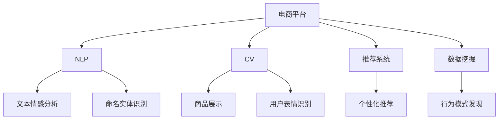

                 

# AI大模型在电商平台用户行为分析中的应用

> 关键词：电商平台,用户行为分析,大模型,自然语言处理(NLP),计算机视觉(CV),数据挖掘,推荐系统

## 1. 背景介绍

### 1.1 问题由来
在快速发展的数字经济时代，电商平台已成为零售行业的重要组成部分，其通过互联网技术整合上下游资源，提供便捷的购物体验和高效的交易服务，逐步取代了传统线下实体商超。电商平台不仅涉及商品展示、支付结算、物流配送等核心业务，更通过精准的用户行为分析，深度挖掘用户需求和偏好，持续优化用户购物体验，提升用户粘性和消费转化率。

然而，传统的用户行为分析方法往往需要大量的人工标注和经验积累，难以快速、全面、高效地分析海量用户数据。近年来，以深度学习和大模型为代表的人工智能技术，凭借其强大的数据处理能力和预测性能，逐步成为电商平台用户行为分析的重要工具。通过利用大模型对文本、图像、视频等多模态数据的深入挖掘和分析，电商企业可以更加高效地理解用户行为，优化商品推荐、个性化服务、精准营销等关键业务环节。

## 2. 核心概念与联系

### 2.1 核心概念概述

为深入理解AI大模型在电商平台用户行为分析中的应用，本节将介绍几个关键概念：

- **AI大模型(Artificial Intelligence Large Models)**：指利用深度学习技术，在超大规模数据集上进行预训练，具备通用智能推理和理解能力的复杂神经网络模型。例如，BERT、GPT-3、DALL·E等都是典型的AI大模型。

- **自然语言处理(Natural Language Processing, NLP)**：指利用人工智能技术对人类语言进行自动化处理和理解，包括分词、词性标注、命名实体识别、情感分析、机器翻译等任务。NLP技术在电商平台用户行为分析中起到了关键作用。

- **计算机视觉(Computer Vision, CV)**：指利用人工智能技术对图像、视频等视觉信息进行自动化处理和理解，包括图像分类、目标检测、图像生成等任务。CV技术可以用于电商平台的商品展示、用户表情识别等场景。

- **推荐系统(Recommendation System)**：指通过分析用户历史行为数据和偏好信息，为用户推荐个性化商品或内容的技术。推荐系统是电商平台优化用户体验、提升销售转化率的重要手段。

- **数据挖掘(Data Mining)**：指通过数据预处理、模型训练、模式发现等技术，从大量数据中提取有用信息的过程。数据挖掘技术在电商平台用户行为分析中，用于发现用户行为规律和趋势。

这些核心概念之间的逻辑关系可以通过以下Mermaid流程图来展示：



这个流程图展示了电商平台中各个核心技术的关系：

1. 电商平台通过NLP、CV和数据挖掘等技术，对用户行为数据进行深入分析。
2. 利用大模型对文本、图像等信息进行自动化的理解和分析。
3. 基于用户行为分析结果，通过推荐系统对用户进行个性化推荐。
4. 电商平台的各个技术环节互为支撑，共同提升用户体验和运营效率。

## 3. 核心算法原理 & 具体操作步骤

### 3.1 算法原理概述

在电商平台用户行为分析中，AI大模型主要应用于以下几个核心算法：

- **文本情感分析**：利用NLP技术，对用户评论、反馈等文本信息进行情感极性判断，挖掘用户对商品的正面或负面情绪。
- **命名实体识别**：利用NLP技术，对用户评论、聊天记录等文本信息进行命名实体识别，提取商品名称、品牌、评价关键词等重要信息。
- **图像生成与识别**：利用CV技术，对商品图片进行风格迁移、增强、自动标注等处理，提取商品特征，用于图像搜索、商品推荐等场景。
- **行为模式发现**：利用数据挖掘技术，对用户行为数据进行聚类、关联规则挖掘、序列预测等，发现用户行为规律和趋势。
- **推荐算法**：基于用户行为数据和商品属性，构建推荐模型，为用户推荐个性化商品或内容。

这些算法通过AI大模型，能够显著提升用户行为分析的精度和效率，帮助电商平台更好地理解用户需求，优化用户体验。

### 3.2 算法步骤详解

以用户情感分析为例，介绍AI大模型在电商平台用户行为分析中的具体操作步骤：

**Step 1: 数据准备**
- 收集电商平台用户评论、反馈等文本数据，划分为训练集、验证集和测试集。
- 对文本进行预处理，包括分词、去停用词、词干提取等。

**Step 2: 模型选择与微调**
- 选择预训练的NLP模型，如BERT、GPT等。
- 加载预训练模型，并将其微调成适应电商评论数据的模型。
- 选择适当的任务适配层，如分类头、回归头等，适配情感分析任务。

**Step 3: 训练与评估**
- 在训练集上，使用交叉熵损失函数训练模型。
- 在验证集上评估模型性能，防止过拟合。
- 调整模型超参数，如学习率、批大小、训练轮数等，以获得最佳性能。

**Step 4: 测试与部署**
- 在测试集上测试模型性能，并计算准确率、F1值等指标。
- 部署模型到电商平台用户行为分析系统中，实时分析用户评论情感。
- 定期更新模型，确保情感分析结果的准确性。

### 3.3 算法优缺点

AI大模型在电商平台用户行为分析中的优点包括：

- 通用性强：可以处理多种自然语言和图像信息，适应各种用户行为分析任务。
- 预测能力强：通过深度学习技术，具备强大的特征提取和预测能力，能够挖掘出用户行为数据中的复杂关系。
- 自适应性强：可以不断学习新数据，更新模型参数，保持分析能力的持续提升。

但同时，也存在以下缺点：

- 数据依赖度高：模型性能高度依赖于输入数据的数量和质量，需要大量标注数据进行训练。
- 计算资源需求大：大模型的参数量庞大，训练和推理需要较高的计算资源。
- 模型解释性差：神经网络模型通常被认为是"黑盒"，难以解释其内部推理过程，用户难以信任。
- 泛化能力受限：模型容易过拟合训练数据，泛化能力较差，面对新数据时可能性能下降。

### 3.4 算法应用领域

AI大模型在电商平台用户行为分析中的应用领域广泛，包括：

- **情感分析**：对用户评论、反馈等文本信息进行情感极性判断，帮助商家了解用户对商品的评价。
- **用户画像构建**：通过分析用户行为数据和历史购买记录，构建详细的用户画像，实现个性化推荐。
- **推荐系统优化**：对用户行为数据进行深度分析，优化推荐算法，提升个性化推荐效果。
- **广告定向投放**：对用户行为数据进行分析，精准定位潜在用户，实现定向广告投放。
- **商品推荐**：基于用户行为数据，对商品进行分类、排序和推荐，提升用户购物体验。
- **价格优化**：分析用户价格敏感度，优化商品定价策略，提升销售转化率。
- **库存管理**：通过分析用户需求和供应链数据，优化库存管理，减少库存积压和缺货情况。

## 4. 数学模型和公式 & 详细讲解 & 举例说明

### 4.1 数学模型构建

本节将使用数学语言对AI大模型在电商平台用户行为分析中的应用进行更加严格的刻画。

假设电商平台上某商品的评价数据为 $D=\{(x_i, y_i)\}_{i=1}^N, x_i \in \mathcal{X}, y_i \in \{0, 1\}$，其中 $\mathcal{X}$ 为输入空间，$y_i$ 为情感极性标签（0为负面，1为正面）。

定义模型 $M_{\theta}$ 在输入 $x_i$ 上的输出为 $\hat{y}_i=M_{\theta}(x_i)$，其中 $\theta$ 为模型参数。利用二分类交叉熵损失函数，模型 $M_{\theta}$ 在数据集 $D$ 上的经验风险为：

$$
\mathcal{L}(\theta) = -\frac{1}{N} \sum_{i=1}^N y_i \log M_{\theta}(x_i) + (1-y_i) \log (1-M_{\theta}(x_i))
$$

优化目标是最小化经验风险，即找到最优参数：

$$
\theta^* = \mathop{\arg\min}_{\theta} \mathcal{L}(\theta)
$$

在实践中，我们通常使用基于梯度的优化算法（如SGD、Adam等）来近似求解上述最优化问题。设 $\eta$ 为学习率，$\lambda$ 为正则化系数，则参数的更新公式为：

$$
\theta \leftarrow \theta - \eta \nabla_{\theta}\mathcal{L}(\theta) - \eta\lambda\theta
$$

其中 $\nabla_{\theta}\mathcal{L}(\theta)$ 为损失函数对参数 $\theta$ 的梯度，可通过反向传播算法高效计算。

### 4.2 公式推导过程

以下我们以二分类任务为例，推导交叉熵损失函数及其梯度的计算公式。

假设模型 $M_{\theta}$ 在输入 $x_i$ 上的输出为 $\hat{y}_i=M_{\theta}(x_i) \in [0,1]$，表示样本属于正类的概率。真实标签 $y_i \in \{0,1\}$。则二分类交叉熵损失函数定义为：

$$
\ell(M_{\theta}(x_i),y_i) = -[y_i\log \hat{y}_i + (1-y_i)\log (1-\hat{y}_i)]
$$

将其代入经验风险公式，得：

$$
\mathcal{L}(\theta) = -\frac{1}{N}\sum_{i=1}^N [y_i\log M_{\theta}(x_i)+(1-y_i)\log(1-M_{\theta}(x_i))]
$$

根据链式法则，损失函数对参数 $\theta_k$ 的梯度为：

$$
\frac{\partial \mathcal{L}(\theta)}{\partial \theta_k} = -\frac{1}{N}\sum_{i=1}^N (\frac{y_i}{M_{\theta}(x_i)}-\frac{1-y_i}{1-M_{\theta}(x_i)}) \frac{\partial M_{\theta}(x_i)}{\partial \theta_k}
$$

其中 $\frac{\partial M_{\theta}(x_i)}{\partial \theta_k}$ 可进一步递归展开，利用自动微分技术完成计算。

在得到损失函数的梯度后，即可带入参数更新公式，完成模型的迭代优化。重复上述过程直至收敛，最终得到适应电商评论数据的最优模型参数 $\theta^*$。

### 4.3 案例分析与讲解

以下将通过一个具体的案例，展示如何利用AI大模型对电商评论进行情感分析：

假设有一个电商平台，收集到用户对某商品的200条评论数据，分为训练集和测试集。评论数据集如表所示：

| 评论ID | 评论内容     | 情感标签 |
| ------ | ------------ | -------- |
| 1      | 商品质量很好，价格也合理。 | 1        |
| 2      | 包装很精致，物流也很快。 | 1        |
| 3      | 感觉很一般，价格偏高。 | 0        |
| ...    | ...           | ...      |

**Step 1: 数据准备**

首先，对评论数据进行预处理，包括分词、去除停用词、词干提取等。可以使用NLTK、spaCy等自然语言处理库进行处理。例如：

```python
from nltk.corpus import stopwords
from nltk.stem import SnowballStemmer

stop_words = set(stopwords.words('english'))
stemmer = SnowballStemmer('english')

# 分词
tokens = [word.lower() for sentence in comments for word in sentence.split()]
# 去除停用词
filtered_tokens = [token for token in tokens if token not in stop_words]
# 词干提取
stemmed_tokens = [stemmer.stem(token) for token in filtered_tokens]

# 构建输入和标签
inputs = [' '.join(tokens) for tokens in stemmed_tokens]
labels = [1 if label == '1' else 0 for label in labels]
```

**Step 2: 模型选择与微调**

选择预训练的BERT模型，并微调成适应电商评论数据的模型。可以使用HuggingFace的Transformer库进行微调。例如：

```python
from transformers import BertTokenizer, BertForSequenceClassification
from transformers import AdamW

# 分词器
tokenizer = BertTokenizer.from_pretrained('bert-base-uncased')
# 模型
model = BertForSequenceClassification.from_pretrained('bert-base-uncased', num_labels=2)

# 定义模型适配层
model.add_output_layer(LinearLayer(2))
model.add_cross_entropy_loss()

# 初始化优化器
optimizer = AdamW(model.parameters(), lr=2e-5)
```

**Step 3: 训练与评估**

在训练集上，使用交叉熵损失函数训练模型。例如：

```python
from torch.utils.data import DataLoader

# 构建数据集
inputs = [' '.join(tokens) for tokens in stemmed_tokens]
labels = [1 if label == '1' else 0 for label in labels]
dataset = Dataset(inputs, labels)
dataloader = DataLoader(dataset, batch_size=16)

# 训练模型
model.train()
optimizer.zero_grad()
for batch in dataloader:
    inputs, labels = batch
    outputs = model(inputs)
    loss = outputs.loss
    loss.backward()
    optimizer.step()
    model.eval()
    with torch.no_grad():
        for batch in dataloader:
            inputs, labels = batch
            outputs = model(inputs)
            loss = outputs.loss
```

在验证集上评估模型性能，调整模型超参数。例如：

```python
from sklearn.metrics import accuracy_score

# 评估模型性能
model.eval()
with torch.no_grad():
    for batch in dataloader:
        inputs, labels = batch
        outputs = model(inputs)
        loss = outputs.loss
        predictions = outputs.predictions.argmax(dim=1)
        accuracy = accuracy_score(labels, predictions)
```

**Step 4: 测试与部署**

在测试集上测试模型性能，并部署模型到电商平台用户行为分析系统中。例如：

```python
# 在测试集上测试模型性能
model.eval()
with torch.no_grad():
    for batch in dataloader:
        inputs, labels = batch
        outputs = model(inputs)
        loss = outputs.loss
        predictions = outputs.predictions.argmax(dim=1)
        accuracy = accuracy_score(labels, predictions)

# 部署模型
import flask
from flask import request, jsonify

# 定义API
app = flask.Flask(__name__)

@app.route('/predict', methods=['POST'])
def predict():
    inputs = request.json['inputs']
    outputs = model(inputs)
    predictions = outputs.predictions.argmax(dim=1)
    return jsonify(predictions.tolist())

if __name__ == '__main__':
    app.run(host='0.0.0.0', port=5000)
```

以上代码展示了使用BERT模型对电商评论进行情感分析的完整流程。通过微调，模型能够在电商平台上实时对用户评论进行情感极性判断，为商家提供有价值的商品评价信息。

## 5. 项目实践：代码实例和详细解释说明

### 5.1 开发环境搭建

在进行电商用户行为分析的AI大模型微调项目实践前，我们需要准备好开发环境。以下是使用Python进行PyTorch开发的环境配置流程：

1. 安装Anaconda：从官网下载并安装Anaconda，用于创建独立的Python环境。

2. 创建并激活虚拟环境：
```bash
conda create -n pytorch-env python=3.8 
conda activate pytorch-env
```

3. 安装PyTorch：根据CUDA版本，从官网获取对应的安装命令。例如：
```bash
conda install pytorch torchvision torchaudio cudatoolkit=11.1 -c pytorch -c conda-forge
```

4. 安装Transformers库：
```bash
pip install transformers
```

5. 安装各类工具包：
```bash
pip install numpy pandas scikit-learn matplotlib tqdm jupyter notebook ipython
```

完成上述步骤后，即可在`pytorch-env`环境中开始电商用户行为分析的AI大模型微调项目实践。

### 5.2 源代码详细实现

以下是使用PyTorch对AI大模型在电商平台用户行为分析中应用的代码实现：

```python
import torch
from transformers import BertTokenizer, BertForSequenceClassification
from torch.utils.data import Dataset, DataLoader
from sklearn.metrics import accuracy_score

# 定义数据集
class E-commerceDataset(Dataset):
    def __init__(self, texts, labels):
        self.texts = texts
        self.labels = labels
        self.tokenizer = BertTokenizer.from_pretrained('bert-base-uncased')

    def __len__(self):
        return len(self.texts)

    def __getitem__(self, idx):
        text = self.texts[idx]
        label = self.labels[idx]
        encoding = self.tokenizer(text, truncation=True, padding='max_length')
        input_ids = encoding['input_ids']
        attention_mask = encoding['attention_mask']
        return {'input_ids': input_ids, 'attention_mask': attention_mask, 'labels': label}

# 加载数据
train_texts = [...] # 训练集文本
train_labels = [...] # 训练集标签
test_texts = [...] # 测试集文本
test_labels = [...] # 测试集标签

train_dataset = E-commerceDataset(train_texts, train_labels)
test_dataset = E-commerceDataset(test_texts, test_labels)

# 定义模型
model = BertForSequenceClassification.from_pretrained('bert-base-uncased', num_labels=2)
model.add_output_layer(LinearLayer(2))
model.add_cross_entropy_loss()

# 定义优化器和超参数
optimizer = AdamW(model.parameters(), lr=2e-5)

# 训练模型
model.train()
for epoch in range(10):
    for batch in DataLoader(train_dataset, batch_size=16):
        input_ids, attention_mask, labels = batch
        outputs = model(input_ids, attention_mask=attention_mask)
        loss = outputs.loss
        loss.backward()
        optimizer.step()
        model.eval()
        with torch.no_grad():
            for batch in DataLoader(test_dataset, batch_size=16):
                input_ids, attention_mask, labels = batch
                outputs = model(input_ids, attention_mask=attention_mask)
                loss = outputs.loss
                predictions = outputs.predictions.argmax(dim=1)
                accuracy = accuracy_score(labels, predictions)
                print('Epoch {}, Test Accuracy: {:.2f}%'.format(epoch+1, accuracy * 100))

# 保存模型
model.save_pretrained('model_directory')
tokenizer.save_pretrained('model_directory')
```

### 5.3 代码解读与分析

让我们再详细解读一下关键代码的实现细节：

**E-commerceDataset类**：
- `__init__`方法：初始化文本、标签、分词器等关键组件。
- `__len__`方法：返回数据集的样本数量。
- `__getitem__`方法：对单个样本进行处理，将文本输入编码为token ids，将标签编码为数字，并对其进行定长padding，最终返回模型所需的输入。

**模型定义**：
- 加载预训练的BERT模型，并添加适配层，如分类头、回归头等。
- 定义优化器和超参数，如学习率、批大小等。

**训练过程**：
- 对模型进行前向传播和反向传播，更新模型参数。
- 在验证集上评估模型性能，并根据性能调整超参数。
- 保存模型和分词器，方便后续使用。

可以看到，使用PyTorch和Transformers库使得电商用户行为分析的AI大模型微调代码实现变得简洁高效。开发者可以将更多精力放在数据处理、模型改进等高层逻辑上，而不必过多关注底层的实现细节。

当然，工业级的系统实现还需考虑更多因素，如模型的保存和部署、超参数的自动搜索、更灵活的任务适配层等。但核心的微调范式基本与此类似。

## 6. 实际应用场景

### 6.1 智能客服系统

基于AI大模型的电商平台用户行为分析，可以广泛应用于智能客服系统的构建。智能客服系统通过自然语言处理技术，理解用户提问，提供自动化回答，提升客服效率。

在技术实现上，可以收集电商平台客服聊天记录，将问题-回答对作为监督数据，在此基础上对预训练语言模型进行微调。微调后的语言模型能够自动理解用户意图，匹配最合适的回答。对于复杂问题，还可以接入检索系统实时搜索相关内容，动态组织生成回答。如此构建的智能客服系统，能大幅提升客服响应速度和准确性。

### 6.2 商品推荐系统

在电商平台中，商品推荐系统是用户购物体验的关键环节。通过分析用户行为数据和商品属性，构建推荐模型，为用户推荐个性化商品，提升购物转化率。

利用AI大模型对用户行为数据进行深入分析，提取用户兴趣点和商品特征，优化推荐算法。例如，可以使用基于协同过滤、深度学习等技术的推荐系统，通过多模态数据的融合，实现更加精准的商品推荐。

### 6.3 个性化营销

电商平台的个性化营销活动需要精准把握用户需求，以提升广告投放效果。通过AI大模型对用户行为数据进行分析，构建用户画像，实现精准定位和个性化推荐。

在实际应用中，可以使用用户画像构建算法，根据用户历史行为和偏好，生成个性化的广告推荐方案。例如，对于喜欢运动类商品的用户，可以推荐相关的运动装备、运动服饰等。

### 6.4 未来应用展望

随着AI大模型的不断发展和优化，电商平台用户行为分析技术将迎来更多的应用场景。例如：

- **行为预测**：通过分析用户历史行为数据，预测用户未来行为，提前准备相关商品或服务，提升用户满意度。
- **情感分析**：对用户评论、反馈等文本信息进行情感极性判断，帮助商家了解用户对商品的态度，优化产品设计。
- **智能定价**：通过分析用户价格敏感度，优化商品定价策略，提升销售转化率。
- **供应链优化**：通过分析用户需求和供应链数据，优化库存管理，减少库存积压和缺货情况。
- **用户体验优化**：通过分析用户行为数据，优化商品展示、购物流程、物流配送等，提升整体用户体验。

这些应用场景的拓展，将进一步提升电商平台的运营效率和服务质量，为电商企业带来更大的商业价值。

## 7. 工具和资源推荐

### 7.1 学习资源推荐

为了帮助开发者系统掌握AI大模型在电商平台用户行为分析中的应用，这里推荐一些优质的学习资源：

1. 《深度学习与自然语言处理》系列课程：由Coursera提供，详细介绍了深度学习、自然语言处理等核心概念和技术，适合初学者入门。

2. 《大规模预训练语言模型》系列论文：包括BERT、GPT等大模型的预训练方法和应用，对理解AI大模型在电商平台中的应用具有重要意义。

3. 《推荐系统基础》一书：详细介绍了推荐系统的各种算法和应用，适合对推荐系统感兴趣的人士深入学习。

4. 《TensorFlow实战Google深度学习》一书：介绍了TensorFlow在深度学习中的应用，适合有一定深度学习基础的读者。

5. HuggingFace官方文档：提供了大量预训练语言模型的实现和应用样例，是理解AI大模型在电商平台中的应用的宝贵资源。

通过对这些资源的学习实践，相信你一定能够快速掌握AI大模型在电商平台用户行为分析中的应用，并用于解决实际的电商问题。

### 7.2 开发工具推荐

高效的开发离不开优秀的工具支持。以下是几款用于电商平台用户行为分析开发的常用工具：

1. PyTorch：基于Python的开源深度学习框架，灵活动态的计算图，适合快速迭代研究。大部分预训练语言模型都有PyTorch版本的实现。

2. TensorFlow：由Google主导开发的开源深度学习框架，生产部署方便，适合大规模工程应用。同样有丰富的预训练语言模型资源。

3. Transformers库：HuggingFace开发的NLP工具库，集成了众多SOTA语言模型，支持PyTorch和TensorFlow，是进行电商平台用户行为分析开发的利器。

4. Weights & Biases：模型训练的实验跟踪工具，可以记录和可视化模型训练过程中的各项指标，方便对比和调优。与主流深度学习框架无缝集成。

5. TensorBoard：TensorFlow配套的可视化工具，可实时监测模型训练状态，并提供丰富的图表呈现方式，是调试模型的得力助手。

6. Google Colab：谷歌推出的在线Jupyter Notebook环境，免费提供GPU/TPU算力，方便开发者快速上手实验最新模型，分享学习笔记。

合理利用这些工具，可以显著提升电商平台用户行为分析的开发效率，加快创新迭代的步伐。

### 7.3 相关论文推荐

AI大模型在电商平台用户行为分析中的应用，源于学界的持续研究。以下是几篇奠基性的相关论文，推荐阅读：

1. Attention is All You Need：提出了Transformer结构，开启了NLP领域的预训练大模型时代。

2. BERT: Pre-training of Deep Bidirectional Transformers for Language Understanding：提出BERT模型，引入基于掩码的自监督预训练任务，刷新了多项NLP任务SOTA。

3. Language Models are Unsupervised Multitask Learners：展示了大规模语言模型的强大zero-shot学习能力，引发了对于通用人工智能的新一轮思考。

4. Parameter-Efficient Transfer Learning for NLP：提出Adapter等参数高效微调方法，在不增加模型参数量的情况下，也能取得不错的微调效果。

5. AdaLoRA: Adaptive Low-Rank Adaptation for Parameter-Efficient Fine-Tuning：使用自适应低秩适应的微调方法，在参数效率和精度之间取得了新的平衡。

这些论文代表了大模型在电商平台用户行为分析中的应用方向的探索，为后续研究提供了理论基础和实践范式。

## 8. 总结：未来发展趋势与挑战

### 8.1 总结

本文对AI大模型在电商平台用户行为分析中的应用进行了全面系统的介绍。首先阐述了AI大模型和用户行为分析的研究背景和意义，明确了AI大模型在电商平台中的重要价值。其次，从原理到实践，详细讲解了AI大模型在电商平台用户行为分析中的操作步骤，并给出了具体的代码实现。同时，本文还广泛探讨了AI大模型在电商领域的应用场景，展示了其在智能客服、个性化推荐、智能定价等方面的巨大潜力。

通过本文的系统梳理，可以看到，AI大模型在电商平台用户行为分析中，凭借其强大的数据分析和预测能力，能够显著提升电商平台的用户体验和运营效率，带来显著的经济效益。未来，伴随AI大模型的不断演进和优化，电商平台的智能化水平将进一步提升，驱动电商行业向更高质量、更高效率的方向发展。

### 8.2 未来发展趋势

展望未来，AI大模型在电商平台用户行为分析中的应用将呈现以下几个发展趋势：

1. **多模态融合**：除了文本数据，AI大模型将逐步融合图像、视频等多模态数据，提升对用户行为的全面理解。例如，利用计算机视觉技术，对商品图片进行情感分析和特征提取，提升推荐系统的准确性。

2. **自监督学习**：在数据标注成本高昂的情况下，利用自监督学习等技术，训练AI大模型，提升其在少样本条件下的泛化能力。例如，通过对比预测与真实标签，训练AI大模型进行无监督行为预测。

3. **分布式训练**：面对海量用户行为数据，AI大模型的训练需要分布式计算平台的支持，以提高训练效率和效果。例如，利用分布式深度学习框架，如TensorFlow、PyTorch等，进行模型训练。

4. **边缘计算**：随着AI大模型的应用场景拓展，实时性要求越来越高，AI大模型将逐渐向边缘计算方向发展，在本地设备上进行推理和优化。例如，通过移动端设备进行AI大模型的推理，实现个性化推荐和行为分析。

5. **联邦学习**：为了保护用户隐私，AI大模型将逐渐向联邦学习方向发展，通过分布式数据源进行联合训练，保护用户数据安全。例如，利用联邦学习技术，在多个电商平台之间共享AI大模型，提升整体的分析能力。

这些趋势表明，AI大模型在电商平台用户行为分析中的应用将更加多样化和智能化，带来更多新的技术突破和应用场景。

### 8.3 面临的挑战

尽管AI大模型在电商平台用户行为分析中已经取得了显著进展，但在迈向更加智能化、普适化应用的过程中，它仍面临着诸多挑战：

1. **数据隐私保护**：用户行为数据的隐私保护是AI大模型应用的重要挑战。如何在保护用户隐私的前提下，进行数据挖掘和分析，将成为亟需解决的问题。

2. **计算资源需求**：AI大模型的参数量庞大，训练和推理需要大量的计算资源。如何高效利用计算资源，优化模型性能，将是大模型应用的重要课题。

3. **模型泛化能力**：AI大模型容易过拟合训练数据，泛化能力较差。如何提高模型泛化能力，使其在面对新数据时仍能保持高效准确的预测，将是一大挑战。

4. **算法公平性**：AI大模型可能会学习到有偏见的数据，导致输出结果不公平。如何消除模型偏见，提升算法公平性，将是重要的研究方向。

5. **用户体验**：AI大模型在优化用户体验方面，仍需进一步优化。例如，如何提升智能客服系统的自然语言理解能力，提升个性化推荐系统的用户满意度。

6. **模型解释性**：AI大模型通常是"黑盒"系统，难以解释其内部推理过程，用户难以信任。如何提升模型的可解释性，增强用户信任度，将是重要的研究方向。

7. **实时性要求**：电商平台的业务对AI大模型的实时性要求较高，如何在保证模型性能的同时，提升推理速度，优化资源占用，将是大模型应用的重要优化方向。

这些挑战需要从数据、算法、工程、伦理等多个维度进行综合研究，才能进一步提升AI大模型在电商平台中的应用效果，实现其商业价值。

### 8.4 研究展望

面对AI大模型在电商平台用户行为分析中面临的挑战，未来的研究需要在以下几个方面寻求新的突破：

1. **增强数据隐私保护**：利用差分隐私、联邦学习等技术，保护用户数据隐私，同时提升数据挖掘和分析的效率。

2. **提升模型泛化能力**：引入自监督学习、生成对抗网络等技术，提升模型的泛化能力，使其在少样本条件下仍能保持高精度。

3. **优化模型计算效率**：利用模型压缩、量化加速、分布式计算等技术，优化模型计算效率，降低资源消耗。

4. **提高模型公平性**：引入公平性约束和算法干预机制，消除模型偏见，提升算法的公平性。

5. **增强模型可解释性**：利用模型可视化、可解释性算法等技术，提升模型的可解释性，增强用户信任度。

6. **优化模型实时性**：利用边缘计算、混合精度训练等技术，优化模型推理速度，提升实时性。

7. **融合多模态信息**：利用多模态数据融合技术，提升对用户行为的全面理解，优化推荐系统、智能客服等应用。

8. **探索边缘计算应用**：利用边缘计算技术，将AI大模型部署到移动端设备，提升个性化推荐和行为分析的实时性。

这些研究方向将推动AI大模型在电商平台中的应用向更广泛、更深入的方向发展，为电商行业带来更多技术创新和商业价值。

## 9. 附录：常见问题与解答

**Q1：电商平台用户行为分析的主要任务有哪些？**

A: 电商平台用户行为分析的主要任务包括：
1. 用户情感分析：对用户评论、反馈等文本信息进行情感极性判断，帮助商家了解用户对商品的态度。
2. 用户画像构建：通过分析用户行为数据和历史购买记录，构建详细的用户画像，实现个性化推荐。
3. 个性化推荐：基于用户行为数据和商品属性，构建推荐模型，为用户推荐个性化商品。
4. 广告定向投放：对用户行为数据进行分析，精准定位潜在用户，实现定向广告投放。
5. 行为模式发现：通过分析用户行为数据，发现用户行为规律和趋势。
6. 智能客服系统：通过自然语言处理技术，理解用户提问，提供自动化回答，提升客服效率。

**Q2：电商平台的推荐系统如何利用AI大模型进行优化？**

A: 电商平台的推荐系统可以通过以下方式利用AI大模型进行优化：
1. 用户行为分析：通过分析用户历史行为和偏好，构建用户画像，实现精准推荐。
2. 商品特征提取：利用计算机视觉技术，对商品图片进行情感分析和特征提取，提升推荐系统的准确性。
3. 多模态融合：融合文本、图像、视频等多模态数据，提升推荐系统的全面性。
4. 模型训练与优化：利用深度学习技术，对推荐模型进行训练和优化，提升推荐效果。

**Q3：AI大模型在电商平台用户行为分析中需要注意哪些问题？**

A: AI大模型在电商平台用户行为分析中需要注意以下问题：
1. 数据隐私保护：保护用户数据隐私，同时进行数据挖掘和分析。
2. 计算资源需求：高效利用计算资源，优化模型性能。
3. 模型泛化能力：提高模型泛化能力，使其在面对新数据时仍能保持高精度。
4. 算法公平性：消除模型偏见，提升算法的公平性。
5. 用户体验：提升智能客服系统的自然语言理解能力，提升个性化推荐系统的用户满意度。
6. 模型解释性：提升模型的可解释性，增强用户信任度。
7. 实时性要求：优化模型推理速度，提升实时性。

**Q4：如何构建电商平台的个性化推荐系统？**

A: 电商平台的个性化推荐系统可以通过以下步骤构建：
1. 数据准备：收集用户行为数据和商品属性，进行预处理和标注。
2. 模型选择与微调：选择预训练的AI大模型，并进行微调以适应电商推荐任务。
3. 推荐算法优化：利用协同过滤、深度学习等算法，优化推荐模型。
4. 多模态融合：融合文本、图像、视频等多模态数据，提升推荐系统的全面性。
5. 实时性优化：利用分布式计算、边缘计算等技术，提升推荐系统的实时性。
6. 用户反馈循环：通过用户反馈，不断优化推荐模型，提升推荐效果。

**Q5：AI大模型在电商平台用户行为分析中如何保护用户隐私？**

A: AI大模型在电商平台用户行为分析中保护用户隐私，可以采取以下措施：
1. 数据匿名化：对用户数据进行匿名化处理，保护用户隐私。
2. 差分隐私：利用差分隐私技术，保护用户数据隐私。
3. 联邦学习：利用联邦学习技术，在分布式数据源上进行联合训练，保护用户数据隐私。
4. 本地计算：利用本地计算技术，在用户设备上进行数据处理，保护用户数据隐私。
5. 法律合规：遵守相关法律法规，保护用户数据隐私。

通过这些措施，可以最大限度地保护用户隐私，同时实现对用户行为的全面分析，提升电商平台的运营效率和服务质量。

---

作者：禅与计算机程序设计艺术 / Zen and the Art of Computer Programming

