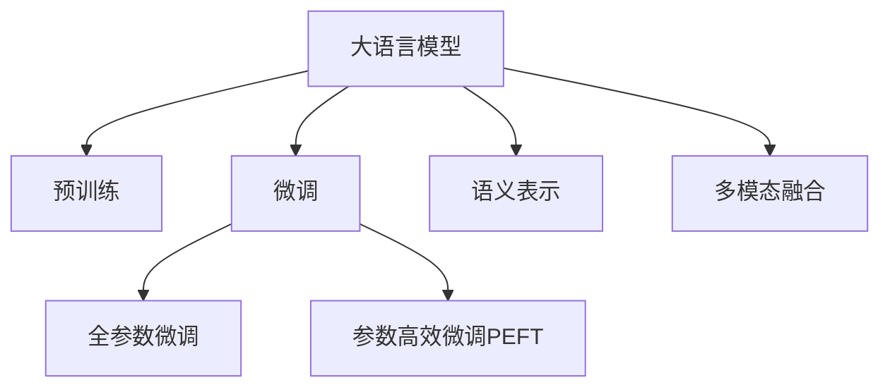

                 

# AI大模型在电商搜索query理解中的应用

## 1. 背景介绍

### 1.1 问题由来
电子商务已经成为现代社会不可或缺的购物方式。据统计，全球电商市场的规模在2021年已达到4.9万亿美元，预计2026年将增长到8.1万亿美元。随着电商平台的日益壮大，客户对搜索体验的要求也变得越来越高。如何精准理解客户输入的query，快速定位到相关商品，已成为各大电商平台的核心挑战之一。

传统的查询处理方式主要依赖于关键词匹配和简单的搜索结果排序算法，这种基于规则的方法在用户意图多样化和商品信息复杂化的情况下难以胜任。近年来，基于大模型的query理解技术在电商搜索领域开始崭露头角。通过预训练大模型，能够更全面、深入地理解用户查询，提高搜索结果的相关性和精准度，显著提升电商搜索的效率和用户体验。

### 1.2 问题核心关键点
基于大模型的query理解技术，本质上是一种自然语言处理（NLP）任务，旨在通过语言模型预测用户查询的语义意图，生成与查询匹配度高的搜索结果。其核心在于：
1. **预训练语言模型**：通过在大规模无标签文本数据上进行预训练，学习到丰富的语言知识和常识。
2. **监督微调**：使用标注数据对预训练模型进行有监督的微调，使其具备针对特定任务的能力。
3. **语义表示**：将用户查询和商品信息转化为高维语义向量，进行相似度匹配。
4. **多模态融合**：将文本、图像、语音等多模态数据进行融合，提高查询理解的多样性。

## 2. 核心概念与联系

### 2.1 核心概念概述

为了更好地理解基于大模型的query理解技术，本节将介绍几个密切相关的核心概念：

- **大语言模型(Large Language Model, LLM)**：以自回归(如GPT)或自编码(如BERT)模型为代表的大规模预训练语言模型。通过在大规模无标签文本语料上进行预训练，学习到通用的语言表示，具备强大的语言理解和生成能力。

- **预训练(Pre-training)**：指在大规模无标签文本语料上，通过自监督学习任务训练通用语言模型的过程。常见的预训练任务包括言语建模、遮挡语言模型等。

- **微调(Fine-tuning)**：指在预训练模型的基础上，使用下游任务的少量标注数据，通过有监督学习优化模型在特定任务上的性能。通常只需要调整顶层分类器或解码器，并以较小的学习率更新全部或部分的模型参数。

- **语义表示(Semantic Representation)**：将文本转化为高维语义向量，用于计算语义相似度。常见的语义表示方法包括词向量、句子嵌入、上下文嵌入等。

- **多模态融合(Multimodal Fusion)**：将文本、图像、语音等多模态数据进行融合，提取综合特征，提高query理解的多样性和准确性。

这些核心概念之间的逻辑关系可以通过以下Mermaid流程图来展示：



这个流程图展示了大语言模型的核心概念及其之间的关系：

1. 大语言模型通过预训练获得基础能力。
2. 微调是对预训练模型进行任务特定的优化，可以分为全参数微调和参数高效微调（PEFT）。
3. 语义表示用于将文本数据转化为模型可以处理的向量表示。
4. 多模态融合通过融合多模态数据，丰富query理解的多样性。

这些概念共同构成了大语言模型在电商搜索query理解中的主要框架，使其能够更好地理解查询语义，提供精准的搜索结果。

## 3. 核心算法原理 & 具体操作步骤
### 3.1 算法原理概述

基于大模型的电商搜索query理解，主要分为以下几个步骤：

1. **预训练模型选择**：选择合适的预训练模型作为初始化参数，如BERT、GPT-3等。
2. **数据准备**：收集电商搜索任务中的标注数据，分为训练集、验证集和测试集。
3. **微调模型**：使用标注数据对预训练模型进行有监督的微调，生成针对电商搜索任务的模型。
4. **语义表示**：将用户查询和商品信息转化为高维语义向量，进行相似度匹配。
5. **多模态融合**：将文本、图像、语音等多模态数据进行融合，提高查询理解的多样性。

### 3.2 算法步骤详解

#### 3.2.1 预训练模型选择

电商搜索query理解任务可以选择以下预训练模型：

- BERT系列：包括BERT-base、BERT-large、BERT-cased等。BERT在语义表示和上下文理解方面表现优异，适用于词级别的查询理解。
- GPT系列：包括GPT-2、GPT-3等。GPT在生成连贯的自然语言方面表现突出，适用于短语和句子级别的查询理解。
- T5系列：T5是一种文本生成模型，适用于多种NLP任务，包括搜索query理解。

根据具体任务需求，选择合适的预训练模型。

#### 3.2.2 数据准备

电商搜索query理解的数据主要包括以下几类：

- **查询日志**：包含用户输入的查询语句，是训练和评估的主要数据来源。
- **商品信息**：包含商品的标题、描述、分类等信息，用于生成匹配的搜索结果。
- **标注数据**：包括查询意图、商品类别等标签信息，用于监督微调。

对数据进行预处理，包括分词、去噪、标准化等步骤，保证数据的质量和一致性。

#### 3.2.3 微调模型

使用标注数据对预训练模型进行有监督的微调，生成针对电商搜索任务的模型。具体步骤如下：

1. **添加任务适配层**：根据任务需求，在预训练模型顶层设计合适的输出层和损失函数。
2. **设置微调超参数**：选择合适的优化算法及其参数，如AdamW、SGD等，设置学习率、批大小、迭代轮数等。
3. **执行梯度训练**：将训练集数据分批次输入模型，前向传播计算损失函数。反向传播计算参数梯度，根据设定的优化算法和学习率更新模型参数。
4. **周期性评估**：在验证集上评估模型性能，根据性能指标决定是否触发Early Stopping。

#### 3.2.4 语义表示

将用户查询和商品信息转化为高维语义向量，用于计算语义相似度。常见的方法包括：

- **词向量**：如Word2Vec、GloVe等，将单词映射到低维向量空间，用于计算词级别的相似度。
- **句子嵌入**：如BERT、ELMO等，将句子映射到高维向量空间，用于计算句子级别的相似度。
- **上下文嵌入**：如Bert-Encoder、T5等，在预训练模型的顶层提取上下文表示，用于计算文本的语义信息。

#### 3.2.5 多模态融合

将文本、图像、语音等多模态数据进行融合，提取综合特征，提高查询理解的多样性。常见的方法包括：

- **文本-图像融合**：将图像信息转化为文本描述，与查询进行融合，提高视觉信息理解能力。
- **文本-语音融合**：将语音信息转化为文本，与查询进行融合，提高语音交互理解能力。
- **多模态表示学习**：如CLIP、ViT等，学习跨模态表示，提升综合特征提取能力。

### 3.3 算法优缺点

基于大模型的电商搜索query理解方法具有以下优点：

1. **语义理解全面**：预训练语言模型学习到丰富的语言知识，能够更全面地理解查询意图。
2. **数据需求较小**：微调所需的标注数据量较小，适用于电商搜索等数据量有限的场景。
3. **适应性强**：通过微调，可以适应不同电商平台的特定需求，提高搜索结果的相关性。
4. **效果显著**：在大规模数据上进行微调，能够显著提升搜索结果的准确率和召回率。

同时，该方法也存在一定的局限性：

1. **计算资源需求高**：预训练模型参数量大，计算资源需求高，需要高性能设备支持。
2. **多模态数据获取困难**：多模态融合需要获取文本、图像、语音等多模态数据，可能存在获取难度和成本问题。
3. **推理速度慢**：预训练模型推理速度较慢，需要优化模型结构和推理机制。
4. **数据隐私问题**：电商搜索涉及用户隐私，数据标注和处理需要严格遵守隐私保护法规。

尽管存在这些局限性，但就目前而言，基于大模型的query理解方法在电商搜索领域仍是一种非常高效和实用的解决方案。未来相关研究的重点在于如何进一步降低计算资源需求，提高多模态数据融合效率，同时兼顾数据隐私和安全。

### 3.4 算法应用领域

基于大模型的query理解技术，已经在电商搜索领域得到了广泛应用，覆盖了几乎所有常见的查询处理任务，例如：

- **产品搜索**：根据用户输入的关键词，从商品库中匹配相关商品。
- **商品推荐**：根据用户历史行为，生成个性化推荐列表。
- **广告投放**：根据用户查询，推荐相关广告。
- **价格调整**：根据用户购买意愿，调整商品价格。
- **库存管理**：根据用户查询，调整商品库存。

除了上述这些经典任务外，大模型query理解技术还被创新性地应用到更多场景中，如智能客服、个性化推荐、智能推荐广告等，为电商搜索带来新的突破。随着预训练模型和query理解方法的不断进步，相信电商搜索技术将会在更广阔的应用领域大放异彩。

## 4. 数学模型和公式 & 详细讲解
### 4.1 数学模型构建

假设电商搜索query理解任务的数据集为 $D=\{(x_i, y_i)\}_{i=1}^N, x_i \in \mathcal{X}, y_i \in \mathcal{Y}$，其中 $\mathcal{X}$ 为输入空间，$\mathcal{Y}$ 为输出空间。定义模型 $M_{\theta}$ 在输入 $x$ 上的输出为 $\hat{y}=M_{\theta}(x) \in [0,1]$，表示模型预测输出属于类别 $y$ 的概率。

定义模型 $M_{\theta}$ 在数据样本 $(x,y)$ 上的损失函数为 $\ell(M_{\theta}(x),y)$，则在数据集 $D$ 上的经验风险为：

$$
\mathcal{L}(\theta) = \frac{1}{N} \sum_{i=1}^N \ell(M_{\theta}(x_i),y_i)
$$

微调的优化目标是最小化经验风险，即找到最优参数：

$$
\theta^* = \mathop{\arg\min}_{\theta} \mathcal{L}(\theta)
$$

在实践中，我们通常使用基于梯度的优化算法（如SGD、Adam等）来近似求解上述最优化问题。设 $\eta$ 为学习率，$\lambda$ 为正则化系数，则参数的更新公式为：

$$
\theta \leftarrow \theta - \eta \nabla_{\theta}\mathcal{L}(\theta) - \eta\lambda\theta
$$

其中 $\nabla_{\theta}\mathcal{L}(\theta)$ 为损失函数对参数 $\theta$ 的梯度，可通过反向传播算法高效计算。

### 4.2 公式推导过程

以下我们以二分类任务为例，推导交叉熵损失函数及其梯度的计算公式。

假设模型 $M_{\theta}$ 在输入 $x$ 上的输出为 $\hat{y}=M_{\theta}(x) \in [0,1]$，表示样本属于正类的概率。真实标签 $y \in \{0,1\}$。则二分类交叉熵损失函数定义为：

$$
\ell(M_{\theta}(x),y) = -[y\log \hat{y} + (1-y)\log (1-\hat{y})]
$$

将其代入经验风险公式，得：

$$
\mathcal{L}(\theta) = -\frac{1}{N}\sum_{i=1}^N [y_i\log M_{\theta}(x_i)+(1-y_i)\log(1-M_{\theta}(x_i))]
$$

根据链式法则，损失函数对参数 $\theta_k$ 的梯度为：

$$
\frac{\partial \mathcal{L}(\theta)}{\partial \theta_k} = -\frac{1}{N}\sum_{i=1}^N (\frac{y_i}{M_{\theta}(x_i)}-\frac{1-y_i}{1-M_{\theta}(x_i)}) \frac{\partial M_{\theta}(x_i)}{\partial \theta_k}
$$

其中 $\frac{\partial M_{\theta}(x_i)}{\partial \theta_k}$ 可进一步递归展开，利用自动微分技术完成计算。

在得到损失函数的梯度后，即可带入参数更新公式，完成模型的迭代优化。重复上述过程直至收敛，最终得到适应电商搜索任务的最优模型参数 $\theta^*$。

## 5. 项目实践：代码实例和详细解释说明
### 5.1 开发环境搭建

在进行query理解实践前，我们需要准备好开发环境。以下是使用Python进行PyTorch开发的环境配置流程：

1. 安装Anaconda：从官网下载并安装Anaconda，用于创建独立的Python环境。

2. 创建并激活虚拟环境：
```bash
conda create -n pytorch-env python=3.8 
conda activate pytorch-env
```

3. 安装PyTorch：根据CUDA版本，从官网获取对应的安装命令。例如：
```bash
conda install pytorch torchvision torchaudio cudatoolkit=11.1 -c pytorch -c conda-forge
```

4. 安装Transformers库：
```bash
pip install transformers
```

5. 安装各类工具包：
```bash
pip install numpy pandas scikit-learn matplotlib tqdm jupyter notebook ipython
```

完成上述步骤后，即可在`pytorch-env`环境中开始query理解实践。

### 5.2 源代码详细实现

这里我们以电商搜索query理解任务为例，给出使用Transformers库对BERT模型进行微调的PyTorch代码实现。

首先，定义query理解任务的数据处理函数：

```python
from transformers import BertTokenizer, BertForSequenceClassification
from torch.utils.data import Dataset
import torch

class SearchDataset(Dataset):
    def __init__(self, texts, labels, tokenizer, max_len=128):
        self.texts = texts
        self.labels = labels
        self.tokenizer = tokenizer
        self.max_len = max_len
        
    def __len__(self):
        return len(self.texts)
    
    def __getitem__(self, item):
        text = self.texts[item]
        label = self.labels[item]
        
        encoding = self.tokenizer(text, return_tensors='pt', max_length=self.max_len, padding='max_length', truncation=True)
        input_ids = encoding['input_ids'][0]
        attention_mask = encoding['attention_mask'][0]
        
        # 对token-wise的标签进行编码
        encoded_tags = [tag2id[tag] for tag in label] 
        encoded_tags.extend([tag2id['O']] * (self.max_len - len(encoded_tags)))
        labels = torch.tensor(encoded_tags, dtype=torch.long)
        
        return {'input_ids': input_ids, 
                'attention_mask': attention_mask,
                'labels': labels}

# 标签与id的映射
tag2id = {'O': 0, 'Product': 1, 'Price': 2, 'Review': 3}
id2tag = {v: k for k, v in tag2id.items()}

# 创建dataset
tokenizer = BertTokenizer.from_pretrained('bert-base-cased')

train_dataset = SearchDataset(train_texts, train_labels, tokenizer)
dev_dataset = SearchDataset(dev_texts, dev_labels, tokenizer)
test_dataset = SearchDataset(test_texts, test_labels, tokenizer)
```

然后，定义模型和优化器：

```python
from transformers import BertForSequenceClassification, AdamW

model = BertForSequenceClassification.from_pretrained('bert-base-cased', num_labels=len(tag2id))

optimizer = AdamW(model.parameters(), lr=2e-5)
```

接着，定义训练和评估函数：

```python
from torch.utils.data import DataLoader
from tqdm import tqdm
from sklearn.metrics import classification_report

device = torch.device('cuda') if torch.cuda.is_available() else torch.device('cpu')
model.to(device)

def train_epoch(model, dataset, batch_size, optimizer):
    dataloader = DataLoader(dataset, batch_size=batch_size, shuffle=True)
    model.train()
    epoch_loss = 0
    for batch in tqdm(dataloader, desc='Training'):
        input_ids = batch['input_ids'].to(device)
        attention_mask = batch['attention_mask'].to(device)
        labels = batch['labels'].to(device)
        model.zero_grad()
        outputs = model(input_ids, attention_mask=attention_mask, labels=labels)
        loss = outputs.loss
        epoch_loss += loss.item()
        loss.backward()
        optimizer.step()
    return epoch_loss / len(dataloader)

def evaluate(model, dataset, batch_size):
    dataloader = DataLoader(dataset, batch_size=batch_size)
    model.eval()
    preds, labels = [], []
    with torch.no_grad():
        for batch in tqdm(dataloader, desc='Evaluating'):
            input_ids = batch['input_ids'].to(device)
            attention_mask = batch['attention_mask'].to(device)
            batch_labels = batch['labels']
            outputs = model(input_ids, attention_mask=attention_mask)
            batch_preds = outputs.logits.argmax(dim=2).to('cpu').tolist()
            batch_labels = batch_labels.to('cpu').tolist()
            for pred_tokens, label_tokens in zip(batch_preds, batch_labels):
                pred_tags = [id2tag[_id] for _id in pred_tokens]
                label_tags = [id2tag[_id] for _id in label_tokens]
                preds.append(pred_tags[:len(label_tokens)])
                labels.append(label_tags)
                
    print(classification_report(labels, preds))
```

最后，启动训练流程并在测试集上评估：

```python
epochs = 5
batch_size = 16

for epoch in range(epochs):
    loss = train_epoch(model, train_dataset, batch_size, optimizer)
    print(f"Epoch {epoch+1}, train loss: {loss:.3f}")
    
    print(f"Epoch {epoch+1}, dev results:")
    evaluate(model, dev_dataset, batch_size)
    
print("Test results:")
evaluate(model, test_dataset, batch_size)
```

以上就是使用PyTorch对BERT进行电商搜索query理解任务微调的完整代码实现。可以看到，得益于Transformers库的强大封装，我们可以用相对简洁的代码完成BERT模型的加载和微调。

### 5.3 代码解读与分析

让我们再详细解读一下关键代码的实现细节：

**SearchDataset类**：
- `__init__`方法：初始化查询、标签、分词器等关键组件。
- `__len__`方法：返回数据集的样本数量。
- `__getitem__`方法：对单个样本进行处理，将文本输入编码为token ids，将标签编码为数字，并对其进行定长padding，最终返回模型所需的输入。

**tag2id和id2tag字典**：
- 定义了标签与数字id之间的映射关系，用于将token-wise的预测结果解码回真实的标签。

**训练和评估函数**：
- 使用PyTorch的DataLoader对数据集进行批次化加载，供模型训练和推理使用。
- 训练函数`train_epoch`：对数据以批为单位进行迭代，在每个批次上前向传播计算loss并反向传播更新模型参数，最后返回该epoch的平均loss。
- 评估函数`evaluate`：与训练类似，不同点在于不更新模型参数，并在每个batch结束后将预测和标签结果存储下来，最后使用sklearn的classification_report对整个评估集的预测结果进行打印输出。

**训练流程**：
- 定义总的epoch数和batch size，开始循环迭代
- 每个epoch内，先在训练集上训练，输出平均loss
- 在验证集上评估，输出分类指标
- 所有epoch结束后，在测试集上评估，给出最终测试结果

可以看到，PyTorch配合Transformers库使得BERT微调的代码实现变得简洁高效。开发者可以将更多精力放在数据处理、模型改进等高层逻辑上，而不必过多关注底层的实现细节。

当然，工业级的系统实现还需考虑更多因素，如模型的保存和部署、超参数的自动搜索、更灵活的任务适配层等。但核心的query理解范式基本与此类似。

## 6. 实际应用场景
### 6.1 智能客服系统

基于大模型query理解技术，智能客服系统可以自动处理大量的客户咨询，快速响应查询，提供精准的解决方案。传统客服系统往往需要配备大量人力，高峰期响应缓慢，且一致性和专业性难以保证。而使用微调后的query理解模型，可以7x24小时不间断服务，快速响应客户咨询，用自然流畅的语言解答各类常见问题。

在技术实现上，可以收集企业内部的历史客服对话记录，将问题和最佳答复构建成监督数据，在此基础上对预训练query理解模型进行微调。微调后的模型能够自动理解用户意图，匹配最合适的答案模板进行回复。对于客户提出的新问题，还可以接入检索系统实时搜索相关内容，动态组织生成回答。如此构建的智能客服系统，能大幅提升客户咨询体验和问题解决效率。

### 6.2 广告投放

电商平台的广告投放系统需要根据用户的查询历史，生成个性化的广告推荐。通过query理解技术，广告系统能够自动分析用户查询中的关键词和意图，匹配最相关的广告内容，提高广告的点击率和转化率。

在实践中，可以收集用户的历史查询记录和点击行为，提取关键词和兴趣点。将查询数据作为监督信号，微调预训练query理解模型。微调后的模型能够从用户查询中提取高维语义向量，计算与广告内容的相似度，生成个性化的广告推荐列表。

### 6.3 个性化推荐

电商平台的个性化推荐系统需要根据用户的查询历史，生成个性化的商品推荐列表。通过query理解技术，推荐系统能够自动分析用户查询中的关键词和兴趣点，匹配最相关的商品，提高推荐的准确性和用户满意度。

在实践中，可以收集用户的历史查询记录和浏览行为，提取关键词和兴趣点。将查询数据作为监督信号，微调预训练query理解模型。微调后的模型能够从用户查询中提取高维语义向量，计算与商品信息的相似度，生成个性化的推荐列表。

### 6.4 未来应用展望

随着大模型query理解技术的不断发展，基于微调的方法将在更多领域得到应用，为电商搜索带来新的突破。

在智慧医疗领域，基于query理解技术的医疗问答、病历分析、药物研发等应用将提升医疗服务的智能化水平，辅助医生诊疗，加速新药开发进程。

在智能教育领域，query理解技术可应用于作业批改、学情分析、知识推荐等方面，因材施教，促进教育公平，提高教学质量。

在智慧城市治理中，query理解技术可应用于城市事件监测、舆情分析、应急指挥等环节，提高城市管理的自动化和智能化水平，构建更安全、高效的未来城市。

此外，在企业生产、社会治理、文娱传媒等众多领域，基于query理解技术的智能应用也将不断涌现，为经济社会发展注入新的动力。相信随着技术的日益成熟，query理解技术必将成为电商搜索应用的重要范式，推动人工智能技术在电商领域持续创新。

## 7. 工具和资源推荐
### 7.1 学习资源推荐

为了帮助开发者系统掌握大模型query理解的技术基础和实践技巧，这里推荐一些优质的学习资源：

1. 《Transformer从原理到实践》系列博文：由大模型技术专家撰写，深入浅出地介绍了Transformer原理、BERT模型、query理解技术等前沿话题。

2. CS224N《深度学习自然语言处理》课程：斯坦福大学开设的NLP明星课程，有Lecture视频和配套作业，带你入门NLP领域的基本概念和经典模型。

3. 《Natural Language Processing with Transformers》书籍：Transformers库的作者所著，全面介绍了如何使用Transformers库进行NLP任务开发，包括query理解在内的诸多范式。

4. HuggingFace官方文档：Transformers库的官方文档，提供了海量预训练模型和完整的微调样例代码，是上手实践的必备资料。

5. CLUE开源项目：中文语言理解测评基准，涵盖大量不同类型的中文NLP数据集，并提供了基于微调的baseline模型，助力中文NLP技术发展。

通过对这些资源的学习实践，相信你一定能够快速掌握大模型query理解技术的精髓，并用于解决实际的NLP问题。
###  7.2 开发工具推荐

高效的开发离不开优秀的工具支持。以下是几款用于大模型query理解开发的常用工具：

1. PyTorch：基于Python的开源深度学习框架，灵活动态的计算图，适合快速迭代研究。大部分预训练语言模型都有PyTorch版本的实现。

2. TensorFlow：由Google主导开发的开源深度学习框架，生产部署方便，适合大规模工程应用。同样有丰富的预训练语言模型资源。

3. Transformers库：HuggingFace开发的NLP工具库，集成了众多SOTA语言模型，支持PyTorch和TensorFlow，是进行query理解任务开发的利器。

4. Weights & Biases：模型训练的实验跟踪工具，可以记录和可视化模型训练过程中的各项指标，方便对比和调优。与主流深度学习框架无缝集成。

5. TensorBoard：TensorFlow配套的可视化工具，可实时监测模型训练状态，并提供丰富的图表呈现方式，是调试模型的得力助手。

6. Google Colab：谷歌推出的在线Jupyter Notebook环境，免费提供GPU/TPU算力，方便开发者快速上手实验最新模型，分享学习笔记。

合理利用这些工具，可以显著提升大模型query理解任务的开发效率，加快创新迭代的步伐。

### 7.3 相关论文推荐

大模型query理解技术的发展源于学界的持续研究。以下是几篇奠基性的相关论文，推荐阅读：

1. Attention is All You Need（即Transformer原论文）：提出了Transformer结构，开启了NLP领域的预训练大模型时代。

2. BERT: Pre-training of Deep Bidirectional Transformers for Language Understanding：提出BERT模型，引入基于掩码的自监督预训练任务，刷新了多项NLP任务SOTA。

3. Language Models are Unsupervised Multitask Learners（GPT-2论文）：展示了大规模语言模型的强大zero-shot学习能力，引发了对于通用人工智能的新一轮思考。

4. Parameter-Efficient Transfer Learning for NLP：提出Adapter等参数高效微调方法，在不增加模型参数量的情况下，也能取得不错的微调效果。

5. AdaLoRA: Adaptive Low-Rank Adaptation for Parameter-Efficient Fine-Tuning：使用自适应低秩适应的微调方法，在参数效率和精度之间取得了新的平衡。

6. Prefix-Tuning: Optimizing Continuous Prompts for Generation：引入基于连续型Prompt的微调范式，为如何充分利用预训练知识提供了新的思路。

这些论文代表了大模型query理解技术的发展脉络。通过学习这些前沿成果，可以帮助研究者把握学科前进方向，激发更多的创新灵感。

## 8. 总结：未来发展趋势与挑战
### 8.1 总结

本文对基于大模型的query理解技术进行了全面系统的介绍。首先阐述了大模型query理解的研究背景和意义，明确了query理解在电商搜索中的重要价值。其次，从原理到实践，详细讲解了query理解数学原理和关键步骤，给出了query理解任务开发的完整代码实例。同时，本文还广泛探讨了query理解技术在智能客服、广告投放、个性化推荐等多个行业领域的应用前景，展示了query理解技术的广泛应用潜力。此外，本文精选了query理解技术的各类学习资源，力求为读者提供全方位的技术指引。

通过本文的系统梳理，可以看到，基于大模型的query理解技术正在成为NLP领域的重要范式，极大地拓展了预训练语言模型的应用边界，催生了更多的落地场景。受益于大规模语料的预训练，query理解模型以更低的时间和标注成本，在小样本条件下也能取得不俗的效果，有力推动了NLP技术的产业化进程。未来，伴随预训练语言模型和query理解方法的不断进步，相信query理解技术必将在更广阔的应用领域大放异彩，深刻影响人类的生产生活方式。

### 8.2 未来发展趋势

展望未来，大模型query理解技术将呈现以下几个发展趋势：

1. **模型规模持续增大**。随着算力成本的下降和数据规模的扩张，预训练语言模型的参数量还将持续增长。超大规模语言模型蕴含的丰富语言知识，有望支撑更加复杂多变的查询理解任务。

2. **微调方法日趋多样**。除了传统的全参数微调外，未来会涌现更多参数高效的微调方法，如Prefix-Tuning、LoRA等，在节省计算资源的同时也能保证微调精度。

3. **持续学习成为常态**。随着数据分布的不断变化，query理解模型也需要持续学习新知识以保持性能。如何在不遗忘原有知识的同时，高效吸收新样本信息，将成为重要的研究课题。

4. **标注样本需求降低**。受启发于提示学习(Prompt-based Learning)的思路，未来的query理解方法将更好地利用大模型的语言理解能力，通过更加巧妙的任务描述，在更少的标注样本上也能实现理想的query理解效果。

5. **多模态融合崛起**。当前的query理解主要聚焦于文本数据，未来会进一步拓展到图像、视频、语音等多模态数据微调。多模态信息的融合，将显著提升query理解的多样性。

6. **模型通用性增强**。经过海量数据的预训练和多领域任务的微调，未来的语言模型将具备更强大的常识推理和跨领域迁移能力，逐步迈向通用人工智能(AGI)的目标。

以上趋势凸显了大模型query理解技术的广阔前景。这些方向的探索发展，必将进一步提升query理解系统的性能和应用范围，为人工智能技术在电商领域持续创新。

### 8.3 面临的挑战

尽管大模型query理解技术已经取得了瞩目成就，但在迈向更加智能化、普适化应用的过程中，它仍面临着诸多挑战：

1. **标注成本瓶颈**。虽然query理解所需的标注数据量较小，但对于长尾应用场景，难以获得充足的高质量标注数据，成为制约query理解性能的瓶颈。如何进一步降低微调对标注样本的依赖，将是一大难题。

2. **模型鲁棒性不足**。当前query理解模型面对域外数据时，泛化性能往往大打折扣。对于测试样本的微小扰动，query理解模型的预测也容易发生波动。如何提高query理解模型的鲁棒性，避免灾难性遗忘，还需要更多理论和实践的积累。

3. **推理效率有待提高**。大规模语言模型虽然精度高，但在实际部署时往往面临推理速度慢、内存占用大等效率问题。如何在保证性能的同时，简化模型结构，提升推理速度，优化资源占用，将是重要的优化方向。

4. **数据隐私问题**。query理解涉及用户隐私，数据标注和处理需要严格遵守隐私保护法规。如何保护用户隐私，同时获取高质量的数据标注，将是重要的研究方向。

5. **知识整合能力不足**。现有的query理解模型往往局限于任务内数据，难以灵活吸收和运用更广泛的先验知识。如何让query理解过程更好地与外部知识库、规则库等专家知识结合，形成更加全面、准确的信息整合能力，还有很大的想象空间。

6. **可解释性亟需加强**。当前query理解模型更像是"黑盒"系统，难以解释其内部工作机制和决策逻辑。对于医疗、金融等高风险应用，算法的可解释性和可审计性尤为重要。如何赋予query理解模型更强的可解释性，将是亟待攻克的难题。

尽管存在这些挑战，但未来随着技术的不断进步和数据的积累，大模型query理解技术必将在电商搜索等领域取得更大的突破，推动NLP技术向更加智能化、普适化发展。

### 8.4 研究展望

面向未来，大模型query理解技术需要在以下几个方面寻求新的突破：

1. **探索无监督和半监督微调方法**。摆脱对大规模标注数据的依赖，利用自监督学习、主动学习等无监督和半监督范式，最大限度利用非结构化数据，实现更加灵活高效的query理解。

2. **研究参数高效和计算高效的微调范式**。开发更加参数高效的微调方法，在固定大部分预训练参数的同时，只更新极少量的任务相关参数。同时优化query理解模型的计算图，减少前向传播和反向传播的资源消耗，实现更加轻量级、实时性的部署。

3. **融合因果和对比学习范式**。通过引入因果推断和对比学习思想，增强query理解模型建立稳定因果关系的能力，学习更加普适、鲁棒的语言表征，从而提升模型泛化性和抗干扰能力。

4. **引入更多先验知识**。将符号化的先验知识，如知识图谱、逻辑规则等，与神经网络模型进行巧妙融合，引导query理解过程学习更准确、合理的语言模型。同时加强不同模态数据的整合，实现视觉、语音等多模态信息与文本信息的协同建模。

5. **结合因果分析和博弈论工具**。将因果分析方法引入query理解模型，识别出模型决策的关键特征，增强输出解释的因果性和逻辑性。借助博弈论工具刻画人机交互过程，主动探索并规避模型的脆弱点，提高系统稳定性。

6. **纳入伦理道德约束**。在模型训练目标中引入伦理导向的评估指标，过滤和惩罚有偏见、有害的输出倾向。同时加强人工干预和审核，建立模型行为的监管机制，确保输出符合人类价值观和伦理道德。

这些研究方向的探索，必将引领大模型query理解技术迈向更高的台阶，为构建安全、可靠、可解释、可控的智能系统铺平道路。面向未来，大模型query理解技术还需要与其他人工智能技术进行更深入的融合，如知识表示、因果推理、强化学习等，多路径协同发力，共同推动自然语言理解和智能交互系统的进步。只有勇于创新、敢于突破，才能不断拓展query理解模型的边界，让智能技术更好地造福人类社会。

## 9. 附录：常见问题与解答

**Q1：大模型query理解是否适用于所有NLP任务？**

A: 大模型query理解在大多数NLP任务上都能取得不错的效果，特别是对于数据量较小的任务。但对于一些特定领域的任务，如医学、法律等，仅仅依靠通用语料预训练的模型可能难以很好地适应。此时需要在特定领域语料上进一步预训练，再进行微调，才能获得理想效果。此外，对于一些需要时效性、个性化很强的任务，如对话、推荐等，query理解方法也需要针对性的改进优化。

**Q2：微调过程中如何选择合适的学习率？**

A: 微调的学习率一般要比预训练时小1-2个数量级，如果使用过大的学习率，容易破坏预训练权重，导致过拟合。一般建议从1e-5开始调参，逐步减小学习率，直至收敛。也可以使用warmup策略，在开始阶段使用较小的学习率，再逐渐过渡到预设值。需要注意的是，不同的优化器(如AdamW、Adafactor等)以及不同的学习率调度策略，可能需要设置不同的学习率阈值。

**Q3：采用大模型query理解时会面临哪些资源瓶颈？**

A: 目前主流的预训练大模型动辄以亿计的参数规模，对算力、内存、存储都提出了很高的要求。GPU/TPU等高性能设备是必不可少的，但即便如此，超大批次的训练和推理也可能遇到显存不足的问题。因此需要采用一些资源优化技术，如梯度积累、混合精度训练、模型并行等，来突破硬件瓶颈。同时，模型的存储和读取也可能占用大量时间和空间，需要采用模型压缩、稀疏化存储等方法进行优化。

**Q4：如何缓解微调过程中的过拟合问题？**

A: 过拟合是微调面临的主要挑战，尤其是在标注数据不足的情况下。常见的缓解策略包括：
1. 数据增强：通过回译、近义替换等方式扩充训练集
2. 正则化：使用L2正则、Dropout、Early Stopping等避免过拟合
3. 对抗训练：引入对抗样本，提高模型鲁棒性
4. 参数高效微调：只调整少量参数(如Adapter、Prefix等)，减小过拟合风险
5. 多模型集成：训练多个微调模型，取平均输出，抑制过拟合

这些策略往往需要根据具体任务和数据特点进行灵活组合。只有在数据、模型、训练、推理等各环节进行全面优化，才能最大限度地发挥大模型query理解的优势。

**Q5：微调模型在落地部署时需要注意哪些问题？**

A: 将微调模型转化为实际应用，还需要考虑以下因素：
1. 模型裁剪：去除不必要的层和参数，减小模型尺寸，加快推理速度
2. 量化加速：将浮点模型转为定点模型，压缩存储空间，提高计算效率
3. 服务化封装：将模型封装为标准化服务接口，便于集成调用
4. 弹性伸缩：根据请求流量动态调整资源配置，平衡服务质量和成本
5. 监控告警：实时采集系统指标，设置异常告警阈值，确保服务稳定性
6. 安全防护：采用访问鉴权、数据脱敏等措施，保障数据和模型安全

大模型query理解为NLP应用开启了广阔的想象空间，但如何将强大的性能转化为稳定、高效、安全的业务价值，还需要工程实践的不断打磨。唯有从数据、算法、工程、业务等多个维度协同发力，才能真正实现人工智能技术在电商领域的应用创新。总之，query理解需要开发者根据具体任务，不断迭代和优化模型、数据和算法，方能得到理想的效果。

---

作者：禅与计算机程序设计艺术 / Zen and the Art of Computer Programming

