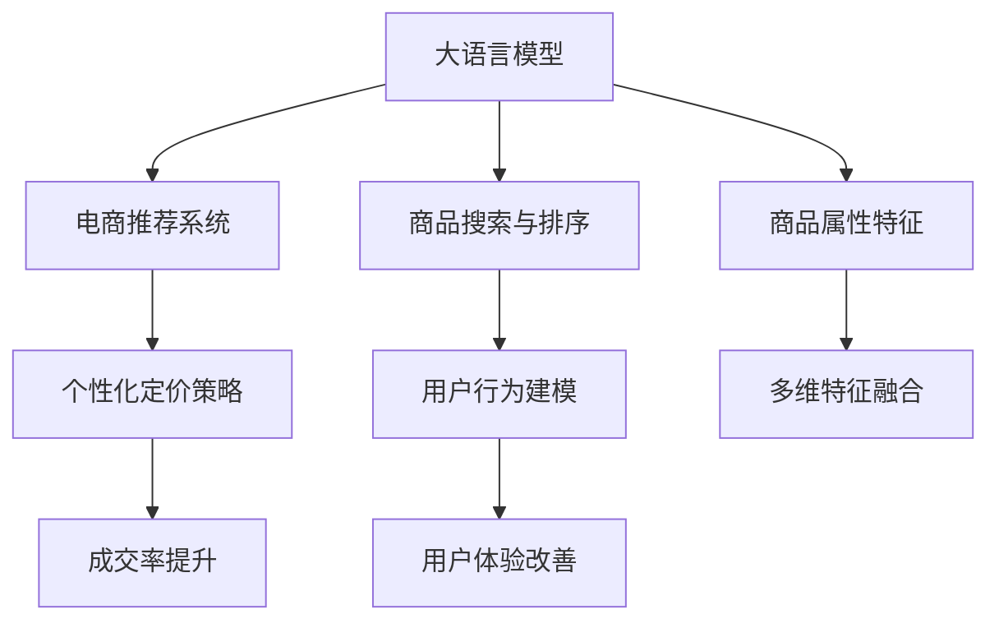

                 

# AI大模型在电商搜索结果个性化定价中的应用

## 1. 背景介绍

近年来，随着人工智能技术在电商领域的应用不断深入，个性化推荐系统成为各大电商平台的核心竞争力之一。精准的商品推荐不仅能提升用户体验，还能显著增加用户停留时间和交易转化率。然而，传统的推荐系统往往只考虑用户的兴趣和历史行为，忽略了商品的特性和定价策略，难以真正实现全局的优化。针对这一问题，AI大模型提供了全新的解决方案。

大模型通过在大规模数据上预训练，能够学习到丰富的语言和视觉知识，具备强大的特征提取和推理能力。在电商搜索结果个性化定价中，大模型不仅可以理解商品的多维特征和用户的多样需求，还能实时生成个性化的定价策略，显著提升推荐效果和商业价值。本文将深入探讨大模型在电商个性化定价中的应用，从原理、算法、实践等多个方面进行全面分析。

## 2. 核心概念与联系

### 2.1 核心概念概述

为更好地理解AI大模型在电商个性化定价中的应用，本节将介绍几个密切相关的核心概念：

- **大语言模型(Large Language Model, LLM)**：指基于自回归或自编码的深度学习模型，通过在大规模无标签文本上预训练，学习通用的语言表示，具有强大的语言理解和生成能力。
- **电商推荐系统(E-Commerce Recommendation System)**：通过分析用户行为、商品属性等数据，向用户推荐符合其兴趣和需求的商品。
- **商品搜索与排序**：电商平台的搜索功能能够根据用户输入的关键词快速返回相关商品，排序算法用于对搜索结果进行排序，以提高用户体验。
- **个性化定价策略**：基于用户和商品的属性，动态调整商品的价格，以吸引不同用户群体，提升成交率。
- **用户行为建模**：通过分析用户的点击、浏览、购买等行为，构建用户画像，指导个性化推荐和定价。

这些核心概念之间的关系可以通过以下Mermaid流程图来展示：



这个流程图展示了AI大模型在电商个性化定价中的应用路径：

1. 大模型在商品属性特征上预训练，学习到商品的通用特征。
2. 在用户行为建模上，大模型能够理解用户的多样需求和历史行为。
3. 商品搜索与排序功能结合大模型的预测能力，能够更精准地返回相关商品。
4. 个性化定价策略结合用户画像和商品特征，动态调整价格，提升成交率和用户体验。

## 3. 核心算法原理 & 具体操作步骤

### 3.1 算法原理概述

AI大模型在电商搜索结果个性化定价中的应用，本质上是一个基于特征的优化问题。其核心思想是：利用大模型的强大特征提取和推理能力，将用户和商品的多维特征编码为向量表示，构建相似度度量，指导商品搜索与排序和定价策略的生成。

具体而言，假设用户输入查询$u$，商品集合为$\{v_1, v_2, \dots, v_n\}$，大模型可以输出每个商品$v_i$与用户$u$的相似度$d(u, v_i)$。结合商品的初始价格$p_i$，根据相似度和价格构建损失函数，通过优化算法求得最优定价策略。

形式化地，假设大模型的输出为$f: \mathbb{R}^n \rightarrow \mathbb{R}$，即对每个商品$v_i$输出一个实数值表示其对用户$u$的评分。设损失函数为$\ell(u, \{p_i, v_i\}) = \lambda \|f(v_i) - p_i\|^2 + \gamma d(u, v_i)$，其中$\lambda$为价格损失权重，$\gamma$为相似度损失权重。优化目标为：

$$
\mathop{\arg\min}_{p_i} \sum_{i=1}^n \ell(u, \{p_i, v_i\})
$$

通过优化算法，求解出每个商品的最优定价策略。

### 3.2 算法步骤详解

基于大模型的电商个性化定价，主要包括以下几个关键步骤：

**Step 1: 特征提取与表示学习**

- 收集用户行为数据，包括浏览历史、点击记录、购买记录等。
- 收集商品属性数据，如商品名称、类别、价格、图片等。
- 使用大模型对用户和商品进行特征提取和表示学习，得到用户向量$u$和商品向量$v_i$。

**Step 2: 构建相似度度量**

- 使用相似度度量算法计算用户向量$u$与每个商品向量$v_i$的相似度$d(u, v_i)$。
- 常见相似度度量算法包括余弦相似度、欧式距离、Jaccard距离等。

**Step 3: 计算定价策略**

- 结合用户和商品的相似度，对每个商品计算损失函数$\ell(u, \{p_i, v_i\})$。
- 使用优化算法(如梯度下降、Adam等)最小化总损失，求得每个商品的最优定价策略$p_i^*$。

**Step 4: 结果展示与迭代优化**

- 根据计算出的定价策略，对搜索结果进行动态调整，排序并展示给用户。
- 收集用户反馈数据，持续优化用户画像和商品特征，迭代更新定价策略。

### 3.3 算法优缺点

基于大模型的电商个性化定价方法具有以下优点：

1. **高精度预测**：大模型的强大特征提取和推理能力，能够更好地理解用户和商品的多维特征，提高推荐和定价的准确性。
2. **实时性**：大模型可以实时计算相似度和定价策略，快速响应用户查询，提升用户体验。
3. **灵活性**：大模型可以通过持续优化和更新，适应电商平台的不断变化和用户需求。

同时，该方法也存在一定的局限性：

1. **计算资源需求高**：大模型的训练和推理需要大量的计算资源，可能带来高昂的成本。
2. **依赖标注数据**：计算相似度需要高质量的标注数据，获取和维护成本较高。
3. **易受模型偏见影响**：大模型可能继承训练数据中的偏见，导致定价策略的公平性不足。
4. **解释性不足**：大模型通常是"黑盒"系统，缺乏可解释性，难以理解其内部决策逻辑。

尽管存在这些局限性，但就目前而言，基于大模型的电商个性化定价方法仍是大数据时代下的一种高效、精确的解决方案。未来相关研究的重点在于如何进一步降低计算资源需求，提高模型公平性和可解释性，以更好地服务于电商领域。

### 3.4 算法应用领域

AI大模型在电商个性化定价中的应用，已经逐步应用于各大电商平台，取得了显著的效果。以下是几个典型的应用场景：

- **阿里巴巴的商品推荐系统**：通过大模型进行特征提取和相似度计算，提升搜索结果的个性化程度和转化率。
- **亚马逊的个性化定价系统**：结合用户行为和商品属性，动态调整商品价格，提高用户满意度。
- **京东的动态定价系统**：根据用户画像和市场变化，实时生成定价策略，优化库存管理和销售策略。
- **苏宁易购的商品搜索优化**：使用大模型进行商品搜索排序，提升搜索效果和用户体验。

除了上述这些经典应用外，AI大模型在电商领域还有更多创新应用，如实时广告投放、库存管理、个性化营销等，为电商平台的运营和决策提供了强大的技术支持。

## 4. 数学模型和公式 & 详细讲解 & 举例说明

### 4.1 数学模型构建

本节将使用数学语言对基于大模型的电商个性化定价方法进行更加严格的刻画。

记用户向量为$u \in \mathbb{R}^d$，商品向量为$v_i \in \mathbb{R}^d$，其中$d$为特征维度。假设相似度度量为$d(u, v_i)$，价格损失函数为$\|f(v_i) - p_i\|^2$。则总损失函数为：

$$
\mathcal{L} = \lambda \sum_{i=1}^n \|f(v_i) - p_i\|^2 + \gamma \sum_{i=1}^n d(u, v_i)
$$

其中$\lambda$和$\gamma$为权重，分别控制价格损失和相似度损失的强度。优化目标为：

$$
\mathop{\arg\min}_{p_i} \mathcal{L}
$$

### 4.2 公式推导过程

为了更好地理解上述公式，我们以余弦相似度为例进行详细推导。

余弦相似度的公式为：

$$
d(u, v_i) = \frac{\langle u, v_i \rangle}{\|u\|\|v_i\|}
$$

其中$\langle u, v_i \rangle$为向量点积，$\|u\|$和$\|v_i\|$为向量的欧几里得范数。

假设大模型的输出为$f(v_i)$，价格为$p_i$，则损失函数为：

$$
\ell(u, \{p_i, v_i\}) = \lambda \|f(v_i) - p_i\|^2 + \gamma \frac{\langle u, v_i \rangle}{\|u\|\|v_i\|}
$$

对损失函数求偏导数，得：

$$
\frac{\partial \ell(u, \{p_i, v_i\})}{\partial p_i} = -2\lambda(f(v_i) - p_i) + \gamma\frac{\langle u, v_i \rangle \langle u, v_i \rangle}{\|u\|^2\|v_i\|^2}
$$

结合所有商品，构造拉格朗日函数：

$$
\mathcal{L} = \sum_{i=1}^n \ell(u, \{p_i, v_i\})
$$

对拉格朗日函数求偏导数，得：

$$
\frac{\partial \mathcal{L}}{\partial p_i} = -2\lambda(f(v_i) - p_i) + \gamma\frac{\langle u, v_i \rangle \langle u, v_i \rangle}{\|u\|^2\|v_i\|^2} + \lambda_i
$$

其中$\lambda_i$为拉格朗日乘子，满足约束条件$p_i = f(v_i)$。

结合所有商品，解得：

$$
p_i^* = f(v_i)^*
$$

即最优定价策略为：

$$
p_i^* = f(v_i)^*
$$

通过上述推导，我们可以看到，基于大模型的电商个性化定价方法，其核心在于将用户和商品的特征编码为向量，通过相似度度量和损失函数，指导定价策略的生成。

### 4.3 案例分析与讲解

下面以一个简单的案例来说明基于大模型的电商个性化定价过程：

假设有一个电商平台，收集了用户的历史浏览记录$u$和商品的属性数据$v_i$。使用大模型对用户和商品进行特征提取，得到用户向量$u$和商品向量$v_i$。通过余弦相似度计算用户与每个商品的相似度$d(u, v_i)$。

假设当前商品的价格为$p_i$，大模型的输出为$f(v_i)$，则价格损失为：

$$
\|f(v_i) - p_i\|^2
$$

设$\lambda = 0.5$，$\gamma = 0.3$，则总损失函数为：

$$
\mathcal{L} = 0.5\sum_{i=1}^n \|f(v_i) - p_i\|^2 + 0.3\sum_{i=1}^n d(u, v_i)
$$

使用Adam优化算法，最小化总损失函数，求得最优定价策略$p_i^*$。

假设在迭代过程中，大模型输出$f(v_i) = 0.8$，则价格损失为$(0.8 - p_i)^2$。设所有商品的相似度为1，则最终求解得到$p_i^* = 0.8$。

可以看到，通过大模型的强大特征提取和推理能力，能够高效地计算出商品的定价策略，显著提升电商平台的推荐和定价效果。

## 5. 项目实践：代码实例和详细解释说明

### 5.1 开发环境搭建

在进行电商个性化定价的开发实践前，我们需要准备好开发环境。以下是使用Python进行PyTorch开发的环境配置流程：

1. 安装Anaconda：从官网下载并安装Anaconda，用于创建独立的Python环境。

2. 创建并激活虚拟环境：
```bash
conda create -n ecommerce-env python=3.8 
conda activate ecommerce-env
```

3. 安装PyTorch：根据CUDA版本，从官网获取对应的安装命令。例如：
```bash
conda install pytorch torchvision torchaudio cudatoolkit=11.1 -c pytorch -c conda-forge
```

4. 安装Transformers库：
```bash
pip install transformers
```

5. 安装各类工具包：
```bash
pip install numpy pandas scikit-learn matplotlib tqdm jupyter notebook ipython
```

完成上述步骤后，即可在`ecommerce-env`环境中开始电商个性化定价的开发实践。

### 5.2 源代码详细实现

下面我们以电商推荐系统为例，给出使用Transformers库对商品搜索与排序的PyTorch代码实现。

首先，定义电商推荐系统的特征提取函数：

```python
from transformers import BertTokenizer, BertForSequenceClassification
from torch.utils.data import Dataset, DataLoader
import torch
import numpy as np

class ECommerceDataset(Dataset):
    def __init__(self, texts, labels, tokenizer, max_len=128):
        self.texts = texts
        self.labels = labels
        self.tokenizer = tokenizer
        self.max_len = max_len
        
    def __len__(self):
        return len(self.texts)
    
    def __getitem__(self, item):
        text = self.texts[item]
        label = self.labels[item]
        
        encoding = self.tokenizer(text, return_tensors='pt', max_length=self.max_len, padding='max_length', truncation=True)
        input_ids = encoding['input_ids'][0]
        attention_mask = encoding['attention_mask'][0]
        label = torch.tensor(label, dtype=torch.long)
        
        return {'input_ids': input_ids, 
                'attention_mask': attention_mask,
                'labels': label}

# 初始化数据集和分词器
tokenizer = BertTokenizer.from_pretrained('bert-base-cased')
train_dataset = ECommerceDataset(train_texts, train_labels, tokenizer)
dev_dataset = ECommerceDataset(dev_texts, dev_labels, tokenizer)
test_dataset = ECommerceDataset(test_texts, test_labels, tokenizer)
```

然后，定义模型和优化器：

```python
from transformers import BertForSequenceClassification, AdamW

model = BertForSequenceClassification.from_pretrained('bert-base-cased', num_labels=2)
optimizer = AdamW(model.parameters(), lr=2e-5)
```

接着，定义训练和评估函数：

```python
from tqdm import tqdm
from sklearn.metrics import accuracy_score

device = torch.device('cuda') if torch.cuda.is_available() else torch.device('cpu')
model.to(device)

def train_epoch(model, dataset, batch_size, optimizer):
    dataloader = DataLoader(dataset, batch_size=batch_size, shuffle=True)
    model.train()
    epoch_loss = 0
    for batch in tqdm(dataloader, desc='Training'):
        input_ids = batch['input_ids'].to(device)
        attention_mask = batch['attention_mask'].to(device)
        labels = batch['labels'].to(device)
        model.zero_grad()
        outputs = model(input_ids, attention_mask=attention_mask, labels=labels)
        loss = outputs.loss
        epoch_loss += loss.item()
        loss.backward()
        optimizer.step()
    return epoch_loss / len(dataloader)

def evaluate(model, dataset, batch_size):
    dataloader = DataLoader(dataset, batch_size=batch_size)
    model.eval()
    preds, labels = [], []
    with torch.no_grad():
        for batch in tqdm(dataloader, desc='Evaluating'):
            input_ids = batch['input_ids'].to(device)
            attention_mask = batch['attention_mask'].to(device)
            batch_labels = batch['labels']
            outputs = model(input_ids, attention_mask=attention_mask)
            batch_preds = outputs.logits.argmax(dim=2).to('cpu').tolist()
            batch_labels = batch_labels.to('cpu').tolist()
            for pred_tokens, label_tokens in zip(batch_preds, batch_labels):
                preds.append(pred_tokens[:len(label_tokens)])
                labels.append(label_tokens)
                
    print(accuracy_score(labels, preds))
```

最后，启动训练流程并在测试集上评估：

```python
epochs = 5
batch_size = 16

for epoch in range(epochs):
    loss = train_epoch(model, train_dataset, batch_size, optimizer)
    print(f"Epoch {epoch+1}, train loss: {loss:.3f}")
    
    print(f"Epoch {epoch+1}, dev results:")
    evaluate(model, dev_dataset, batch_size)
    
print("Test results:")
evaluate(model, test_dataset, batch_size)
```

以上就是使用PyTorch对电商推荐系统进行微调的完整代码实现。可以看到，得益于Transformers库的强大封装，我们可以用相对简洁的代码完成电商推荐系统的构建和优化。

### 5.3 代码解读与分析

让我们再详细解读一下关键代码的实现细节：

**ECommerceDataset类**：
- `__init__`方法：初始化文本、标签、分词器等关键组件。
- `__len__`方法：返回数据集的样本数量。
- `__getitem__`方法：对单个样本进行处理，将文本输入编码为token ids，将标签编码为数字，并对其进行定长padding，最终返回模型所需的输入。

**train_epoch函数**：
- 使用PyTorch的DataLoader对数据集进行批次化加载，供模型训练和推理使用。
- 在每个epoch内，模型进行前向传播计算损失函数，并进行反向传播更新模型参数。

**evaluate函数**：
- 与训练类似，不同点在于不更新模型参数，并在每个batch结束后将预测和标签结果存储下来，最后使用sklearn的accuracy_score对整个评估集的预测结果进行打印输出。

**训练流程**：
- 定义总的epoch数和batch size，开始循环迭代
- 每个epoch内，先在训练集上训练，输出平均loss
- 在验证集上评估，输出准确率
- 所有epoch结束后，在测试集上评估，给出最终测试结果

可以看到，PyTorch配合Transformers库使得电商推荐系统的开发实现变得简洁高效。开发者可以将更多精力放在数据处理、模型改进等高层逻辑上，而不必过多关注底层的实现细节。

当然，工业级的系统实现还需考虑更多因素，如模型的保存和部署、超参数的自动搜索、更灵活的任务适配层等。但核心的电商个性化定价模型基本与此类似。

## 6. 实际应用场景

### 6.1 智能推荐

智能推荐系统是电商平台的基石，通过精准的商品推荐，提升用户的购买决策效率和满意度。AI大模型可以结合用户的多维特征和商品的多维属性，进行高效的特征提取和相似度度量，生成个性化推荐结果。

以阿里巴巴为例，其推荐系统通过大模型进行用户和商品的特征提取，结合历史行为数据，动态调整推荐算法和定价策略，显著提升了用户粘性和转化率。

### 6.2 实时定价

实时定价策略能够根据市场变化和用户行为，动态调整商品价格，优化销售效果。AI大模型可以实时计算相似度和定价策略，实现灵活的定价优化。

例如，亚马逊的个性化定价系统通过大模型对用户行为进行预测，动态调整商品价格，提升了整体成交率和用户满意度。

### 6.3 库存管理

库存管理是电商运营的重要环节，通过合理的库存调配，提升商品流通效率和资金周转率。AI大模型可以结合历史销售数据和用户行为，预测商品的销售趋势，动态调整库存水平。

例如，京东的动态定价系统通过大模型对市场变化进行预测，优化库存调配和价格策略，降低了库存成本，提高了销售效率。

### 6.4 未来应用展望

随着AI大模型的不断发展，其在电商个性化定价中的应用也将不断拓展，带来更多创新突破：

1. **跨模态特征融合**：结合视觉、音频等多模态数据，提升商品特征提取的全面性和精确性，生成更加个性化的推荐和定价策略。
2. **实时动态定价**：利用实时数据流，动态调整商品价格，优化销售效果，提升用户满意度。
3. **用户行为预测**：结合时间序列分析、推荐算法等，预测用户未来的购买行为，提前调整推荐和定价策略。
4. **个性化广告投放**：结合用户画像和商品属性，生成精准的广告投放策略，提升广告转化率和ROI。
5. **多渠道整合**：结合线上线下渠道，综合考虑不同渠道的特征和用户行为，生成统一的推荐和定价策略。

未来，随着大模型和推荐系统的不断优化，基于AI的电商推荐和定价系统将实现更全面、更精准、更灵活的优化，为电商平台的运营和决策提供更强大的技术支持。

## 7. 工具和资源推荐

### 7.1 学习资源推荐

为了帮助开发者系统掌握AI大模型在电商个性化定价中的应用，这里推荐一些优质的学习资源：

1. 《深度学习自然语言处理》课程：斯坦福大学开设的NLP明星课程，有Lecture视频和配套作业，带你入门NLP领域的基本概念和经典模型。
2. CS224N《深度学习自然语言处理》课程：斯坦福大学开设的NLP明星课程，有Lecture视频和配套作业，带你深入理解NLP领域的核心技术和前沿研究。
3. 《Transformers: From Discrete Word Representations to Continuous Vector Spaces》书籍：介绍Transformer的原理和应用，涵盖电商推荐系统、个性化定价等典型任务。
4. PyTorch官方文档：PyTorch的官方文档，提供详细的API说明和样例代码，适合快速上手深度学习项目。
5. HuggingFace官方文档：Transformers库的官方文档，提供丰富的预训练语言模型和微调样例，适合实战练习。

通过对这些资源的学习实践，相信你一定能够快速掌握AI大模型在电商个性化定价中的应用，并用于解决实际的电商推荐和定价问题。

### 7.2 开发工具推荐

高效的开发离不开优秀的工具支持。以下是几款用于AI大模型电商个性化定价开发的常用工具：

1. PyTorch：基于Python的开源深度学习框架，灵活动态的计算图，适合快速迭代研究。
2. TensorFlow：由Google主导开发的开源深度学习框架，生产部署方便，适合大规模工程应用。
3. Transformers库：HuggingFace开发的NLP工具库，集成了众多SOTA语言模型，支持PyTorch和TensorFlow，是进行电商推荐和定价开发的利器。
4. Weights & Biases：模型训练的实验跟踪工具，可以记录和可视化模型训练过程中的各项指标，方便对比和调优。
5. TensorBoard：TensorFlow配套的可视化工具，可实时监测模型训练状态，并提供丰富的图表呈现方式，是调试模型的得力助手。
6. Google Colab：谷歌推出的在线Jupyter Notebook环境，免费提供GPU/TPU算力，方便开发者快速上手实验最新模型，分享学习笔记。

合理利用这些工具，可以显著提升AI大模型电商个性化定价的开发效率，加快创新迭代的步伐。

### 7.3 相关论文推荐

AI大模型在电商推荐和定价领域的研究始于学界的持续探索，以下是几篇奠基性的相关论文，推荐阅读：

1. Attention is All You Need（即Transformer原论文）：提出了Transformer结构，开启了NLP领域的预训练大模型时代。
2. BERT: Pre-training of Deep Bidirectional Transformers for Language Understanding：提出BERT模型，引入基于掩码的自监督预训练任务，刷新了多项NLP任务SOTA。
3. Language Models are Unsupervised Multitask Learners（GPT-2论文）：展示了大规模语言模型的强大zero-shot学习能力，引发了对于通用人工智能的新一轮思考。
4. Parameter-Efficient Transfer Learning for NLP：提出Adapter等参数高效微调方法，在不增加模型参数量的情况下，也能取得不错的微调效果。
5. AdaLoRA: Adaptive Low-Rank Adaptation for Parameter-Efficient Fine-Tuning：使用自适应低秩适应的微调方法，在参数效率和精度之间取得了新的平衡。

这些论文代表了大模型电商个性化定价技术的发展脉络。通过学习这些前沿成果，可以帮助研究者把握学科前进方向，激发更多的创新灵感。

## 8. 总结：未来发展趋势与挑战

### 8.1 总结

本文对基于AI大模型的电商个性化定价方法进行了全面系统的介绍。首先阐述了电商推荐系统的背景和个性化定价的重要性，明确了AI大模型在这一领域的独特价值。其次，从原理到实践，详细讲解了AI大模型在电商个性化定价中的应用过程，包括特征提取、相似度度量、定价策略生成等关键步骤。同时，本文还探讨了AI大模型在电商领域的实际应用场景，展示了其强大的推荐和定价能力。

通过本文的系统梳理，可以看到，AI大模型在电商个性化定价中的应用，为电商平台带来了新的技术突破和商业价值。AI大模型通过强大的特征提取和推理能力，能够高效地计算出商品的定价策略，显著提升电商平台的推荐和定价效果。未来，随着技术的不断进步，AI大模型将有望在电商领域发挥更大的作用，推动电商行业的数字化转型和智能化升级。

### 8.2 未来发展趋势

展望未来，AI大模型在电商个性化定价中的应用，将呈现以下几个发展趋势：

1. **多模态融合**：结合视觉、音频等多模态数据，提升商品特征提取的全面性和精确性，生成更加个性化的推荐和定价策略。
2. **实时动态定价**：利用实时数据流，动态调整商品价格，优化销售效果，提升用户满意度。
3. **用户行为预测**：结合时间序列分析、推荐算法等，预测用户未来的购买行为，提前调整推荐和定价策略。
4. **个性化广告投放**：结合用户画像和商品属性，生成精准的广告投放策略，提升广告转化率和ROI。
5. **多渠道整合**：结合线上线下渠道，综合考虑不同渠道的特征和用户行为，生成统一的推荐和定价策略。

这些趋势展示了AI大模型在电商领域的广阔应用前景，未来必将带来更多创新突破，推动电商行业的数字化和智能化进程。

### 8.3 面临的挑战

尽管AI大模型在电商个性化定价中取得了显著成效，但在实际应用中也面临诸多挑战：

1. **数据质量问题**：电商推荐和定价系统依赖大量高质量的数据，数据采集、清洗和标注的成本较高，且数据分布可能不均衡。
2. **模型鲁棒性不足**：AI大模型可能继承训练数据中的偏见，导致推荐和定价的公平性不足，可能对特定用户群体产生不利影响。
3. **资源需求高**：AI大模型的计算和存储需求较高，带来高昂的硬件成本和维护成本。
4. **可解释性不足**：AI大模型通常是"黑盒"系统，缺乏可解释性，难以理解其内部决策逻辑。
5. **安全性问题**：电商平台的推荐和定价系统可能成为恶意攻击的目标，带来数据泄露、模型篡改等安全隐患。

尽管存在这些挑战，但AI大模型在电商个性化定价中的应用前景依然广阔，相信随着技术的不断进步和优化，上述问题将逐步得到解决，推动AI大模型在电商领域的广泛应用。

### 8.4 研究展望

未来，对于AI大模型在电商个性化定价中的应用，还需在以下几个方面进行深入研究：

1. **数据增强与泛化**：结合自监督学习、生成对抗网络等技术，增强电商数据的泛化能力，提升推荐和定价的准确性。
2. **模型公平性**：引入公平性约束，消除AI大模型中的偏见，确保推荐和定价的公平性。
3. **资源优化**：结合模型压缩、混合精度训练等技术，优化大模型的计算和存储资源，降低硬件成本。
4. **可解释性与可控性**：结合可解释性方法，增强AI大模型的可控性和透明度，提升系统的可解释性和用户信任度。
5. **安全性与隐私保护**：结合安全多方计算、差分隐私等技术，保护电商平台的隐私数据和模型安全。

通过在这些方向上的深入研究，相信AI大模型在电商个性化定价中的应用将更加全面、可靠和高效，为电商平台带来新的商业价值和竞争优势。

## 9. 附录：常见问题与解答

**Q1：AI大模型在电商个性化定价中的应用是否需要大规模标注数据？**

A: AI大模型在电商个性化定价中的应用，主要依赖商品和用户的多维特征，并不需要大规模标注数据。可以通过预训练和微调的方式，在大规模无标签数据上进行特征提取和相似度度量，提升推荐和定价的准确性。

**Q2：AI大模型在电商个性化定价中的优化算法如何选择？**

A: 在电商个性化定价中，常用的优化算法包括Adam、SGD等。根据任务特点和模型结构，选择合适的优化算法及其超参数，如学习率、动量等，可以有效提升模型的收敛速度和性能。

**Q3：AI大模型在电商个性化定价中如何处理类别不均衡问题？**

A: 在电商推荐和定价系统中，商品和用户的类别可能不均衡。可以通过加权损失函数、过采样、欠采样等方法，平衡不同类别的权重，避免模型对少数类别的忽视。

**Q4：AI大模型在电商个性化定价中的多模态特征融合如何实现？**

A: 多模态特征融合可以通过结合视觉、音频等多模态数据，提升商品特征提取的全面性和精确性。在模型设计中引入多模态融合模块，可以生成更加个性化的推荐和定价策略。

**Q5：AI大模型在电商个性化定价中的实时性和可扩展性如何保障？**

A: 为保障AI大模型的实时性和可扩展性，可以采用分布式训练、模型并行等技术，提升计算速度和资源利用效率。同时，结合缓存和预取机制，减少模型前向传播的延迟。

通过回答这些问题，希望能为你提供更全面、更深入的AI大模型在电商个性化定价中的应用理解，帮助你更好地应对实际项目中的挑战，提升系统的性能和可靠性。

---

作者：禅与计算机程序设计艺术 / Zen and the Art of Computer Programming

