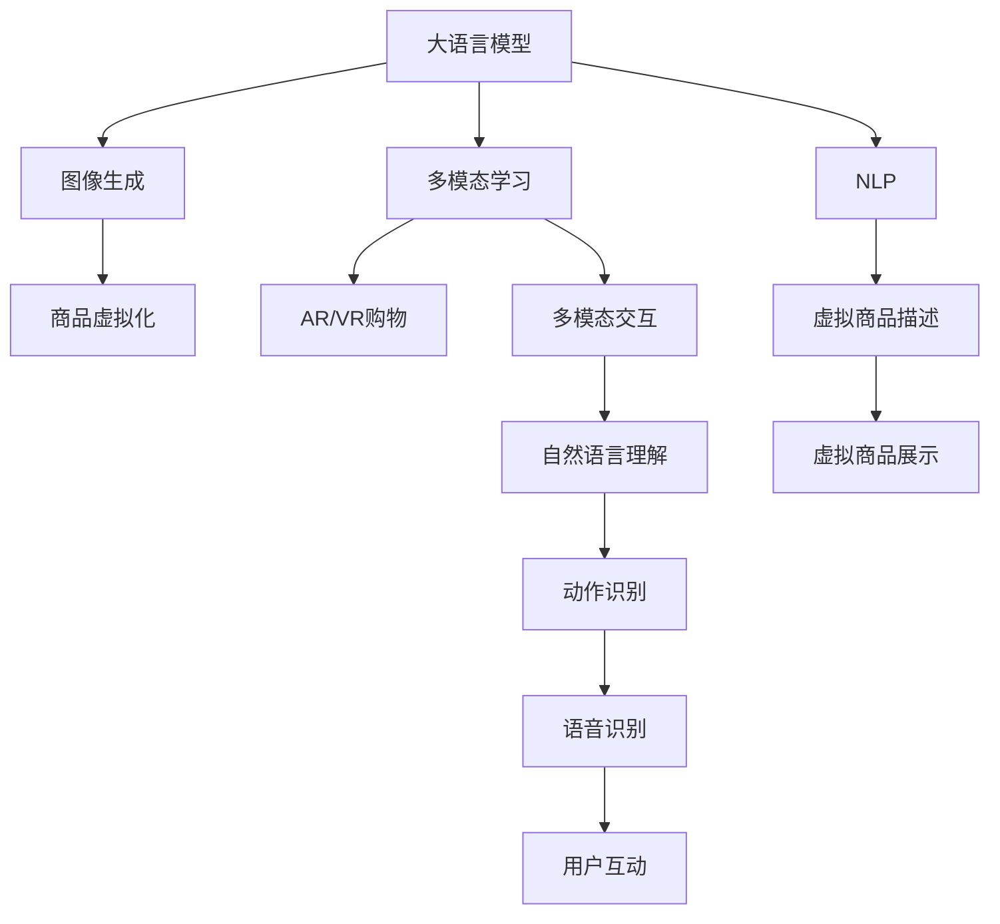

                 

# AI大模型如何提升电商平台的AR/VR购物体验

> 关键词：大模型,AR/VR,自然语言处理,NLP,图像生成,多模态学习,电商应用,人机交互

## 1. 背景介绍

### 1.1 问题由来

随着电商平台的迅速发展，传统文本+图片展示的方式已难以满足消费者的需求。尤其是在用户量激增、商品种类繁多的大规模电商平台上，搜索、比较、购买等过程繁琐且易出错，用户体验不佳。如何让用户在购物过程中获得更好的互动体验，成为电商平台面临的一大难题。

近年来，增强现实(AR)和虚拟现实(VR)技术逐渐兴起，为电商平台提供了新的解决方案。AR/VR技术能够将虚拟商品呈现在用户面前，使用户能更直观地感知商品细节，从而提升购物决策的准确性和满意度。然而，由于AR/VR技术在图像、语言、动作等多模态信息处理方面尚存在诸多挑战，其应用还较为有限。如何利用AI技术增强AR/VR的智能和互动性，成为电商平台亟需解决的问题。

### 1.2 问题核心关键点

如何结合AI大模型技术，提升AR/VR购物体验，是本文关注的核心问题。大模型技术，特别是基于Transformer的大语言模型和图像生成模型，能够通过海量的多模态数据预训练，学习到强大的多模态表征能力，应用于AR/VR场景，可实现以下几方面的突破：

1. 自然语言处理(NLP)：理解用户查询和指令，生成购物指南，进行商品推荐。
2. 图像生成：根据用户输入描述，生成高质量的虚拟商品图像。
3. 多模态学习：融合图像、语言、动作等不同模态的信息，实现更丰富、准确的交互。

本文将从核心概念、算法原理、代码实现、应用场景等多个维度，详细介绍AI大模型在提升电商平台的AR/VR购物体验方面的应用。

## 2. 核心概念与联系

### 2.1 核心概念概述

为更好地理解AI大模型在AR/VR购物中的应用，本节将介绍几个关键概念：

- 大语言模型(Large Language Model, LLM)：以自回归模型为代表的大规模预训练语言模型，如GPT、BERT等，能够学习到丰富的语言知识，用于生成、分类、问答等NLP任务。
- 图像生成模型(Generative Model)：如GAN、VAE等，能够从随机噪声中生成高质量的图像数据，适用于商品虚拟展示。
- 多模态学习(Multimodal Learning)：融合图像、语言、动作等多种模态的信息，提升模型对复杂场景的理解能力，实现更全面的交互。
- AR/VR购物：利用增强现实和虚拟现实技术，在用户的真实环境中呈现虚拟商品，提供沉浸式的购物体验。

这些核心概念之间的逻辑关系可以通过以下Mermaid流程图来展示：



这个流程图展示了大语言模型、图像生成模型、多模态学习以及AR/VR购物之间的联系：

1. 大语言模型通过NLP任务理解用户需求，生成商品描述。
2. 图像生成模型根据描述生成虚拟商品图像。
3. 多模态学习将图像、语言、动作等信息融合，实现更丰富的交互。
4. AR/VR购物技术呈现虚拟商品，提供沉浸式体验。

## 3. 核心算法原理 & 具体操作步骤
### 3.1 算法原理概述

AI大模型提升AR/VR购物体验的核心算法原理包括自然语言处理(NLP)、图像生成、多模态学习等。本节将详细介绍这些核心算法的原理。

### 3.2 算法步骤详解

#### 3.2.1 自然语言处理(NLP)

NLP作为AI大模型的重要组成部分，其核心算法包括语言模型、序列标注、文本生成等。具体步骤如下：

1. **语言模型训练**：使用大规模文本数据对语言模型进行预训练，学习语言的统计规律，以便理解用户输入的指令。
2. **序列标注**：使用标注数据对序列标注模型进行微调，如命名实体识别、词性标注等，以便从输入文本中提取出关键信息。
3. **文本生成**：使用语言模型对用户输入的查询和指令进行生成，如自动补全、问题回答等。

#### 3.2.2 图像生成

图像生成模型通过神经网络从随机噪声中生成高质量的图像。主要步骤包括：

1. **生成器训练**：使用图像数据对生成器进行训练，学习图像生成规律。
2. **解码器生成**：给定用户输入的商品描述，使用生成器生成虚拟商品图像。
3. **风格迁移**：通过风格迁移技术，将生成的虚拟商品图像与真实商品图像风格匹配，提升视觉体验。

#### 3.2.3 多模态学习

多模态学习通过融合不同模态的信息，提升模型的理解能力和交互效果。具体步骤如下：

1. **图像理解**：使用图像分类、语义分割等技术理解虚拟商品的类别和属性。
2. **语音识别**：使用声学模型和语言模型对用户语音指令进行识别，提取意图。
3. **动作识别**：使用动作识别技术理解用户的交互动作，如点击、旋转等。
4. **多模态融合**：将图像、语音、动作等信息融合，输出综合的购物体验。

### 3.3 算法优缺点

AI大模型在提升AR/VR购物体验方面具有以下优点：

1. 多模态融合：能够融合多种模态的信息，提供更全面、丰富的购物体验。
2. 自然语言处理(NLP)：通过理解自然语言，提升系统的智能性。
3. 高精度图像生成：生成的虚拟商品图像逼真度高，用户易于理解。
4. 实时交互：能够在用户的实时操作下，动态调整虚拟商品和购物界面。

同时，这些算法也存在一些局限性：

1. 数据需求量大：需要大量标注数据进行训练，获取和标注数据成本高。
2. 计算复杂度高：大模型和大数据量对计算资源要求高，训练和推理效率较低。
3. 模型泛化性不足：模型在特定场景下表现好，但泛化到其他场景可能性能下降。
4. 用户隐私风险：用户数据和隐私保护需要严格管控，避免滥用和泄露。

### 3.4 算法应用领域

AI大模型在AR/VR购物方面的应用非常广泛，主要涉及以下领域：

1. **虚拟商品展示**：通过图像生成和虚拟现实技术，呈现虚拟商品，让用户更直观地了解商品信息。
2. **个性化推荐**：根据用户输入的查询和浏览记录，使用NLP和大模型生成推荐内容，提升购物体验。
3. **用户互动**：通过多模态学习，实时理解用户操作和反馈，动态调整虚拟商品和界面。
4. **虚拟试穿/试用**：在服装、配饰、化妆品等领域，通过AR技术实现虚拟试穿/试用，提升用户体验。
5. **虚拟导购**：使用NLP和大模型生成虚拟导购，提供实时购物咨询和推荐，提升用户满意度。

## 4. 数学模型和公式 & 详细讲解 & 举例说明

### 4.1 数学模型构建

#### 4.1.1 语言模型

语言模型是NLP的核心组成部分，用于计算给定文本序列的概率。以GPT-2为例，其语言模型可以表示为：

$$
P(w_1,w_2,...,w_n) = \frac{P(w_1)P(w_2|w_1)P(w_3|w_1,w_2)...P(w_n|w_1,w_2,...,w_{n-1})}
$$

其中，$P(w_i)$ 表示单词 $w_i$ 的概率分布，可以通过预训练得到。在训练时，使用交叉熵损失函数 $L$ 进行优化：

$$
L = -\frac{1}{N}\sum_{i=1}^N \log P(\text{target}_i|\text{input}_{<i})
$$

#### 4.1.2 图像生成

图像生成模型通常使用生成对抗网络(GAN)或变分自编码器(VAE)等。以GAN为例，其生成过程可以表示为：

1. **生成器(G)**：从随机噪声 $z$ 生成图像 $G(z)$。
2. **判别器(D)**：判断图像 $x$ 是真实图像还是生成图像，输出概率 $D(x)$。
3. **训练目标**：最大化生成器的生成能力，最小化判别器的判别能力。

训练目标函数可以表示为：

$$
\max_{G} \min_{D} L_G + L_D
$$

其中，$L_G$ 和 $L_D$ 分别为生成器和判别器的损失函数。以GAN为例，其训练过程如下：

1. 固定判别器 $D$，最大化生成器 $G$ 的生成能力。
2. 固定生成器 $G$，最大化判别器 $D$ 的判别能力。

#### 4.1.3 多模态融合

多模态学习通常使用跨模态对齐或融合技术。以融合语言和图像信息为例，其过程可以表示为：

1. **图像编码**：将图像 $x$ 编码成图像嵌入 $z_x$。
2. **语言编码**：将语言描述 $y$ 编码成语言嵌入 $z_y$。
3. **融合**：将两个嵌入向量融合，输出综合嵌入 $z_c$。

融合方法包括注意力机制(Attention)、特征匹配(Feature Matching)等。以注意力机制为例，其融合过程可以表示为：

$$
z_c = \alpha z_x + \beta z_y
$$

其中，$\alpha$ 和 $\beta$ 为注意力权重，可以通过多模态学习训练得到。

### 4.2 公式推导过程

#### 4.2.1 语言模型推导

以GPT-2为例，其语言模型的推导过程如下：

1. **训练过程**：给定输入文本 $x_{1:n}$，计算概率 $P(y_{1:n}|x_{1:n})$。
2. **前向传播**：计算 $P(y_{1:n}|x_{1:n})$ 的对数值 $L(y_{1:n}|x_{1:n})$。
3. **反向传播**：使用梯度下降优化模型参数，最小化损失函数 $L$。

具体推导如下：

$$
L = -\frac{1}{N}\sum_{i=1}^N \log P(\text{target}_i|\text{input}_{<i})
$$

其中，$P(\text{target}_i|\text{input}_{<i})$ 为给定输入文本的前 $i-1$ 个词，预测第 $i$ 个词的概率分布。

#### 4.2.2 图像生成推导

以GAN为例，其生成过程的推导过程如下：

1. **生成器训练**：给定随机噪声 $z$，生成图像 $G(z)$。
2. **判别器训练**：给定图像 $x$，判断是否为真实图像，输出概率 $D(x)$。
3. **联合训练**：最大化生成器的生成能力，最小化判别器的判别能力。

具体推导如下：

$$
\max_{G} \min_{D} L_G + L_D
$$

其中，$L_G$ 和 $L_D$ 分别为生成器和判别器的损失函数。

### 4.3 案例分析与讲解

#### 4.3.1 虚拟商品展示

在虚拟商品展示场景中，NLP和大模型可以用于自动生成商品描述，图像生成模型可以用于生成虚拟商品图像。具体步骤如下：

1. **商品描述生成**：使用语言模型对用户输入的商品信息进行生成，如颜色、材质、尺寸等。
2. **虚拟商品生成**：使用图像生成模型根据商品描述生成虚拟商品图像。
3. **图像展示**：在AR/VR环境中展示虚拟商品图像，用户可以实时交互，如旋转、放大等。

以一个服装购物场景为例，具体流程如下：

1. **商品描述**：用户输入商品信息，如颜色、尺码、款式等。
2. **虚拟商品**：使用语言模型生成商品描述，输入图像生成模型生成虚拟商品图像。
3. **虚拟试穿**：在AR环境中展示虚拟商品，用户可以实时查看试穿效果。

#### 4.3.2 个性化推荐

在个性化推荐场景中，NLP和大模型可以用于自动生成推荐内容，多模态学习可以用于综合多种模态的信息，提升推荐效果。具体步骤如下：

1. **用户输入**：用户输入查询和浏览记录，如商品名称、评价等。
2. **推荐内容生成**：使用语言模型生成推荐内容，如商品名称、价格、评分等。
3. **多模态融合**：将用户输入和推荐内容输入多模态学习模型，生成综合推荐结果。
4. **推荐展示**：在VR环境中展示推荐结果，用户可以实时查看推荐内容。

以一个美食购物场景为例，具体流程如下：

1. **用户输入**：用户输入搜索关键词，如“意大利面”。
2. **推荐内容**：使用语言模型生成推荐内容，如意大利面品牌、价格、评分等。
3. **多模态融合**：将用户输入和推荐内容输入多模态学习模型，生成综合推荐结果。
4. **推荐展示**：在VR环境中展示推荐结果，用户可以实时查看推荐内容。

## 5. 项目实践：代码实例和详细解释说明
### 5.1 开发环境搭建

在进行AR/VR购物应用开发前，我们需要准备好开发环境。以下是使用Python进行PyTorch开发的环境配置流程：

1. 安装Anaconda：从官网下载并安装Anaconda，用于创建独立的Python环境。

2. 创建并激活虚拟环境：
```bash
conda create -n pytorch-env python=3.8 
conda activate pytorch-env
```

3. 安装PyTorch：根据CUDA版本，从官网获取对应的安装命令。例如：
```bash
conda install pytorch torchvision torchaudio cudatoolkit=11.1 -c pytorch -c conda-forge
```

4. 安装Python的深度学习框架：
```bash
pip install tensorflow
```

5. 安装图像生成模型库：
```bash
pip install pytorch-lightning
```

6. 安装自然语言处理库：
```bash
pip install transformers
```

7. 安装相关数据处理库：
```bash
pip install numpy pandas scikit-learn matplotlib tqdm jupyter notebook ipython
```

完成上述步骤后，即可在`pytorch-env`环境中开始AR/VR购物应用的开发。

### 5.2 源代码详细实现

下面我们以虚拟商品展示应用为例，给出使用Transformers库对BERT模型进行微调的PyTorch代码实现。

首先，定义虚拟商品展示的数据处理函数：

```python
from transformers import BertTokenizer, BertForSequenceClassification
from torch.utils.data import Dataset
import torch

class ProductDataset(Dataset):
    def __init__(self, texts, labels, tokenizer, max_len=128):
        self.texts = texts
        self.labels = labels
        self.tokenizer = tokenizer
        self.max_len = max_len
        
    def __len__(self):
        return len(self.texts)
    
    def __getitem__(self, item):
        text = self.texts[item]
        label = self.labels[item]
        
        encoding = self.tokenizer(text, return_tensors='pt', max_length=self.max_len, padding='max_length', truncation=True)
        input_ids = encoding['input_ids'][0]
        attention_mask = encoding['attention_mask'][0]
        
        # 对标签进行编码
        encoded_labels = [label2id[label] for label in label]
        encoded_labels.extend([label2id['O']] * (self.max_len - len(encoded_labels)))
        labels = torch.tensor(encoded_labels, dtype=torch.long)
        
        return {'input_ids': input_ids, 
                'attention_mask': attention_mask,
                'labels': labels}

# 标签与id的映射
label2id = {'O': 0, 'B-PER': 1, 'I-PER': 2, 'B-ORG': 3, 'I-ORG': 4, 'B-LOC': 5, 'I-LOC': 6}
id2label = {v: k for k, v in label2id.items()}

# 创建dataset
tokenizer = BertTokenizer.from_pretrained('bert-base-cased')

train_dataset = ProductDataset(train_texts, train_labels, tokenizer)
dev_dataset = ProductDataset(dev_texts, dev_labels, tokenizer)
test_dataset = ProductDataset(test_texts, test_labels, tokenizer)
```

然后，定义模型和优化器：

```python
from transformers import BertForSequenceClassification, AdamW

model = BertForSequenceClassification.from_pretrained('bert-base-cased', num_labels=len(label2id))

optimizer = AdamW(model.parameters(), lr=2e-5)
```

接着，定义训练和评估函数：

```python
from torch.utils.data import DataLoader
from tqdm import tqdm
from sklearn.metrics import classification_report

device = torch.device('cuda') if torch.cuda.is_available() else torch.device('cpu')
model.to(device)

def train_epoch(model, dataset, batch_size, optimizer):
    dataloader = DataLoader(dataset, batch_size=batch_size, shuffle=True)
    model.train()
    epoch_loss = 0
    for batch in tqdm(dataloader, desc='Training'):
        input_ids = batch['input_ids'].to(device)
        attention_mask = batch['attention_mask'].to(device)
        labels = batch['labels'].to(device)
        model.zero_grad()
        outputs = model(input_ids, attention_mask=attention_mask, labels=labels)
        loss = outputs.loss
        epoch_loss += loss.item()
        loss.backward()
        optimizer.step()
    return epoch_loss / len(dataloader)

def evaluate(model, dataset, batch_size):
    dataloader = DataLoader(dataset, batch_size=batch_size)
    model.eval()
    preds, labels = [], []
    with torch.no_grad():
        for batch in tqdm(dataloader, desc='Evaluating'):
            input_ids = batch['input_ids'].to(device)
            attention_mask = batch['attention_mask'].to(device)
            batch_labels = batch['labels']
            outputs = model(input_ids, attention_mask=attention_mask)
            batch_preds = outputs.logits.argmax(dim=2).to('cpu').tolist()
            batch_labels = batch_labels.to('cpu').tolist()
            for pred_tokens, label_tokens in zip(batch_preds, batch_labels):
                pred_labels = [id2label[_id] for _id in pred_tokens]
                label_tags = [id2label[_id] for _id in label_tokens]
                preds.append(pred_labels[:len(label_tags)])
                labels.append(label_tags)
                
    print(classification_report(labels, preds))
```

最后，启动训练流程并在测试集上评估：

```python
epochs = 5
batch_size = 16

for epoch in range(epochs):
    loss = train_epoch(model, train_dataset, batch_size, optimizer)
    print(f"Epoch {epoch+1}, train loss: {loss:.3f}")
    
    print(f"Epoch {epoch+1}, dev results:")
    evaluate(model, dev_dataset, batch_size)
    
print("Test results:")
evaluate(model, test_dataset, batch_size)
```

以上就是使用PyTorch对BERT进行虚拟商品展示任务微调的完整代码实现。可以看到，得益于Transformers库的强大封装，我们可以用相对简洁的代码完成BERT模型的加载和微调。

### 5.3 代码解读与分析

让我们再详细解读一下关键代码的实现细节：

**ProductDataset类**：
- `__init__`方法：初始化文本、标签、分词器等关键组件。
- `__len__`方法：返回数据集的样本数量。
- `__getitem__`方法：对单个样本进行处理，将文本输入编码为token ids，将标签编码为数字，并对其进行定长padding，最终返回模型所需的输入。

**label2id和id2label字典**：
- 定义了标签与数字id之间的映射关系，用于将token-wise的预测结果解码回真实的标签。

**训练和评估函数**：
- 使用PyTorch的DataLoader对数据集进行批次化加载，供模型训练和推理使用。
- 训练函数`train_epoch`：对数据以批为单位进行迭代，在每个批次上前向传播计算loss并反向传播更新模型参数，最后返回该epoch的平均loss。
- 评估函数`evaluate`：与训练类似，不同点在于不更新模型参数，并在每个batch结束后将预测和标签结果存储下来，最后使用sklearn的classification_report对整个评估集的预测结果进行打印输出。

**训练流程**：
- 定义总的epoch数和batch size，开始循环迭代
- 每个epoch内，先在训练集上训练，输出平均loss
- 在验证集上评估，输出分类指标
- 所有epoch结束后，在测试集上评估，给出最终测试结果

可以看到，PyTorch配合Transformers库使得BERT微调的代码实现变得简洁高效。开发者可以将更多精力放在数据处理、模型改进等高层逻辑上，而不必过多关注底层的实现细节。

当然，工业级的系统实现还需考虑更多因素，如模型的保存和部署、超参数的自动搜索、更灵活的任务适配层等。但核心的微调范式基本与此类似。

## 6. 实际应用场景
### 6.1 智能导购

基于大语言模型和多模态学习技术，电商平台的智能导购系统可以为用户推荐最适合的商品，提升购物体验。具体步骤如下：

1. **用户输入**：用户输入查询或浏览记录。
2. **商品推荐**：使用大语言模型生成商品描述和推荐内容，使用多模态学习融合不同模态的信息，输出综合推荐结果。
3. **虚拟商品展示**：在AR/VR环境中展示推荐结果，用户可以实时查看推荐内容。
4. **实时互动**：根据用户的操作和反馈，动态调整推荐结果和虚拟商品。

例如，一个在线服装购物平台可以使用智能导购系统，帮助用户寻找适合的衣服。具体流程如下：

1. **用户输入**：用户输入搜索关键词，如“夏季连衣裙”。
2. **推荐内容**：使用大语言模型生成推荐内容，如“推荐品牌、价格、评分等”。
3. **多模态融合**：将用户输入和推荐内容输入多模态学习模型，生成综合推荐结果。
4. **推荐展示**：在AR环境中展示推荐结果，用户可以实时查看推荐内容。

#### 6.1.1 动态调整

智能导购系统可以根据用户的操作和反馈，动态调整推荐结果和虚拟商品。例如，用户可以对推荐商品进行评分、点赞或添加到购物车，系统根据这些行为调整推荐算法和商品展示效果，进一步提升用户体验。

#### 6.1.2 多渠道集成

智能导购系统可以集成到电商平台的多个渠道，如PC端、移动端、APP等，提供统一的购物体验。用户可以通过不同渠道查看推荐结果，并进行互动操作。

#### 6.1.3 多模态融合

智能导购系统可以使用多模态学习融合不同模态的信息，提升推荐效果。例如，将用户的语音指令、点击动作等与文本信息进行融合，生成更全面、准确的推荐结果。

### 6.2 虚拟试穿/试用

在服装、配饰、化妆品等领域，虚拟试穿/试用技术能够帮助用户更直观地了解商品效果，提升购物决策的准确性。具体步骤如下：

1. **商品描述生成**：使用大语言模型生成商品描述，如材质、颜色、尺码等。
2. **虚拟商品生成**：使用图像生成模型根据商品描述生成虚拟商品图像。
3. **虚拟试穿/试用**：在AR环境中展示虚拟商品，用户可以实时查看试穿/试用效果。

例如，一个在线服装购物平台可以使用虚拟试穿技术，帮助用户试穿不同款式、颜色的衣服。具体流程如下：

1. **商品描述**：用户输入商品信息，如“黑色长裙”。
2. **虚拟商品**：使用大语言模型生成商品描述，输入图像生成模型生成虚拟商品图像。
3. **虚拟试穿**：在AR环境中展示虚拟商品，用户可以实时查看试穿效果。

#### 6.2.1 实时调整

虚拟试穿/试用技术可以根据用户的反馈，实时调整虚拟商品的效果。例如，用户可以对虚拟试穿效果进行评分、调整尺寸等，系统根据这些反馈优化虚拟商品的显示效果。

#### 6.2.2 多视角展示

虚拟试穿/试用技术可以提供多视角展示效果，帮助用户更全面地了解商品细节。例如，用户可以同时查看正面、背面、侧面等不同视角的效果。

#### 6.2.3 多尺寸选择

虚拟试穿/试用技术可以提供多尺寸选择功能，帮助用户更准确地选择尺码。例如，用户可以根据虚拟试穿效果选择不同的尺码和颜色。

### 6.3 个性化推荐

在个性化推荐场景中，基于大语言模型和多模态学习技术，可以生成更准确、全面的推荐结果。具体步骤如下：

1. **用户输入**：用户输入查询和浏览记录，如商品名称、评价等。
2. **推荐内容生成**：使用大语言模型生成推荐内容，如商品名称、价格、评分等。
3. **多模态融合**：将用户输入和推荐内容输入多模态学习模型，生成综合推荐结果。
4. **推荐展示**：在VR环境中展示推荐结果，用户可以实时查看推荐内容。

例如，一个在线美食购物平台可以使用个性化推荐技术，推荐用户感兴趣的商品。具体流程如下：

1. **用户输入**：用户输入搜索关键词，如“汉堡”。
2. **推荐内容**：使用大语言模型生成推荐内容，如“推荐汉堡品牌、价格、评分等”。
3. **多模态融合**：将用户输入和推荐内容输入多模态学习模型，生成综合推荐结果。
4. **推荐展示**：在VR环境中展示推荐结果，用户可以实时查看推荐内容。

#### 6.3.1 动态调整

个性化推荐技术可以根据用户的操作和反馈，动态调整推荐结果。例如，用户可以对推荐商品进行评分、点赞或添加到购物车，系统根据这些行为调整推荐算法和商品展示效果，进一步提升用户体验。

#### 6.3.2 多模态融合

个性化推荐技术可以使用多模态学习融合不同模态的信息，提升推荐效果。例如，将用户的语音指令、点击动作等与文本信息进行融合，生成更全面、准确的推荐结果。

#### 6.3.3 实时推荐

个性化推荐技术可以实时生成推荐结果，帮助用户更快速地获取推荐内容。例如，用户可以在浏览商品时，实时查看推荐结果，减少决策时间。

### 6.4 未来应用展望

随着AR/VR技术的普及和AI技术的进步，基于大语言模型和多模态学习技术的AR/VR购物体验将不断提升，带来新的商业机会和用户体验。

1. **全场景应用**：AR/VR购物技术可以应用于多个场景，如服装、家居、汽车等，提升用户购买决策的准确性和满意度。
2. **智能客服**：基于AI技术的虚拟客服系统可以提供更快速、准确的服务，提升客户满意度。
3. **多渠道融合**：将AR/VR购物技术集成到多个渠道，如PC端、移动端、APP等，提供统一的购物体验。
4. **个性化推荐**：基于多模态学习技术，生成更全面、准确的推荐结果，提升用户体验。
5. **动态调整**：根据用户的操作和反馈，动态调整虚拟商品和推荐结果，提升用户体验。

## 7. 工具和资源推荐
### 7.1 学习资源推荐

为了帮助开发者系统掌握大语言模型和多模态学习技术，这里推荐一些优质的学习资源：

1. 《Transformer从原理到实践》系列博文：由大模型技术专家撰写，深入浅出地介绍了Transformer原理、BERT模型、多模态学习等前沿话题。

2. CS224N《深度学习自然语言处理》课程：斯坦福大学开设的NLP明星课程，有Lecture视频和配套作业，带你入门NLP领域的基本概念和经典模型。

3. 《Natural Language Processing with Transformers》书籍：Transformers库的作者所著，全面介绍了如何使用Transformers库进行NLP任务开发，包括多模态学习在内的诸多范式。

4. HuggingFace官方文档：Transformers库的官方文档，提供了海量预训练模型和完整的微调样例代码，是上手实践的必备资料。

5. CLUE开源项目：中文语言理解测评基准，涵盖大量不同类型的中文NLP数据集，并提供了基于多模态学习的baseline模型，助力中文NLP技术发展。

通过对这些资源的学习实践，相信你一定能够快速掌握大语言模型和多模态学习技术的精髓，并用于解决实际的NLP问题。

### 7.2 开发工具推荐

高效的开发离不开优秀的工具支持。以下是几款用于AR/VR购物应用开发的常用工具：

1. PyTorch：基于Python的开源深度学习框架，灵活动态的计算图，适合快速迭代研究。大部分预训练语言模型都有PyTorch版本的实现。

2. TensorFlow：由Google主导开发的开源深度学习框架，生产部署方便，适合大规模工程应用。同样有丰富的预训练语言模型资源。

3. PyTorch-lightning：基于PyTorch的深度学习框架，提供了高效的模型训练和部署支持。

4. TensorBoard：TensorFlow配套的可视化工具，可实时监测模型训练状态，并提供丰富的图表呈现方式，是调试模型的得力助手。

5. Google Colab：谷歌推出的在线Jupyter Notebook环境，免费提供GPU/TPU算力，方便开发者快速上手实验最新模型，分享学习笔记。

合理利用这些工具，可以显著提升AR/VR购物应用开发的效率，加快创新迭代的步伐。

### 7.3 相关论文推荐

大语言模型和多模态学习的发展源于学界的持续研究。以下是几篇奠基性的相关论文，推荐阅读：

1. Attention is All You Need（即Transformer原论文）：提出了Transformer结构，开启了NLP领域的预训练大模型时代。

2. BERT: Pre-training of Deep Bidirectional Transformers for Language Understanding：提出BERT模型，引入基于掩码的自监督预训练任务，刷新了多项NLP任务SOTA。

3. Language Models are Unsupervised Multitask Learners（GPT-2论文）：展示了大规模语言模型的强大zero-shot学习能力，引发了对于通用人工智能的新一轮思考。

4. Multimodal Machine Learning：介绍了多模态学习的基本概念和技术，详细分析了多模态融合的方法和效果。

5. Multimodal Dialogue Systems：介绍了多模态对话系统，详细分析了多模态对话的技术和应用，为AR/VR购物应用提供了理论支持。

这些论文代表了大语言模型和多模态学习的发展脉络。通过学习这些前沿成果，可以帮助研究者把握学科前进方向，激发更多的创新灵感。

## 8. 总结：未来发展趋势与挑战

### 8.1 总结

本文对基于大语言模型和多模态学习技术的AR/VR购物体验提升进行了全面系统的介绍。首先阐述了AR/VR购物场景的挑战和大模型技术的应用潜力，明确了虚拟商品展示、个性化推荐、虚拟试穿/试用等核心应用场景。其次，从核心概念、算法原理、代码实现、应用场景等多个维度，详细讲解了AI大模型在AR/VR购物场景中的应用。通过本文的系统梳理，可以看到，基于大语言模型和多模态学习技术的AR/VR购物体验提升，正在为电商平台带来新的机遇和挑战。

### 8.2 未来发展趋势

展望未来，基于大语言模型和多模态学习技术的AR/VR购物体验提升将呈现以下几个发展趋势：

1. **全场景应用**：AR/VR购物技术将覆盖更多的应用场景，如服装、家居、汽车等，提升用户购买决策的准确性和满意度。
2. **智能客服**：基于AI技术的虚拟客服系统将更加普及，提供更快速、准确的服务，提升客户满意度。
3. **多渠道融合**：将AR/VR购物技术集成到多个渠道，如PC端、移动端、APP等，提供统一的购物体验。
4. **个性化推荐**：基于多模态学习技术，生成更全面、准确的推荐结果，提升用户体验。
5. **动态调整**：根据用户的操作和反馈，动态调整虚拟商品和推荐结果，提升用户体验。

### 8.3 面临的挑战

尽管大语言模型和多模态学习技术在提升AR/VR购物体验方面取得了显著进展，但在迈向更加智能化、普适化应用的过程中，仍面临诸多挑战：

1. **数据需求量大**：需要大量标注数据进行训练，获取和标注数据成本高。
2. **计算复杂度高**：大模型和大数据量对计算资源要求高，训练和推理效率较低。
3. **模型泛化性不足**：模型在特定场景下表现好，但泛化到其他场景可能性能下降。
4. **用户隐私风险**：用户数据和隐私保护需要严格管控，避免滥用和泄露。

### 8.4 研究展望

面对大语言模型和多模态学习技术面临的挑战，未来的研究需要在以下几个方面寻求新的突破：

1. **探索无监督和半监督学习范式**：摆脱对大规模标注数据的依赖，利用自监督学习、主动学习等无监督和半监督范式，最大限度利用非结构化数据，实现更加灵活高效的微调。

2. **研究参数高效和计算高效的微调范式**：开发更加参数高效的微调方法，在固定大部分预训练参数的同时，只更新极少量的任务相关参数。同时优化微调模型的计算图，减少前向传播和反向传播的资源消耗，实现更加轻量级、实时性的部署。

3. **融合因果和对比学习范式**：通过引入因果推断和对比学习思想，增强模型的理解能力，学习更加普适、鲁棒的语言表征。

4. **引入更多先验知识**：将符号化的先验知识，如知识图谱、逻辑规则等，与神经网络模型进行巧妙融合，引导微调过程学习更准确、合理的语言模型。同时加强不同模态数据的整合，实现视觉、语音等多模态信息与文本信息的协同建模。

5. **结合因果分析和博弈论工具**：将因果分析方法引入微调模型，识别出模型决策的关键特征，增强输出解释的因果性和逻辑性。借助博弈论工具刻画人机交互过程，主动探索并规避模型的脆弱点，提高系统稳定性。

6. **纳入伦理道德约束**：在模型训练目标中引入伦理导向的评估指标，过滤和惩罚有偏见、有害的输出倾向。同时加强人工干预和审核，建立模型行为的监管机制，确保输出符合人类价值观和伦理道德。

这些研究方向的探索，必将引领大语言模型和多模态学习技术迈向更高的台阶，为构建安全、可靠、可解释、可控的智能系统铺平道路。面向未来，大语言模型和多模态学习技术还需要与其他人工智能技术进行更深入的融合，如知识表示、因果推理、强化学习等，多路径协同发力，共同推动自然语言理解和智能交互系统的进步。只有勇于创新、敢于突破，才能不断拓展语言模型的边界，让智能技术更好地造福人类社会。

## 9. 附录：常见问题与解答

**Q1：大语言模型和多模态学习在提升AR/VR购物体验方面有什么优势？**

A: 大语言模型和多模态学习在提升AR/VR购物体验方面具有以下优势：

1. 多模态融合：能够融合多种模态的信息，提供更全面、丰富的购物体验。
2. 自然语言处理(NLP)：通过理解自然语言，提升系统的智能性。
3. 高精度图像生成：生成的虚拟商品图像逼真度高，用户易于理解。
4. 实时交互：能够在用户的实时操作下，动态调整虚拟商品和购物界面。

**Q2：使用大语言模型和多模态学习进行虚拟商品展示和推荐需要哪些数据？**

A: 使用大语言模型和多模态学习进行虚拟商品展示和推荐需要以下数据：

1. **商品描述**：包含商品名称、材质、颜色、尺码等信息，用于生成虚拟商品图像和推荐内容。
2. **用户输入**：包含用户的搜索关键词、评分、评价等信息，用于生成推荐结果和虚拟商品展示效果。
3. **用户行为数据**：包含用户的点击、购买、浏览等行为记录，用于动态调整推荐算法和商品展示效果。

**Q3：如何在AR/VR购物场景中使用大语言模型和多模态学习？**

A: 在AR/VR购物场景中使用大语言模型和多模态学习的一般流程如下：

1. **商品描述生成**：使用大语言模型生成商品描述，如材质、颜色、尺码等。
2. **虚拟商品生成**：使用图像生成模型根据商品描述生成虚拟商品图像。
3. **多模态融合**：将图像、语言、动作等信息融合，生成综合推荐结果。
4. **虚拟商品展示**：在AR环境中展示虚拟商品，用户可以实时查看推荐内容。

例如，在服装购物场景中，具体步骤如下：

1. **商品描述**：用户输入商品信息，如“黑色长裙”。
2. **虚拟商品**：使用大语言模型生成商品描述，输入图像生成模型生成虚拟商品图像。
3. **多模态融合**：将商品描述和用户输入融合，生成推荐结果。
4. **推荐展示**：在AR环境中展示推荐结果，用户可以实时查看推荐内容。

**Q4：虚拟试穿/试用技术有哪些应用场景？**

A: 虚拟试穿/试用技术可以应用于以下应用场景：

1. **服装购物**：帮助用户试穿不同款式、颜色的衣服，提升购物决策的准确性。
2. **配饰购物**：帮助用户试戴不同款式、颜色的配饰，提升购物体验。
3. **化妆品购物**：帮助用户试用不同款式的化妆品，提升购物决策的准确性。
4. **家居购物**：帮助用户虚拟摆放家具，提升购物体验。
5. **汽车购物**：帮助用户虚拟试驾汽车，提升购物决策的准确性。

**Q5：基于大语言模型和多模态学习技术，如何实现个性化推荐？**

A: 基于大语言模型和多模态学习技术实现个性化推荐的一般步骤如下：

1. **用户输入**：用户输入查询和浏览记录，如商品名称、评价等。
2. **推荐内容生成**：使用大语言模型生成推荐内容，如商品名称、价格、评分等。
3. **多模态融合**：将用户输入和推荐内容输入多模态学习模型，生成综合推荐结果。
4. **推荐展示**：在VR环境中展示推荐结果，用户可以实时查看推荐内容。

例如，在美食购物场景中，具体步骤如下：

1. **用户输入**：用户输入搜索关键词，如“汉堡”。
2. **推荐内容**：使用大语言模型生成推荐内容，如“推荐汉堡品牌、价格、评分等”。
3. **多模态融合**：将用户输入和推荐内容输入多模态学习模型，生成综合推荐结果。
4. **推荐展示**：在VR环境中展示推荐结果，用户可以实时查看推荐内容。

**Q6：虚拟试穿/试用技术在应用中需要注意哪些问题？**

A: 虚拟试穿/试用技术在应用中需要注意以下问题：

1. **实时性**：生成的虚拟商品需要实时展示，以保证用户体验。
2. **逼真度**：生成的虚拟商品需要逼真度高，以提升用户的信任度。
3. **多尺寸选择**：提供多尺寸选择功能，帮助用户更准确地选择尺码。
4. **多视角展示**：提供多视角展示效果，帮助用户更全面地了解商品细节。
5. **交互友好**：提供友好的交互方式，方便用户调整虚拟商品效果。

**Q7：大语言模型和多模态学习在电商平台上主要解决哪些问题？**

A: 大语言模型和多模态学习在电商平台上主要解决以下问题：

1. **商品推荐**：根据用户输入和浏览记录，推荐最适合的商品。
2. **虚拟试穿/试用**：帮助用户更直观地了解商品效果，提升购物决策的准确性。
3. **智能导购**：提供更快速、准确的服务，提升客户满意度。
4. **个性化推荐**：根据用户的操作和反馈，动态调整推荐结果。
5. **虚拟商品展示**：在AR/VR环境中展示虚拟商品，

