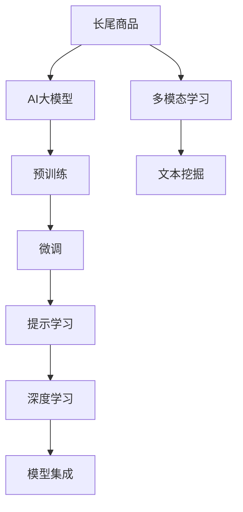

                 

# AI大模型如何提升电商平台的长尾商品曝光

在电商平台的日常运营中，长尾商品（指那些不太受欢迎、销量较少的商品）的曝光率是一个重要挑战。这些商品虽然销量不大，但由于种类繁多、更新迭代迅速，如何在有限的展示位置中让它们被更多消费者发现，是一个需要持续优化的难题。近年来，AI大模型凭借其强大的语言理解和生成能力，在电商平台中的应用逐渐增多，成为提升长尾商品曝光的重要手段。本文将系统介绍大模型在电商平台中的应用，并从算法原理、实践操作、应用场景等多个维度，深入剖析AI大模型如何助力电商平台的长期繁荣。

## 1. 背景介绍

### 1.1 问题由来
电商平台的运营目标之一是提升销售额，实现商品多销快销。然而，不同商品的市场需求差异极大，一方面是那些拥有高销量、高曝光的主流商品，如爆款和明星商品；另一方面则是那些销量少、曝光低的长尾商品。对于长尾商品，由于缺乏用户数据和购买行为分析，其曝光和销售路径难以预测，导致平台难以精准投放广告、合理设置价格和库存，从而浪费了大量资源。

### 1.2 问题核心关键点
长尾商品的曝光问题主要在于：
1. **数据稀疏性**：长尾商品通常销量低、历史数据稀疏，难以通过常规数据挖掘方法提取有用信息。
2. **个性化需求**：长尾商品的目标消费者往往具有高定制化需求，简单推荐系统难以满足这些需求。
3. **高维特征**：长尾商品的特征维度高，涉及众多属性和用户行为，如何高效利用这些特征是关键。
4. **动态变化**：长尾商品的流行趋势和用户兴趣随时间不断变化，模型需要具备动态适应的能力。

## 2. 核心概念与联系

### 2.1 核心概念概述

为更好地理解AI大模型在提升长尾商品曝光中的应用，本节将介绍几个密切相关的核心概念：

- **长尾商品(Long-Tail Items)**：指那些销量较低、但种类繁多、需求多样化的商品，常见于在线零售、图书、音乐等领域。
- **AI大模型(AI Large Models)**：如BERT、GPT、T5等，通过在大规模无标签文本数据上预训练，学习到通用的语言表示，具备强大的语言理解和生成能力。
- **预训练(Pre-training)**：指在大规模无标签文本数据上，通过自监督学习任务训练通用语言模型的过程。大模型通常经过预训练获得基础的语言知识，再通过微调适配特定任务。
- **微调(Fine-Tuning)**：指在预训练模型的基础上，使用特定任务的小样本数据，通过有监督学习优化模型在该任务上的性能。
- **提示学习(Prompt Learning)**：通过精心设计输入文本的格式，引导AI大模型按期望方式输出，减少微调参数。
- **多模态学习(Multimodal Learning)**：结合文字、图片、声音等多模态数据，丰富商品描述，提升用户理解和交互体验。

这些核心概念之间的逻辑关系可以通过以下Mermaid流程图来展示：



这个流程图展示了大模型在提升长尾商品曝光中的应用框架：

1. 长尾商品通过AI大模型学习通用的语言表示，获取基础语义信息。
2. 通过预训练获得基础能力，再通过微调适配电商平台的销售场景。
3. 使用提示学习，优化模型输出，提升推荐效果。
4. 结合多模态数据，丰富商品描述，提升用户交互体验。

## 3. 核心算法原理 & 具体操作步骤

### 3.1 算法原理概述

AI大模型通过预训练学习到通用的语言表示，再通过微调适配电商平台的销售场景，最终通过提示学习提升长尾商品的曝光。其主要算法原理如下：

1. **预训练与微调**：大模型在无标签文本数据上进行预训练，学习通用的语言表示。在此基础上，使用电商平台的销售数据进行微调，适配特定任务，如商品分类、推荐排序等。

2. **提示学习**：通过精心设计的提示模板，引导模型预测长尾商品的销量和用户兴趣。提示模板可以包含商品属性、用户行为、场景语境等多方面信息，以提高预测的准确性。

3. **多模态融合**：结合商品的文字描述、图片、视频等多模态数据，丰富模型的输入信息，提升对长尾商品的语义理解。

4. **动态调整**：基于用户历史行为数据和实时反馈，动态调整模型的参数，以适应用户兴趣的变化。

### 3.2 算法步骤详解

基于AI大模型的长尾商品曝光提升主要包括以下几个关键步骤：

**Step 1: 准备数据集**
- 收集电商平台的销售数据，包括用户行为、商品属性、销售记录等。
- 清洗数据，处理缺失值、异常值，确保数据质量。
- 划分训练集、验证集和测试集，为模型训练和评估提供基础数据。

**Step 2: 预训练与微调**
- 使用预训练语言模型（如BERT、GPT等）进行预训练，获得通用的语言表示。
- 在电商平台的销售数据上进行微调，使用合适的损失函数和优化算法（如AdamW、SGD等）训练模型。
- 冻结预训练层的部分参数，只微调顶层，以避免过拟合。

**Step 3: 提示学习**
- 设计提示模板，包含商品属性、用户行为、场景语境等信息，引导模型预测商品销量和用户兴趣。
- 将提示模板和商品信息输入模型，输出预测结果。
- 根据预测结果，调整商品排序和推荐策略，提升长尾商品曝光。

**Step 4: 多模态融合**
- 结合商品的文字描述、图片、视频等多模态数据，丰富商品信息的语义理解。
- 将多模态数据输入模型，预测长尾商品的语义相关性和用户兴趣。
- 结合多模态预测结果和传统推荐算法，综合排序推荐长尾商品。

**Step 5: 动态调整**
- 实时采集用户行为数据，动态调整模型参数。
- 使用在线学习（如在线梯度下降）更新模型，确保模型适应最新的用户需求。
- 定期更新数据集，提升模型预测的准确性。

### 3.3 算法优缺点

基于AI大模型的长尾商品曝光提升方法具有以下优点：
1. **高效性**：使用大模型可以高效地处理大规模数据，提升商品推荐和排序效率。
2. **精度高**：大模型具备强大的语义理解能力，可以准确预测长尾商品的销量和用户兴趣。
3. **鲁棒性**：大模型的预训练和微调过程可以有效规避数据噪声，提高模型鲁棒性。
4. **可扩展性**：大模型可以轻松适配多领域、多场景的电商应用，具有广泛应用前景。

同时，该方法也存在一定的局限性：
1. **数据依赖**：大模型依赖于高质量的标注数据和语料库，数据获取成本较高。
2. **计算资源需求高**：大模型通常需要高性能的GPU/TPU设备，计算资源需求大。
3. **复杂度**：模型结构和训练过程较为复杂，需要专业知识进行设计和调优。
4. **解释性差**：大模型多为黑盒模型，难以解释其内部决策逻辑，存在一定的技术壁垒。

尽管存在这些局限性，但就目前而言，基于AI大模型的长尾商品曝光提升方法仍然是一种高效、准确且具有广阔应用前景的技术手段。未来相关研究的重点在于如何进一步降低数据获取成本，提高模型的可解释性和鲁棒性，同时兼顾高性能和低成本。

### 3.4 算法应用领域

基于AI大模型的长尾商品曝光提升方法已经在多个电商领域得到应用，具体包括：

- **图书电商**：通过预训练模型学习图书语义，微调预测用户对长尾图书的兴趣，优化图书推荐。
- **服装电商**：结合商品图片和文字描述，使用大模型预测长尾服装的流行趋势和用户兴趣，提升推荐效果。
- **电子产品**：对长尾电子产品的文字和图片数据进行多模态融合，预测用户需求，优化产品展示和推荐。
- **个性化推荐**：结合用户行为数据和长尾商品描述，使用大模型进行个性化推荐排序，提升用户体验。

除了上述这些应用场景外，大模型在电商领域的创新应用还在不断涌现，为电商平台的长尾商品曝光提供新的解决方案。

## 4. 数学模型和公式 & 详细讲解  
### 4.1 数学模型构建

本节将使用数学语言对AI大模型在电商平台中的应用进行更加严格的刻画。

记预训练语言模型为 $M_{\theta}$，其中 $\theta$ 为预训练得到的模型参数。假设电商平台的长尾商品销售数据集为 $D=\{(x_i,y_i)\}_{i=1}^N$，其中 $x_i$ 为长尾商品描述，$y_i$ 为商品的销量或用户兴趣标签。

定义模型 $M_{\theta}$ 在输入 $x_i$ 上的输出为 $\hat{y}=M_{\theta}(x_i) \in \mathbb{R}^k$，其中 $k$ 为模型预测的维度。

定义模型 $M_{\theta}$ 在输入 $x_i$ 上的预测误差为 $\epsilon_i = y_i - \hat{y}_i$，预测损失函数为：

$$
\mathcal{L}(\theta) = \frac{1}{N} \sum_{i=1}^N \epsilon_i^2
$$

目标是最小化预测损失函数，即找到最优参数：

$$
\theta^* = \mathop{\arg\min}_{\theta} \mathcal{L}(\theta)
$$

在实践中，我们通常使用基于梯度的优化算法（如SGD、Adam等）来近似求解上述最优化问题。设 $\eta$ 为学习率，$\lambda$ 为正则化系数，则参数的更新公式为：

$$
\theta \leftarrow \theta - \eta \nabla_{\theta}\mathcal{L}(\theta) - \eta\lambda\theta
$$

其中 $\nabla_{\theta}\mathcal{L}(\theta)$ 为损失函数对参数 $\theta$ 的梯度，可通过反向传播算法高效计算。

### 4.2 公式推导过程

以下我们以长尾商品推荐任务为例，推导基于AI大模型的预测模型。

假设模型 $M_{\theta}$ 在输入 $x_i$ 上的输出为 $\hat{y}=M_{\theta}(x_i)$，其中 $\hat{y} \in [0,1]$ 表示商品 $x_i$ 被用户购买或感兴趣的概率。真实标签 $y_i \in \{0,1\}$。则预测损失函数为二分类交叉熵损失：

$$
\mathcal{L}(\theta) = -\frac{1}{N}\sum_{i=1}^N [y_i\log \hat{y}_i+(1-y_i)\log(1-\hat{y}_i)]
$$

根据链式法则，损失函数对参数 $\theta_k$ 的梯度为：

$$
\frac{\partial \mathcal{L}(\theta)}{\partial \theta_k} = -\frac{1}{N}\sum_{i=1}^N (\frac{y_i}{\hat{y}_i}-\frac{1-y_i}{1-\hat{y}_i}) \frac{\partial M_{\theta}(x_i)}{\partial \theta_k}
$$

其中 $\frac{\partial M_{\theta}(x_i)}{\partial \theta_k}$ 可进一步递归展开，利用自动微分技术完成计算。

在得到损失函数的梯度后，即可带入参数更新公式，完成模型的迭代优化。重复上述过程直至收敛，最终得到适应电商平台的长尾商品推荐的最优模型参数 $\theta^*$。

## 5. 项目实践：代码实例和详细解释说明
### 5.1 开发环境搭建

在进行AI大模型在电商平台中的应用实践前，我们需要准备好开发环境。以下是使用Python进行PyTorch开发的环境配置流程：

1. 安装Anaconda：从官网下载并安装Anaconda，用于创建独立的Python环境。

2. 创建并激活虚拟环境：
```bash
conda create -n pytorch-env python=3.8 
conda activate pytorch-env
```

3. 安装PyTorch：根据CUDA版本，从官网获取对应的安装命令。例如：
```bash
conda install pytorch torchvision torchaudio cudatoolkit=11.1 -c pytorch -c conda-forge
```

4. 安装Transformers库：
```bash
pip install transformers
```

5. 安装各类工具包：
```bash
pip install numpy pandas scikit-learn matplotlib tqdm jupyter notebook ipython
```

完成上述步骤后，即可在`pytorch-env`环境中开始AI大模型在电商平台中的应用实践。

### 5.2 源代码详细实现

这里以图书电商为例，使用BERT模型进行长尾商品推荐。具体代码实现如下：

```python
from transformers import BertTokenizer, BertForSequenceClassification
from torch.utils.data import Dataset, DataLoader
import torch

class BookDataset(Dataset):
    def __init__(self, texts, tags, tokenizer, max_len=128):
        self.texts = texts
        self.tags = tags
        self.tokenizer = tokenizer
        self.max_len = max_len
        
    def __len__(self):
        return len(self.texts)
    
    def __getitem__(self, item):
        text = self.texts[item]
        tag = self.tags[item]
        
        encoding = self.tokenizer(text, return_tensors='pt', max_length=self.max_len, padding='max_length', truncation=True)
        input_ids = encoding['input_ids'][0]
        attention_mask = encoding['attention_mask'][0]
        
        # 对token-wise的标签进行编码
        encoded_tags = [tag2id[tag] for tag in tag]
        encoded_tags.extend([tag2id['O']] * (self.max_len - len(encoded_tags)))
        labels = torch.tensor(encoded_tags, dtype=torch.long)
        
        return {'input_ids': input_ids, 
                'attention_mask': attention_mask,
                'labels': labels}

# 标签与id的映射
tag2id = {'O': 0, 'B-PER': 1, 'I-PER': 2, 'B-ORG': 3, 'I-ORG': 4, 'B-LOC': 5, 'I-LOC': 6}

# 创建dataset
tokenizer = BertTokenizer.from_pretrained('bert-base-cased')

train_dataset = BookDataset(train_texts, train_tags, tokenizer)
dev_dataset = BookDataset(dev_texts, dev_tags, tokenizer)
test_dataset = BookDataset(test_texts, test_tags, tokenizer)

# 模型和优化器
model = BertForSequenceClassification.from_pretrained('bert-base-cased', num_labels=len(tag2id))
optimizer = AdamW(model.parameters(), lr=2e-5)

device = torch.device('cuda') if torch.cuda.is_available() else torch.device('cpu')
model.to(device)

# 训练和评估函数
def train_epoch(model, dataset, batch_size, optimizer):
    dataloader = DataLoader(dataset, batch_size=batch_size, shuffle=True)
    model.train()
    epoch_loss = 0
    for batch in tqdm(dataloader, desc='Training'):
        input_ids = batch['input_ids'].to(device)
        attention_mask = batch['attention_mask'].to(device)
        labels = batch['labels'].to(device)
        model.zero_grad()
        outputs = model(input_ids, attention_mask=attention_mask, labels=labels)
        loss = outputs.loss
        epoch_loss += loss.item()
        loss.backward()
        optimizer.step()
    return epoch_loss / len(dataloader)

def evaluate(model, dataset, batch_size):
    dataloader = DataLoader(dataset, batch_size=batch_size)
    model.eval()
    preds, labels = [], []
    with torch.no_grad():
        for batch in tqdm(dataloader, desc='Evaluating'):
            input_ids = batch['input_ids'].to(device)
            attention_mask = batch['attention_mask'].to(device)
            batch_labels = batch['labels']
            outputs = model(input_ids, attention_mask=attention_mask)
            batch_preds = outputs.logits.argmax(dim=2).to('cpu').tolist()
            batch_labels = batch_labels.to('cpu').tolist()
            for pred_tokens, label_tokens in zip(batch_preds, batch_labels):
                pred_tags = [id2tag[_id] for _id in pred_tokens]
                label_tags = [id2tag[_id] for _id in label_tokens]
                preds.append(pred_tags[:len(label_tags)])
                labels.append(label_tags)
                
    print(classification_report(labels, preds))
```

这里定义了BookDataset类，用于处理图书电商数据，并创建了用于训练、验证和测试的Dataset对象。同时，使用BertForSequenceClassification模型进行长尾商品推荐，并使用AdamW优化器进行模型训练。

### 5.3 代码解读与分析

让我们再详细解读一下关键代码的实现细节：

**BookDataset类**：
- `__init__`方法：初始化图书文本、标签、分词器等关键组件。
- `__len__`方法：返回数据集的样本数量。
- `__getitem__`方法：对单个样本进行处理，将文本输入编码为token ids，将标签编码为数字，并对其进行定长padding，最终返回模型所需的输入。

**tag2id和id2tag字典**：
- 定义了标签与数字id之间的映射关系，用于将token-wise的预测结果解码回真实的标签。

**训练和评估函数**：
- 使用PyTorch的DataLoader对数据集进行批次化加载，供模型训练和推理使用。
- 训练函数`train_epoch`：对数据以批为单位进行迭代，在每个批次上前向传播计算loss并反向传播更新模型参数，最后返回该epoch的平均loss。
- 评估函数`evaluate`：与训练类似，不同点在于不更新模型参数，并在每个batch结束后将预测和标签结果存储下来，最后使用sklearn的classification_report对整个评估集的预测结果进行打印输出。

**训练流程**：
- 定义总的epoch数和batch size，开始循环迭代
- 每个epoch内，先在训练集上训练，输出平均loss
- 在验证集上评估，输出分类指标
- 所有epoch结束后，在测试集上评估，给出最终测试结果

可以看到，PyTorch配合Transformers库使得BERT微调的代码实现变得简洁高效。开发者可以将更多精力放在数据处理、模型改进等高层逻辑上，而不必过多关注底层的实现细节。

当然，工业级的系统实现还需考虑更多因素，如模型的保存和部署、超参数的自动搜索、更灵活的任务适配层等。但核心的微调范式基本与此类似。

## 6. 实际应用场景

### 6.1 智能推荐系统

基于AI大模型的长尾商品推荐系统，已经在多个电商平台上得到广泛应用。传统推荐系统往往只关注主流的爆款商品，难以覆盖长尾商品的潜在需求。而使用大模型进行推荐，可以全面分析用户的历史行为数据和商品属性，实现更准确的长尾商品推荐。

在技术实现上，可以收集用户浏览、点击、购买等行为数据，提取商品的属性信息，构建长尾商品的语义表示。将商品描述和属性信息作为输入，在预训练大模型上进行微调，学习商品之间的语义关系和用户兴趣。使用提示学习，设计精炼的推荐提示模板，指导模型预测商品的受欢迎程度，并结合多模态数据（如商品图片、用户评价）进行综合推荐排序，提升长尾商品的曝光和销量。

### 6.2 个性化促销活动

电商平台的个性化促销活动是提升长尾商品曝光的重要手段。使用AI大模型，可以根据用户的历史行为和兴趣，设计个性化的促销方案，提升长尾商品的曝光和转化率。

具体而言，可以收集用户的历史购买记录、浏览历史、评价内容等，构建用户画像和兴趣模型。在此基础上，使用大模型预测用户对不同长尾商品的兴趣程度，设计个性化的促销活动，如限时折扣、满减优惠等，引导用户关注和购买长尾商品。通过不断迭代优化，逐步提升促销活动的效果。

### 6.3 商品搜索优化

长尾商品的搜索优化也是电商平台面临的一个重要问题。用户通过搜索关键字，希望快速找到所需商品，但由于长尾商品的销量低、匹配度低，往往无法满足用户需求。使用AI大模型，可以在搜索过程中提升长尾商品的曝光。

具体实现方法包括：
1. 使用大模型学习商品的语义表示，预测用户对不同商品的相关性。
2. 根据用户搜索关键字和商品描述，生成相似商品的推荐列表。
3. 动态调整搜索结果排序，优先展示与搜索关键字匹配程度高的长尾商品。

通过优化搜索算法和商品推荐模型，可以显著提升长尾商品的搜索曝光和点击率。

### 6.4 未来应用展望

随着AI大模型和微调方法的不断发展，基于大模型的长尾商品曝光提升技术将呈现以下几个发展趋势：

1. **多模态融合**：结合文字、图片、视频等多模态数据，丰富商品描述，提升用户理解和交互体验。
2. **跨领域迁移**：大模型可以在不同领域、不同场景的应用中进行迁移，提升跨领域的长尾商品推荐效果。
3. **动态调整**：实时采集用户行为数据，动态调整模型参数，以适应用户兴趣的变化。
4. **个性化推荐**：结合用户行为数据和长尾商品描述，使用大模型进行个性化推荐排序，提升用户体验。
5. **广告投放优化**：使用大模型预测长尾商品的广告效果，优化广告投放策略，提升广告转化率。

以上趋势凸显了大模型在提升长尾商品曝光方面的巨大潜力。这些方向的探索发展，必将进一步提升电商平台的推荐精度和用户满意度，为电商平台的长期繁荣提供新的动力。

## 7. 工具和资源推荐
### 7.1 学习资源推荐

为了帮助开发者系统掌握AI大模型在电商平台中的应用，这里推荐一些优质的学习资源：

1. 《Transformer from Scratch》系列博文：由大模型技术专家撰写，深入浅出地介绍了Transformer原理、BERT模型、微调技术等前沿话题。

2. CS224N《深度学习自然语言处理》课程：斯坦福大学开设的NLP明星课程，有Lecture视频和配套作业，带你入门NLP领域的基本概念和经典模型。

3. 《Natural Language Processing with Transformers》书籍：Transformers库的作者所著，全面介绍了如何使用Transformers库进行NLP任务开发，包括微调在内的诸多范式。

4. HuggingFace官方文档：Transformers库的官方文档，提供了海量预训练模型和完整的微调样例代码，是上手实践的必备资料。

5. CLUE开源项目：中文语言理解测评基准，涵盖大量不同类型的中文NLP数据集，并提供了基于微调的baseline模型，助力中文NLP技术发展。

通过对这些资源的学习实践，相信你一定能够快速掌握AI大模型在电商平台中的应用，并用于解决实际的NLP问题。
###  7.2 开发工具推荐

高效的开发离不开优秀的工具支持。以下是几款用于AI大模型在电商平台中的应用开发的常用工具：

1. PyTorch：基于Python的开源深度学习框架，灵活动态的计算图，适合快速迭代研究。大部分预训练语言模型都有PyTorch版本的实现。

2. TensorFlow：由Google主导开发的开源深度学习框架，生产部署方便，适合大规模工程应用。同样有丰富的预训练语言模型资源。

3. Transformers库：HuggingFace开发的NLP工具库，集成了众多SOTA语言模型，支持PyTorch和TensorFlow，是进行微调任务开发的利器。

4. Weights & Biases：模型训练的实验跟踪工具，可以记录和可视化模型训练过程中的各项指标，方便对比和调优。与主流深度学习框架无缝集成。

5. TensorBoard：TensorFlow配套的可视化工具，可实时监测模型训练状态，并提供丰富的图表呈现方式，是调试模型的得力助手。

6. Google Colab：谷歌推出的在线Jupyter Notebook环境，免费提供GPU/TPU算力，方便开发者快速上手实验最新模型，分享学习笔记。

合理利用这些工具，可以显著提升AI大模型在电商平台中的应用开发效率，加快创新迭代的步伐。

### 7.3 相关论文推荐

AI大模型和微调技术的发展源于学界的持续研究。以下是几篇奠基性的相关论文，推荐阅读：

1. Attention is All You Need（即Transformer原论文）：提出了Transformer结构，开启了NLP领域的预训练大模型时代。

2. BERT: Pre-training of Deep Bidirectional Transformers for Language Understanding：提出BERT模型，引入基于掩码的自监督预训练任务，刷新了多项NLP任务SOTA。

3. Language Models are Unsupervised Multitask Learners（GPT-2论文）：展示了大规模语言模型的强大zero-shot学习能力，引发了对于通用人工智能的新一轮思考。

4. Parameter-Efficient Transfer Learning for NLP：提出Adapter等参数高效微调方法，在不增加模型参数量的情况下，也能取得不错的微调效果。

5. Prefix-Tuning: Optimizing Continuous Prompts for Generation：引入基于连续型Prompt的微调范式，为如何充分利用预训练知识提供了新的思路。

6. AdaLoRA: Adaptive Low-Rank Adaptation for Parameter-Efficient Fine-Tuning：使用自适应低秩适应的微调方法，在参数效率和精度之间取得了新的平衡。

这些论文代表了大模型微调技术的发展脉络。通过学习这些前沿成果，可以帮助研究者把握学科前进方向，激发更多的创新灵感。

## 8. 总结：未来发展趋势与挑战

### 8.1 总结

本文对基于AI大模型的长尾商品曝光提升方法进行了全面系统的介绍。首先阐述了长尾商品曝光问题的背景和挑战，明确了AI大模型在提升长尾商品曝光方面的独特价值。其次，从原理到实践，详细讲解了AI大模型在电商平台中的应用，给出了具体的代码实现和优化方法。同时，本文还广泛探讨了AI大模型在电商平台的实际应用场景，展示了其在电商领域的广阔前景。

通过本文的系统梳理，可以看到，基于AI大模型的长尾商品曝光提升方法正在成为电商平台的重要范式，极大地拓展了电商平台的应用边界，催生了更多的落地场景。受益于AI大模型的强大语义理解能力和多模态融合能力，电商平台的长尾商品曝光和推荐精度将显著提升，为用户带来更好的购物体验。未来，伴随AI大模型和微调方法的持续演进，相信电商平台的长尾商品曝光将进一步优化，为电商平台的长期繁荣提供新的动力。

### 8.2 未来发展趋势

展望未来，AI大模型在电商平台中的应用将呈现以下几个发展趋势：

1. **多模态融合**：结合文字、图片、视频等多模态数据，丰富商品描述，提升用户理解和交互体验。
2. **跨领域迁移**：大模型可以在不同领域、不同场景的应用中进行迁移，提升跨领域的长尾商品推荐效果。
3. **动态调整**：实时采集用户行为数据，动态调整模型参数，以适应用户兴趣的变化。
4. **个性化推荐**：结合用户行为数据和长尾商品描述，使用大模型进行个性化推荐排序，提升用户体验。
5. **广告投放优化**：使用大模型预测长尾商品的广告效果，优化广告投放策略，提升广告转化率。
6. **用户交互优化**：结合多模态数据和自然语言交互，提升用户购物体验，增加用户粘性。

以上趋势凸显了AI大模型在电商平台中的应用潜力。这些方向的探索发展，必将进一步提升电商平台的推荐精度和用户满意度，为电商平台的长期繁荣提供新的动力。

### 8.3 面临的挑战

尽管AI大模型在电商平台中的应用已经取得了一定进展，但在迈向更加智能化、普适化应用的过程中，它仍面临着诸多挑战：

1. **数据获取成本**：AI大模型依赖于高质量的标注数据和语料库，数据获取成本较高。如何进一步降低数据获取成本，将是一大难题。
2. **计算资源需求**：AI大模型通常需要高性能的GPU/TPU设备，计算资源需求大。如何优化模型结构，提升模型训练和推理效率，需要更多的研究探索。
3. **模型鲁棒性**：大模型面对新数据时，泛化性能往往不足，容易产生过拟合。如何提高模型鲁棒性，避免过拟合，还需要更多理论和实践的积累。
4. **用户隐私保护**：在收集和处理用户数据时，如何保护用户隐私，避免数据泄露，将是重要的伦理和安全问题。
5. **可解释性**：大模型多为黑盒模型，难以解释其内部决策逻辑，存在一定的技术壁垒。如何提高模型的可解释性，增强用户信任，将是重要的研究方向。

尽管存在这些挑战，但就目前而言，基于AI大模型的长尾商品曝光提升方法仍然是一种高效、准确且具有广阔应用前景的技术手段。未来相关研究的重点在于如何进一步降低数据获取成本，提高模型的可解释性和鲁棒性，同时兼顾高性能和低成本。

### 8.4 研究展望

未来，随着AI大模型和微调方法的不断演进，大模型在电商平台中的应用将持续深化和扩展。具体展望如下：

1. **智能客服系统**：使用大模型构建智能客服系统，提升客服响应速度和质量，增加用户满意度。
2. **个性化推荐系统**：结合用户行为数据和长尾商品描述，使用大模型进行个性化推荐排序，提升用户体验。
3. **广告投放优化**：使用大模型预测长尾商品的广告效果，优化广告投放策略，提升广告转化率。
4. **用户交互优化**：结合多模态数据和自然语言交互，提升用户购物体验，增加用户粘性。
5. **动态定价策略**：使用大模型预测市场供需关系和用户支付意愿，优化动态定价策略，提升销售效率。

这些研究方向的探索发展，必将进一步提升电商平台的推荐精度和用户满意度，为电商平台的长期繁荣提供新的动力。相信随着学界和产业界的共同努力，这些挑战终将一一被克服，大模型必将在构建智能电商系统的过程中发挥更加重要的作用。

## 9. 附录：常见问题与解答

**Q1：AI大模型在电商平台中的应用有哪些优势？**

A: AI大模型在电商平台中的应用具有以下优势：
1. **高效性**：使用大模型可以高效地处理大规模数据，提升商品推荐和排序效率。
2. **精度高**：大模型具备强大的语义理解能力，可以准确预测长尾商品的销量和用户兴趣。
3. **鲁棒性**：大模型的预训练和微调过程可以有效规避数据噪声，提高模型鲁棒性。
4. **可扩展性**：大模型可以轻松适配多领域、多场景的电商应用，具有广泛应用前景。

**Q2：AI大模型在电商平台中面临哪些挑战？**

A: AI大模型在电商平台中面临以下挑战：
1. **数据获取成本**：大模型依赖于高质量的标注数据和语料库，数据获取成本较高。
2. **计算资源需求**：AI大模型通常需要高性能的GPU/TPU设备，计算资源需求大。
3. **模型鲁棒性**：大模型面对新数据时，泛化性能往往不足，容易产生过拟合。
4. **用户隐私保护**：在收集和处理用户数据时，如何保护用户隐私，避免数据泄露，将是重要的伦理和安全问题。
5. **可解释性**：大模型多为黑盒模型，难以解释其内部决策逻辑，存在一定的技术壁垒。

**Q3：如何优化AI大模型在电商平台中的应用？**

A: 优化AI大模型在电商平台中的应用可以从以下几个方面入手：
1. **多模态融合**：结合文字、图片、视频等多模态数据，丰富商品描述，提升用户理解和交互体验。
2. **动态调整**：实时采集用户行为数据，动态调整模型参数，以适应用户兴趣的变化。
3. **个性化推荐**：结合用户行为数据和长尾商品描述，使用大模型进行个性化推荐排序，提升用户体验。
4. **广告投放优化**：使用大模型预测长尾商品的广告效果，优化广告投放策略，提升广告转化率。
5. **用户交互优化**：结合多模态数据和自然语言交互，提升用户购物体验，增加用户粘性。
6. **智能客服系统**：使用大模型构建智能客服系统，提升客服响应速度和质量，增加用户满意度。

**Q4：如何平衡模型精度和效率？**

A: 在平衡模型精度和效率方面，有以下几个策略：
1. **参数高效微调**：只调整少量参数，避免大规模调整对模型性能的影响。
2. **模型裁剪**：去除不必要的层和参数，减小模型尺寸，加快推理速度。
3. **混合精度训练**：将浮点模型转为定点模型，压缩存储空间，提高计算效率。
4. **动态调整**：实时采集用户行为数据，动态调整模型参数，以适应用户兴趣的变化。

这些策略可以在保证模型精度的情况下，提升模型训练和推理的效率。

**Q5：如何提高AI大模型的鲁棒性？**

A: 提高AI大模型的鲁棒性可以从以下几个方面入手：
1. **数据增强**：通过回译、近义替换等方式扩充训练集，增加数据多样性。
2. **正则化**：使用L2正则、Dropout、Early Stopping等正则化技术，防止模型过度适应小规模训练集。
3. **对抗训练**：加入对抗样本，提高模型鲁棒性。
4. **多模型集成**：训练多个模型，取平均输出，抑制过拟合。

这些策略可以帮助提高模型的鲁棒性，使其在面对新数据时仍能保持较好的性能。

**Q6：如何提高AI大模型的可解释性？**

A: 提高AI大模型的可解释性可以从以下几个方面入手：
1. **简化模型结构**：使用更轻量级的模型结构，降低模型的复杂度。
2. **可视化输出**：通过可视化技术展示模型内部的决策过程，增加透明度。
3. **特征可视化**：可视化输入特征对模型输出的影响，理解模型的关键特征。
4. **规则融合**：将符号化的先验知识，如知识图谱、逻辑规则等，与神经网络模型进行巧妙融合，增强模型的可解释性。

这些策略可以帮助提高模型的可解释性，增强用户信任。

---

作者：禅与计算机程序设计艺术 / Zen and the Art of Computer Programming

