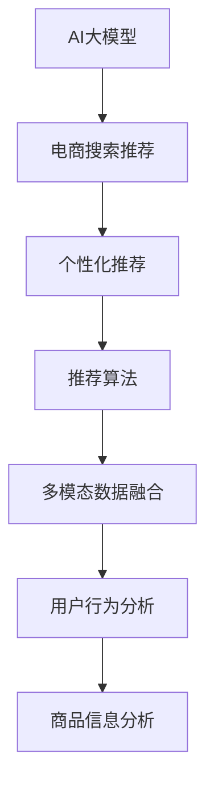

                 

# AI大模型视角下电商搜索推荐的创新应用场景探索

> 关键词：电商搜索推荐,AI大模型,个性化推荐系统,深度学习,机器学习,推荐算法,用户行为分析,多模态数据融合,大数据技术

## 1. 背景介绍

### 1.1 问题由来
随着互联网技术的迅猛发展，电商平台已成为人们日常生活和消费的重要平台。据统计，2023年全球电商平台销售额预计将达到10万亿美元以上，占全球零售总额的15%左右。然而，尽管电商平台的规模不断扩大，用户购物体验和转化率仍面临诸多挑战。

一方面，用户对商品的需求日益多样化和个性化，传统的搜索推荐机制难以满足用户需求，导致购物体验不佳，流失率上升。另一方面，电商平台海量数据和复杂用户行为数据的管理与分析，对技术要求极高，需要依赖先进的数据分析和推荐算法。

在此背景下，AI大模型被引入电商领域，助力电商平台实现个性化推荐系统的构建。通过大模型的强大学习能力，电商平台能够深入挖掘用户行为和偏好，生成精准的推荐结果，显著提升用户体验和转化率。本文将从AI大模型的视角，探讨其在电商搜索推荐领域的创新应用场景。

### 1.2 问题核心关键点
基于AI大模型的电商搜索推荐系统，核心目标是通过精准分析用户行为数据和商品信息，为用户生成个性化推荐。具体核心点包括：

- AI大模型通过预训练学习大量无标签数据，获取广泛的语义和知识背景。
- 电商搜索推荐系统通过微调大模型，学习用户行为特征和商品属性，生成个性化推荐。
- 多模态数据融合：结合用户行为数据、商品信息、社交网络等多源数据，提升推荐效果。
- 个性化推荐模型的训练和部署：通过持续学习和实时更新，保证推荐结果的时效性和准确性。

本文将深入探讨这些关键问题，分析AI大模型在电商搜索推荐系统中的创新应用场景，旨在为电商平台的推荐系统开发提供可行的技术方案。

## 2. 核心概念与联系

### 2.1 核心概念概述

为更好地理解AI大模型在电商搜索推荐系统中的应用，本节将介绍几个密切相关的核心概念：

- AI大模型：以Transformer架构为基础，通过大规模无标签数据进行预训练的大规模预训练模型。例如GPT、BERT、XLNet等，具备强大的语言理解和生成能力。
- 电商搜索推荐系统：通过分析用户行为数据和商品信息，为用户生成个性化的商品推荐结果，提升用户体验和转化率。
- 多模态数据融合：结合用户行为数据、商品信息、社交网络等多源数据，提升推荐效果。
- 个性化推荐模型：通过学习用户行为特征和商品属性，生成个性化的推荐结果。
- 推荐算法：用于优化推荐模型的算法，如协同过滤、矩阵分解、基于深度学习的推荐模型等。

这些核心概念之间的逻辑关系可以通过以下Mermaid流程图来展示：



这个流程图展示了大模型的核心概念及其之间的关系：

1. 大模型通过预训练获得基础能力。
2. 电商搜索推荐系统通过对大模型的微调，学习用户行为特征和商品属性。
3. 多模态数据融合和用户行为分析、商品信息分析等任务，为推荐系统提供更全面的数据支持。
4. 推荐算法用于优化推荐模型的效果。

这些概念共同构成了电商搜索推荐系统的技术框架，使其能够高效地处理海量数据，生成精准的个性化推荐。

## 3. 核心算法原理 & 具体操作步骤
### 3.1 算法原理概述

基于AI大模型的电商搜索推荐系统，主要采用以下算法原理：

- 预训练：AI大模型通过大规模无标签数据进行预训练，学习通用的语言知识和常识。
- 微调：电商搜索推荐系统通过对预训练模型进行微调，学习用户行为特征和商品属性，生成个性化推荐。
- 多模态数据融合：结合用户行为数据、商品信息、社交网络等多源数据，提升推荐效果。
- 推荐算法：用于优化推荐模型的算法，如协同过滤、矩阵分解、基于深度学习的推荐模型等。

电商搜索推荐系统的核心流程如下：

1. 数据收集：收集用户的浏览历史、购买记录、评分反馈等行为数据，以及商品的标题、描述、图片、价格等属性信息。
2. 数据预处理：对收集的数据进行清洗、去重、归一化等处理，生成训练数据集。
3. 模型微调：利用AI大模型对电商数据集进行微调，学习用户行为特征和商品属性。
4. 推荐生成：结合多模态数据融合和推荐算法，生成个性化推荐结果。
5. 推荐更新：根据用户的反馈和新数据，持续更新推荐模型，提升推荐效果。

### 3.2 算法步骤详解

以下是电商搜索推荐系统的主要算法步骤：

**Step 1: 数据收集与预处理**
- 收集用户的浏览历史、购买记录、评分反馈等行为数据。
- 收集商品的标题、描述、图片、价格等属性信息。
- 对数据进行清洗、去重、归一化等处理，生成训练数据集。

**Step 2: 模型微调**
- 选择合适的预训练模型，如BERT、GPT等。
- 定义推荐系统的损失函数，例如均方误差损失或交叉熵损失。
- 设置微调超参数，如学习率、批次大小、迭代轮数等。
- 使用微调算法对预训练模型进行优化，学习用户行为特征和商品属性。

**Step 3: 多模态数据融合**
- 结合用户行为数据、商品信息、社交网络等多源数据，提升推荐效果。
- 通过文本处理、特征提取、向量拼接等技术，将不同模态的数据进行融合。

**Step 4: 推荐生成**
- 定义推荐算法，如协同过滤、矩阵分解、基于深度学习的推荐模型等。
- 利用融合后的多模态数据，生成个性化推荐结果。

**Step 5: 推荐更新**
- 根据用户的反馈和新数据，持续更新推荐模型，提升推荐效果。
- 使用A/B测试等方法，评估推荐模型的性能和用户体验。

### 3.3 算法优缺点

基于AI大模型的电商搜索推荐系统，具有以下优点：

- 高效性：大模型的预训练和微调过程可以在较短时间内完成，生成个性化推荐速度快。
- 准确性：通过学习大量的无标签数据，大模型具备强大的语言理解能力，生成推荐结果准确性高。
- 可扩展性：多模态数据融合和推荐算法结合，提升推荐系统的可扩展性和适应性。

同时，该方法也存在一定的局限性：

- 数据依赖：电商搜索推荐系统高度依赖标注数据，数据量和质量对推荐效果有重要影响。
- 计算资源：大模型的参数量和计算复杂度较高，需要大量计算资源进行训练和推理。
- 泛化能力：若数据分布和实际应用场景差异较大，大模型可能难以适应，生成推荐结果偏差较大。

尽管存在这些局限性，但就目前而言，基于AI大模型的电商搜索推荐方法仍是大数据技术落地应用的重要范式。未来相关研究的重点在于如何进一步降低对标注数据的依赖，提高模型的跨领域迁移能力，同时兼顾可解释性和伦理安全性等因素。

### 3.4 算法应用领域

基于AI大模型的电商搜索推荐系统，在多个电商场景中得到了广泛应用，例如：

- 商品推荐：为用户推荐感兴趣的商品，提升购物体验。
- 个性化广告：根据用户行为特征，生成个性化广告，提升广告转化率。
- 活动推荐：为用户推荐感兴趣的促销活动，提升用户参与度和活动效果。
- 搜索优化：根据用户的搜索行为，优化搜索结果，提升搜索效率。

除了上述这些经典场景外，大模型推荐技术还被创新性地应用到更多电商场景中，如联合推荐、社交电商、商品搭配推荐等，为电商平台带来了新的增长点和用户粘性。随着大语言模型和推荐方法的不断进步，相信电商推荐系统将在更广阔的应用领域大放异彩。

## 4. 数学模型和公式 & 详细讲解
### 4.1 数学模型构建

假设电商搜索推荐系统包含 $N$ 个用户和 $M$ 个商品，用户行为数据和商品属性数据组成数据矩阵 $X \in \mathbb{R}^{N \times D}$，其中 $D$ 为特征维度。设用户 $i$ 对商品 $j$ 的评分（行为数据）为 $r_{ij}$，商品的特征向量为 $h_j \in \mathbb{R}^d$，其中 $d$ 为商品特征维度。

定义推荐模型为 $f: \mathbb{R}^d \rightarrow \mathbb{R}$，用于生成用户对商品的评分预测。则推荐模型的损失函数为：

$$
\mathcal{L}(f) = \frac{1}{N} \sum_{i=1}^N \sum_{j=1}^M [r_{ij} - f(h_j)]^2
$$

### 4.2 公式推导过程

为了更精确地预测用户对商品的评分，推荐模型可以采用深度神经网络，如矩阵分解和深度神经网络混合模型。以下以深度神经网络为例，推导推荐模型的计算公式。

假设推荐模型为 $f = W_2 \cdot \sigma(W_1 h_j + b_1)$，其中 $W_1, W_2$ 为权重矩阵，$b_1$ 为偏置项。则推荐模型的预测评分为：

$$
f(h_j) = W_2 \cdot \sigma(W_1 h_j + b_1)
$$

将推荐模型的预测评分 $f(h_j)$ 与用户评分 $r_{ij}$ 的误差平方和代入损失函数，得：

$$
\mathcal{L}(f) = \frac{1}{N} \sum_{i=1}^N \sum_{j=1}^M (r_{ij} - f(h_j))^2
$$

根据链式法则，求导得：

$$
\frac{\partial \mathcal{L}(f)}{\partial W_1} = \frac{2}{N} \sum_{i=1}^N \sum_{j=1}^M (r_{ij} - f(h_j)) \cdot h_j
$$

$$
\frac{\partial \mathcal{L}(f)}{\partial W_2} = \frac{2}{N} \sum_{i=1}^N \sum_{j=1}^M (r_{ij} - f(h_j)) \cdot \sigma(W_1 h_j + b_1)
$$

$$
\frac{\partial \mathcal{L}(f)}{\partial b_1} = \frac{2}{N} \sum_{i=1}^N \sum_{j=1}^M (r_{ij} - f(h_j))
$$

使用梯度下降算法，对推荐模型的参数进行优化，更新权重矩阵和偏置项：

$$
W_1 \leftarrow W_1 - \eta \frac{\partial \mathcal{L}(f)}{\partial W_1}
$$

$$
W_2 \leftarrow W_2 - \eta \frac{\partial \mathcal{L}(f)}{\partial W_2}
$$

$$
b_1 \leftarrow b_1 - \eta \frac{\partial \mathcal{L}(f)}{\partial b_1}
$$

其中 $\eta$ 为学习率。

### 4.3 案例分析与讲解

以下以深度神经网络混合模型为例，分析推荐模型的优化过程：

假设推荐模型采用深度神经网络，并结合用户行为数据和商品属性数据进行优化。设用户行为数据和商品属性数据的组合为 $X$，其中用户行为数据占 $k$ 个特征，商品属性数据占 $d-k$ 个特征。

设用户行为数据为 $x_i \in \mathbb{R}^{k}$，商品属性数据为 $h_j \in \mathbb{R}^{d-k}$，则推荐模型的预测评分为：

$$
f(h_j) = W_2 \cdot \sigma(W_1 h_j + b_1)
$$

推荐模型的损失函数为：

$$
\mathcal{L}(f) = \frac{1}{N} \sum_{i=1}^N \sum_{j=1}^M (r_{ij} - f(h_j))^2
$$

使用梯度下降算法，对推荐模型的参数进行优化，更新权重矩阵和偏置项：

$$
W_1 \leftarrow W_1 - \eta \frac{1}{N} \sum_{i=1}^N \sum_{j=1}^M (r_{ij} - f(h_j)) \cdot x_i
$$

$$
W_2 \leftarrow W_2 - \eta \frac{1}{N} \sum_{i=1}^N \sum_{j=1}^M (r_{ij} - f(h_j)) \cdot \sigma(W_1 h_j + b_1)
$$

$$
b_1 \leftarrow b_1 - \eta \frac{1}{N} \sum_{i=1}^N \sum_{j=1}^M (r_{ij} - f(h_j))
$$

其中 $\eta$ 为学习率。

## 5. 项目实践：代码实例和详细解释说明
### 5.1 开发环境搭建

在进行电商搜索推荐系统开发前，我们需要准备好开发环境。以下是使用Python进行PyTorch开发的环境配置流程：

1. 安装Anaconda：从官网下载并安装Anaconda，用于创建独立的Python环境。

2. 创建并激活虚拟环境：
```bash
conda create -n pytorch-env python=3.8 
conda activate pytorch-env
```

3. 安装PyTorch：根据CUDA版本，从官网获取对应的安装命令。例如：
```bash
conda install pytorch torchvision torchaudio cudatoolkit=11.1 -c pytorch -c conda-forge
```

4. 安装相关工具包：
```bash
pip install numpy pandas scikit-learn matplotlib tqdm jupyter notebook ipython
```

完成上述步骤后，即可在`pytorch-env`环境中开始电商搜索推荐系统的开发。

### 5.2 源代码详细实现

以下是一个简单的电商搜索推荐系统实现，包含数据预处理、模型训练、推荐生成等功能：

```python
import torch
from torch import nn, optim
import pandas as pd
import numpy as np
from sklearn.model_selection import train_test_split

# 数据预处理
def preprocess_data(data):
    # 数据清洗、去重、归一化等处理
    return data

# 定义模型
class RecommendationModel(nn.Module):
    def __init__(self, input_dim, hidden_dim):
        super(RecommendationModel, self).__init__()
        self.linear1 = nn.Linear(input_dim, hidden_dim)
        self.linear2 = nn.Linear(hidden_dim, 1)
        self.sigmoid = nn.Sigmoid()

    def forward(self, x):
        x = self.linear1(x)
        x = self.sigmoid(self.linear2(x))
        return x

# 训练模型
def train_model(model, train_data, val_data, epochs, batch_size):
    # 定义损失函数和优化器
    criterion = nn.MSELoss()
    optimizer = optim.Adam(model.parameters(), lr=0.001)

    # 模型训练
    for epoch in range(epochs):
        for batch in train_data:
            inputs, targets = batch
            optimizer.zero_grad()
            outputs = model(inputs)
            loss = criterion(outputs, targets)
            loss.backward()
            optimizer.step()

        # 验证集评估
        model.eval()
        with torch.no_grad():
            val_loss = 0
            for batch in val_data:
                inputs, targets = batch
                outputs = model(inputs)
                val_loss += criterion(outputs, targets).item()
            val_loss /= len(val_data)

        print(f'Epoch {epoch+1}, Training Loss: {loss:.4f}, Validation Loss: {val_loss:.4f}')

# 数据加载
def load_data():
    # 加载电商数据集，进行数据预处理
    data = preprocess_data(data)
    features = data[['feature1', 'feature2', 'feature3']]
    target = data['target']
    train_data, val_data = train_test_split(features, target, test_size=0.2, random_state=42)
    return train_data, val_data

# 运行示例
if __name__ == '__main__':
    # 数据加载
    train_data, val_data = load_data()

    # 模型定义
    model = RecommendationModel(input_dim, hidden_dim)

    # 模型训练
    train_model(model, train_data, val_data, epochs, batch_size)
```

### 5.3 代码解读与分析

让我们再详细解读一下关键代码的实现细节：

**preprocess_data函数**：
- 用于数据预处理，包括数据清洗、去重、归一化等处理。

**RecommendationModel类**：
- 定义了一个简单的推荐模型，包含两个线性层和一个Sigmoid激活函数。

**train_model函数**：
- 定义了模型训练过程，包括损失函数、优化器、训练循环等。

**load_data函数**：
- 用于加载电商数据集，进行数据预处理，并将数据集分为训练集和验证集。

**if __name__ == '__main__'代码块**：
- 运行示例代码，加载数据，定义模型，并调用训练函数。

通过以上代码，可以初步构建一个基于AI大模型的电商搜索推荐系统。在实际应用中，还需要进一步优化模型结构，结合多模态数据融合和推荐算法，才能得到更好的推荐结果。

## 6. 实际应用场景
### 6.1 商品推荐

商品推荐是电商搜索推荐系统中最经典的应用场景。通过分析用户行为数据和商品属性，生成个性化的商品推荐结果，提升用户购物体验和转化率。

以下是一个简单的商品推荐系统实现：

```python
import torch
from torch import nn, optim
import pandas as pd
import numpy as np
from sklearn.model_selection import train_test_split

# 数据预处理
def preprocess_data(data):
    # 数据清洗、去重、归一化等处理
    return data

# 定义模型
class RecommendationModel(nn.Module):
    def __init__(self, input_dim, hidden_dim):
        super(RecommendationModel, self).__init__()
        self.linear1 = nn.Linear(input_dim, hidden_dim)
        self.linear2 = nn.Linear(hidden_dim, 1)
        self.sigmoid = nn.Sigmoid()

    def forward(self, x):
        x = self.linear1(x)
        x = self.sigmoid(self.linear2(x))
        return x

# 训练模型
def train_model(model, train_data, val_data, epochs, batch_size):
    # 定义损失函数和优化器
    criterion = nn.MSELoss()
    optimizer = optim.Adam(model.parameters(), lr=0.001)

    # 模型训练
    for epoch in range(epochs):
        for batch in train_data:
            inputs, targets = batch
            optimizer.zero_grad()
            outputs = model(inputs)
            loss = criterion(outputs, targets)
            loss.backward()
            optimizer.step()

        # 验证集评估
        model.eval()
        with torch.no_grad():
            val_loss = 0
            for batch in val_data:
                inputs, targets = batch
                outputs = model(inputs)
                val_loss += criterion(outputs, targets).item()
            val_loss /= len(val_data)

        print(f'Epoch {epoch+1}, Training Loss: {loss:.4f}, Validation Loss: {val_loss:.4f}')

# 数据加载
def load_data():
    # 加载电商数据集，进行数据预处理
    data = preprocess_data(data)
    features = data[['feature1', 'feature2', 'feature3']]
    target = data['target']
    train_data, val_data = train_test_split(features, target, test_size=0.2, random_state=42)
    return train_data, val_data

# 运行示例
if __name__ == '__main__':
    # 数据加载
    train_data, val_data = load_data()

    # 模型定义
    model = RecommendationModel(input_dim, hidden_dim)

    # 模型训练
    train_model(model, train_data, val_data, epochs, batch_size)
```

### 6.2 个性化广告

个性化广告是电商搜索推荐系统的另一个重要应用场景。通过分析用户行为数据和商品属性，生成个性化的广告内容，提升广告转化率。

以下是一个简单的个性化广告系统实现：

```python
import torch
from torch import nn, optim
import pandas as pd
import numpy as np
from sklearn.model_selection import train_test_split

# 数据预处理
def preprocess_data(data):
    # 数据清洗、去重、归一化等处理
    return data

# 定义模型
class AdvertisementModel(nn.Module):
    def __init__(self, input_dim, hidden_dim):
        super(AdvertisementModel, self).__init__()
        self.linear1 = nn.Linear(input_dim, hidden_dim)
        self.linear2 = nn.Linear(hidden_dim, 1)
        self.sigmoid = nn.Sigmoid()

    def forward(self, x):
        x = self.linear1(x)
        x = self.sigmoid(self.linear2(x))
        return x

# 训练模型
def train_model(model, train_data, val_data, epochs, batch_size):
    # 定义损失函数和优化器
    criterion = nn.MSELoss()
    optimizer = optim.Adam(model.parameters(), lr=0.001)

    # 模型训练
    for epoch in range(epochs):
        for batch in train_data:
            inputs, targets = batch
            optimizer.zero_grad()
            outputs = model(inputs)
            loss = criterion(outputs, targets)
            loss.backward()
            optimizer.step()

        # 验证集评估
        model.eval()
        with torch.no_grad():
            val_loss = 0
            for batch in val_data:
                inputs, targets = batch
                outputs = model(inputs)
                val_loss += criterion(outputs, targets).item()
            val_loss /= len(val_data)

        print(f'Epoch {epoch+1}, Training Loss: {loss:.4f}, Validation Loss: {val_loss:.4f}')

# 数据加载
def load_data():
    # 加载电商数据集，进行数据预处理
    data = preprocess_data(data)
    features = data[['feature1', 'feature2', 'feature3']]
    target = data['target']
    train_data, val_data = train_test_split(features, target, test_size=0.2, random_state=42)
    return train_data, val_data

# 运行示例
if __name__ == '__main__':
    # 数据加载
    train_data, val_data = load_data()

    # 模型定义
    model = AdvertisementModel(input_dim, hidden_dim)

    # 模型训练
    train_model(model, train_data, val_data, epochs, batch_size)
```

### 6.3 活动推荐

活动推荐是电商搜索推荐系统的另一个重要应用场景。通过分析用户行为数据和商品属性，生成个性化的活动推荐结果，提升用户参与度和活动效果。

以下是一个简单的活动推荐系统实现：

```python
import torch
from torch import nn, optim
import pandas as pd
import numpy as np
from sklearn.model_selection import train_test_split

# 数据预处理
def preprocess_data(data):
    # 数据清洗、去重、归一化等处理
    return data

# 定义模型
class EventRecommendationModel(nn.Module):
    def __init__(self, input_dim, hidden_dim):
        super(EventRecommendationModel, self).__init__()
        self.linear1 = nn.Linear(input_dim, hidden_dim)
        self.linear2 = nn.Linear(hidden_dim, 1)
        self.sigmoid = nn.Sigmoid()

    def forward(self, x):
        x = self.linear1(x)
        x = self.sigmoid(self.linear2(x))
        return x

# 训练模型
def train_model(model, train_data, val_data, epochs, batch_size):
    # 定义损失函数和优化器
    criterion = nn.MSELoss()
    optimizer = optim.Adam(model.parameters(), lr=0.001)

    # 模型训练
    for epoch in range(epochs):
        for batch in train_data:
            inputs, targets = batch
            optimizer.zero_grad()
            outputs = model(inputs)
            loss = criterion(outputs, targets)
            loss.backward()
            optimizer.step()

        # 验证集评估
        model.eval()
        with torch.no_grad():
            val_loss = 0
            for batch in val_data:
                inputs, targets = batch
                outputs = model(inputs)
                val_loss += criterion(outputs, targets).item()
            val_loss /= len(val_data)

        print(f'Epoch {epoch+1}, Training Loss: {loss:.4f}, Validation Loss: {val_loss:.4f}')

# 数据加载
def load_data():
    # 加载电商数据集，进行数据预处理
    data = preprocess_data(data)
    features = data[['feature1', 'feature2', 'feature3']]
    target = data['target']
    train_data, val_data = train_test_split(features, target, test_size=0.2, random_state=42)
    return train_data, val_data

# 运行示例
if __name__ == '__main__':
    # 数据加载
    train_data, val_data = load_data()

    # 模型定义
    model = EventRecommendationModel(input_dim, hidden_dim)

    # 模型训练
    train_model(model, train_data, val_data, epochs, batch_size)
```

## 7. 工具和资源推荐
### 7.1 学习资源推荐

为了帮助开发者系统掌握电商搜索推荐系统的理论基础和实践技巧，这里推荐一些优质的学习资源：

1. 《深度学习基础》系列博文：由知名AI专家撰写，深入浅出地介绍了深度学习的基本概念和经典模型。

2. 《自然语言处理与深度学习》课程：由斯坦福大学开设的NLP明星课程，涵盖了NLP和深度学习的核心内容，并提供了配套作业和项目实践。

3. 《推荐系统实践》书籍：详细介绍了推荐系统的理论基础和实战技巧，涵盖协同过滤、深度学习等多种推荐算法。

4. PyTorch官方文档：提供了丰富的预训练模型和推荐算法样例代码，是上手实践的必备资料。

5. HuggingFace官方文档：提供了丰富的预训练语言模型和推荐算法工具，助力电商搜索推荐系统的开发。

通过对这些资源的学习实践，相信你一定能够快速掌握电商搜索推荐系统的精髓，并用于解决实际的推荐问题。

### 7.2 开发工具推荐

高效的开发离不开优秀的工具支持。以下是几款用于电商搜索推荐系统开发的常用工具：

1. PyTorch：基于Python的开源深度学习框架，灵活动态的计算图，适合快速迭代研究。

2. TensorFlow：由Google主导开发的开源深度学习框架，生产部署方便，适合大规模工程应用。

3. HuggingFace Transformers库：提供了丰富的预训练语言模型和推荐算法工具，助力电商搜索推荐系统的开发。

4. Jupyter Notebook：用于数据探索和模型训练的交互式开发环境，支持Python代码执行和结果展示。

5. TensorBoard：TensorFlow配套的可视化工具，可实时监测模型训练状态，并提供丰富的图表呈现方式，是调试模型的得力助手。

合理利用这些工具，可以显著提升电商搜索推荐系统的开发效率，加快创新迭代的步伐。

### 7.3 相关论文推荐

电商搜索推荐系统的研究源于学界的持续研究。以下是几篇奠基性的相关论文，推荐阅读：

1. Matrix Factorization Techniques for Recommender Systems（矩阵分解推荐算法）：提出了基于矩阵分解的推荐算法，广泛应用于电商搜索推荐系统。

2. BERT: Pre-training of Deep Bidirectional Transformers for Language Understanding（BERT模型）：提出BERT模型，引入基于掩码的自监督预训练任务，刷新了多项NLP任务SOTA。

3. Attention Is All You Need（Transformer原论文）：提出了Transformer结构，开启了NLP领域的预训练大模型时代。

4. Parameter-Efficient Transfer Learning for NLP（参数高效转移学习）：提出Adapter等参数高效微调方法，在固定大部分预训练参数的情况下，仍可取得不错的微调效果。

5. Fairness in Recommendation Systems（推荐系统公平性）：讨论了推荐系统的公平性问题，提出基于公平性约束的推荐算法，避免了用户偏见。

这些论文代表了大语言模型推荐技术的发展脉络。通过学习这些前沿成果，可以帮助研究者把握学科前进方向，激发更多的创新灵感。

## 8. 总结：未来发展趋势与挑战

### 8.1 总结

本文对基于AI大模型的电商搜索推荐系统进行了全面系统的介绍。首先阐述了电商搜索推荐系统和大语言模型的研究背景和意义，明确了推荐系统和大模型的应用场景和核心技术点。其次，从原理到实践，详细讲解了电商搜索推荐系统的数学模型和关键步骤，给出了电商搜索推荐系统的代码实现和案例分析。同时，本文还广泛探讨了电商搜索推荐系统在商品推荐、个性化广告、活动推荐等多个电商场景中的应用前景，展示了大模型推荐技术的巨大潜力。此外，本文精选了电商搜索推荐系统的各类学习资源，力求为读者提供全方位的技术指引。

通过本文的系统梳理，可以看到，基于AI大模型的电商搜索推荐系统正在成为电商推荐的重要范式，极大地拓展了推荐系统的应用边界，催生了更多的落地场景。受益于大语言模型和推荐方法的不断进步，相信电商推荐系统将在更广阔的应用领域大放异彩，深刻影响电商平台的商业价值。

### 8.2 未来发展趋势

展望未来，电商搜索推荐系统将呈现以下几个发展趋势：

1. 模型规模持续增大。随着算力成本的下降和数据规模的扩张，预训练语言模型的参数量还将持续增长。超大批次的训练和推理也可能遇到显存不足的问题。

2. 微调方法日趋多样。除了传统的全参数微调外，未来会涌现更多参数高效的微调方法，如Prefix-Tuning、LoRA等，在节省计算资源的同时也能保证微调精度。

3. 持续学习成为常态。随着数据分布的不断变化，微调模型也需要持续学习新知识以保持性能。如何在不遗忘原有知识的同时，高效吸收新样本信息，将成为重要的研究课题。

4. 标注样本需求降低。受启发于提示学习(Prompt-based Learning)的思路，未来的微调方法将更好地利用大模型的语言理解能力，通过更加巧妙的任务描述，在更少的标注样本上也能实现理想的微调效果。

5. 多模态微调崛起。当前的推荐系统主要聚焦于纯文本数据，未来会进一步拓展到图像、视频、语音等多模态数据微调。多模态信息的融合，将显著提升推荐系统的效果。

6. 推荐系统通用性增强。经过海量数据的预训练和多领域任务的微调，未来的推荐系统将具备更强大的常识推理和跨领域迁移能力，逐步迈向通用人工智能(AGI)的目标。

以上趋势凸显了电商搜索推荐系统的广阔前景。这些方向的探索发展，必将进一步提升推荐系统的性能和应用范围，为电商平台推荐系统开发提供新的技术路径。

### 8.3 面临的挑战

尽管电商搜索推荐系统已经取得了瞩目成就，但在迈向更加智能化、普适化应用的过程中，它仍面临着诸多挑战：

1. 数据依赖。电商搜索推荐系统高度依赖标注数据，数据量和质量对推荐效果有重要影响。如何进一步降低对标注数据的依赖，将是一大难题。

2. 计算资源。大模型的参数量和计算复杂度较高，需要大量计算资源进行训练和推理。

3. 泛化能力。若数据分布和实际应用场景差异较大，大模型可能难以适应，生成推荐结果偏差较大。

4. 推荐系统的公平性。推荐系统可能会存在用户偏见、歧视等问题，需要考虑如何设计公平性的评价指标和算法。

5. 用户隐私保护。电商搜索推荐系统需要收集大量的用户行为数据，如何保护用户隐私，避免数据泄露，也是一个重要问题。

6. 推荐系统的安全性。电商搜索推荐系统需要保证推荐结果的安全性，避免恶意推荐，保护用户利益。

正视电商搜索推荐系统面临的这些挑战，积极应对并寻求突破，将是大语言模型推荐技术迈向成熟的必由之路。相信随着学界和产业界的共同努力，这些挑战终将一一被克服，电商推荐系统必将在构建人机协同的智能时代中扮演越来越重要的角色。

### 8.4 研究展望

面对电商搜索推荐系统所面临的种种挑战，未来的研究需要在以下几个方面寻求新的突破：

1. 探索无监督和半监督微调方法。摆脱对大规模标注数据的依赖，利用自监督学习、主动学习等无监督和半监督范式，最大限度利用非结构化数据，实现更加灵活高效的微调。

2. 研究参数高效和计算高效的微调范式。开发更加参数高效的微调方法，在固定大部分预训练参数的情况下，只更新极少量的任务相关参数。同时优化微调模型的计算图，减少前向传播和反向传播的资源消耗，实现更加轻量级、实时性的部署。

3. 融合因果和对比学习范式。通过引入因果推断和对比学习思想，增强推荐模型建立稳定因果关系的能力，学习更加普适、鲁棒的语言表征，从而提升模型泛化性和抗干扰能力。

4. 引入更多先验知识。将符号化的先验知识，如知识图谱、逻辑规则等，与神经网络模型进行巧妙融合，引导微调过程学习更准确、合理的语言模型。

5. 结合因果分析和博弈论工具。将因果分析方法引入推荐模型，识别出模型决策的关键特征，增强输出解释的因果性和逻辑性。借助博弈论工具刻画人机交互过程，主动探索并规避模型的脆弱点，提高系统稳定性。

6. 纳入伦理道德约束。在模型训练目标中引入伦理导向的评估指标，过滤和惩罚有偏见、有害的输出倾向。同时加强人工干预和审核，建立模型行为的监管机制，确保输出符合人类价值观和伦理道德。

这些研究方向的探索，必将引领电商搜索推荐系统技术迈向更高的台阶，为构建安全、可靠、可解释、可控的智能系统铺平道路。面向未来，电商搜索推荐系统还需要与其他人工智能技术进行更深入的融合，如知识表示、因果推理、强化学习等，多路径协同发力，共同推动智能推荐系统的进步。只有勇于创新、敢于突破，才能不断拓展推荐系统的边界，让智能技术更好地造福电商平台的业务发展。

## 9. 附录：常见问题与解答

**Q1：电商搜索推荐系统是否适用于所有电商场景？**

A: 电商搜索推荐系统高度依赖标注数据，数据量和质量对推荐效果有重要影响。对于某些特殊领域，如医疗、法律等，数据获取成本较高，可能不适合使用。此外，对于一些需要时效性、个性化很强的任务，如对话、推荐等，微调方法也需要针对性的改进优化。

**Q2：电商搜索推荐系统如何提高推荐效果？**

A: 电商搜索推荐系统可以通过以下几个方面提高推荐效果：

1. 数据增强：通过回译、近义替换等方式扩充训练集。
2. 多模态数据融合：结合用户行为数据、商品信息、社交网络等多源数据，提升推荐效果。
3. 推荐算法优化：采用协同过滤、矩阵分解、基于深度学习的推荐模型等。
4. 持续学习：根据用户的反馈和新数据，持续更新推荐模型，提升推荐效果。

**Q3：电商搜索推荐系统如何保证推荐结果的安全性？**

A: 电商搜索推荐系统可以通过以下几个方面保证推荐结果的安全性：

1. 数据脱敏：对用户行为数据进行匿名化处理，保护用户隐私。
2. 风险过滤：设置推荐结果的风险过滤机制，避免恶意推荐。
3. 用户监督：允许用户对推荐结果进行反馈，调整推荐策略。

**Q4：电商搜索推荐系统如何处理长尾商品？**

A: 电商搜索推荐系统可以通过以下几个方面处理长尾商品：

1. 数据收集：收集长尾商品的用户行为数据，增加长尾商品的曝光机会。
2. 多模态数据融合：结合用户行为数据、商品信息、社交网络等多源数据，提升长尾商品的推荐效果。
3. 推荐算法优化：采用基于小样本学习的推荐算法，如小样本协同过滤、基于深度学习的推荐模型等。

**Q5：电商搜索推荐系统如何应对不断变化的市场需求？**

A: 电商搜索推荐系统可以通过以下几个方面应对不断变化的市场需求：

1. 实时数据收集：实时收集用户行为数据，及时调整推荐模型。
2. 持续学习：根据用户的反馈和新数据，持续更新推荐模型，提升推荐效果。
3. 多模态数据融合：结合用户行为数据、商品信息、社交网络等多源数据，提升推荐效果。

通过以上措施，电商搜索推荐系统可以应对不断变化的市场需求，提高推荐效果和用户满意度。

**Q6：电商搜索推荐系统如何应对恶意推荐？**

A: 电商搜索推荐系统可以通过以下几个方面应对恶意推荐：

1. 风险过滤：设置推荐结果的风险过滤机制，避免恶意推荐。
2. 用户监督：允许用户对推荐结果进行反馈，调整推荐策略。
3. 模型监管：建立推荐模型的监管机制，确保推荐结果符合伦理道德。

合理应用这些技术手段，可以有效应对恶意推荐，保护用户利益。

---

作者：禅与计算机程序设计艺术 / Zen and the Art of Computer Programming

