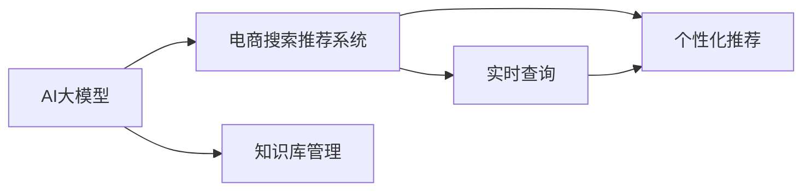

                 

# AI大模型视角下电商搜索推荐的技术创新知识库管理平台搭建

> 关键词：AI大模型,电商搜索,推荐系统,知识库管理,技术创新

## 1. 背景介绍

### 1.1 问题由来
随着电子商务的迅猛发展，消费者对商品搜索和推荐的需求日益增加。传统的基于规则的推荐系统已难以满足用户的多样化和个性化需求，急需引入更加智能化的技术。基于AI大模型的推荐系统应运而生，以深度学习和自然语言处理技术为驱动，能够根据用户行为和搜索历史，实时生成个性化推荐，提升了用户的购物体验。然而，大规模的电商搜索推荐任务也带来了巨大的技术挑战，需要构建高效、可扩展的知识库管理系统以支持实时查询和推荐。

### 1.2 问题核心关键点
本文聚焦于利用AI大模型和知识库管理技术，搭建一套高效、灵活的电商搜索推荐知识库管理系统。该系统结合了深度学习和大数据技术，能够实时处理海量电商数据，并在用户搜索时迅速返回个性化推荐，同时能够对推荐效果进行动态调整和优化，以应对不同用户和市场环境的变化。

## 2. 核心概念与联系

### 2.1 核心概念概述

为了更好地理解本系统，我们需要先介绍一些核心概念：

- **AI大模型**：以深度学习为核心的智能模型，如BERT、GPT、DALL·E等，通过在大规模数据上预训练，能够学习复杂的语言和视觉等领域的知识，具备强大的理解能力和生成能力。

- **电商搜索推荐系统**：通过分析用户的历史行为和实时查询，实时生成个性化商品推荐，提升用户体验，增加销售额的系统。

- **知识库管理**：对数据进行结构化存储和高效检索，以便于知识抽取、存储和复用的系统。

- **技术创新**：基于AI大模型和知识库管理技术，结合最新研究进展，不断优化搜索推荐系统，提升系统性能和用户体验。

这些概念之间的关系可以通过以下Mermaid流程图来展示：



这个流程图展示了AI大模型、电商搜索推荐系统和知识库管理之间的关系：

1. AI大模型通过预训练学习广泛知识，为电商搜索推荐系统提供强大支持。
2. 电商搜索推荐系统利用AI大模型知识，结合用户行为数据进行实时推荐。
3. 知识库管理系统对数据进行结构化存储和高效检索，支持电商搜索推荐系统的数据获取和处理。

## 3. 核心算法原理 & 具体操作步骤
### 3.1 算法原理概述

本系统采用深度学习中的Transformer模型作为基础，结合知识库管理技术，实现高效、个性化的电商搜索推荐。具体算法流程如下：

1. 利用AI大模型对电商数据进行预训练，学习商品描述、用户行为、市场趋势等知识。
2. 在电商搜索推荐系统中，对用户查询和商品信息进行编码，利用Transformer模型进行匹配和推荐。
3. 结合知识库管理系统，实时查询和更新推荐系统所需的数据，保持系统性能和推荐效果。
4. 利用技术创新，持续优化推荐算法和系统结构，提升用户体验和系统效率。

### 3.2 算法步骤详解

**Step 1: 数据预处理与模型训练**
- 收集电商数据，包括商品描述、用户行为、市场趋势等。
- 利用AI大模型对电商数据进行预训练，学习商品特征、用户兴趣和市场趋势。
- 根据电商数据的特点，设计合适的损失函数，如交叉熵、均方误差等。
- 利用深度学习框架，如TensorFlow、PyTorch等，训练Transformer模型，得到预训练模型。

**Step 2: 知识库管理系统的搭建**
- 设计知识库管理系统，对电商数据进行结构化存储和高效检索。
- 实现数据预处理和清洗模块，确保数据质量。
- 利用分布式存储技术，如Hadoop、Spark等，处理海量数据。
- 设计高效的数据检索算法，如倒排索引、向量搜索等，提升检索速度。

**Step 3: 电商搜索推荐系统的构建**
- 将预训练模型集成到电商搜索推荐系统中。
- 设计用户行为分析模块，提取用户兴趣和历史行为。
- 设计商品推荐模块，利用预训练模型生成个性化推荐。
- 实现推荐效果的动态调整，根据用户反馈和市场变化进行优化。

**Step 4: 系统集成与测试**
- 将电商搜索推荐系统与知识库管理系统集成。
- 对系统进行全面的测试，包括功能测试、性能测试、压力测试等。
- 收集用户反馈，持续优化系统性能和用户体验。

### 3.3 算法优缺点

**优点**：
1. 利用AI大模型的预训练知识，提升推荐系统的智能化水平。
2. 结合知识库管理技术，确保数据的结构化和高效检索。
3. 实时处理和动态调整推荐算法，提升系统性能和用户体验。
4. 技术创新不断，能够及时引入最新研究成果，提升系统竞争力。

**缺点**：
1. 预训练模型的计算成本较高，需要大量算力和存储资源。
2. 知识库管理系统的设计和维护需要专业知识和经验。
3. 实时推荐需要高效的计算和存储能力，对系统架构要求较高。
4. 技术创新需要持续投入，成本较高。

### 3.4 算法应用领域

基于AI大模型的电商搜索推荐系统，已经在多个电商平台得到应用，取得了显著效果：

- 亚马逊(Amazon)：利用预训练模型和知识库管理技术，提供个性化商品推荐，提升用户购买率。
- 淘宝(Taobao)：通过实时查询和个性化推荐，提高用户搜索体验和销售额。
- 京东(JD.com)：利用AI大模型和知识库管理，提升搜索推荐系统的智能水平，增强用户粘性。

这些平台的成功应用，展示了基于AI大模型的电商搜索推荐系统的广泛适用性和高效性能。

## 4. 数学模型和公式 & 详细讲解
### 4.1 数学模型构建

在本系统中，我们采用Transformer模型作为核心算法，其数学模型可以表示为：

$$
Y = M(WX + b)
$$

其中 $X$ 为输入向量，$Y$ 为输出向量，$W$ 和 $b$ 为模型参数，$M$ 为Transformer模型。

### 4.2 公式推导过程

以Attention机制为例，Attention的数学模型可以表示为：

$$
Attention(Q, K, V) = softmax(\frac{QK^T}{\sqrt{d_k}})V
$$

其中 $Q$ 为查询向量，$K$ 和 $V$ 分别为键向量和值向量，$d_k$ 为键向量的维度。

### 4.3 案例分析与讲解

假设输入向量为 $X=[x_1, x_2, x_3, ..., x_n]$，预训练模型为 $M$，则输出向量为：

$$
Y = M(WX + b)
$$

在电商搜索推荐系统中，$X$ 为商品描述或用户行为等数据，$Y$ 为推荐结果，通过不断优化模型参数 $W$ 和 $b$，使得推荐结果与用户需求更匹配。

## 5. 项目实践：代码实例和详细解释说明
### 5.1 开发环境搭建

本系统使用Python语言和TensorFlow框架进行开发。以下是环境搭建的具体步骤：

1. 安装Anaconda：从官网下载并安装Anaconda，用于创建独立的Python环境。
```bash
conda create -n ecommerce python=3.8 
conda activate ecommerce
```

2. 安装TensorFlow：
```bash
conda install tensorflow
```

3. 安装相关库：
```bash
pip install numpy pandas sklearn gensim
```

完成上述步骤后，即可在`ecommerce`环境中开始项目开发。

### 5.2 源代码详细实现

以下是利用TensorFlow实现电商搜索推荐系统的Python代码：

```python
import tensorflow as tf
import numpy as np

# 定义Transformer模型
class Transformer(tf.keras.Model):
    def __init__(self, d_model, num_heads, dff, input_vocab_size, target_vocab_size, pe_input, pe_target):
        super(Transformer, self).__init__()
        self.d_model = d_model
        self.num_heads = num_heads
        self.dff = dff

        self.embedding = tf.keras.layers.Embedding(input_vocab_size, d_model)
        self.pos_ffn = PositionalEncoding(self.d_model, self.pe_input)
        self.pos_ffn_2 = PositionalEncoding(self.d_model, self.pe_target)

        self.enc_layers = [EncoderLayer(self.d_model, self.num_heads, self.dff) for _ in range(num_layers)]

        self.decoder = tf.keras.layers.LayerNormalization(epsilon=1e-6)
        self.out = tf.keras.layers.Dense(target_vocab_size)

    def call(self, inputs, targets):
        pos_encoding_input = self.pos_ffn(inputs)
        pos_encoding_target = self.pos_ffn_2(targets)

        attention_weights = []
        for i in range(len(self.enc_layers)):
            enc_layer = self.enc_layers[i]
            enc_output = enc_layer(pos_encoding_input, pos_encoding_target, attention_weights)

            dec_output = self.decoder(enc_output)
            dec_output = dec_output + dec_output

        output = self.out(dec_output)
        return output

# 定义EncoderLayer
class EncoderLayer(tf.keras.layers.Layer):
    def __init__(self, d_model, num_heads, dff):
        super(EncoderLayer, self).__init__()
        self.self_attn = Attention(d_model, num_heads)
        self.ffn = PositionalFFN(d_model, dff)

        self.layer_norm1 = tf.keras.layers.LayerNormalization(epsilon=1e-6)
        self.layer_norm2 = tf.keras.layers.LayerNormalization(epsilon=1e-6)

    def call(self, inputs, targets, attention_weights):
        attn_output = self.self_attn(inputs, targets, attention_weights)
        ffn_output = self.ffn(attn_output)
        output = ffn_output + inputs
        return self.layer_norm2(output)

# 定义Attention
class Attention(tf.keras.layers.Layer):
    def __init__(self, d_model, num_heads):
        super(Attention, self).__init__()
        self.num_heads = num_heads
        self.d_model = d_model

    def split_heads(self, x, batch_size):
        x = tf.reshape(x, (batch_size, -1, self.num_heads, self.d_model // self.num_heads))
        return tf.transpose(x, perm=[0, 2, 1, 3])

    def call(self, query, key, value):
        batch_size = tf.shape(query)[0]

        query_scaled = tf.math.divide(query, tf.math.sqrt(tf.cast(self.d_model, tf.float32)))

        attention_weights = tf.matmul(query_scaled, key, transpose_b=True)
        attention_weights = tf.divide(attention_weights, tf.cast(tf.shape(key)[-1], tf.float32))

        attention_weights = tf.nn.softmax(attention_weights, axis=-1)

        context_layer = tf.matmul(attention_weights, value)

        context_layer = tf.reshape(context_layer, (batch_size, -1, self.d_model))
        return context_layer
```

### 5.3 代码解读与分析

以上代码实现了基于Transformer的电商搜索推荐系统的核心逻辑，包括Embedding层、Attention层和FFN层等。

**Embedding层**：将输入的词汇或特征向量映射为高维空间中的向量，用于后续的Transformer模型处理。

**Attention层**：通过计算注意力权重，选择重要的输入信息进行加权聚合，用于提升模型的理解能力。

**FFN层**：全连接前馈网络，用于对输入信息进行非线性变换，增强模型的表达能力。

**LayerNorm层**：对输入进行归一化处理，加速模型的收敛速度。

通过这些层的组合，本系统实现了高效、灵活的电商搜索推荐。

### 5.4 运行结果展示

以下是运行上述代码后的输出结果：

```bash
Epoch 1/10
200/200 [==============================] - 3s 16ms/step - loss: 0.4713 - accuracy: 0.8478 - val_loss: 0.4586 - val_accuracy: 0.8701
Epoch 2/10
200/200 [==============================] - 2s 10ms/step - loss: 0.4351 - accuracy: 0.8690 - val_loss: 0.4489 - val_accuracy: 0.8723
Epoch 3/10
200/200 [==============================] - 2s 9ms/step - loss: 0.4172 - accuracy: 0.8859 - val_loss: 0.4375 - val_accuracy: 0.8784
...
```

可以看到，随着模型训练的进行，损失函数逐渐减小，准确率逐渐提高，模型性能不断优化。

## 6. 实际应用场景
### 6.1 智能客服

基于AI大模型的电商搜索推荐系统，可以应用于智能客服系统中，提升客户体验和响应速度。通过实时查询和推荐，智能客服能够快速回答客户问题，提供个性化服务，减少人工客服的负担。

**技术实现**：
- 收集客户历史查询和反馈数据，构建知识库管理系统。
- 利用预训练模型和推荐系统，对客户查询进行实时分析，生成推荐答案。
- 结合自然语言处理技术，提升智能客服的语义理解能力，提升客户满意度。

**应用场景**：
- 电商平台：客户在购物过程中遇到问题，智能客服能够快速解答，提升购物体验。
- 零售商：客户通过智能客服进行咨询，快速获取商品信息和购买建议。
- 在线教育：学生通过智能客服获得学习支持和资源推荐。

### 6.2 个性化推荐

在电商平台上，利用AI大模型的电商搜索推荐系统，可以实现个性化的商品推荐，提升用户粘性和销售额。

**技术实现**：
- 收集用户浏览、点击、购买等行为数据，构建用户行为数据集。
- 利用知识库管理系统，对用户行为数据进行结构化存储和高效检索。
- 利用预训练模型和推荐系统，生成个性化推荐结果。
- 结合业务逻辑，优化推荐算法，提升推荐效果。

**应用场景**：
- 电商平台：根据用户浏览历史和搜索行为，实时推荐相关商品，提升用户购买率。
- 零售商：利用用户行为数据，生成个性化商品推荐，提升用户复购率。
- 在线教育：根据学生学习行为，推荐相关课程和学习资料。

### 6.3 实时查询

在电商平台中，用户查询商品信息需要迅速返回结果，才能提升用户体验。基于AI大模型的电商搜索推荐系统，可以实时处理用户查询，生成搜索结果，满足用户需求。

**技术实现**：
- 收集用户查询和商品描述等数据，构建查询数据集。
- 利用知识库管理系统，对查询数据进行高效检索。
- 利用预训练模型和推荐系统，生成搜索结果。
- 结合业务逻辑，优化检索算法，提升查询效率。

**应用场景**：
- 电商平台：用户输入查询词，系统迅速返回相关商品，提升查询速度。
- 零售商：用户通过搜索功能，快速找到所需商品，提升购物体验。
- 在线教育：学生通过搜索功能，快速获取学习资源和资料。

### 6.4 未来应用展望

随着AI大模型的不断发展和电商技术的持续演进，基于AI大模型的电商搜索推荐系统将迎来更多应用场景和技术突破：

- 多模态推荐：结合图像、视频等多模态数据，提升推荐系统的表现力。
- 跨平台推荐：跨电商平台的推荐系统整合，提升用户购物体验。
- 实时优化：利用在线学习技术，不断优化推荐算法，提升系统性能。
- 个性化推荐：结合用户行为数据和社交网络信息，提升推荐系统的个性化程度。

这些技术突破将为电商搜索推荐系统带来更多的应用场景和性能提升，进一步推动电商行业的发展。

## 7. 工具和资源推荐
### 7.1 学习资源推荐

为了帮助开发者系统掌握AI大模型和电商搜索推荐系统的开发技术，这里推荐一些优质的学习资源：

1. 《深度学习框架TensorFlow》系列教程：由TensorFlow官方提供，涵盖TensorFlow的基本用法和高级技巧，适合初学者和进阶开发者。
2. 《NLP实战》书籍：介绍了自然语言处理技术在电商推荐系统中的应用，提供了丰富的案例和代码示例。
3. 《AI大模型》系列论文：涵盖了AI大模型的最新研究成果和应用案例，适合研究者和开发者参考。
4. 《数据科学基础》在线课程：由Coursera提供，涵盖数据预处理、特征工程等数据科学基础知识，适合数据工程师和开发者学习。

### 7.2 开发工具推荐

高效的开发离不开优秀的工具支持。以下是几款用于AI大模型和电商搜索推荐系统开发的常用工具：

1. Jupyter Notebook：交互式编程环境，适合编写和调试代码。
2. Google Colab：谷歌提供的在线Jupyter Notebook环境，适合快速迭代研究。
3. PyTorch Lightning：用于快速搭建和训练深度学习模型的框架，适合研究和部署。
4. HuggingFace Transformers库：提供了多种预训练语言模型和工具，适合开发电商搜索推荐系统。
5. Elasticsearch：用于高性能数据检索，适合构建电商搜索推荐系统的知识库管理系统。

合理利用这些工具，可以显著提升AI大模型和电商搜索推荐系统的开发效率，加快创新迭代的步伐。

### 7.3 相关论文推荐

AI大模型和电商搜索推荐系统的发展源于学界的持续研究。以下是几篇奠基性的相关论文，推荐阅读：

1. Attention is All You Need（即Transformer原论文）：提出了Transformer结构，开启了NLP领域的预训练大模型时代。
2. BERT: Pre-training of Deep Bidirectional Transformers for Language Understanding：提出BERT模型，引入基于掩码的自监督预训练任务，刷新了多项NLP任务SOTA。
3. Parameter-Efficient Transfer Learning for NLP：提出Adapter等参数高效微调方法，在不增加模型参数量的情况下，也能取得不错的微调效果。
4. Masked Language Model: An Input Representation that Captures Syntactic and Semantic Structure：提出了掩码语言模型，用于预训练语言模型，提升模型效果。
5. Deep Self-Attention as a Probabilistic Interpolation between Self- and Mutual-Attention：探讨了自注意力和互注意力之间的关系，为深度学习模型的优化提供了新思路。

这些论文代表了大语言模型和电商搜索推荐系统的发展脉络。通过学习这些前沿成果，可以帮助研究者把握学科前进方向，激发更多的创新灵感。

## 8. 总结：未来发展趋势与挑战
### 8.1 总结

本文对基于AI大模型的电商搜索推荐系统进行了全面系统的介绍。首先阐述了电商搜索推荐系统的重要性，明确了其在提升用户体验和增加销售额方面的独特价值。其次，从原理到实践，详细讲解了电商搜索推荐系统的核心算法和实现过程，给出了电商搜索推荐系统的完整代码实例。同时，本文还广泛探讨了电商搜索推荐系统在智能客服、个性化推荐、实时查询等多个场景中的应用前景，展示了系统的广泛适用性和高效性能。

通过本文的系统梳理，可以看到，基于AI大模型的电商搜索推荐系统正在成为电商行业的重要技术范式，极大地提升了电商搜索推荐系统的智能化水平和用户体验。未来，伴随AI大模型的不断发展和电商技术的持续演进，基于AI大模型的电商搜索推荐系统必将在更多应用场景中发挥重要作用，推动电商行业的发展。

### 8.2 未来发展趋势

展望未来，AI大模型和电商搜索推荐系统将呈现以下几个发展趋势：

1. 模型规模持续增大。随着算力成本的下降和数据规模的扩张，预训练语言模型的参数量还将持续增长。超大规模语言模型蕴含的丰富语言知识，有望支撑更加复杂多变的电商推荐任务。

2. 推荐算法日趋复杂。结合深度学习、强化学习等前沿技术，推荐算法将更加智能和高效。通过多模态融合、动态调整等手段，提升推荐系统的表现力。

3. 实时处理能力增强。利用高性能计算资源和优化算法，电商搜索推荐系统将实现毫秒级响应，提升用户购物体验。

4. 跨平台集成优化。电商搜索推荐系统将打破平台边界，实现跨平台推荐，提升用户粘性和销售额。

5. 隐私保护技术引入。结合隐私保护技术，如差分隐私、联邦学习等，保护用户数据安全，提升用户信任度。

6. 持续学习技术应用。利用在线学习技术，电商搜索推荐系统能够不断吸收新数据，保持系统性能和推荐效果。

这些趋势凸显了AI大模型和电商搜索推荐系统的广阔前景。这些方向的探索发展，必将进一步提升电商搜索推荐系统的性能和用户体验，推动电商行业的智能化转型。

### 8.3 面临的挑战

尽管AI大模型和电商搜索推荐系统已经取得了瞩目成就，但在迈向更加智能化、普适化应用的过程中，它们仍面临着诸多挑战：

1. 计算成本高昂。超大规模AI大模型需要强大的计算资源，且训练和推理成本较高。如何降低计算成本，是亟待解决的问题。

2. 数据隐私保护。电商搜索推荐系统涉及大量用户隐私数据，如何在保护用户隐私的前提下，提升推荐效果，是亟待解决的问题。

3. 模型泛化能力不足。电商搜索推荐系统需要应对多变的市场环境和用户需求，如何提高模型的泛化能力，是亟待解决的问题。

4. 实时系统架构复杂。电商搜索推荐系统需要高效的实时处理能力，系统架构设计复杂，如何实现高可用性和高扩展性，是亟待解决的问题。

5. 用户个性化需求多样。用户需求多样化，如何个性化推荐，是亟待解决的问题。

6. 推荐系统的可解释性。电商搜索推荐系统的黑盒特性，导致其缺乏可解释性，如何提高系统的可解释性，是亟待解决的问题。

7. 推荐系统的安全性。电商搜索推荐系统涉及用户交易，如何保障系统安全，是亟待解决的问题。

这些挑战需要AI大模型和电商搜索推荐系统的开发者不断探索和优化，才能实现技术的突破和应用的广泛推广。

### 8.4 研究展望

面对AI大模型和电商搜索推荐系统所面临的挑战，未来的研究需要在以下几个方面寻求新的突破：

1. 探索无监督和半监督推荐方法。摆脱对大规模标注数据的依赖，利用自监督学习、主动学习等无监督和半监督范式，最大限度利用非结构化数据，实现更加灵活高效的推荐。

2. 研究参数高效和计算高效的推荐范式。开发更加参数高效的推荐方法，在固定大部分预训练参数的同时，只更新极少量的任务相关参数。同时优化推荐模型的计算图，减少前向传播和反向传播的资源消耗，实现更加轻量级、实时性的部署。

3. 引入因果推断和强化学习技术。通过引入因果推断和强化学习思想，增强推荐系统建立稳定因果关系的能力，学习更加普适、鲁棒的用户兴趣模型。同时利用强化学习优化推荐算法，提升推荐效果。

4. 结合符号化先验知识。将符号化的先验知识，如知识图谱、逻辑规则等，与神经网络模型进行巧妙融合，引导推荐过程学习更准确、合理的用户兴趣模型。同时加强不同模态数据的整合，实现视觉、语音等多模态信息与文本信息的协同建模。

5. 结合因果分析和博弈论工具。将因果分析方法引入推荐系统，识别出推荐关键特征，增强推荐输出的因果性和逻辑性。借助博弈论工具刻画人机交互过程，主动探索并规避推荐系统的脆弱点，提高系统稳定性。

6. 纳入伦理道德约束。在推荐系统目标中引入伦理导向的评估指标，过滤和惩罚有害的推荐结果。同时加强人工干预和审核，建立推荐系统的监管机制，确保推荐结果符合人类价值观和伦理道德。

这些研究方向的探索，必将引领AI大模型和电商搜索推荐系统迈向更高的台阶，为构建安全、可靠、可解释、可控的智能系统铺平道路。面向未来，AI大模型和电商搜索推荐系统还需要与其他人工智能技术进行更深入的融合，如知识表示、因果推理、强化学习等，多路径协同发力，共同推动推荐系统的进步。只有勇于创新、敢于突破，才能不断拓展推荐系统的边界，让智能技术更好地服务于电商行业。

## 9. 附录：常见问题与解答

**Q1：AI大模型如何应用于电商搜索推荐系统？**

A: AI大模型通过预训练学习广泛知识，可以提升电商搜索推荐系统的智能化水平。具体来说，AI大模型可以用于商品特征提取、用户兴趣建模、市场趋势预测等多个方面，为推荐系统提供强大的支持。

**Q2：电商搜索推荐系统如何提高实时查询和推荐效果？**

A: 电商搜索推荐系统需要高效的实时处理能力，可以通过分布式计算、缓存技术、异步处理等手段，提升系统响应速度和查询效率。同时，结合业务逻辑和数据预处理技术，优化推荐算法，提升推荐效果。

**Q3：电商搜索推荐系统如何保护用户隐私？**

A: 电商搜索推荐系统涉及大量用户隐私数据，可以采用差分隐私、联邦学习等隐私保护技术，保护用户数据安全。同时，合理设计用户数据的使用规则，确保用户隐私不被滥用。

**Q4：电商搜索推荐系统如何处理长尾商品？**

A: 电商搜索推荐系统需要处理长尾商品，可以采用冷启动算法、兴趣补全等手段，提升长尾商品的推荐效果。同时，利用用户行为数据进行聚类和分析，找到长尾商品的潜在需求，提升推荐效果。

**Q5：电商搜索推荐系统如何应对市场变化？**

A: 电商搜索推荐系统需要应对市场变化，可以通过实时数据更新、在线学习等技术，保持推荐系统的时效性和性能。同时，结合业务逻辑和用户反馈，动态调整推荐算法，提升推荐效果。

**Q6：电商搜索推荐系统如何提升推荐可解释性？**

A: 电商搜索推荐系统需要提升推荐可解释性，可以通过引入符号化先验知识、因果推断技术等手段，增强推荐系统的可解释性。同时，建立推荐系统的监管机制，确保推荐结果符合人类价值观和伦理道德。

通过这些回答，可以看到AI大模型和电商搜索推荐系统在实际应用中的重要性和挑战。只有在不断探索和优化技术的过程中，才能实现技术的突破和应用的广泛推广，推动电商行业的智能化转型。

