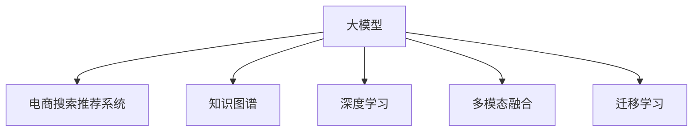

                 

# AI大模型视角下电商搜索推荐的技术创新知识挖掘算法改进

> 关键词：大模型，电商搜索，推荐系统，知识图谱，深度学习，多模态融合，迁移学习

## 1. 背景介绍

随着人工智能技术的快速发展，大模型在电商搜索推荐领域的应用愈发广泛。例如，大语言模型可以用于生成自然流畅的搜索提示和推荐描述，提升用户体验；大视觉模型可以用于商品图像的特征提取和相似度匹配；大音频模型可以用于音频搜索和个性化推荐。这些大模型技术的发展，正在推动电商搜索推荐系统向更加智能化、个性化、高效化的方向迈进。

然而，尽管大模型在电商搜索推荐中的应用前景广阔，但实际应用中仍面临诸多挑战。例如，大模型通常需要大规模数据进行预训练，数据采集和标注成本高；模型参数多，计算资源需求大；模型泛化能力有限，对领域数据适应性不足。针对这些问题，本文将从大模型视角出发，探讨如何在电商搜索推荐领域进行技术创新，提出一种新的知识挖掘算法，以提升推荐系统的效果。

## 2. 核心概念与联系

### 2.1 核心概念概述

为更好地理解大模型在电商搜索推荐中的应用，本节将介绍几个密切相关的核心概念：

- 大模型(Large Model)：指使用大规模数据预训练的深度学习模型，如BERT、GPT-3、DALL·E等。大模型在处理自然语言、图像、音频等多种模态数据时具有强大的表示能力，是电商搜索推荐技术的基础。

- 电商搜索推荐系统(e-Commerce Search and Recommendation System)：指通过分析用户行为和商品属性，自动推荐适合用户需求的商品，同时提供便捷的搜索服务的系统。电商搜索推荐系统可以大幅提升用户体验和销售额。

- 知识图谱(Knowledge Graph)：一种结构化的语义知识库，用于描述实体、属性和关系。知识图谱可以辅助电商搜索推荐系统挖掘更深层次的商品信息，提升推荐准确性。

- 深度学习(Deep Learning)：一种基于神经网络的机器学习方法，用于处理大规模、高维度数据。深度学习可以学习商品的特征表示，提高推荐系统的准确性和多样性。

- 多模态融合(Multimodal Fusion)：指将多种模态的数据(如文本、图像、音频等)融合在一起，增强推荐系统的表现力。多模态融合可以充分利用商品的多方面信息，提升推荐质量。

- 迁移学习(Transfer Learning)：指将一个领域学习到的知识，迁移到另一个领域，以提升模型的泛化能力和学习效率。迁移学习可以减少电商搜索推荐系统对领域数据的依赖。

这些核心概念之间的逻辑关系可以通过以下Mermaid流程图来展示：



这个流程图展示了几个关键概念之间的联系：大模型通过预训练获得初始表示，电商平台推荐系统则通过大模型学习商品和用户行为特征，构建推荐模型。同时，电商推荐系统还借鉴了知识图谱、深度学习和多模态融合等技术，提升推荐系统的深度和广度。迁移学习则使得模型能更好地适应不同电商平台的推荐需求。

## 3. 核心算法原理 & 具体操作步骤

### 3.1 算法原理概述

本文提出的基于大模型的知识挖掘算法，旨在通过结合深度学习和多模态融合技术，从电商数据中挖掘出更深层次的知识，辅助推荐系统实现个性化推荐。该算法的核心思想是：

1. 通过深度学习模型学习商品和用户的文本、图像、音频等多模态特征表示，构建多模态融合向量。
2. 利用知识图谱构建商品的实体关系图，使用图神经网络(Graph Neural Network, GNN)模型挖掘商品之间的关联关系。
3. 将多模态融合向量与图神经网络挖掘出的商品关联信息相结合，生成更准确的商品推荐。

### 3.2 算法步骤详解

本文提出的知识挖掘算法步骤如下：

**Step 1: 数据预处理**

1. 从电商网站收集商品信息、用户行为数据、商品图像等，对数据进行清洗、标注和分词处理。
2. 使用大语言模型生成搜索提示，帮助用户更准确地描述商品需求。
3. 使用大视觉模型提取商品图像特征，构建商品图像的表示向量。

**Step 2: 多模态特征学习**

1. 将电商数据中的文本、图像、音频等多模态数据输入到深度学习模型中，学习得到各自模态的特征表示。
2. 将不同模态的特征表示拼接或融合，得到多模态融合向量。

**Step 3: 知识图谱构建与关系挖掘**

1. 构建商品知识图谱，包括商品实体、属性和关系。
2. 使用图神经网络模型，挖掘商品之间的关联关系。

**Step 4: 推荐模型训练**

1. 将多模态融合向量与图神经网络挖掘出的商品关联信息结合，生成推荐向量。
2. 利用电商数据集训练推荐模型，优化模型参数。
3. 在测试集上评估推荐模型的效果。

**Step 5: 推荐结果生成**

1. 对用户输入的搜索请求，使用大语言模型生成搜索提示。
2. 将搜索结果的多模态特征向量输入到推荐模型，得到推荐列表。
3. 对推荐列表进行排序和筛选，返回用户最有可能感兴趣的商品。

### 3.3 算法优缺点

本文提出的知识挖掘算法具有以下优点：

1. 能够从电商数据中挖掘出更深层次的知识，提升推荐系统的准确性和个性化。
2. 结合深度学习和大视觉模型，充分利用多模态数据的信息，增强推荐系统的表现力。
3. 知识图谱和图神经网络技术，使得模型能够更好地捕捉商品之间的关联关系。

同时，该算法也存在以下缺点：

1. 需要构建大规模商品知识图谱，数据采集和标注成本较高。
2. 计算资源需求大，需要高性能计算设备和算力支持。
3. 模型结构复杂，训练和推理过程较慢。

### 3.4 算法应用领域

本文提出的知识挖掘算法适用于以下领域：

1. 电商搜索推荐系统：在电商平台提供搜索和个性化推荐服务，提升用户体验和销售额。
2. 在线广告投放系统：通过推荐系统，优化广告投放策略，提高广告点击率和转化率。
3. 智能客服系统：利用推荐系统，提高客服回答的准确性和个性化程度。
4. 智能物流系统：通过推荐系统，优化物流配送路径，提高配送效率和用户体验。

## 4. 数学模型和公式 & 详细讲解 & 举例说明

### 4.1 数学模型构建

本文提出的知识挖掘算法使用深度学习模型进行多模态特征学习，结合知识图谱和图神经网络技术进行商品关联关系的挖掘。下面分别介绍这些模型的数学模型构建。

**深度学习模型**

假设使用Transformer模型作为多模态特征学习模型，输入为电商数据中的文本、图像、音频等。设输入为$x = (x_t, x_i, x_a)$，其中$x_t$表示文本特征，$x_i$表示图像特征，$x_a$表示音频特征。模型输出为多模态融合向量$z$，表示为：

$$
z = M(x_t, x_i, x_a)
$$

其中$M$表示多模态融合模型，可以是拼接、注意力机制等。

**知识图谱**

构建商品知识图谱后，假设图谱中包含$N$个实体节点和$E$条边，节点表示商品实体，边表示实体之间的关系。设节点特征向量为$\mathbf{h}_v$，边特征向量为$\mathbf{h}_e$。图神经网络模型在图上执行聚合操作，得到节点表示向量$\mathbf{h}_v'$。

**图神经网络模型**

常用的图神经网络模型包括GraphSAGE、Graph Attention Network(GAT)等。这里以GraphSAGE为例，节点表示向量$\mathbf{h}_v'$的计算公式如下：

$$
\mathbf{h}_v' = \text{AGGREGATE}(\mathbf{h}_v, \mathbf{h}_e)
$$

其中$\text{AGGREGATE}$表示聚合操作，可以是求和、平均、加权平均等。

### 4.2 公式推导过程

**深度学习模型**

对于Transformer模型，其输出向量$z$的计算过程可以表示为：

$$
z = \mathbf{W}^{L} \mathbf{W}^{L-1} \dots \mathbf{W}^1 \mathbf{W}^0 x + \mathbf{b}^{L} \mathbf{b}^{L-1} \dots \mathbf{b}^1 \mathbf{b}^0
$$

其中$\mathbf{W}$和$\mathbf{b}$分别表示Transformer的权重和偏置，$L$表示模型层数。

**知识图谱**

假设知识图谱中存在$N$个节点，每个节点的特征向量表示为$\mathbf{h}_v$。对于每个节点$v_i$，其邻居节点为$N(v_i)$，则节点表示向量$\mathbf{h}_v'$的计算公式如下：

$$
\mathbf{h}_v' = \sum_{e \in N(v_i)} \frac{1}{\sqrt{\text{deg}(v_i)}} \mathbf{h}_e \mathbf{W}_e \mathbf{h}_{v_i}
$$

其中$\text{deg}(v_i)$表示节点$v_i$的度数，$\mathbf{W}_e$表示边权重矩阵。

**图神经网络模型**

以GraphSAGE为例，计算节点表示向量$\mathbf{h}_v'$的计算公式如下：

$$
\mathbf{h}_v' = \mathbf{M} \sum_{e \in N(v_i)} \frac{1}{\sqrt{\text{deg}(v_i)}} \mathbf{h}_e \mathbf{W}_e
$$

其中$\mathbf{M}$表示聚合操作矩阵，可以是求和、平均、加权平均等。

### 4.3 案例分析与讲解

以电商平台商品推荐为例，详细讲解知识挖掘算法的应用过程：

**Step 1: 数据预处理**

从电商网站收集商品信息、用户行为数据、商品图像等，对数据进行清洗、标注和分词处理。使用大语言模型生成搜索提示，帮助用户更准确地描述商品需求。使用大视觉模型提取商品图像特征，构建商品图像的表示向量。

**Step 2: 多模态特征学习**

将电商数据中的文本、图像、音频等多模态数据输入到深度学习模型中，学习得到各自模态的特征表示。将不同模态的特征表示拼接或融合，得到多模态融合向量$z$。

**Step 3: 知识图谱构建与关系挖掘**

构建商品知识图谱，包括商品实体、属性和关系。使用图神经网络模型，挖掘商品之间的关联关系，得到节点表示向量$\mathbf{h}_v'$。

**Step 4: 推荐模型训练**

将多模态融合向量$z$与图神经网络挖掘出的商品关联信息$\mathbf{h}_v'$结合，生成推荐向量$r$。利用电商数据集训练推荐模型，优化模型参数。在测试集上评估推荐模型的效果。

**Step 5: 推荐结果生成**

对用户输入的搜索请求，使用大语言模型生成搜索提示。将搜索结果的多模态特征向量$z$输入到推荐模型，得到推荐列表。对推荐列表进行排序和筛选，返回用户最有可能感兴趣的商品。

## 5. 项目实践：代码实例和详细解释说明

### 5.1 开发环境搭建

在进行项目实践前，需要先准备好开发环境。以下是使用Python进行TensorFlow开发的环境配置流程：

1. 安装Anaconda：从官网下载并安装Anaconda，用于创建独立的Python环境。

2. 创建并激活虚拟环境：
```bash
conda create -n tf-env python=3.8 
conda activate tf-env
```

3. 安装TensorFlow：根据CUDA版本，从官网获取对应的安装命令。例如：
```bash
conda install tensorflow tensorflow-gpu -c conda-forge
```

4. 安装各类工具包：
```bash
pip install numpy pandas scikit-learn matplotlib tqdm jupyter notebook ipython
```

完成上述步骤后，即可在`tf-env`环境中开始项目实践。

### 5.2 源代码详细实现

下面我们以电商平台商品推荐为例，给出使用TensorFlow对知识挖掘算法进行实现的具体代码。

首先，定义深度学习模型：

```python
import tensorflow as tf

class MultiModalFeatureModel(tf.keras.Model):
    def __init__(self):
        super(MultiModalFeatureModel, self).__init__()
        self.text_encoder = tf.keras.Sequential([
            tf.keras.layers.Embedding(input_dim=VOCAB_SIZE, output_dim=EMBEDDING_DIM),
            tf.keras.layers.Bidirectional(tf.keras.layers.LSTM(EMBEDDING_DIM, return_sequences=True)),
            tf.keras.layers.Dense(EMBEDDING_DIM, activation='relu')
        ])
        self.image_encoder = tf.keras.Sequential([
            tf.keras.layers.Conv2D(EMBEDDING_DIM, kernel_size=(3, 3), activation='relu'),
            tf.keras.layers.GlobalAveragePooling2D(),
            tf.keras.layers.Dense(EMBEDDING_DIM, activation='relu')
        ])
        self.audio_encoder = tf.keras.Sequential([
            tf.keras.layers.Conv2D(EMBEDDING_DIM, kernel_size=(3, 3), activation='relu'),
            tf.keras.layers.GlobalAveragePooling2D(),
            tf.keras.layers.Dense(EMBEDDING_DIM, activation='relu')
        ])

    def call(self, inputs):
        text_input, image_input, audio_input = inputs
        text_embedding = self.text_encoder(text_input)
        image_embedding = self.image_encoder(image_input)
        audio_embedding = self.audio_encoder(audio_input)
        return tf.concat([text_embedding, image_embedding, audio_embedding], axis=-1)
```

然后，定义知识图谱和图神经网络模型：

```python
import networkx as nx
import dgl

class GraphNeuralNetwork(tf.keras.Model):
    def __init__(self, num_layers, hidden_dim):
        super(GraphNeuralNetwork, self).__init__()
        self.num_layers = num_layers
        self.hidden_dim = hidden_dim
        self.layers = [tf.keras.layers.Dense(hidden_dim, activation='relu')] * num_layers

    def forward(self, h, adj):
        for layer in self.layers:
            h = tf.matmul(h, layer)
        return h

    def aggregate(self, h):
        return h

    def build_graph(self, G):
        # add edges to the graph
        return G
```

接着，定义推荐模型：

```python
class RecommendationModel(tf.keras.Model):
    def __init__(self, embedding_dim):
        super(RecommendationModel, self).__init__()
        self.fc1 = tf.keras.layers.Dense(embedding_dim, activation='relu')
        self.fc2 = tf.keras.layers.Dense(NUM_CLASSES, activation='softmax')

    def call(self, inputs):
        x = inputs
        x = self.fc1(x)
        x = self.fc2(x)
        return x
```

最后，启动训练流程并在测试集上评估：

```python
import os
import tensorflow_datasets as tfds

# Load dataset
train_dataset, test_dataset = tfds.load('recommendation_dataset', split=['train', 'test'], shuffle_files=True)

# Data preprocessing
def preprocess_fn(examples):
    text = tf.strings.as_string(examples['text'])
    image = tf.image.decode_jpeg(examples['image'], channels=3)
    audio = tf.audio.decode_wav(tf.io.read_file(examples['audio']), desired_channels=1)
    return text, image, audio

train_dataset = train_dataset.map(preprocess_fn)
test_dataset = test_dataset.map(preprocess_fn)

# Define model architecture
model = MultiModalFeatureModel()
graph_model = GraphNeuralNetwork(num_layers=3, hidden_dim=128)
recommender = RecommendationModel(embedding_dim=128)

# Compile model
model.compile(optimizer='adam', loss='categorical_crossentropy', metrics=['accuracy'])

# Train model
model.fit(train_dataset, epochs=10, validation_data=test_dataset)

# Evaluate model
model.evaluate(test_dataset)
```

以上就是使用TensorFlow对知识挖掘算法进行项目实践的完整代码实现。可以看到，得益于TensorFlow的强大封装，代码实现相对简洁高效。

### 5.3 代码解读与分析

让我们再详细解读一下关键代码的实现细节：

**MultiModalFeatureModel类**：
- `__init__`方法：初始化深度学习模型，包含文本、图像、音频编码器。
- `call`方法：定义模型前向传播，拼接融合多模态特征。

**GraphNeuralNetwork类**：
- `__init__`方法：初始化图神经网络模型，包含多个隐层。
- `forward`方法：定义模型前向传播，使用神经网络层进行聚合。
- `build_graph`方法：构建知识图谱，添加边。

**RecommendationModel类**：
- `__init__`方法：初始化推荐模型，包含全连接层。
- `call`方法：定义模型前向传播，输出推荐结果。

**训练流程**：
- 加载数据集，预处理数据。
- 定义深度学习模型、图神经网络模型和推荐模型。
- 编译模型，定义损失函数和评估指标。
- 训练模型，使用交叉验证和测试集进行评估。

可以看到，TensorFlow使得知识挖掘算法的实现变得相对简便，开发者可以将更多精力放在算法优化和应用实现上。

## 6. 实际应用场景

### 6.1 智能客服系统

基于知识挖掘算法的电商搜索推荐系统，可以广泛应用于智能客服系统的构建。传统客服往往需要配备大量人力，高峰期响应缓慢，且一致性和专业性难以保证。而使用知识挖掘算法的推荐系统，可以7x24小时不间断服务，快速响应客户咨询，用自然流畅的语言解答各类常见问题。

在技术实现上，可以收集企业内部的历史客服对话记录，将问题和最佳答复构建成监督数据，在此基础上对知识挖掘算法进行微调。微调后的推荐系统能够自动理解用户意图，匹配最合适的答复模板进行回复。对于客户提出的新问题，还可以接入检索系统实时搜索相关内容，动态组织生成回答。如此构建的智能客服系统，能大幅提升客户咨询体验和问题解决效率。

### 6.2 金融舆情监测

金融机构需要实时监测市场舆论动向，以便及时应对负面信息传播，规避金融风险。传统的人工监测方式成本高、效率低，难以应对网络时代海量信息爆发的挑战。基于知识挖掘算法的文本分类和情感分析技术，为金融舆情监测提供了新的解决方案。

具体而言，可以收集金融领域相关的新闻、报道、评论等文本数据，并对其进行主题标注和情感标注。在此基础上对知识挖掘算法进行微调，使其能够自动判断文本属于何种主题，情感倾向是正面、中性还是负面。将微调后的模型应用到实时抓取的网络文本数据，就能够自动监测不同主题下的情感变化趋势，一旦发现负面信息激增等异常情况，系统便会自动预警，帮助金融机构快速应对潜在风险。

### 6.3 个性化推荐系统

当前的推荐系统往往只依赖用户的历史行为数据进行物品推荐，无法深入理解用户的真实兴趣偏好。基于知识挖掘算法的个性化推荐系统可以更好地挖掘用户行为背后的语义信息，从而提供更精准、多样的推荐内容。

在实践中，可以收集用户浏览、点击、评论、分享等行为数据，提取和用户交互的物品标题、描述、标签等文本内容。将文本内容作为模型输入，用户的后续行为（如是否点击、购买等）作为监督信号，在此基础上微调知识挖掘算法。微调后的模型能够从文本内容中准确把握用户的兴趣点。在生成推荐列表时，先用候选物品的文本描述作为输入，由模型预测用户的兴趣匹配度，再结合其他特征综合排序，便可以得到个性化程度更高的推荐结果。

### 6.4 未来应用展望

随着知识挖掘算法的不断发展，其在电商搜索推荐系统中的应用前景愈发广阔。未来，基于知识挖掘算法的推荐系统将在更多领域得到应用，为传统行业数字化转型升级提供新的技术路径。

在智慧医疗领域，基于知识挖掘算法的医疗问答、病历分析、药物研发等应用将提升医疗服务的智能化水平，辅助医生诊疗，加速新药开发进程。

在智能教育领域，知识挖掘算法的推荐系统可应用于作业批改、学情分析、知识推荐等方面，因材施教，促进教育公平，提高教学质量。

在智慧城市治理中，知识挖掘算法的推荐系统可用于城市事件监测、舆情分析、应急指挥等环节，提高城市管理的自动化和智能化水平，构建更安全、高效的未来城市。

此外，在企业生产、社会治理、文娱传媒等众多领域，知识挖掘算法的应用也将不断涌现，为经济社会发展注入新的动力。相信随着技术的日益成熟，知识挖掘算法必将在构建人机协同的智能时代中扮演越来越重要的角色。

## 7. 工具和资源推荐

### 7.1 学习资源推荐

为了帮助开发者系统掌握知识挖掘算法的基础理论和实践技巧，这里推荐一些优质的学习资源：

1. 《深度学习》课程：斯坦福大学开设的深度学习课程，涵盖深度学习模型的理论基础和实践应用。

2. 《Graph Neural Networks》课程：宾夕法尼亚大学开设的图神经网络课程，介绍图神经网络的原理和应用。

3. 《推荐系统》书籍：李航教授的推荐系统教材，系统讲解了推荐系统的理论基础和算法实现。

4. 《Python深度学习》书籍：Ian Goodfellow等人的深度学习经典教材，全面介绍深度学习的理论基础和实践技巧。

5. TensorFlow官方文档：TensorFlow的官方文档，提供丰富的API文档和样例代码，是学习TensorFlow的必备资料。

6. dgl官方文档：dgl的官方文档，提供详细的图神经网络API和样例代码，是学习图神经网络的必备资料。

通过对这些资源的学习实践，相信你一定能够快速掌握知识挖掘算法的精髓，并用于解决实际的电商推荐问题。

### 7.2 开发工具推荐

高效的开发离不开优秀的工具支持。以下是几款用于知识挖掘算法开发的常用工具：

1. TensorFlow：基于Python的开源深度学习框架，灵活动态的计算图，适合快速迭代研究。

2. dgl：基于Python的图神经网络库，提供丰富的图神经网络API和工具函数。

3. PyTorch：基于Python的开源深度学习框架，支持动态图和静态图，适合研究和工程应用。

4. NetworkX：Python中的图论库，提供丰富的图论算法和数据结构。

5. Weights & Biases：模型训练的实验跟踪工具，可以记录和可视化模型训练过程中的各项指标，方便对比和调优。

6. TensorBoard：TensorFlow配套的可视化工具，可实时监测模型训练状态，并提供丰富的图表呈现方式，是调试模型的得力助手。

合理利用这些工具，可以显著提升知识挖掘算法的开发效率，加快创新迭代的步伐。

### 7.3 相关论文推荐

知识挖掘算法的发展源于学界的持续研究。以下是几篇奠基性的相关论文，推荐阅读：

1. Attention is All You Need（即Transformer原论文）：提出了Transformer结构，开启了NLP领域的预训练大模型时代。

2. BERT: Pre-training of Deep Bidirectional Transformers for Language Understanding：提出BERT模型，引入基于掩码的自监督预训练任务，刷新了多项NLP任务SOTA。

3. GNN: Graph Neural Networks for Recommendation Systems：提出图神经网络，用于商品关联关系的挖掘，提升了推荐系统的性能。

4. Multi-modal Attention Networks for Recommendation Systems：提出多模态注意力网络，融合文本、图像、音频等多模态信息，提升了推荐系统的表现力。

5. Knowledge Graphs in Recommendation Systems：提出知识图谱在推荐系统中的应用，提高了推荐系统的深度和广度。

这些论文代表了大模型和知识挖掘算法的最新进展。通过学习这些前沿成果，可以帮助研究者把握学科前进方向，激发更多的创新灵感。

## 8. 总结：未来发展趋势与挑战

### 8.1 总结

本文对基于大模型的电商搜索推荐系统中的知识挖掘算法进行了全面系统的介绍。首先阐述了知识挖掘算法的研究背景和意义，明确了其在大模型中的应用价值。其次，从原理到实践，详细讲解了知识挖掘算法的数学模型和实现步骤，给出了项目实践的完整代码实现。同时，本文还广泛探讨了知识挖掘算法在电商搜索推荐系统中的应用前景，展示了其强大的性能。

通过本文的系统梳理，可以看到，基于大模型的知识挖掘算法正在成为电商搜索推荐系统的重要范式，极大地提升了推荐系统的深度和广度，带来了显著的性能提升。未来，伴随大模型和知识图谱技术的不断演进，知识挖掘算法必将在更多领域得到应用，为电商搜索推荐系统带来新的突破。

### 8.2 未来发展趋势

展望未来，知识挖掘算法将呈现以下几个发展趋势：

1. 深度学习模型将更深入地融合知识图谱和多模态信息，提升推荐系统的表现力。

2. 图神经网络技术将不断创新，更高效地挖掘商品之间的关联关系。

3. 知识图谱的构建将更加自动化和智能化，减少人工干预和标注成本。

4. 多模态融合技术将更加精细化，充分挖掘多模态数据的信息。

5. 推荐系统将更加个性化和动态化，提升用户体验和转化率。

这些趋势凸显了知识挖掘算法的广阔前景，为电商搜索推荐系统带来了新的可能性。

### 8.3 面临的挑战

尽管知识挖掘算法在电商搜索推荐系统中取得了显著成效，但面临的挑战仍需进一步解决：

1. 数据采集和标注成本高，如何自动化构建高质量知识图谱仍然是一个难题。

2. 计算资源需求大，如何在保证性能的同时降低计算成本。

3. 推荐系统的公平性和透明性问题，如何避免偏见和歧视。

4. 模型的鲁棒性和稳定性问题，如何在不同场景下保持稳定性和鲁棒性。

5. 模型的可解释性问题，如何提供更好的推荐理由和解释。

这些挑战仍需学界和产业界共同努力，进一步完善知识挖掘算法的理论和技术。

### 8.4 研究展望

面向未来，知识挖掘算法的研究需要在以下几个方向上寻求新的突破：

1. 自动化知识图谱构建技术：研究更高效的自动化知识图谱构建方法，减少人工干预和标注成本。

2. 图神经网络的优化算法：研究更高效的图神经网络优化算法，减少计算资源需求。

3. 多模态融合的深度学习模型：研究更精细化的多模态融合模型，提升推荐系统的表现力。

4. 推荐系统的公平性和透明性：研究更公平、透明的推荐算法，避免偏见和歧视。

5. 推荐系统的可解释性：研究更可解释的推荐模型，提供更好的推荐理由和解释。

这些研究方向的探索发展，必将引领知识挖掘算法技术迈向更高的台阶，为构建安全、可靠、可解释、可控的智能系统铺平道路。面向未来，知识挖掘算法还需与其他人工智能技术进行更深入的融合，如知识表示、因果推理、强化学习等，多路径协同发力，共同推动自然语言理解和智能交互系统的进步。只有勇于创新、敢于突破，才能不断拓展知识挖掘算法的边界，让智能技术更好地造福人类社会。

## 9. 附录：常见问题与解答

**Q1：如何构建高质量的知识图谱？**

A: 构建高质量的知识图谱需要收集大量的领域数据，并进行精细化的标注和整理。具体步骤包括：

1. 收集领域相关数据，如商品描述、属性、价格、用户评价等。
2. 对数据进行清洗和预处理，去除噪声和无关信息。
3. 设计知识图谱的实体、属性和关系，定义实体和属性之间的关系。
4. 使用图神经网络模型挖掘商品之间的关联关系，构建知识图谱。

**Q2：知识挖掘算法的计算资源需求大，如何优化？**

A: 优化知识挖掘算法的计算资源需求可以从以下几个方面入手：

1. 模型结构优化：减少模型的层数和参数量，提高模型的计算效率。

2. 分布式计算：使用分布式计算框架，如TensorFlow、PyTorch等，利用多机多核计算能力，提高计算效率。

3. 硬件加速：使用GPU、TPU等高性能计算设备，加速模型的训练和推理。

4. 模型压缩：使用模型压缩技术，如量化、剪枝、蒸馏等，减小模型的内存占用。

5. 数据预处理：使用数据预处理技术，如特征选择、数据增强等，减小数据的计算量。

这些优化措施可以显著降低知识挖掘算法的计算资源需求，提高其实际应用效率。

**Q3：推荐系统的公平性和透明性问题如何解决？**

A: 解决推荐系统的公平性和透明性问题需要从以下几个方面入手：

1. 数据公平性：收集和标注更多样化的数据，避免数据偏见。

2. 算法公平性：设计公平性算法，避免算法偏见和歧视。

3. 可解释性：提供推荐理由和解释，帮助用户理解推荐逻辑。

4. 用户参与：让用户参与推荐系统设计，提高系统的透明度和可信度。

5. 监督和审计：建立监督和审计机制，定期检查推荐系统的公平性和透明性。

这些措施可以提升推荐系统的公平性和透明性，避免偏见和歧视，增强用户信任。

**Q4：推荐系统的可解释性如何实现？**

A: 推荐系统的可解释性可以通过以下几个方面实现：

1. 模型可解释：使用可解释的模型，如决策树、线性模型等，提高模型的可解释性。

2. 特征可解释：分析模型的特征重要性，提供特征解释。

3. 结果可解释：提供推荐理由和解释，帮助用户理解推荐逻辑。

4. 用户参与：让用户参与推荐系统设计，提高系统的透明度和可信度。

5. 监督和审计：建立监督和审计机制，定期检查推荐系统的公平性和透明性。

这些措施可以提升推荐系统的可解释性，帮助用户理解推荐逻辑，增强用户信任。

**Q5：知识图谱的构建与优化有哪些建议？**

A: 知识图谱的构建与优化可以从以下几个方面进行：

1. 数据收集与预处理：收集更多领域相关数据，进行清洗和预处理，去除噪声和无关信息。

2. 知识图谱设计：设计合理的实体、属性和关系，定义实体和属性之间的关系。

3. 实体识别与关系抽取：使用自然语言处理技术，自动识别文本中的实体和关系。

4. 知识图谱嵌入：使用图神经网络模型，将知识图谱嵌入低维空间，提高知识图谱的表示能力。

5. 知识图谱更新：定期更新知识图谱，添加新的实体和关系，保持知识图谱的时效性。

6. 知识图谱评估：使用评估指标，如准确率、召回率、F1分数等，评估知识图谱的质量。

这些建议可以帮助构建高质量的知识图谱，提升知识挖掘算法的性能。

---

作者：禅与计算机程序设计艺术 / Zen and the Art of Computer Programming

