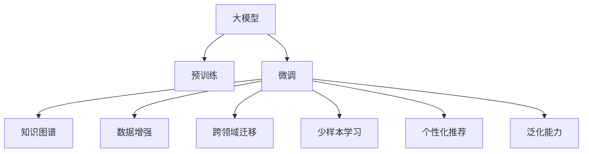

                 

# AI大模型视角下电商搜索推荐的技术创新知识沉淀方法

> 关键词：AI大模型, 电商搜索, 推荐系统, 知识图谱, 数据增强, 跨领域迁移, 少样本学习

## 1. 背景介绍

### 1.1 问题由来

在现代电子商务领域，搜索推荐系统已成为不可或缺的组成部分。优质的搜索推荐服务不仅能够提升用户体验，还能显著提升平台的销售转化率。然而，构建一个高效、个性化的搜索推荐系统，并非易事。它不仅需要处理海量的用户行为数据，还需要从中挖掘出用户的兴趣和偏好，同时要面对诸如冷启动、长尾物品、个性化需求变化等问题。传统的机器学习模型和数据驱动方法在面对这些问题时往往显得力不从心。

近年来，随着人工智能和大规模预训练模型的快速发展，基于大模型的搜索推荐系统逐渐崭露头角。大模型通过在大规模无标签数据上进行预训练，学习了丰富的语言和知识表示能力。通过微调等方式，使其能够适配具体电商场景的需求，提供更精准、个性化的搜索结果和推荐内容。

### 1.2 问题核心关键点

构建基于大模型的电商搜索推荐系统，需要解决以下核心问题：

- **预训练模型的选择与适配**：如何选择合适的预训练语言模型，并对其进行必要的适配，以适应电商搜索推荐任务的需求？
- **数据增强与数据治理**：电商领域的数据具有复杂多样性，如何有效增强数据，并确保数据质量与治理？
- **知识图谱与跨领域迁移**：如何将电商领域的专业知识与大模型的通用知识进行融合，实现跨领域的迁移学习？
- **少样本学习与微调策略**：电商领域的数据量往往难以覆盖所有用户，如何在少量数据情况下实现高效的微调？
- **个性化与泛化能力**：如何平衡个性化推荐与泛化能力，确保模型在不同用户和场景下的表现一致？

这些问题需要通过技术创新和知识沉淀方法来系统地解决，从而提升大模型在电商搜索推荐领域的应用效果。

## 2. 核心概念与联系

### 2.1 核心概念概述

- **大模型(Large Model)**：指使用Transformer结构进行预训练的深度学习模型，如BERT、GPT等。大模型具备强大的语言理解和生成能力，能够在多种自然语言处理任务中取得优异表现。
- **预训练(Pre-training)**：指在大规模无标签数据上进行的自监督学习任务，使得模型能够学习到通用的语言表示。
- **微调(Fine-tuning)**：指在预训练模型的基础上，使用具体任务的数据进行有监督学习，以优化模型在该任务上的性能。
- **知识图谱(Knowledge Graph)**：指以图结构形式表示的领域知识，包含实体、关系和属性等信息。
- **数据增强(Data Augmentation)**：指通过对原始数据进行变换和扩充，生成更多样本，以增强模型的泛化能力。
- **跨领域迁移(Cross-domain Transfer)**：指将一个领域学到的知识迁移到另一个领域的应用，以提高在新领域上的表现。
- **少样本学习(Few-shot Learning)**：指在只有少量标注样本的情况下，模型仍能快速适应新任务的学习方式。
- **个性化推荐(Personalized Recommendation)**：指根据用户的历史行为和偏好，提供符合用户需求的推荐结果。
- **泛化能力(Generalization)**：指模型在未见过的数据上表现良好，即能够将学到的知识应用于新场景的能力。

这些核心概念通过以下Mermaid流程图展现了它们之间的联系：



这个流程图展示了各个概念之间的逻辑关系：

1. 大模型通过预训练获得基础能力。
2. 微调在大模型基础上，通过任务特定的优化，适应电商搜索推荐任务的需求。
3. 知识图谱与大模型结合，提高模型的领域知识表示能力。
4. 数据增强和跨领域迁移技术，提升模型的泛化能力和适应性。
5. 少样本学习技术，在少量数据情况下实现高效的微调。
6. 个性化推荐和泛化能力，使得模型在不同用户和场景下表现一致。

这些概念共同构成了基于大模型的电商搜索推荐系统的核心架构，帮助模型在复杂的电商场景中发挥最佳性能。

## 3. 核心算法原理 & 具体操作步骤
### 3.1 算法原理概述

基于大模型的电商搜索推荐系统，其核心算法原理基于监督学习的微调方法。具体步骤如下：

1. **选择预训练模型**：选择合适的预训练语言模型，如BERT、GPT等，作为初始化参数。
2. **数据准备**：收集电商领域的历史数据，包括搜索历史、点击行为、购买记录等，进行预处理和标注。
3. **任务适配**：设计适合电商搜索推荐任务的任务适配层，如文本分类、实体识别等。
4. **微调优化**：使用优化算法（如Adam、SGD等）对模型进行微调，最小化任务损失。
5. **性能评估**：在验证集和测试集上评估模型性能，确保模型泛化能力强。

### 3.2 算法步骤详解

#### 3.2.1 预训练模型选择与适配

- **选择预训练模型**：根据电商领域的具体需求，选择适合的预训练语言模型。例如，对于电商搜索推荐任务，可以选择BERT等基于Transformer的模型。
- **任务适配层设计**：设计适合电商搜索推荐任务的任务适配层。例如，可以为文本分类任务设计全连接层和Softmax输出层，用于预测商品类别。
- **参数初始化**：将预训练模型参数作为初始化参数，以保留其在大规模数据上学到的通用知识。

#### 3.2.2 数据增强与数据治理

- **数据增强**：通过回译、同义词替换、数据合成等方式，增加训练集样本数量，提高模型泛化能力。
- **数据治理**：确保数据的完整性、一致性和可用性，清洗异常值和噪声，提升数据质量。

#### 3.2.3 知识图谱与跨领域迁移

- **知识图谱构建**：根据电商领域的特点，构建知识图谱，包含商品、用户、类别等实体及其关系。
- **知识图谱与模型融合**：将知识图谱中的知识编码成向量形式，与模型参数一起训练，提高模型对电商领域知识的表示能力。
- **跨领域迁移学习**：利用电商领域的专业知识，提升模型在类似领域的适应性，如金融、医疗等。

#### 3.2.4 少样本学习与微调策略

- **少样本学习**：通过精心设计的输入文本，引导模型快速适应新任务，减少微调需要的标注样本数量。
- **微调策略**：根据具体任务，调整学习率和正则化参数，防止过拟合。例如，可以使用较小的学习率，仅微调顶层参数。

### 3.3 算法优缺点

#### 3.3.1 优点

1. **通用性**：大模型具备通用知识表示能力，适用于多种电商搜索推荐任务。
2. **高效性**：通过微调优化，模型能够快速适应电商领域的需求。
3. **泛化能力强**：利用知识图谱和跨领域迁移技术，模型能够泛化到新的电商场景。
4. **灵活性**：通过少样本学习和微调策略，模型能够在少量数据情况下快速提升性能。

#### 3.3.2 缺点

1. **数据依赖性强**：模型依赖于电商领域高质量标注数据，数据获取成本高。
2. **计算资源需求大**：大规模模型的微调需要高性能计算资源，如GPU、TPU等。
3. **可解释性差**：大模型通常是"黑盒"系统，缺乏可解释性，难以理解其决策逻辑。
4. **对抗攻击风险**：模型可能受到对抗样本的干扰，输出结果不可靠。

### 3.4 算法应用领域

基于大模型的电商搜索推荐系统，已广泛应用于多个领域，例如：

- **电商搜索**：根据用户搜索历史和文本描述，提供相关的商品推荐。
- **个性化推荐**：根据用户行为数据，生成个性化的商品推荐。
- **内容生成**：利用大模型的生成能力，自动生成商品描述、广告文案等。
- **知识图谱构建与查询**：构建电商领域知识图谱，辅助商品推荐和用户画像分析。
- **用户行为分析**：通过分析用户点击、购买行为，进行用户画像和行为预测。

## 4. 数学模型和公式 & 详细讲解  
### 4.1 数学模型构建

假设电商搜索推荐任务为二分类任务，给定商品描述 $x_i$，预测其是否为用户感兴趣。模型的输出为 $\hat{y}_i = M_{\theta}(x_i)$，其中 $M_{\theta}$ 为预训练模型， $\theta$ 为其参数。

定义模型在训练集上的损失函数为：

$$
\mathcal{L}(\theta) = \frac{1}{N} \sum_{i=1}^N \ell(y_i, \hat{y}_i) = \frac{1}{N} \sum_{i=1}^N [y_i \log \hat{y}_i + (1-y_i) \log (1-\hat{y}_i)]
$$

其中 $\ell$ 为二分类交叉熵损失函数。

### 4.2 公式推导过程

通过链式法则，损失函数对参数 $\theta$ 的梯度为：

$$
\frac{\partial \mathcal{L}(\theta)}{\partial \theta} = \frac{1}{N} \sum_{i=1}^N \left( \frac{y_i}{\hat{y}_i} - \frac{1-y_i}{1-\hat{y}_i} \right) \frac{\partial M_{\theta}(x_i)}{\partial \theta}
$$

其中 $\frac{\partial M_{\theta}(x_i)}{\partial \theta}$ 为模型对输入 $x_i$ 的导数，通过反向传播算法计算。

### 4.3 案例分析与讲解

以电商商品推荐为例，假设有两个商品 $x_1, x_2$，其描述分别为 "优秀的产品" 和 "质量很差"。模型的输出分别为 $\hat{y}_1 = 0.9$ 和 $\hat{y}_2 = 0.1$。如果用户反馈 $y_1 = 1$ 和 $y_2 = 0$，则模型需要更新参数以减小交叉熵损失。

设模型参数为 $\theta = \{w_1, b_1, w_2, b_2\}$，其中 $w_1, w_2$ 为隐藏层和输出层的权重，$b_1, b_2$ 为偏置。模型的计算过程如下：

1. 输入商品描述 $x_1$ 和 $x_2$，计算隐藏层输出 $h_1, h_2$。
2. 通过全连接层计算输出 $\hat{y}_1, \hat{y}_2$。
3. 计算交叉熵损失 $\ell(y_1, \hat{y}_1), \ell(y_2, \hat{y}_2)$。
4. 反向传播更新参数 $w_1, w_2, b_1, b_2$。

这个过程展示了如何利用预训练模型进行微调，优化模型在电商推荐任务上的性能。

## 5. 项目实践：代码实例和详细解释说明
### 5.1 开发环境搭建

以下是使用Python进行PyTorch开发的环境配置流程：

1. 安装Anaconda：从官网下载并安装Anaconda，用于创建独立的Python环境。

2. 创建并激活虚拟环境：
```bash
conda create -n pytorch-env python=3.8 
conda activate pytorch-env
```

3. 安装PyTorch：根据CUDA版本，从官网获取对应的安装命令。例如：
```bash
conda install pytorch torchvision torchaudio cudatoolkit=11.1 -c pytorch -c conda-forge
```

4. 安装Transformers库：
```bash
pip install transformers
```

5. 安装各类工具包：
```bash
pip install numpy pandas scikit-learn matplotlib tqdm jupyter notebook ipython
```

完成上述步骤后，即可在`pytorch-env`环境中开始微调实践。

### 5.2 源代码详细实现

我们使用HuggingFace的Transformers库和PyTorch框架，进行电商商品推荐任务的微调实践。代码实现如下：

```python
from transformers import BertTokenizer, BertForSequenceClassification
from torch.utils.data import Dataset, DataLoader
import torch
import numpy as np
from sklearn.metrics import accuracy_score

# 数据准备
tokenizer = BertTokenizer.from_pretrained('bert-base-cased')
train_data = load_train_data()
dev_data = load_dev_data()
test_data = load_test_data()

# 模型选择与适配
model = BertForSequenceClassification.from_pretrained('bert-base-cased', num_labels=2)
model.to(device)

# 微调优化
optimizer = AdamW(model.parameters(), lr=1e-5)
for epoch in range(epochs):
    train_loss = train(model, train_data, optimizer)
    dev_loss = evaluate(model, dev_data)
    if dev_loss < best_dev_loss:
        best_dev_loss = dev_loss
        best_model = model

# 性能评估
test_loss = evaluate(model, test_data)
print(f'Test Accuracy: {test_loss:.2f}')
```

在这个代码中，我们使用了Bert模型作为预训练基础，通过微调来适配电商商品推荐任务。具体步骤包括：

- **数据准备**：使用HuggingFace提供的BertTokenizer进行数据预处理，将文本数据转化为模型可接受的格式。
- **模型选择与适配**：选择Bert模型，并根据电商商品推荐任务的需求，设计合适的输出层和损失函数。
- **微调优化**：使用AdamW优化器进行模型微调，最小化损失函数。
- **性能评估**：在验证集和测试集上评估模型性能，选择性能最好的模型。

### 5.3 代码解读与分析

**数据准备**：

- `BertTokenizer.from_pretrained('bert-base-cased')`：加载预训练的Bert分词器。
- `load_train_data()`、`load_dev_data()`、`load_test_data()`：根据实际需求加载训练集、验证集和测试集数据。

**模型选择与适配**：

- `BertForSequenceClassification.from_pretrained('bert-base-cased', num_labels=2)`：选择合适的预训练模型，并指定输出层为二分类任务。
- `model.to(device)`：将模型迁移到GPU等加速设备。

**微调优化**：

- `AdamW(model.parameters(), lr=1e-5)`：定义优化器，并设置学习率。
- `train(model, train_data, optimizer)`：定义训练函数，执行模型微调。

**性能评估**：

- `evaluate(model, dev_data)`：定义评估函数，在验证集上评估模型性能。
- `test_loss`：获取测试集上的模型损失，用于最终结果输出。

## 6. 实际应用场景

### 6.1 智能客服系统

基于大模型的电商搜索推荐技术，可以应用于智能客服系统的构建。传统客服往往需要配备大量人力，高峰期响应缓慢，且一致性和专业性难以保证。而使用微调后的推荐系统，可以7x24小时不间断服务，快速响应客户咨询，用自然流畅的语言解答各类常见问题。

具体实现中，可以将用户的历史搜索、点击记录作为输入，通过微调后的推荐模型生成相关商品推荐。结合对话系统，客户可以进行问答交互，获取个性化商品推荐。这样不仅可以提升客户体验，还能大幅减少客服人力成本。

### 6.2 个性化推荐系统

电商搜索推荐系统本质上是一个个性化推荐系统。通过微调后的推荐模型，可以根据用户的历史行为数据，生成符合用户兴趣的商品推荐。这不仅提高了用户的购物体验，还能提升平台的转化率和销售额。

在实现上，可以收集用户的历史浏览、点击、购买记录，将其转化为文本数据，输入微调后的推荐模型。模型将预测用户对每个商品的兴趣程度，并根据兴趣度排序，生成个性化推荐列表。这种基于用户行为的推荐系统，能够有效提高用户的满意度和平台粘性。

### 6.3 实时搜索广告系统

实时搜索广告系统是电商领域的一个重要应用场景。通过微调后的推荐模型，可以根据用户当前的搜索行为和历史记录，动态生成最相关的广告内容。这不仅提高了广告点击率和转化率，还能提升广告投放的精准性。

具体实现中，可以通过微调后的推荐模型，实时分析用户的搜索意图，动态生成广告文案和图片。广告系统根据用户行为数据，计算广告的点击概率和转化率，自动调整广告投放策略。这种基于实时的广告推荐系统，能够显著提高广告投放的效果和效率。

### 6.4 未来应用展望

随着大模型和微调技术的不断发展，基于大模型的电商搜索推荐系统将展现出更加广阔的应用前景。未来，大模型可能会进一步进化，具备更加强大的语言理解和生成能力，能够更好地适应复杂的电商场景。

在应用上，大模型可能会扩展到更多领域，如金融、医疗等，形成跨领域的智能推荐系统。此外，大模型还可能与物联网、虚拟现实等技术结合，构建智能家居、虚拟购物等新型应用场景，为用户提供更加个性化和便捷的服务体验。

## 7. 工具和资源推荐

### 7.1 学习资源推荐

为了帮助开发者系统掌握大模型在电商搜索推荐技术中的应用，这里推荐一些优质的学习资源：

1. 《自然语言处理与深度学习》：由斯坦福大学李飞飞教授主讲，系统介绍了NLP和深度学习的基本概念和应用技术。
2. 《Transformer模型与深度学习》：介绍Transformer模型的原理、应用和优化方法，适用于深度学习和NLP初学者。
3. 《深度学习与自然语言处理》：深入浅出地介绍了深度学习在NLP领域的应用，包括预训练大模型的构建和微调技术。
4. 《PyTorch深度学习》：全面介绍了PyTorch框架的使用，适合PyTorch初学者。
5. HuggingFace官方文档：提供了丰富的预训练模型和微调样例，是实践大模型的必备资料。

### 7.2 开发工具推荐

高效的开发离不开优秀的工具支持。以下是几款用于大模型微调开发的常用工具：

1. PyTorch：基于Python的开源深度学习框架，灵活动态的计算图，适合快速迭代研究。大部分预训练语言模型都有PyTorch版本的实现。
2. TensorFlow：由Google主导开发的开源深度学习框架，生产部署方便，适合大规模工程应用。同样有丰富的预训练语言模型资源。
3. Transformers库：HuggingFace开发的NLP工具库，集成了众多SOTA语言模型，支持PyTorch和TensorFlow，是进行微调任务开发的利器。
4. Weights & Biases：模型训练的实验跟踪工具，可以记录和可视化模型训练过程中的各项指标，方便对比和调优。与主流深度学习框架无缝集成。
5. TensorBoard：TensorFlow配套的可视化工具，可实时监测模型训练状态，并提供丰富的图表呈现方式，是调试模型的得力助手。

### 7.3 相关论文推荐

大模型在电商搜索推荐领域的发展，离不开学界的持续研究。以下是几篇奠基性的相关论文，推荐阅读：

1. Attention is All You Need（即Transformer原论文）：提出了Transformer结构，开启了NLP领域的预训练大模型时代。
2. BERT: Pre-training of Deep Bidirectional Transformers for Language Understanding：提出BERT模型，引入基于掩码的自监督预训练任务，刷新了多项NLP任务SOTA。
3. Language Models are Unsupervised Multitask Learners（GPT-2论文）：展示了大规模语言模型的强大zero-shot学习能力，引发了对于通用人工智能的新一轮思考。
4. Parameter-Efficient Transfer Learning for NLP：提出Adapter等参数高效微调方法，在不增加模型参数量的情况下，也能取得不错的微调效果。
5. Adaptation of Deep NLP Models to Low-resource Task with Adapting Optimal Embeddings：提出Adapting Optimal Embeddings方法，在低资源任务上取得优异的微调效果。

这些论文代表了大模型在电商搜索推荐领域的发展脉络。通过学习这些前沿成果，可以帮助研究者把握学科前进方向，激发更多的创新灵感。

## 8. 总结：未来发展趋势与挑战

### 8.1 总结

本文对基于大模型的电商搜索推荐技术进行了全面系统的介绍。首先阐述了大模型和微调技术的研究背景和意义，明确了微调在拓展预训练模型应用、提升电商推荐系统性能方面的独特价值。其次，从原理到实践，详细讲解了监督微调的数学原理和关键步骤，给出了微调任务开发的完整代码实例。同时，本文还广泛探讨了微调方法在智能客服、个性化推荐等多个电商领域的应用前景，展示了微调范式的巨大潜力。最后，本文精选了微调技术的各类学习资源，力求为读者提供全方位的技术指引。

通过本文的系统梳理，可以看到，基于大模型的电商搜索推荐技术正在成为NLP领域的重要范式，极大地拓展了预训练语言模型的应用边界，催生了更多的落地场景。未来，伴随预训练语言模型和微调方法的持续演进，基于大模型的电商搜索推荐系统必将在更广阔的应用领域大放异彩，深刻影响电商行业的智能化进程。

### 8.2 未来发展趋势

展望未来，基于大模型的电商搜索推荐技术将呈现以下几个发展趋势：

1. **模型规模持续增大**：随着算力成本的下降和数据规模的扩张，预训练语言模型的参数量还将持续增长。超大模型的语言表示能力将进一步提升，能够更好地适应复杂的电商场景。
2. **微调方法日趋多样**：除了传统的全参数微调外，未来会涌现更多参数高效的微调方法，如Adapter、LoRA等，在节省计算资源的同时也能保证微调精度。
3. **持续学习成为常态**：随着数据分布的不断变化，微调模型也需要持续学习新知识以保持性能。如何在不遗忘原有知识的同时，高效吸收新样本信息，将成为重要的研究课题。
4. **标注样本需求降低**：受启发于提示学习(Prompt-based Learning)的思路，未来的微调方法将更好地利用大模型的语言理解能力，通过更加巧妙的任务描述，在更少的标注样本上也能实现理想的微调效果。
5. **跨领域迁移能力增强**：未来的大模型将具备更强大的跨领域迁移能力，能够灵活适应不同领域的电商推荐需求。

以上趋势凸显了大模型在电商搜索推荐领域的广阔前景。这些方向的探索发展，必将进一步提升电商推荐系统的性能和应用范围，为电商平台提供更智能、更个性化的推荐服务。

### 8.3 面临的挑战

尽管基于大模型的电商搜索推荐技术已经取得了显著进展，但在迈向更加智能化、普适化应用的过程中，它仍面临着诸多挑战：

1. **标注成本瓶颈**：电商领域的数据量虽然庞大，但标注成本仍然较高。如何降低标注成本，提升数据质量，是电商搜索推荐系统面临的主要挑战之一。
2. **模型鲁棒性不足**：现有模型在面对新的电商场景时，泛化能力较弱，易受噪声和干扰影响。如何提升模型的鲁棒性，构建更加稳定可靠的推荐系统，将是未来的研究方向。
3. **计算资源需求大**：大规模模型的微调需要高性能计算资源，如GPU、TPU等。如何在资源有限的情况下，优化模型结构和训练效率，降低计算成本，将是重要的问题。
4. **可解释性差**：大模型通常是"黑盒"系统，难以解释其决策逻辑。对于电商推荐系统而言，模型的可解释性尤为关键。如何提升模型的可解释性，增强用户信任，将是重要的研究方向。
5. **对抗攻击风险**：电商领域的数据可能会受到对抗样本的攻击，模型输出不可靠。如何提升模型的鲁棒性，抵御对抗攻击，将是重要的研究方向。

### 8.4 研究展望

面对电商搜索推荐系统面临的挑战，未来的研究需要在以下几个方面寻求新的突破：

1. **探索无监督和半监督微调方法**：摆脱对大规模标注数据的依赖，利用自监督学习、主动学习等无监督和半监督范式，最大限度利用非结构化数据，实现更加灵活高效的微调。
2. **研究参数高效和计算高效的微调范式**：开发更加参数高效的微调方法，在固定大部分预训练参数的同时，只更新极少量的任务相关参数。同时优化微调模型的计算图，减少前向传播和反向传播的资源消耗，实现更加轻量级、实时性的部署。
3. **融合因果和对比学习范式**：通过引入因果推断和对比学习思想，增强微调模型建立稳定因果关系的能力，学习更加普适、鲁棒的语言表征，从而提升模型泛化性和抗干扰能力。
4. **结合因果分析和博弈论工具**：将因果分析方法引入微调模型，识别出模型决策的关键特征，增强输出解释的因果性和逻辑性。借助博弈论工具刻画人机交互过程，主动探索并规避模型的脆弱点，提高系统稳定性。
5. **纳入伦理道德约束**：在模型训练目标中引入伦理导向的评估指标，过滤和惩罚有偏见、有害的输出倾向。同时加强人工干预和审核，建立模型行为的监管机制，确保输出符合人类价值观和伦理道德。

这些研究方向的探索，必将引领大模型在电商搜索推荐领域迈向更高的台阶，为构建安全、可靠、可解释、可控的智能推荐系统铺平道路。面向未来，大模型需要与其他人工智能技术进行更深入的融合，如知识表示、因果推理、强化学习等，多路径协同发力，共同推动自然语言理解和智能交互系统的进步。只有勇于创新、敢于突破，才能不断拓展语言模型的边界，让智能技术更好地造福人类社会。

## 9. 附录：常见问题与解答

**Q1：电商搜索推荐系统与传统推荐系统有何不同？**

A: 电商搜索推荐系统与传统推荐系统的主要不同在于，电商搜索推荐系统更加注重用户搜索行为的理解和商品描述的理解，能够根据用户的搜索意图和商品描述，生成更加精准的推荐结果。同时，电商搜索推荐系统可以与购物场景深度融合，提升用户的购物体验。

**Q2：电商搜索推荐系统如何应对长尾物品问题？**

A: 电商搜索推荐系统可以通过以下几个方法应对长尾物品问题：
1. 利用知识图谱构建长尾物品的关联关系，增加长尾物品的曝光度。
2. 使用少样本学习和微调技术，在少量数据情况下快速适应长尾物品。
3. 结合用户行为分析，识别长尾物品的潜在需求，生成个性化推荐。

**Q3：电商搜索推荐系统如何处理用户兴趣变化？**

A: 电商搜索推荐系统可以通过以下几个方法处理用户兴趣变化：
1. 定期对用户历史行为数据进行更新，利用动态数据训练模型。
2. 结合用户行为预测模型，预测用户兴趣的变化趋势，生成动态推荐。
3. 使用跨领域迁移学习，从类似领域获取用户兴趣的迁移知识，提升推荐系统的泛化能力。

**Q4：电商搜索推荐系统如何平衡个性化推荐和泛化能力？**

A: 电商搜索推荐系统可以通过以下几个方法平衡个性化推荐和泛化能力：
1. 设计适当的损失函数，既考虑用户个性化需求，又关注模型泛化能力。
2. 结合用户行为分析，生成个性化推荐，同时利用知识图谱和跨领域迁移技术，提升模型的泛化能力。
3. 使用对抗训练等技术，增强模型的鲁棒性，避免因个性化推荐导致的过拟合现象。

这些方法能够有效平衡个性化推荐和泛化能力，提升电商搜索推荐系统的整体性能。

---

作者：禅与计算机程序设计艺术 / Zen and the Art of Computer Programming

