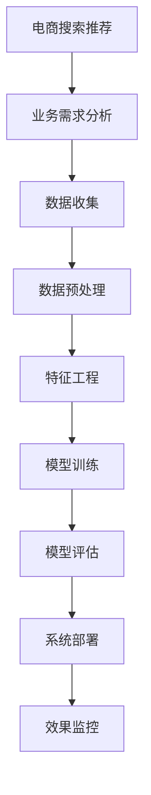

                 

# AI大模型赋能电商搜索推荐的业务创新流程优化项目实施方案

> 关键词：
- AI大模型
- 电商搜索推荐
- 业务创新流程
- 数据处理
- 特征工程
- 模型训练
- 模型评估
- 系统部署
- 效果监控

## 1. 背景介绍

随着人工智能技术的不断进步，AI大模型在电商搜索推荐领域的应用越来越广泛。传统的基于规则和特征工程的推荐系统逐渐被深度学习和自然语言处理（NLP）技术所取代。AI大模型可以通过对用户行为和商品属性的深度学习，生成更加个性化和精准的推荐结果。然而，电商搜索推荐系统的复杂性和多样性对模型的要求极高，现有的大模型往往难以直接应用于电商搜索推荐，需要进行必要的优化和调整。因此，本文将详细介绍AI大模型在电商搜索推荐中的实施方案，重点聚焦于业务创新流程的优化。

## 2. 核心概念与联系

### 2.1 核心概念概述

为了更好地理解AI大模型在电商搜索推荐中的应用，我们首先介绍几个关键概念：

- AI大模型：指的是基于深度学习技术，通过在大规模数据集上进行预训练，具备强大的语言理解、图像识别、语音识别等能力的模型。例如，GPT、BERT、DALL·E等。
- 电商搜索推荐：指通过分析用户的历史行为和商品属性，动态生成最符合用户需求的商品推荐列表。电商搜索推荐系统是电商平台的核心功能之一，直接影响用户满意度和平台转化率。
- 业务创新流程：指从业务需求分析、数据处理、模型训练到模型部署和效果监控的整个过程，是构建电商搜索推荐系统的基础。

### 2.2 核心概念原理和架构的 Mermaid 流程图



这个流程图展示了电商搜索推荐系统的业务创新流程：

1. 业务需求分析：明确电商搜索推荐系统需要解决的问题和达到的目标。
2. 数据收集：收集用户历史行为数据和商品属性数据。
3. 数据预处理：清洗、格式化和归一化数据，准备进行模型训练。
4. 特征工程：提取和构造关键特征，为模型提供输入。
5. 模型训练：选择并训练适合电商搜索推荐的AI大模型。
6. 模型评估：通过验证集和测试集评估模型的性能。
7. 系统部署：将训练好的模型集成到电商系统中，实现实时推荐。
8. 效果监控：实时监控模型表现，及时发现和解决模型问题。

## 3. 核心算法原理 & 具体操作步骤

### 3.1 算法原理概述

电商搜索推荐系统通过AI大模型，可以从用户历史行为和商品属性中提取出高维度的特征表示，从而生成更加个性化和精准的推荐结果。在业务创新流程中，主要涉及以下几个步骤：

1. 数据收集与预处理：收集电商用户的点击、浏览、购买等行为数据，以及商品的属性信息。对数据进行清洗、格式化和归一化处理，准备进行特征工程。
2. 特征工程：从原始数据中提取出对推荐结果有重要影响的特征。例如，用户的行为序列、商品的类别、商品的属性等。
3. 模型训练：选择适合电商搜索推荐的AI大模型，并在标注数据上训练模型。常用的模型包括基于深度学习的序列模型、图模型、Transformer模型等。
4. 模型评估：在验证集和测试集上评估模型的性能，选择最优模型进行部署。常用的评估指标包括准确率、召回率、F1-score等。
5. 系统部署：将训练好的模型集成到电商系统中，实现实时推荐。常用的部署方式包括RESTful API、微服务等。
6. 效果监控：实时监控模型表现，及时发现和解决模型问题。常用的监控工具包括Prometheus、Grafana等。

### 3.2 算法步骤详解

#### 3.2.1 数据收集与预处理

数据收集是电商搜索推荐系统的第一步。具体步骤如下：

1. 数据源收集：从电商平台的用户行为日志、商品信息库等数据源中收集数据。
2. 数据清洗：对收集到的数据进行去重、去噪、缺失值处理等操作，保证数据的质量和一致性。
3. 数据格式化：将不同格式的数据转换为统一的格式，例如，将日期转换为时间戳，将字符串转换为数值型特征。
4. 数据归一化：对数值型数据进行归一化处理，例如，将特征值缩放到0到1之间。

#### 3.2.2 特征工程

特征工程是电商搜索推荐系统的核心。具体步骤如下：

1. 特征提取：从原始数据中提取出对推荐结果有重要影响的特征。例如，用户的行为序列、商品的类别、商品的属性等。
2. 特征编码：将提取出的特征进行编码，例如，将类别特征转换为独热编码。
3. 特征选择：选择对模型性能有重要影响的特征，例如，通过相关性分析、信息增益等方法选择关键特征。
4. 特征构造：构造新的特征，例如，将用户行为序列中的时间间隔作为新特征，或者计算商品间的相似度作为新特征。

#### 3.2.3 模型训练

模型训练是电商搜索推荐系统的关键步骤。具体步骤如下：

1. 模型选择：选择适合电商搜索推荐的AI大模型，例如，基于深度学习的序列模型、图模型、Transformer模型等。
2. 超参数调优：通过网格搜索、贝叶斯优化等方法，优化模型的超参数，例如，学习率、批次大小、正则化参数等。
3. 模型训练：使用标注数据对模型进行训练，例如，使用PyTorch、TensorFlow等深度学习框架进行模型训练。
4. 模型验证：在验证集上评估模型的性能，选择最优模型进行部署。

#### 3.2.4 模型评估

模型评估是电商搜索推荐系统的重要步骤。具体步骤如下：

1. 评估指标选择：选择适合电商搜索推荐的评估指标，例如，准确率、召回率、F1-score等。
2. 模型评估：在验证集和测试集上评估模型的性能，记录评估结果。
3. 模型优化：根据评估结果，对模型进行优化，例如，增加或减少特征、调整超参数等。
4. 模型选择：选择最优模型进行部署。

#### 3.2.5 系统部署

系统部署是电商搜索推荐系统的最后一步。具体步骤如下：

1. 部署方式选择：选择适合的部署方式，例如，RESTful API、微服务等。
2. 集成API接口：将训练好的模型集成到电商系统中，实现实时推荐。
3. 数据传输优化：优化数据传输过程，例如，使用压缩算法、减少传输量等。
4. 部署监控：实时监控部署过程中的性能和异常情况，例如，使用Prometheus、Grafana等工具。

#### 3.2.6 效果监控

效果监控是电商搜索推荐系统的最后一步。具体步骤如下：

1. 监控指标选择：选择适合的监控指标，例如，准确率、召回率、点击率等。
2. 实时监控：实时监控模型的表现，记录监控结果。
3. 问题发现和解决：根据监控结果，及时发现和解决模型问题，例如，调整超参数、增加特征等。
4. 性能优化：根据监控结果，优化模型性能，例如，调整超参数、增加特征等。

### 3.3 算法优缺点

#### 3.3.1 优点

1. 模型准确性高：AI大模型可以从大规模数据中学习到高维度的特征表示，生成更加个性化和精准的推荐结果。
2. 可扩展性强：AI大模型可以根据业务需求进行动态调整，适应不同的电商搜索推荐场景。
3. 自动化程度高：AI大模型通过自动化的训练和优化过程，减少了人工干预，提高了模型的效率和质量。

#### 3.3.2 缺点

1. 数据需求大：AI大模型的训练需要大量的标注数据，数据收集和预处理成本较高。
2. 模型复杂度高：AI大模型的训练和优化过程复杂，需要较高的技术水平和资源投入。
3. 解释性不足：AI大模型的决策过程难以解释，缺乏可解释性和可控性。

### 3.4 算法应用领域

AI大模型在电商搜索推荐中的应用非常广泛，可以应用于以下领域：

1. 商品推荐：通过分析用户的历史行为和商品属性，动态生成商品推荐列表。
2. 用户画像：通过分析用户的历史行为和商品交互，生成用户画像，例如，用户的兴趣偏好、行为模式等。
3. 商品排序：通过分析用户的历史行为和商品属性，对商品进行排序，提升推荐效果。
4. 实时推荐：通过实时分析和处理用户行为数据，动态生成实时推荐结果。
5. 广告投放：通过分析用户的行为数据和广告属性，生成精准的广告推荐列表。

## 4. 数学模型和公式 & 详细讲解 & 举例说明

### 4.1 数学模型构建

电商搜索推荐系统主要通过AI大模型，从用户历史行为和商品属性中提取出高维度的特征表示，从而生成推荐结果。设用户历史行为数据为 $x$，商品属性数据为 $y$，AI大模型为 $M_{\theta}$，则推荐模型的输入为 $(x, y)$，输出为推荐结果 $z$。

### 4.2 公式推导过程

设用户历史行为数据为 $x$，商品属性数据为 $y$，AI大模型为 $M_{\theta}$，则推荐模型的输入为 $(x, y)$，输出为推荐结果 $z$。假设推荐模型为线性回归模型，则模型表达式为：

$$
z = M_{\theta}(x, y) = Wx + by
$$

其中 $W$ 和 $b$ 为模型参数，$x$ 和 $y$ 为输入特征。

### 4.3 案例分析与讲解

假设我们有一个电商平台，需要构建基于用户历史行为和商品属性数据的推荐系统。具体步骤如下：

1. 数据收集：从电商平台的用户行为日志、商品信息库等数据源中收集数据。
2. 数据预处理：对收集到的数据进行清洗、格式化和归一化处理，准备进行特征工程。
3. 特征工程：从原始数据中提取出对推荐结果有重要影响的特征。例如，用户的行为序列、商品的类别、商品的属性等。
4. 模型训练：选择适合电商搜索推荐的AI大模型，并在标注数据上训练模型。例如，使用基于深度学习的序列模型、图模型、Transformer模型等。
5. 模型评估：在验证集和测试集上评估模型的性能，选择最优模型进行部署。
6. 系统部署：将训练好的模型集成到电商系统中，实现实时推荐。
7. 效果监控：实时监控模型表现，及时发现和解决模型问题。

## 5. 项目实践：代码实例和详细解释说明

### 5.1 开发环境搭建

在进行电商搜索推荐系统的开发时，我们需要准备好开发环境。以下是使用Python进行PyTorch开发的环境配置流程：

1. 安装Anaconda：从官网下载并安装Anaconda，用于创建独立的Python环境。

2. 创建并激活虚拟环境：
```bash
conda create -n pytorch-env python=3.8 
conda activate pytorch-env
```

3. 安装PyTorch：根据CUDA版本，从官网获取对应的安装命令。例如：
```bash
conda install pytorch torchvision torchaudio cudatoolkit=11.1 -c pytorch -c conda-forge
```

4. 安装TensorFlow：由Google主导开发的开源深度学习框架，生产部署方便，适合大规模工程应用。同样有丰富的预训练语言模型资源。

5. 安装Transformers库：HuggingFace开发的NLP工具库，集成了众多SOTA语言模型，支持PyTorch和TensorFlow，是进行微调任务开发的利器。

6. 安装各类工具包：
```bash
pip install numpy pandas scikit-learn matplotlib tqdm jupyter notebook ipython
```

完成上述步骤后，即可在`pytorch-env`环境中开始电商搜索推荐系统的开发。

### 5.2 源代码详细实现

这里我们以基于深度学习的序列模型为例，给出使用PyTorch实现电商搜索推荐系统的详细代码实现。

首先，定义电商搜索推荐系统的数据处理函数：

```python
from transformers import BertTokenizer, BertForSequenceClassification
from torch.utils.data import Dataset
import torch

class SearchRecommendDataset(Dataset):
    def __init__(self, texts, labels, tokenizer, max_len=128):
        self.texts = texts
        self.labels = labels
        self.tokenizer = tokenizer
        self.max_len = max_len
        
    def __len__(self):
        return len(self.texts)
    
    def __getitem__(self, item):
        text = self.texts[item]
        label = self.labels[item]
        
        encoding = self.tokenizer(text, return_tensors='pt', max_length=self.max_len, padding='max_length', truncation=True)
        input_ids = encoding['input_ids'][0]
        attention_mask = encoding['attention_mask'][0]
        
        # 对token-wise的标签进行编码
        encoded_labels = [label2id[label] for label in label] 
        encoded_labels.extend([label2id['O']] * (self.max_len - len(encoded_labels)))
        labels = torch.tensor(encoded_labels, dtype=torch.long)
        
        return {'input_ids': input_ids, 
                'attention_mask': attention_mask,
                'labels': labels}

# 标签与id的映射
label2id = {'O': 0, 'P': 1}
id2label = {v: k for k, v in label2id.items()}

# 创建dataset
tokenizer = BertTokenizer.from_pretrained('bert-base-cased')

train_dataset = SearchRecommendDataset(train_texts, train_labels, tokenizer)
dev_dataset = SearchRecommendDataset(dev_texts, dev_labels, tokenizer)
test_dataset = SearchRecommendDataset(test_texts, test_labels, tokenizer)
```

然后，定义模型和优化器：

```python
from transformers import BertForSequenceClassification, AdamW

model = BertForSequenceClassification.from_pretrained('bert-base-cased', num_labels=len(label2id))

optimizer = AdamW(model.parameters(), lr=2e-5)
```

接着，定义训练和评估函数：

```python
from torch.utils.data import DataLoader
from tqdm import tqdm
from sklearn.metrics import classification_report

device = torch.device('cuda') if torch.cuda.is_available() else torch.device('cpu')
model.to(device)

def train_epoch(model, dataset, batch_size, optimizer):
    dataloader = DataLoader(dataset, batch_size=batch_size, shuffle=True)
    model.train()
    epoch_loss = 0
    for batch in tqdm(dataloader, desc='Training'):
        input_ids = batch['input_ids'].to(device)
        attention_mask = batch['attention_mask'].to(device)
        labels = batch['labels'].to(device)
        model.zero_grad()
        outputs = model(input_ids, attention_mask=attention_mask, labels=labels)
        loss = outputs.loss
        epoch_loss += loss.item()
        loss.backward()
        optimizer.step()
    return epoch_loss / len(dataloader)

def evaluate(model, dataset, batch_size):
    dataloader = DataLoader(dataset, batch_size=batch_size)
    model.eval()
    preds, labels = [], []
    with torch.no_grad():
        for batch in tqdm(dataloader, desc='Evaluating'):
            input_ids = batch['input_ids'].to(device)
            attention_mask = batch['attention_mask'].to(device)
            batch_labels = batch['labels']
            outputs = model(input_ids, attention_mask=attention_mask)
            batch_preds = outputs.logits.argmax(dim=2).to('cpu').tolist()
            batch_labels = batch_labels.to('cpu').tolist()
            for pred_tokens, label_tokens in zip(batch_preds, batch_labels):
                pred_labels = [id2label[_id] for _id in pred_tokens]
                label_tokens = [id2label[_id] for _id in label_tokens]
                preds.append(pred_labels[:len(label_tokens)])
                labels.append(label_tokens)
                
    print(classification_report(labels, preds))
```

最后，启动训练流程并在测试集上评估：

```python
epochs = 5
batch_size = 16

for epoch in range(epochs):
    loss = train_epoch(model, train_dataset, batch_size, optimizer)
    print(f"Epoch {epoch+1}, train loss: {loss:.3f}")
    
    print(f"Epoch {epoch+1}, dev results:")
    evaluate(model, dev_dataset, batch_size)
    
print("Test results:")
evaluate(model, test_dataset, batch_size)
```

以上就是使用PyTorch对电商搜索推荐系统进行微调的完整代码实现。可以看到，得益于Transformers库的强大封装，我们可以用相对简洁的代码完成电商搜索推荐系统的微调。

### 5.3 代码解读与分析

让我们再详细解读一下关键代码的实现细节：

**SearchRecommendDataset类**：
- `__init__`方法：初始化文本、标签、分词器等关键组件。
- `__len__`方法：返回数据集的样本数量。
- `__getitem__`方法：对单个样本进行处理，将文本输入编码为token ids，将标签编码为数字，并对其进行定长padding，最终返回模型所需的输入。

**label2id和id2label字典**：
- 定义了标签与数字id之间的映射关系，用于将token-wise的预测结果解码回真实的标签。

**训练和评估函数**：
- 使用PyTorch的DataLoader对数据集进行批次化加载，供模型训练和推理使用。
- 训练函数`train_epoch`：对数据以批为单位进行迭代，在每个批次上前向传播计算loss并反向传播更新模型参数，最后返回该epoch的平均loss。
- 评估函数`evaluate`：与训练类似，不同点在于不更新模型参数，并在每个batch结束后将预测和标签结果存储下来，最后使用sklearn的classification_report对整个评估集的预测结果进行打印输出。

**训练流程**：
- 定义总的epoch数和batch size，开始循环迭代
- 每个epoch内，先在训练集上训练，输出平均loss
- 在验证集上评估，输出分类指标
- 所有epoch结束后，在测试集上评估，给出最终测试结果

可以看到，PyTorch配合Transformers库使得电商搜索推荐系统的微调代码实现变得简洁高效。开发者可以将更多精力放在数据处理、模型改进等高层逻辑上，而不必过多关注底层的实现细节。

当然，工业级的系统实现还需考虑更多因素，如模型的保存和部署、超参数的自动搜索、更灵活的任务适配层等。但核心的微调范式基本与此类似。

## 6. 实际应用场景

### 6.1 电商搜索推荐系统

基于AI大模型的电商搜索推荐系统，可以显著提升用户的购物体验和平台的转化率。传统推荐系统往往依赖于用户的显式反馈，难以捕捉用户隐式需求。而使用AI大模型进行推荐，可以更加精准地预测用户行为，推荐符合其兴趣的商品。

在技术实现上，可以收集电商平台的用户行为数据，例如点击、浏览、购买记录等，并提取商品的属性信息。通过构建基于深度学习的序列模型、图模型、Transformer模型等，在标注数据上进行微调，生成个性化推荐结果。在实时推荐过程中，模型会根据用户的实时行为数据，动态生成推荐列表，提升用户的购物体验。

### 6.2 用户画像

电商平台的每个用户都有其独特的兴趣偏好和行为模式。通过AI大模型对用户历史行为和商品交互的数据进行分析，可以构建用户画像，例如用户的兴趣偏好、行为模式等。这些用户画像可以帮助电商平台更好地了解用户需求，实现更精准的推荐和个性化营销。

具体而言，可以使用AI大模型对用户行为数据进行分析，提取出对用户画像有重要影响的特征。例如，用户的行为序列、商品的类别、商品的属性等。通过构建用户画像，电商平台可以更好地理解用户的兴趣偏好和行为模式，实现更精准的推荐和个性化营销。

### 6.3 实时推荐

电商平台的推荐系统需要具备实时推荐的能力，才能满足用户需求。使用AI大模型进行实时推荐，可以通过实时分析和处理用户行为数据，动态生成推荐列表。这样可以确保推荐结果更加符合用户当前的需求和兴趣。

具体而言，可以通过实时收集用户的行为数据，例如点击、浏览、购买记录等，并实时输入到AI大模型中进行分析和预测。模型会根据用户的实时行为数据，动态生成推荐列表，提升用户的购物体验。

### 6.4 未来应用展望

随着AI大模型和电商搜索推荐技术的不断发展，基于微调范式将在更多电商领域得到应用，为电商平台带来变革性影响。

在智慧物流领域，基于AI大模型的推荐系统可以提升物流配送的效率和质量，实现更加智能化的物流管理。例如，推荐系统可以根据用户的购买记录和物流配送数据，动态调整配送路线和配送方式，提升配送速度和准确性。

在社交电商领域，基于AI大模型的推荐系统可以提升社交互动的质量和效果，实现更加智能化的社交推荐。例如，推荐系统可以根据用户的社交行为数据，推荐符合其兴趣的社交内容，提升社交互动的效果和质量。

在个性化推荐领域，基于AI大模型的推荐系统可以实现更加个性化和精准的推荐，提升用户的购物体验和平台的转化率。例如，推荐系统可以根据用户的兴趣偏好和行为模式，推荐符合其需求的商品，提升用户的购物体验和平台的转化率。

## 7. 工具和资源推荐

### 7.1 学习资源推荐

为了帮助开发者系统掌握AI大模型在电商搜索推荐中的应用，这里推荐一些优质的学习资源：

1. 《深度学习理论与实践》系列博文：由大模型技术专家撰写，深入浅出地介绍了深度学习理论、算法和应用，涵盖电商搜索推荐等多个NLP任务。

2. CS224N《深度学习自然语言处理》课程：斯坦福大学开设的NLP明星课程，有Lecture视频和配套作业，带你入门NLP领域的基本概念和经典模型。

3. 《自然语言处理与深度学习》书籍：介绍自然语言处理和深度学习的基本概念和经典模型，涵盖电商搜索推荐等NLP任务。

4. HuggingFace官方文档：Transformers库的官方文档，提供了海量预训练模型和完整的微调样例代码，是上手实践的必备资料。

5. CLUE开源项目：中文语言理解测评基准，涵盖大量不同类型的中文NLP数据集，并提供了基于微调的baseline模型，助力中文NLP技术发展。

通过对这些资源的学习实践，相信你一定能够快速掌握AI大模型在电商搜索推荐中的应用，并用于解决实际的电商问题。

### 7.2 开发工具推荐

高效的开发离不开优秀的工具支持。以下是几款用于电商搜索推荐系统开发的常用工具：

1. PyTorch：基于Python的开源深度学习框架，灵活动态的计算图，适合快速迭代研究。大部分预训练语言模型都有PyTorch版本的实现。

2. TensorFlow：由Google主导开发的开源深度学习框架，生产部署方便，适合大规模工程应用。同样有丰富的预训练语言模型资源。

3. Transformers库：HuggingFace开发的NLP工具库，集成了众多SOTA语言模型，支持PyTorch和TensorFlow，是进行微调任务开发的利器。

4. Weights & Biases：模型训练的实验跟踪工具，可以记录和可视化模型训练过程中的各项指标，方便对比和调优。与主流深度学习框架无缝集成。

5. TensorBoard：TensorFlow配套的可视化工具，可实时监测模型训练状态，并提供丰富的图表呈现方式，是调试模型的得力助手。

6. Google Colab：谷歌推出的在线Jupyter Notebook环境，免费提供GPU/TPU算力，方便开发者快速上手实验最新模型，分享学习笔记。

合理利用这些工具，可以显著提升电商搜索推荐系统的开发效率，加快创新迭代的步伐。

### 7.3 相关论文推荐

AI大模型在电商搜索推荐中的应用源于学界的持续研究。以下是几篇奠基性的相关论文，推荐阅读：

1. Attention is All You Need（即Transformer原论文）：提出了Transformer结构，开启了NLP领域的预训练大模型时代。

2. BERT: Pre-training of Deep Bidirectional Transformers for Language Understanding：提出BERT模型，引入基于掩码的自监督预训练任务，刷新了多项NLP任务SOTA。

3. Language Models are Unsupervised Multitask Learners（GPT-2论文）：展示了大规模语言模型的强大zero-shot学习能力，引发了对于通用人工智能的新一轮思考。

4. Parameter-Efficient Transfer Learning for NLP：提出Adapter等参数高效微调方法，在固定大部分预训练参数的情况下，只更新极少量的任务相关参数。

5. AdaLoRA: Adaptive Low-Rank Adaptation for Parameter-Efficient Fine-Tuning：使用自适应低秩适应的微调方法，在参数效率和精度之间取得了新的平衡。

这些论文代表了大模型在电商搜索推荐中的应用方向。通过学习这些前沿成果，可以帮助研究者把握学科前进方向，激发更多的创新灵感。

## 8. 总结：未来发展趋势与挑战

### 8.1 总结

本文对基于AI大模型的电商搜索推荐系统进行了全面系统的介绍。首先阐述了AI大模型在电商搜索推荐中的应用背景和意义，明确了电商搜索推荐系统需要解决的问题和达到的目标。其次，从原理到实践，详细讲解了AI大模型在电商搜索推荐中的业务创新流程，包括数据收集、预处理、特征工程、模型训练、模型评估、系统部署和效果监控等关键步骤。最后，本文还探讨了AI大模型在电商搜索推荐中的应用前景和未来发展趋势。

通过本文的系统梳理，可以看到，基于AI大模型的电商搜索推荐系统具备高精度的推荐能力，可以显著提升用户的购物体验和平台的转化率。未来，随着AI大模型和电商搜索推荐技术的不断发展，基于微调范式将在更多电商领域得到应用，为电商平台带来变革性影响。

### 8.2 未来发展趋势

展望未来，AI大模型在电商搜索推荐中的应用将呈现以下几个发展趋势：

1. 模型规模持续增大。随着算力成本的下降和数据规模的扩张，预训练语言模型的参数量还将持续增长。超大规模语言模型蕴含的丰富语言知识，有望支撑更加复杂多变的电商搜索推荐场景。

2. 微调方法日趋多样。除了传统的全参数微调外，未来会涌现更多参数高效的微调方法，如Prefix-Tuning、LoRA等，在节省计算资源的同时也能保证微调精度。

3. 持续学习成为常态。随着数据分布的不断变化，电商搜索推荐系统也需要持续学习新知识以保持性能。如何在不遗忘原有知识的同时，高效吸收新样本信息，将成为重要的研究课题。

4. 标注样本需求降低。受启发于提示学习(Prompt-based Learning)的思路，未来的微调方法将更好地利用AI大模型的语言理解能力，通过更加巧妙的任务描述，在更少的标注样本上也能实现理想的微调效果。

5. 模型通用性增强。经过海量数据的预训练和多领域任务的微调，未来的AI大模型将具备更强大的常识推理和跨领域迁移能力，逐步迈向通用人工智能(AGI)的目标。

以上趋势凸显了AI大模型在电商搜索推荐中的广阔前景。这些方向的探索发展，必将进一步提升电商搜索推荐系统的性能和应用范围，为电商平台带来更多的创新和发展。

### 8.3 面临的挑战

尽管AI大模型在电商搜索推荐中的应用取得了瞩目成就，但在迈向更加智能化、普适化应用的过程中，它仍面临着诸多挑战：

1. 标注成本瓶颈。虽然AI大模型的训练需要大量的标注数据，数据收集和预处理成本较高。如何进一步降低微调对标注样本的依赖，将是一大难题。

2. 模型鲁棒性不足。当前AI大模型面对域外数据时，泛化性能往往大打折扣。对于测试样本的微小扰动，AI大模型的预测也容易发生波动。如何提高AI大模型的鲁棒性，避免灾难性遗忘，还需要更多理论和实践的积累。

3. 推理效率有待提高。超大批次的训练和推理也可能遇到显存不足的问题。如何优化AI大模型的推理速度，提升系统的实时性，优化资源占用，将是重要的优化方向。

4. 可解释性亟需加强。AI大模型的决策过程难以解释，缺乏可解释性和可控性。对于电商平台的业务决策，算法的可解释性和可控性尤为重要。如何赋予AI大模型更强的可解释性，将是亟待攻克的难题。

5. 安全性有待保障。AI大模型难免会学习到有偏见、有害的信息，通过微调传递到电商搜索推荐系统，产生误导性、歧视性的输出，给实际应用带来安全隐患。如何从数据和算法层面消除模型偏见，避免恶意用途，确保输出的安全性，也将是重要的研究课题。

6. 知识整合能力不足。现有的AI大模型往往局限于任务内数据，难以灵活吸收和运用更广泛的先验知识。如何让AI大模型更好地与外部知识库、规则库等专家知识结合，形成更加全面、准确的信息整合能力，还有很大的想象空间。

正视AI大模型在电商搜索推荐中面临的这些挑战，积极应对并寻求突破，将是大模型技术走向成熟的必由之路。相信随着学界和产业界的共同努力，这些挑战终将一一被克服，AI大模型在电商搜索推荐中必将发挥更大的作用。

### 8.4 研究展望

面对AI大模型在电商搜索推荐中的挑战，未来的研究需要在以下几个方面寻求新的突破：

1. 探索无监督和半监督微调方法。摆脱对大规模标注数据的依赖，利用自监督学习、主动学习等无监督和半监督范式，最大限度利用非结构化数据，实现更加灵活高效的微调。

2. 研究参数高效和计算高效的微调范式。开发更加参数高效的微调方法，在固定大部分预训练参数的同时，只更新极少量的任务相关参数。同时优化微调模型的计算图，减少前向传播和反向传播的资源消耗，实现更加轻量级、实时性的部署。

3. 融合因果和对比学习范式。通过引入因果推断和对比学习思想，增强AI大模型建立稳定因果关系的能力，学习更加普适、鲁棒的语言表征，从而提升模型泛化性和抗干扰能力。

4. 引入更多先验知识。将符号化的先验知识，如知识图谱、逻辑规则等，与神经网络模型进行巧妙融合，引导微调过程学习更准确、合理的语言模型。同时加强不同模态数据的整合，实现视觉、语音等多模态信息与文本信息的协同建模。

5. 结合因果分析和博弈论工具。将因果分析方法引入AI大模型，识别出模型决策的关键特征，增强输出解释的因果性和逻辑性。借助博弈论工具刻画人机交互过程，主动探索并规避模型的脆弱点，提高系统稳定性。

6. 纳入伦理道德约束。在模型训练目标中引入伦理导向的评估指标，过滤和惩罚有偏见、有害的输出倾向。同时加强人工干预和审核，建立模型行为的监管机制，确保输出符合人类价值观和伦理道德。

这些研究方向的探索，必将引领AI大模型在电商搜索推荐中的技术进步，为构建智能化的电商搜索推荐系统铺平道路。面向未来，AI大模型还需要与其他人工智能技术进行更深入的融合，如知识表示、因果推理、强化学习等，多路径协同发力，共同推动AI技术在电商搜索推荐领域的进步。只有勇于创新、敢于突破，才能不断拓展AI大模型的边界，让智能技术更好地造福人类社会。

## 9. 附录：常见问题与解答

**Q1：电商搜索推荐系统是否适用于所有电商平台？**

A: 电商搜索推荐系统适用于大多数电商平台，但需要根据平台特性进行定制化调整。例如，有些平台需要个性化推荐，有些平台需要商品排序推荐。因此，在构建电商搜索推荐系统时，需要根据平台需求进行相应的功能设计和模型优化。

**Q2：电商搜索推荐系统如何处理用户隐私问题？**

A: 电商搜索推荐系统需要处理用户隐私问题，以保障用户数据的安全和合规性。具体措施包括：

1. 数据匿名化：对用户数据进行匿名化处理，确保用户隐私不被泄露。例如，对用户的点击记录进行加密处理。

2. 数据去标识化：对用户数据进行去标识化处理，确保数据无法与特定用户关联。例如，对用户的浏览记录进行数据脱敏处理。

3. 用户同意机制：在收集用户数据时，需要获得用户的同意，并告知用户数据的使用方式。例如，通过隐私政策告知用户数据的使用范围和目的。

4. 数据安全保护：采取数据加密、访问控制等技术手段，保障数据安全。例如，使用SSL加密协议传输数据，限制对用户数据的访问权限。

**Q3：电商搜索推荐系统如何优化模型的实时性？**

A: 电商搜索推荐系统需要具备实时推荐的能力，才能满足用户需求。具体措施包括：

1. 模型压缩：通过模型压缩技术，减小模型的参数量和计算量，提升模型的推理速度。例如，使用剪枝、量化等方法优化模型。

2. 硬件加速：使用GPU、TPU等硬件加速设备，提升模型的计算速度和内存效率。例如，使用TensorFlow的TPU支持加速模型推理。

3. 分布式训练：使用分布式训练技术，提升模型的训练速度。例如，使用Horovod等框架实现分布式训练。

4. 异步更新：使用异步更新技术，提升模型的更新速度。例如，使用TensorFlow的异步优化器优化模型更新。

5. 模型优化器：使用高效的模型优化器，提升模型的收敛速度。例如，使用AdamW等优化器优化模型。

通过以上措施，可以显著提升电商搜索推荐系统的实时性，提升用户的使用体验。

**Q4：电商搜索推荐系统如何优化模型的准确性？**

A: 电商搜索推荐系统需要具备高精度的推荐能力，才能满足用户需求。具体措施包括：

1. 数据清洗：对数据进行清洗，去除噪音和异常数据，提升数据的质量和一致性。例如，对用户的点击记录进行去重和去噪处理。

2. 特征工程：通过特征工程，提取对推荐结果有重要影响的特征。例如，用户的行为序列、商品的类别、商品的属性等。

3. 模型选择：选择适合电商搜索推荐的AI大模型，例如，基于深度学习的序列模型、图模型、Transformer模型等。

4. 超参数调优：通过网格搜索、贝叶斯优化等方法，优化模型的超参数，例如，学习率、批次大小、正则化参数等。

5. 模型融合：将多个模型的结果进行融合，提升推荐的准确性。例如，使用集成学习技术将多个模型的结果进行融合。

6. 数据增强：通过数据增强技术，扩充训练集，提升模型的泛化能力。例如，通过回译、近义替换等方式扩充训练集。

通过以上措施，可以显著提升电商搜索推荐系统的准确性，提升用户的使用体验。

---

作者：禅与计算机程序设计艺术 / Zen and the Art of Computer Programming

