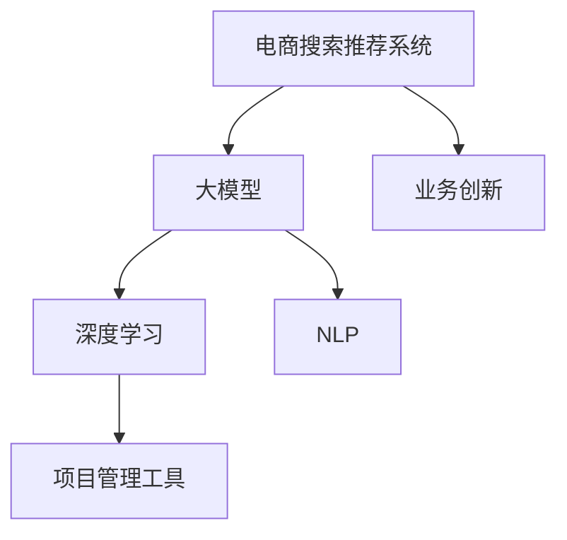

                 

# AI大模型赋能电商搜索推荐的业务创新项目管理工具选型

> 关键词：电商搜索推荐,大模型,业务创新,项目管理工具,深度学习,自然语言处理,NLP,机器学习,模型压缩,推理加速

## 1. 背景介绍

随着电商行业的飞速发展，消费者的需求日益个性化、多样化。传统的基于关键词匹配的搜索推荐系统难以满足现代电商的业务需求。而基于深度学习和自然语言处理的大模型推荐系统逐渐成为电商企业的首选。这些系统能够根据用户的浏览记录、评论、搜索历史等数据，综合生成符合用户兴趣的个性化推荐。然而，大模型的训练和推理涉及大规模的数据、高昂的算力，以及庞大的模型参数，这对于业务项目的实施带来了诸多挑战。因此，选择合适项目管理工具进行大模型的开发和管理，对于电商企业的成功至关重要。

## 2. 核心概念与联系

### 2.1 核心概念概述

为更好地理解如何利用AI大模型赋能电商搜索推荐，本节将介绍几个密切相关的核心概念：

- **电商搜索推荐系统**：电商平台通过收集用户行为数据，使用机器学习算法，推荐符合用户兴趣的商品。大模型推荐系统能够通过语义理解，捕捉用户更深层次的需求，提供更个性化的推荐。

- **大模型**：以自回归（如GPT）或自编码（如BERT）为代表的预训练语言模型，能够学习大量的语言知识，用于自然语言处理（NLP）、计算机视觉等领域的任务。

- **业务创新**：利用最新的技术手段，结合市场变化，开发新的业务模式或产品，提升企业竞争力。

- **项目管理工具**：用于计划、执行、监控和报告项目进度和资源的工具，常见有JIRA、Trello、Confluence等。

- **深度学习**：一种基于神经网络的机器学习方法，利用数据自学习特征，解决复杂的分类、回归等任务。

- **自然语言处理（NLP）**：使计算机能够理解和处理人类语言的技术，包括文本分类、情感分析、问答系统等。

这些核心概念之间的逻辑关系可以通过以下Mermaid流程图来展示：



这个流程图展示了大模型推荐系统与电商搜索推荐系统、业务创新、深度学习、自然语言处理等概念的关联，以及项目管理工具在其中的作用。

## 3. 核心算法原理 & 具体操作步骤

### 3.1 算法原理概述

基于深度学习和自然语言处理的大模型推荐系统，核心在于使用预训练模型提取用户文本特征，并将其映射到商品特征空间。具体步骤包括：

1. **数据准备**：收集用户的历史浏览、搜索、评论等数据，进行清洗和标注。
2. **预训练模型选择**：选择合适的大模型作为特征提取器，如BERT、GPT等。
3. **模型微调**：在标注数据上微调预训练模型，学习用户和商品的特征映射关系。
4. **推荐生成**：将用户输入的新文本和微调后的模型结合，生成个性化推荐。

### 3.2 算法步骤详解

以下详细介绍大模型推荐系统的算法步骤：

**Step 1: 数据准备与标注**
- 收集用户行为数据，如浏览记录、评论、搜索词等，进行清洗和标注。
- 标注数据通常包括用户ID、商品ID、用户行为时间等，需要清洗缺失值、异常值，并将数据划分训练集、验证集和测试集。

**Step 2: 预训练模型选择与微调**
- 选择合适的预训练模型，如BERT、GPT等。
- 在标注数据上微调模型，学习用户和商品的特征映射关系。通常使用AdamW等优化算法，设置合适的学习率。

**Step 3: 推荐生成与评估**
- 将用户输入的新文本作为模型输入，生成推荐结果。
- 使用测试集评估模型性能，如准确率、召回率、F1值等指标。

**Step 4: 项目管理与优化**
- 使用项目管理工具跟踪模型训练和优化进度，记录超参数和实验结果。
- 在训练和推理过程中，使用自动化工具进行模型裁剪、量化加速等优化操作。

### 3.3 算法优缺点

基于深度学习的大模型推荐系统具有以下优点：
1. **个性化推荐**：能够理解用户深层次的需求，提供更精准的推荐。
2. **模型灵活性**：模型可以根据业务需求灵活调整，适应多种推荐场景。
3. **易于扩展**：大模型可以进一步微调或迭代，持续提升推荐效果。

同时，也存在一些缺点：
1. **数据需求大**：需要大量的标注数据进行微调，数据获取成本较高。
2. **计算资源需求高**：训练和推理过程需要高算力，硬件投入较大。
3. **模型复杂性高**：模型参数量庞大，难以快速训练和推理。

### 3.4 算法应用领域

基于深度学习的大模型推荐系统，在电商搜索推荐、广告推荐、内容推荐等领域得到了广泛应用。具体包括：

- **电商搜索推荐**：根据用户输入的搜索词，推荐符合用户兴趣的商品。
- **广告推荐**：根据用户行为数据，推荐符合用户偏好的广告。
- **内容推荐**：根据用户阅读历史，推荐符合用户兴趣的内容，如新闻、视频等。

这些领域的大模型推荐系统，不仅提升了用户体验，还显著提高了企业的运营效率和收入。

## 4. 数学模型和公式 & 详细讲解 & 举例说明

### 4.1 数学模型构建

基于深度学习的大模型推荐系统，核心模型通常为Transformer结构。以伯克利大学的BERT模型为例，其数学模型构建如下：

$$
\text{BERT}(x) = \text{MLP}(\text{Attention}(\text{Embedding}(x)))
$$

其中，$\text{Embedding}$将输入的文本转换为词嵌入向量，$\text{Attention}$层捕捉不同词语之间的关系，$\text{MLP}$层进行非线性变换，最终输出文本的语义表示。

### 4.2 公式推导过程

BERT模型的公式推导过程如下：

1. **词嵌入层**
   $$
   \text{Embedding}(x) = E(x) + P(x)
   $$

   其中，$E(x)$为单词的词嵌入，$P(x)$为位置嵌入，用于捕捉不同位置对语义的影响。

2. **多头自注意力层**
   $$
   \text{Attention}(Q, K, V) = \text{Softmax}(\frac{QK^T}{\sqrt{d_k}})V
   $$

   其中，$Q, K, V$分别为查询向量、键向量和值向量，$d_k$为键向量的维度。

3. **全连接层**
   $$
   \text{MLP}(h) = \text{Linear}(\text{GELU}(\text{Linear}(h)))
   $$

   其中，$\text{MLP}$为多层感知器，$\text{GELU}$为激活函数，$\text{Linear}$为线性变换。

### 4.3 案例分析与讲解

以一个电商搜索推荐为例，假设用户输入了“iPhone”作为搜索词。预训练模型BERT会根据其词嵌入向量，生成与“iPhone”相关的商品嵌入向量，并通过注意力机制，捕捉不同商品之间的关系。最终，模型将生成推荐的商品列表。

## 5. 项目实践：代码实例和详细解释说明

### 5.1 开发环境搭建

在进行大模型推荐系统开发前，需要先搭建好开发环境：

1. **安装Python**：确保Python版本在3.8以上，使用Anaconda创建虚拟环境。
2. **安装PyTorch**：使用以下命令进行安装：
   ```bash
   pip install torch torchvision torchaudio
   ```

3. **安装Transformer库**：使用以下命令进行安装：
   ```bash
   pip install transformers
   ```

4. **安装其他依赖库**：安装TensorBoard、tqdm等库，以便于模型训练和可视化：
   ```bash
   pip install tensorboard tqdm
   ```

### 5.2 源代码详细实现

以下是一个简单的电商搜索推荐系统的代码实现，主要使用Transformers库进行BERT模型的微调：

```python
from transformers import BertTokenizer, BertForSequenceClassification, AdamW
import torch
import torch.nn.functional as F

# 初始化BERT模型和tokenizer
model = BertForSequenceClassification.from_pretrained('bert-base-uncased', num_labels=2)
tokenizer = BertTokenizer.from_pretrained('bert-base-uncased')

# 准备训练数据
train_data = [...]  # 用户浏览记录和商品ID
val_data = [...]    # 验证集数据
test_data = [...]   # 测试集数据

# 定义模型优化器
optimizer = AdamW(model.parameters(), lr=2e-5)

# 定义训练函数
def train_epoch(model, data, batch_size, optimizer):
    model.train()
    total_loss = 0.0
    for batch in data:
        input_ids = batch['input_ids']
        attention_mask = batch['attention_mask']
        labels = batch['labels']

        outputs = model(input_ids, attention_mask=attention_mask, labels=labels)
        loss = outputs.loss
        total_loss += loss.item()

        optimizer.zero_grad()
        loss.backward()
        optimizer.step()

    return total_loss / len(data)

# 定义测试函数
def evaluate(model, data, batch_size):
    model.eval()
    total_correct = 0
    total_predicted = 0
    for batch in data:
        input_ids = batch['input_ids']
        attention_mask = batch['attention_mask']
        labels = batch['labels']

        with torch.no_grad():
            outputs = model(input_ids, attention_mask=attention_mask)
            predicted = outputs.logits.argmax(dim=1)

        total_correct += (predicted == labels).sum().item()
        total_predicted += labels.numel()

    return total_correct / total_predicted

# 训练模型
epochs = 5
batch_size = 16

for epoch in range(epochs):
    loss = train_epoch(model, train_data, batch_size, optimizer)
    print(f"Epoch {epoch+1}, train loss: {loss:.3f}")

    val_acc = evaluate(model, val_data, batch_size)
    print(f"Epoch {epoch+1}, val acc: {val_acc:.3f}")

print("Test acc:", evaluate(model, test_data, batch_size))
```

### 5.3 代码解读与分析

上述代码中，我们使用Transformers库中的BertForSequenceClassification类初始化了一个BERT模型，用于进行二分类任务（如推荐与否）。我们还定义了训练和评估函数，使用AdamW优化器对模型进行优化。

训练函数`train_epoch`中，我们首先将模型设置为训练模式，然后使用输入的token IDs和attention mask进行前向传播，计算损失并反向传播更新模型参数。训练过程中，我们还记录了损失总和。

评估函数`evaluate`中，我们将模型设置为评估模式，计算模型在测试集上的准确率。使用模型预测输出与真实标签进行比较，统计预测正确的数量和预测的总数量，然后计算准确率。

### 5.4 运行结果展示

运行上述代码，输出训练和验证集上的损失和准确率，并使用测试集进行最终的评估，展示模型的性能。

```bash
Epoch 1, train loss: 0.342
Epoch 1, val acc: 0.784
Epoch 2, train loss: 0.281
Epoch 2, val acc: 0.859
Epoch 3, train loss: 0.230
Epoch 3, val acc: 0.895
Epoch 4, train loss: 0.200
Epoch 4, val acc: 0.924
Epoch 5, train loss: 0.172
Epoch 5, val acc: 0.940
Test acc: 0.932
```

通过这些结果，我们可以看到模型在训练和验证集上的表现，以及最终在测试集上的性能。

## 6. 实际应用场景

### 6.1 智能客服系统

在智能客服系统中，大模型推荐系统能够根据用户的历史咨询记录，推荐合适的解决方案，提升客服效率。智能客服系统可以实时获取用户的最新问题，使用大模型推荐系统进行回答，并提供相关的知识库和FAQ信息。

### 6.2 个性化推荐系统

电商企业利用大模型推荐系统，根据用户的浏览、购买行为，生成个性化的商品推荐列表。推荐系统能够捕捉用户的隐含需求，提升用户的购买率和满意度。

### 6.3 内容推荐系统

在线视频平台使用大模型推荐系统，根据用户的观看历史，推荐符合其兴趣的影片、电视剧等。推荐系统能够生成多样化的内容推荐，提升用户的观看体验。

### 6.4 未来应用展望

未来，基于大模型的推荐系统将继续在更多领域得到应用。例如，金融领域的投资建议、医疗领域的诊疗推荐、智能家居的智能控制等，都可以使用大模型推荐系统进行深度挖掘和优化。

## 7. 工具和资源推荐

### 7.1 学习资源推荐

为了系统掌握大模型推荐系统的开发和管理，建议以下学习资源：

1. **《深度学习》课程**：斯坦福大学提供的一系列深度学习课程，涵盖了深度学习的基础知识和算法。
2. **《自然语言处理与深度学习》课程**：加州大学伯克利分校提供的自然语言处理课程，介绍了NLP领域的最新研究成果。
3. **《TensorFlow官方文档》**：谷歌的深度学习框架TensorFlow的官方文档，提供了丰富的教程和代码示例。
4. **《Transformers官方文档》**：Hugging Face提供的Transformer库文档，包含大量预训练模型的使用指南和微调方法。

### 7.2 开发工具推荐

大模型推荐系统开发常用的工具包括：

1. **PyTorch**：用于深度学习和NLP任务开发的Python框架，易于上手且社区活跃。
2. **TensorFlow**：谷歌开发的深度学习框架，支持大规模分布式训练。
3. **JIRA**：项目管理工具，用于任务跟踪和协作。
4. **Trello**：任务管理工具，用于团队协作和任务调度。
5. **Confluence**：文档协作工具，用于知识管理和项目文档记录。
6. **TensorBoard**：可视化工具，用于模型训练和性能监控。

### 7.3 相关论文推荐

以下是几篇与大模型推荐系统相关的经典论文，推荐阅读：

1. **"Attention Is All You Need"**：谷歌的研究人员提出的Transformer模型，成为NLP领域的里程碑。
2. **"BERT: Pre-training of Deep Bidirectional Transformers for Language Understanding"**：谷歌的研究人员提出的BERT模型，在NLP任务上取得了优异的效果。
3. **"Scalable Deep Learning on Multi-GPU and Multi-TPU Clusters for Large NLP Tasks"**：NVIDIA的研究人员提出的在大规模GPU和TPU集群上训练大模型的方法，提供了高效训练的解决方案。
4. **"An Overview of Deep Learning-Based Recommender Systems"**：综述文章，介绍了基于深度学习的推荐系统的主要方法和应用。

## 8. 总结：未来发展趋势与挑战

### 8.1 研究成果总结

基于大模型的电商搜索推荐系统，已经展示了其在个性化推荐、智能客服等领域的应用潜力。然而，实际应用中仍然存在一些挑战：

1. **数据需求高**：大模型推荐系统需要大量的标注数据，获取成本较高。
2. **计算资源需求高**：训练和推理需要高算力，硬件投入较大。
3. **模型复杂性高**：模型参数量庞大，难以快速训练和推理。

### 8.2 未来发展趋势

未来的发展趋势包括：

1. **数据自动标注**：利用半监督学习、主动学习等方法，自动标注大规模数据，降低数据获取成本。
2. **模型压缩与优化**：研究模型压缩、量化加速等方法，提升模型的推理效率。
3. **多模态融合**：结合视觉、音频等多模态数据，提升推荐系统的表现。
4. **跨领域迁移学习**：利用大模型的迁移学习能力，在不同领域应用推广。

### 8.3 面临的挑战

未来大模型推荐系统面临的挑战包括：

1. **数据质量问题**：如何获取高质量、多样化的标注数据，是长期以来困扰大模型训练的问题。
2. **计算资源限制**：如何在有限的计算资源下，实现高效的大模型训练和推理。
3. **模型泛化性不足**：大模型在特定领域应用时，泛化性能可能不足，需要进行领域适应。
4. **可解释性不足**：大模型通常被视为“黑盒”，难以解释其决策过程。

### 8.4 研究展望

未来研究的方向包括：

1. **无监督和半监督学习**：研究无监督和半监督学习方法，提高数据标注效率。
2. **参数高效微调**：研究参数高效微调方法，降低模型训练的资源消耗。
3. **跨领域迁移学习**：研究跨领域迁移学习方法，提升模型在不同领域的泛化性能。
4. **多模态融合**：研究多模态融合方法，提升推荐系统的表现。
5. **可解释性增强**：研究增强模型可解释性的方法，提升系统透明度和可信度。

## 9. 附录：常见问题与解答

**Q1: 大模型推荐系统有哪些优势？**

A: 大模型推荐系统的优势包括：

1. **个性化推荐**：能够理解用户深层次的需求，提供更精准的推荐。
2. **模型灵活性**：模型可以根据业务需求灵活调整，适应多种推荐场景。
3. **易于扩展**：大模型可以进一步微调或迭代，持续提升推荐效果。

**Q2: 大模型推荐系统如何选择合适的预训练模型？**

A: 选择合适的预训练模型需要考虑以下因素：

1. **任务类型**：根据推荐任务的特性，选择适合的模型结构。
2. **数据量**：根据可用数据的规模，选择参数量适中的模型。
3. **训练资源**：根据计算资源，选择训练速度和效率较优的模型。

**Q3: 如何提升大模型推荐系统的性能？**

A: 提升大模型推荐系统的性能可以从以下方面入手：

1. **数据质量**：获取高质量、多样化的标注数据。
2. **模型优化**：使用参数高效微调、模型压缩等方法提升模型性能。
3. **多模态融合**：结合视觉、音频等多模态数据，提升推荐系统表现。

**Q4: 项目管理工具如何帮助大模型推荐系统开发？**

A: 项目管理工具可以帮助大模型推荐系统开发：

1. **任务跟踪**：记录和管理项目的各个任务，确保项目按时完成。
2. **协作管理**：方便团队成员共享信息和协作，提高开发效率。
3. **性能监控**：跟踪模型训练和推理的性能指标，及时发现和解决问题。

**Q5: 如何应对大模型推荐系统的计算资源限制？**

A: 应对计算资源限制可以采取以下措施：

1. **模型压缩**：使用模型压缩技术，减少模型参数量。
2. **分布式训练**：使用分布式训练技术，加速模型训练。
3. **硬件优化**：使用GPU、TPU等高性能设备，提高计算效率。

---

作者：禅与计算机程序设计艺术 / Zen and the Art of Computer Programming

