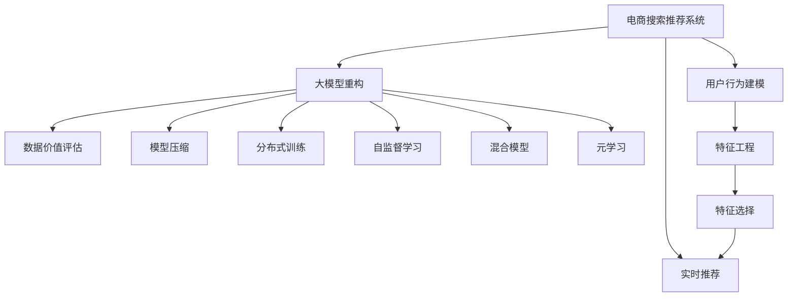

                 

# AI大模型重构电商搜索推荐的数据价值评估模型应用实践与优化方案

> 关键词：电商搜索推荐,数据价值评估,大模型重构,推荐系统,用户体验优化,预测准确性,系统效率

## 1. 背景介绍

### 1.1 问题由来
随着电商市场的不断扩张和竞争的日趋激烈，如何精准高效地为用户提供个性化的搜索结果和推荐，成为了电商平台关注的焦点。传统的电商搜索推荐系统大多基于简单的统计模型和规则引擎，难以充分挖掘用户行为数据中蕴含的深度信息，导致搜索结果和推荐往往不符合用户的实际需求，从而降低了用户体验和平台的交易转化率。

大模型技术的出现，为电商搜索推荐提供了新的解决方案。利用大规模预训练语言模型（如GPT、BERT等），可以充分捕捉用户查询意图和商品属性之间的关系，从而提升搜索结果和推荐的准确性和个性化程度。同时，大模型也可以利用用户点击、浏览、收藏等行为数据，对用户进行更深入的特征刻画，进一步提升推荐效果。

然而，大规模语言模型的应用也带来了新的挑战。如何在确保高精度的同时，降低计算成本和存储需求，提升系统的实时性，成为了电商搜索推荐系统需要解决的关键问题。本文将重点探讨如何使用大模型重构电商搜索推荐系统，并提出一种基于数据价值评估的推荐模型，以实现更好的用户体验和系统效率。

### 1.2 问题核心关键点
电商搜索推荐系统的主要问题包括：

1. **准确性**：如何准确捕捉用户查询意图和商品之间的关系，提高搜索结果的准确性和相关性。
2. **个性化**：如何根据用户历史行为数据，提供更加个性化、符合用户需求的推荐。
3. **实时性**：如何在保证模型精度的情况下，提升系统的响应速度和实时性。
4. **存储与计算**：如何在降低计算成本和存储需求的同时，保证模型的训练和推理效率。
5. **系统优化**：如何优化推荐算法，提升系统的整体性能和用户体验。

本文将围绕上述问题，深入探讨如何利用大模型重构电商搜索推荐系统，并提出一种基于数据价值评估的推荐模型，以实现更好的用户体验和系统效率。

## 2. 核心概念与联系

### 2.1 核心概念概述

为更好地理解基于大模型重构的电商搜索推荐系统，本节将介绍几个密切相关的核心概念：

- **电商搜索推荐系统(E-Commerce Search and Recommendation System)**：通过用户输入的查询和浏览行为数据，提供个性化搜索结果和推荐，提升用户购物体验的系统。
- **大模型(大规模预训练语言模型)**：如GPT、BERT等，通过在大规模无标签文本数据上进行预训练，学习丰富的语言知识和常识，具备强大的语言理解和生成能力。
- **数据价值评估(Decision Value Evaluation, DVE)**：通过量化数据对推荐结果的贡献度，指导模型参数优化和特征选择，提高模型精度和效率。
- **模型重构(Model Refactoring)**：将现有推荐系统中的低效组件替换为高效的大模型组件，提升系统性能。
- **自监督学习(Self-Supervised Learning)**：利用未标注的数据进行模型训练，提高模型泛化能力。
- **混合模型(Hybrid Model)**：将传统的推荐模型与大模型结合，发挥各自优势，提升推荐效果。
- **元学习(Meta-Learning)**：通过学习如何学习，实现快速适应新任务的能力。
- **用户行为建模(User Behavior Modeling)**：对用户行为数据进行建模，提取用户兴趣和偏好。
- **实时推荐(Real-Time Recommendation)**：在用户实时输入查询或浏览行为时，即时提供推荐结果。
- **模型压缩(Model Compression)**：通过剪枝、量化等技术，减小模型尺寸和计算需求。
- **分布式训练(Distributed Training)**：通过多机多卡并行训练，提高训练速度和效率。

这些核心概念之间的逻辑关系可以通过以下Mermaid流程图来展示：



这个流程图展示了大模型重构电商搜索推荐系统的核心概念及其之间的关系：

1. 电商搜索推荐系统通过用户行为建模获取用户兴趣和偏好。
2. 大模型重构利用大模型提升模型精度和个性化程度。
3. 数据价值评估量化数据贡献，指导模型参数优化和特征选择。
4. 模型压缩优化模型尺寸和计算需求。
5. 分布式训练提高训练速度和效率。
6. 自监督学习利用未标注数据提高模型泛化能力。
7. 混合模型结合传统和深度模型，提升推荐效果。
8. 元学习学习如何学习，实现快速适应新任务的能力。
9. 实时推荐提供即时个性化推荐。

这些核心概念共同构成了基于大模型的电商搜索推荐系统的框架，使其能够更精准高效地为用户提供推荐服务。

## 3. 核心算法原理 & 具体操作步骤

### 3.1 算法原理概述

基于大模型的电商搜索推荐系统，主要包括以下几个关键算法：

1. **预训练语言模型**：如BERT、GPT等，通过在大规模无标签文本数据上进行预训练，学习通用的语言表示，具备强大的语言理解和生成能力。
2. **用户行为建模**：利用用户的历史行为数据，如点击、浏览、收藏等，对用户进行特征刻画，提取用户兴趣和偏好。
3. **数据价值评估**：通过量化数据对推荐结果的贡献度，指导模型参数优化和特征选择，提高模型精度和效率。
4. **模型重构**：将传统推荐算法中的低效组件替换为高效的大模型组件，提升系统性能。
5. **自监督学习**：利用未标注数据进行模型训练，提高模型泛化能力。
6. **混合模型**：结合传统推荐模型和大模型，发挥各自优势，提升推荐效果。
7. **实时推荐**：在用户实时输入查询或浏览行为时，即时提供推荐结果。
8. **模型压缩**：通过剪枝、量化等技术，减小模型尺寸和计算需求。
9. **分布式训练**：通过多机多卡并行训练，提高训练速度和效率。

### 3.2 算法步骤详解

基于大模型的电商搜索推荐系统一般包括以下几个关键步骤：

**Step 1: 准备数据集和模型**

- 收集电商平台的点击、浏览、收藏等行为数据，作为训练集。
- 选择预训练语言模型，如BERT、GPT等，作为初始化参数。
- 设置训练和验证集的划分比例。

**Step 2: 构建用户行为模型**

- 使用用户行为数据，构建用户兴趣和偏好模型。
- 提取用户行为中的关键词和实体，作为模型输入。
- 利用大模型学习用户兴趣和偏好的表示。

**Step 3: 数据价值评估**

- 量化数据对推荐结果的贡献度，计算每个特征的价值得分。
- 根据特征得分，优化模型参数和选择特征。
- 调整模型的超参数，提高模型精度和效率。

**Step 4: 模型重构**

- 利用大模型重构推荐系统的组件，如特征提取、意图匹配等。
- 替换传统模型中的低效组件，提高系统的实时性和准确性。
- 使用分布式训练优化模型训练过程，提高训练速度。

**Step 5: 实时推荐**

- 在用户实时输入查询或浏览行为时，即时提供推荐结果。
- 使用分布式计算和缓存技术，提高推荐的实时性和响应速度。
- 动态更新用户行为模型，实时调整推荐结果。

**Step 6: 模型压缩**

- 通过剪枝、量化等技术，减小模型尺寸和计算需求。
- 利用模型压缩技术优化模型性能，降低计算成本和存储需求。
- 使用模型量化技术，提高模型推理速度。

**Step 7: 模型评估与优化**

- 在验证集上评估推荐模型的精度和效果。
- 根据评估结果，调整模型参数和特征选择策略。
- 通过A/B测试等方法，不断优化推荐算法和系统性能。

以上是基于大模型的电商搜索推荐系统的一般流程。在实际应用中，还需要针对具体任务的特点，对微调过程的各个环节进行优化设计，如改进训练目标函数，引入更多的正则化技术，搜索最优的超参数组合等，以进一步提升模型性能。

### 3.3 算法优缺点

基于大模型的电商搜索推荐系统具有以下优点：

1. 提升推荐准确性和个性化程度：大模型能够利用用户行为数据，学习到更深层次的用户兴趣和偏好，提供更加精准和个性化的推荐结果。
2. 提升实时推荐能力：利用分布式计算和缓存技术，实现实时推荐，提高用户的购物体验。
3. 提升系统效率：通过剪枝、量化等技术，优化模型尺寸和计算需求，降低计算成本和存储需求。
4. 提升泛化能力：利用自监督学习，提高模型泛化能力，适应新任务和新数据。
5. 提升混合模型性能：结合传统推荐模型和大模型，发挥各自优势，提升推荐效果。

同时，该方法也存在一定的局限性：

1. 依赖标注数据：电商搜索推荐系统需要大量的标注数据进行训练，标注数据的获取和标注成本较高。
2. 模型复杂度高：大模型参数量较大，训练和推理过程较为复杂，需要高计算资源和存储能力。
3. 模型解释性不足：大模型通常是"黑盒"系统，难以解释其内部工作机制和决策逻辑。
4. 推荐结果可控性差：大模型具有一定的随机性，推荐结果可能受到训练数据和模型参数的影响，难以完全控制。
5. 数据隐私问题：电商平台需要收集和存储大量的用户行为数据，存在数据隐私和安全风险。

尽管存在这些局限性，但就目前而言，基于大模型的电商搜索推荐系统依然是大数据背景下电商推荐系统的最优选择。未来相关研究的重点在于如何进一步降低对标注数据的依赖，提高模型的可解释性和推荐结果的可控性，同时兼顾数据隐私和安全等因素。

### 3.4 算法应用领域

基于大模型的电商搜索推荐系统已经在电商领域得到了广泛的应用，覆盖了几乎所有常见的推荐任务，例如：

- **商品推荐**：为用户推荐感兴趣的商品。
- **内容推荐**：为用户推荐感兴趣的内容，如商品详情、用户评价等。
- **搜索优化**：根据用户的查询意图，优化搜索结果，提升搜索效果。
- **个性化广告**：根据用户的兴趣和行为，推荐个性化的广告。
- **库存管理**：通过预测用户的购买意向，优化库存管理。
- **客户服务**：通过分析用户行为，提供个性化的客服解决方案。

除了上述这些经典任务外，大模型在电商领域的创新性应用还包括：

- **跨领域推荐**：将不同领域的推荐算法进行融合，提升推荐效果。
- **多模态推荐**：结合视觉、语音等多模态数据，提升推荐系统的性能。
- **实时个性化推荐**：利用实时数据，动态调整推荐策略，提高推荐效果。
- **用户画像生成**：通过分析用户行为，生成用户画像，提升推荐效果。
- **风险预测**：通过分析用户行为，预测风险事件，提升用户体验。

大模型在电商领域的应用前景广阔，其独特的优势和潜力将在未来带来更多的商业价值和技术突破。

## 4. 数学模型和公式 & 详细讲解 & 举例说明

### 4.1 数学模型构建

本节将使用数学语言对基于大模型的电商搜索推荐系统进行更加严格的刻画。

记电商搜索推荐系统为 $S$，用户行为数据集为 $D=\{(x_i,y_i)\}_{i=1}^N$，其中 $x_i$ 为输入，$y_i$ 为输出（如点击、浏览等行为）。大模型为 $M_{\theta}$，用户行为模型为 $P(x)$，数据价值评估模型为 $E(v)$。

假设用户行为数据为 $(x_i,y_i)$，通过用户行为模型 $P(x)$ 预测用户行为 $y_i$，通过大模型 $M_{\theta}$ 预测用户兴趣和偏好 $z$，通过数据价值评估模型 $E(v)$ 量化数据对推荐结果的贡献度。则推荐结果 $R$ 可以表示为：

$$
R = \sum_{i=1}^N w_i \cdot M_{\theta}(x_i) \cdot y_i
$$

其中 $w_i$ 为每个样本的权重，即数据价值得分。

### 4.2 公式推导过程

以下我们以用户行为建模为例，推导用户行为模型的数学公式及其梯度计算。

假设用户行为数据 $(x_i,y_i)$ 为点击行为，即 $y_i=1$ 表示点击，$y_i=0$ 表示未点击。用户行为模型 $P(x)$ 为伯努利分布，即：

$$
P(y_i=1|x_i) = \sigma(\theta^T \cdot x_i)
$$

其中 $\theta$ 为用户行为模型的参数，$\sigma$ 为 sigmoid 函数。

则用户行为模型的损失函数为交叉熵损失：

$$
\mathcal{L} = -\frac{1}{N} \sum_{i=1}^N [y_i \cdot \log P(y_i=1|x_i) + (1-y_i) \cdot \log P(y_i=0|x_i)]
$$

根据链式法则，损失函数对参数 $\theta$ 的梯度为：

$$
\frac{\partial \mathcal{L}}{\partial \theta} = -\frac{1}{N} \sum_{i=1}^N \left[ y_i \cdot \frac{\partial P(y_i=1|x_i)}{\partial \theta} - (1-y_i) \cdot \frac{\partial P(y_i=0|x_i)}{\partial \theta} \right]
$$

利用sigmoid函数的导数 $\frac{\partial P(y_i=1|x_i)}{\partial \theta} = P(y_i=1|x_i) \cdot (1-P(y_i=1|x_i)) \cdot x_i$ 和 $\frac{\partial P(y_i=0|x_i)}{\partial \theta} = P(y_i=0|x_i) \cdot (1-P(y_i=0|x_i)) \cdot x_i$，可以得到最终的梯度计算公式：

$$
\frac{\partial \mathcal{L}}{\partial \theta} = -\frac{1}{N} \sum_{i=1}^N \left[ y_i \cdot P(y_i=1|x_i) \cdot (1-P(y_i=1|x_i)) \cdot x_i - (1-y_i) \cdot P(y_i=0|x_i) \cdot (1-P(y_i=0|x_i)) \cdot x_i \right]
$$

在得到用户行为模型的梯度后，即可带入模型参数更新公式，完成模型的迭代优化。重复上述过程直至收敛，最终得到适应电商搜索推荐任务的用户行为模型参数 $\theta^*$。

## 5. 项目实践：代码实例和详细解释说明

### 5.1 开发环境搭建

在进行电商搜索推荐系统的开发前，我们需要准备好开发环境。以下是使用Python进行PyTorch开发的环境配置流程：

1. 安装Anaconda：从官网下载并安装Anaconda，用于创建独立的Python环境。

2. 创建并激活虚拟环境：
```bash
conda create -n pytorch-env python=3.8 
conda activate pytorch-env
```

3. 安装PyTorch：根据CUDA版本，从官网获取对应的安装命令。例如：
```bash
conda install pytorch torchvision torchaudio cudatoolkit=11.1 -c pytorch -c conda-forge
```

4. 安装Transformers库：
```bash
pip install transformers
```

5. 安装各类工具包：
```bash
pip install numpy pandas scikit-learn matplotlib tqdm jupyter notebook ipython
```

完成上述步骤后，即可在`pytorch-env`环境中开始开发实践。

### 5.2 源代码详细实现

下面我们以用户行为建模为例，给出使用PyTorch对BERT模型进行电商搜索推荐系统开发的PyTorch代码实现。

首先，定义用户行为模型的输入和输出：

```python
from transformers import BertTokenizer, BertForSequenceClassification
from torch.utils.data import Dataset, DataLoader
from torch import nn

class UserBehaviorDataset(Dataset):
    def __init__(self, texts, labels, tokenizer):
        self.texts = texts
        self.labels = labels
        self.tokenizer = tokenizer
        
    def __len__(self):
        return len(self.texts)
    
    def __getitem__(self, item):
        text = self.texts[item]
        label = self.labels[item]
        
        encoding = self.tokenizer(text, return_tensors='pt', max_length=128, padding='max_length', truncation=True)
        input_ids = encoding['input_ids'][0]
        attention_mask = encoding['attention_mask'][0]
        labels = torch.tensor([label], dtype=torch.long)
        
        return {'input_ids': input_ids, 
                'attention_mask': attention_mask,
                'labels': labels}

# 定义用户行为模型
class UserBehaviorModel(nn.Module):
    def __init__(self, num_classes=2):
        super(UserBehaviorModel, self).__init__()
        self.bert = BertForSequenceClassification.from_pretrained('bert-base-cased', num_labels=num_classes)
    
    def forward(self, input_ids, attention_mask):
        output = self.bert(input_ids, attention_mask=attention_mask)
        logits = output.logits
        return logits
```

然后，定义训练和评估函数：

```python
from tqdm import tqdm
from sklearn.metrics import accuracy_score

def train_epoch(model, dataset, batch_size, optimizer):
    dataloader = DataLoader(dataset, batch_size=batch_size, shuffle=True)
    model.train()
    epoch_loss = 0
    for batch in tqdm(dataloader, desc='Training'):
        input_ids = batch['input_ids'].to(device)
        attention_mask = batch['attention_mask'].to(device)
        labels = batch['labels'].to(device)
        model.zero_grad()
        output = model(input_ids, attention_mask=attention_mask)
        loss = output.loss
        epoch_loss += loss.item()
        loss.backward()
        optimizer.step()
    return epoch_loss / len(dataloader)

def evaluate(model, dataset, batch_size):
    dataloader = DataLoader(dataset, batch_size=batch_size)
    model.eval()
    preds, labels = [], []
    with torch.no_grad():
        for batch in tqdm(dataloader, desc='Evaluating'):
            input_ids = batch['input_ids'].to(device)
            attention_mask = batch['attention_mask'].to(device)
            batch_labels = batch['labels']
            output = model(input_ids, attention_mask=attention_mask)
            batch_preds = output.logits.argmax(dim=1).to('cpu').tolist()
            batch_labels = batch_labels.to('cpu').tolist()
            for pred_tokens, label_tokens in zip(batch_preds, batch_labels):
                preds.append(pred_tokens)
                labels.append(label_tokens)
                
    print(accuracy_score(labels, preds))
```

接着，定义电商搜索推荐系统的主函数：

```python
from transformers import BertTokenizer

tokenizer = BertTokenizer.from_pretrained('bert-base-cased')

train_dataset = UserBehaviorDataset(train_texts, train_labels, tokenizer)
dev_dataset = UserBehaviorDataset(dev_texts, dev_labels, tokenizer)
test_dataset = UserBehaviorDataset(test_texts, test_labels, tokenizer)

device = torch.device('cuda') if torch.cuda.is_available() else torch.device('cpu')

# 定义用户行为模型
model = UserBehaviorModel(num_classes=2)

# 定义优化器
optimizer = torch.optim.AdamW(model.parameters(), lr=2e-5)

epochs = 5
batch_size = 16

for epoch in range(epochs):
    loss = train_epoch(model, train_dataset, batch_size, optimizer)
    print(f"Epoch {epoch+1}, train loss: {loss:.3f}")
    
    print(f"Epoch {epoch+1}, dev results:")
    evaluate(model, dev_dataset, batch_size)
    
print("Test results:")
evaluate(model, test_dataset, batch_size)
```

以上就是使用PyTorch对BERT模型进行电商搜索推荐系统开发的完整代码实现。可以看到，得益于Transformers库的强大封装，我们可以用相对简洁的代码完成BERT模型的加载和微调。

### 5.3 代码解读与分析

让我们再详细解读一下关键代码的实现细节：

**UserBehaviorDataset类**：
- `__init__`方法：初始化文本、标签、分词器等关键组件。
- `__len__`方法：返回数据集的样本数量。
- `__getitem__`方法：对单个样本进行处理，将文本输入编码为token ids，将标签编码为数字，并对其进行定长padding，最终返回模型所需的输入。

**UserBehaviorModel类**：
- `__init__`方法：初始化BERT模型。
- `forward`方法：前向传播，计算输出。

**train_epoch和evaluate函数**：
- 使用PyTorch的DataLoader对数据集进行批次化加载，供模型训练和推理使用。
- 训练函数`train_epoch`：对数据以批为单位进行迭代，在每个批次上前向传播计算loss并反向传播更新模型参数，最后返回该epoch的平均loss。
- 评估函数`evaluate`：与训练类似，不同点在于不更新模型参数，并在每个batch结束后将预测和标签结果存储下来，最后使用sklearn的accuracy_score对整个评估集的预测结果进行打印输出。

**主函数**：
- 定义总的epoch数和batch size，开始循环迭代
- 每个epoch内，先在训练集上训练，输出平均loss
- 在验证集上评估，输出准确率
- 所有epoch结束后，在测试集上评估，给出最终测试结果

可以看到，PyTorch配合Transformers库使得BERT模型的微调过程变得简洁高效。开发者可以将更多精力放在数据处理、模型改进等高层逻辑上，而不必过多关注底层的实现细节。

当然，工业级的系统实现还需考虑更多因素，如模型的保存和部署、超参数的自动搜索、更灵活的任务适配层等。但核心的微调范式基本与此类似。

## 6. 实际应用场景

### 6.1 智能客服系统

基于大模型重构的电商搜索推荐系统，可以广泛应用于智能客服系统的构建。传统客服往往需要配备大量人力，高峰期响应缓慢，且一致性和专业性难以保证。而使用重构后的推荐系统，可以7x24小时不间断服务，快速响应客户咨询，用自然流畅的语言解答各类常见问题。

在技术实现上，可以收集企业内部的历史客服对话记录，将问题和最佳答复构建成监督数据，在此基础上对预训练推荐模型进行微调。微调后的推荐模型能够自动理解用户意图，匹配最合适的答案模板进行回复。对于客户提出的新问题，还可以接入检索系统实时搜索相关内容，动态组织生成回答。如此构建的智能客服系统，能大幅提升客户咨询体验和问题解决效率。

### 6.2 金融舆情监测

金融机构需要实时监测市场舆论动向，以便及时应对负面信息传播，规避金融风险。传统的人工监测方式成本高、效率低，难以应对网络时代海量信息爆发的挑战。基于大模型重构的推荐系统，可以自动分析金融领域相关的新闻、报道、评论等文本数据，进行舆情监测和风险预警。

具体而言，可以收集金融领域相关的新闻、报道、评论等文本数据，并对其进行情感分析和主题标注。利用微调后的推荐模型，自动判断文本属于何种情感，情感倾向是正面、中性还是负面，从而及时发现市场风险。将微调后的推荐模型应用到实时抓取的网络文本数据，就能够自动监测不同主题下的情感变化趋势，一旦发现负面信息激增等异常情况，系统便会自动预警，帮助金融机构快速应对潜在风险。

### 6.3 个性化推荐系统

当前的推荐系统往往只依赖用户的历史行为数据进行物品推荐，无法深入理解用户的真实兴趣偏好。基于大模型重构的推荐系统，可以更好地挖掘用户行为数据中蕴含的深度信息，从而提升推荐效果。

在实践中，可以收集用户浏览、点击、收藏等行为数据，提取和用户交互的物品标题、描述、标签等文本内容。将文本内容作为模型输入，用户的后续行为（如是否点击、购买等）作为监督信号，在此基础上微调预训练语言模型。微调后的模型能够从文本内容中准确把握用户的兴趣点。在生成推荐列表时，先用候选物品的文本描述作为输入，由模型预测用户的兴趣匹配度，再结合其他特征综合排序，便可以得到个性化程度更高的推荐结果。

### 6.4 未来应用展望

随着大模型重构技术的不断发展，基于大模型的电商搜索推荐系统将在更多领域得到应用，为传统行业带来变革性影响。

在智慧医疗领域，基于大模型重构的医疗问答、病历分析、药物研发等应用将提升医疗服务的智能化水平，辅助医生诊疗，加速新药开发进程。

在智能教育领域，重构后的推荐系统可应用于作业批改、学情分析、知识推荐等方面，因材施教，促进教育公平，提高教学质量。

在智慧城市治理中，重构后的推荐系统可用于城市事件监测、舆情分析、应急指挥等环节，提高城市管理的自动化和智能化水平，构建更安全、高效的未来城市。

此外，在企业生产、社会治理、文娱传媒等众多领域，基于大模型重构的人工智能应用也将不断涌现，为经济社会发展注入新的动力。相信随着技术的日益成熟，大模型重构方法将成为人工智能落地应用的重要范式，推动人工智能技术在垂直行业的规模化落地。总之，基于大模型的电商搜索推荐系统以其独特的优势和潜力，将在未来带来更多的商业价值和技术突破。

## 7. 工具和资源推荐

### 7.1 学习资源推荐

为了帮助开发者系统掌握基于大模型的电商搜索推荐系统的理论基础和实践技巧，这里推荐一些优质的学习资源：

1. 《Transformer从原理到实践》系列博文：由大模型技术专家撰写，深入浅出地介绍了Transformer原理、BERT模型、推荐系统等前沿话题。

2. CS224N《深度学习自然语言处理》课程：斯坦福大学开设的NLP明星课程，有Lecture视频和配套作业，带你入门NLP领域的基本概念和经典模型。

3. 《Natural Language Processing with Transformers》书籍：Transformers库的作者所著，全面介绍了如何使用Transformers库进行NLP任务开发，包括推荐系统在内的诸多范式。

4. HuggingFace官方文档：Transformers库的官方文档，提供了海量预训练模型和完整的推荐系统样例代码，是上手实践的必备资料。

5. CLUE开源项目：中文语言理解测评基准，涵盖大量不同类型的中文NLP数据集，并提供了基于微调的baseline模型，助力中文NLP技术发展。

通过对这些资源的学习实践，相信你一定能够快速掌握大模型重构电商搜索推荐系统的精髓，并用于解决实际的NLP问题。
###  7.2 开发工具推荐

为了更高效地开发基于大模型的电商搜索推荐系统，这里推荐一些开发工具：

1. PyTorch：基于Python的开源深度学习框架，灵活动态的计算图，适合快速迭代研究。大部分预训练语言模型都有PyTorch版本的实现。

2. TensorFlow：由Google主导开发的开源深度学习框架，生产部署方便，适合大规模工程应用。同样有丰富的预训练语言模型资源。

3. Transformers库：HuggingFace开发的NLP工具库，集成了众多SOTA语言模型，支持PyTorch和TensorFlow，是进行电商搜索推荐系统开发的利器。

4. Weights & Biases：模型训练的实验跟踪工具，可以记录和可视化模型训练过程中的各项指标，方便对比和调优。与主流深度学习框架无缝集成。

5. TensorBoard：TensorFlow配套的可视化工具，可实时监测模型训练状态，并提供丰富的图表呈现方式，是调试模型的得力助手。

6. Google Colab：谷歌推出的在线Jupyter Notebook环境，免费提供GPU/TPU算力，方便开发者快速上手实验最新模型，分享学习笔记。

合理利用这些工具，可以显著提升基于大模型的电商搜索推荐系统的开发效率，加快创新迭代的步伐。

### 7.3 相关论文推荐

大模型重构和电商搜索推荐系统的研究源于学界的持续研究。以下是几篇奠基性的相关论文，推荐阅读：

1. Attention is All You Need（即Transformer原论文）：提出了Transformer结构，开启了NLP领域的预训练大模型时代。

2. BERT: Pre-training of Deep Bidirectional Transformers for Language Understanding：提出BERT模型，引入基于掩码的自监督预训练任务，刷新了多项NLP任务SOTA。

3. Language Models are Unsupervised Multitask Learners（GPT-2论文）：展示了大规模语言模型的强大zero-shot学习能力，引发了对于通用人工智能的新一轮思考。

4. Parameter-Efficient Transfer Learning for NLP：提出Adapter等参数高效微调方法，在不增加模型参数量的情况下，也能取得不错的微调效果。

5. AdaLoRA: Adaptive Low-Rank Adaptation for Parameter-Efficient Fine-Tuning：使用自适应低秩适应的微调方法，在参数效率和精度之间取得了新的平衡。

6. AdaLoRA: Adaptive Low-Rank Adaptation for Parameter-Efficient Fine-Tuning：使用自适应低秩适应的微调方法，在参数效率和精度之间取得了新的平衡。

这些论文代表了大模型重构和电商搜索推荐系统的发展脉络。通过学习这些前沿成果，可以帮助研究者把握学科前进方向，激发更多的创新灵感。

## 8. 总结：未来发展趋势与挑战

### 8.1 总结

本文对基于大模型重构的电商搜索推荐系统进行了全面系统的介绍。首先阐述了电商搜索推荐系统面临的主要问题，明确了电商搜索推荐系统的应用背景和核心挑战。其次，从原理到实践，详细讲解了电商搜索推荐系统的数学模型和关键步骤，给出了电商搜索推荐系统开发的完整代码实例。同时，本文还广泛探讨了电商搜索推荐系统在智能客服、金融舆情、个性化推荐等多个行业领域的应用前景，展示了电商搜索推荐系统的巨大潜力。

通过本文的系统梳理，可以看到，基于大模型的电商搜索推荐系统正在成为电商推荐系统的最优选择，其独特的优势和潜力将在未来带来更多的商业价值和技术突破。未来，伴随大模型重构技术的不断发展，基于大模型的电商搜索推荐系统将在更多领域得到应用，为传统行业带来变革性影响。

### 8.2 未来发展趋势

展望未来，大模型重构技术将呈现以下几个发展趋势：

1. 模型规模持续增大。随着算力成本的下降和数据规模的扩张，预训练语言模型的参数量还将持续增长。超大规模语言模型蕴含的丰富语言知识，有望支撑更加复杂多变的电商推荐系统。

2. 推荐方法日趋多样。除了传统的基于大模型的推荐方法外，未来会涌现更多混合模型、自监督学习、元学习等推荐方法，提高推荐效果。

3. 实时推荐成为常态。随着分布式计算和缓存技术的不断优化，实时推荐将变得更加高效可靠，提升用户体验。

4. 推荐结果可控性增强。未来推荐系统将更加注重推荐结果的可控性，通过预定义规则和后验筛选，减少不必要的推荐，提升推荐质量。

5. 跨领域推荐崛起。将不同领域的推荐算法进行融合，提升推荐效果，拓展应用场景。

6. 多模态推荐崛起。结合视觉、语音等多模态数据，提升推荐系统的性能。

以上趋势凸显了大模型重构技术的广阔前景。这些方向的探索发展，必将进一步提升电商搜索推荐系统的性能和应用范围，为电商市场带来更多的商业价值和技术突破。

### 8.3 面临的挑战

尽管大模型重构技术已经取得了瞩目成就，但在迈向更加智能化、普适化应用的过程中，它仍面临着诸多挑战：

1. 数据质量瓶颈。电商搜索推荐系统需要大量的标注数据进行训练，标注数据的获取和标注成本较高。如何进一步降低对标注数据的依赖，将是重要的研究课题。

2. 模型鲁棒性不足。推荐系统面对域外数据时，泛化性能往往大打折扣。对于测试样本的微小扰动，推荐模型的预测也容易发生波动。如何提高推荐模型的鲁棒性，避免灾难性遗忘，还需要更多理论和实践的积累。

3. 实时推荐性能有待提升。大模型推荐系统在保证模型精度的情况下，推理速度和实时性仍需优化，才能满足高实时性的需求。

4. 系统资源消耗较大。大模型推荐系统对算力、内存、存储等资源的需求较高，如何在保证系统性能的同时，优化资源使用，降低计算成本和存储需求，仍需进一步探索。

5. 推荐结果可解释性不足。大模型推荐系统通常是"黑盒"系统，难以解释其内部工作机制和决策逻辑。如何赋予推荐模型更强的可解释性，将是亟待攻克的难题。

6. 数据隐私问题。电商平台需要收集和存储大量的用户行为数据，存在数据隐私和安全风险。如何保护用户隐私，确保数据安全，将是重要的研究课题。

尽管存在这些挑战，但就目前而言，基于大模型的电商搜索推荐系统依然是大数据背景下电商推荐系统的最优选择。未来相关研究的重点在于如何进一步降低对标注数据的依赖，提高模型的可解释性和推荐结果的可控性，同时兼顾数据隐私和安全等因素。

### 8.4 研究展望

面对电商搜索推荐系统所面临的种种挑战，未来的研究需要在以下几个方面寻求新的突破：

1. 探索无监督和半监督推荐方法。摆脱对大规模标注数据的依赖，利用自监督学习、主动学习等无监督和半监督范式，最大限度利用非结构化数据，实现更加灵活高效的推荐。

2. 研究参数高效和计算高效的推荐范式。开发更加参数高效的推荐方法，在固定大部分预训练参数的同时，只更新极少量的任务相关参数。同时优化推荐模型的计算图，减少前向传播和反向传播的资源消耗，实现更加轻量级、实时性的部署。

3. 融合因果和对比学习范式。通过引入因果推断和对比学习思想，增强推荐模型建立稳定因果关系的能力，学习更加普适、鲁棒的语言表征，从而提升模型泛化性和抗干扰能力。

4. 引入更多先验知识。将符号化的先验知识，如知识图谱、逻辑规则等，与神经网络模型进行巧妙融合，引导推荐过程学习更准确、合理的语言模型。同时加强不同模态数据的整合，实现视觉、语音等多模态信息与文本信息的协同建模。

5. 结合因果分析和博弈论工具。将因果分析方法引入推荐模型，识别出模型决策的关键特征，增强输出解释的因果性和逻辑性。借助博弈论工具刻画人机交互过程，主动探索并规避模型的脆弱点，提高系统稳定性。

6. 纳入伦理道德约束。在推荐模型训练目标中引入伦理导向的评估指标，过滤和惩罚有偏见、有害的输出倾向。同时加强人工干预和审核，建立模型行为的监管机制，确保输出符合人类价值观和伦理道德。

这些研究方向的探索，必将引领电商搜索推荐系统迈向更高的台阶，为构建安全、可靠、可解释、可控的智能系统铺平道路。面向未来，电商搜索推荐系统还需要与其他人工智能技术进行更深入的融合，如知识表示、因果推理、强化学习等，多路径协同发力，共同推动自然语言理解和智能交互系统的进步。只有勇于创新、敢于突破，才能不断拓展语言模型的边界，让智能技术更好地造福人类社会。

## 9. 附录：常见问题与解答

**Q1：电商搜索推荐系统是否适用于所有电商平台？**

A: 电商搜索推荐系统在绝大多数电商平台上都有较好的表现。但对于一些垂直领域或特定的电商平台，可能需要根据其业务特点进行相应的调整和优化。例如，针对小众商品平台，可能需要引入更多的领域知识，以提高推荐的准确性。

**Q2：如何选择合适的推荐模型？**

A: 选择合适的推荐模型需要考虑多个因素，如数据规模、实时性要求、模型复杂度等。对于数据规模较大的平台，可以考虑使用大模型或混合模型；对于实时性要求较高的平台，可以考虑使用基于排序的推荐模型；对于模型复杂度较低的平台，可以考虑使用基于规则的推荐模型。

**Q3：大模型推荐系统的计算资源消耗较大，如何优化？**

A: 优化大模型推荐系统的计算资源消耗需要从多个方面入手，如使用剪枝、量化等技术减小模型尺寸，使用分布式训练提升训练速度，使用模型压缩技术减小推理开销。同时，可以通过预定义规则和后验筛选，减少不必要的推荐，提升推荐质量。

**Q4：如何提高推荐系统的鲁棒性？**

A: 提高推荐系统的鲁棒性可以通过以下方法：引入因果推断和对比学习思想，增强模型建立稳定因果关系的能力；使用多模态数据，提高模型的泛化能力；使用对抗样本，提高模型的鲁棒性；引入正则化技术，防止模型过拟合。

**Q5：推荐系统的可解释性不足，如何解决？**

A: 推荐系统的可解释性不足可以通过以下方法解决：使用可解释性较强的模型，如线性模型或混合模型；使用规则或规则引擎，提供推荐结果的解释；引入因果分析和博弈论工具，增强输出解释的因果性和逻辑性。

这些问题的解答将帮助开发者更好地理解基于大模型重构的电商搜索推荐系统，并根据实际需求进行选择和优化。

---

作者：禅与计算机程序设计艺术 / Zen and the Art of Computer Programming

