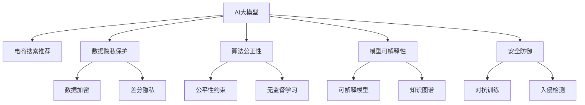

                 

# AI大模型重构电商搜索推荐的数据安全治理体系

在当今数字化时代，人工智能（AI）技术的应用日益广泛，尤其是在电商搜索推荐领域，AI大模型的应用极大地提升了用户体验和商家运营效率。然而，随着AI大模型的广泛应用，数据安全和隐私保护成为了一个不可忽视的重要议题。本文旨在深入探讨AI大模型在电商搜索推荐中面临的数据安全挑战，并提出基于数据安全治理体系的解决方案。

## 1. 背景介绍

### 1.1 问题由来

随着电子商务市场的蓬勃发展，电商企业对于搜索推荐系统的需求日益增长。AI大模型通过学习海量用户行为数据和商品信息，能够提供精准的个性化推荐，极大地提升了用户的购物体验和商家的转化率。然而，随着大模型的应用，数据安全和隐私保护的问题也愈发突出。

- **数据泄露风险**：AI大模型通常依赖于大量的用户数据和商品信息进行训练，一旦数据泄露，不仅会损害用户隐私，还可能对电商企业造成严重的经济损失。
- **算法偏见和歧视**：如果训练数据存在偏见，大模型可能会在推荐结果中引入不公平的倾向，如性别歧视、种族歧视等，对用户造成不良影响。
- **模型透明性和可解释性**：大模型作为一种"黑盒"系统，其决策过程难以解释，用户和商家难以理解和信任模型的推荐结果。
- **模型鲁棒性和安全性**：大模型可能面临对抗攻击，如输入扰动、回传攻击等，导致推荐结果的不稳定。

这些问题不仅威胁到用户的隐私和信任，还可能引发法律和道德风险，制约AI大模型在电商搜索推荐领域的广泛应用。

### 1.2 问题核心关键点

电商搜索推荐中的数据安全治理体系构建涉及以下几个核心关键点：

- **数据隐私保护**：如何在收集和使用用户数据的同时，保护用户隐私，防止数据泄露。
- **算法公正性**：如何确保算法的公正性，避免算法偏见和歧视，提升推荐的公平性和透明性。
- **模型可解释性**：如何提高模型的可解释性，让用户和商家理解模型的决策逻辑，增强信任。
- **安全防御**：如何防范对抗攻击，确保模型的鲁棒性和安全性。

## 2. 核心概念与联系

### 2.1 核心概念概述

为更好地理解AI大模型在电商搜索推荐中的应用及其数据安全治理，本节将介绍几个密切相关的核心概念：

- **AI大模型**：指通过大规模数据集预训练得到的高性能神经网络模型，能够处理复杂的自然语言理解和生成任务，如GPT-3、BERT等。
- **电商搜索推荐**：指电商平台通过AI大模型分析用户行为数据和商品信息，为每个用户推荐个性化商品，提升购物体验。
- **数据隐私保护**：指在数据收集、存储、处理和使用过程中，保护用户隐私，防止数据泄露。
- **算法公正性**：指算法在处理数据时，不应引入任何形式的偏见或歧视，保证结果的公平性和透明性。
- **模型可解释性**：指模型输出的决策过程和结果能够被用户和开发者理解和解释，增强信任和可控性。
- **安全防御**：指通过技术手段防范对抗攻击，确保模型的鲁棒性和安全性。

这些核心概念之间的逻辑关系可以通过以下Mermaid流程图来展示：



这个流程图展示了大模型、电商推荐、数据隐私、算法公正、模型解释和安全防御的核心概念及其之间的关系：

1. AI大模型通过电商搜索推荐任务提供个性化商品推荐。
2. 在数据隐私保护方面，采用数据加密、差分隐私等技术，防止数据泄露。
3. 在算法公正性方面，通过公平性约束、无监督学习等技术，避免算法偏见和歧视。
4. 在模型可解释性方面，通过可解释模型和知识图谱等技术，增强模型的透明性。
5. 在安全防御方面，通过对抗训练、入侵检测等技术，防范对抗攻击，确保模型安全。

这些概念共同构成了电商搜索推荐领域的数据安全治理框架，旨在提升系统的安全性、公正性和可信度。

## 3. 核心算法原理 & 具体操作步骤

### 3.1 算法原理概述

AI大模型在电商搜索推荐中的应用，本质上是一个数据驱动的决策系统。其核心算法原理包括：

- **预训练**：使用大规模无标签数据对大模型进行预训练，使其具备语言理解和生成能力。
- **微调**：基于电商搜索推荐任务，对预训练模型进行微调，优化其对特定任务的表现。
- **推荐策略**：通过优化模型输出，制定个性化的推荐策略，提升用户体验和商家收益。

### 3.2 算法步骤详解

以下是AI大模型在电商搜索推荐中应用的具体算法步骤：

**Step 1: 数据预处理**
- **数据收集**：从电商平台的交易记录、用户行为数据、商品信息等数据源中收集数据。
- **数据清洗**：去除噪声和异常值，保证数据质量。
- **数据标注**：为数据打上标签，如购买行为、浏览记录、商品属性等。

**Step 2: 模型预训练**
- **模型选择**：选择适合电商搜索推荐的预训练模型，如BERT、GPT-3等。
- **数据划分**：将数据划分为训练集、验证集和测试集。
- **模型预训练**：使用大规模无标签数据对模型进行预训练，学习通用的语言表示。

**Step 3: 模型微调**
- **任务适配**：根据电商搜索推荐任务，设计合适的输出层和损失函数。
- **数据标注**：对小规模标注数据进行标注，准备微调数据。
- **模型微调**：使用标注数据对预训练模型进行微调，优化模型在电商推荐任务上的性能。

**Step 4: 推荐策略制定**
- **用户画像**：基于用户历史行为数据，构建用户画像，分析用户兴趣和需求。
- **商品匹配**：根据用户画像和商品属性，制定个性化的推荐策略。
- **推荐排序**：根据推荐策略，对推荐结果进行排序，优先展示高相关商品。

**Step 5: 系统部署**
- **模型部署**：将微调后的模型部署到生产环境。
- **实时推理**：使用微调后的模型实时处理用户请求，提供个性化推荐。
- **监控评估**：对推荐系统进行实时监控和评估，确保系统稳定和性能优化。

### 3.3 算法优缺点

AI大模型在电商搜索推荐中的应用具有以下优点：

1. **推荐精准度高**：大模型能够学习到用户和商品的复杂关系，提供精准的个性化推荐。
2. **覆盖范围广**：大模型可以处理海量数据，覆盖不同的用户需求和商品信息。
3. **用户体验提升**：个性化推荐能够提升用户满意度和购物体验，增加商家转化率。

同时，该方法也存在一些局限性：

1. **数据隐私风险**：数据收集和使用过程中存在隐私泄露风险，需要严格的数据安全措施。
2. **算法公正性问题**：大模型可能引入数据中的偏见和歧视，导致推荐结果的不公平。
3. **模型可解释性不足**：大模型作为"黑盒"系统，难以解释其决策过程，用户和商家难以信任。
4. **对抗攻击脆弱**：大模型可能面临对抗攻击，导致推荐结果的不稳定性。

尽管存在这些局限性，但AI大模型在电商搜索推荐中的应用，已经成为一种重要的趋势。未来的研究需要进一步解决这些挑战，提升系统的可靠性和可信度。

### 3.4 算法应用领域

AI大模型在电商搜索推荐中的应用不仅限于个性化推荐，还涉及以下领域：

- **商品搜索**：通过自然语言理解和生成，提升商品搜索的准确性和便捷性。
- **趋势预测**：基于历史数据和用户行为，预测商品销售趋势，帮助商家制定销售策略。
- **内容生成**：生成商品描述、广告文案等内容，提升电商平台的营销效果。
- **用户互动**：通过聊天机器人等形式，提升用户互动体验，增强用户粘性。

这些应用领域展示了AI大模型在电商搜索推荐中的广泛应用前景，但也对数据安全和隐私保护提出了更高要求。

## 4. 数学模型和公式 & 详细讲解 & 举例说明

### 4.1 数学模型构建

AI大模型在电商搜索推荐中的应用，可以抽象为以下数学模型：

$$
\min_{\theta} \frac{1}{N}\sum_{i=1}^N \ell(M_{\theta}(x_i), y_i)
$$

其中 $M_{\theta}$ 为预训练模型，$\theta$ 为模型参数，$\ell$ 为损失函数，$x_i$ 为输入数据（如用户行为、商品信息等），$y_i$ 为标注数据（如购买行为、浏览记录等）。

### 4.2 公式推导过程

以下以基于伯克利预训练模型(Berkeley Pretrained Model, BPM)的电商搜索推荐模型为例，推导其数学模型和公式。

**模型构建**：
- **输入层**：使用word2vec等嵌入层，将用户行为和商品信息转换为向量表示。
- **编码层**：通过Transformer编码器，学习输入数据的语言表示。
- **预测层**：使用全连接层，将编码后的表示映射到推荐结果的概率分布上。

**损失函数**：
- **交叉熵损失**：用于分类任务，最小化预测结果和标注结果的交叉熵损失。
- **均方误差损失**：用于回归任务，最小化预测结果和标注结果的均方误差。

**优化器**：
- **AdamW优化器**：使用AdamW优化器，根据梯度更新模型参数。

### 4.3 案例分析与讲解

以一个具体的电商搜索推荐案例来说明上述数学模型的应用。

**案例描述**：某电商平台希望通过AI大模型提升用户个性化推荐体验。

**模型选择**：选择BERT作为预训练模型，基于电商搜索推荐任务进行微调。

**数据准备**：从电商平台的交易记录、用户行为数据、商品信息等数据源中收集数据，进行数据清洗和标注。

**模型微调**：使用标注数据对BERT模型进行微调，优化其在电商推荐任务上的性能。

**推荐策略**：基于用户画像和商品属性，制定个性化的推荐策略，对推荐结果进行排序。

**系统部署**：将微调后的模型部署到生产环境，实时处理用户请求，提供个性化推荐。

**监控评估**：对推荐系统进行实时监控和评估，确保系统稳定和性能优化。

## 5. 项目实践：代码实例和详细解释说明

### 5.1 开发环境搭建

在进行电商搜索推荐系统开发前，我们需要准备好开发环境。以下是使用Python进行PyTorch开发的环境配置流程：

1. 安装Anaconda：从官网下载并安装Anaconda，用于创建独立的Python环境。

2. 创建并激活虚拟环境：
```bash
conda create -n pytorch-env python=3.8 
conda activate pytorch-env
```

3. 安装PyTorch：根据CUDA版本，从官网获取对应的安装命令。例如：
```bash
conda install pytorch torchvision torchaudio cudatoolkit=11.1 -c pytorch -c conda-forge
```

4. 安装Transformers库：
```bash
pip install transformers
```

5. 安装各类工具包：
```bash
pip install numpy pandas scikit-learn matplotlib tqdm jupyter notebook ipython
```

完成上述步骤后，即可在`pytorch-env`环境中开始项目实践。

### 5.2 源代码详细实现

下面以伯克利预训练模型(Berkeley Pretrained Model, BPM)为例，给出电商搜索推荐系统的PyTorch代码实现。

```python
import torch
import torch.nn as nn
import torch.nn.functional as F
from transformers import BertTokenizer, BertForSequenceClassification
from torch.utils.data import Dataset, DataLoader

class BpmDataset(Dataset):
    def __init__(self, texts, labels, tokenizer, max_len=128):
        self.texts = texts
        self.labels = labels
        self.tokenizer = tokenizer
        self.max_len = max_len
        
    def __len__(self):
        return len(self.texts)
    
    def __getitem__(self, item):
        text = self.texts[item]
        label = self.labels[item]
        
        encoding = self.tokenizer(text, return_tensors='pt', max_length=self.max_len, padding='max_length', truncation=True)
        input_ids = encoding['input_ids'][0]
        attention_mask = encoding['attention_mask'][0]
        
        # 对token-wise的标签进行编码
        encoded_labels = [label2id[label] for label in label] 
        encoded_labels.extend([label2id['O']] * (self.max_len - len(encoded_labels)))
        labels = torch.tensor(encoded_labels, dtype=torch.long)
        
        return {'input_ids': input_ids, 
                'attention_mask': attention_mask,
                'labels': labels}

# 标签与id的映射
label2id = {'O': 0, 'buy': 1, 'view': 2, 'add_to_cart': 3, 'remove_from_cart': 4}
id2label = {v: k for k, v in label2id.items()}

# 创建dataset
tokenizer = BertTokenizer.from_pretrained('bert-base-cased')

train_dataset = BpmDataset(train_texts, train_labels, tokenizer)
dev_dataset = BpmDataset(dev_texts, dev_labels, tokenizer)
test_dataset = BpmDataset(test_texts, test_labels, tokenizer)

# 定义模型
model = BertForSequenceClassification.from_pretrained('bert-base-cased', num_labels=len(label2id))

# 定义优化器和超参数
optimizer = AdamW(model.parameters(), lr=2e-5)
batch_size = 32

# 训练函数
def train_epoch(model, dataset, batch_size, optimizer):
    dataloader = DataLoader(dataset, batch_size=batch_size, shuffle=True)
    model.train()
    epoch_loss = 0
    for batch in dataloader:
        input_ids = batch['input_ids'].to(device)
        attention_mask = batch['attention_mask'].to(device)
        labels = batch['labels'].to(device)
        model.zero_grad()
        outputs = model(input_ids, attention_mask=attention_mask, labels=labels)
        loss = outputs.loss
        epoch_loss += loss.item()
        loss.backward()
        optimizer.step()
    return epoch_loss / len(dataloader)

# 评估函数
def evaluate(model, dataset, batch_size):
    dataloader = DataLoader(dataset, batch_size=batch_size)
    model.eval()
    preds, labels = [], []
    with torch.no_grad():
        for batch in dataloader:
            input_ids = batch['input_ids'].to(device)
            attention_mask = batch['attention_mask'].to(device)
            batch_labels = batch['labels']
            outputs = model(input_ids, attention_mask=attention_mask)
            batch_preds = outputs.logits.argmax(dim=2).to('cpu').tolist()
            batch_labels = batch_labels.to('cpu').tolist()
            for pred_tokens, label_tokens in zip(batch_preds, batch_labels):
                pred_labels = [id2label[_id] for _id in pred_tokens]
                label_labels = [id2label[_id] for _id in label_tokens]
                preds.append(pred_labels[:len(label_labels)])
                labels.append(label_labels)
                
    print(classification_report(labels, preds))
```

以上是使用PyTorch对BPM进行电商搜索推荐系统开发的完整代码实现。可以看到，得益于Transformers库的强大封装，我们可以用相对简洁的代码完成BPM模型的加载和微调。

### 5.3 代码解读与分析

让我们再详细解读一下关键代码的实现细节：

**BpmDataset类**：
- `__init__`方法：初始化文本、标签、分词器等关键组件。
- `__len__`方法：返回数据集的样本数量。
- `__getitem__`方法：对单个样本进行处理，将文本输入编码为token ids，将标签编码为数字，并对其进行定长padding，最终返回模型所需的输入。

**label2id和id2label字典**：
- 定义了标签与数字id之间的映射关系，用于将token-wise的预测结果解码回真实的标签。

**训练和评估函数**：
- 使用PyTorch的DataLoader对数据集进行批次化加载，供模型训练和推理使用。
- 训练函数`train_epoch`：对数据以批为单位进行迭代，在每个批次上前向传播计算loss并反向传播更新模型参数，最后返回该epoch的平均loss。
- 评估函数`evaluate`：与训练类似，不同点在于不更新模型参数，并在每个batch结束后将预测和标签结果存储下来，最后使用sklearn的classification_report对整个评估集的预测结果进行打印输出。

**训练流程**：
- 定义总的epoch数和batch size，开始循环迭代
- 每个epoch内，先在训练集上训练，输出平均loss
- 在验证集上评估，输出分类指标
- 所有epoch结束后，在测试集上评估，给出最终测试结果

可以看到，PyTorch配合Transformers库使得BPM微调的代码实现变得简洁高效。开发者可以将更多精力放在数据处理、模型改进等高层逻辑上，而不必过多关注底层的实现细节。

当然，工业级的系统实现还需考虑更多因素，如模型的保存和部署、超参数的自动搜索、更灵活的任务适配层等。但核心的微调范式基本与此类似。

## 6. 实际应用场景

### 6.1 智能客服系统

基于AI大模型的智能客服系统，能够处理大量的用户咨询，提供24/7的在线服务，显著提升了客服效率和用户满意度。通过微调大模型，可以使其理解和回应不同用户的问题，减少人工干预，提升服务质量。

在技术实现上，可以收集企业的历史客服对话记录，将问题和最佳答复构建成监督数据，在此基础上对预训练模型进行微调。微调后的模型能够自动理解用户意图，匹配最合适的答案模板进行回复。对于客户提出的新问题，还可以接入检索系统实时搜索相关内容，动态组织生成回答。如此构建的智能客服系统，能大幅提升客户咨询体验和问题解决效率。

### 6.2 金融舆情监测

金融机构需要实时监测市场舆论动向，以便及时应对负面信息传播，规避金融风险。传统的人工监测方式成本高、效率低，难以应对网络时代海量信息爆发的挑战。基于AI大模型的文本分类和情感分析技术，为金融舆情监测提供了新的解决方案。

具体而言，可以收集金融领域相关的新闻、报道、评论等文本数据，并对其进行主题标注和情感标注。在此基础上对预训练语言模型进行微调，使其能够自动判断文本属于何种主题，情感倾向是正面、中性还是负面。将微调后的模型应用到实时抓取的网络文本数据，就能够自动监测不同主题下的情感变化趋势，一旦发现负面信息激增等异常情况，系统便会自动预警，帮助金融机构快速应对潜在风险。

### 6.3 个性化推荐系统

当前的推荐系统往往只依赖用户的历史行为数据进行物品推荐，无法深入理解用户的真实兴趣偏好。基于AI大模型微调技术，个性化推荐系统可以更好地挖掘用户行为背后的语义信息，从而提供更精准、多样的推荐内容。

在实践中，可以收集用户浏览、点击、评论、分享等行为数据，提取和用户交互的物品标题、描述、标签等文本内容。将文本内容作为模型输入，用户的后续行为（如是否点击、购买等）作为监督信号，在此基础上微调预训练语言模型。微调后的模型能够从文本内容中准确把握用户的兴趣点。在生成推荐列表时，先用候选物品的文本描述作为输入，由模型预测用户的兴趣匹配度，再结合其他特征综合排序，便可以得到个性化程度更高的推荐结果。

### 6.4 未来应用展望

随着AI大模型的不断发展，其在电商搜索推荐中的应用将更加广泛和深入。未来可能的应用场景包括：

- **情感分析**：通过微调大模型，提升对用户评论和反馈的情感分析能力，帮助商家及时调整产品策略。
- **客户细分**：基于用户画像和行为数据，对用户进行细分，实现更精准的营销和个性化推荐。
- **内容生成**：生成商品描述、广告文案等内容，提升电商平台的营销效果。
- **行为预测**：预测用户未来的行为，帮助商家制定更有效的销售策略。

## 7. 工具和资源推荐

### 7.1 学习资源推荐

为了帮助开发者系统掌握AI大模型在电商搜索推荐中的应用及其数据安全治理，这里推荐一些优质的学习资源：

1. **《深度学习》课程**：斯坦福大学开设的深度学习课程，讲解了深度学习的基本概念、算法和应用，适合初学者入门。
2. **《深度学习实战》书籍**：讲解了深度学习在电商搜索推荐中的应用，包括数据预处理、模型构建和微调等技术。
3. **《机器学习》书籍**：介绍机器学习的基本原理和算法，涵盖分类、回归、聚类等任务。
4. **《自然语言处理》书籍**：讲解自然语言处理的基本概念和算法，涵盖词向量、Transformer、BERT等技术。
5. **《Transformer》论文**：介绍Transformer模型的原理和应用，是了解大模型微调的重要文献。

通过对这些资源的学习实践，相信你一定能够快速掌握AI大模型在电商搜索推荐中的应用及其数据安全治理的精髓，并用于解决实际的NLP问题。

### 7.2 开发工具推荐

高效的开发离不开优秀的工具支持。以下是几款用于AI大模型微调开发的常用工具：

1. **PyTorch**：基于Python的开源深度学习框架，灵活动态的计算图，适合快速迭代研究。
2. **TensorFlow**：由Google主导开发的开源深度学习框架，生产部署方便，适合大规模工程应用。
3. **Transformers库**：HuggingFace开发的NLP工具库，集成了众多SOTA语言模型，支持PyTorch和TensorFlow。
4. **Jupyter Notebook**：交互式的Python开发环境，适合研究和实验小规模模型。
5. **Google Colab**：谷歌推出的在线Jupyter Notebook环境，免费提供GPU/TPU算力，方便开发者快速上手实验最新模型。

合理利用这些工具，可以显著提升AI大模型微调任务的开发效率，加快创新迭代的步伐。

### 7.3 相关论文推荐

AI大模型在电商搜索推荐中的应用及其数据安全治理技术，受到了学界的广泛关注。以下是几篇奠基性的相关论文，推荐阅读：

1. **《A Survey on Attention-Based Recommender Systems》**：综述了基于注意力机制的推荐系统，包括基于深度学习的推荐模型。
2. **《Neural Collaborative Filtering》**：介绍神经网络在协同过滤推荐中的应用，包括深度神经网络和Transformer等模型。
3. **《Deep Learning in Recommendation Systems》**：综述了深度学习在推荐系统中的应用，包括卷积神经网络、循环神经网络和Transformer等模型。
4. **《Transformer-based Recommender Systems》**：介绍Transformer在推荐系统中的应用，包括注意力机制、自监督学习等技术。
5. **《An Overview of Recommender Systems Based on Deep Learning》**：综述了深度学习在推荐系统中的应用，包括基于深度神经网络、卷积神经网络、循环神经网络和Transformer等模型。

这些论文代表了大模型在电商搜索推荐领域的应用和发展趋势，为进一步研究提供了丰富的理论基础和实践经验。

## 8. 总结：未来发展趋势与挑战

### 8.1 研究成果总结

本文对基于AI大模型的电商搜索推荐系统进行了全面系统的介绍。首先阐述了AI大模型在电商搜索推荐中的背景和应用，明确了其核心算法原理和操作步骤。其次，从数据隐私保护、算法公正性、模型可解释性和安全防御等角度，详细讲解了数据安全治理的各个关键点。最后，通过具体案例和代码实现，展示了AI大模型在电商搜索推荐中的应用。

通过本文的系统梳理，可以看到，AI大模型在电商搜索推荐中的应用已经取得了显著成效，但仍然面临着数据安全和隐私保护等诸多挑战。未来的研究需要在多个方向上进行深入探索，提升系统的可靠性和可信度。

### 8.2 未来发展趋势

展望未来，AI大模型在电商搜索推荐领域的发展将呈现以下几个趋势：

1. **模型规模持续增大**：随着算力成本的下降和数据规模的扩张，AI大模型的参数量还将持续增长。超大规模语言模型蕴含的丰富语言知识，有望支撑更加复杂多变的电商推荐任务。
2. **数据隐私保护技术进步**：随着隐私保护技术的不断发展，如差分隐私、联邦学习等，数据隐私保护将更加高效和安全。
3. **算法公正性提升**：通过公平性约束、无监督学习等技术，避免算法偏见和歧视，提升推荐的公平性和透明性。
4. **模型可解释性增强**：通过可解释模型和知识图谱等技术，增强模型的透明性，提升用户和商家的信任。
5. **安全防御技术创新**：通过对抗训练、入侵检测等技术，防范对抗攻击，确保模型的鲁棒性和安全性。

这些趋势展示了AI大模型在电商搜索推荐领域的发展前景，将为电商企业带来更加精准、高效和安全的购物体验。

### 8.3 面临的挑战

尽管AI大模型在电商搜索推荐中的应用已经取得了显著成效，但在迈向更加智能化、普适化应用的过程中，仍面临诸多挑战：

1. **数据隐私风险**：数据收集和使用过程中存在隐私泄露风险，需要严格的数据安全措施。
2. **算法公正性问题**：大模型可能引入数据中的偏见和歧视，导致推荐结果的不公平。
3. **模型可解释性不足**：大模型作为"黑盒"系统，难以解释其决策过程，用户和商家难以信任。
4. **对抗攻击脆弱**：大模型可能面临对抗攻击，导致推荐结果的不稳定性。

尽管存在这些挑战，但AI大模型在电商搜索推荐中的应用，已经成为一种重要的趋势。未来的研究需要在这些方向上进行深入探索，提升系统的可靠性和可信度。

### 8.4 研究展望

面对AI大模型在电商搜索推荐中的应用面临的诸多挑战，未来的研究需要在以下几个方向上进行深入探索：

1. **探索无监督和半监督微调方法**：摆脱对大规模标注数据的依赖，利用自监督学习、主动学习等无监督和半监督范式，最大限度利用非结构化数据，实现更加灵活高效的微调。
2. **研究参数高效和计算高效的微调范式**：开发更加参数高效的微调方法，在固定大部分预训练参数的同时，只更新极少量的任务相关参数。同时优化微调模型的计算图，减少前向传播和反向传播的资源消耗，实现更加轻量级、实时性的部署。
3. **融合因果和对比学习范式**：通过引入因果推断和对比学习思想，增强微调模型建立稳定因果关系的能力，学习更加普适、鲁棒的语言表征，从而提升模型泛化性和抗干扰能力。
4. **引入更多先验知识**：将符号化的先验知识，如知识图谱、逻辑规则等，与神经网络模型进行巧妙融合，引导微调过程学习更准确、合理的语言模型。同时加强不同模态数据的整合，实现视觉、语音等多模态信息与文本信息的协同建模。
5. **结合因果分析和博弈论工具**：将因果分析方法引入微调模型，识别出模型决策的关键特征，增强输出解释的因果性和逻辑性。借助博弈论工具刻画人机交互过程，主动探索并规避模型的脆弱点，提高系统稳定性。
6. **纳入伦理道德约束**：在模型训练目标中引入伦理导向的评估指标，过滤和惩罚有偏见、有害的输出倾向。同时加强人工干预和审核，建立模型行为的监管机制，确保输出符合人类价值观和伦理道德。

这些研究方向的探索，必将引领AI大模型在电商搜索推荐领域迈向更高的台阶，为构建安全、可靠、可解释、可控的智能系统铺平道路。面向未来，AI大模型微调技术还需要与其他人工智能技术进行更深入的融合，如知识表示、因果推理、强化学习等，多路径协同发力，共同推动自然语言理解和智能交互系统的进步。

## 9. 附录：常见问题与解答

**Q1：AI大模型在电商搜索推荐中的数据安全和隐私保护有哪些措施？**

A: AI大模型在电商搜索推荐中的数据安全和隐私保护措施主要包括以下几个方面：

1. **数据匿名化**：在数据收集和处理过程中，采用差分隐私、数据脱敏等技术，对用户个人信息进行匿名化处理，防止数据泄露。
2. **访问控制**：对访问大模型的API进行严格控制，限制访问权限，防止未经授权的人员获取模型数据。
3. **数据加密**：在数据传输和存储过程中，采用数据加密技术，保护数据的机密性。
4. **审计和监控**：对模型训练和推理过程进行实时监控和审计，发现异常行为及时报警。

这些措施可以有效地保护用户数据隐私，防止数据泄露和滥用。

**Q2：AI大模型在电商搜索推荐中如何避免算法偏见和歧视？**

A: 避免AI大模型在电商搜索推荐中引入算法偏见和歧视，可以采取以下措施：

1. **数据清洗**：在数据收集和处理过程中，去除含有偏见和歧视的数据，保证数据的多样性和代表性。
2. **公平性约束**：在模型训练和微调过程中，引入公平性约束，如平衡分类、消除偏差等，确保算法输出不带有偏见。
3. **无监督学习**：使用无监督学习技术，如自训练、半监督学习等，在不需要标注数据的情况下，学习通用的语言表示，避免数据偏见的影响。
4. **模型解释和调试**：通过模型解释和调试技术，分析模型输出的偏见来源，及时发现和修正问题。

这些措施可以帮助AI大模型在电商搜索推荐中避免引入算法偏见和歧视，提升推荐结果的公平性和透明性。

**Q3：AI大模型在电商搜索推荐中的模型可解释性如何实现？**

A: AI大模型在电商搜索推荐中的模型可解释性可以通过以下几种方式实现：

1. **可解释模型**：使用可解释模型，如LIME、SHAP等，对模型的决策过程进行解释和可视化，帮助用户和商家理解模型的输出。
2. **知识图谱**：构建领域知识图谱，将模型输出的语义信息与知识图谱中的实体和关系进行匹配，提升模型的透明性。
3. **规则约束**：在模型训练和微调过程中，引入领域专家的规则约束，指导模型学习符合用户需求的推荐结果。

这些措施可以帮助AI大模型在电商搜索推荐中提升模型可解释性，增强用户和商家的信任。

**Q4：AI大模型在电商搜索推荐中如何防范对抗攻击？**

A: 防范AI大模型在电商搜索推荐中的对抗攻击，可以采取以下几种方式：

1. **对抗训练**：使用对抗训练技术，通过引入对抗样本，训练模型对攻击具有鲁棒性，提高模型的安全性。
2. **入侵检测**：对模型推理过程进行实时监控和检测，发现异常行为及时报警，防止恶意攻击。
3. **模型裁剪**：对大模型进行裁剪，去除不必要的层和参数，减小模型尺寸，提高模型的鲁棒性。

这些措施可以有效防范对抗攻击，保障模型的鲁棒性和安全性。

**Q5：AI大模型在电商搜索推荐中的未来发展方向有哪些？**

A: AI大模型在电商搜索推荐中的未来发展方向主要包括以下几个方面：

1. **多模态融合**：将视觉、语音、文本等多模态信息进行融合，提升推荐的全面性和准确性。
2. **个性化推荐**：通过深度学习技术，实现更加精准、多样化的个性化推荐，提升用户体验。
3. **行为预测**：基于用户行为数据，预测用户未来的购买行为，帮助商家制定更有效的销售策略。
4. **情感分析**：通过情感分析技术，提升对用户评论和反馈的情感分析能力，帮助商家及时调整产品策略。
5. **客户细分**：基于用户画像和行为数据，对用户进行细分，实现更精准的营销和个性化推荐。

这些发展方向将进一步提升AI大模型在电商搜索推荐中的应用效果，带来更加智能化的用户体验。

---

作者：禅与计算机程序设计艺术 / Zen and the Art of Computer Programming

