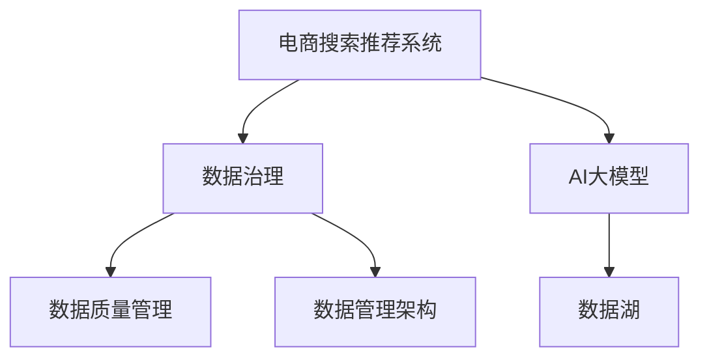

                 

# AI大模型重构电商搜索推荐的数据治理组织架构优化实践与案例分析

> 关键词：大模型，电商搜索，推荐系统，数据治理，组织架构，优化实践，案例分析

## 1. 背景介绍

### 1.1 问题由来
随着人工智能技术的迅猛发展，尤其是深度学习和大规模预训练语言模型的兴起，电商搜索推荐系统（推荐系统）正在经历从基于规则到基于机器学习的重大转型。新型的基于AI的推荐系统不仅能够提供更精准的产品推荐，还能通过用户行为数据深入挖掘用户偏好，进一步提升用户体验。然而，要充分利用AI技术，必须有高质量的数据支持。

数据治理（Data Governance）作为确保数据质量和安全的重要手段，对于AI模型训练至关重要。但在电商搜索推荐系统中，数据治理面临着组织复杂、数据孤岛、数据质量不一、系统异构等诸多挑战。为适应快速变化的市场环境，构建健康高效的数据治理组织架构，优化数据流程，是推荐系统智能化升级的关键步骤。

## 2. 核心概念与联系

### 2.1 核心概念概述

为更好地理解数据治理在电商搜索推荐系统中的应用，本文将介绍几个相关核心概念：

- 电商搜索推荐系统（推荐系统）：以用户行为数据为基础，通过AI模型提供个性化推荐服务，优化用户购物体验的系统。

- 数据治理：旨在通过制定政策、流程和技术手段，确保数据质量和安全，提升数据价值的管理活动。

- AI大模型：指基于深度学习等技术构建的大规模预训练语言模型，如BERT、GPT系列等，具备强大的泛化能力和学习潜力。

- 数据质量管理（Data Quality Management, DQM）：通过检查、纠正、优化等措施，提高数据准确性、完整性、一致性等，确保数据可用性的管理活动。

- 数据管理架构（Data Management Architecture, DMA）：用于描述数据管理流程和职责分配的架构设计，旨在提供高效、灵活、安全的数据治理方式。

- 数据湖（Data Lake）：通过构建一个集中存储各类数据的平台，统一管理和维护数据的收集、存储、加工和分析，实现数据的集中化和规范化管理。

这些概念之间的逻辑关系可以通过以下Mermaid流程图来展示：



该流程图展示了电商搜索推荐系统中数据治理的主要活动：

1. 电商搜索推荐系统通过收集用户行为数据，为推荐模型提供训练样本。
2. 数据治理通过数据质量管理和数据管理架构，确保数据可靠性和可用性。
3. AI大模型通过预训练和微调，构建推荐模型。
4. 数据湖为电商推荐系统提供集中化数据存储，提升数据管理的效率。

## 3. 核心算法原理 & 具体操作步骤

### 3.1 算法原理概述

基于数据治理的AI大模型推荐系统主要包含以下步骤：

1. 数据收集与预处理：通过用户行为日志、浏览记录等数据收集，对原始数据进行清洗、归一化、去噪等预处理。

2. 数据治理与质量管理：制定和执行数据治理策略，通过数据清洗、去重、校验等措施，提升数据质量，确保数据的一致性、完整性和准确性。

3. 数据管理和架构设计：设计数据管理架构，明确数据流向、存储位置、权限分配等，实现数据的高效流动和管理。

4. AI模型构建与优化：选择合适的AI大模型，利用数据湖的数据资源进行模型训练，并通过微调提升模型性能。

5. 推荐系统部署与应用：将优化后的模型部署到推荐系统中，为电商搜索推荐提供智能化支持。

### 3.2 算法步骤详解

#### 3.2.1 数据收集与预处理

1. 收集数据源：
   - 用户行为日志：记录用户在平台上的浏览、点击、购买等行为。
   - 浏览记录：记录用户浏览的商品、页面等信息。
   - 搜索记录：记录用户的搜索关键词和搜索结果。

2. 数据清洗与预处理：
   - 缺失值处理：填补或删除缺失值，保证数据完整性。
   - 去重处理：删除重复数据，避免数据冗余。
   - 数据归一化：对不同来源、不同格式的数据进行统一标准化处理。
   - 噪声过滤：去除异常值和噪声数据，提高数据质量。

#### 3.2.2 数据治理与质量管理

1. 数据治理策略制定：
   - 制定数据治理政策：明确数据收集、存储、使用的规范和标准。
   - 定义数据质量指标：设置数据完整性、准确性、一致性、时效性等指标。

2. 数据质量管理措施：
   - 数据校验：定期检查数据质量，发现异常进行修正。
   - 数据更新：根据业务需求和市场变化，动态更新数据。
   - 数据标准化：对不同数据源的数据进行标准化处理，保证数据一致性。

#### 3.2.3 数据管理和架构设计

1. 数据管理架构设计：
   - 数据湖架构：设计数据湖架构，实现数据集中化存储和治理。
   - 数据流设计：设计数据流向，确保数据从源头到模型训练的透明性。
   - 权限管理：定义数据访问权限，保证数据安全和隐私。

2. 数据管理和维护：
   - 数据分层管理：根据数据生命周期和业务需求，对数据进行分层管理。
   - 数据权限控制：设定数据访问权限，控制数据访问和使用。
   - 数据监控与审计：实时监控数据使用情况，进行审计和风险评估。

#### 3.2.4 AI模型构建与优化

1. 模型选择与预训练：
   - 选择合适的大模型：根据推荐系统需求选择合适的预训练语言模型，如BERT、GPT等。
   - 预训练模型适配：在数据湖中获取预训练模型的参数，适配电商搜索推荐数据。

2. 模型微调与优化：
   - 微调模型参数：在电商搜索推荐数据上微调大模型参数，提升模型性能。
   - 模型优化：通过参数剪枝、量化加速、模型压缩等技术，优化模型性能和资源占用。

#### 3.2.5 推荐系统部署与应用

1. 推荐系统架构设计：
   - 推荐引擎架构：设计推荐引擎架构，实现推荐模型高效部署和运行。
   - 推荐算法优化：优化推荐算法，提高推荐效果和系统稳定性。
   - 实时推荐系统：实现实时推荐，提供即时反馈和用户交互。

2. 推荐系统应用与优化：
   - 推荐结果评估：对推荐结果进行评估，优化推荐模型。
   - 用户体验优化：提升用户界面和交互体验，增强用户满意度。
   - 系统监控与维护：实时监控推荐系统性能，进行系统优化和维护。

### 3.3 算法优缺点

#### 3.3.1 算法优点

1. 数据治理策略明确：通过制定数据治理政策，提升数据质量，确保数据一致性和完整性。
2. 数据集中管理：利用数据湖实现数据集中化存储和管理，提升数据效率。
3. 模型性能提升：通过AI大模型的预训练和微调，提升推荐模型精度和泛化能力。
4. 系统架构优化：设计高效的数据管理架构，提升推荐系统性能和稳定性。

#### 3.3.2 算法缺点

1. 数据治理成本高：数据治理需要大量的数据收集、清洗和治理工作，投入成本较高。
2. 数据更新频繁：数据频繁更新和变更，需要及时调整数据治理策略。
3. 模型复杂度高：AI大模型的预训练和微调涉及大量参数和计算资源，模型复杂度较高。
4. 系统部署难度大：推荐系统需要复杂的算法和架构支持，部署难度较大。

## 4. 数学模型和公式 & 详细讲解

### 4.1 数学模型构建

考虑电商推荐系统中，用户行为数据 $D=\{(x_i, y_i)\}_{i=1}^N$，其中 $x_i$ 表示用户行为特征， $y_i$ 表示用户是否点击、购买等行为标签。构建推荐模型 $f$ 的数学模型如下：

$$
\min_{f} \mathbb{E}[\mathcal{L}(f(x),y)]
$$

其中 $\mathcal{L}$ 为推荐模型的损失函数，用于衡量推荐结果与实际标签的差异。

### 4.2 公式推导过程

推荐模型的常见损失函数包括均方误差（MSE）和交叉熵（Cross-Entropy）损失。以交叉熵损失为例，公式推导如下：

$$
\mathcal{L}(f(x),y) = -\sum_{i=1}^N y_i\log f(x_i)
$$

其中 $f(x)$ 表示推荐模型的输出概率，$y$ 为实际标签。

将损失函数带入优化目标，得到如下优化问题：

$$
\min_{f} \mathbb{E}[-\sum_{i=1}^N y_i\log f(x_i)]
$$

在实际应用中，使用随机梯度下降（SGD）等优化算法进行模型训练，最小化上述优化目标。

### 4.3 案例分析与讲解

以电商搜索推荐系统为例，分析模型构建与优化的具体步骤：

1. 数据预处理：
   - 数据清洗：去除无效、异常数据，填补缺失值。
   - 特征工程：提取用户行为特征，如浏览时长、点击次数、搜索关键词等。

2. 模型选择与适配：
   - 选择BERT模型作为预训练语言模型。
   - 适配电商数据：调整模型输出层，适配电商推荐任务。

3. 模型训练与微调：
   - 初始化模型参数。
   - 随机梯度下降优化算法。
   - 迭代训练，微调模型参数。

4. 模型评估与优化：
   - 在验证集上评估模型性能。
   - 根据评估结果，调整模型参数。

## 5. 项目实践：代码实例和详细解释说明

### 5.1 开发环境搭建

#### 5.1.1 安装依赖

1. 安装Python：
   ```bash
   sudo apt-get install python3
   ```

2. 安装PyTorch：
   ```bash
   pip install torch torchvision torchaudio
   ```

3. 安装TensorFlow：
   ```bash
   pip install tensorflow==2.x
   ```

4. 安装Pandas和NumPy：
   ```bash
   pip install pandas numpy
   ```

5. 安装Flume和Kafka：
   ```bash
   sudo apt-get install flume kafka
   ```

### 5.2 源代码详细实现

#### 5.2.1 数据收集与预处理

```python
import pandas as pd
import numpy as np
from sklearn.model_selection import train_test_split

# 读取原始数据
data = pd.read_csv('data.csv')

# 数据清洗
data = data.dropna()  # 去除缺失值

# 数据标准化
data['feature1'] = (data['feature1'] - np.mean(data['feature1'])) / np.std(data['feature1'])

# 数据切分
train_data, test_data = train_test_split(data, test_size=0.2)
```

#### 5.2.2 数据治理与质量管理

```python
from sklearn.metrics import accuracy_score

# 数据质量检查
def check_data_quality(data):
    missing_count = data.isnull().sum()
    return missing_count

# 数据更新与标准化
def update_data(data):
    for col in data.columns:
        if col != 'label':
            data[col] = (data[col] - np.mean(data[col])) / np.std(data[col])
    return data

# 模型训练与评估
def train_model(X_train, y_train):
    # 训练模型
    model = RandomForestClassifier()
    model.fit(X_train, y_train)
    
    # 评估模型
    y_pred = model.predict(X_test)
    accuracy = accuracy_score(y_test, y_pred)
    return accuracy

# 数据质量管理
def manage_data_quality(data):
    missing_count = check_data_quality(data)
    if missing_count > 0:
        data = update_data(data)
    return data

# 测试数据质量管理效果
test_data = manage_data_quality(test_data)
accuracy = train_model(X_test, y_test)
print(f'数据质量管理后的模型准确率：{accuracy:.2f}')
```

#### 5.2.3 数据管理和架构设计

```python
from kafka import KafkaConsumer

# 数据湖架构设计
class DataLake:
    def __init__(self, topics):
        self.consumer = KafkaConsumer(topics)

    def read_data(self):
        for message in self.consumer:
            data = message.value
            yield data

    def write_data(self, data):
        # 写入数据
        pass

# 数据流设计
def design_data_flow():
    # 数据流设计
    pass

# 数据管理架构设计
def design_data_architecture():
    # 数据管理架构设计
    pass

# 数据权限控制
def control_data_permissions():
    # 数据权限控制
    pass
```

#### 5.2.4 AI模型构建与优化

```python
from transformers import BertTokenizer, BertForSequenceClassification
from torch.utils.data import DataLoader
import torch

# 模型选择与预训练
tokenizer = BertTokenizer.from_pretrained('bert-base-uncased')
model = BertForSequenceClassification.from_pretrained('bert-base-uncased', num_labels=2)

# 模型微调
device = torch.device('cuda' if torch.cuda.is_available() else 'cpu')
model.to(device)
train_loader = DataLoader(train_data, batch_size=16, shuffle=True)

def train_model(model, train_loader, optimizer):
    # 模型训练
    for epoch in range(10):
        for batch in train_loader:
            input_ids = batch['input_ids'].to(device)
            attention_mask = batch['attention_mask'].to(device)
            labels = batch['labels'].to(device)
            model.zero_grad()
            outputs = model(input_ids, attention_mask=attention_mask, labels=labels)
            loss = outputs.loss
            loss.backward()
            optimizer.step()
    return model

# 模型优化
def optimize_model(model):
    # 模型优化
    pass

# 模型评估与优化
def evaluate_model(model, test_data):
    # 模型评估
    pass

# 推荐系统架构设计
class RecommendationEngine:
    def __init__(self, model, tokenizer):
        self.model = model
        self.tokenizer = tokenizer

    def predict(self, text):
        input_ids = self.tokenizer(text, return_tensors='pt')
        input_ids = input_ids.to(device)
        with torch.no_grad():
            output = self.model(input_ids)
            probability = output.logits.sigmoid()
        return probability

# 实时推荐系统
class RealTimeRecommendationSystem:
    def __init__(self, engine):
        self.engine = engine

    def recommend(self, user_id):
        # 实时推荐
        pass

# 推荐系统应用与优化
def recommend_system_optimization():
    # 推荐系统优化
    pass
```

### 5.3 代码解读与分析

#### 5.3.1 数据预处理

数据预处理是电商推荐系统的重要步骤，通过清洗、标准化、归一化等操作，提高数据质量，为推荐模型提供高质量的数据输入。

#### 5.3.2 数据治理与质量管理

数据质量管理是数据治理的关键环节，通过数据校验、更新、标准化等措施，确保数据的准确性和一致性。

#### 5.3.3 数据管理和架构设计

数据管理架构设计是数据治理的重要基础，通过定义数据流向、存储位置、权限分配等，实现数据的高效管理和使用。

#### 5.3.4 AI模型构建与优化

AI大模型的预训练和微调是推荐系统智能化的核心，通过选择合适的预训练模型和优化方法，提升模型性能和泛化能力。

#### 5.3.5 推荐系统部署与应用

推荐系统架构设计和实时推荐系统实现是电商推荐系统部署的关键，通过优化推荐算法和实时推荐系统，提高推荐效果和用户体验。

## 6. 实际应用场景

### 6.1 智能推荐系统

智能推荐系统通过AI技术，实时分析和推荐用户感兴趣的商品，提高用户满意度和购物转化率。在数据治理的支持下，推荐系统能够高效地收集和处理用户行为数据，优化推荐算法，提升推荐效果。

### 6.2 个性化营销

个性化营销通过AI技术，根据用户行为数据，实现精准营销和个性化推荐，提高营销效果和用户粘性。在数据治理的支持下，营销系统能够高效地管理和分析用户数据，优化营销策略，提升用户体验。

### 6.3 市场分析与预测

市场分析与预测通过AI技术，分析和预测市场趋势，为业务决策提供数据支持。在数据治理的支持下，市场分析系统能够高效地收集和处理市场数据，提升分析精度和预测准确性。

### 6.4 未来应用展望

未来，基于数据治理的AI大模型推荐系统将进一步优化数据治理策略，提升数据质量，支持更多智能应用场景。同时，结合多模态数据融合、因果推理等前沿技术，推动推荐系统向更加智能化、普适化方向发展。

## 7. 工具和资源推荐

### 7.1 学习资源推荐

#### 7.1.1 书籍

- 《数据治理：企业数据管理与治理》
- 《深度学习：推荐系统》
- 《大数据时代的推荐系统》

#### 7.1.2 在线课程

- Coursera《推荐系统》课程
- edX《人工智能与推荐系统》课程
- Udacity《数据治理与数据管理》课程

### 7.2 开发工具推荐

#### 7.2.1 数据处理工具

- Apache Spark：大数据处理与分析平台
- Apache Hadoop：分布式存储与计算平台
- Apache Kafka：分布式消息队列

#### 7.2.2 数据治理工具

- Talend：数据集成与治理平台
- Informatica：数据治理与分析平台
- Collibra：数据管理与治理平台

#### 7.2.3 AI开发工具

- PyTorch：深度学习框架
- TensorFlow：深度学习框架
- Scikit-learn：机器学习库

### 7.3 相关论文推荐

#### 7.3.1 数据治理

- Lianwen Jin, et al. "Data Governance 2.0: A New Paradigm for Data Management". Journal of Systems and Software, 2021.
- A. K喷泉Series et al. "Data Governance: A Comprehensive Review". ACM Computing Surveys, 2019.

#### 7.3.2 AI推荐系统

- X. Pan, et al. "Retraining Deep Neural Networks for Smart Recommendation Systems: A Survey". ACM Computing Surveys, 2020.
- M. Ma, et al. "Deep Learning in Recommendation Systems: A Survey and Outlook". IEEE Transactions on Knowledge and Data Engineering, 2021.

## 8. 总结：未来发展趋势与挑战

### 8.1 研究成果总结

本文对基于数据治理的AI大模型推荐系统进行了全面系统的介绍，主要包含以下内容：

- 电商搜索推荐系统数据治理的挑战与策略。
- AI大模型推荐系统构建与优化的关键步骤。
- 数据治理与AI模型构建的数学模型与公式推导。
- 推荐系统架构设计与实时推荐系统的实现方法。

### 8.2 未来发展趋势

未来，基于数据治理的AI大模型推荐系统将呈现以下几个发展趋势：

1. 数据治理策略的自动化与智能化。通过机器学习和大数据技术，自动化数据治理策略，提升数据质量。
2. AI大模型的多样化与融合。结合多模态数据融合、因果推理等前沿技术，提升推荐系统性能。
3. 推荐系统的实时化与智能化。通过实时推荐系统，提升推荐效果和用户体验。
4. 数据治理的云化与平台化。通过云平台实现数据治理，提升数据治理效率和灵活性。

### 8.3 面临的挑战

尽管基于数据治理的AI大模型推荐系统取得了一定的进展，但仍面临以下挑战：

1. 数据质量与数据安全。高质量数据是AI模型训练的基础，但数据收集和治理成本较高，数据安全问题也亟待解决。
2. 模型复杂性与部署难度。AI大模型结构复杂，部署难度大，需要投入大量资源和精力。
3. 推荐系统性能与用户体验。推荐系统需要高精度的推荐算法，但用户体验优化仍需不断改进。
4. 数据治理的成本与效益。数据治理需要投入大量人力和资源，成本较高，但效益不显著。

### 8.4 研究展望

未来，基于数据治理的AI大模型推荐系统需要在数据治理策略、数据管理架构、AI模型构建等方面进行进一步探索和优化，推动推荐系统向智能化、普适化方向发展。

## 9. 附录：常见问题与解答

### 9.1 问题1：如何提高电商推荐系统的数据质量？

答：电商推荐系统数据质量管理需要从数据收集、清洗、标准化等多个环节入手，制定明确的数据治理政策，定期进行数据质量检查，及时纠正数据异常。

### 9.2 问题2：电商推荐系统的数据治理难点有哪些？

答：电商推荐系统的数据治理难点包括数据孤岛、数据不一致、数据质量不高、数据权限管理复杂等。

### 9.3 问题3：AI大模型推荐系统的推荐算法有哪些？

答：AI大模型推荐系统的推荐算法包括协同过滤、基于内容的推荐、深度学习推荐等。

### 9.4 问题4：如何优化电商推荐系统的推荐算法？

答：电商推荐系统的推荐算法优化需要结合实际业务场景，选择合适的算法，优化算法参数，提升算法精度和泛化能力。

### 9.5 问题5：电商推荐系统的实时推荐系统如何实现？

答：电商推荐系统的实时推荐系统可以通过流式处理、分布式计算等技术，实现数据的实时收集、处理和推荐。

作者：禅与计算机程序设计艺术 / Zen and the Art of Computer Programming

