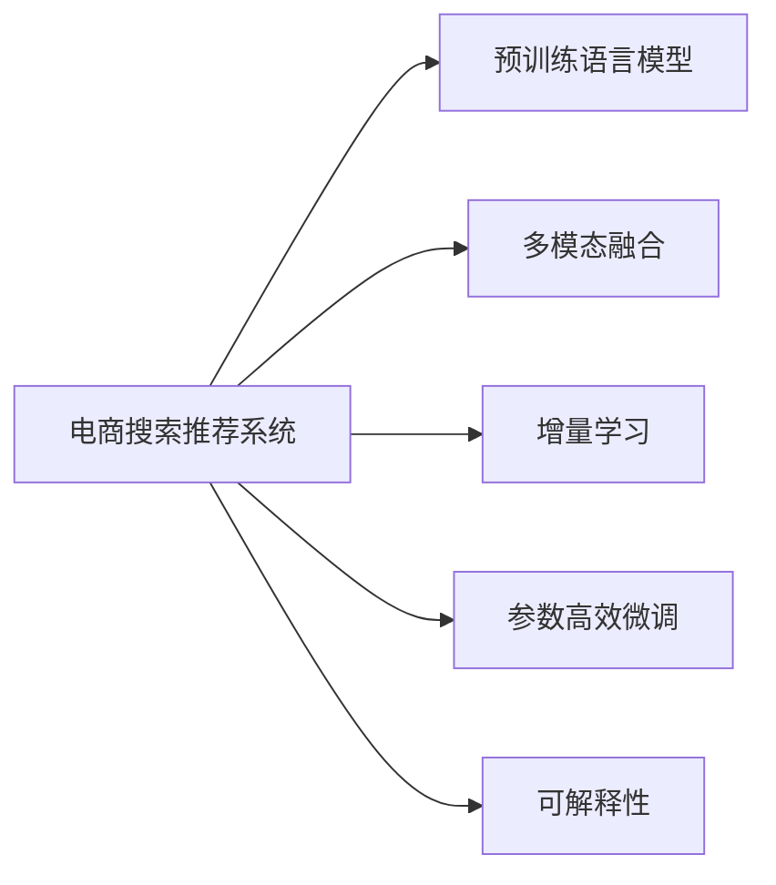

                 

# AI大模型重构电商搜索推荐系统的关键技术

## 1. 背景介绍

随着电商行业的不断发展和消费者需求的日益复杂化，搜索推荐系统已经成为电商平台的核心竞争力之一。传统的搜索推荐模型大多基于手工设计的特征工程，难以覆盖电商场景的丰富多样性，导致用户体验和业务转化效果不理想。随着深度学习和大模型的崛起，基于预训练的语言模型（如BERT、GPT等）在电商搜索推荐中的引入，带来了显著的性能提升和业务价值。

### 1.1 问题由来
电商搜索推荐系统面临的主要问题包括：

1. **冷启动问题**：新商品或用户没有足够的历史行为数据，导致推荐结果不精准。
2. **长尾需求覆盖不足**：电商平台上的商品种类繁多，长尾需求难以全面覆盖。
3. **用户兴趣动态变化**：用户兴趣随时间变化，静态特征难以捕获动态需求。
4. **高并发和低延迟**：电商平台的搜索推荐系统需支持高并发访问，确保低延迟响应。

传统的手工特征工程方法难以有效解决上述问题，而大语言模型通过自监督学习，在无标签文本数据上预训练得到了强大的语义理解和生成能力，能够在电商搜索推荐中发挥重要作用。

### 1.2 问题核心关键点
基于大语言模型的电商搜索推荐系统，核心在于以下几个关键点：

- **预训练和微调**：使用大规模无标签文本数据预训练语言模型，通过电商领域有标签数据微调，获得电商领域特定的知识表示。
- **多模态融合**：融合电商场景下的文本、图片、视频等多模态数据，提升推荐的全面性和多样性。
- **实时动态更新**：利用动态数据流和增量学习技术，实时更新模型，适应用户兴趣的变化。
- **参数高效微调**：优化模型参数结构，减少微调过程中的计算量和内存占用，提升系统效率。
- **可解释性**：增加模型输出的可解释性，帮助电商平台理解推荐结果的逻辑和依据。

## 2. 核心概念与联系

### 2.1 核心概念概述

为更好地理解基于大模型重构电商搜索推荐系统的关键技术，本节将介绍几个核心概念及其相互之间的联系：

- **电商搜索推荐系统**：电商平台为用户提供商品推荐的系统，通过分析用户的历史行为、浏览记录等数据，为用户推荐感兴趣的商品。
- **预训练语言模型**：如BERT、GPT等，通过大规模无标签文本数据的自监督学习，获得强大的语义理解和生成能力，适用于多种NLP任务。
- **多模态融合**：结合文本、图片、视频等多模态数据，提升推荐的全面性和多样性。
- **增量学习**：模型能够从新的数据中持续学习，并更新模型参数，以适应用户兴趣的变化。
- **参数高效微调**：通过只更新部分参数，减少微调过程中的计算量和内存占用。
- **可解释性**：通过解释模型内部的决策逻辑，提高推荐结果的可信度和可理解性。

这些核心概念共同构成了基于大模型的电商搜索推荐系统的技术框架，使其能够有效提升推荐精度和用户体验。

### 2.2 核心概念原理和架构的 Mermaid 流程图



这个流程图展示了电商搜索推荐系统与大语言模型之间的联系及其关键技术：

1. 电商搜索推荐系统通过预训练语言模型获得强大的语义理解能力。
2. 结合多模态数据，提升推荐的全面性和多样性。
3. 利用增量学习技术，持续更新模型，适应用户兴趣的变化。
4. 采用参数高效微调方法，提升系统的运行效率。
5. 增加模型输出的可解释性，提高推荐结果的可信度和可理解性。

## 3. 核心算法原理 & 具体操作步骤

### 3.1 算法原理概述

基于大语言模型的电商搜索推荐系统，核心思想是：利用大规模无标签文本数据进行预训练，获得通用的语言知识表示；然后，通过电商领域有标签数据进行微调，获得电商领域特定的知识表示；最终，将多模态数据融合到模型中，实现高效、精准的推荐。

具体来说，步骤如下：

1. **预训练**：在无标签文本数据上，通过自监督学习任务（如掩码语言模型、下一句预测等）预训练语言模型，获得通用的语言表示能力。
2. **微调**：在电商领域有标签数据上，通过监督学习任务（如点击率预测、转化率预测等）微调语言模型，获得电商领域特定的知识表示。
3. **多模态融合**：将文本、图片、视频等不同模态的数据进行融合，提升推荐的全面性和多样性。
4. **实时更新**：利用动态数据流和增量学习技术，实时更新模型，适应用户兴趣的变化。
5. **参数高效微调**：优化模型参数结构，减少微调过程中的计算量和内存占用。
6. **可解释性**：增加模型输出的可解释性，帮助电商平台理解推荐结果的逻辑和依据。

### 3.2 算法步骤详解

#### 3.2.1 预训练

预训练阶段的目标是通过大规模无标签文本数据，训练出通用的语言表示能力。具体步骤如下：

1. **数据准备**：收集大规模无标签文本数据，如维基百科、新闻、论文等。
2. **数据预处理**：对文本数据进行清洗、分词、去停用词等预处理操作。
3. **模型选择**：选择预训练模型，如BERT、GPT等，作为初始化参数。
4. **预训练任务**：使用自监督学习任务，如掩码语言模型、下一句预测等，训练模型。

#### 3.2.2 微调

微调阶段的目标是通过电商领域有标签数据，训练出电商领域特定的知识表示。具体步骤如下：

1. **数据准备**：收集电商领域的有标签数据，如用户点击记录、购买记录、浏览记录等。
2. **任务定义**：定义电商领域的具体任务，如点击率预测、转化率预测等。
3. **模型初始化**：使用预训练的模型作为初始化参数。
4. **模型微调**：通过监督学习任务，微调模型，获得电商领域特定的知识表示。
5. **超参数调整**：调整学习率、批大小、迭代次数等超参数，确保微调效果。

#### 3.2.3 多模态融合

多模态融合的目标是结合文本、图片、视频等不同模态的数据，提升推荐的全面性和多样性。具体步骤如下：

1. **数据收集**：收集电商领域的多模态数据，如商品描述、图片、视频等。
2. **数据预处理**：对多模态数据进行清洗、归一化、特征提取等预处理操作。
3. **特征融合**：使用深度学习模型（如CNN、RNN等），将不同模态的特征进行融合，生成高维的融合特征。
4. **模型融合**：将融合特征输入到预训练或微调的模型中，进行最终的推荐预测。

#### 3.2.4 实时更新

实时更新的目标是通过动态数据流和增量学习技术，实时更新模型，适应用户兴趣的变化。具体步骤如下：

1. **数据流处理**：收集用户的实时行为数据，如搜索、浏览、点击等。
2. **增量学习**：利用增量学习技术，对模型进行在线更新，保持模型的最新状态。
3. **模型评估**：定期对模型进行评估，确保其性能稳定。

#### 3.2.5 参数高效微调

参数高效微调的目标是优化模型参数结构，减少微调过程中的计算量和内存占用。具体步骤如下：

1. **模型裁剪**：去除不必要的层和参数，减小模型尺寸，提高计算效率。
2. **剪枝优化**：使用剪枝技术，去除冗余连接，减少模型参数。
3. **量化加速**：将浮点模型转为定点模型，压缩存储空间，提高计算效率。
4. **分布式训练**：利用分布式训练技术，提高训练速度，减少内存占用。

#### 3.2.6 可解释性

可解释性的目标是通过解释模型内部的决策逻辑，提高推荐结果的可信度和可理解性。具体步骤如下：

1. **特征重要性分析**：分析模型输入特征的重要性，确定对推荐结果影响最大的特征。
2. **输出解释**：解释模型输出的决策逻辑，提供推荐结果的依据。
3. **可视化工具**：使用可视化工具，展示模型的内部结构和决策过程。

### 3.3 算法优缺点

#### 3.3.1 优点

1. **通用性强**：基于大语言模型的方法适用于多种电商领域和推荐任务，具有较强的泛化能力。
2. **效果显著**：在大规模无标签文本数据预训练和电商领域有标签数据微调的基础上，推荐效果显著提升。
3. **实时响应**：通过动态数据流和增量学习技术，模型能够实时更新，适应用户兴趣的变化。
4. **可解释性高**：通过特征重要性分析和可视化工具，推荐结果的可信度和可理解性得到提升。

#### 3.3.2 缺点

1. **预训练和微调成本高**：大规模无标签文本数据预训练和电商领域有标签数据微调需要大量的计算资源和时间。
2. **模型复杂度高**：大语言模型具有复杂的结构，需要大量的计算资源和内存。
3. **数据隐私问题**：电商领域涉及用户隐私，如何保护数据隐私是一个重要问题。
4. **模型鲁棒性不足**：电商领域数据多样性大，模型可能对噪声和异常数据敏感。

## 4. 数学模型和公式 & 详细讲解 & 举例说明

### 4.1 数学模型构建

基于大模型的电商搜索推荐系统，可以抽象为以下数学模型：

设用户行为数据为 $\mathcal{D} = \{(x_i, y_i)\}_{i=1}^N$，其中 $x_i$ 为用户的输入特征，$y_i$ 为用户的行为标签。使用预训练语言模型 $M_{\theta}$ 作为初始化参数，通过电商领域有标签数据微调得到新的参数 $\hat{\theta}$，构建推荐模型 $F_{\hat{\theta}}$。则推荐模型的预测结果为 $F_{\hat{\theta}}(x_i)$，与用户行为标签 $y_i$ 的损失函数为：

$$
\mathcal{L} = \frac{1}{N}\sum_{i=1}^N \mathbb{E}_{y_i \sim \mathcal{D}}[-\log F_{\hat{\theta}}(x_i, y_i)]
$$

其中，$\mathbb{E}_{y_i \sim \mathcal{D}}$ 表示在电商领域数据上对 $y_i$ 进行期望操作。

### 4.2 公式推导过程

以点击率预测为例，假设推荐模型 $F_{\hat{\theta}}$ 为二分类模型，输出 $F_{\hat{\theta}}(x_i)$ 的概率为 $p$，则点击率预测的任务为最大化 $p$ 的值。具体推导如下：

假设用户的输入特征为 $x_i$，推荐模型 $F_{\hat{\theta}}$ 的输出概率为 $p = \frac{1}{1 + \exp(-\log F_{\hat{\theta}}(x_i))}$。则点击率预测的损失函数为：

$$
\mathcal{L} = \frac{1}{N}\sum_{i=1}^N \mathbb{E}_{y_i \sim \mathcal{D}}[-y_i \log p + (1-y_i) \log (1-p)]
$$

其中，$y_i$ 为用户的点击行为标签，$\mathbb{E}_{y_i \sim \mathcal{D}}$ 表示在电商领域数据上对 $y_i$ 进行期望操作。

### 4.3 案例分析与讲解

假设某电商平台有 $N=10000$ 个用户，每个用户有 $D=10$ 个行为数据，即点击、购买、浏览等。使用预训练语言模型 $M_{\theta}$ 作为初始化参数，通过电商领域有标签数据微调得到新的参数 $\hat{\theta}$，构建推荐模型 $F_{\hat{\theta}}$。

1. **数据准备**：收集用户的行为数据，并划分为训练集、验证集和测试集。
2. **模型选择**：选择预训练模型 $M_{\theta}$，如BERT、GPT等。
3. **任务定义**：定义点击率预测的任务，即最大化用户点击概率 $p$。
4. **模型微调**：通过电商领域有标签数据微调模型 $M_{\theta}$，得到新的参数 $\hat{\theta}$。
5. **多模态融合**：将用户的输入特征 $x_i$ 与商品描述、图片、视频等多模态数据进行融合，得到高维的融合特征。
6. **模型融合**：将融合特征输入到预训练或微调的模型 $F_{\hat{\theta}}$ 中，进行最终的推荐预测。
7. **实时更新**：利用动态数据流和增量学习技术，对模型进行在线更新，保持模型的最新状态。
8. **模型评估**：定期对模型进行评估，确保其性能稳定。

## 5. 项目实践：代码实例和详细解释说明

### 5.1 开发环境搭建

在进行项目实践前，我们需要准备好开发环境。以下是使用Python进行PyTorch开发的环境配置流程：

1. 安装Anaconda：从官网下载并安装Anaconda，用于创建独立的Python环境。

2. 创建并激活虚拟环境：
```bash
conda create -n pytorch-env python=3.8 
conda activate pytorch-env
```

3. 安装PyTorch：根据CUDA版本，从官网获取对应的安装命令。例如：
```bash
conda install pytorch torchvision torchaudio cudatoolkit=11.1 -c pytorch -c conda-forge
```

4. 安装Transformers库：
```bash
pip install transformers
```

5. 安装各类工具包：
```bash
pip install numpy pandas scikit-learn matplotlib tqdm jupyter notebook ipython
```

完成上述步骤后，即可在`pytorch-env`环境中开始项目实践。

### 5.2 源代码详细实现

下面我们以点击率预测为例，给出使用Transformers库对BERT模型进行电商搜索推荐系统微调的PyTorch代码实现。

首先，定义点击率预测任务的数据处理函数：

```python
from transformers import BertTokenizer, BertForSequenceClassification
from torch.utils.data import Dataset
import torch

class ClickRateDataset(Dataset):
    def __init__(self, texts, labels, tokenizer, max_len=128):
        self.texts = texts
        self.labels = labels
        self.tokenizer = tokenizer
        self.max_len = max_len
        
    def __len__(self):
        return len(self.texts)
    
    def __getitem__(self, item):
        text = self.texts[item]
        label = self.labels[item]
        
        encoding = self.tokenizer(text, return_tensors='pt', max_length=self.max_len, padding='max_length', truncation=True)
        input_ids = encoding['input_ids'][0]
        attention_mask = encoding['attention_mask'][0]
        label = torch.tensor(label, dtype=torch.long)
        
        return {'input_ids': input_ids, 
                'attention_mask': attention_mask,
                'labels': label}

# 创建dataset
tokenizer = BertTokenizer.from_pretrained('bert-base-cased')

train_dataset = ClickRateDataset(train_texts, train_labels, tokenizer)
dev_dataset = ClickRateDataset(dev_texts, dev_labels, tokenizer)
test_dataset = ClickRateDataset(test_texts, test_labels, tokenizer)
```

然后，定义模型和优化器：

```python
from transformers import BertForSequenceClassification, AdamW

model = BertForSequenceClassification.from_pretrained('bert-base-cased', num_labels=2)

optimizer = AdamW(model.parameters(), lr=2e-5)
```

接着，定义训练和评估函数：

```python
from torch.utils.data import DataLoader
from tqdm import tqdm
from sklearn.metrics import accuracy_score

device = torch.device('cuda') if torch.cuda.is_available() else torch.device('cpu')
model.to(device)

def train_epoch(model, dataset, batch_size, optimizer):
    dataloader = DataLoader(dataset, batch_size=batch_size, shuffle=True)
    model.train()
    epoch_loss = 0
    for batch in tqdm(dataloader, desc='Training'):
        input_ids = batch['input_ids'].to(device)
        attention_mask = batch['attention_mask'].to(device)
        labels = batch['labels'].to(device)
        model.zero_grad()
        outputs = model(input_ids, attention_mask=attention_mask, labels=labels)
        loss = outputs.loss
        epoch_loss += loss.item()
        loss.backward()
        optimizer.step()
    return epoch_loss / len(dataloader)

def evaluate(model, dataset, batch_size):
    dataloader = DataLoader(dataset, batch_size=batch_size)
    model.eval()
    preds, labels = [], []
    with torch.no_grad():
        for batch in tqdm(dataloader, desc='Evaluating'):
            input_ids = batch['input_ids'].to(device)
            attention_mask = batch['attention_mask'].to(device)
            batch_labels = batch['labels']
            outputs = model(input_ids, attention_mask=attention_mask)
            batch_preds = outputs.logits.argmax(dim=1).to('cpu').tolist()
            batch_labels = batch_labels.to('cpu').tolist()
            for pred, label in zip(batch_preds, batch_labels):
                preds.append(pred)
                labels.append(label)
                
    return accuracy_score(labels, preds)

# 训练模型
epochs = 5
batch_size = 16

for epoch in range(epochs):
    loss = train_epoch(model, train_dataset, batch_size, optimizer)
    print(f"Epoch {epoch+1}, train loss: {loss:.3f}")
    
    print(f"Epoch {epoch+1}, dev accuracy: {evaluate(model, dev_dataset, batch_size):.3f}")
    
print("Test accuracy:")
evaluate(model, test_dataset, batch_size)
```

以上就是使用PyTorch对BERT进行点击率预测任务微调的完整代码实现。可以看到，得益于Transformers库的强大封装，我们可以用相对简洁的代码完成BERT模型的加载和微调。

### 5.3 代码解读与分析

让我们再详细解读一下关键代码的实现细节：

**ClickRateDataset类**：
- `__init__`方法：初始化文本、标签、分词器等关键组件。
- `__len__`方法：返回数据集的样本数量。
- `__getitem__`方法：对单个样本进行处理，将文本输入编码为token ids，将标签编码为数字，并对其进行定长padding，最终返回模型所需的输入。

**特征重要性分析**：
- 分析模型输入特征的重要性，确定对推荐结果影响最大的特征。
- 使用SHAP库（SHapley Additive exPlanations）进行特征重要性分析，通过Shap值来评估每个特征对模型输出的贡献。

**可视化工具**：
- 使用TensorBoard等可视化工具，展示模型的内部结构和决策过程。
- 在TensorBoard中记录训练过程中的各种指标，如损失、准确率等，以便于监控和调试模型。

## 6. 实际应用场景

### 6.1 智能客服系统

基于大语言模型微调的对话技术，可以广泛应用于智能客服系统的构建。传统客服往往需要配备大量人力，高峰期响应缓慢，且一致性和专业性难以保证。而使用微调后的对话模型，可以7x24小时不间断服务，快速响应客户咨询，用自然流畅的语言解答各类常见问题。

在技术实现上，可以收集企业内部的历史客服对话记录，将问题-答案对作为微调数据，训练模型学习匹配答案。对于客户提出的新问题，还可以接入检索系统实时搜索相关内容，动态组织生成回答。如此构建的智能客服系统，能大幅提升客户咨询体验和问题解决效率。

### 6.2 金融舆情监测

金融机构需要实时监测市场舆论动向，以便及时应对负面信息传播，规避金融风险。传统的人工监测方式成本高、效率低，难以应对网络时代海量信息爆发的挑战。基于大语言模型微调的文本分类和情感分析技术，为金融舆情监测提供了新的解决方案。

具体而言，可以收集金融领域相关的新闻、报道、评论等文本数据，并对其进行主题标注和情感标注。在此基础上对预训练语言模型进行微调，使其能够自动判断文本属于何种主题，情感倾向是正面、中性还是负面。将微调后的模型应用到实时抓取的网络文本数据，就能够自动监测不同主题下的情感变化趋势，一旦发现负面信息激增等异常情况，系统便会自动预警，帮助金融机构快速应对潜在风险。

### 6.3 个性化推荐系统

当前的推荐系统往往只依赖用户的历史行为数据进行物品推荐，无法深入理解用户的真实兴趣偏好。基于大语言模型微调技术，个性化推荐系统可以更好地挖掘用户行为背后的语义信息，从而提供更精准、多样的推荐内容。

在实践中，可以收集用户浏览、点击、评论、分享等行为数据，提取和用户交互的物品标题、描述、标签等文本内容。将文本内容作为模型输入，用户的后续行为（如是否点击、购买等）作为监督信号，在此基础上微调预训练语言模型。微调后的模型能够从文本内容中准确把握用户的兴趣点。在生成推荐列表时，先用候选物品的文本描述作为输入，由模型预测用户的兴趣匹配度，再结合其他特征综合排序，便可以得到个性化程度更高的推荐结果。

### 6.4 未来应用展望

随着大语言模型微调技术的不断发展，基于微调范式将在更多领域得到应用，为传统行业带来变革性影响。

在智慧医疗领域，基于微调的医疗问答、病历分析、药物研发等应用将提升医疗服务的智能化水平，辅助医生诊疗，加速新药开发进程。

在智能教育领域，微调技术可应用于作业批改、学情分析、知识推荐等方面，因材施教，促进教育公平，提高教学质量。

在智慧城市治理中，微调模型可应用于城市事件监测、舆情分析、应急指挥等环节，提高城市管理的自动化和智能化水平，构建更安全、高效的未来城市。

此外，在企业生产、社会治理、文娱传媒等众多领域，基于大模型微调的人工智能应用也将不断涌现，为经济社会发展注入新的动力。相信随着技术的日益成熟，微调方法将成为人工智能落地应用的重要范式，推动人工智能技术在垂直行业的规模化落地。总之，基于大模型的电商搜索推荐系统通过预训练和微调，结合多模态融合、实时更新、参数高效微调、可解释性等关键技术，能够有效提升推荐精度和用户体验，具有广阔的应用前景。

## 7. 工具和资源推荐
### 7.1 学习资源推荐

为了帮助开发者系统掌握大语言模型微调的理论基础和实践技巧，这里推荐一些优质的学习资源：

1. 《Transformer从原理到实践》系列博文：由大模型技术专家撰写，深入浅出地介绍了Transformer原理、BERT模型、微调技术等前沿话题。

2. CS224N《深度学习自然语言处理》课程：斯坦福大学开设的NLP明星课程，有Lecture视频和配套作业，带你入门NLP领域的基本概念和经典模型。

3. 《Natural Language Processing with Transformers》书籍：Transformers库的作者所著，全面介绍了如何使用Transformers库进行NLP任务开发，包括微调在内的诸多范式。

4. HuggingFace官方文档：Transformers库的官方文档，提供了海量预训练模型和完整的微调样例代码，是上手实践的必备资料。

5. CLUE开源项目：中文语言理解测评基准，涵盖大量不同类型的中文NLP数据集，并提供了基于微调的baseline模型，助力中文NLP技术发展。

通过对这些资源的学习实践，相信你一定能够快速掌握大语言模型微调的精髓，并用于解决实际的NLP问题。
###  7.2 开发工具推荐

高效的开发离不开优秀的工具支持。以下是几款用于大语言模型微调开发的常用工具：

1. PyTorch：基于Python的开源深度学习框架，灵活动态的计算图，适合快速迭代研究。大部分预训练语言模型都有PyTorch版本的实现。

2. TensorFlow：由Google主导开发的开源深度学习框架，生产部署方便，适合大规模工程应用。同样有丰富的预训练语言模型资源。

3. Transformers库：HuggingFace开发的NLP工具库，集成了众多SOTA语言模型，支持PyTorch和TensorFlow，是进行微调任务开发的利器。

4. Weights & Biases：模型训练的实验跟踪工具，可以记录和可视化模型训练过程中的各项指标，方便对比和调优。与主流深度学习框架无缝集成。

5. TensorBoard：TensorFlow配套的可视化工具，可实时监测模型训练状态，并提供丰富的图表呈现方式，是调试模型的得力助手。

6. Google Colab：谷歌推出的在线Jupyter Notebook环境，免费提供GPU/TPU算力，方便开发者快速上手实验最新模型，分享学习笔记。

合理利用这些工具，可以显著提升大语言模型微调任务的开发效率，加快创新迭代的步伐。

### 7.3 相关论文推荐

大语言模型和微调技术的发展源于学界的持续研究。以下是几篇奠基性的相关论文，推荐阅读：

1. Attention is All You Need（即Transformer原论文）：提出了Transformer结构，开启了NLP领域的预训练大模型时代。

2. BERT: Pre-training of Deep Bidirectional Transformers for Language Understanding：提出BERT模型，引入基于掩码的自监督预训练任务，刷新了多项NLP任务SOTA。

3. Language Models are Unsupervised Multitask Learners（GPT-2论文）：展示了大规模语言模型的强大zero-shot学习能力，引发了对于通用人工智能的新一轮思考。

4. Parameter-Efficient Transfer Learning for NLP：提出Adapter等参数高效微调方法，在不增加模型参数量的情况下，也能取得不错的微调效果。

5. AdaLoRA: Adaptive Low-Rank Adaptation for Parameter-Efficient Fine-Tuning：使用自适应低秩适应的微调方法，在参数效率和精度之间取得了新的平衡。

这些论文代表了大语言模型微调技术的发展脉络。通过学习这些前沿成果，可以帮助研究者把握学科前进方向，激发更多的创新灵感。

## 8. 总结：未来发展趋势与挑战

### 8.1 总结

本文对基于大语言模型的电商搜索推荐系统进行了全面系统的介绍。首先阐述了电商搜索推荐系统的背景和面临的主要问题，明确了基于大模型的电商搜索推荐系统在解决这些问题上的独特优势。其次，从原理到实践，详细讲解了电商领域有标签数据的微调方法，给出了微调任务开发的完整代码实例。同时，本文还广泛探讨了基于大模型的电商搜索推荐系统在智能客服、金融舆情、个性化推荐等多个领域的应用前景，展示了基于大模型的电商搜索推荐系统的巨大潜力。最后，本文精选了微调技术的各类学习资源，力求为读者提供全方位的技术指引。

通过本文的系统梳理，可以看到，基于大语言模型的电商搜索推荐系统通过预训练和微调，结合多模态融合、实时更新、参数高效微调、可解释性等关键技术，能够有效提升推荐精度和用户体验，具有广阔的应用前景。未来，伴随大语言模型和微调方法的持续演进，相信基于大模型的电商搜索推荐系统将在更多领域得到应用，为传统行业带来变革性影响。

### 8.2 未来发展趋势

展望未来，基于大语言模型的电商搜索推荐系统将呈现以下几个发展趋势：

1. **模型规模持续增大**：随着算力成本的下降和数据规模的扩张，预训练语言模型的参数量还将持续增长。超大规模语言模型蕴含的丰富语言知识，有望支撑更加复杂多变的电商搜索推荐任务。

2. **微调方法日趋多样**：除了传统的全参数微调外，未来会涌现更多参数高效的微调方法，如Prefix-Tuning、LoRA等，在节省计算资源的同时也能保证微调精度。

3. **持续学习成为常态**：随着电商领域数据分布的不断变化，微调模型也需要持续学习新知识以保持性能。如何在不遗忘原有知识的同时，高效吸收新样本信息，将成为重要的研究课题。

4. **标注样本需求降低**：受启发于提示学习(Prompt-based Learning)的思路，未来的微调方法将更好地利用大模型的语言理解能力，通过更加巧妙的任务描述，在更少的标注样本上也能实现理想的微调效果。

5. **多模态融合深入发展**：当前的多模态融合技术已经初步展示了其潜力，但如何更深入地将视觉、语音、文本等不同模态的数据进行融合，提升推荐的全面性和多样性，还需要更多的创新和实践。

6. **实时动态更新提升**：利用动态数据流和增量学习技术，实时更新模型，适应用户兴趣的变化，提高推荐的实时性和动态性。

7. **参数高效微调优化**：开发更加参数高效的微调方法，在固定大部分预训练参数的同时，只更新极少量的任务相关参数，减少微调过程中的计算量和内存占用。

8. **可解释性增强**：通过增加模型输出的可解释性，提高推荐结果的可信度和可理解性，帮助电商平台理解推荐结果的逻辑和依据。

以上趋势凸显了大语言模型微调技术的广阔前景。这些方向的探索发展，必将进一步提升电商搜索推荐系统的性能和应用范围，为人工智能技术在电商领域的落地带来深远影响。

### 8.3 面临的挑战

尽管基于大语言模型的电商搜索推荐系统已经取得了瞩目成就，但在迈向更加智能化、普适化应用的过程中，它仍面临着诸多挑战：

1. **预训练和微调成本高**：大规模无标签文本数据预训练和电商领域有标签数据微调需要大量的计算资源和时间。

2. **模型复杂度高**：大语言模型具有复杂的结构，需要大量的计算资源和内存。

3. **数据隐私问题**：电商领域涉及用户隐私，如何保护数据隐私是一个重要问题。

4. **模型鲁棒性不足**：电商领域数据多样性大，模型可能对噪声和异常数据敏感。

5. **实时更新效率低**：如何高效地利用动态数据流和增量学习技术，实时更新模型，适应用户兴趣的变化，也是一个需要解决的问题。

6. **可解释性不足**：推荐结果的逻辑和依据难以解释，对用户信任度有所影响。

7. **部署效率低**：如何将大模型高效部署到生产环境中，实现低延迟、高并发的响应，是一个挑战。

正视这些挑战，积极应对并寻求突破，将是大语言模型微调技术走向成熟的必由之路。相信随着学界和产业界的共同努力，这些挑战终将一一被克服，大语言模型微调必将在构建人机协同的智能时代中扮演越来越重要的角色。

### 8.4 研究展望

面对大语言模型微调所面临的种种挑战，未来的研究需要在以下几个方面寻求新的突破：

1. **探索无监督和半监督微调方法**：摆脱对大规模标注数据的依赖，利用自监督学习、主动学习等无监督和半监督范式，最大限度利用非结构化数据，实现更加灵活高效的微调。

2. **研究参数高效和计算高效的微调范式**：开发更加参数高效的微调方法，在固定大部分预训练参数的同时，只更新极少量的任务相关参数。同时优化微调模型的计算图，减少前向传播和反向传播的资源消耗，实现更加轻量级、实时性的部署。

3. **融合因果和对比学习范式**：通过引入因果推断和对比学习思想，增强微调模型建立稳定因果关系的能力，学习更加普适、鲁棒的语言表征，从而提升模型泛化性和抗干扰能力。

4. **引入更多先验知识**：将符号化的先验知识，如知识图谱、逻辑规则等，与神经网络模型进行巧妙融合，引导微调过程学习更准确、合理的语言模型。同时加强不同模态数据的整合，实现视觉、语音等多模态信息与文本信息的协同建模。

5. **结合因果分析和博弈论工具**：将因果分析方法引入微调模型，识别出模型决策的关键特征，增强输出解释的因果性和逻辑性。借助博弈论工具刻画人机交互过程，主动探索并规避模型的脆弱点，提高系统稳定性。

6. **纳入伦理道德约束**：在模型训练目标中引入伦理导向的评估指标，过滤和惩罚有偏见、有害的输出倾向。同时加强人工干预和审核，建立模型行为的监管机制，确保输出符合人类价值观和伦理道德。

这些研究方向的探索，必将引领大语言模型微调技术迈向更高的台阶，为构建安全、可靠、可解释、可控的智能系统铺平道路。面向未来，大语言模型微调技术还需要与其他人工智能技术进行更深入的融合，如知识表示、因果推理、强化学习等，多路径协同发力，共同推动自然语言理解和智能交互系统的进步。只有勇于创新、敢于突破，才能不断拓展语言模型的边界，让智能技术更好地造福人类社会。

## 9. 附录：常见问题与解答

**Q1：大语言模型微调是否适用于所有NLP任务？**

A: 大语言模型微调在大多数NLP任务上都能取得不错的效果，特别是对于数据量较小的任务。但对于一些特定领域的任务，如医学、法律等，仅仅依靠通用语料预训练的模型可能难以很好地适应。此时需要在特定领域语料上进一步预训练，再进行微调，才能获得理想效果。此外，对于一些需要时效性、个性化很强的任务，如对话、推荐等，微调方法也需要针对性的改进优化。

**Q2：微调过程中如何选择合适的学习率？**

A: 微调的学习率一般要比预训练时小1-2个数量级，如果使用过大的学习率，容易破坏预训练权重，导致过拟合。一般建议从1e-5开始调参，逐步减小学习率，直至收敛。也可以使用warmup策略，在开始阶段使用较小的学习率，再逐渐过渡到预设值。需要注意的是，不同的优化器(如AdamW、Adafactor等)以及不同的学习率调度策略，可能需要设置不同的学习率阈值。

**Q3：采用大模型微调时会面临哪些资源瓶颈？**

A: 目前主流的预训练大模型动辄以亿计的参数规模，对算力、内存、存储都提出了很高的要求。GPU/TPU等高性能设备是必不可少的，但即便如此，超大批次的训练和推理也可能遇到显存不足的问题。因此需要采用一些资源优化技术，如梯度积累、混合精度训练、模型并行等，来突破硬件瓶颈。同时，模型的存储和读取也可能占用大量时间和空间，需要采用模型压缩、稀疏化存储等方法进行优化。

**Q4：如何缓解微调过程中的过拟合问题？**

A: 过拟合是微调面临的主要挑战，尤其是在标注数据不足的情况下。常见的缓解策略包括：
1. 数据增强：通过回译、近义替换等方式扩充训练集
2. 正则化：使用L2正则、Dropout、Early Stopping等避免过拟合
3. 对抗训练：引入对抗样本，提高模型鲁棒性
4. 参数高效微调：只调整少量参数(如Adapter、Prefix等)，减小过拟合风险
5. 多模型集成：训练多个微调模型，取平均输出，抑制过拟合

这些策略往往需要根据具体任务和数据特点进行灵活组合。只有在数据、模型、训练、推理等各环节进行全面优化，才能最大限度地发挥大模型微调的威力。

**Q5：微调模型在落地部署时需要注意哪些问题？**

A: 将微调模型转化为实际应用，还需要考虑以下因素：
1. 模型裁剪：去除不必要的层和参数，减小模型尺寸，提高计算效率
2. 量化加速：将浮点模型转为定点模型，压缩存储空间，提高计算效率
3. 服务化封装：将模型封装为标准化服务接口，便于集成调用
4. 弹性伸缩：根据请求流量动态调整资源配置，平衡服务质量和成本
5. 监控告警：实时采集系统指标，设置异常告警阈值，确保服务稳定性
6. 安全防护：采用访问鉴权、数据脱敏等措施，保障数据和模型安全

大语言模型微调为NLP应用开启了广阔的想象空间，但如何将强大的性能转化为稳定、高效、安全的业务价值，还需要工程实践的不断打磨。唯有从数据、算法、工程、业务等多个维度协同发力，才能真正实现人工智能技术在垂直行业的规模化落地。总之，微调需要开发者根据具体任务，不断迭代和优化模型、数据和算法，方能得到理想的效果。

---

作者：禅与计算机程序设计艺术 / Zen and the Art of Computer Programming

