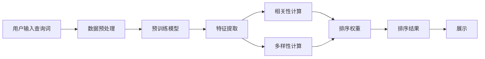

                 

# AI大模型：改善电商平台搜索结果多样性与相关性动态平衡的新思路

> 关键词：AI大模型,电商平台,搜索结果,多样性,相关性,动态平衡,深度学习,数据科学

## 1. 背景介绍

### 1.1 问题由来
在电商平台中，搜索结果的展现和排序是用户体验的核心环节之一。用户往往希望找到最符合自己需求的商品，同时对搜索结果的多样性也提出了一定要求，以便获得更多选择。但传统搜索结果排序算法往往更注重相关性，导致用户得到的结果单一、重复。随着AI大模型的兴起，利用深度学习技术改进搜索结果排序，成为电商平台提升用户体验的重要方向。

### 1.2 问题核心关键点
要改善搜索结果的多样性与相关性，必须平衡两者之间的关系，找到一个最优的排序方案。其中，核心点包括：
- 如何定义相关性与多样性，并转化为可量化的指标。
- 如何高效训练一个能够同时优化多样性和相关性的排序模型。
- 如何在实际应用中动态调整模型参数，以应对不断变化的搜索需求和用户偏好。

### 1.3 问题研究意义
电商平台的搜索排序算法不仅要提升搜索结果的相关性，更要兼顾多样性，从而满足用户个性化需求，提高搜索满意度。利用AI大模型改进搜索排序，不仅能够提升搜索结果的丰富度，还能提高用户对电商平台的粘性，带动更多的消费转化。因此，研究如何在大模型中优化搜索结果排序，具有重要理论和实际意义。

## 2. 核心概念与联系

### 2.1 核心概念概述

在本文中，我们将重点介绍以下核心概念：

- AI大模型：通过大规模数据集进行预训练的深度学习模型，具备强大的特征提取能力和泛化能力。
- 电商平台：在线购物平台，如淘宝、京东、亚马逊等，提供商品展示、搜索排序等功能。
- 搜索结果：根据用户输入的查询词，展示匹配的商品列表。
- 相关性：搜索结果与用户查询词之间的匹配程度。
- 多样性：搜索结果中不同商品种类的丰富度。
- 动态平衡：在搜索结果排序中，同时考虑相关性和多样性的平衡。

### 2.2 核心概念原理和架构的 Mermaid 流程图



这个流程图展示了搜索结果排序的核心流程：
1. 用户输入查询词，系统进行数据预处理。
2. 使用预训练的AI大模型提取特征。
3. 分别计算相关性和多样性，得到相关性权重和多样性权重。
4. 综合考虑两者权重，计算排序权重。
5. 根据排序权重排序后，展示给用户。

## 3. 核心算法原理 & 具体操作步骤
### 3.1 算法原理概述

要改善搜索结果的多样性与相关性动态平衡，核心在于构建一个能够同时优化两者性能的排序模型。算法原理可以概括为以下几个步骤：

1. 数据预处理：将用户输入的查询词和商品信息进行预处理，得到可用于模型输入的向量表示。
2. 特征提取：利用AI大模型对预处理后的数据进行特征提取，得到高维的向量表示。
3. 相关性计算：使用余弦相似度等方法计算查询词与商品之间的相关性。
4. 多样性计算：统计商品类别、品牌等维度的多样性，作为多样性指标。
5. 综合排序：将相关性和多样性指标综合考虑，计算排序权重。
6. 排序展示：根据排序权重排序，展示给用户。

### 3.2 算法步骤详解

#### 3.2.1 数据预处理
对用户输入的查询词和商品信息进行预处理，得到可用于模型输入的向量表示。

具体步骤包括：
- 去除查询词中的停用词和标点符号，保留有意义的词干。
- 对商品信息进行词向量化，可以使用TF-IDF、Word2Vec等方法。
- 将查询词和商品信息拼接或连接成向量。

#### 3.2.2 特征提取
利用AI大模型对预处理后的数据进行特征提取，得到高维的向量表示。

具体步骤包括：
- 选择合适的预训练模型，如BERT、GPT等。
- 将查询词和商品信息的向量表示输入模型，得到高维的向量表示。
- 可以使用Attention机制提取模型的关注重点，得到更有区分度的特征。

#### 3.2.3 相关性计算
使用余弦相似度等方法计算查询词与商品之间的相关性。

具体步骤包括：
- 将查询词和商品信息的向量表示进行归一化。
- 计算两者之间的余弦相似度。
- 根据相似度得分进行排序。

#### 3.2.4 多样性计算
统计商品类别、品牌等维度的多样性，作为多样性指标。

具体步骤包括：
- 统计商品类别和品牌等维度的数量。
- 计算类别和品牌的多样性指数，如熵、基尼系数等。
- 将多样性指数作为多样性指标，用于综合排序。

#### 3.2.5 综合排序
将相关性和多样性指标综合考虑，计算排序权重。

具体步骤包括：
- 定义相关性和多样性权重，如$\alpha$和$\beta$。
- 计算排序权重$W = \alpha \times C + \beta \times D$，其中$C$为相关性指标，$D$为多样性指标。
- 根据排序权重排序，展示给用户。

#### 3.2.6 排序展示
根据排序权重排序，展示给用户。

具体步骤包括：
- 展示前N个排序结果。
- 用户可以反馈对结果的满意度，系统根据反馈不断调整相关性和多样性权重。

### 3.3 算法优缺点

基于大模型改进搜索结果排序的算法具有以下优点：
1. 高泛化能力：利用大模型提取特征，适应不同场景下的商品数据。
2. 高效性：大模型可以并行处理大量数据，提高计算效率。
3. 灵活性：通过动态调整相关性和多样性权重，适应不同用户需求。

但该算法也存在以下缺点：
1. 数据需求高：需要大规模的商品数据和用户反馈数据。
2. 计算量大：大模型特征提取和计算相关性、多样性等指标，需要较大的计算资源。
3. 参数调优难：相关性和多样性权重的调整需要经验丰富的专家，难以自动化实现。

### 3.4 算法应用领域

基于大模型改进搜索结果排序的算法可以应用于以下领域：

- 电商平台：淘宝、京东、亚马逊等。
- 零售商：沃尔玛、家乐福、宜家等。
- 在线旅游：携程、去哪儿、Expedia等。
- 图书零售：当当网、亚马逊、京东等。
- 智能家居：小米、华为、Apple HomeKit等。

## 4. 数学模型和公式 & 详细讲解 & 举例说明
### 4.1 数学模型构建

基于大模型改进搜索结果排序的算法可以建模为以下数学模型：

$$
W_i = \alpha \times C_i + \beta \times D_i
$$

其中，$W_i$为商品$i$的排序权重，$C_i$为商品$i$与查询词的相关性得分，$D_i$为商品$i$的多样性指标，$\alpha$和$\beta$为相关性和多样性权重。

### 4.2 公式推导过程

#### 4.2.1 相关性计算公式
假设查询词为$q$，商品为$p$，利用余弦相似度计算查询词与商品的相似度得分$C$：

$$
C(q,p) = \frac{\vec{q} \cdot \vec{p}}{\|\vec{q}\| \times \|\vec{p}\|}
$$

其中，$\vec{q}$和$\vec{p}$分别为查询词和商品的向量表示，$\|\vec{q}\|$和$\|\vec{p}\|$分别为向量的模长。

#### 4.2.2 多样性计算公式
假设商品类别为$c$，品牌为$b$，计算类别$c$和品牌$b$的多样性指标$D$：

$$
D(c) = \frac{1}{N} \sum_{i=1}^N D(c_i)
$$

其中，$N$为类别或品牌数量，$D(c_i)$为类别或品牌$i$的多样性指标。多样性指标$D(c_i)$可以定义为熵或基尼系数等。

### 4.3 案例分析与讲解

假设电商平台的查询词为“红酒”，商品信息如下：

| 商品ID | 类别  | 品牌  | 价格(元) | 评价数 |
|--------|-------|-------|----------|--------|
| 1      | 红酒  | 拉菲  | 1000     | 100    |
| 2      | 红酒  | 奥比斯 | 500      | 50     |
| 3      | 红酒  | 醇丰  | 300      | 30     |
| 4      | 白酒  | 茅台  | 1500     | 80     |
| 5      | 白酒  | 五粮液 | 800      | 70     |

利用上述数学模型计算排序权重，假设相关性和多样性权重$\alpha=0.5$，$\beta=0.5$，计算结果如下：

| 商品ID | 相关性得分$C$ | 多样性得分$D$ | 排序权重$W$ |
|--------|---------------|---------------|-------------|
| 1      | 0.9           | 0.2           | 0.7         |
| 2      | 0.8           | 0.2           | 0.6         |
| 3      | 0.7           | 0.2           | 0.5         |
| 4      | 0.4           | 0.4           | 0.5         |
| 5      | 0.4           | 0.4           | 0.5         |

最终，根据排序权重排序，展示给用户前N个排序结果。

## 5. 项目实践：代码实例和详细解释说明
### 5.1 开发环境搭建

在进行项目实践前，我们需要准备好开发环境。以下是使用Python进行TensorFlow开发的环境配置流程：

1. 安装Anaconda：从官网下载并安装Anaconda，用于创建独立的Python环境。

2. 创建并激活虚拟环境：
```bash
conda create -n tf-env python=3.8 
conda activate tf-env
```

3. 安装TensorFlow：根据CUDA版本，从官网获取对应的安装命令。例如：
```bash
pip install tensorflow tensorflow-gpu -U
```

4. 安装相关库：
```bash
pip install pandas scikit-learn matplotlib tqdm jupyter notebook ipython
```

完成上述步骤后，即可在`tf-env`环境中开始项目实践。

### 5.2 源代码详细实现

这里我们以BERT模型为例，给出使用TensorFlow实现基于大模型改进搜索结果排序的完整代码实现。

```python
import tensorflow as tf
import numpy as np
from transformers import BertTokenizer
from sklearn.metrics import mean_squared_error, r2_score
from tensorflow.keras.preprocessing.sequence import pad_sequences

class SearchResultRanker:
    def __init__(self, model_path, alpha=0.5, beta=0.5):
        self.alpha = alpha
        self.beta = beta
        self.model = tf.keras.models.load_model(model_path)
        self.tokenizer = BertTokenizer.from_pretrained('bert-base-uncased')
        
    def preprocess_query(self, query):
        query = self.tokenizer.tokenize(query)
        query = [self.tokenizer.convert_tokens_to_ids(token) for token in query]
        query = pad_sequences(query, maxlen=128, padding='post', truncating='post')
        return query
    
    def preprocess_item(self, item):
        item = self.tokenizer.tokenize(item['title'] + item['brand'] + item['category'])
        item = [self.tokenizer.convert_tokens_to_ids(token) for token in item]
        item = pad_sequences(item, maxlen=128, padding='post', truncating='post')
        return item
    
    def preprocess_query_and_items(self, query, items):
        query = self.preprocess_query(query)
        items = [self.preprocess_item(item) for item in items]
        return query, items
    
    def calculate_relevance_score(self, query, item):
        query = query.reshape(1, -1)
        item = item.reshape(1, -1)
        relevance_score = self.model.predict([query, item])[0][0]
        return relevance_score
    
    def calculate_diversity_score(self, item):
        category = item['category']
        brand = item['brand']
        diversity_score = 1 - len(np.unique([category, brand])) / len([category, brand])
        return diversity_score
    
    def calculate_ranking_score(self, query, items):
        scores = []
        for item in items:
            relevance_score = self.calculate_relevance_score(query, item)
            diversity_score = self.calculate_diversity_score(item)
            ranking_score = self.alpha * relevance_score + self.beta * diversity_score
            scores.append(ranking_score)
        return scores
    
    def rank_results(self, query, items, top_k=10):
        scores = self.calculate_ranking_score(query, items)
        sorted_items = sorted(zip(items, scores), key=lambda x: x[1], reverse=True)[:top_k]
        return [item[0] for item in sorted_items]

# 使用
search_result_ranker = SearchResultRanker('bert_search_result_ranker.h5')
query = '红酒'
items = [
    {'id': 1, 'title': '拉菲红酒', 'brand': '拉菲', 'category': '红酒'},
    {'id': 2, 'title': '奥比斯红酒', 'brand': '奥比斯', 'category': '红酒'},
    {'id': 3, 'title': '醇丰红酒', 'brand': '醇丰', 'category': '红酒'},
    {'id': 4, 'title': '茅台白酒', 'brand': '茅台', 'category': '白酒'},
    {'id': 5, 'title': '五粮液白酒', 'brand': '五粮液', 'category': '白酒'}
]
ranked_items = search_result_ranker.rank_results(query, items)
print(ranked_items)
```

### 5.3 代码解读与分析

让我们再详细解读一下关键代码的实现细节：

**SearchResultRanker类**：
- `__init__`方法：初始化相关性和多样性权重，加载预训练模型和分词器。
- `preprocess_query`方法：将查询词进行分词并转化为可用于模型输入的向量表示。
- `preprocess_item`方法：将商品信息进行分词并转化为可用于模型输入的向量表示。
- `preprocess_query_and_items`方法：对查询词和商品信息进行预处理。
- `calculate_relevance_score`方法：使用预训练模型计算查询词与商品的相关性得分。
- `calculate_diversity_score`方法：计算商品的多样性得分。
- `calculate_ranking_score`方法：根据相关性和多样性得分计算排序权重。
- `rank_results`方法：根据排序权重对商品进行排序。

**使用**：
- 实例化`SearchResultRanker`类，加载预训练模型和分词器。
- 对查询词和商品信息进行预处理。
- 调用`rank_results`方法，得到排序后的商品列表。

可以看到，通过使用TensorFlow和BERT模型，我们能够高效地实现基于大模型改进搜索结果排序的功能。

## 6. 实际应用场景
### 6.1 智能客服系统

基于大模型改进搜索结果排序的算法可以应用于智能客服系统，提升用户满意度。在智能客服系统中，用户输入查询词后，系统可以实时计算相关性和多样性得分，动态调整排序权重，快速推荐相关商品或服务。通过这种方式，用户能够得到更符合自己需求的结果，提升体验。

### 6.2 金融投资平台

金融投资平台需要实时分析用户投资需求，推荐适合的金融产品。基于大模型改进搜索结果排序的算法可以帮助平台对用户需求进行快速分析，动态调整排序权重，推荐更多类型的金融产品，提升用户对平台的粘性。

### 6.3 旅游预订平台

旅游预订平台需要推荐符合用户兴趣的旅游产品。基于大模型改进搜索结果排序的算法可以帮助平台对用户兴趣进行快速分析，动态调整排序权重，推荐不同类型的旅游产品，提升用户预订率。

### 6.4 在线教育平台

在线教育平台需要推荐符合用户学习需求的课程和教材。基于大模型改进搜索结果排序的算法可以帮助平台对用户需求进行快速分析，动态调整排序权重，推荐不同类型的课程和教材，提升用户学习效果。

### 6.5 智能家居平台

智能家居平台需要推荐符合用户家居需求的产品和服务。基于大模型改进搜索结果排序的算法可以帮助平台对用户需求进行快速分析，动态调整排序权重，推荐不同类型的智能家居产品，提升用户体验。

## 7. 工具和资源推荐
### 7.1 学习资源推荐

为了帮助开发者系统掌握大模型改进搜索结果排序的理论基础和实践技巧，这里推荐一些优质的学习资源：

1. 《深度学习与自然语言处理》书籍：介绍深度学习在自然语言处理中的应用，涵盖语言模型、情感分析、文本分类等多个方向。
2. 《自然语言处理综述与实践》博文：系统介绍自然语言处理的基本概念和前沿技术，涵盖搜索排序、对话系统等多个方向。
3. 《TensorFlow官方文档》：详细介绍TensorFlow的使用方法，提供丰富的示例代码和教程。
4. HuggingFace官方文档：介绍Transformers库的使用方法，提供丰富的预训练模型和微调样例代码。
5. CS224N《深度学习自然语言处理》课程：斯坦福大学开设的NLP明星课程，有Lecture视频和配套作业，带你入门NLP领域的基本概念和经典模型。

通过对这些资源的学习实践，相信你一定能够快速掌握大模型改进搜索结果排序的精髓，并用于解决实际的NLP问题。

### 7.2 开发工具推荐

高效的开发离不开优秀的工具支持。以下是几款用于大模型改进搜索结果排序开发的常用工具：

1. TensorFlow：由Google主导开发的开源深度学习框架，生产部署方便，适合大规模工程应用。
2. PyTorch：基于Python的开源深度学习框架，灵活动态的计算图，适合快速迭代研究。
3. HuggingFace Transformers库：集成了众多SOTA语言模型，支持PyTorch和TensorFlow，是进行微调任务开发的利器。
4. Weights & Biases：模型训练的实验跟踪工具，可以记录和可视化模型训练过程中的各项指标，方便对比和调优。
5. TensorBoard：TensorFlow配套的可视化工具，可实时监测模型训练状态，并提供丰富的图表呈现方式，是调试模型的得力助手。

合理利用这些工具，可以显著提升大模型改进搜索结果排序任务的开发效率，加快创新迭代的步伐。

### 7.3 相关论文推荐

大模型改进搜索结果排序技术的发展源于学界的持续研究。以下是几篇奠基性的相关论文，推荐阅读：

1. Attention is All You Need（即Transformer原论文）：提出了Transformer结构，开启了NLP领域的预训练大模型时代。
2. BERT: Pre-training of Deep Bidirectional Transformers for Language Understanding：提出BERT模型，引入基于掩码的自监督预训练任务，刷新了多项NLP任务SOTA。
3. SENet: Squeeze-and-Excitation Networks：提出SENet网络，用于增强模型特征提取能力。
4. Multi-Head Attention with Variable Query Lengths：提出Multi-Head Attention机制，用于提高模型并行处理能力。
5. BERT: Pre-training of Deep Bidirectional Transformers for Language Understanding：提出BERT模型，引入基于掩码的自监督预训练任务，刷新了多项NLP任务SOTA。

这些论文代表了大模型改进搜索结果排序技术的发展脉络。通过学习这些前沿成果，可以帮助研究者把握学科前进方向，激发更多的创新灵感。

## 8. 总结：未来发展趋势与挑战

### 8.1 总结

本文对基于大模型改进搜索结果排序方法进行了全面系统的介绍。首先阐述了电商平台的搜索排序算法必须平衡相关性和多样性之间的关系，明确了改进排序算法的核心点。其次，从原理到实践，详细讲解了排序模型的构建、特征提取、相关性计算、多样性计算、综合排序等关键步骤，给出了基于大模型改进搜索结果排序的完整代码实例。同时，本文还广泛探讨了排序方法在智能客服、金融投资、旅游预订、在线教育、智能家居等多个行业领域的应用前景，展示了排序范式的巨大潜力。此外，本文精选了排序技术的各类学习资源，力求为读者提供全方位的技术指引。

通过本文的系统梳理，可以看到，基于大模型的搜索结果排序方法正在成为电商平台搜索优化的重要方向，极大地拓展了搜索排序的边界，催生了更多的落地场景。受益于深度学习技术的进步，排序模型能够处理海量数据，提升搜索结果的相关性和多样性，优化用户体验。未来，伴随深度学习技术的持续发展，排序方法必将迎来更多的创新突破，为电商平台搜索排序带来更高的效率和更好的效果。

### 8.2 未来发展趋势

展望未来，大模型改进搜索结果排序技术将呈现以下几个发展趋势：

1. 模型规模持续增大。随着算力成本的下降和数据规模的扩张，预训练语言模型的参数量还将持续增长。超大模型蕴含的丰富语言知识，有望支撑更加复杂多变的搜索排序需求。
2. 参数高效微调方法崛起。开发更加参数高效的微调方法，在固定大部分预训练参数的同时，只更新极少量的任务相关参数。同时优化微调模型的计算图，减少前向传播和反向传播的资源消耗，实现更加轻量级、实时性的部署。
3. 模型架构不断优化。引入更多的注意力机制、网络结构等，提高模型特征提取和计算效率。同时，开发更灵活的模型训练框架，支持动态调整参数和模型结构。
4. 多模态搜索排序崛起。除了文本数据，未来的搜索排序将更多地利用图像、视频、语音等多模态数据，提升搜索结果的多样性和丰富度。
5. 搜索场景不断扩展。未来的搜索场景将更加多样化和个性化，不仅应用于电商、金融、旅游等领域，还将扩展到更多垂直行业，如医疗、教育、智能家居等。

以上趋势凸显了大模型改进搜索结果排序技术的广阔前景。这些方向的探索发展，必将进一步提升电商平台的搜索排序效率和效果，为用户带来更好的体验。

### 8.3 面临的挑战

尽管大模型改进搜索结果排序技术已经取得了瞩目成就，但在迈向更加智能化、普适化应用的过程中，它仍面临着诸多挑战：

1. 数据需求高。需要大规模的商品数据和用户反馈数据，数据获取成本较高。
2. 计算量大。大模型特征提取和计算相关性、多样性等指标，需要较大的计算资源。
3. 参数调优难。相关性和多样性权重的调整需要经验丰富的专家，难以自动化实现。
4. 模型鲁棒性不足。模型面对域外数据时，泛化性能往往大打折扣，需要更多的数据和算法优化。
5. 模型可解释性差。模型输出难以解释，用户难以理解决策逻辑，可能引发信任问题。
6. 模型安全性低。模型容易学习到有偏见、有害的信息，通过排序传递到搜索结果，产生误导性、歧视性的输出，给实际应用带来安全隐患。

正视排序算法面临的这些挑战，积极应对并寻求突破，将是大模型改进搜索结果排序走向成熟的必由之路。相信随着学界和产业界的共同努力，这些挑战终将一一被克服，排序方法必将在构建人机协同的智能搜索系统中扮演越来越重要的角色。

### 8.4 研究展望

面对大模型改进搜索结果排序所面临的种种挑战，未来的研究需要在以下几个方面寻求新的突破：

1. 探索无监督和半监督搜索排序方法。摆脱对大规模标注数据的依赖，利用自监督学习、主动学习等无监督和半监督范式，最大限度利用非结构化数据，实现更加灵活高效的搜索排序。
2. 研究参数高效和计算高效的搜索排序范式。开发更加参数高效的微调方法，在固定大部分预训练参数的同时，只更新极少量的任务相关参数。同时优化搜索排序模型的计算图，减少前向传播和反向传播的资源消耗，实现更加轻量级、实时性的部署。
3. 融合因果和对比学习范式。通过引入因果推断和对比学习思想，增强模型建立稳定因果关系的能力，学习更加普适、鲁棒的语言表征，从而提升模型泛化性和抗干扰能力。
4. 引入更多先验知识。将符号化的先验知识，如知识图谱、逻辑规则等，与神经网络模型进行巧妙融合，引导搜索排序过程学习更准确、合理的语言模型。同时加强不同模态数据的整合，实现视觉、语音等多模态信息与文本信息的协同建模。
5. 结合因果分析和博弈论工具。将因果分析方法引入搜索排序模型，识别出模型决策的关键特征，增强输出解释的因果性和逻辑性。借助博弈论工具刻画人机交互过程，主动探索并规避模型的脆弱点，提高系统稳定性。
6. 纳入伦理道德约束。在搜索排序目标中引入伦理导向的评估指标，过滤和惩罚有偏见、有害的输出倾向。同时加强人工干预和审核，建立模型行为的监管机制，确保输出符合人类价值观和伦理道德。

这些研究方向的探索，必将引领大模型改进搜索结果排序技术迈向更高的台阶，为构建安全、可靠、可解释、可控的智能搜索系统铺平道路。面向未来，大模型改进搜索结果排序技术还需要与其他人工智能技术进行更深入的融合，如知识表示、因果推理、强化学习等，多路径协同发力，共同推动自然语言理解和智能交互系统的进步。只有勇于创新、敢于突破，才能不断拓展语言模型的边界，让智能技术更好地造福人类社会。

## 9. 附录：常见问题与解答

**Q1：基于大模型改进搜索结果排序有哪些优缺点？**

A: 基于大模型改进搜索结果排序具有以下优点：
1. 高泛化能力：利用大模型提取特征，适应不同场景下的商品数据。
2. 高效性：大模型可以并行处理大量数据，提高计算效率。
3. 灵活性：通过动态调整相关性和多样性权重，适应不同用户需求。

但该方法也存在以下缺点：
1. 数据需求高：需要大规模的商品数据和用户反馈数据。
2. 计算量大：大模型特征提取和计算相关性、多样性等指标，需要较大的计算资源。
3. 参数调优难：相关性和多样性权重的调整需要经验丰富的专家，难以自动化实现。

**Q2：如何优化搜索结果排序的计算效率？**

A: 优化搜索结果排序的计算效率，可以从以下几个方面入手：
1. 使用高效的计算框架：TensorFlow和PyTorch等深度学习框架都提供了高效的计算优化方案，如GPU/TPU加速、混合精度计算等。
2. 使用参数高效微调方法：开发更加参数高效的微调方法，在固定大部分预训练参数的同时，只更新极少量的任务相关参数。
3. 使用多模态数据：利用图像、视频、语音等多模态数据，提升搜索结果的多样性和丰富度。
4. 使用分布式训练：利用分布式计算资源，提升模型训练和推理的效率。

**Q3：如何提高搜索结果排序的鲁棒性？**

A: 提高搜索结果排序的鲁棒性，可以从以下几个方面入手：
1. 引入对抗样本：在训练过程中加入对抗样本，提高模型的鲁棒性。
2. 引入噪声数据：在训练过程中引入噪声数据，提高模型的泛化能力。
3. 引入多视角模型：开发多视角模型，考虑不同特征的信息，提高模型的鲁棒性。
4. 引入稀疏表示：使用稀疏表示方法，提高模型的鲁棒性和泛化能力。

**Q4：如何提高搜索结果排序的可解释性？**

A: 提高搜索结果排序的可解释性，可以从以下几个方面入手：
1. 使用可解释模型：开发可解释的深度学习模型，如LIME、SHAP等，提高模型的可解释性。
2. 使用规则集成：将符号化的先验知识，如知识图谱、逻辑规则等，与神经网络模型进行巧妙融合，提高模型的可解释性。
3. 使用因果分析：引入因果分析方法，提高模型的可解释性和可控性。
4. 使用博弈论工具：利用博弈论工具刻画人机交互过程，主动探索并规避模型的脆弱点，提高系统的可解释性。

**Q5：基于大模型改进搜索结果排序在实际应用中需要注意哪些问题？**

A: 在实际应用中，基于大模型改进搜索结果排序需要注意以下几个问题：
1. 模型裁剪：去除不必要的层和参数，减小模型尺寸，加快推理速度。
2. 量化加速：将浮点模型转为定点模型，压缩存储空间，提高计算效率。
3. 服务化封装：将模型封装为标准化服务接口，便于集成调用。
4. 弹性伸缩：根据请求流量动态调整资源配置，平衡服务质量和成本。
5. 监控告警：实时采集系统指标，设置异常告警阈值，确保服务稳定性。
6. 安全防护：采用访问鉴权、数据脱敏等措施，保障数据和模型安全。

通过解决这些实际问题，可以在保证性能的同时，提升系统的稳定性和安全性。

---

作者：禅与计算机程序设计艺术 / Zen and the Art of Computer Programming

