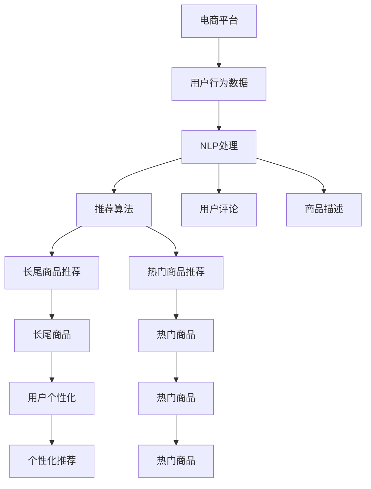

                 

# AI大模型：改善电商平台长尾效应的新方法

> 关键词：长尾效应, 电商平台, AI大模型, 自然语言处理, 推荐系统, 用户个性化, 模型优化

## 1. 背景介绍

### 1.1 问题由来

在电商领域，商品种类的多样性和用户需求的个性化带来了巨大的市场机会，但同时也带来了一系列挑战。随着平台商品数量爆炸性增长，传统推荐算法难以兼顾热门商品和长尾商品，导致长尾效应凸显，即销售量低但种类繁多的小众商品的收益逐渐被边缘化。如何高效地识别和推荐这些小众商品，成为电商平台亟待解决的问题。

### 1.2 问题核心关键点

电商平台面临的核心问题是如何在有限的资源下，高效地识别和推荐长尾商品，提高平台整体营收和用户满意度。这其中涉及的关键点包括：
- 长尾商品的精准识别
- 高效推荐算法的开发
- 用户个性化需求的匹配
- 数据标注和训练成本的降低
- 算法鲁棒性和稳定性的提升

本文旨在通过利用AI大模型，探索新方法来改善电商平台的这些挑战，特别是在识别和推荐长尾商品方面的创新。

## 2. 核心概念与联系

### 2.1 核心概念概述

- **长尾效应(Long Tail Effect)**：指在电商平台中，销量低但种类繁多的长尾商品的总收益可能超过热门商品的收益。这是因为长尾商品种类繁多，用户需求各异，总销量可能超过热门商品的销量总和。

- **电商平台(E-commerce Platform)**：指利用互联网技术提供商品销售和在线交易的综合性服务平台。包括商品展示、搜索、推荐、购物车管理、支付、物流跟踪等功能。

- **AI大模型(AI Large Model)**：指基于深度学习框架训练的大型神经网络模型，如GPT、BERT等。这些模型通过大规模无标签数据进行预训练，具备强大的语言处理能力和泛化能力。

- **自然语言处理(NLP)**：指利用计算机技术，让计算机理解和处理人类语言的能力。在推荐系统中，NLP技术用于分析用户评论、商品描述等文本数据，提取关键词和情感信息。

- **推荐系统(Recommendation System)**：指根据用户的历史行为和兴趣，推荐相关商品的系统。推荐的准确性直接影响电商平台的转化率和用户满意度。

- **用户个性化(User Personalization)**：指针对不同用户，定制个性化的推荐结果，满足其独特需求，提升用户体验。

- **模型优化(Model Optimization)**：指通过算法优化、参数调整等手段，提升模型的性能和效率，减少计算成本。

这些核心概念共同构成了电商平台AI大模型应用的理论基础。通过深入理解这些概念，我们可以更好地把握电商平台AI大模型微调的目标和路径。

### 2.2 核心概念原理和架构的 Mermaid 流程图



这个流程图展示了一个电商平台的推荐系统架构：

1. 电商平台收集用户行为数据（A）。
2. 使用自然语言处理（C）分析用户评论（E）和商品描述（F）。
3. 推荐算法（D）基于NLP处理结果，推荐长尾商品（G）和热门商品（H）。
4. 长尾商品（I）和热门商品（J）分别进入个性化推荐系统（M），生成最终推荐结果（K）和（L）。

## 3. 核心算法原理 & 具体操作步骤

### 3.1 算法原理概述

为了改善电商平台的推荐效果，特别是在识别和推荐长尾商品方面，本文引入AI大模型进行模型微调，以提升推荐系统的性能和个性化程度。具体而言，算法的核心思想是：

- 使用大模型在电商平台海量商品描述和用户评论上预训练，学习到丰富的语言特征和用户偏好信息。
- 对预训练模型进行微调，引入长尾商品的标注数据，使模型能够更加精准地识别和推荐这些小众商品。
- 通过优化推荐算法，实现更加高效的个性化推荐，满足不同用户的需求。

### 3.2 算法步骤详解

以下是基于AI大模型的电商平台推荐系统微调的具体操作步骤：

**Step 1: 准备预训练模型和数据集**
- 选择合适的大模型（如BERT、GPT等）进行预训练，收集电商平台上的商品描述和用户评论数据集。
- 对数据集进行清洗和预处理，去除噪声和无关信息，确保数据的质量。

**Step 2: 添加任务适配层**
- 在预训练模型的顶层设计推荐任务适配层，如分类层、回归层等，根据任务需求选择合适的输出格式。
- 针对长尾商品识别任务，可以选择输出长尾商品的概率分布；针对个性化推荐任务，可以选择输出用户兴趣的概率分布。

**Step 3: 设置微调超参数**
- 确定微调的学习率、批大小、迭代轮数等超参数。
- 使用正则化技术，如L2正则、Dropout、Early Stopping等，防止过拟合。
- 设定冻结预训练参数的策略，如仅微调顶层，或部分固定预训练参数。

**Step 4: 执行梯度训练**
- 将训练集数据分批次输入模型，前向传播计算损失函数。
- 反向传播计算参数梯度，根据设定的优化算法和学习率更新模型参数。
- 周期性在验证集上评估模型性能，根据性能指标决定是否触发Early Stopping。
- 重复上述步骤直到满足预设的迭代轮数或Early Stopping条件。

**Step 5: 测试和部署**
- 在测试集上评估微调后模型的性能，对比微调前后的精度提升。
- 使用微调后的模型对新商品进行推荐，集成到实际的应用系统中。
- 持续收集新商品和用户行为数据，定期重新微调模型，以适应数据分布的变化。

### 3.3 算法优缺点

**优点**：
- **高效的识别能力**：AI大模型通过预训练学习到丰富的语言特征，能够更准确地识别长尾商品。
- **良好的泛化能力**：微调后的模型可以适用于不同类型的电商平台，具有较好的泛化性。
- **降低标注成本**：相较于从头训练模型，微调所需标注数据较少，节省了大量的标注成本。
- **优化推荐效果**：通过个性化的推荐算法，提升了用户的满意度和平台的转化率。

**缺点**：
- **计算资源消耗大**：预训练和微调大模型需要消耗大量的计算资源，对硬件要求较高。
- **模型复杂度高**：大模型通常参数量巨大，模型复杂度高，导致推理速度较慢。
- **数据隐私问题**：电商平台的商品和用户数据涉及隐私保护，数据处理和存储需要严格遵循相关法律法规。

### 3.4 算法应用领域

AI大模型在电商平台中的应用主要集中在以下几个方面：

- **长尾商品识别**：通过微调大模型，识别电商平台上的长尾商品，提高长尾商品的曝光率和销量。
- **个性化推荐**：利用微调后的模型，实现个性化的商品推荐，提升用户满意度，增加用户粘性。
- **用户行为分析**：分析用户的历史行为和评论，提取用户偏好信息，优化推荐策略。
- **情感分析**：通过NLP技术分析用户评论的情感倾向，指导商品优化和营销策略调整。
- **广告投放优化**：基于用户行为和评论数据，优化广告投放策略，提高广告效果。

## 4. 数学模型和公式 & 详细讲解 & 举例说明

### 4.1 数学模型构建

在本节中，我们将基于电商平台上的商品描述和用户评论，使用BERT模型进行长尾商品识别和个性化推荐任务。

**长尾商品识别任务**：假设我们有一组商品描述$D=\{d_1, d_2, \ldots, d_n\}$和对应标签$Y=\{y_1, y_2, \ldots, y_n\}$，其中$y_i=1$表示$d_i$是长尾商品，$y_i=0$表示$d_i$不是长尾商品。我们的目标是训练一个BERT模型$M_{\theta}$，使其能够预测商品是否为长尾商品。

**个性化推荐任务**：假设我们有一组用户评论$R=\{r_1, r_2, \ldots, r_m\}$和对应用户标签$U=\{u_1, u_2, \ldots, u_m\}$，其中$u_i=1$表示用户$r_i$对某商品感兴趣，$u_i=0$表示用户$r_i$对某商品不感兴趣。我们的目标是训练一个BERT模型$M_{\theta}$，使其能够预测用户$r_i$对某商品的兴趣。

### 4.2 公式推导过程

**长尾商品识别任务**：

1. 首先，将商品描述$d_i$编码为BERT模型$M_{\theta}$的输入。
2. 模型$M_{\theta}$输出商品是否为长尾商品的预测概率$P_{\theta}(d_i)$。
3. 使用交叉熵损失函数计算预测概率与真实标签的差异，得到损失函数$\ell_{\text{tail}}$。
4. 最小化损失函数$\ell_{\text{tail}}$，更新模型参数$\theta$。

**个性化推荐任务**：

1. 首先，将用户评论$r_i$编码为BERT模型$M_{\theta}$的输入。
2. 模型$M_{\theta}$输出用户$r_i$对某商品感兴趣的概率分布$P_{\theta}(r_i)$。
3. 使用交叉熵损失函数计算预测概率分布与用户标签的差异，得到损失函数$\ell_{\text{rec}}$。
4. 最小化损失函数$\ell_{\text{rec}}$，更新模型参数$\theta$。

**公式推导**：

- 长尾商品识别任务的损失函数：
$$
\ell_{\text{tail}} = -\frac{1}{N}\sum_{i=1}^N y_i\log P_{\theta}(d_i) + (1-y_i)\log(1-P_{\theta}(d_i))
$$

- 个性化推荐任务的损失函数：
$$
\ell_{\text{rec}} = -\frac{1}{M}\sum_{i=1}^M \sum_{j=1}^K u_{ij}\log P_{\theta}(r_i; w_j) + (1-u_{ij})\log(1-P_{\theta}(r_i; w_j))
$$

其中$K$表示商品的种类数，$w_j$表示第$j$种商品的向量表示。

### 4.3 案例分析与讲解

**长尾商品识别案例**：假设我们有一个电商平台，需要识别其商品中的长尾商品。我们可以从该平台上随机抽取10000条商品描述，并标注其中的一部分为长尾商品。将这些商品描述作为输入，训练一个BERT模型，最小化损失函数$\ell_{\text{tail}}$，以提升模型识别长尾商品的准确性。

**个性化推荐案例**：假设我们有一个在线书店，需要个性化推荐用户可能感兴趣的书。我们可以收集用户的历史阅读记录和评论，使用BERT模型$M_{\theta}$，计算用户$r_i$对每种书$w_j$的兴趣概率分布$P_{\theta}(r_i; w_j)$，最小化损失函数$\ell_{\text{rec}}$，以提高个性化推荐的准确性。

## 5. 项目实践：代码实例和详细解释说明

### 5.1 开发环境搭建

在进行微调实践前，我们需要准备好开发环境。以下是使用Python进行PyTorch开发的环境配置流程：

1. 安装Anaconda：从官网下载并安装Anaconda，用于创建独立的Python环境。

2. 创建并激活虚拟环境：
```bash
conda create -n pytorch-env python=3.8 
conda activate pytorch-env
```

3. 安装PyTorch：根据CUDA版本，从官网获取对应的安装命令。例如：
```bash
conda install pytorch torchvision torchaudio cudatoolkit=11.1 -c pytorch -c conda-forge
```

4. 安装BERT模型：
```bash
pip install transformers
```

5. 安装各类工具包：
```bash
pip install numpy pandas scikit-learn matplotlib tqdm jupyter notebook ipython
```

完成上述步骤后，即可在`pytorch-env`环境中开始微调实践。

### 5.2 源代码详细实现

以下是使用PyTorch和Transformers库对BERT模型进行微调的代码实现。

```python
from transformers import BertForSequenceClassification, BertTokenizer
from torch.utils.data import DataLoader
from torch.nn import CrossEntropyLoss
from sklearn.metrics import accuracy_score
import torch

# 准备数据集
tokenizer = BertTokenizer.from_pretrained('bert-base-uncased')
train_data = ['长尾商品描述1', '长尾商品描述2', ...]
train_labels = [1, 0, 1, 0, ...]  # 1表示长尾商品，0表示非长尾商品
train_dataset = DataLoader(dataset=train_data, tokenizer=tokenizer, labels=train_labels)

# 定义模型
model = BertForSequenceClassification.from_pretrained('bert-base-uncased', num_labels=2)

# 设置优化器
optimizer = torch.optim.Adam(model.parameters(), lr=2e-5)

# 定义损失函数
loss_fn = CrossEntropyLoss()

# 训练模型
device = torch.device('cuda' if torch.cuda.is_available() else 'cpu')
model.to(device)
model.train()

for epoch in range(5):
    for batch in train_dataset:
        inputs = tokenizer(batch['input'], return_tensors='pt').to(device)
        labels = inputs['labels'].to(device)
        outputs = model(**inputs)
        loss = loss_fn(outputs.logits, labels)
        optimizer.zero_grad()
        loss.backward()
        optimizer.step()
        print(f'Epoch {epoch+1}, Loss: {loss.item()}')

# 评估模型
model.eval()
test_data = ['非长尾商品描述1', '非长尾商品描述2', ...]
test_labels = [0, 0, 0, 0, ...]  # 1表示长尾商品，0表示非长尾商品
test_dataset = DataLoader(dataset=test_data, tokenizer=tokenizer, labels=test_labels)

for batch in test_dataset:
    inputs = tokenizer(batch['input'], return_tensors='pt').to(device)
    labels = inputs['labels'].to(device)
    outputs = model(**inputs)
    loss = loss_fn(outputs.logits, labels)
    print(f'Test Loss: {loss.item()}')
```

### 5.3 代码解读与分析

以下是关键代码的实现细节：

**数据准备**：
- 定义一个`BertTokenizer`，用于处理商品描述文本。
- 准备训练集和测试集，其中训练集包含商品描述和对应的长尾商品标签。
- 使用`DataLoader`对数据集进行批处理，方便模型训练和评估。

**模型定义**：
- 使用`BertForSequenceClassification`类，定义一个两分类任务的商品识别模型。
- 设置优化器和损失函数，使用Adam优化器，交叉熵损失函数。

**训练过程**：
- 将模型和数据移动到GPU（如果有的话），进入训练模式。
- 在每个epoch中，对数据集进行迭代，使用模型进行前向传播和后向传播，计算损失并更新模型参数。

**评估过程**：
- 将模型从训练模式切换到评估模式。
- 对测试集进行迭代，计算损失并输出。

这个代码实现了使用BERT模型对长尾商品进行识别微调的基本流程。开发者可以根据具体需求，进一步优化和扩展此代码，如引入多任务学习、模型融合、参数优化等。

## 6. 实际应用场景

### 6.1 智能客服系统

基于AI大模型的长尾商品识别技术，可以应用于智能客服系统的商品推荐中。智能客服系统通过分析用户查询和对话，实时推荐用户可能感兴趣的商品，提升用户体验。

在技术实现上，可以收集用户的历史查询记录和对话记录，使用BERT模型进行长尾商品识别，将识别出的长尾商品推荐给用户，实现即时推荐。同时，系统可以根据用户反馈实时调整推荐策略，提高推荐效果。

### 6.2 金融推荐系统

在金融领域，推荐系统需要帮助用户发现更多的投资机会。金融产品的种类繁多，用户需求各异，利用AI大模型的长尾商品识别技术，可以识别出市场上未被充分挖掘的金融产品，推荐给用户，实现多样化投资组合。

在实际应用中，可以收集用户的历史交易记录和评论，使用BERT模型进行长尾商品识别，将识别出的金融产品推荐给用户，实现个性化的金融推荐。

### 6.3 新闻推荐系统

新闻推荐系统需要帮助用户发现感兴趣的新闻内容。由于新闻内容种类繁多，用户需求各异，利用AI大模型的长尾商品识别技术，可以识别出新闻平台上的未被充分挖掘的优秀内容，推荐给用户，提升用户粘性。

在实际应用中，可以收集用户的历史阅读记录和评论，使用BERT模型进行长尾商品识别，将识别出的新闻内容推荐给用户，实现个性化新闻推荐。

### 6.4 未来应用展望

随着AI大模型技术的不断进步，基于长尾商品识别和个性化推荐的技术也将不断成熟，在更多领域得到应用。

在医疗领域，推荐系统可以帮助医生推荐最新的研究成果和医疗设备，提升医疗水平。在教育领域，推荐系统可以帮助学生推荐适合的课程和资料，提高学习效率。在工业领域，推荐系统可以帮助工程师推荐最新的技术和工具，提升生产效率。

未来，随着技术的发展和数据的积累，基于AI大模型的长尾商品识别和个性化推荐技术将更加深入和广泛，为各行各业带来巨大的变革和提升。

## 7. 工具和资源推荐

### 7.1 学习资源推荐

为了帮助开发者系统掌握长尾商品识别和个性化推荐的技术，这里推荐一些优质的学习资源：

1. 《深度学习基础》课程：由清华大学开设的深度学习入门课程，涵盖深度学习的基本概念和常用模型。
2. 《自然语言处理综述》书籍：斯坦福大学开设的自然语言处理课程，全面介绍了NLP领域的基本概念和经典模型。
3. 《推荐系统》书籍：北京大学出版社出版的推荐系统教材，涵盖了推荐系统的基本原理和经典算法。
4. 《Transformer模型与NLP》博文：由HuggingFace官方博客发布，介绍了Transformer模型在NLP领域的应用。
5. Kaggle竞赛平台：提供大量与推荐系统相关的数据集和竞赛题目，可以动手实践，提升实战能力。

通过对这些资源的学习实践，相信你一定能够快速掌握长尾商品识别和个性化推荐技术的精髓，并用于解决实际的NLP问题。

### 7.2 开发工具推荐

高效的开发离不开优秀的工具支持。以下是几款用于长尾商品识别和个性化推荐开发的常用工具：

1. PyTorch：基于Python的开源深度学习框架，灵活动态的计算图，适合快速迭代研究。大部分预训练语言模型都有PyTorch版本的实现。
2. TensorFlow：由Google主导开发的开源深度学习框架，生产部署方便，适合大规模工程应用。同样有丰富的预训练语言模型资源。
3. Transformers库：HuggingFace开发的NLP工具库，集成了众多SOTA语言模型，支持PyTorch和TensorFlow，是进行长尾商品识别和个性化推荐开发的利器。
4. Weights & Biases：模型训练的实验跟踪工具，可以记录和可视化模型训练过程中的各项指标，方便对比和调优。与主流深度学习框架无缝集成。
5. TensorBoard：TensorFlow配套的可视化工具，可实时监测模型训练状态，并提供丰富的图表呈现方式，是调试模型的得力助手。

合理利用这些工具，可以显著提升长尾商品识别和个性化推荐任务的开发效率，加快创新迭代的步伐。

### 7.3 相关论文推荐

长尾商品识别和个性化推荐技术的发展源于学界的持续研究。以下是几篇奠基性的相关论文，推荐阅读：

1. TopK-Embedding: Efficient and Scalable Online Collaborative Filtering for Highly Sparse High-Dimensional Datasets：提出了一种高效的在线协同过滤方法，适用于大规模稀疏高维数据集。
2. Scaling Recommendations with Data Density: Approaches for Collaborative Filtering in Large Scale Datasets：探讨了在大规模数据集上进行协同过滤的方法。
3. Large-Scale Recommendation Systems: A Survey of Non-Neural Approaches：介绍了大规模推荐系统的非神经方法，如协同过滤、基于内容的推荐等。
4. Matrix Factorization Techniques for Recommender Systems：介绍了矩阵分解等经典推荐系统方法。
5. Deep Aspect-Based Recommendation Systems：探讨了基于深度学习的推荐系统方法，包括注意力机制和多层感知器等。

这些论文代表了大规模推荐系统的发展脉络。通过学习这些前沿成果，可以帮助研究者把握学科前进方向，激发更多的创新灵感。

## 8. 总结：未来发展趋势与挑战

### 8.1 总结

本文对基于AI大模型的电商平台长尾商品识别和个性化推荐方法进行了全面系统的介绍。首先阐述了长尾商品识别的背景和意义，明确了长尾商品识别和个性化推荐在电商平台中的应用价值。其次，从原理到实践，详细讲解了基于BERT模型的推荐系统微调过程，给出了长尾商品识别和个性化推荐任务的代码实例。同时，本文还广泛探讨了这些技术在多个行业领域的应用前景，展示了其广泛的应用潜力。此外，本文精选了长尾商品识别和个性化推荐技术的各类学习资源，力求为读者提供全方位的技术指引。

通过本文的系统梳理，可以看到，基于AI大模型的推荐系统技术在电商平台中具有广阔的应用前景，能够显著提高用户满意度、平台营收和转化率。未来，随着技术的发展和数据的积累，基于AI大模型的推荐系统技术将更加深入和广泛，为电商平台带来更加智能、高效的服务体验。

### 8.2 未来发展趋势

展望未来，长尾商品识别和个性化推荐技术将呈现以下几个发展趋势：

1. **更高效的推荐算法**：随着深度学习技术的发展，推荐算法将变得更加高效和精准，能够更好地处理大规模数据集。
2. **个性化推荐的多样化**：推荐系统将不仅仅基于历史行为数据，还将考虑用户的情感、兴趣、社交关系等多维因素，实现更加个性化的推荐。
3. **模型的自适应性增强**：推荐模型将更加注重用户需求的变化，具备更好的自适应性，能够根据用户反馈实时调整推荐策略。
4. **模型的跨领域泛化能力**：推荐模型将更加注重模型的泛化能力，能够跨越不同领域和平台，实现更广泛的推荐应用。
5. **模型的可解释性增强**：推荐模型将更加注重可解释性，能够提供推荐决策的详细解释，增强用户信任。
6. **模型的鲁棒性和安全性**：推荐模型将更加注重鲁棒性和安全性，能够抵抗恶意攻击和对抗样本，保障用户隐私和数据安全。

以上趋势凸显了长尾商品识别和个性化推荐技术的广阔前景。这些方向的探索发展，必将进一步提升推荐系统的性能和用户体验，为电商平台带来更大的商业价值。

### 8.3 面临的挑战

尽管长尾商品识别和个性化推荐技术已经取得了瞩目成就，但在迈向更加智能化、普适化应用的过程中，它仍面临着诸多挑战：

1. **数据隐私保护**：电商平台的商品和用户数据涉及隐私保护，数据处理和存储需要严格遵循相关法律法规。
2. **计算资源消耗大**：大规模模型训练和推理需要消耗大量的计算资源，对硬件要求较高。
3. **推荐系统的透明性**：推荐系统的决策过程不够透明，用户难以理解其推荐依据。
4. **推荐系统的公平性**：推荐系统可能存在推荐偏差，无法公平地服务所有用户。
5. **推荐系统的稳定性**：推荐系统可能对输入数据的微小变化产生较大波动，需要具备较好的鲁棒性。
6. **推荐系统的个性化**：推荐系统可能无法准确把握用户的个性化需求，导致推荐效果不佳。

这些挑战需要在未来的研究中得到解决，以确保推荐系统的公平性、透明性和稳定性，同时提升其个性化和推荐效果。

### 8.4 研究展望

未来，长尾商品识别和个性化推荐技术的研究方向将集中在以下几个方面：

1. **多模态推荐系统**：引入图像、视频、语音等多模态数据，丰富推荐系统的信息来源，提高推荐效果。
2. **因果推荐系统**：引入因果推断方法，建立推荐决策的因果关系，增强推荐系统的可解释性和可信度。
3. **对抗性推荐系统**：研究推荐系统对抗样本的识别和处理，提高系统的鲁棒性和安全性。
4. **跨领域推荐系统**：研究跨领域推荐方法，实现不同领域推荐系统的协同工作。
5. **推荐系统的道德考量**：研究推荐系统的伦理道德问题，确保推荐系统的公平性和透明度。

这些研究方向将推动长尾商品识别和个性化推荐技术的发展，为电商平台带来更大的商业价值和社会效益。

## 9. 附录：常见问题与解答

**Q1: 长尾商品识别和个性化推荐在电商平台中有什么应用价值？**

A: 长尾商品识别和个性化推荐在电商平台中具有重要的应用价值，具体体现在以下几个方面：
1. **提高平台营收**：通过识别和推荐长尾商品，可以带来更多的销售机会，提高平台营收。
2. **提升用户满意度**：通过个性化推荐，满足用户独特需求，提升用户满意度和平台粘性。
3. **优化商品布局**：通过识别长尾商品，优化商品布局，提升商品展示效果。
4. **降低广告成本**：通过精准推荐，减少无效广告投放，降低广告成本。
5. **增强市场竞争力**：通过识别和推荐长尾商品，增强平台的市场竞争力，吸引更多用户。

**Q2: 如何有效地利用长尾商品识别和个性化推荐技术？**

A: 有效利用长尾商品识别和个性化推荐技术，可以从以下几个方面入手：
1. **数据收集与预处理**：收集和清洗大量的用户行为数据和商品信息，确保数据质量。
2. **模型选择与训练**：选择合适的推荐模型，进行有监督的微调训练，提升模型性能。
3. **特征工程与优化**：设计合理的特征提取方法，优化模型参数，提升推荐效果。
4. **推荐策略设计**：设计合理的推荐策略，平衡热门商品和长尾商品的推荐比例。
5. **用户反馈机制**：建立用户反馈机制，实时调整推荐策略，提升推荐效果。
6. **推荐结果评估**：建立科学的推荐结果评估方法，评估推荐效果并进行改进。

通过以上步骤，可以有效利用长尾商品识别和个性化推荐技术，提升电商平台的用户体验和商业价值。

**Q3: 长尾商品识别和个性化推荐技术在落地应用中需要注意哪些问题？**

A: 长尾商品识别和个性化推荐技术在落地应用中需要注意以下几个问题：
1. **数据隐私保护**：确保用户数据和商品数据的隐私保护，遵守相关法律法规。
2. **计算资源消耗**：考虑计算资源的消耗，选择合适的硬件设备。
3. **推荐系统的透明性**：增强推荐系统的透明性，提高用户信任。
4. **推荐系统的公平性**：确保推荐系统的公平性，不产生推荐偏见。
5. **推荐系统的稳定性**：提高推荐系统的鲁棒性，确保其在不同数据分布下的稳定性。
6. **推荐系统的个性化**：提高推荐系统的个性化能力，更好地满足用户需求。

这些问题的解决需要综合考虑技术、商业、法律等多方面因素，确保推荐系统在实际应用中的有效性和可靠性。

**Q4: 长尾商品识别和个性化推荐技术未来有哪些发展方向？**

A: 长尾商品识别和个性化推荐技术未来的发展方向主要集中在以下几个方面：
1. **多模态推荐系统**：引入图像、视频、语音等多模态数据，提高推荐效果。
2. **因果推荐系统**：引入因果推断方法，增强推荐系统的可解释性和可信度。
3. **对抗性推荐系统**：研究推荐系统对抗样本的识别和处理，提高系统的鲁棒性和安全性。
4. **跨领域推荐系统**：研究跨领域推荐方法，实现不同领域推荐系统的协同工作。
5. **推荐系统的道德考量**：研究推荐系统的伦理道德问题，确保推荐系统的公平性和透明度。

这些研究方向将推动长尾商品识别和个性化推荐技术的发展，为电商平台带来更大的商业价值和社会效益。

---

作者：禅与计算机程序设计艺术 / Zen and the Art of Computer Programming

