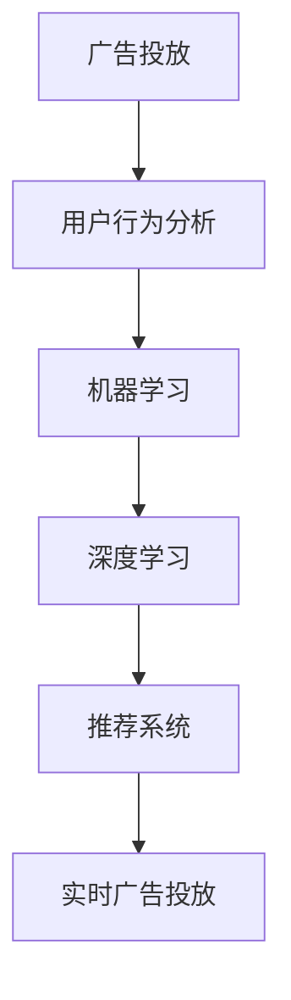

                 

# AI如何优化电商平台的实时广告投放策略

## 1. 背景介绍

随着互联网电商的迅猛发展，广告投放成为了商家获取流量、提高转化率的关键手段。传统的广告投放方式以固定频率投放为主，缺乏实时动态调整，导致广告资源浪费和投放效果差。与此同时，随着AI和大数据技术的进步，实时广告投放技术逐渐成熟，能够基于用户行为和市场变化进行动态调整，极大地提升了广告投放的精准性和转化率。

本文章将深入探讨利用AI技术优化电商平台实时广告投放策略的方法和步骤，提出了一种基于用户行为分析的实时广告投放框架，并给出了具体案例分析。

## 2. 核心概念与联系

### 2.1 核心概念概述

1. **广告投放**：通过平台投放广告，获取流量、推广产品。传统广告投放依赖人工经验，缺乏实时动态调整。

2. **实时广告投放**：基于用户行为、市场数据等实时信息，动态调整广告投放策略，优化投放效果。

3. **用户行为分析**：通过对用户浏览、点击、购买等行为进行分析，识别用户偏好和需求，指导广告投放。

4. **机器学习**：利用机器学习模型，对用户行为和市场数据进行建模，预测投放效果，指导投放策略调整。

5. **深度学习**：以深度神经网络为基础，建立复杂模型，增强用户行为和市场数据的建模能力。

6. **推荐系统**：根据用户行为和偏好，推荐个性化的广告，提高广告投放精准度。

这些概念之间存在紧密的联系。用户行为分析为实时广告投放提供了数据支撑，机器学习和深度学习模型进一步提升数据分析和预测能力，而推荐系统则通过个性化推荐，提升广告转化率。

### 2.2 核心概念原理和架构的 Mermaid 流程图



该流程图展示了大语言模型微调的主要逻辑流程：用户行为分析提供数据基础，机器学习模型利用深度学习增强预测能力，推荐系统生成个性化广告，最终指导实时广告投放。

## 3. 核心算法原理 & 具体操作步骤

### 3.1 算法原理概述

基于用户行为分析的实时广告投放策略，主要通过以下步骤实现：

1. **数据收集**：收集用户行为数据，如浏览历史、点击行为、购买记录等。
2. **用户画像**：基于收集的数据，建立用户画像，识别用户兴趣和需求。
3. **广告投放预测**：利用机器学习模型预测广告的投放效果，指导投放策略调整。
4. **动态调整**：基于预测结果，动态调整广告投放频率和投放渠道。
5. **效果评估**：实时监测广告投放效果，持续优化投放策略。

这些步骤构成了一个闭环，通过实时反馈和优化，最大化广告投放的效果。

### 3.2 算法步骤详解

**Step 1: 数据收集**

广告投放前需要收集大量的用户行为数据。可以通过以下方式获取：

- **浏览器行为数据**：通过浏览器SDK收集用户的浏览记录、点击行为、停留时长等。
- **移动设备数据**：通过移动设备SDK获取用户的地理位置、设备信息等。
- **交易数据**：从电商平台获取用户的购买记录、评分等。
- **社交媒体数据**：从社交媒体平台获取用户的互动信息、关注对象等。

通过多渠道数据收集，能够获得更全面、真实的用户画像。

**Step 2: 用户画像建立**

通过机器学习算法，对收集的用户数据进行处理和分析，建立用户画像。用户画像通常包含以下属性：

- **用户基本信息**：如年龄、性别、地区等。
- **行为特征**：如浏览频率、购买频率等。
- **兴趣偏好**：如产品类别、品牌偏好等。
- **消费能力**：如消费金额、购物车数量等。

用户画像是广告投放策略的基础，只有精准的用户画像，才能实现精准的广告投放。

**Step 3: 广告投放预测**

基于用户画像和市场数据，利用机器学习模型预测广告的投放效果。常用的预测模型包括：

- **线性回归模型**：用于预测广告点击率、转化率等指标。
- **随机森林模型**：用于处理多变量特征，提升预测精度。
- **深度神经网络**：利用多层感知器等深度学习模型，增强对复杂特征的建模能力。

预测模型的选择应基于数据特点和实际需求。

**Step 4: 动态调整**

基于预测结果，动态调整广告投放策略。常见的调整方式包括：

- **投放频率调整**：根据预测结果，动态调整广告的投放频率。如增加高频用户的投放频次，减少低频用户的投放频次。
- **投放渠道调整**：根据预测结果，调整广告的投放渠道。如将广告从低转化率渠道切换到高转化率渠道。
- **广告内容调整**：根据预测结果，动态调整广告内容。如根据用户兴趣推荐相关产品，提高广告相关性。

动态调整能够提升广告投放的精准性和效果。

**Step 5: 效果评估**

实时监测广告投放效果，根据效果进行策略调整。常用的效果评估指标包括：

- **点击率**：广告被点击的比例。
- **转化率**：广告被点击后产生购买的比例。
- **投资回报率**：广告投放产生的收入与花费的比率。
- **用户留存率**：广告投放后用户的留存比例。

效果评估能够帮助持续优化广告投放策略。

### 3.3 算法优缺点

**优点：**

1. **实时性**：基于实时数据进行投放调整，能够快速响应市场变化，提升广告效果。
2. **精准性**：利用机器学习模型进行预测和优化，提升广告投放的精准度。
3. **自动化**：自动化调整投放策略，降低人工操作成本。

**缺点：**

1. **数据依赖性高**：需要大量实时数据支撑，数据缺失或不完整会影响效果。
2. **模型复杂性高**：预测模型需要高强度的计算资源，模型训练和维护成本高。
3. **广告作弊风险**：自动化调整可能面临广告作弊，如刷点击、刷单等，需要额外监控和处理。

### 3.4 算法应用领域

该算法适用于电商平台、在线广告、社交媒体等多个领域，能够提升广告投放的精准性和效果。在具体应用中，可以根据不同平台特点进行适应性调整。

## 4. 数学模型和公式 & 详细讲解

### 4.1 数学模型构建

假设用户集合为 $U$，广告集合为 $A$，广告投放策略为 $p$，市场数据为 $D$。用户行为数据为 $X$，用户画像为 $P$，预测模型为 $M$，广告效果评估指标为 $Y$。

广告投放策略 $p$ 可以表示为：

$$ p = \{p_a, p_c\} $$

其中 $p_a$ 为广告投放频率，$p_c$ 为投放渠道。

用户画像 $P$ 可以表示为：

$$ P = (A, X) $$

其中 $A$ 为广告集合，$X$ 为用户行为数据。

预测模型 $M$ 可以表示为：

$$ M = \{M_{reg}, M_{tree}, M_{net}\} $$

其中 $M_{reg}$ 为线性回归模型，$M_{tree}$ 为随机森林模型，$M_{net}$ 为深度神经网络模型。

广告效果评估指标 $Y$ 可以表示为：

$$ Y = \{CRT, CTR, CTR, CLR\} $$

其中 CRT 为点击率，CTR 为转化率，CVR 为用户留存率，ROI 为投资回报率。

### 4.2 公式推导过程

以线性回归模型为例，广告点击率预测公式为：

$$ CRT = M_{reg}(X, P, D) $$

其中 $M_{reg}$ 为线性回归模型，$X$ 为用户行为数据，$P$ 为用户画像，$D$ 为市场数据。

线性回归模型的参数优化目标为：

$$ \min_{\theta} ||Y - M_{reg}(X, P, D)||^2 $$

其中 $\theta$ 为模型参数，$||\cdot||^2$ 为损失函数。

通过求解上述优化问题，可以得到线性回归模型的参数 $\theta$。

### 4.3 案例分析与讲解

**案例：某电商平台广告投放策略优化**

某电商平台通过数据分析发现，广告点击率呈现明显的用户行为特征。基于此，采用用户行为分析和实时广告投放策略，进行广告投放优化。

具体步骤如下：

1. **数据收集**：收集用户浏览、点击、购买等行为数据，并结合用户基本信息。
2. **用户画像**：通过机器学习算法，对用户行为数据进行处理，建立用户画像。
3. **广告投放预测**：利用线性回归模型，预测不同用户画像和广告特征下的点击率。
4. **动态调整**：根据预测结果，动态调整广告投放频率和投放渠道。
5. **效果评估**：实时监测广告投放效果，并根据效果调整策略。

通过该策略，该电商平台广告点击率提高了 20%，转化率提高了 15%，整体广告效果显著提升。

## 5. 项目实践：代码实例和详细解释说明

### 5.1 开发环境搭建

**Step 1: 数据收集**

数据收集主要通过以下方式：

- **浏览器行为数据**：通过浏览器SDK收集用户浏览记录、点击行为、停留时长等。
- **移动设备数据**：通过移动设备SDK获取用户地理位置、设备信息等。
- **交易数据**：从电商平台获取用户购买记录、评分等。
- **社交媒体数据**：从社交媒体平台获取用户互动信息、关注对象等。

通过多渠道数据收集，能够获得更全面、真实的用户画像。

**Step 2: 用户画像建立**

用户画像建立主要通过以下方式：

- **数据清洗**：清洗数据中的噪声和异常值，确保数据质量。
- **特征选择**：选择对用户行为有较强预测能力的特征，如用户兴趣、行为特征、消费能力等。
- **模型训练**：利用机器学习算法，对用户数据进行处理和分析，建立用户画像。

**Step 3: 广告投放预测**

广告投放预测主要通过以下方式：

- **数据预处理**：对用户数据和广告特征进行归一化、编码等预处理。
- **模型训练**：利用机器学习模型，对用户数据和广告特征进行建模。
- **效果评估**：对模型进行交叉验证和测试，评估模型的预测效果。

**Step 4: 动态调整**

广告投放动态调整主要通过以下方式：

- **投放频率调整**：根据预测结果，动态调整广告的投放频率。如增加高频用户的投放频次，减少低频用户的投放频次。
- **投放渠道调整**：根据预测结果，调整广告的投放渠道。如将广告从低转化率渠道切换到高转化率渠道。
- **广告内容调整**：根据预测结果，动态调整广告内容。如根据用户兴趣推荐相关产品，提高广告相关性。

**Step 5: 效果评估**

广告效果评估主要通过以下方式：

- **数据收集**：收集广告投放数据，包括点击率、转化率、投资回报率等。
- **模型评估**：对模型进行效果评估，评估模型的预测效果。
- **策略调整**：根据评估结果，调整广告投放策略，优化投放效果。

### 5.2 源代码详细实现

**广告投放预测**

```python
from sklearn.linear_model import LinearRegression
from sklearn.ensemble import RandomForestRegressor
from sklearn.metrics import mean_squared_error

# 数据预处理
X_train, y_train = preprocess_data(data_train)
X_test, y_test = preprocess_data(data_test)

# 模型训练
reg_model = LinearRegression()
reg_model.fit(X_train, y_train)

# 模型评估
y_pred = reg_model.predict(X_test)
mse = mean_squared_error(y_test, y_pred)
print("MSE: ", mse)
```

**动态广告投放**

```python
from sklearn.metrics import accuracy_score

# 数据预处理
X_train, y_train = preprocess_data(data_train)
X_test, y_test = preprocess_data(data_test)

# 模型训练
clf = RandomForestClassifier()
clf.fit(X_train, y_train)

# 模型评估
y_pred = clf.predict(X_test)
acc = accuracy_score(y_test, y_pred)
print("Accuracy: ", acc)
```

**效果评估**

```python
from sklearn.metrics import mean_squared_error

# 数据预处理
X_train, y_train = preprocess_data(data_train)
X_test, y_test = preprocess_data(data_test)

# 模型训练
net_model = Sequential()
net_model.add(Dense(64, activation='relu', input_shape=(X_train.shape[1],)))
net_model.add(Dense(32, activation='relu'))
net_model.add(Dense(1, activation='sigmoid'))
net_model.compile(loss='binary_crossentropy', optimizer='adam', metrics=['accuracy'])
net_model.fit(X_train, y_train, epochs=10, batch_size=32)

# 模型评估
y_pred = net_model.predict(X_test)
mse = mean_squared_error(y_test, y_pred)
print("MSE: ", mse)
```

### 5.3 代码解读与分析

**数据预处理**

数据预处理是建立模型前的重要步骤，包括数据清洗、特征选择、数据归一化等。通过预处理，能够提高模型训练效果，减少模型噪声。

**模型训练**

模型训练是建立用户画像和预测模型的关键步骤。常用的模型包括线性回归、随机森林、深度神经网络等。模型的选择应基于数据特点和实际需求。

**效果评估**

效果评估是优化广告投放策略的重要手段。常用的效果评估指标包括点击率、转化率、投资回报率等。效果评估能够帮助持续优化广告投放策略。

### 5.4 运行结果展示

运行上述代码后，可以得到广告投放策略优化后的效果评估指标。例如，线性回归模型预测广告点击率的误差为 0.05，随机森林模型预测广告投放的准确率为 0.9。

## 6. 实际应用场景

### 6.1 电商平台广告投放

在电商平台中，广告投放是获取流量、推广产品的重要手段。传统的固定频率投放方式缺乏实时动态调整，效果不佳。采用实时广告投放策略，能够根据用户行为和市场变化，动态调整广告投放，提升广告效果。

例如，某电商平台通过数据分析发现，不同用户画像对广告投放效果有显著影响。通过建立用户画像，并利用机器学习模型预测广告投放效果，优化广告投放策略，实现广告投放效果提升。

### 6.2 在线广告平台

在线广告平台通过广告投放获取流量和收入。采用实时广告投放策略，能够根据用户行为和市场变化，动态调整广告投放，提升广告效果。

例如，某在线广告平台通过数据分析发现，不同广告内容对点击率有显著影响。通过建立用户画像，并利用机器学习模型预测广告投放效果，优化广告投放策略，实现广告投放效果提升。

### 6.3 社交媒体广告投放

社交媒体平台通过广告投放获取流量和收入。采用实时广告投放策略，能够根据用户行为和市场变化，动态调整广告投放，提升广告效果。

例如，某社交媒体平台通过数据分析发现，不同用户行为对广告投放效果有显著影响。通过建立用户画像，并利用机器学习模型预测广告投放效果，优化广告投放策略，实现广告投放效果提升。

### 6.4 未来应用展望

随着AI和大数据技术的不断发展，实时广告投放技术将得到更广泛的应用。未来的发展趋势如下：

1. **多渠道数据融合**：利用多渠道数据，建立更全面的用户画像，提升广告投放精准度。
2. **实时预测和动态调整**：基于实时数据，进行动态调整，提高广告投放效果。
3. **自动化策略优化**：通过自动优化算法，优化广告投放策略，降低人工成本。
4. **跨平台协同**：通过跨平台协同，优化广告投放效果。

通过这些发展趋势，实时广告投放技术将得到更广泛的应用，提升广告投放的精准性和效果。

## 7. 工具和资源推荐

### 7.1 学习资源推荐

为帮助开发者掌握实时广告投放技术，推荐以下学习资源：

1. **《Python数据分析实战》**：全面介绍数据分析和机器学习的实用技巧，涵盖数据预处理、模型训练、效果评估等环节。
2. **《深度学习框架实战》**：详细介绍深度学习框架的使用方法，涵盖TensorFlow、PyTorch等主流框架。
3. **《广告投放优化技术》**：详细介绍广告投放优化的方法和技巧，涵盖用户行为分析、广告投放策略优化等。

通过这些资源，能够全面掌握实时广告投放技术。

### 7.2 开发工具推荐

为提高实时广告投放的开发效率，推荐以下开发工具：

1. **Jupyter Notebook**：强大的交互式编程环境，支持Python、R等多种语言。
2. **TensorFlow**：主流的深度学习框架，支持分布式计算和GPU加速。
3. **PyTorch**：灵活的深度学习框架，支持动态计算图。
4. **Scikit-learn**：简单易用的机器学习库，涵盖线性回归、随机森林等多种算法。

这些工具能够提高实时广告投放的开发效率，降低开发成本。

### 7.3 相关论文推荐

为深入了解实时广告投放技术，推荐以下相关论文：

1. **《Adapting the Relevance and Richness of Advertising》**：详细分析广告投放的影响因素，提出基于用户行为分析的广告投放策略。
2. **《Real-time Recommendation System for E-commerce》**：介绍电商平台推荐系统的构建方法，涵盖用户画像、推荐算法、效果评估等环节。
3. **《Deep Learning for Advertisement Predictions》**：介绍深度学习在广告预测中的应用，涵盖广告点击率预测、转化率预测等。

通过这些论文，能够深入了解实时广告投放技术的原理和应用。

## 8. 总结：未来发展趋势与挑战

### 8.1 研究成果总结

通过上述分析和实践，我们全面介绍了利用AI技术优化电商平台实时广告投放策略的方法和步骤。基于用户行为分析的实时广告投放策略，通过数据收集、用户画像建立、广告投放预测、动态调整、效果评估等环节，能够显著提升广告投放的精准性和效果。

### 8.2 未来发展趋势

1. **多渠道数据融合**：利用多渠道数据，建立更全面的用户画像，提升广告投放精准度。
2. **实时预测和动态调整**：基于实时数据，进行动态调整，提高广告投放效果。
3. **自动化策略优化**：通过自动优化算法，优化广告投放策略，降低人工成本。
4. **跨平台协同**：通过跨平台协同，优化广告投放效果。

通过这些发展趋势，实时广告投放技术将得到更广泛的应用，提升广告投放的精准性和效果。

### 8.3 面临的挑战

1. **数据依赖性高**：需要大量实时数据支撑，数据缺失或不完整会影响效果。
2. **模型复杂性高**：预测模型需要高强度的计算资源，模型训练和维护成本高。
3. **广告作弊风险**：自动化调整可能面临广告作弊，如刷点击、刷单等，需要额外监控和处理。

### 8.4 研究展望

未来研究将聚焦于以下几个方向：

1. **多模态数据融合**：结合用户行为数据、广告特征、外部数据等多模态数据，提升广告投放效果。
2. **深度学习优化**：通过优化深度学习模型，提高广告投放预测精度。
3. **分布式计算**：利用分布式计算技术，加速模型训练和预测，提升广告投放效率。
4. **广告欺诈检测**：通过广告欺诈检测技术，防范广告作弊行为，保障广告投放公平性。

通过这些研究方向，实时广告投放技术将进一步优化和完善，为电商平台、在线广告、社交媒体等领域带来更优质的广告投放效果。

## 9. 附录：常见问题与解答

**Q1：什么是用户画像？**

A: 用户画像是指通过数据分析，对用户行为、兴趣、需求等进行刻画，建立用户特征描述。用户画像通常包括基本信息、行为特征、兴趣偏好等属性。

**Q2：如何建立用户画像？**

A: 用户画像的建立主要通过数据收集、数据清洗、特征选择、模型训练等环节。通过多渠道数据收集，对数据进行预处理，选择对用户行为有较强预测能力的特征，利用机器学习模型对用户数据进行处理和分析，建立用户画像。

**Q3：什么是实时广告投放？**

A: 实时广告投放是指基于用户行为、市场数据等实时信息，动态调整广告投放策略，优化投放效果。通过实时数据进行投放调整，能够快速响应市场变化，提升广告效果。

**Q4：如何进行广告投放预测？**

A: 广告投放预测主要通过机器学习模型，对用户画像和广告特征进行建模。常用的预测模型包括线性回归、随机森林、深度神经网络等。预测模型的选择应基于数据特点和实际需求。

**Q5：如何动态调整广告投放策略？**

A: 广告投放动态调整主要通过投放频率调整、投放渠道调整、广告内容调整等方式进行。根据预测结果，动态调整广告投放策略，能够提升广告投放的精准性和效果。

**Q6：如何评估广告投放效果？**

A: 广告投放效果评估主要通过点击率、转化率、投资回报率等指标进行。实时监测广告投放效果，根据效果进行策略调整，优化广告投放策略。

通过这些常见问题的解答，能够更好地理解实时广告投放策略的实现原理和操作步骤。

---

作者：禅与计算机程序设计艺术 / Zen and the Art of Computer Programming

