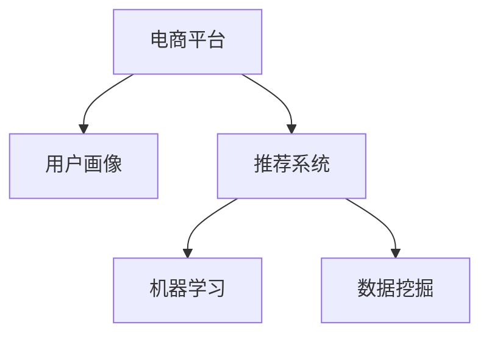

                 

# AI如何改变电商平台的用户行为分析

> 关键词：人工智能,电商平台,用户行为分析,用户画像,推荐系统,算法优化,数据挖掘,机器学习

## 1. 背景介绍

### 1.1 问题由来
随着互联网和电子商务的迅速发展，电商平台已成为现代消费的重要组成部分。电商平台不仅满足了消费者对商品的需求，还提供了丰富的个性化服务和推荐系统，以提升用户体验和增加销售额。然而，传统电商平台的用户行为分析方式，通常依赖于人工数据分析和经验总结，缺乏系统的理论指导和算法支持。

近年来，随着人工智能技术的崛起，电商平台开始引入AI技术，对用户行为进行系统化的分析和建模，以提供更精准的个性化推荐和服务。AI技术的应用，不仅大幅提升了电商平台的运营效率和服务质量，还为消费者提供了更加丰富、便捷的购物体验。本文将系统阐述AI技术在电商平台用户行为分析中的应用，探讨其核心概念和关键技术，以期为电商从业者提供有益的参考。

### 1.2 问题核心关键点
AI技术在电商平台用户行为分析中的应用，主要涉及以下几个关键点：

- **用户画像**：通过对用户历史行为数据的挖掘分析，构建用户画像，了解用户的兴趣偏好、消费习惯、行为轨迹等，从而提供更加个性化的服务。
- **推荐系统**：利用AI算法对用户行为进行建模，预测用户未来的购买意向，实现商品推荐，提升用户满意度和销售额。
- **算法优化**：针对电商平台的特定需求，优化和改进AI算法，提升其预测准确率和响应速度，实现高效的用户行为分析。
- **数据挖掘**：从海量的用户数据中，挖掘潜在的关联关系和隐藏规律，为推荐系统提供更多的数据支撑。
- **机器学习**：应用机器学习算法对用户行为数据进行建模和分析，发现其中的规律和模式，提升算法的预测能力和泛化能力。

这些关键点共同构成了AI技术在电商平台用户行为分析中的应用框架，通过对其深入研究，可以显著提升电商平台的运营效率和服务质量。

### 1.3 问题研究意义
AI技术在电商平台用户行为分析中的应用，具有重要意义：

1. **提升用户体验**：通过个性化的推荐和服务，提升用户满意度和忠诚度，增强平台的吸引力。
2. **增加销售额**：通过精准的推荐，引导用户购买更多商品，增加平台的收入。
3. **优化运营效率**：通过数据驱动的决策，优化库存管理、广告投放等运营环节，降低成本。
4. **挖掘用户价值**：通过深入的用户画像和行为分析，挖掘用户的长期价值，提升平台的市场竞争力。
5. **增强市场洞察**：通过数据分析，洞察市场趋势和用户需求，为战略决策提供依据。

## 2. 核心概念与联系

### 2.1 核心概念概述

为更好地理解AI技术在电商平台用户行为分析中的应用，本节将介绍几个密切相关的核心概念：

- **电商平台**：指通过互联网提供商品交易、服务交易等交易活动的平台，如淘宝、京东、亚马逊等。
- **用户画像**：通过数据挖掘和分析，构建用户的多维度画像，包括基本信息、兴趣偏好、消费行为、社交关系等。
- **推荐系统**：利用AI算法，对用户行为数据进行建模和预测，推荐个性化的商品或服务，提升用户体验。
- **机器学习**：通过算法模型，从大量数据中学习规律和模式，实现数据的自动分析和挖掘。
- **数据挖掘**：从原始数据中提取有价值的信息，发现其中的关联和规律，为决策提供支持。

这些核心概念之间的逻辑关系可以通过以下Mermaid流程图来展示：



这个流程图展示了几大核心概念的关联关系：

1. 电商平台是数据来源的基础平台。
2. 用户画像是通过数据挖掘和分析构建的，用于刻画用户的多维度特征。
3. 推荐系统基于机器学习算法对用户行为进行建模和预测，实现个性化推荐。
4. 数据挖掘通过对原始数据的分析和挖掘，为机器学习算法提供数据支撑。

这些概念共同构成了AI技术在电商平台用户行为分析中的应用框架，通过理解这些概念，可以更好地把握技术应用的精髓。

## 3. 核心算法原理 & 具体操作步骤

### 3.1 算法原理概述

AI技术在电商平台用户行为分析中的应用，主要基于机器学习算法，通过对用户行为数据进行建模和分析，实现个性化的推荐和服务。其核心思想是通过历史行为数据挖掘用户的兴趣偏好，预测未来行为，提供精准的推荐和优化运营决策。

形式化地，假设电商平台用户行为数据为 $D=\{(x_i, y_i)\}_{i=1}^N, x_i \in \mathcal{X}, y_i \in \mathcal{Y}$，其中 $x_i$ 表示用户行为，$y_i$ 表示行为结果（如点击、购买等）。目标是通过机器学习算法 $f$，学习用户行为 $x$ 和行为结果 $y$ 之间的映射关系，即：

$$
f: \mathcal{X} \rightarrow \mathcal{Y}
$$

使得模型能够准确预测用户未来的行为。

### 3.2 算法步骤详解

AI技术在电商平台用户行为分析中的应用，通常包括以下几个关键步骤：

**Step 1: 数据准备**
- 收集平台用户的行为数据，包括点击、浏览、购买、评分等。
- 对原始数据进行清洗、去重、归一化等预处理，确保数据的准确性和一致性。
- 划分数据集为训练集、验证集和测试集，用于模型的训练、调参和评估。

**Step 2: 特征工程**
- 提取和构建用户的特征向量，包括基本信息（如年龄、性别、地域等）、行为特征（如浏览时长、购买次数等）、上下文特征（如广告位、时间等）。
- 利用特征选择和降维技术，去除冗余和噪声特征，优化特征向量。
- 对用户特征向量进行编码，如独热编码、标签编码等，方便模型处理。

**Step 3: 模型选择与训练**
- 根据任务特点选择合适的机器学习算法，如分类算法（如逻辑回归、随机森林、XGBoost等）、回归算法（如线性回归、岭回归、梯度提升等）。
- 设计损失函数和优化算法，如交叉熵损失、梯度下降、Adam等，训练模型。
- 使用交叉验证技术，评估模型的泛化能力，进行超参数调优。

**Step 4: 评估与优化**
- 在测试集上评估模型的预测准确率、召回率、F1值等指标，评估模型性能。
- 使用A/B测试、在线实验等方法，验证模型效果，优化模型参数。
- 对模型进行迭代优化，提升模型的泛化能力和预测精度。

**Step 5: 部署与应用**
- 将训练好的模型部署到电商平台的推荐系统中，实时处理用户行为数据。
- 根据用户行为数据，实时生成个性化推荐，提升用户体验。
- 结合人工干预和调整，优化推荐策略，提升运营效果。

以上是AI技术在电商平台用户行为分析中的一般流程。在实际应用中，还需要针对具体任务特点，对各个环节进行优化设计，如改进数据处理方式、优化模型结构、加强异常检测等，以进一步提升模型性能。

### 3.3 算法优缺点

AI技术在电商平台用户行为分析中的应用，具有以下优点：

1. **精准推荐**：通过深度学习和机器学习算法，能够精准地预测用户行为，实现个性化推荐，提升用户体验。
2. **数据驱动决策**：通过大数据分析和机器学习算法，能够从海量数据中挖掘规律和模式，为运营决策提供有力支持。
3. **实时响应**：通过实时处理用户行为数据，能够快速响应用户需求，提升运营效率。
4. **低成本**：相比于人工数据分析，AI技术能够大幅降低数据分析成本，提高运营效率。
5. **可扩展性强**：AI技术能够适应电商平台的多样化需求，通过模型调整和优化，实现更广泛的应用。

同时，该方法也存在一定的局限性：

1. **数据质量依赖**：AI模型的效果高度依赖于数据的质量和量级，数据缺失或不完整将影响模型效果。
2. **模型复杂度高**：深度学习和机器学习模型通常需要较长的训练时间和大量的计算资源，难以快速部署。
3. **算法复杂性高**：机器学习算法和模型结构复杂，不易理解和调试。
4. **数据隐私问题**：电商平台需要处理大量的用户数据，隐私保护问题不容忽视。
5. **模型泛化能力不足**：深度学习模型通常具有较强的过拟合风险，泛化能力有限。

尽管存在这些局限性，但AI技术在电商平台用户行为分析中的应用，已经在诸多成功案例中得到了验证，显示了其巨大的潜力和应用前景。

### 3.4 算法应用领域

AI技术在电商平台用户行为分析中的应用，不仅限于个性化推荐，还包括用户画像构建、行为预测、运营优化等多个方面：

- **用户画像**：通过用户行为数据的分析，构建用户的兴趣偏好、消费习惯、行为轨迹等多维度画像，用于个性化推荐和服务。
- **推荐系统**：利用AI算法对用户行为进行建模和预测，推荐个性化的商品或服务，提升用户满意度和销售额。
- **行为预测**：基于用户历史行为数据，预测用户未来的购买意向和行为，优化库存管理和广告投放。
- **运营优化**：通过数据分析，优化电商平台的用户体验和运营策略，提升平台的竞争力和市场份额。
- **市场洞察**：通过数据挖掘，洞察市场趋势和用户需求，为战略决策提供依据。

这些应用领域展示了AI技术在电商平台用户行为分析中的广泛应用，通过深入挖掘其核心概念和关键技术，可以为电商从业者提供系统的技术支持。

## 4. 数学模型和公式 & 详细讲解 & 举例说明

### 4.1 数学模型构建

本节将使用数学语言对AI技术在电商平台用户行为分析中的应用进行更加严格的刻画。

假设电商平台用户行为数据为 $D=\{(x_i, y_i)\}_{i=1}^N, x_i \in \mathcal{X}, y_i \in \mathcal{Y}$。假设用户行为 $x_i$ 可以表示为一个特征向量 $x_i \in \mathbb{R}^d$，行为结果 $y_i$ 可以表示为一个类别标签 $y_i \in \{0,1\}$，其中0表示负面结果，1表示正面结果。

定义用户行为数据的损失函数为：

$$
\mathcal{L}(\theta) = \frac{1}{N}\sum_{i=1}^N \ell(f_{\theta}(x_i), y_i)
$$

其中 $f_{\theta}(x_i)$ 表示用户行为数据 $x_i$ 通过模型 $f_{\theta}$ 的预测结果，$\ell$ 为损失函数，常见的有交叉熵损失函数：

$$
\ell(f_{\theta}(x_i), y_i) = -y_i \log f_{\theta}(x_i) - (1-y_i) \log (1-f_{\theta}(x_i))
$$

目标是最小化损失函数 $\mathcal{L}(\theta)$，即找到最优参数 $\theta$：

$$
\theta^* = \mathop{\arg\min}_{\theta} \mathcal{L}(\theta)
$$

在实践中，我们通常使用基于梯度的优化算法（如SGD、Adam等）来近似求解上述最优化问题。设 $\eta$ 为学习率，$\lambda$ 为正则化系数，则参数的更新公式为：

$$
\theta \leftarrow \theta - \eta \nabla_{\theta}\mathcal{L}(\theta) - \eta\lambda\theta
$$

其中 $\nabla_{\theta}\mathcal{L}(\theta)$ 为损失函数对参数 $\theta$ 的梯度，可通过反向传播算法高效计算。

### 4.2 公式推导过程

以下我们以分类任务为例，推导交叉熵损失函数及其梯度的计算公式。

假设模型 $f_{\theta}$ 在输入 $x$ 上的输出为 $\hat{y}=f_{\theta}(x) \in [0,1]$，表示样本属于正类的概率。真实标签 $y \in \{0,1\}$。则二分类交叉熵损失函数定义为：

$$
\ell(f_{\theta}(x),y) = -[y\log \hat{y} + (1-y)\log (1-\hat{y})]
$$

将其代入经验风险公式，得：

$$
\mathcal{L}(\theta) = -\frac{1}{N}\sum_{i=1}^N [y_i\log f_{\theta}(x_i)+(1-y_i)\log(1-f_{\theta}(x_i))]
$$

根据链式法则，损失函数对参数 $\theta_k$ 的梯度为：

$$
\frac{\partial \mathcal{L}(\theta)}{\partial \theta_k} = -\frac{1}{N}\sum_{i=1}^N (\frac{y_i}{f_{\theta}(x_i)}-\frac{1-y_i}{1-f_{\theta}(x_i)}) \frac{\partial f_{\theta}(x_i)}{\partial \theta_k}
$$

其中 $\frac{\partial f_{\theta}(x_i)}{\partial \theta_k}$ 可进一步递归展开，利用自动微分技术完成计算。

在得到损失函数的梯度后，即可带入参数更新公式，完成模型的迭代优化。重复上述过程直至收敛，最终得到适应电商平台用户行为分析的最优模型参数 $\theta^*$。

### 4.3 案例分析与讲解

为了更好地理解AI技术在电商平台用户行为分析中的应用，下面以一个具体案例进行详细讲解。

假设一个电商平台的推荐系统，需要对用户浏览行为进行分析和预测，推荐个性化的商品。具体步骤如下：

**Step 1: 数据准备**
- 收集用户的浏览行为数据，包括用户ID、商品ID、浏览时间、浏览时长等。
- 对数据进行清洗和预处理，去除噪声和重复数据，确保数据的一致性和完整性。

**Step 2: 特征工程**
- 提取用户特征，包括基本信息（如年龄、性别、地域等）、行为特征（如浏览时长、点击次数等）、上下文特征（如广告位、时间等）。
- 对特征进行编码，如将商品ID转化为独热编码，方便模型处理。
- 使用PCA等降维技术，对特征向量进行优化，减少计算复杂度。

**Step 3: 模型选择与训练**
- 选择分类算法，如逻辑回归、随机森林、XGBoost等，设计交叉熵损失函数。
- 使用SGD优化算法，设置合适的学习率和正则化系数，训练模型。
- 使用交叉验证技术，评估模型性能，进行超参数调优。

**Step 4: 评估与优化**
- 在测试集上评估模型的预测准确率、召回率、F1值等指标，评估模型性能。
- 使用A/B测试、在线实验等方法，验证模型效果，优化模型参数。
- 结合人工干预和调整，优化推荐策略，提升运营效果。

**Step 5: 部署与应用**
- 将训练好的模型部署到电商平台的推荐系统中，实时处理用户行为数据。
- 根据用户行为数据，实时生成个性化推荐，提升用户体验。
- 结合人工干预和调整，优化推荐策略，提升运营效果。

通过上述案例，可以看出AI技术在电商平台用户行为分析中的应用流程。在实际应用中，还需要根据具体任务特点，对各环节进行优化设计，如改进特征工程方法、优化模型结构、加强异常检测等，以进一步提升模型性能。

## 5. 项目实践：代码实例和详细解释说明

### 5.1 开发环境搭建

在进行AI技术在电商平台用户行为分析的实践前，我们需要准备好开发环境。以下是使用Python进行TensorFlow开发的环境配置流程：

1. 安装Anaconda：从官网下载并安装Anaconda，用于创建独立的Python环境。

2. 创建并激活虚拟环境：
```bash
conda create -n tf-env python=3.8 
conda activate tf-env
```

3. 安装TensorFlow：根据CUDA版本，从官网获取对应的安装命令。例如：
```bash
conda install tensorflow tensorflow-gpu=2.6
```

4. 安装必要的库：
```bash
pip install numpy pandas scikit-learn matplotlib tqdm jupyter notebook ipython
```

完成上述步骤后，即可在`tf-env`环境中开始AI技术在电商平台用户行为分析的实践。

### 5.2 源代码详细实现

下面我们以电商平台的推荐系统为例，给出使用TensorFlow进行用户行为分析的PyTorch代码实现。

首先，定义数据处理函数：

```python
import tensorflow as tf
from tensorflow.keras.preprocessing import sequence
from tensorflow.keras.layers import Dense, Embedding, LSTM, Dropout

def preprocess_data(data):
    # 将商品ID转化为独热编码
    data['item_id'] = tf.keras.utils.to_categorical(data['item_id'], num_classes=len(unique_item_ids))
    # 对数据进行编码，将用户ID和浏览时间转化为模型输入
    data = pd.get_dummies(data, columns=['user_id', 'time'])
    # 将数据转化为模型输入的二维数组
    X = data.drop(['item_id', 'label'], axis=1).values
    y = data['item_id'].values
    return X, y
```

然后，定义模型：

```python
model = tf.keras.Sequential([
    Embedding(input_dim=len(unique_item_ids), output_dim=128),
    LSTM(128),
    Dropout(0.2),
    Dense(len(unique_item_ids), activation='softmax')
])
```

接着，定义训练和评估函数：

```python
def train_model(model, X_train, y_train, X_valid, y_valid, epochs=10, batch_size=32):
    model.compile(optimizer='adam', loss='categorical_crossentropy', metrics=['accuracy'])
    model.fit(X_train, y_train, epochs=epochs, batch_size=batch_size, validation_data=(X_valid, y_valid))
    return model

def evaluate_model(model, X_test, y_test):
    loss, accuracy = model.evaluate(X_test, y_test)
    print(f'Test accuracy: {accuracy:.2f}')
    return accuracy
```

最后，启动训练流程并在测试集上评估：

```python
# 加载数据集
data = pd.read_csv('user_behavior_data.csv')
X, y = preprocess_data(data)

# 划分训练集、验证集和测试集
X_train, X_valid, X_test = train_test_split(X, y, test_size=0.2, random_state=42)
y_train, y_valid, y_test = train_test_split(y, y, test_size=0.2, random_state=42)

# 训练模型
model = train_model(model, X_train, y_train, X_valid, y_valid)

# 在测试集上评估模型
evaluate_model(model, X_test, y_test)
```

以上就是使用TensorFlow进行电商平台推荐系统用户行为分析的完整代码实现。可以看到，得益于TensorFlow的强大封装，我们可以用相对简洁的代码完成模型的训练和评估。

### 5.3 代码解读与分析

让我们再详细解读一下关键代码的实现细节：

**preprocess_data函数**：
- 将商品ID转化为独热编码，方便模型处理。
- 对数据进行编码，将用户ID和浏览时间转化为模型输入。
- 将数据转化为模型输入的二维数组，方便模型处理。

**模型定义**：
- 定义了一个包含Embedding、LSTM和Dense层的神经网络模型。
- 使用softmax激活函数，输出为概率分布。

**train_model函数**：
- 定义了模型编译、训练和评估的流程。
- 使用交叉熵损失函数，Adam优化器进行模型训练。

**evaluate_model函数**：
- 定义了模型评估的流程。
- 输出测试集上的损失和准确率。

**训练流程**：
- 加载数据集，进行数据预处理。
- 划分训练集、验证集和测试集。
- 训练模型，输出模型性能。
- 在测试集上评估模型，输出模型性能。

可以看到，TensorFlow提供了丰富的深度学习框架和工具，使得电商平台的推荐系统用户行为分析的开发和部署变得相对简单和高效。开发者可以将更多精力放在模型改进和优化上，而不必过多关注底层的实现细节。

当然，工业级的系统实现还需考虑更多因素，如模型的保存和部署、超参数的自动搜索、更灵活的任务适配层等。但核心的用户行为分析流程基本与此类似。

## 6. 实际应用场景

### 6.1 智能推荐系统

基于AI技术在电商平台用户行为分析的应用，智能推荐系统已经成为了电商平台的核心竞争力。智能推荐系统通过深度学习和机器学习算法，对用户行为数据进行建模和预测，提供个性化的推荐服务，极大地提升了用户满意度和平台销售额。

在技术实现上，可以收集用户的历史浏览、购买、评分等行为数据，构建用户画像，挖掘用户的兴趣偏好和行为规律。在此基础上，利用机器学习算法对用户行为进行建模，预测用户未来的购买意向，实现商品推荐。推荐系统还可以实时处理用户行为数据，动态生成推荐结果，提升用户体验。

### 6.2 用户行为预测

AI技术在电商平台用户行为分析中的应用，还可以用于用户行为预测。通过分析用户的历史行为数据，预测用户未来的行为趋势，优化库存管理和广告投放策略。

例如，对于电商平台的商品库存管理，可以根据用户的历史购买数据和浏览行为，预测未来的销售趋势，动态调整库存水平，避免库存积压或缺货的情况发生。对于广告投放，可以根据用户的历史点击和购买数据，预测用户的广告响应率，优化广告投放策略，提升广告投放效果。

### 6.3 运营数据分析

AI技术在电商平台用户行为分析中的应用，还可以用于电商平台的运营数据分析，优化运营策略，提升平台运营效率。

例如，对于电商平台的广告投放效果分析，可以通过分析用户的历史点击和购买数据，评估不同广告渠道的效果，优化广告投放策略。对于用户留存分析，可以通过分析用户的历史行为数据，挖掘用户流失的原因，优化用户体验，提升用户留存率。

### 6.4 未来应用展望

随着AI技术的不断进步，基于用户行为分析的智能推荐系统、用户行为预测、运营数据分析等领域将迎来新的突破。未来，AI技术在电商平台用户行为分析中的应用将更加广泛，带来更多的应用场景和商业价值。

在智慧零售领域，基于用户行为分析的智能推荐系统将成为重要的创新驱动力，为消费者提供更加个性化、精准的购物体验。在金融领域，基于用户行为分析的信用评估、风险控制等应用将大幅提升金融服务的智能化水平。在旅游、娱乐等领域，基于用户行为分析的个性化推荐和服务，将带来全新的消费体验。

总之，AI技术在电商平台用户行为分析中的应用，将为电商行业的数字化转型和智能化升级提供强大的技术支撑，带来更多的商业机会和创新潜力。

## 7. 工具和资源推荐

### 7.1 学习资源推荐

为了帮助开发者系统掌握AI技术在电商平台用户行为分析中的应用，这里推荐一些优质的学习资源：

1. 《深度学习》书籍：由深度学习专家Ian Goodfellow、Yoshua Bengio和Aaron Courville合著，系统介绍了深度学习的基本概念和算法。

2. 《TensorFlow实战指南》书籍：由TensorFlow团队成员撰写，详细介绍了TensorFlow的使用方法和最佳实践，适合初学者入门。

3. 《Python深度学习》课程：由深度学习专家François Chollet创建，通过Keras框架讲解深度学习算法和应用，适合Python开发者学习。

4. Kaggle竞赛平台：提供了大量用户行为分析的竞赛数据集和代码样例，适合数据分析和机器学习爱好者练习和竞赛。

5. Coursera平台：提供了大量深度学习相关的课程，涵盖从入门到高级的各个层次，适合不同水平的学习者。

通过对这些资源的学习实践，相信你一定能够快速掌握AI技术在电商平台用户行为分析的精髓，并用于解决实际的NLP问题。

### 7.2 开发工具推荐

高效的开发离不开优秀的工具支持。以下是几款用于电商平台用户行为分析开发的常用工具：

1. TensorFlow：由Google主导开发的深度学习框架，生产部署方便，适合大规模工程应用。

2. Keras：基于TensorFlow的高级深度学习框架，提供了简单易用的API，适合快速原型设计和模型实验。

3. PyTorch：由Facebook主导开发的深度学习框架，灵活性高，适合研究型任务和复杂模型。

4. Scikit-learn：基于Python的机器学习库，提供了丰富的算法和工具，适合数据挖掘和特征工程任务。

5. Pandas：基于Python的数据分析库，提供了强大的数据处理和可视化功能，适合数据分析和数据清洗。

6. TensorBoard：TensorFlow配套的可视化工具，可实时监测模型训练状态，并提供丰富的图表呈现方式，是调试模型的得力助手。

合理利用这些工具，可以显著提升电商平台的推荐系统、用户行为预测、运营数据分析等任务的开发效率，加快创新迭代的步伐。

### 7.3 相关论文推荐

AI技术在电商平台用户行为分析的应用，源于学界的持续研究。以下是几篇奠基性的相关论文，推荐阅读：

1. Collaborative Filtering for Implicit Feedback Datasets（隐式反馈数据的协同过滤）：由SVD++算法提出，解决了推荐系统中的冷启动问题，提升了推荐系统的预测精度。

2. Factorization Machines for Recommender Systems（推荐系统中的因子分解机）：由FM算法提出，通过低阶因子分解，提升了推荐系统的扩展性和预测精度。

3. Deep Collaborative Filtering with Hierarchical Feature Factorization（基于层次特征因子的深度协同过滤）：由HFFM算法提出，通过深度学习框架，进一步提升了推荐系统的预测精度和可解释性。

4. Modeling and Analysis of Recommendation Algorithms for Enchanced Personalization（增强个性化推荐算法的建模和分析）：系统分析了多种推荐算法的优缺点，提出了基于深度学习的推荐模型。

5. Neural Collaborative Filtering（基于神经网络的协同过滤）：利用神经网络对用户行为进行建模，实现了个性化的推荐系统。

这些论文代表了大规模机器学习算法在电商平台用户行为分析中的应用方向。通过学习这些前沿成果，可以帮助研究者把握学科前进方向，激发更多的创新灵感。

## 8. 总结：未来发展趋势与挑战

### 8.1 总结

本文对AI技术在电商平台用户行为分析中的应用进行了全面系统的介绍。首先阐述了AI技术在电商平台用户行为分析中的应用背景和意义，明确了用户行为分析在电商平台优化运营、提升用户体验、增加销售额等方面的独特价值。其次，从原理到实践，详细讲解了AI技术在电商平台用户行为分析中的应用流程，包括数据准备、特征工程、模型选择与训练、评估与优化、部署与应用等关键步骤。同时，本文还探讨了AI技术在电商平台用户行为分析中的实际应用场景，展示了其广泛的应用前景。

通过本文的系统梳理，可以看出，AI技术在电商平台用户行为分析中的应用，已经成为推动电商平台智能化、个性化、精准化的重要驱动力。AI技术的应用不仅提升了电商平台的运营效率和服务质量，还为消费者提供了更加丰富、便捷的购物体验，带来了显著的商业价值。

### 8.2 未来发展趋势

展望未来，AI技术在电商平台用户行为分析中的应用将呈现以下几个发展趋势：

1. **深度学习算法**：深度学习算法将进一步深入应用于电商平台用户行为分析，提升模型的预测精度和泛化能力。

2. **联邦学习**：联邦学习将允许多个电商平台联合训练模型，保护用户隐私的同时，提升模型性能。

3. **自适应学习**：自适应学习算法将实时处理用户行为数据，动态调整模型参数，提升模型的响应速度和适应能力。

4. **多模态融合**：多模态融合算法将结合用户行为、商品信息、社交网络等多种数据源，提升模型的全面性和准确性。

5. **生成对抗网络**：生成对抗网络（GAN）将用于生成用户行为数据，提升模型的训练效率和数据质量。

6. **数据增强技术**：数据增强技术将用于扩充训练数据，提升模型的泛化能力和鲁棒性。

这些趋势凸显了AI技术在电商平台用户行为分析中的应用前景。这些方向的探索发展，必将进一步提升电商平台的运营效率和服务质量，为消费者提供更加丰富、便捷的购物体验。

### 8.3 面临的挑战

尽管AI技术在电商平台用户行为分析中的应用已经取得了显著成效，但在迈向更加智能化、普适化应用的过程中，仍面临诸多挑战：

1. **数据质量问题**：用户行为数据的缺失和噪声将影响模型的预测精度。如何获取高质量的数据，并对数据进行有效的清洗和预处理，是亟需解决的问题。

2. **算法复杂性**：深度学习和机器学习算法的复杂性高，模型的训练和调试难度大。如何简化算法结构，提升模型的可解释性和可操作性，将是重要的研究方向。

3. **隐私保护问题**：电商平台需要处理大量的用户数据，如何保护用户隐私，防止数据泄露和滥用，是必须重视的问题。

4. **模型泛化能力不足**：深度学习模型通常具有较强的过拟合风险，泛化能力有限。如何提高模型的泛化能力，确保模型在新场景下的稳定性，将是重要的研究课题。

5. **资源消耗问题**：深度学习和机器学习模型的计算复杂度高，资源消耗大。如何降低计算资源消耗，提高模型训练和推理的效率，是亟需解决的问题。

6. **算法鲁棒性不足**：深度学习模型对数据和超参数的敏感性强，鲁棒性不足。如何提高模型的鲁棒性，确保模型在不同数据分布下的稳定性，将是重要的研究方向。

尽管存在这些挑战，但AI技术在电商平台用户行为分析中的应用，已经在诸多成功案例中得到了验证，显示了其巨大的潜力和应用前景。

### 8.4 研究展望

面对AI技术在电商平台用户行为分析中面临的挑战，未来的研究需要在以下几个方面寻求新的突破：

1. **数据增强与生成技术**：利用数据增强和生成对抗网络技术，扩充训练数据，提升模型的泛化能力和鲁棒性。

2. **模型压缩与优化**：利用模型压缩和优化技术，降低计算资源消耗，提升模型的训练和推理效率。

3. **联邦学习与隐私保护**：利用联邦学习技术，保护用户隐私，提升模型的性能和鲁棒性。

4. **自适应与实时学习**：利用自适应学习技术，实时处理用户行为数据，动态调整模型参数，提升模型的响应速度和适应能力。

5. **多模态融合与融合技术**：利用多模态融合技术，结合用户行为、商品信息、社交网络等多种数据源，提升模型的全面性和准确性。

6. **模型压缩与优化**：利用模型压缩和优化技术，降低计算资源消耗，提升模型的训练和推理效率。

这些研究方向将为AI技术在电商平台用户行为分析中的应用提供新的突破，推动技术不断进步和创新，实现更高的应用价值。

## 9. 附录：常见问题与解答

**Q1：电商平台用户行为分析是否只适用于电商行业？**

A: 电商平台用户行为分析技术不仅适用于电商行业，还可以应用于其他多个领域，如金融、医疗、教育等。这些领域同样需要深入理解用户行为，为用户提供个性化服务。因此，电商平台用户行为分析技术具有广泛的应用前景。

**Q2：如何降低模型对标注数据的依赖？**

A: 模型对标注数据的依赖可以通过数据增强、迁移学习、半监督学习等方法进行缓解。例如，可以通过生成对抗网络生成更多的合成数据，提升模型的泛化能力。迁移学习可以将预训练模型迁移到其他任务上，减少对标注数据的依赖。半监督学习可以利用少量的标注数据，结合大量未标注数据进行模型训练，提高模型的泛化能力。

**Q3：如何提升模型的鲁棒性和泛化能力？**

A: 提升模型的鲁棒性和泛化能力可以通过以下方法实现：
1. 数据增强：通过生成对抗网络等技术，生成更多的合成数据，扩充训练集。
2. 迁移学习：利用预训练模型，在少量标注数据上进行微调，提升模型的泛化能力。
3. 正则化：通过L2正则、Dropout等技术，减少模型的过拟合风险。
4. 对抗训练：通过对抗样本训练，提升模型的鲁棒性。
5. 模型压缩：通过模型压缩和优化技术，降低模型的计算复杂度，提升模型的泛化能力。

**Q4：如何实现多模态数据的融合？**

A: 实现多模态数据的融合可以通过以下方法实现：
1. 特征融合：通过将不同模态的数据进行特征融合，构建多模态特征向量。
2. 联合训练：将不同模态的数据联合训练，共享模型参数，提升模型的全面性。
3. 元学习：利用元学习技术，从不同模态的数据中提取共性特征，提升模型的泛化能力。
4. 数据融合：通过数据融合技术，将不同模态的数据进行合并，提升模型的准确性。

通过以上方法，可以有效地实现多模态数据的融合，提升模型的全面性和准确性。

---

作者：禅与计算机程序设计艺术 / Zen and the Art of Computer Programming

