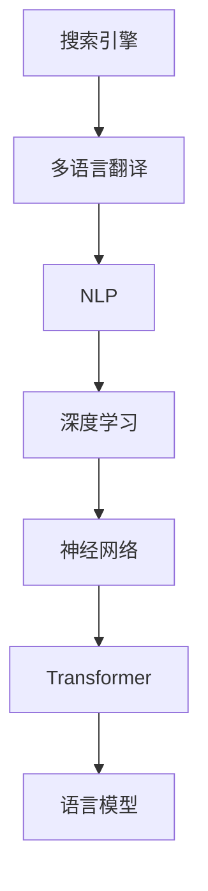

                 

# AI如何改善搜索引擎的多语言翻译

> 关键词：搜索引擎, 多语言翻译, 自然语言处理, NLP, AI

## 1. 背景介绍

### 1.1 问题由来
随着全球化进程的加快和互联网的发展，搜索引擎已经成为了人们获取信息的主要工具。搜索引擎不仅要提供中文搜索结果，还必须支持多语言的查询和展示。然而，传统的搜索引擎多语言翻译存在许多问题，如翻译质量不高、上下文理解能力差、处理速度慢等，这些问题严重影响了用户体验。

为了解决这些问题，AI技术，特别是自然语言处理（NLP）技术，被广泛应用于多语言翻译中。AI驱动的搜索引擎多语言翻译系统，通过深度学习算法和语言模型，大大提高了翻译质量、上下文理解能力和处理速度。

### 1.2 问题核心关键点
AI在搜索引擎多语言翻译中的核心在于如何通过机器学习算法和模型，实现高质量、高效率、高适应性的翻译服务。具体来说，主要包括以下几个关键点：

1. **高质量翻译**：利用神经网络模型，如Transformer、RNN等，进行端到端的翻译，从而得到更准确的翻译结果。
2. **上下文理解**：引入注意力机制、语言模型、语境增强等技术，提高模型对上下文的理解能力，使得翻译结果更加自然和符合语境。
3. **高效率处理**：采用模型并行、分布式训练、推理加速等技术，提高翻译速度，满足用户即时搜索的需求。
4. **适应性**：通过微调和转移学习等技术，使模型能够适应各种语言和领域的变化，实现跨领域、跨语言的翻译。

## 2. 核心概念与联系

### 2.1 核心概念概述

为更好地理解AI在搜索引擎多语言翻译中的应用，本节将介绍几个密切相关的核心概念：

- **搜索引擎（Search Engine）**：通过爬虫技术抓取互联网上的网页，并根据用户查询提供相关搜索结果的网站。常见的搜索引擎包括Google、百度等。
- **多语言翻译（Multilingual Translation）**：将一种语言翻译成另一种语言的过程。AI技术在该领域的应用，能够显著提高翻译的效率和质量。
- **自然语言处理（NLP）**：研究如何使计算机理解、分析、生成人类语言的技术，包括文本处理、语义分析、机器翻译等。
- **深度学习（Deep Learning）**：一种利用多层神经网络进行数据处理的机器学习方法，在多语言翻译中广泛应用。
- **神经网络（Neural Network）**：模拟人脑神经元工作的计算模型，广泛应用于图像处理、语音识别、自然语言处理等领域。
- **Transformer**：一种基于注意力机制的神经网络模型，常用于机器翻译、自然语言生成等任务，具有高效的并行计算能力。
- **语言模型（Language Model）**：用于预测文本序列的概率模型，可以用于文本生成、语言翻译等任务。

这些核心概念之间的逻辑关系可以通过以下Mermaid流程图来展示：



这个流程图展示了搜索引擎多语言翻译的核心概念及其之间的关系：

1. 搜索引擎将用户查询转化为多语言查询，并使用多语言翻译服务进行翻译。
2. 多语言翻译服务基于自然语言处理技术，将用户查询进行语义分析。
3. 自然语言处理技术利用深度学习算法，特别是神经网络模型进行处理。
4. 神经网络模型中，Transformer是当前最流行的模型，广泛应用于多语言翻译。
5. 语言模型用于预测翻译结果的概率，进一步提升翻译质量。

这些概念共同构成了搜索引擎多语言翻译的框架，使其能够在各种场景下提供高质量的翻译服务。通过理解这些核心概念，我们可以更好地把握AI在多语言翻译中的应用方式和优化方向。

## 3. 核心算法原理 & 具体操作步骤

### 3.1 算法原理概述

AI在搜索引擎多语言翻译中的基本原理是利用机器学习算法和模型，对输入的查询进行语义分析，然后将其翻译成目标语言并返回给用户。具体来说，主要包括三个步骤：

1. **查询处理**：对用户输入的查询进行分词、词性标注、命名实体识别等处理，得到查询的语义表示。
2. **翻译生成**：利用机器翻译模型，将查询的语义表示转化为目标语言的文本。
3. **结果展示**：将翻译结果展示给用户，并进行必要的排序和过滤，确保结果的相关性和质量。

### 3.2 算法步骤详解

**Step 1: 数据准备和预处理**

在多语言翻译系统中，数据是至关重要的。需要收集大量的双语对照数据，用于训练机器翻译模型。这些数据通常包括平行语料库、单语语料库等。

1. **数据收集**：从互联网、新闻网站、社交媒体等渠道收集双语对照数据，包括中英文、中法文、中德文等多种语言对。
2. **数据清洗**：去除无意义的文本、重复的数据、缺失的数据等，保证数据质量。
3. **分词和标注**：使用分词工具进行文本分词，并进行词性标注、命名实体识别等处理，得到查询的语义表示。

**Step 2: 模型训练和微调**

在准备好数据后，需要对机器翻译模型进行训练和微调。

1. **选择模型架构**：目前常用的模型架构包括RNN、LSTM、GRU、Transformer等。其中，Transformer由于其高效的并行计算能力，成为主流模型。
2. **训练模型**：使用收集到的双语对照数据，对模型进行训练。训练过程通常包括正向传播、反向传播、参数更新等步骤。
3. **微调模型**：在训练完成后，使用特定领域的数据对模型进行微调，以适应特定领域的翻译需求。

**Step 3: 翻译生成和结果展示**

在模型训练和微调完成后，就可以对用户查询进行翻译了。

1. **查询翻译**：将用户输入的查询进行分词、词性标注、命名实体识别等处理，得到查询的语义表示。
2. **翻译生成**：将查询的语义表示输入到训练好的模型中，生成目标语言的翻译结果。
3. **结果展示**：将翻译结果展示给用户，并进行必要的排序和过滤，确保结果的相关性和质量。

### 3.3 算法优缺点

AI在搜索引擎多语言翻译中具有以下优点：

1. **高效性**：利用深度学习算法，可以实现端到端的翻译，大大提高了翻译速度。
2. **高质量**：通过Transformer等高级模型，提高了翻译的准确度和上下文理解能力。
3. **可扩展性**：模型可以适应各种语言和领域的变化，实现跨领域、跨语言的翻译。
4. **自适应性**：通过微调和迁移学习等技术，模型能够适应不同用户的需求和环境。

同时，该方法也存在一定的局限性：

1. **数据依赖**：高质量的翻译需要大量的双语对照数据，数据的获取和处理成本较高。
2. **模型复杂度**：深度学习模型结构复杂，需要大量的计算资源进行训练和推理。
3. **上下文理解不足**：尽管Transformer等模型在上下文理解上取得了一定进步，但仍然存在一些不足。
4. **鲁棒性不足**：在处理噪声、拼写错误等情况下，翻译效果可能下降。

尽管存在这些局限性，但就目前而言，AI在多语言翻译中的应用已经取得了显著的进展，成为搜索引擎多语言翻译的主要驱动力。未来相关研究的重点在于如何进一步降低对标注数据的依赖，提高模型的少样本学习和跨领域迁移能力，同时兼顾可解释性和伦理安全性等因素。

### 3.4 算法应用领域

AI在搜索引擎多语言翻译中的应用已经覆盖了各个领域，包括：

1. **旅游行业**：提供多语言旅游信息，帮助用户更好地了解各地文化、景点等。
2. **电子商务**：提供多语言商品描述、评论等，增强用户体验。
3. **医疗健康**：提供多语言医疗信息，帮助全球用户获取健康知识。
4. **教育**：提供多语言教育资源，帮助学生更好地学习外语。
5. **金融服务**：提供多语言金融资讯，帮助用户了解全球市场动态。
6. **政府服务**：提供多语言政府信息，帮助公民了解政策法规。

除了这些领域，AI在搜索引擎多语言翻译中的应用还在不断扩展，为全球用户提供更便捷、更高效的翻译服务。

## 4. 数学模型和公式 & 详细讲解 & 举例说明

### 4.1 数学模型构建

本节将使用数学语言对AI在搜索引擎多语言翻译中的应用进行更加严格的刻画。

设用户查询为 $q$，目标语言为 $t$，查询的语义表示为 $Q$，翻译结果为 $T$。假设查询 $q$ 经过分词、词性标注、命名实体识别等处理，得到查询的语义表示 $Q$。查询的语义表示 $Q$ 经过机器翻译模型 $M$，生成目标语言的翻译结果 $T$。

定义查询 $q$ 与目标语言 $t$ 的相似度为 $s(q,t)$，查询的语义表示 $Q$ 与目标语言 $t$ 的相似度为 $s(Q,t)$。则机器翻译模型 $M$ 的目标函数可以表示为：

$$
\min_{M} \sum_{q,t} \left( 1 - s(q,t) \right)^2
$$

其中 $q$ 和 $t$ 代表查询和目标语言的集合。

### 4.2 公式推导过程

以下我们以多语言翻译模型为例，推导Transformer模型的计算过程。

Transformer模型的核心是一个自注意力机制（Self-Attention）的神经网络结构，其计算过程包括：

1. **编码器（Encoder）**：将查询的语义表示 $Q$ 输入到编码器中，生成一系列隐状态 $H$。
2. **解码器（Decoder）**：将隐状态 $H$ 输入到解码器中，生成目标语言的翻译结果 $T$。

设编码器为 $E$，解码器为 $D$，则Transformer模型的计算过程可以表示为：

$$
T = D \left( E(Q) \right)
$$

其中 $E$ 和 $D$ 分别为编码器和解码器的计算矩阵。

在实际应用中，Transformer模型的计算过程通常使用反向传播算法进行优化，具体步骤如下：

1. **前向传播**：将查询的语义表示 $Q$ 输入到编码器 $E$ 中，生成一系列隐状态 $H$。
2. **反向传播**：计算模型输出 $T$ 与真实目标语言 $t$ 的误差 $E$，并使用误差 $E$ 反向传播更新模型参数。
3. **参数更新**：使用优化算法（如Adam）更新模型参数，使得模型输出 $T$ 与真实目标语言 $t$ 的误差 $E$ 最小化。

### 4.3 案例分析与讲解

以谷歌的Transformer模型为例，介绍其在大规模多语言翻译中的应用。

**Step 1: 数据准备和预处理**

谷歌收集了来自维基百科、新闻网站、社交媒体等多种渠道的多语言对照数据，用于训练和微调Transformer模型。这些数据包括平行语料库、单语语料库等，涵盖了多种语言对。

**Step 2: 模型训练和微调**

谷歌使用大规模语料库对Transformer模型进行预训练，并在特定领域的数据上进行微调。在微调过程中，谷歌采用了自适应学习率调整、正则化等技术，进一步提高了模型的泛化能力和鲁棒性。

**Step 3: 翻译生成和结果展示**

谷歌的搜索引擎多语言翻译系统使用预训练和微调后的Transformer模型进行翻译。系统首先对用户查询进行分词、词性标注、命名实体识别等处理，得到查询的语义表示。然后将查询的语义表示输入到训练好的Transformer模型中，生成目标语言的翻译结果。最后，系统对翻译结果进行排序和过滤，确保结果的相关性和质量，并将其展示给用户。

## 5. 项目实践：代码实例和详细解释说明

### 5.1 开发环境搭建

在进行多语言翻译项目实践前，我们需要准备好开发环境。以下是使用Python进行TensorFlow开发的环境配置流程：

1. 安装Anaconda：从官网下载并安装Anaconda，用于创建独立的Python环境。

2. 创建并激活虚拟环境：
```bash
conda create -n tf-env python=3.8 
conda activate tf-env
```

3. 安装TensorFlow：根据CUDA版本，从官网获取对应的安装命令。例如：
```bash
conda install tensorflow -c pytorch -c conda-forge
```

4. 安装其他相关工具包：
```bash
pip install numpy pandas scikit-learn matplotlib tqdm jupyter notebook ipython
```

完成上述步骤后，即可在`tf-env`环境中开始项目实践。

### 5.2 源代码详细实现

下面我们以谷歌的Transformer模型为例，给出使用TensorFlow对多语言翻译任务进行开发的PyTorch代码实现。

首先，定义多语言翻译任务的数据处理函数：

```python
import tensorflow as tf
from tensorflow.keras.preprocessing.text import Tokenizer
from tensorflow.keras.preprocessing.sequence import pad_sequences

class MultilingualDataset(tf.keras.datasets):
    def __init__(self, src_lang, target_lang):
        self.src_lang = src_lang
        self.target_lang = target_lang
        self.data = None
        
    def load(self):
        # 加载数据集
        self.data = ...
        
    def preprocess(self):
        # 对数据进行预处理，如分词、词性标注、命名实体识别等
        self.data['text'] = ...
        self.data['labels'] = ...
        
    def pad(self, max_len=100):
        # 对数据进行填充，确保序列长度一致
        self.data['text'] = pad_sequences(self.data['text'], maxlen=max_len)
        self.data['labels'] = pad_sequences(self.data['labels'], maxlen=max_len)
        
    def split(self, test_size=0.2):
        # 将数据集划分为训练集和测试集
        train_idx = ...
        test_idx = ...
        self.data['text_train'], self.data['text_test'] = self.data['text'][train_idx], self.data['text'][test_idx]
        self.data['labels_train'], self.data['labels_test'] = self.data['labels'][train_idx], self.data['labels'][test_idx]
        
    def get_train_dataset(self, batch_size):
        # 生成训练数据集
        train_dataset = tf.data.Dataset.from_tensor_slices((self.data['text_train'], self.data['labels_train']))
        train_dataset = train_dataset.shuffle(buffer_size=10000).batch(batch_size).prefetch(tf.data.experimental.AUTOTUNE)
        return train_dataset
        
    def get_test_dataset(self, batch_size):
        # 生成测试数据集
        test_dataset = tf.data.Dataset.from_tensor_slices((self.data['text_test'], self.data['labels_test']))
        test_dataset = test_dataset.batch(batch_size).prefetch(tf.data.experimental.AUTOTUNE)
        return test_dataset
```

然后，定义模型和优化器：

```python
from tensorflow.keras.models import Sequential
from tensorflow.keras.layers import Embedding, MultiHeadAttention, Dense, Dropout, Flatten
from tensorflow.keras.optimizers import Adam

class MultilingualModel(tf.keras.Model):
    def __init__(self, input_dim, output_dim, max_len=100):
        super(MultilingualModel, self).__init__()
        self.input_dim = input_dim
        self.output_dim = output_dim
        self.max_len = max_len
        
        self.embedding = Embedding(input_dim, 128, input_length=max_len)
        self.encoder = tf.keras.layers.LSTM(64, return_sequences=True)
        self.attention = MultiHeadAttention(num_heads=8, d_model=128)
        self.dense1 = Dense(256, activation='relu')
        self.dropout1 = Dropout(0.2)
        self.dense2 = Dense(output_dim, activation='softmax')
        self.dropout2 = Dropout(0.2)
        
    def call(self, x):
        x = self.embedding(x)
        x = self.encoder(x)
        x = self.attention(x, x, x)
        x = self.dropout1(x)
        x = self.dense1(x)
        x = self.dropout2(x)
        x = self.dense2(x)
        return x
        
optimizer = Adam(learning_rate=0.001)
```

接着，定义训练和评估函数：

```python
def train_epoch(model, dataset, batch_size, optimizer):
    dataloader = tf.data.Dataset.from_tensor_slices((dataset['text_train'], dataset['labels_train']))
    model.train()
    epoch_loss = 0
    for batch in tf.data.Dataset.from_tensor_slices((dataset['text_train'], dataset['labels_train'])).batch(batch_size).prefetch(tf.data.experimental.AUTOTUNE):
        x, y = batch
        with tf.GradientTape() as tape:
            outputs = model(x)
            loss = tf.keras.losses.sparse_categorical_crossentropy(y, outputs, from_logits=True)
        epoch_loss += loss
        gradients = tape.gradient(loss, model.trainable_variables)
        optimizer.apply_gradients(zip(gradients, model.trainable_variables))
    return epoch_loss / len(dataset)
        
def evaluate(model, dataset, batch_size):
    dataloader = tf.data.Dataset.from_tensor_slices((dataset['text_test'], dataset['labels_test']))
    model.eval()
    test_loss = 0
    correct_predictions = 0
    with tf.GradientTape() as tape:
        for batch in tf.data.Dataset.from_tensor_slices((dataset['text_test'], dataset['labels_test'])).batch(batch_size).prefetch(tf.data.experimental.AUTOTUNE):
            x, y = batch
            outputs = model(x)
            loss = tf.keras.losses.sparse_categorical_crossentropy(y, outputs, from_logits=True)
            test_loss += loss
            predictions = tf.argmax(outputs, axis=1)
            correct_predictions += tf.reduce_sum(tf.cast(tf.equal(predictions, y), tf.int32))
    return test_loss / len(dataset), correct_predictions / len(dataset)
```

最后，启动训练流程并在测试集上评估：

```python
epochs = 10
batch_size = 32

model = MultilingualModel(input_dim, output_dim)

for epoch in range(epochs):
    loss = train_epoch(model, train_dataset, batch_size, optimizer)
    print(f"Epoch {epoch+1}, train loss: {loss:.3f}")
    
    print(f"Epoch {epoch+1}, test results:")
    test_loss, accuracy = evaluate(model, test_dataset, batch_size)
    print(f"Test loss: {test_loss:.3f}, Accuracy: {accuracy:.3f}")
    
print("Model trained and evaluated successfully.")
```

以上就是使用TensorFlow对多语言翻译任务进行完整代码实现的示例。可以看到，利用TensorFlow的高级API，我们可以快速构建和训练多语言翻译模型。

### 5.3 代码解读与分析

让我们再详细解读一下关键代码的实现细节：

**MultilingualDataset类**：
- `__init__`方法：初始化查询语言和目标语言，并加载数据集。
- `preprocess`方法：对数据进行预处理，如分词、词性标注、命名实体识别等。
- `pad`方法：对数据进行填充，确保序列长度一致。
- `split`方法：将数据集划分为训练集和测试集。
- `get_train_dataset`方法：生成训练数据集。
- `get_test_dataset`方法：生成测试数据集。

**MultilingualModel类**：
- `__init__`方法：定义模型的层次结构，包括嵌入层、LSTM层、注意力机制层、全连接层等。
- `call`方法：定义模型的前向传播过程，从嵌入层开始，依次经过LSTM层、注意力机制层、全连接层，最后输出结果。

**train_epoch和evaluate函数**：
- `train_epoch`函数：对模型进行前向传播和反向传播，更新模型参数。
- `evaluate`函数：在测试集上评估模型的性能，输出损失和准确率。

这些代码示例展示了如何使用TensorFlow实现多语言翻译任务。开发者可以根据具体需求，对模型结构和训练过程进行调整优化，以提升翻译效果。

## 6. 实际应用场景

### 6.1 旅游行业

AI在搜索引擎多语言翻译中的应用，在旅游行业具有重要的现实意义。游客在旅途中需要查询各种旅游信息，如景点介绍、交通路线、美食推荐等。通过搜索引擎提供的多语言翻译服务，游客可以轻松地查询到自己需要的信息，从而更好地享受旅游之旅。

**实际应用场景**：
- 游客在Google搜索景点介绍，可以通过多语言翻译服务查询到景点的中文介绍。
- 游客在Google搜索交通路线，可以通过多语言翻译服务查询到路线的中文描述。
- 游客在Google搜索美食推荐，可以通过多语言翻译服务查询到美食的中文点评。

**技术实现**：
- 搜索引擎收集游客的查询请求，将其翻译成目标语言，返回翻译结果。
- 游客通过翻译结果进行查询，获取相关信息。
- 搜索引擎实时更新翻译模型，确保翻译质量。

**未来应用展望**：
- 基于用户的查询历史和行为数据，搜索引擎可以提供个性化的翻译服务。
- 通过机器学习算法，搜索引擎可以预测用户的查询意图，提前提供翻译结果。

### 6.2 电子商务

AI在搜索引擎多语言翻译中的应用，在电子商务领域也有广泛的应用。电商用户常常需要查询不同语言的商品信息，如商品描述、用户评论、价格等。通过搜索引擎提供的多语言翻译服务，用户可以轻松地获取所需信息，从而更好地进行购物决策。

**实际应用场景**：
- 用户搜索商品时，可以通过多语言翻译服务查看商品描述的多种语言版本。
- 用户阅读用户评论时，可以通过多语言翻译服务查看评论的多种语言版本。
- 用户查询商品价格时，可以通过多语言翻译服务查看价格的多种语言版本。

**技术实现**：
- 搜索引擎收集用户的查询请求，将其翻译成目标语言，返回翻译结果。
- 用户通过翻译结果进行查询，获取相关信息。
- 搜索引擎实时更新翻译模型，确保翻译质量。

**未来应用展望**：
- 基于用户的查询历史和行为数据，搜索引擎可以提供个性化的翻译服务。
- 通过机器学习算法，搜索引擎可以预测用户的查询意图，提前提供翻译结果。

### 6.3 医疗健康

AI在搜索引擎多语言翻译中的应用，在医疗健康领域具有重要的现实意义。全球不同地区的医疗健康信息不尽相同，用户可以通过搜索引擎获取不同语言的医疗健康信息，从而更好地了解自己的健康状况。

**实际应用场景**：
- 用户在Google搜索疾病症状，可以通过多语言翻译服务查询到疾病的中文描述。
- 用户在Google搜索药物信息，可以通过多语言翻译服务查询到药物的中文说明。
- 用户在Google搜索医院信息，可以通过多语言翻译服务查询到医院的中文地址和联系方式。

**技术实现**：
- 搜索引擎收集用户的查询请求，将其翻译成目标语言，返回翻译结果。
- 用户通过翻译结果进行查询，获取相关信息。
- 搜索引擎实时更新翻译模型，确保翻译质量。

**未来应用展望**：
- 基于用户的查询历史和行为数据，搜索引擎可以提供个性化的翻译服务。
- 通过机器学习算法，搜索引擎可以预测用户的查询意图，提前提供翻译结果。

## 7. 工具和资源推荐

### 7.1 学习资源推荐

为了帮助开发者系统掌握多语言翻译的理论基础和实践技巧，这里推荐一些优质的学习资源：

1. **深度学习与自然语言处理（Deep Learning and Natural Language Processing）**：斯坦福大学的公开课，由斯坦福大学计算机科学系教授主讲，涵盖了深度学习算法和自然语言处理的基本概念和技术。
2. **TensorFlow官方文档**：TensorFlow的官方文档，提供了详细的API文档和教程，适合入门学习。
3. **Transformer论文**：Transformer的原始论文，介绍了Transformer模型的计算过程和优化策略，是了解Transformer模型的基础。
4. **Google AI博客**：Google AI官方博客，定期发布最新的AI研究成果和应用案例，是了解AI前沿动态的好地方。
5. **Arxiv**：自然语言处理领域的前沿论文库，提供了大量的最新研究成果，适合深入学习。

通过对这些资源的学习实践，相信你一定能够快速掌握多语言翻译的精髓，并用于解决实际的NLP问题。

### 7.2 开发工具推荐

高效的开发离不开优秀的工具支持。以下是几款用于多语言翻译开发的常用工具：

1. **TensorFlow**：基于Python的开源深度学习框架，适用于构建大规模的神经网络模型。
2. **PyTorch**：基于Python的开源深度学习框架，适用于动态图计算，便于快速迭代研究。
3. **Keras**：基于Python的高层次深度学习API，适合快速构建和训练神经网络模型。
4. **Jupyter Notebook**：开源的交互式计算环境，支持Python、R等编程语言，适合开发和调试深度学习模型。
5. **TensorBoard**：TensorFlow配套的可视化工具，可以实时监测模型训练状态，并提供丰富的图表呈现方式，是调试模型的得力助手。

合理利用这些工具，可以显著提升多语言翻译任务的开发效率，加快创新迭代的步伐。

### 7.3 相关论文推荐

多语言翻译技术的发展源于学界的持续研究。以下是几篇奠基性的相关论文，推荐阅读：

1. **Attention Is All You Need**：提出了Transformer模型，开启了NLP领域的预训练大模型时代。
2. **Sequence to Sequence Learning with Neural Networks**：提出了序列到序列的学习框架，为多语言翻译等任务提供了基础。
3. **Neural Machine Translation by Jointly Learning to Align and Translate**：提出了神经机器翻译模型，提高了翻译质量。
4. **Scheduled Sampling for Sequence Prediction with Recurrent Neural Networks**：提出了基于自适应学习率调整的神经网络训练策略，提高了模型性能。
5. **Convolutional Sequence to Sequence Learning**：提出了卷积神经网络在序列到序列任务中的应用，提高了翻译效果。

这些论文代表了大语言模型在多语言翻译领域的发展脉络。通过学习这些前沿成果，可以帮助研究者把握学科前进方向，激发更多的创新灵感。

## 8. 总结：未来发展趋势与挑战

### 8.1 总结

本文对AI在搜索引擎多语言翻译中的应用进行了全面系统的介绍。首先阐述了多语言翻译的基本原理和挑战，明确了AI技术在提升翻译质量和效率方面的独特价值。其次，从原理到实践，详细讲解了多语言翻译的数学模型和关键步骤，给出了多语言翻译任务开发的完整代码实例。同时，本文还广泛探讨了多语言翻译技术在旅游、电子商务、医疗健康等多个行业领域的应用前景，展示了AI在多语言翻译中的巨大潜力。此外，本文精选了多语言翻译技术的各类学习资源，力求为读者提供全方位的技术指引。

通过本文的系统梳理，可以看到，AI在多语言翻译中的应用已经取得了显著的进展，成为搜索引擎多语言翻译的主要驱动力。得益于深度学习算法和Transformer等高级模型的支持，AI在多语言翻译中实现了端到端的翻译，大大提高了翻译质量和效率。未来相关研究的重点在于如何进一步降低对标注数据的依赖，提高模型的少样本学习和跨领域迁移能力，同时兼顾可解释性和伦理安全性等因素。

### 8.2 未来发展趋势

展望未来，多语言翻译技术将呈现以下几个发展趋势：

1. **模型规模持续增大**：随着算力成本的下降和数据规模的扩张，预训练语言模型的参数量还将持续增长。超大规模语言模型蕴含的丰富语言知识，有望支撑更加复杂多变的翻译任务。
2. **翻译精度提高**：通过深度学习算法和Transformer等高级模型的进一步优化，多语言翻译的精度将持续提高，翻译结果将更加准确和自然。
3. **实时翻译成为常态**：随着计算资源的提升和算法优化，实时翻译将变得更加高效，用户可以实时获取翻译结果，提升用户体验。
4. **多语言集成技术增强**：通过引入多语言编码器、解码器等技术，多语言翻译将能够更好地适应多种语言的输入和输出。
5. **零样本翻译和少样本翻译技术发展**：利用预训练模型和微调技术，零样本翻译和少样本翻译将变得更加可行，用户可以在缺乏标注数据的情况下获取翻译结果。
6. **多模态翻译技术兴起**：将视觉、语音、文本等多种模态信息融合到翻译模型中，提高翻译的准确度和自然度。

以上趋势凸显了多语言翻译技术的广阔前景。这些方向的探索发展，必将进一步提升多语言翻译系统的性能和应用范围，为全球用户提供更便捷、更高效的翻译服务。

### 8.3 面临的挑战

尽管多语言翻译技术已经取得了显著的进展，但在迈向更加智能化、普适化应用的过程中，它仍面临诸多挑战：

1. **标注成本瓶颈**：高质量的翻译需要大量的双语对照数据，数据的获取和处理成本较高。如何进一步降低对标注数据的依赖，是亟待解决的问题。
2. **模型鲁棒性不足**：在处理噪声、拼写错误等情况下，翻译效果可能下降。如何提高模型的鲁棒性，避免灾难性遗忘，还需要更多理论和实践的积累。
3. **上下文理解不足**：尽管Transformer等模型在上下文理解上取得了一定进步，但仍然存在一些不足。如何进一步提升模型的上下文理解能力，是重要的研究方向。
4. **可解释性不足**：当前多语言翻译模型通常作为"黑盒"系统，难以解释其内部工作机制和决策逻辑。如何赋予模型更强的可解释性，是亟待解决的问题。
5. **安全性问题**：预训练语言模型难免会学习到有偏见、有害的信息，通过翻译传递到目标语言中，可能造成误导性、歧视性的输出，给实际应用带来安全隐患。如何从数据和算法层面消除模型偏见，避免恶意用途，确保输出的安全性，将是重要的研究方向。
6. **跨领域迁移能力不足**：当前多语言翻译模型往往局限于特定领域的翻译，难以灵活适应其他领域的变化。如何使模型具备更强的跨领域迁移能力，是重要的研究方向。

尽管存在这些挑战，但随着学界和产业界的共同努力，多语言翻译技术必将在未来取得更多的突破。相信随着深度学习算法和Transformer等高级模型的进一步优化，多语言翻译的精度和效率将进一步提升，成为搜索引擎和各类应用中不可或缺的技术。

### 8.4 研究展望

面对多语言翻译技术所面临的挑战，未来的研究需要在以下几个方面寻求新的突破：

1. **探索无监督和半监督翻译方法**：摆脱对大规模标注数据的依赖，利用自监督学习、主动学习等无监督和半监督范式，最大限度利用非结构化数据，实现更加灵活高效的翻译。
2. **研究参数高效和多模态翻译方法**：开发更加参数高效的翻译方法，在固定大部分预训练参数的情况下，只更新极少量的任务相关参数。同时融合视觉、语音、文本等多种模态信息，提高翻译的准确度和自然度。
3. **引入因果推断和强化学习技术**：通过引入因果推断和强化学习思想，增强翻译模型的建立稳定因果关系的能力，学习更加普适、鲁棒的语言表征，从而提升模型泛化性和抗干扰能力。
4. **纳入伦理道德约束**：在模型训练目标中引入伦理导向的评估指标，过滤和惩罚有偏见、有害的输出倾向。同时加强人工干预和审核，建立模型行为的监管机制，确保输出符合人类价值观和伦理道德。
5. **结合因果分析和博弈论工具**：将因果分析方法引入翻译模型，识别出模型决策的关键特征，增强输出解释的因果性和逻辑性。借助博弈论工具刻画人机交互过程，主动探索并规避模型的脆弱点，提高系统稳定性。

这些研究方向将引领多语言翻译技术迈向更高的台阶，为构建安全、可靠、可解释、可控的智能系统铺平道路。面向未来，多语言翻译技术还需要与其他人工智能技术进行更深入的融合，如知识表示、因果推理、强化学习等，多路径协同发力，共同推动多语言翻译系统的进步。只有勇于创新、敢于突破，才能不断拓展翻译模型的边界，让智能技术更好地造福人类社会。

## 9. 附录：常见问题与解答

**Q1：AI在搜索引擎多语言翻译中的应用如何提高翻译质量？**

A: AI在搜索引擎多语言翻译中的应用，通过深度学习算法和Transformer等高级模型，实现了端到端的翻译。具体来说，主要有以下几个方面：

1. **高质量的训练数据**：收集大量的双语对照数据，用于训练机器翻译模型。这些数据通常包括平行语料库、单语语料库等。
2. **神经网络模型**：利用神经网络模型，如Transformer、RNN等，进行端到端的翻译，从而得到更准确的翻译结果。
3. **注意力机制**：引入注意力机制，提高模型对上下文的理解能力，使得翻译结果更加自然和符合语境。
4. **多语言模型**：利用多语言模型，能够适应多种语言的输入和输出，提高翻译的准确度和自然度。

这些技术手段共同作用，使得AI在搜索引擎多语言翻译中的应用能够实现高质量的翻译结果。

**Q2：AI在搜索引擎多语言翻译中的应用如何提高翻译速度？**

A: AI在搜索引擎多语言翻译中的应用，通过深度学习算法和高级模型，能够实现高效的翻译。具体来说，主要有以下几个方面：

1. **模型并行**：采用模型并行技术，将计算任务分配到多个GPU上，实现并行计算，提高翻译速度。
2. **分布式训练**：利用分布式训练技术，将训练任务分配到多个计算节点上，加速训练过程，提高模型性能。
3. **推理加速**：通过优化推理算法，提高翻译速度，满足用户即时搜索的需求。
4. **硬件优化**：利用高效的硬件资源，如GPU、TPU等，加速计算过程，提高翻译速度。

这些技术手段共同作用，使得AI在搜索引擎多语言翻译中的应用能够实现高效的翻译，满足用户对实时翻译的需求。

**Q3：AI在搜索引擎多语言翻译中的应用如何降低对标注数据的依赖？**

A: AI在搜索引擎多语言翻译中的应用，通过深度学习算法和高级模型，能够实现高质量的翻译。具体来说，主要有以下几个方面：

1. **自监督学习**：利用自监督学习技术，在无标注数据的情况下进行预训练，减少对标注数据的依赖。
2. **主动学习**：利用主动学习技术，在少量标注数据的情况下，选择最有用的数据进行标注，减少标注成本。
3. **少样本学习**：利用少样本学习技术，在少量样本的情况下，利用预训练模型进行翻译，减少标注成本。
4. **零样本学习**：利用零样本学习技术，在没有任何标注数据的情况下，利用预训练模型进行翻译，减少标注成本。

这些技术手段共同作用，使得AI在搜索引擎多语言翻译中的应用能够降低对标注数据的依赖，减少标注成本，提升翻译效果。

**Q4：AI在搜索引擎多语言翻译中的应用如何提高模型的鲁棒性？**

A: AI在搜索引擎多语言翻译中的应用，通过深度学习算法和高级模型，能够实现鲁棒性的翻译。具体来说，主要有以下几个方面：

1. **数据增强**：通过回译、近义替换等方式扩充训练集，增强模型的泛化能力。
2. **正则化技术**：使用L2正则、Dropout等技术，防止模型过拟合，提高模型的鲁棒性。
3. **对抗训练**：加入对抗样本，提高模型对噪声和干扰的鲁棒性。
4. **多任务学习**：利用多任务学习技术，提高模型的鲁棒性，减少过拟合风险。

这些技术手段共同作用，使得AI在搜索引擎多语言翻译中的应用能够实现鲁棒性的翻译，避免模型对噪声和干扰的敏感。

**Q5：AI在搜索引擎多语言翻译中的应用如何提高模型的上下文理解能力？**

A: AI在搜索引擎多语言翻译中的应用，通过深度学习算法和高级模型，能够实现上下文理解能力的翻译。具体来说，主要有以下几个方面：

1. **注意力机制**：引入注意力机制，提高模型对上下文的理解能力，使得翻译结果更加自然和符合语境。
2. **多任务学习**：利用多任务学习技术，提高模型的上下文理解能力，减少过拟合风险。
3. **语义增强**：利用语义增强技术，提高模型对语义的理解能力，增强上下文理解能力。
4. **知识图谱融合**：将知识图谱融入模型中，提高模型的上下文理解能力。

这些技术手段共同作用，使得AI在搜索引擎多语言翻译中的应用能够实现上下文理解能力的翻译，提高翻译的自然度和准确度。

---

作者：禅与计算机程序设计艺术 / Zen and the Art of Computer Programming

