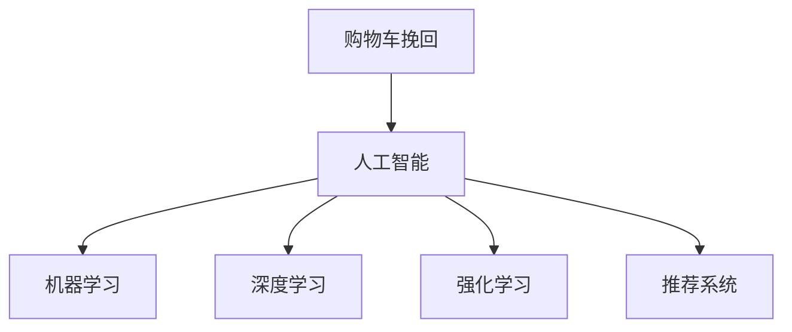

                 

# AI如何改善电商平台的购物车挽回策略

## 1. 背景介绍

在电商平台上，购物车挽回（Cart Abandonment Recovery）是提高销售额和提升用户满意度的关键策略。据统计，约有70%的在线购物者在加入购物车后没有完成购买，这对于电商平台而言，是一块巨大的潜在市场。为了降低这一比例，电商平台纷纷采用各种手段来挽回这些用户，从而挽回一部分失去的销售额。然而，传统的方法如电子邮件营销、搜索引擎优化（SEO）等效果有限，且成本较高。随着人工智能技术的不断进步，AI在电商平台的购物车挽回策略上，逐渐崭露头角，成为了一种革命性的解决方案。

## 2. 核心概念与联系

### 2.1 核心概念概述

在探索AI如何改善电商平台的购物车挽回策略前，首先需要理解几个关键概念：

- **购物车挽回（Cart Abandonment Recovery）**：电商平台为了挽回加入购物车但没有完成购买的用户，采取的一系列策略。
- **人工智能（Artificial Intelligence, AI）**：通过模拟人类智能活动，使计算机完成一些需要人类智能的任务的技术。
- **机器学习（Machine Learning, ML）**：一种通过让机器从数据中学习规律，从而做出决策的技术。
- **深度学习（Deep Learning, DL）**：一种基于神经网络的机器学习方法，用于解决复杂的数据分析问题。
- **强化学习（Reinforcement Learning, RL）**：通过奖励机制指导智能体（Agent），使其在特定环境中做出最优决策的学习方式。
- **推荐系统（Recommendation System）**：利用AI算法为用户提供个性化推荐的系统。

这些概念之间的联系可以通过以下Mermaid流程图来展示：



这个流程图展示了购物车挽回与人工智能技术的主要联系：

1. 购物车挽回策略的实现依赖于人工智能。
2. 人工智能通过机器学习、深度学习和强化学习等方法，实现自动化的数据分析和决策。
3. 推荐系统作为一种重要的AI应用，通过个性化推荐，提升用户购物体验和挽回率。

## 3. 核心算法原理 & 具体操作步骤

### 3.1 算法原理概述

基于AI的购物车挽回策略，本质上是一种强化学习问题。通过对用户的购物行为进行分析，构建奖励机制，引导智能体（电商平台）做出最优决策。具体来说，电商平台会根据用户的购物车行为（如浏览、加入、添加物品、删除等），计算一个奖励值，并根据奖励值的大小决定是否进行干预。

形式化地，设 $S$ 为状态集合，$A$ 为动作集合，$R$ 为奖励函数，则智能体 $P$ 在状态 $s$ 下，采取动作 $a$，得到下一状态 $s'$ 和奖励 $r$ 的过程可以表示为：

$$
s \rightarrow (s', r) \sim P(a|s)R(s, a, s')
$$

其中 $P(a|s)$ 表示在状态 $s$ 下采取动作 $a$ 的概率，$R(s, a, s')$ 表示在状态 $s$ 下采取动作 $a$ 并转移到状态 $s'$ 的奖励。电商平台的目标是最大化总奖励。

### 3.2 算法步骤详解

基于AI的购物车挽回策略一般包括以下几个关键步骤：

**Step 1: 数据收集与预处理**
- 收集用户加入购物车后的行为数据，包括浏览记录、加入时间、加入时长、添加到购物车物品数量、删除物品数量等。
- 对数据进行清洗和标注，去除噪声和无效数据，生成样本数据集。

**Step 2: 构建奖励函数**
- 根据用户行为构建奖励函数，例如加入购物车超过一定时间没有添加物品，则奖励降低；加入购物车后频繁删除物品，则奖励降低等。
- 设置不同的奖励阈值，例如用户完成购买则奖励最大，取消订单则奖励最小。

**Step 3: 模型训练**
- 使用强化学习算法（如Q-Learning、Deep Q-Networks等）对模型进行训练。
- 设定训练参数，如学习率、折扣因子、探索率等，调整模型训练过程中的行为策略。

**Step 4: 模型评估与优化**
- 使用历史数据对训练好的模型进行评估，测试模型的干预效果。
- 根据评估结果，对模型进行优化调整，如调整奖励函数、调整策略参数等。

**Step 5: 实时干预**
- 将训练好的模型部署到实际生产环境中。
- 实时监测用户行为，根据模型预测结果进行干预，如发送电子邮件、展示个性化推荐等。

### 3.3 算法优缺点

基于AI的购物车挽回策略具有以下优点：
1. 能够自动分析和处理大量用户行为数据，提升干预的准确性。
2. 能够实时调整干预策略，提高干预效率。
3. 能够降低人工干预成本，提高运营效率。

同时，该策略也存在以下局限性：
1. 对标注数据的要求较高，需要高质量的用户行为数据。
2. 模型的训练和部署需要一定的技术和资源投入。
3. 模型可能存在一定的偏差，干预效果受数据质量影响。

尽管如此，AI在电商平台的购物车挽回策略上展现了显著的优势，成为提高平台销售额的重要手段。

### 3.4 算法应用领域

AI在购物车挽回策略中的应用领域广泛，涉及电商平台的各个环节。以下是几个典型应用场景：

- **个性化推荐**：通过分析用户浏览和加入购物车行为，推荐相关物品，提高用户的购买意愿。
- **动态定价**：根据用户的购物车行为，动态调整物品价格，吸引用户完成购买。
- **库存管理**：预测用户的购物车行为，合理调整库存，避免缺货或过剩。
- **流失用户挽回**：对于已取消订单的用户，通过个性化邮件、优惠活动等方式，再次挽回购买意愿。
- **多渠道营销**：利用AI分析用户在不同渠道的行为数据，制定跨渠道营销策略，提高购物车挽回率。

## 4. 数学模型和公式 & 详细讲解 & 举例说明

### 4.1 数学模型构建

为了更好地理解基于AI的购物车挽回策略，本节将介绍几个关键的数学模型和公式。

设电商平台有 $N$ 个用户，每个用户有 $M$ 个物品加入购物车，令 $X_{i,j}$ 表示用户 $i$ 在物品 $j$ 上的行为数据（如加入购物车时间、加入购物车时长等），$Y_i$ 表示用户 $i$ 最终是否完成购买（0表示未完成，1表示完成）。则模型可以表示为：

$$
Y_i = f(X_{i,1}, X_{i,2}, ..., X_{i,M})
$$

其中 $f$ 为模型函数，用于预测用户是否完成购买。

### 4.2 公式推导过程

为了训练模型 $f$，我们可以使用多元逻辑回归（Multinomial Logistic Regression）作为基础模型，推导过程如下：

假设模型 $f$ 为线性函数，即 $f(X) = \beta_0 + \beta_1X_1 + \beta_2X_2 + ... + \beta_MX_M$，其中 $\beta_0, \beta_1, \beta_2, ..., \beta_M$ 为模型参数。

根据逻辑回归的公式，我们有：

$$
P(Y_i=1|X_i) = \sigma(f(X_i))
$$

其中 $\sigma(z) = \frac{1}{1+e^{-z}}$ 为sigmoid函数，用于将线性输出映射到概率值。

根据最大似然估计（Maximum Likelihood Estimation, MLE），我们可以得到参数 $\beta$ 的求解公式：

$$
\beta = \arg\max_{\beta} \prod_{i=1}^N P(Y_i=1|X_i)
$$

带入 $\beta$，我们有：

$$
P(Y_i=1|X_i) = \frac{1}{1+e^{-\beta_0 - \beta_1X_{i,1} - \beta_2X_{i,2} - ... - \beta_MX_{i,M}}}
$$

在实际应用中，我们通常使用随机梯度下降（SGD）等优化算法，对上述公式进行求解。

### 4.3 案例分析与讲解

为了更好地理解上述数学模型和公式的应用，我们举一个简单的例子：

假设电商平台有10个用户，每个用户在10个物品上分别加入购物车。我们收集了用户的加入购物车时间、加入购物车时长和最终购买结果，如表所示：

| 用户编号 | 物品编号 | 加入购物车时间(s) | 加入购物车时长(min) | 是否购买 |
| --- | --- | --- | --- | --- |
| 1 | 1 | 30 | 5 | 0 |
| 1 | 2 | 60 | 3 | 0 |
| 1 | 3 | 90 | 4 | 0 |
| 1 | 4 | 120 | 2 | 0 |
| 1 | 5 | 150 | 1 | 0 |
| 1 | 6 | 180 | 5 | 1 |
| 2 | 1 | 30 | 3 | 0 |
| 2 | 2 | 60 | 2 | 0 |
| 2 | 3 | 90 | 1 | 0 |
| 2 | 4 | 120 | 5 | 1 |
| 2 | 5 | 150 | 4 | 1 |
| 2 | 6 | 180 | 3 | 0 |
| 3 | 1 | 30 | 5 | 0 |
| 3 | 2 | 60 | 4 | 0 |
| 3 | 3 | 90 | 3 | 0 |
| 3 | 4 | 120 | 2 | 1 |
| 3 | 5 | 150 | 1 | 0 |
| 3 | 6 | 180 | 5 | 1 |
| 4 | 1 | 30 | 4 | 0 |
| 4 | 2 | 60 | 2 | 0 |
| 4 | 3 | 90 | 5 | 1 |
| 4 | 4 | 120 | 3 | 0 |
| 4 | 5 | 150 | 1 | 0 |
| 4 | 6 | 180 | 4 | 0 |
| ... | ... | ... | ... | ... |

我们可以通过上述公式，训练一个多元逻辑回归模型，用于预测用户是否完成购买。具体步骤如下：

1. 将数据转化为矩阵形式：
   $$
   X = \begin{bmatrix}
   1 & 30 & 5 \\
   1 & 60 & 3 \\
   1 & 90 & 4 \\
   \vdots & \vdots & \vdots \\
   1 & 180 & 5 \\
   \end{bmatrix},
   Y = \begin{bmatrix}
   0 \\
   0 \\
   0 \\
   \vdots \\
   1 \\
   \end{bmatrix}
   $$

2. 使用随机梯度下降算法，对参数 $\beta$ 进行求解。

3. 根据求解结果，预测新用户是否完成购买。

以上就是一个简单的基于AI的购物车挽回策略的案例分析过程。通过这个例子，我们可以更好地理解模型构建和推导过程，以及在实际应用中的操作流程。

## 5. 项目实践：代码实例和详细解释说明

### 5.1 开发环境搭建

在进行项目实践前，我们需要准备好开发环境。以下是使用Python进行Scikit-learn开发的环境配置流程：

1. 安装Anaconda：从官网下载并安装Anaconda，用于创建独立的Python环境。

2. 创建并激活虚拟环境：
```bash
conda create -n sklearn-env python=3.8 
conda activate sklearn-env
```

3. 安装Scikit-learn：
```bash
pip install scikit-learn
```

4. 安装其他相关工具包：
```bash
pip install pandas numpy matplotlib seaborn jupyter notebook
```

完成上述步骤后，即可在`sklearn-env`环境中开始项目实践。

### 5.2 源代码详细实现

下面我们以电商平台的购物车挽回策略为例，给出使用Scikit-learn库对购物车数据进行多元逻辑回归的Python代码实现。

首先，定义数据处理函数：

```python
import pandas as pd
from sklearn.model_selection import train_test_split

def load_data(file_path):
    data = pd.read_csv(file_path)
    X = data.drop('label', axis=1)
    y = data['label']
    return X, y

def train_test_split(X, y, test_size=0.2, random_state=42):
    X_train, X_test, y_train, y_test = train_test_split(X, y, test_size=test_size, random_state=random_state)
    return X_train, X_test, y_train, y_test
```

然后，定义模型训练函数：

```python
from sklearn.linear_model import LogisticRegression
from sklearn.metrics import accuracy_score

def train_model(X_train, y_train):
    model = LogisticRegression()
    model.fit(X_train, y_train)
    y_pred = model.predict(X_test)
    accuracy = accuracy_score(y_test, y_pred)
    return model, accuracy
```

最后，启动训练流程并在测试集上评估：

```python
X, y = load_data('cart_data.csv')
X_train, X_test, y_train, y_test = train_test_split(X, y)

model, accuracy = train_model(X_train, y_train)
print(f'Accuracy: {accuracy:.2f}')
```

以上就是使用Scikit-learn库进行购物车挽回策略的多元逻辑回归代码实现。可以看到，利用Scikit-learn库，我们能够以较为简洁的代码实现购物车挽回策略的建模和评估。

### 5.3 代码解读与分析

让我们再详细解读一下关键代码的实现细节：

**load_data函数**：
- 定义了数据加载函数，将CSV格式的数据文件转化为Pandas DataFrame，并将其分为输入数据和标签。

**train_test_split函数**：
- 定义了数据分割函数，使用train_test_split方法将数据集分为训练集和测试集。

**train_model函数**：
- 定义了模型训练函数，使用LogisticRegression模型进行训练，并计算模型在测试集上的准确率。

**训练流程**：
- 先加载数据，然后使用train_test_split函数对数据进行分割。
- 调用train_model函数对模型进行训练，并计算准确率。
- 最后打印出模型的准确率。

可以看到，Scikit-learn库提供的API非常简洁高效，极大地方便了模型的开发和部署。开发者可以将更多精力放在数据处理和模型优化上，而不必过多关注底层的实现细节。

## 6. 实际应用场景

### 6.1 智能推荐

基于AI的购物车挽回策略，可以应用于智能推荐系统，通过分析用户购物车行为，推荐相关物品，提高用户的购买意愿。具体来说，电商平台可以根据用户的购物车行为，生成推荐列表，推送给用户。推荐列表可以包含多种商品，如类似商品、常用商品、新品等，以多样化的形式吸引用户购买。

在技术实现上，可以使用深度学习算法，如神经网络、协同过滤等，对用户的购物车数据进行分析，生成个性化的推荐列表。推荐系统可以根据用户的历史购买记录、浏览记录、收藏记录等数据，生成不同的推荐结果，提高用户的购物体验。

### 6.2 动态定价

电商平台的定价策略对购物车挽回至关重要。传统的定价策略通常比较单一，无法根据用户行为进行动态调整。基于AI的购物车挽回策略，可以实时监测用户的购物车行为，根据行为数据进行动态定价，吸引用户完成购买。

具体来说，电商平台可以根据用户的加入购物车时间、加入购物车时长、添加物品数量等信息，动态调整物品价格。对于加入购物车时间较长的用户，可以适当降低价格，吸引其完成购买；对于频繁添加物品的用户，可以适当增加价格，避免无效订单。

### 6.3 库存管理

库存管理是电商平台运营的重要环节，如果库存不足，用户无法购买到所需商品，就无法挽回购物车。基于AI的购物车挽回策略，可以通过分析用户的购物车行为，合理调整库存，避免缺货或过剩。

具体来说，电商平台可以根据用户的购物车数据，预测未来的订单需求，动态调整库存。对于用户频繁加入购物车但未购买的物品，可以适当增加库存；对于用户不感兴趣的物品，可以适当减少库存。通过这种方式，电商平台可以实现更加精细化的库存管理，提升用户体验和运营效率。

## 7. 工具和资源推荐

### 7.1 学习资源推荐

为了帮助开发者系统掌握AI在电商平台的购物车挽回策略，这里推荐一些优质的学习资源：

1. 《Python机器学习》（Hands-On Machine Learning with Scikit-Learn and TensorFlow）：由Aurélien Géron所著，详细介绍了机器学习、深度学习在电商平台的各类应用，包括购物车挽回策略。

2. Coursera《Machine Learning》课程：由Andrew Ng主讲，是机器学习领域的经典课程，涵盖各种机器学习算法和实际应用。

3. Kaggle竞赛：参与Kaggle电商购物车挽回策略竞赛，积累实际项目经验，学习AI在电商领域的应用。

4. TensorFlow官方文档：TensorFlow的官方文档，提供了丰富的API和示例代码，是学习AI技术的重要资料。

5. PyTorch官方文档：PyTorch的官方文档，提供了各种深度学习框架的使用方法和应用案例，适合初学者和进阶开发者。

通过对这些资源的学习实践，相信你一定能够快速掌握AI在电商平台的购物车挽回策略的精髓，并用于解决实际的电商问题。

### 7.2 开发工具推荐

高效的开发离不开优秀的工具支持。以下是几款用于购物车挽回策略开发的常用工具：

1. Python：Python语言简洁高效，是数据科学和机器学习的首选语言。

2. Scikit-learn：Scikit-learn库提供了丰富的机器学习算法和模型，方便开发者快速实现各种机器学习任务。

3. TensorFlow和PyTorch：TensorFlow和PyTorch是目前最流行的深度学习框架，提供了强大的计算图和自动微分能力，适合复杂模型的开发。

4. Jupyter Notebook：Jupyter Notebook提供了交互式的代码运行环境，方便开发者调试和迭代模型。

5. TensorBoard：TensorBoard提供了可视化的模型训练和运行结果，方便开发者实时监控和调试模型。

合理利用这些工具，可以显著提升购物车挽回策略的开发效率，加快创新迭代的步伐。

### 7.3 相关论文推荐

AI在购物车挽回策略中的应用，源于学界的持续研究。以下是几篇奠基性的相关论文，推荐阅读：

1. "Collaborative Filtering for Implicit Feedback Datasets"：提出协同过滤算法，用于基于用户行为的推荐系统。

2. "Reinforcement Learning for Dynamic Pricing in E-commerce"：提出强化学习算法，用于动态定价优化。

3. "Deep Learning-based Recommendation System for E-commerce"：提出深度学习算法，用于电商平台的推荐系统。

4. "Click-Through Rate Prediction for Advertisement"：提出广告点击率预测模型，用于提升广告效果。

5. "Predicting Customer Purchase Intention using Logistic Regression"：提出逻辑回归模型，用于购物车挽回策略。

这些论文代表了大数据和AI在电商领域的应用脉络。通过学习这些前沿成果，可以帮助研究者把握学科前进方向，激发更多的创新灵感。

## 8. 总结：未来发展趋势与挑战

### 8.1 总结

本文对AI如何改善电商平台的购物车挽回策略进行了全面系统的介绍。首先阐述了购物车挽回策略的重要性，明确了AI在提升电商平台销售额和用户体验方面的独特价值。其次，从原理到实践，详细讲解了购物车挽回策略的数学模型和算法步骤，给出了购物车挽回策略的完整代码实例。同时，本文还广泛探讨了购物车挽回策略在智能推荐、动态定价、库存管理等多个应用场景中的具体实现，展示了AI在电商领域的广泛应用。

通过本文的系统梳理，可以看到，AI在购物车挽回策略上展现了显著的优势，成为提高平台销售额的重要手段。未来，伴随AI技术的不断进步，购物车挽回策略必将在电商领域发挥更加重要的作用。

### 8.2 未来发展趋势

展望未来，购物车挽回策略将呈现以下几个发展趋势：

1. 深度学习在购物车挽回策略中的应用将更加广泛。深度学习模型能够更好地处理复杂数据，提高模型预测的准确性。

2. 强化学习在购物车挽回策略中的应用将进一步深入。强化学习能够更好地处理动态环境，提升模型干预的实时性。

3. 多模态数据在购物车挽回策略中的应用将逐渐普及。通过融合用户行为数据和社交网络数据，提升模型预测的全面性和准确性。

4. 个性化推荐在购物车挽回策略中的应用将更加多样。推荐系统将更好地结合用户购物车行为，生成多样化的推荐结果，提高用户的购买意愿。

5. 实时数据处理在购物车挽回策略中的应用将更加普遍。通过实时数据处理技术，如流式计算、分布式计算等，实现模型预测的实时性。

6. 社交网络在购物车挽回策略中的应用将更加广泛。通过社交网络数据的整合，提升模型的预测准确性和干预效果。

以上趋势凸显了AI在购物车挽回策略上的巨大潜力。这些方向的探索发展，必将进一步提升电商平台的运营效率和用户满意度，推动电商平台的技术创新和市场竞争。

### 8.3 面临的挑战

尽管购物车挽回策略在电商平台上展现出了显著的优势，但在迈向更加智能化、普适化应用的过程中，它仍面临着诸多挑战：

1. 标注数据的质量和数量问题。高质量的用户行为数据是AI模型的基础，但在电商平台上，用户行为数据往往难以获得，标注数据的数量和质量问题一直困扰着模型训练。

2. 模型的复杂度和计算资源问题。深度学习模型通常比较复杂，需要大量的计算资源进行训练和推理，对硬件设备的要求较高。

3. 模型的可解释性和可控性问题。AI模型通常是“黑盒”系统，难以解释其内部工作机制和决策逻辑，用户难以理解模型的行为。

4. 模型的鲁棒性和安全性问题。AI模型容易受到输入数据的干扰，可能会输出错误的结果，导致用户体验下降。

5. 模型的隐私保护问题。电商平台需要收集用户行为数据，但如何在保护用户隐私的前提下，进行数据收集和模型训练，也是一个重要的挑战。

尽管如此，AI在电商平台的购物车挽回策略上展现了巨大的潜力，相信随着技术的不断进步和应用的深入，这些挑战终将得到解决，购物车挽回策略必将在电商领域发挥更加重要的作用。

### 8.4 研究展望

面向未来，购物车挽回策略的研究需要在以下几个方面寻求新的突破：

1. 探索多模态数据的融合方法。通过融合用户行为数据、社交网络数据、地理位置数据等多模态数据，提升模型的预测准确性和干预效果。

2. 研究强化学习的应用。通过强化学习算法，实现动态定价、库存管理、实时干预等功能，提升电商平台的运营效率。

3. 引入因果推断技术。通过因果推断技术，分析用户行为数据的因果关系，提升模型的预测精度和干预效果。

4. 探索跨领域模型的应用。通过跨领域模型的应用，提升模型的泛化能力和适应性，提升电商平台的市场竞争力。

5. 引入道德和法律约束。在模型训练和应用过程中，引入道德和法律约束，确保模型的行为符合社会价值观和法律法规。

这些研究方向的探索，必将引领购物车挽回策略走向更高的台阶，为电商平台的运营效率和用户满意度提供新的技术保障。面向未来，购物车挽回策略还需要与其他人工智能技术进行更深入的融合，如知识表示、因果推理、强化学习等，多路径协同发力，共同推动电商平台的创新和发展。只有勇于创新、敢于突破，才能不断拓展AI在电商领域的应用边界，让AI技术更好地服务于社会。

## 9. 附录：常见问题与解答

**Q1：如何选择合适的购物车挽回策略？**

A: 选择合适的购物车挽回策略需要综合考虑电商平台的业务需求、数据特点和用户行为。一般来说，有以下几种策略：

1. 个性化推荐：根据用户的历史购买记录、浏览记录、收藏记录等数据，生成个性化的推荐列表，吸引用户购买。

2. 动态定价：根据用户的购物车行为，动态调整物品价格，吸引用户完成购买。

3. 实时干预：根据用户的购物车行为，实时推送优惠券、促销活动等，吸引用户完成购买。

4. 社交网络干预：利用社交网络数据，分析用户的社交关系，生成个性化的干预策略。

5. 多渠道营销：利用多渠道数据，制定跨渠道营销策略，提升购物车挽回效果。

选择合适的策略需要根据具体情况进行分析和实验，最终选择最有效的策略。

**Q2：如何评估购物车挽回策略的效果？**

A: 评估购物车挽回策略的效果通常需要考虑以下几个指标：

1. 转化率（Conversion Rate）：指购物车用户完成购买的比例。转化率越高，策略效果越好。

2. 平均订单价值（Average Order Value, AOV）：指用户完成订单的平均金额。策略可以提升订单价值，提高平台收益。

3. 购物车保留率（Cart Retention Rate）：指购物车用户中，再次访问购物车并完成购买的比例。保留率越高，策略效果越好。

4. 购物车弃购率（Cart Abandonment Rate）：指加入购物车但未完成购买的用户比例。策略可以降低弃购率，提升转化率。

5. 点击率（Click-Through Rate, CTR）：指用户在广告或推荐中，点击干预消息的比例。CTR越高，策略效果越好。

通过综合考虑这些指标，可以全面评估购物车挽回策略的效果。

**Q3：购物车挽回策略的实现难点是什么？**

A: 购物车挽回策略的实现难点主要在于以下几个方面：

1. 标注数据的质量和数量问题：高质量的用户行为数据是模型训练的基础，但在电商平台上，数据往往难以获取，标注数据的质量和数量问题一直困扰着模型训练。

2. 模型的复杂度和计算资源问题：深度学习模型通常比较复杂，需要大量的计算资源进行训练和推理，对硬件设备的要求较高。

3. 模型的可解释性和可控性问题：AI模型通常是“黑盒”系统，难以解释其内部工作机制和决策逻辑，用户难以理解模型的行为。

4. 模型的鲁棒性和安全性问题：AI模型容易受到输入数据的干扰，可能会输出错误的结果，导致用户体验下降。

5. 模型的隐私保护问题：电商平台需要收集用户行为数据，但如何在保护用户隐私的前提下，进行数据收集和模型训练，也是一个重要的挑战。

解决这些难点需要综合考虑技术、业务、伦理等多个方面，不断优化模型和策略，提升用户体验和平台收益。

**Q4：购物车挽回策略对电商平台的重要性是什么？**

A: 购物车挽回策略对电商平台的重要性体现在以下几个方面：

1. 提升销售额：购物车挽回策略可以挽回大量未完成购买的订单，显著提升电商平台的销售额。

2. 提高用户满意度：购物车挽回策略可以提升用户的购物体验，提高用户满意度，增加用户粘性。

3. 优化库存管理：购物车挽回策略可以优化库存管理，避免缺货或过剩，提高库存周转率。

4. 提升市场竞争力：购物车挽回策略可以提升电商平台的市场竞争力，吸引更多用户，增加市场份额。

5. 实现个性化推荐：购物车挽回策略可以结合用户的购物车行为，生成个性化的推荐列表，提升推荐效果。

通过购物车挽回策略，电商平台可以最大化地利用用户行为数据，提升运营效率和用户满意度，推动业务的发展。

---

作者：禅与计算机程序设计艺术 / Zen and the Art of Computer Programming

