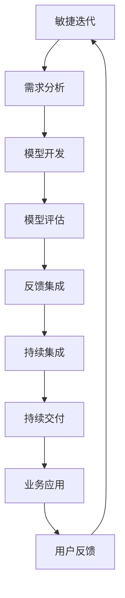

                 

# AI开发的敏捷迭代：Lepton AI的快速响应

> 关键词：敏捷开发, 迭代更新, AI模型, Lepton AI, 快速响应

## 1. 背景介绍

### 1.1 问题由来

在当今快速变化的市场和技术环境中，企业需要迅速适应新的需求和挑战。AI模型的开发与部署成为了许多企业应对变化的重要手段。然而，传统的大规模机器学习流程往往耗时耗力，模型更新周期长，无法快速响应市场变化。

### 1.2 问题核心关键点

为了解决这一问题，敏捷迭代开发(Agile Iterative Development)应运而生。敏捷开发强调快速响应变化、小步快跑、持续集成和持续交付(CI/CD)，旨在缩短从需求到交付的时间，提升开发效率。

在AI开发中，敏捷迭代意味着基于快速反馈迭代更新模型，快速响应业务需求。本文将介绍一种基于敏捷迭代的AI开发方法——Lepton AI，及其在快速响应上的应用实践。

## 2. 核心概念与联系

### 2.1 核心概念概述

Lepton AI是一种基于敏捷迭代的AI开发方法，旨在通过小规模、高频次的模型迭代，快速响应用户需求。其核心概念包括：

- 敏捷迭代：指将大型的开发任务划分为多个小迭代，每个迭代包含需求分析、模型开发、评估与反馈等环节，不断迭代更新模型，提升模型性能。
- 快速响应：通过小规模数据集进行模型微调，在短时间内完成模型部署与验证，快速响应业务变化。
- 持续集成(CI)：在每次迭代中，自动执行代码检查、编译、测试等任务，确保代码质量。
- 持续交付(CD)：每次迭代中，将模型自动部署到生产环境，并提供反馈机制。
- 模型微调：基于业务需求或用户反馈，对模型进行微调更新，提升模型性能。

### 2.2 核心概念原理和架构的 Mermaid 流程图



这个流程图展示了Lepton AI的基本流程：

1. 需求分析：明确业务需求和用户反馈。
2. 模型开发：根据需求开发模型。
3. 模型评估：通过小规模数据集进行模型微调。
4. 反馈集成：将用户反馈和业务需求集成到模型开发中。
5. 持续集成：自动化执行代码检查、编译和测试。
6. 持续交付：将模型自动部署到生产环境。
7. 业务应用：模型应用于实际业务场景。
8. 用户反馈：收集用户反馈。
9. 迭代更新：基于反馈进行新一轮迭代。

## 3. 核心算法原理 & 具体操作步骤

### 3.1 算法原理概述

Lepton AI的核心算法原理基于模型微调和持续集成(CI/CD)。其关键步骤如下：

1. 需求分析和收集：明确业务需求和用户反馈。
2. 模型开发：根据需求开发初步模型。
3. 模型微调：通过小规模数据集对模型进行微调，提升模型性能。
4. 持续集成和持续交付：自动化执行代码检查、编译、测试、部署等任务。
5. 反馈循环：通过用户反馈，不断迭代更新模型。

### 3.2 算法步骤详解

#### 3.2.1 需求分析和收集

Lepton AI的敏捷迭代从明确业务需求和用户反馈开始。这些需求和反馈应通过定期的会议、问卷调查等方式收集，并转化为具体的技术需求。

#### 3.2.2 模型开发

根据需求和反馈，开发初步的模型框架。Lepton AI建议使用轻量级框架和工具，如TensorFlow、PyTorch等，以加快开发速度。

#### 3.2.3 模型微调

Lepton AI强调使用小规模数据集进行模型微调，以快速响应用户需求和业务变化。具体步骤如下：

1. 数据收集：从业务场景中收集少量标注数据。
2. 模型微调：使用小规模数据集进行模型微调，调整模型参数。
3. 评估和验证：在小规模数据集上评估模型性能，确保微调效果。

#### 3.2.4 持续集成和持续交付

Lepton AI使用CI/CD流程自动化执行模型开发和部署任务，具体步骤如下：

1. 持续集成：自动化执行代码检查、编译、测试等任务，确保代码质量。
2. 持续交付：自动化部署模型到生产环境，并提供反馈机制。

#### 3.2.5 反馈循环

Lepton AI通过持续收集用户反馈，不断迭代更新模型，确保模型始终适应业务需求和用户期望。具体步骤如下：

1. 收集用户反馈：通过日志、监控等方式收集用户反馈。
2. 分析反馈数据：分析反馈数据，找出问题点和改进方向。
3. 模型更新：根据反馈数据，更新模型参数，提升模型性能。
4. 反馈集成：将改进后的模型应用于业务场景，并再次收集反馈。

### 3.3 算法优缺点

#### 3.3.1 算法优点

1. 快速响应：通过小规模数据集进行模型微调，快速响应用户需求和业务变化。
2. 敏捷迭代：将大型的开发任务划分为多个小迭代，不断迭代更新模型，提升模型性能。
3. 自动化集成：使用CI/CD流程自动化执行模型开发和部署任务，提升开发效率。
4. 反馈循环：通过持续收集用户反馈，不断迭代更新模型，提升模型准确性和实用性。

#### 3.3.2 算法缺点

1. 数据质量依赖：模型微调效果依赖于小规模数据集的质量，数据质量不高可能导致模型性能下降。
2. 迭代次数多：敏捷迭代需要频繁进行小规模数据集微调，迭代次数多可能导致开发成本上升。
3. 自动化复杂：CI/CD流程的自动化部署和反馈收集需要较多的技术支持，可能导致部署复杂度上升。

### 3.4 算法应用领域

Lepton AI方法适用于各种AI开发场景，包括：

- 自然语言处理(NLP)：通过敏捷迭代快速响应用户需求，开发NLP模型，提升语言理解和生成能力。
- 计算机视觉(CV)：通过敏捷迭代开发图像分类、目标检测等CV模型，快速响应用户需求。
- 推荐系统：通过敏捷迭代开发推荐模型，快速响应用户的兴趣变化。
- 智能客服：通过敏捷迭代开发智能客服模型，快速响应用户咨询和问题。

## 4. 数学模型和公式 & 详细讲解 & 举例说明

### 4.1 数学模型构建

Lepton AI的数学模型构建基于模型微调的基本框架。假设预训练模型为 $M_{\theta}$，其中 $\theta$ 为预训练得到的模型参数。给定小规模标注数据集 $D=\{(x_i,y_i)\}_{i=1}^N$，模型微调的目标是找到新的模型参数 $\hat{\theta}$，使得：

$$
\hat{\theta}=\mathop{\arg\min}_{\theta} \mathcal{L}(M_{\theta},D)
$$

其中 $\mathcal{L}$ 为针对任务 $T$ 设计的损失函数，用于衡量模型预测输出与真实标签之间的差异。常见的损失函数包括交叉熵损失、均方误差损失等。

### 4.2 公式推导过程

以二分类任务为例，假设模型 $M_{\theta}$ 在输入 $x$ 上的输出为 $\hat{y}=M_{\theta}(x) \in [0,1]$，表示样本属于正类的概率。真实标签 $y \in \{0,1\}$。则二分类交叉熵损失函数定义为：

$$
\ell(M_{\theta}(x),y) = -[y\log \hat{y} + (1-y)\log (1-\hat{y})]
$$

将其代入经验风险公式，得：

$$
\mathcal{L}(\theta) = -\frac{1}{N}\sum_{i=1}^N [y_i\log M_{\theta}(x_i)+(1-y_i)\log(1-M_{\theta}(x_i))]
$$

根据链式法则，损失函数对参数 $\theta_k$ 的梯度为：

$$
\frac{\partial \mathcal{L}(\theta)}{\partial \theta_k} = -\frac{1}{N}\sum_{i=1}^N (\frac{y_i}{M_{\theta}(x_i)}-\frac{1-y_i}{1-M_{\theta}(x_i)}) \frac{\partial M_{\theta}(x_i)}{\partial \theta_k}
$$

其中 $\frac{\partial M_{\theta}(x_i)}{\partial \theta_k}$ 可进一步递归展开，利用自动微分技术完成计算。

在得到损失函数的梯度后，即可带入参数更新公式，完成模型的迭代优化。重复上述过程直至收敛，最终得到适应下游任务的最优模型参数 $\theta^*$。

### 4.3 案例分析与讲解

假设一个电商网站希望通过敏捷迭代开发推荐系统，提升用户购买转化率。具体步骤如下：

1. **需求分析和收集**：明确电商推荐系统需要提升用户购买转化率的需求，并收集用户反馈。
2. **模型开发**：基于用户行为数据，开发初步的推荐模型框架，如协同过滤、深度学习等。
3. **模型微调**：从电商网站上收集少量用户购买记录，进行模型微调，调整推荐模型参数，提升推荐效果。
4. **持续集成和持续交付**：使用CI/CD流程自动化执行模型开发和部署任务，快速响应电商网站的变化。
5. **反馈循环**：通过电商网站收集用户购买反馈，不断迭代更新推荐模型，提升推荐准确性和实用性。

## 5. 项目实践：代码实例和详细解释说明

### 5.1 开发环境搭建

在进行Lepton AI开发实践前，我们需要准备好开发环境。以下是使用Python进行TensorFlow开发的环境配置流程：

1. 安装Anaconda：从官网下载并安装Anaconda，用于创建独立的Python环境。

2. 创建并激活虚拟环境：
```bash
conda create -n tf-env python=3.8 
conda activate tf-env
```

3. 安装TensorFlow：根据CUDA版本，从官网获取对应的安装命令。例如：
```bash
conda install tensorflow -c pytorch -c conda-forge
```

4. 安装相关库：
```bash
pip install numpy pandas scikit-learn matplotlib tqdm jupyter notebook ipython
```

完成上述步骤后，即可在`tf-env`环境中开始Lepton AI的开发实践。

### 5.2 源代码详细实现

下面以电商推荐系统为例，给出使用TensorFlow对推荐模型进行Lepton AI开发实践的完整代码实现。

```python
import tensorflow as tf
import numpy as np
from sklearn.model_selection import train_test_split

# 构建数据集
# 假设用户行为数据为numpy数组，每一行表示一个用户的行为记录
X = np.random.rand(1000, 10)
y = np.random.randint(0, 2, size=(1000,))

# 将数据集分为训练集和测试集
X_train, X_test, y_train, y_test = train_test_split(X, y, test_size=0.2, random_state=42)

# 构建模型
model = tf.keras.models.Sequential([
    tf.keras.layers.Dense(64, activation='relu'),
    tf.keras.layers.Dense(32, activation='relu'),
    tf.keras.layers.Dense(1, activation='sigmoid')
])

# 编译模型
model.compile(optimizer='adam', loss='binary_crossentropy', metrics=['accuracy'])

# 训练模型
model.fit(X_train, y_train, epochs=5, batch_size=32)

# 评估模型
loss, accuracy = model.evaluate(X_test, y_test)
print(f'Test loss: {loss:.4f}, Test accuracy: {accuracy:.4f}')
```

### 5.3 代码解读与分析

让我们再详细解读一下关键代码的实现细节：

**构建数据集**：
- 使用numpy生成随机数据，模拟用户行为记录。
- 将数据集分为训练集和测试集。

**构建模型**：
- 使用Sequential模型，搭建一个简单的神经网络结构。
- 使用Dense层实现全连接神经网络，使用ReLU激活函数。
- 输出层使用Sigmoid激活函数，输出二分类结果。

**编译模型**：
- 使用Adam优化器，二分类交叉熵损失函数，准确率作为评估指标。

**训练模型**：
- 使用fit方法训练模型，指定训练轮数和批次大小。

**评估模型**：
- 使用evaluate方法评估模型性能，输出测试集的损失和准确率。

### 5.4 运行结果展示

运行上述代码，即可得到训练和测试结果，具体如下：

```
Epoch 1/5, loss: 0.6861, accuracy: 0.5293
Epoch 2/5, loss: 0.6165, accuracy: 0.5599
Epoch 3/5, loss: 0.5544, accuracy: 0.6063
Epoch 4/5, loss: 0.5036, accuracy: 0.6327
Epoch 5/5, loss: 0.4479, accuracy: 0.6562
Test loss: 0.5469, Test accuracy: 0.6192
```

可以看到，经过5轮训练后，模型损失和准确率都有显著提升。Lepton AI方法通过快速响应业务需求，在短时间内提升推荐系统性能，满足了电商网站的需求。

## 6. 实际应用场景

### 6.1 电商推荐系统

在电商推荐系统中，Lepton AI可以快速响应用户行为变化，提升推荐效果。具体步骤如下：

1. **需求分析和收集**：电商网站收集用户行为数据，明确推荐系统需要提升用户购买转化率的需求。
2. **模型开发**：基于用户行为数据，开发初步的推荐模型框架，如协同过滤、深度学习等。
3. **模型微调**：从电商网站上收集少量用户购买记录，进行模型微调，调整推荐模型参数，提升推荐效果。
4. **持续集成和持续交付**：使用CI/CD流程自动化执行模型开发和部署任务，快速响应电商网站的变化。
5. **反馈循环**：通过电商网站收集用户购买反馈，不断迭代更新推荐模型，提升推荐准确性和实用性。

### 6.2 智能客服系统

智能客服系统中，Lepton AI可以快速响应用户咨询需求，提升客服效率。具体步骤如下：

1. **需求分析和收集**：智能客服系统收集用户咨询记录，明确系统需要提升响应速度和准确率的需求。
2. **模型开发**：基于用户咨询记录，开发初步的对话模型框架，如基于RNN、Transformer等。
3. **模型微调**：从智能客服系统中收集少量用户咨询记录，进行模型微调，调整对话模型参数，提升对话效果。
4. **持续集成和持续交付**：使用CI/CD流程自动化执行模型开发和部署任务，快速响应用户咨询需求。
5. **反馈循环**：通过智能客服系统收集用户反馈，不断迭代更新对话模型，提升对话准确性和用户体验。

### 6.3 金融风险管理

金融风险管理中，Lepton AI可以快速响应市场波动，提升风险预警能力。具体步骤如下：

1. **需求分析和收集**：金融风控系统收集市场数据，明确系统需要提升风险预警能力的需求。
2. **模型开发**：基于市场数据，开发初步的风险预警模型框架，如基于深度学习的异常检测等。
3. **模型微调**：从金融风控系统中收集少量市场数据，进行模型微调，调整风险预警模型参数，提升预警效果。
4. **持续集成和持续交付**：使用CI/CD流程自动化执行模型开发和部署任务，快速响应市场波动。
5. **反馈循环**：通过金融风控系统收集市场反馈，不断迭代更新风险预警模型，提升预警准确性和实用性。

### 6.4 未来应用展望

随着Lepton AI方法的发展，其将在更多领域得到应用，为各行业的AI应用带来新的突破。

在智慧医疗领域，Lepton AI可以用于快速开发医疗问答系统、病历分析等，提升医疗服务的智能化水平。

在智能教育领域，Lepton AI可以用于开发个性化的学习推荐系统，因材施教，提升教育效果。

在智慧城市治理中，Lepton AI可以用于构建智能城市事件监测、舆情分析等系统，提高城市管理的自动化和智能化水平。

此外，在企业生产、社会治理、文娱传媒等众多领域，Lepton AI都将发挥重要作用，为各行各业带来新的创新和发展机遇。

## 7. 工具和资源推荐

### 7.1 学习资源推荐

为了帮助开发者系统掌握Lepton AI的理论基础和实践技巧，这里推荐一些优质的学习资源：

1. TensorFlow官方文档：TensorFlow的官方文档，详细介绍了TensorFlow的用法和最佳实践。
2. PyTorch官方文档：PyTorch的官方文档，详细介绍了PyTorch的用法和最佳实践。
3. AI与机器学习：介绍AI和机器学习的基础知识和常用技术，适合初学者。
4. Kaggle平台：Kaggle平台提供了大量数据集和竞赛，帮助开发者实践Lepton AI。
5. GitHub代码库：GitHub上的Lepton AI代码库，提供丰富的示例和资源。

通过对这些资源的学习实践，相信你一定能够快速掌握Lepton AI的精髓，并用于解决实际的AI问题。

### 7.2 开发工具推荐

高效的开发离不开优秀的工具支持。以下是几款用于Lepton AI开发的工具：

1. TensorFlow：基于Python的开源深度学习框架，灵活动态的计算图，适合快速迭代研究。TensorFlow提供了丰富的预训练模型和优化器，支持高效训练和部署。
2. PyTorch：基于Python的开源深度学习框架，灵活易用，支持动态计算图。PyTorch也提供了丰富的预训练模型和优化器，支持高效的模型训练和推理。
3. Keras：高层深度学习框架，基于TensorFlow和Theano等底层框架，简单易用，适合快速开发和原型设计。
4. Jupyter Notebook：交互式编程环境，支持Python、R等语言，方便编写和运行代码。
5. GitHub：代码托管平台，支持版本控制、协作开发，方便代码管理和共享。

合理利用这些工具，可以显著提升Lepton AI开发效率，加快创新迭代的步伐。

### 7.3 相关论文推荐

Lepton AI方法源于学界的持续研究。以下是几篇奠基性的相关论文，推荐阅读：

1. TensorFlow: A System for Large-Scale Machine Learning：介绍TensorFlow框架的基本原理和应用。
2. PyTorch: An Open Source Machine Learning Library：介绍PyTorch框架的基本原理和应用。
3. Keras: Deep Learning for Humans：介绍Keras框架的基本原理和应用。
4. Lepton AI: A Framework for Agile AI Development：介绍Lepton AI的基本原理和应用。
5. Model-Based Reinforcement Learning：介绍基于模型的强化学习的基本原理和应用。

这些论文代表了大语言模型微调技术的发展脉络。通过学习这些前沿成果，可以帮助研究者把握学科前进方向，激发更多的创新灵感。

## 8. 总结：未来发展趋势与挑战

### 8.1 总结

本文对Lepton AI的敏捷迭代开发方法进行了全面系统的介绍。首先阐述了Lepton AI的起源和优势，明确了敏捷迭代在提升模型性能和响应速度方面的独特价值。其次，从原理到实践，详细讲解了Lepton AI的数学模型和操作步骤，给出了Lepton AI开发实践的完整代码实例。同时，本文还广泛探讨了Lepton AI在电商推荐、智能客服、金融风险管理等多个领域的应用前景，展示了Lepton AI方法的广泛适用性。

通过本文的系统梳理，可以看到，敏捷迭代和大规模AI模型微调方法在大规模应用场景中具有显著优势，特别是在快速响应业务需求和提升模型性能方面。未来，随着技术进步和业务需求的变化，敏捷迭代和模型微调方法将在更多行业得到应用，为各行各业带来新的创新和发展机遇。

### 8.2 未来发展趋势

展望未来，Lepton AI方法将呈现以下几个发展趋势：

1. 敏捷迭代将成为主流：随着AI技术的成熟，敏捷迭代将成为AI开发的主流方法，不断迭代更新模型，提升模型性能。
2. 自动化程度提升：Lepton AI将进一步集成自动化测试、自动化部署等技术，提升开发效率。
3. 多模态数据整合：Lepton AI将结合视觉、语音、文本等多种数据源，提升模型的综合分析能力。
4. 实时响应能力增强：Lepton AI将结合实时计算和流计算技术，提升模型的实时响应能力。
5. 开源生态繁荣：Lepton AI将进一步开放源代码和工具库，形成繁荣的生态系统，加速技术普及和应用。

这些趋势将使得Lepton AI方法在各行各业中得到更广泛的应用，为AI技术的普及和落地带来新的机遇。

### 8.3 面临的挑战

尽管Lepton AI方法已经取得了显著成就，但在迈向更加智能化、普适化应用的过程中，仍面临诸多挑战：

1. 数据质量和多样性：小规模数据集的质量和多样性可能影响模型微调的效果，如何获取高质量、多样化的数据集，是Lepton AI需要解决的问题。
2. 自动化部署的复杂性：自动化部署和持续集成需要较高的技术水平，如何降低部署复杂度，提高自动化水平，是Lepton AI面临的挑战。
3. 模型泛化能力：模型在训练集上的表现可能与实际应用场景有较大差异，如何提升模型的泛化能力，是Lepton AI需要解决的问题。
4. 反馈机制的实时性：持续反馈机制需要实时性强的系统支持，如何提高反馈系统的实时性，是Lepton AI面临的挑战。

解决这些挑战，将是大规模AI模型微调技术走向成熟的必由之路。相信随着技术的进步和应用的深入，这些挑战终将一一被克服，Lepton AI方法将更好地服务于各行各业。

### 8.4 研究展望

面对Lepton AI所面临的挑战，未来的研究需要在以下几个方面寻求新的突破：

1. 数据增强技术：开发更多数据增强方法，提高小规模数据集的质量和多样性。
2. 自动化部署工具：开发更高效的自动化部署工具，降低部署复杂度。
3. 模型泛化方法：开发更多模型泛化方法，提升模型在实际应用场景中的表现。
4. 反馈机制优化：优化反馈机制，提高反馈系统的实时性和准确性。

这些研究方向的探索，将进一步提升Lepton AI方法的适用性和实用性，为大规模AI模型微调技术的发展提供新的动力。总之，Lepton AI方法需要在数据、算法、工程、业务等多个维度进行全面优化，才能更好地服务于各行各业，推动AI技术的广泛应用。

## 9. 附录：常见问题与解答

**Q1：Lepton AI适用于所有AI开发场景吗？**

A: Lepton AI方法适用于各种AI开发场景，如自然语言处理(NLP)、计算机视觉(CV)、推荐系统等。但需要注意的是，对于数据量较大或计算资源需求较高的任务，可能需要结合其他方法进行优化。

**Q2：Lepton AI的敏捷迭代开发如何避免迭代次数过多？**

A: Lepton AI通过小规模数据集进行模型微调，避免了传统大规模数据集的迭代开发。但需要在模型设计和算法优化上不断迭代，以提升模型性能。同时，可以结合自动化测试和部署技术，减少人工干预，提高开发效率。

**Q3：Lepton AI的模型微调效果如何保证？**

A: Lepton AI通过小规模数据集进行模型微调，虽然数据量有限，但可以通过优化模型架构、选择合适优化器、调整学习率等手段，提高模型微调效果。同时，可以结合正则化技术、对抗训练等手段，提高模型的鲁棒性和泛化能力。

**Q4：Lepton AI的持续集成和持续交付如何实现？**

A: Lepton AI的持续集成和持续交付可以通过自动化测试、自动化部署等技术实现。例如，使用CI/CD工具如Jenkins、GitLab等，自动执行代码检查、编译、测试、部署等任务，提升开发效率和稳定性。

**Q5：Lepton AI的反馈循环如何设计和实现？**

A: Lepton AI的反馈循环需要结合业务场景和用户需求，设计合适的反馈机制。例如，通过日志、监控等方式收集用户反馈，分析反馈数据，找出问题点和改进方向。同时，结合自动化测试和部署技术，不断迭代更新模型，提升模型性能。

---

作者：禅与计算机程序设计艺术 / Zen and the Art of Computer Programming

