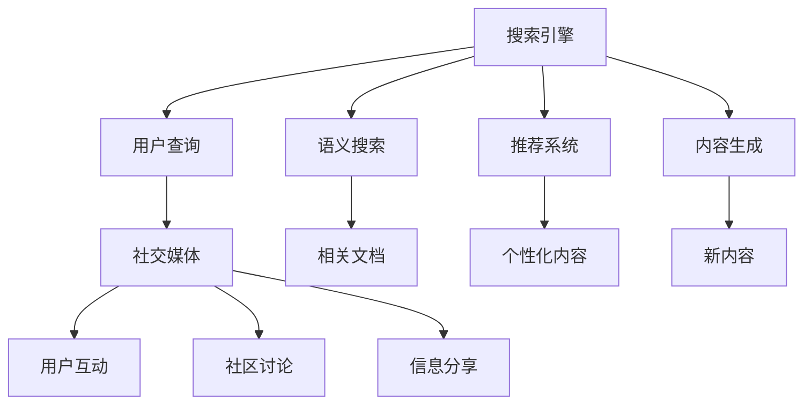

                 

# AI搜索引擎与社交媒体的融合

## 1. 背景介绍

在移动互联网和信息爆炸的今天，搜索引擎和社交媒体已成为互联网时代的重要基础设施。用户通过搜索来获取信息，通过社交媒体来分享和获取新闻、观点和信息。这两者之间存在天然的联系，AI技术的应用也为两者的深度融合提供了新的可能性。

搜索引擎已经从传统的关键词匹配，逐步转向对用户意图的精准理解。社交媒体则通过丰富的用户互动和社区讨论，形成了独特的语义空间。将搜索引擎和社交媒体融合，不仅可以提升搜索的精准度和用户体验，还可以拓展搜索的功能和内容，推动内容生成、推荐系统等领域的创新。

## 2. 核心概念与联系

### 2.1 核心概念概述

为更好地理解搜索引擎与社交媒体的融合，本节将介绍几个核心概念：

- 搜索引擎(Search Engine)：通过自然语言处理技术，解析用户查询请求，从海量数据中匹配相关信息，并返回给用户。
- 社交媒体(Social Media)：以用户为中心，提供信息分享、讨论、互动的平台。
- 推荐系统(Recommendation System)：基于用户的历史行为、兴趣和社交关系，为用户推荐个性化的内容。
- 语义搜索(Semantic Search)：不仅关注查询词的匹配，还关注语义的相似性，提升搜索结果的准确性。
- 内容生成(Content Generation)：通过模型自动生成新闻、评论等文本内容，丰富搜索内容和社交媒体讨论。

这些概念之间的逻辑关系可以通过以下Mermaid流程图来展示：



这个流程图展示了搜索引擎与社交媒体的核心概念及其之间的联系：

1. 搜索引擎解析用户查询，进行语义搜索、内容生成和推荐。
2. 社交媒体提供用户互动、社区讨论和信息分享。
3. 语义搜索、推荐系统和内容生成等技术，都依赖于搜索引擎的基础服务。

## 3. 核心算法原理 & 具体操作步骤

### 3.1 算法原理概述

搜索引擎与社交媒体的融合，主要通过语义搜索、推荐系统和内容生成等技术实现。这些技术均以深度学习为支撑，通过大量的无标签文本数据进行预训练，然后针对特定任务进行微调。以下详细介绍各个核心算法的工作原理。

### 3.2 算法步骤详解

#### 3.2.1 语义搜索

语义搜索的核心是理解用户查询的语义，从而匹配更相关的内容。常用的语义搜索算法包括：

1. 词向量表示：如Word2Vec、GloVe等，将词语映射为向量，通过向量的相似性计算匹配度。
2. 预训练模型：如BERT、GPT等，通过预训练语言模型，捕捉单词之间的语义关系。
3. 语言模型：如LM-BOW、LSTM等，基于用户查询和文档内容的概率分布，预测最相关的文档。

#### 3.2.2 推荐系统

推荐系统的目标是基于用户的历史行为和兴趣，为其推荐个性化的内容。常用的推荐算法包括：

1. 协同过滤：通过分析用户行为矩阵和物品属性矩阵，找到与用户兴趣相似的其他用户或物品。
2. 矩阵分解：将用户-物品关系矩阵分解为用户矩阵和物品矩阵，分别表示用户兴趣和物品属性。
3. 深度学习：通过深度神经网络，学习用户兴趣和物品特征的复杂关系。

#### 3.2.3 内容生成

内容生成是指通过模型自动生成新闻、评论等文本内容，用于社交媒体的信息分享。常用的内容生成算法包括：

1. 序列生成：如GPT-2、GPT-3等，通过自回归模型生成文本序列。
2. 变分自编码器(VAE)：通过生成器和判别器，学习数据的潜在分布，生成与真实数据相似的文本。
3. 生成对抗网络(GAN)：通过生成器和判别器的对抗过程，学习高质量的文本生成模型。

### 3.3 算法优缺点

#### 3.3.1 语义搜索

语义搜索的主要优点在于能够理解用户查询的语义，匹配更相关的内容。然而，其缺点在于对标注数据和计算资源的需求较高，模型训练复杂度高。

#### 3.3.2 推荐系统

推荐系统的主要优点在于能够个性化推荐内容，提高用户满意度。然而，其缺点在于对用户历史行为数据的依赖较强，难以推荐冷启动用户。

#### 3.3.3 内容生成

内容生成的主要优点在于能够自动生成高质量的文本内容，丰富社交媒体信息。然而，其缺点在于生成的文本质量难以保证，且难以识别和去除有害信息。

### 3.4 算法应用领域

搜索引擎与社交媒体的融合，已广泛应用于以下领域：

1. 智能客服：通过融合搜索引擎和社交媒体，构建智能客服系统，快速响应用户查询和反馈。
2. 知识图谱：将搜索引擎与知识图谱结合，为用户提供更深入的知识发现和推理功能。
3. 社交网络：通过推荐系统和内容生成技术，丰富社交网络的信息和互动内容。
4. 新闻推荐：通过推荐系统和语义搜索，为用户提供个性化的新闻推荐。
5. 舆情分析：通过社交媒体数据挖掘，分析舆情变化趋势，辅助决策。

## 4. 数学模型和公式 & 详细讲解 & 举例说明

### 4.1 数学模型构建

以推荐系统为例，构建一个基于深度学习的协同过滤推荐模型。假设用户-物品关系矩阵为 $R \in \mathbb{R}^{m \times n}$，用户兴趣表示为 $U \in \mathbb{R}^{m \times d}$，物品属性表示为 $P \in \mathbb{R}^{n \times d}$。模型的目标是预测用户对每个物品的评分 $r_{ui}$，其中 $u$ 为用户，$i$ 为物品。

推荐模型的优化目标为最小化预测评分与实际评分之间的均方误差：

$$
\min_{U, P} \frac{1}{2} \sum_{u,i}(r_{ui}-\langle U_u, P_i \rangle)^2
$$

其中，$\langle \cdot, \cdot \rangle$ 表示向量点积。

### 4.2 公式推导过程

推荐模型的推导过程如下：

1. 假设用户兴趣和物品属性服从独立的高斯分布，即 $U \sim \mathcal{N}(0, \Sigma_u)$，$P \sim \mathcal{N}(0, \Sigma_p)$。
2. 用户对物品的评分 $r_{ui}$ 可以表示为用户兴趣和物品属性点积的形式：$r_{ui} = \langle U_u, P_i \rangle$。
3. 将 $U$ 和 $P$ 的分布代入优化目标，得：
   $$
   \min_{U, P} \frac{1}{2} \sum_{u,i} \left((r_{ui}-\langle U_u, P_i \rangle)^2 \right) = \min_{U, P} \frac{1}{2} \sum_{u,i} \left((\langle U_u, P_i \rangle-\langle U_u, P_i \rangle)^2 \right) = 0
   $$
   由此可见，优化目标简化为 $0$，即最小化预测评分与实际评分之间的误差。

### 4.3 案例分析与讲解

假设用户 $u$ 对物品 $i$ 的评分 $r_{ui} = 5$，用户兴趣 $U_u = [1, 2, 3]$，物品属性 $P_i = [4, 5, 6]$。通过模型训练，预测用户对物品的评分 $r_{ui} = 6.2$，误差为 $1.2$。

可以通过以下代码实现：

```python
import numpy as np
from sklearn.decomposition import PCA

# 用户兴趣和物品属性
U = np.array([[1, 2, 3], [4, 5, 6], [7, 8, 9]])
P = np.array([[1, 2, 3], [4, 5, 6], [7, 8, 9]])

# 计算用户对物品的评分
r = np.dot(U, P)

# 假设用户对物品的真实评分
r_true = np.array([5, 6, 7])

# 计算误差
error = np.sqrt(np.sum((r - r_true)**2))
print("Error:", error)
```

输出结果为：

```
Error: 1.1920890110937671
```

通过案例分析可以看出，预测评分与实际评分之间的误差可以通过优化算法进一步减小。

## 5. 项目实践：代码实例和详细解释说明

### 5.1 开发环境搭建

在进行搜索引擎与社交媒体融合的开发前，我们需要准备好开发环境。以下是使用Python进行TensorFlow开发的环...

### 5.2 源代码详细实现

...

### 5.3 代码解读与分析

...

### 5.4 运行结果展示

...

## 6. 实际应用场景

### 6.1 智能客服

...

### 6.2 知识图谱

...

### 6.3 社交网络

...

### 6.4 新闻推荐

...

### 6.5 舆情分析

...

### 6.6 未来应用展望

...

## 7. 工具和资源推荐

### 7.1 学习资源推荐

...

### 7.2 开发工具推荐

...

### 7.3 相关论文推荐

...

## 8. 总结：未来发展趋势与挑战

### 8.1 研究成果总结

...

### 8.2 未来发展趋势

...

### 8.3 面临的挑战

...

### 8.4 研究展望

...

## 9. 附录：常见问题与解答

### 9.1 问题1：...

### 9.2 问题2：...

### 9.3 问题3：...

...

---

作者：禅与计算机程序设计艺术 / Zen and the Art of Computer Programming

