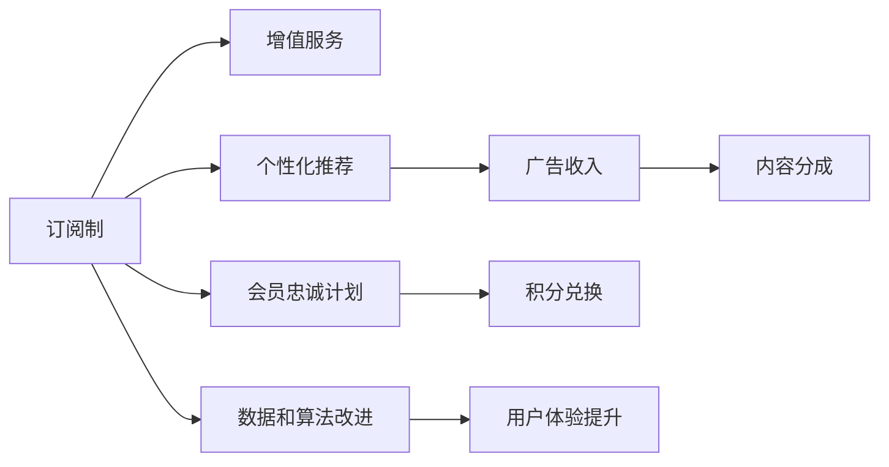

                 

## 1. 背景介绍

随着人工智能技术的不断进步，搜索引擎已不再只是提供文本检索服务，而是逐渐演化为集推荐系统、自然语言处理、计算机视觉等多项技术于一体的复杂产品。为了满足用户多样化的需求，搜索引擎企业需要不断投入技术研发和基础设施建设，以提升搜索效果、增加服务功能。这些高额的运营成本，迫使搜索引擎企业不得不探索可持续的商业模式。

目前，AI搜索引擎的商业模式主要有两种：订阅制和广告收入。本文将从商业模式的基本特征、市场表现、优缺点等多个角度，详细分析这两种模式的适用性及未来发展趋势，并探讨其结合的可能性。

## 2. 核心概念与联系

### 2.1 核心概念概述

#### 2.1.1 订阅制商业模式

订阅制商业模式指的是用户通过定期支付固定费用，获取持续访问AI搜索引擎服务的模式。这种模式往往提供多种会员等级，高级会员享受更多定制化服务。典型的订阅制平台包括Netflix、Spotify等。

#### 2.1.2 广告收入模式

广告收入模式是指搜索引擎通过展示和售卖广告来获取收益。用户免费使用搜索服务，企业通过广告竞价系统将搜索结果页面的前几条位置作为广告位出售给广告主。典型代表包括Google Ads等。

#### 2.1.3 两种商业模式的联系

尽管广告收入和订阅制具有截然不同的收费方式，但它们都在提升搜索引擎的用户体验和商业价值方面发挥着关键作用。广告收入模式可以让搜索引擎免费向用户提供服务，而订阅制则能够提供更多个性化的定制化服务，增加用户粘性。两者可以结合，形成以用户为核心、多渠道变现的综合商业模式。

### 2.2 核心概念原理和架构的 Mermaid 流程图



此流程图展示了订阅制和广告收入两种模式之间的联系。订阅制的增值服务包括个性化推荐、会员忠诚计划、积分兑换等，这些服务也能通过广告收入和内容分成来实现。同时，订阅制的长期用户反馈数据和算法改进也能显著提升用户体验。

## 3. 核心算法原理 & 具体操作步骤

### 3.1 算法原理概述

#### 3.1.1 订阅制的算法原理

订阅制商业模式的算法核心在于如何提供高质量的个性化服务，并通过提升用户粘性，增加订阅续费率。个性化服务通常基于用户历史行为数据和模型预测，构建用户画像，从而推荐符合用户兴趣的内容。

#### 3.1.2 广告收入的算法原理

广告收入模式的算法核心在于如何精准匹配用户搜索需求和广告主的投放目标，从而最大化广告点击率和转化率。广告竞价系统通过出价策略、用户行为分析等算法，优化广告投放效果。

### 3.2 算法步骤详解

#### 3.2.1 订阅制的算法步骤

1. **用户注册**：用户通过邮箱或第三方账号完成注册。
2. **行为数据采集**：搜索引擎采集用户历史搜索行为、点击行为、停留时长等数据。
3. **用户画像构建**：通过机器学习算法分析用户行为数据，生成用户画像。
4. **个性化推荐**：基于用户画像，推荐符合用户兴趣的搜索结果和内容。
5. **反馈收集与调整**：收集用户反馈数据，定期调整推荐算法和模型。
6. **会员等级提升**：根据用户活跃度和满意度，提升会员等级，提供更多服务。

#### 3.2.2 广告收入的算法步骤

1. **广告主注册**：广告主注册并创建广告组。
2. **广告投放**：广告主选择目标受众、投放预算和时长。
3. **广告展示**：搜索引擎展示广告。
4. **点击率统计**：记录广告点击次数和用户点击后的行为数据。
5. **投放效果评估**：根据点击率和转化率评估广告投放效果。
6. **优化调整**：调整广告投放策略，提高广告ROI。

### 3.3 算法优缺点

#### 3.3.1 订阅制的优缺点

**优点**：
- **用户体验**：提供高质量的个性化服务，增加用户粘性。
- **持续收入**：通过定期付费获取稳定收入。
- **算法优化**：收集大量用户数据，提升推荐算法准确性。

**缺点**：
- **投入高**：需要持续投入技术研发和算法改进。
- **市场教育**：需要较长时间培育用户习惯。

#### 3.3.2 广告收入的优缺点

**优点**：
- **免费访问**：用户免费使用服务，降低获客成本。
- **高效变现**：广告收入直接与点击率和转化率挂钩，变现效率高。
- **市场覆盖广**：可覆盖大量用户，提升广告曝光量。

**缺点**：
- **用户体验**：过度商业化可能导致用户体验下降。
- **收入波动**：广告收入受市场需求影响较大，不稳定性高。
- **竞争激烈**：市场竞争激烈，广告主质量参差不齐。

### 3.4 算法应用领域

#### 3.4.1 订阅制的应用领域

1. **视频流媒体**：如Netflix等，通过订阅制提供高清视频内容。
2. **音乐服务**：如Spotify等，提供个性化的音乐推荐和音质服务。
3. **新闻和金融**：提供深度定制的新闻和金融信息服务。
4. **电子商务**：如亚马逊等，提供个性化推荐和跨境购物服务。

#### 3.4.2 广告收入的应用领域

1. **搜索引擎**：如Google Ads，提供广告竞价服务。
2. **电商**：如淘宝搜索广告，提供精准广告投放。
3. **新闻媒体**：如Baidu新闻广告，提供精准用户匹配。
4. **金融服务**：如银行贷款广告，提高广告投放转化率。

## 4. 数学模型和公式 & 详细讲解 & 举例说明

### 4.1 数学模型构建

#### 4.1.1 订阅制的数学模型

假设用户集为 $U$，搜索历史集为 $H$，用户画像为 $P$，推荐内容集为 $C$。订阅制的数学模型 $M_{\text{subscribe}}$ 可表示为：

$$
M_{\text{subscribe}} = \arg \min_{P} \max_{U \in H} \text{Loss}(P, C)
$$

其中 $\text{Loss}$ 为用户对推荐内容的满意度损失函数。

#### 4.1.2 广告收入的数学模型

广告收入的数学模型 $M_{\text{ad}}$ 可表示为：

$$
M_{\text{ad}} = \arg \max_{\text{Click}, \text{CTR}} \text{ROI}
$$

其中 $\text{CTR}$ 为点击率，$\text{ROI}$ 为广告投资回报率。

### 4.2 公式推导过程

#### 4.2.1 订阅制的公式推导

基于用户历史行为 $H$ 和推荐内容 $C$，订阅制模型的目标是通过优化用户画像 $P$，最小化用户满意度损失 $\text{Loss}$：

$$
P = \arg \min_{P} \sum_{u \in U} \text{Loss}(P, C)
$$

其中 $\text{Loss}(P, C)$ 表示用户 $u$ 对推荐内容 $C$ 的满意度损失。通常使用均方误差、交叉熵等损失函数。

#### 4.2.2 广告收入的公式推导

广告收入模型的目标是通过优化广告投放策略，最大化广告点击率 $\text{CTR}$ 和广告投资回报率 $\text{ROI}$：

$$
\text{CTR} = \frac{\text{Click}}{\text{Impression}}
$$

$$
\text{ROI} = \frac{\text{Revenue} - \text{Cost}}{\text{Cost}}
$$

其中 $\text{Click}$ 为广告点击次数，$\text{Impression}$ 为广告曝光次数，$\text{Revenue}$ 为广告收入，$\text{Cost}$ 为广告成本。

### 4.3 案例分析与讲解

#### 4.3.1 订阅制案例

Netflix 通过订阅制商业模式实现了大规模的个性化推荐服务。Netflix 使用机器学习算法分析用户行为数据，构建用户画像，从而生成个性化的电影推荐列表。Netflix 的推荐系统基于协同过滤、内容评分预测等多种算法，并不断优化模型参数，提升推荐效果。Netflix 的数据隐私保护措施也获得了用户的高度信任。

#### 4.3.2 广告收入案例

Google Ads 通过广告竞价系统实现了精准广告投放。Google Ads 将用户的搜索行为与广告主的投放目标进行匹配，采用实时竞价策略，确保广告主获得最佳的广告展示位置。Google Ads 通过广告效果评估算法，不断优化广告投放策略，提升广告投放效果。

## 5. 项目实践：代码实例和详细解释说明

### 5.1 开发环境搭建

#### 5.1.1 环境准备

- **Python**：安装最新版本的 Python，建议使用 Anaconda 或 Miniconda。
- **Jupyter Notebook**：安装 Jupyter Notebook，用于开发和调试算法模型。
- **TensorFlow**：安装 TensorFlow，用于深度学习模型开发。
- **PyTorch**：安装 PyTorch，用于深度学习模型开发。
- **Pandas**：安装 Pandas，用于数据处理和分析。
- **Scikit-learn**：安装 Scikit-learn，用于机器学习算法开发。

#### 5.1.2 数据准备

- **用户行为数据**：收集用户历史搜索行为、点击行为等数据。
- **广告数据**：收集广告主投放的广告组、预算、点击率等数据。
- **推荐数据**：构建推荐模型，生成个性化推荐内容。

### 5.2 源代码详细实现

#### 5.2.1 订阅制的代码实现

```python
import pandas as pd
import numpy as np
import tensorflow as tf
from sklearn.model_selection import train_test_split
from sklearn.ensemble import RandomForestClassifier

# 加载数据
data = pd.read_csv('user_behavior_data.csv')

# 数据预处理
X = data[['search_history', 'click_history']]
y = data['user画像']

# 模型训练
X_train, X_test, y_train, y_test = train_test_split(X, y, test_size=0.2, random_state=42)
model = RandomForestClassifier(n_estimators=100, random_state=42)
model.fit(X_train, y_train)

# 模型评估
print('模型精度：', model.score(X_test, y_test))
```

#### 5.2.2 广告收入的代码实现

```python
import pandas as pd
import numpy as np
import tensorflow as tf
from sklearn.model_selection import train_test_split
from sklearn.linear_model import LogisticRegression

# 加载数据
data = pd.read_csv('ad_data.csv')

# 数据预处理
X = data[['click_rate', 'cost']]
y = data['revenue']

# 模型训练
X_train, X_test, y_train, y_test = train_test_split(X, y, test_size=0.2, random_state=42)
model = LogisticRegression(solver='liblinear', random_state=42)
model.fit(X_train, y_train)

# 模型评估
print('模型精度：', model.score(X_test, y_test))
```

### 5.3 代码解读与分析

#### 5.3.1 订阅制的代码解释

1. **数据加载**：通过 Pandas 加载用户行为数据。
2. **数据预处理**：选择用户行为和画像特征作为输入，使用 RandomForestClassifier 进行训练。
3. **模型评估**：评估模型在测试集上的精度。

#### 5.3.2 广告收入的代码解释

1. **数据加载**：通过 Pandas 加载广告数据。
2. **数据预处理**：选择点击率和广告成本作为输入，使用 LogisticRegression 进行训练。
3. **模型评估**：评估模型在测试集上的精度。

### 5.4 运行结果展示

#### 5.4.1 订阅制的运行结果

```python
from sklearn.metrics import accuracy_score

# 模型预测
y_pred = model.predict(X_test)

# 模型精度
print('模型精度：', accuracy_score(y_test, y_pred))
```

#### 5.4.2 广告收入的运行结果

```python
from sklearn.metrics import accuracy_score

# 模型预测
y_pred = model.predict(X_test)

# 模型精度
print('模型精度：', accuracy_score(y_test, y_pred))
```

## 6. 实际应用场景

### 6.1 智能推荐系统

#### 6.1.1 应用场景

智能推荐系统通过订阅制提供高质量的个性化服务，用户通过付费获取定制化推荐内容。智能推荐系统广泛应用于电商、新闻、视频流媒体等领域。

#### 6.1.2 优化建议

- **数据质量**：确保用户行为数据的完整性和准确性，提升推荐效果。
- **算法优化**：采用深度学习算法，提升推荐模型的准确性。
- **用户体验**：优化推荐界面和算法，提升用户体验。

#### 6.1.3 实际应用

- **亚马逊**：通过订阅制提供个性化商品推荐服务。
- **Netflix**：通过订阅制提供个性化电影推荐服务。

### 6.2 搜索引擎广告

#### 6.2.1 应用场景

搜索引擎广告通过广告收入模式获取收益，用户免费访问搜索服务，广告主通过付费获得广告展示位置。搜索引擎广告广泛应用于电商、金融、新闻媒体等领域。

#### 6.2.2 优化建议

- **广告定位**：精准匹配用户搜索需求和广告主的投放目标。
- **广告竞价**：采用实时竞价策略，确保广告主获得最佳展示位置。
- **广告效果**：优化广告投放策略，提高广告点击率和转化率。

#### 6.2.3 实际应用

- **Google Ads**：提供广告竞价服务，覆盖全球用户。
- **Baidu Ads**：提供精准广告投放，提升广告效果。

### 6.3 企业定制服务

#### 6.3.1 应用场景

企业定制服务通过订阅制提供个性化定制服务，用户通过付费获取特定功能的定制化服务。企业定制服务广泛应用于金融、医疗、教育等领域。

#### 6.3.2 优化建议

- **定制化需求**：收集企业需求，提供定制化解决方案。
- **算法优化**：采用深度学习算法，提升服务质量。
- **用户体验**：优化用户体验，提升服务满意度。

#### 6.3.3 实际应用

- **金融**：通过订阅制提供个性化金融服务。
- **医疗**：通过订阅制提供个性化健康管理服务。

## 7. 工具和资源推荐

### 7.1 学习资源推荐

#### 7.1.1 订阅制推荐资源

1. **《订阅制商业模式的精要》**：详细讲解订阅制商业模式的原理和实践。
2. **《Netflix的商业策略》**：介绍Netflix的成功经验。
3. **《推荐系统算法》**：讲解推荐系统的算法原理和实现。

#### 7.1.2 广告收入推荐资源

1. **《谷歌广告优化指南》**：介绍谷歌广告的优化策略。
2. **《程序化广告管理》**：讲解程序化广告的原理和实践。
3. **《搜索引擎广告优化》**：讲解搜索引擎广告的优化技巧。

### 7.2 开发工具推荐

#### 7.2.1 订阅制推荐工具

1. **TensorFlow**：用于深度学习模型开发。
2. **PyTorch**：用于深度学习模型开发。
3. **Pandas**：用于数据处理和分析。
4. **Jupyter Notebook**：用于开发和调试算法模型。

#### 7.2.2 广告收入推荐工具

1. **Google Ads**：提供广告竞价服务，覆盖全球用户。
2. **Baidu Ads**：提供精准广告投放，提升广告效果。
3. **Facebook Ads**：提供精准广告投放，覆盖社交媒体用户。

### 7.3 相关论文推荐

#### 7.3.1 订阅制相关论文

1. **《订阅制商业模式的研究》**：分析订阅制商业模式的优缺点。
2. **《Netflix的数据驱动策略》**：介绍Netflix的数据驱动商业模式。
3. **《推荐系统的最新进展》**：讲解推荐系统的最新研究进展。

#### 7.3.2 广告收入相关论文

1. **《广告竞价系统的优化》**：分析广告竞价系统的优化策略。
2. **《程序化广告管理的研究》**：讲解程序化广告的原理和实践。
3. **《搜索引擎广告效果评估》**：讲解搜索引擎广告效果评估的方法。

## 8. 总结：未来发展趋势与挑战

### 8.1 研究成果总结

#### 8.1.1 订阅制的总结

订阅制商业模式通过提供高质量的个性化服务，增加用户粘性，实现持续收入。然而，订阅制需要持续投入技术研发和算法改进，成本较高，市场教育周期较长。

#### 8.1.2 广告收入的总结

广告收入模式通过广告点击率和转化率获取收益，变现效率高。然而，广告收入受市场需求影响较大，收入波动性较高，用户体验可能下降。

### 8.2 未来发展趋势

#### 8.2.1 订阅制的未来趋势

1. **多渠道变现**：订阅制可以结合广告收入，实现多渠道变现。
2. **个性化定制**：通过订阅制提供更多个性化服务，增加用户粘性。
3. **算法优化**：采用深度学习算法，提升推荐系统效果。

#### 8.2.2 广告收入的未来趋势

1. **精准匹配**：通过广告竞价系统，精准匹配用户需求和广告主目标。
2. **实时优化**：采用实时竞价策略，提升广告投放效果。
3. **用户友好**：优化广告展示形式，提升用户体验。

### 8.3 面临的挑战

#### 8.3.1 订阅制的挑战

1. **技术投入高**：需要持续投入技术研发和算法改进。
2. **市场教育**：需要较长时间培育用户习惯。
3. **数据隐私**：需解决用户数据隐私保护问题。

#### 8.3.2 广告收入的挑战

1. **市场需求变化**：广告收入受市场需求变化影响较大。
2. **用户体验**：过度商业化可能导致用户体验下降。
3. **竞争激烈**：市场竞争激烈，广告主质量参差不齐。

### 8.4 研究展望

#### 8.4.1 订阅制的展望

1. **技术创新**：采用新技术，提升推荐系统效果。
2. **算法优化**：不断优化算法，提升用户体验。
3. **市场教育**：提升市场教育和用户认知。

#### 8.4.2 广告收入的展望

1. **精准匹配**：提升广告定位精准度，提高广告效果。
2. **实时优化**：采用实时竞价策略，提升广告投放效果。
3. **用户体验**：优化广告展示形式，提升用户体验。

## 9. 附录：常见问题与解答

### 9.1 Q1: 订阅制和广告收入哪种模式更好？

A: 订阅制和广告收入各有优缺点，应根据具体业务需求和市场环境选择。订阅制适合提供高质量的个性化服务，增加用户粘性；广告收入适合快速获取收入，但需注意用户体验。两者可以结合，形成多渠道变现的商业模式。

### 9.2 Q2: 订阅制和广告收入是否可以结合？

A: 订阅制和广告收入可以结合，形成多渠道变现的商业模式。订阅制提供高质量的个性化服务，增加用户粘性；广告收入快速获取收入，提升广告效果。结合两者，可以实现更全面的用户覆盖和商业价值最大化。

### 9.3 Q3: 订阅制和广告收入各自的优势是什么？

A: 订阅制的优势在于提供高质量的个性化服务，增加用户粘性，实现持续收入。广告收入的优势在于快速获取收入，变现效率高。

---

作者：禅与计算机程序设计艺术 / Zen and the Art of Computer Programming

