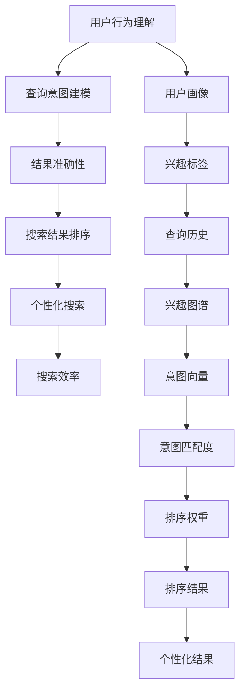

                 

## 1. 背景介绍

搜索引擎作为互联网时代的信息入口，其重要性不言而喻。当前，各类搜索引擎正面临着个性化、准确性和效率三个关键挑战。

### 1.1 问题由来
随着移动互联网、物联网的普及，用户对信息搜索的需求不断增长，搜索引擎需要更加智能、高效地满足用户需求。然而，现有搜索引擎在个性化推荐、搜索结果准确性和搜索效率方面仍有较大提升空间。

**个性化推荐**：用户的搜索需求是多变的，搜索引擎需要根据用户的搜索历史、兴趣标签等因素，提供符合用户个性化需求的搜索结果。当前主流搜索引擎多采用简单的冷启动机制，难以快速适应用户需求的变化。

**搜索结果准确性**：搜索结果的准确性直接影响用户的满意度。虽然现有的搜索引擎已经通过各种算法提升了查询匹配度，但仍存在误判、漏判等情况。且不同用户的查询意图和信息需求差异较大，统一标准的匹配算法难以满足不同用户的多样化需求。

**搜索效率**：用户对搜索响应速度、搜索结果更新频率等有较高要求。现有搜索引擎在处理大规模数据集时，存在查询响应延迟、搜索效率低下等问题。

### 1.2 问题核心关键点
搜索技术涉及用户行为理解、查询意图建模、搜索结果排序等多个环节，需要跨学科融合，利用大数据、深度学习等前沿技术，才能更好地满足用户需求。

1. **用户行为理解**：理解用户输入的查询语句背后的真实意图和需求，是搜索引擎提供个性化服务的前提。
2. **查询意图建模**：将用户查询转化为可计算形式，构建形式化的查询模型，是准确搜索结果的基础。
3. **搜索结果排序**：排序算法应兼顾个性化、准确性、效率等多个维度，是提升用户搜索体验的关键。

## 2. 核心概念与联系

### 2.1 核心概念概述

为更好地理解个性化、准确性和效率相结合的搜索技术，本节将介绍几个关键概念及其相互联系：

1. **个性化搜索**：利用用户的查询历史、兴趣标签等信息，提供符合用户个性化需求的搜索结果。个性化搜索需要动态理解用户需求，并实时更新推荐结果，以达到高度定制化效果。
2. **结果准确性**：搜索引擎应确保搜索结果与用户查询意图高度匹配，避免误判、漏判等情况。准确性提升依赖于更加精准的意图建模和更高效的排序算法。
3. **搜索效率**：搜索过程应尽量减少延迟、降低计算和存储成本，以提高搜索响应速度和系统性能。
4. **用户行为理解**：分析用户行为数据，提取用户的兴趣、偏好等特征，构建用户画像。
5. **查询意图建模**：将用户查询转换为形式化的向量或表示，方便计算匹配度。
6. **排序算法**：根据不同用户的查询意图和搜索结果特征，设计高效的排序算法。

这些概念之间的关系可以通过以下Mermaid流程图展示：



这个流程图展示了从用户行为理解到个性化搜索的整个过程：

1. 用户行为理解：通过分析用户历史行为数据，构建用户画像和兴趣图谱。
2. 查询意图建模：将用户查询转化为意图向量，用于计算匹配度。
3. 结果准确性：通过意图匹配度和排序权重，提升搜索结果的准确性。
4. 搜索结果排序：根据用户画像和意图匹配度，设计高效排序算法。
5. 个性化搜索：结合用户画像和个性化需求，提供动态更新的搜索结果。

这些概念共同构成了个性化、准确性、效率相结合的搜索技术框架，使得搜索引擎能够更好地满足用户需求。

## 3. 核心算法原理 & 具体操作步骤
### 3.1 算法原理概述

个性化、准确性和效率相结合的搜索技术，通常采用一种以用户行为理解为基础的动态搜索策略。该策略的核心思想是：

1. **动态理解用户需求**：利用用户行为数据，实时更新用户画像和兴趣图谱，动态地捕捉用户需求的变化。
2. **查询意图建模**：将用户查询转化为形式化的意图向量，用于计算匹配度和排序权重。
3. **结果准确性和个性化**：通过意图匹配度和用户画像，提高搜索结果的准确性和个性化程度。
4. **高效排序算法**：设计高效的排序算法，确保在满足个性化和准确性的同时，提升搜索效率。

这种搜索策略的数学模型可以表示为：

$$
S = \mathop{\arg\min}_{Q_i} \sum_{i=1}^{n} \ell(Q_i, R_i)
$$

其中 $S$ 为搜索结果集合，$Q_i$ 为用户查询向量，$R_i$ 为匹配到的搜索结果向量，$\ell$ 为损失函数，用于衡量查询与结果的匹配度。

### 3.2 算法步骤详解

**步骤1：用户行为理解**

1. **数据收集**：收集用户的历史查询、点击、收藏、分享等行为数据，构建行为图谱。
2. **特征提取**：提取用户兴趣标签、浏览历史、搜索时间等特征。
3. **用户画像**：基于用户行为数据，构建用户画像和兴趣图谱，并动态更新。

**步骤2：查询意图建模**

1. **查询预处理**：对用户查询进行分词、去停用词、词干提取等预处理。
2. **意图编码**：利用词向量、BERT等模型，将查询转化为意图向量 $Q_i$。
3. **意图匹配度**：通过计算查询与所有已知结果的匹配度，得到意图匹配度 $\hat{Q_i}$。

**步骤3：结果准确性和个性化**

1. **意图向量计算**：根据用户画像和查询意图向量，计算每个结果的意图向量。
2. **匹配度排序**：利用排序算法，按照匹配度对结果进行排序。
3. **个性化推荐**：根据排序结果，提供符合用户个性化需求的推荐。

**步骤4：高效排序算法**

1. **排序算法设计**：利用倒排索引、BM25算法等高效排序算法，提升搜索效率。
2. **资源优化**：采用多线程、分布式计算等技术，优化搜索资源。
3. **缓存策略**：采用缓存机制，减少重复查询的计算和存储开销。

### 3.3 算法优缺点

基于用户行为理解的动态搜索策略，具有以下优点：

1. **高度个性化**：根据用户历史行为和实时兴趣，提供高度定制化的搜索结果。
2. **高准确性**：通过意图向量计算和匹配度排序，确保搜索结果与用户需求高度匹配。
3. **高效性**：通过优化排序算法和资源管理，提升搜索响应速度和效率。

但该策略也存在一些缺点：

1. **数据隐私问题**：用户行为数据包含大量隐私信息，需要严格的保护措施。
2. **算法复杂性**：涉及用户画像构建、意图向量计算、排序算法设计等多个环节，算法实现较为复杂。
3. **计算开销**：意图向量和意图匹配度计算，涉及复杂模型和大量计算，需要高性能硬件支持。
4. **泛化能力不足**：难以处理超出已有数据覆盖范围的新查询和新用户，需要持续的数据积累和算法迭代。

### 3.4 算法应用领域

基于用户行为理解的动态搜索策略，已经在多个领域得到了广泛应用，例如：

1. **电商推荐系统**：电商网站通过分析用户的浏览和购买行为，推荐符合用户需求的商品。
2. **新闻推荐系统**：新闻平台根据用户的阅读习惯和兴趣，推荐相关的新闻资讯。
3. **音乐推荐系统**：音乐平台根据用户的听歌历史和偏好，推荐新的音乐作品。
4. **视频推荐系统**：视频网站通过分析用户的观看行为，推荐相关视频内容。
5. **智能客服系统**：客服系统根据用户的咨询历史和实时意图，提供个性化咨询服务。
6. **社交媒体推荐**：社交平台根据用户的行为数据，推荐相关的内容和用户。

此外，基于用户行为理解的动态搜索技术还在广告投放、信息检索、内容推荐等多个领域得到了应用，极大地提升了用户体验和平台价值。

## 4. 数学模型和公式 & 详细讲解  
### 4.1 数学模型构建

基于用户行为理解的搜索模型可以表示为：

$$
S = \mathop{\arg\min}_{Q_i} \sum_{i=1}^{n} \ell(Q_i, R_i) \text{subject to} \{U_{i} \in \mathcal{U}, R_{i} \in \mathcal{R}\}
$$

其中，$U_i$ 为用户画像，$\mathcal{U}$ 为用户画像空间，$R_i$ 为搜索结果，$\mathcal{R}$ 为搜索结果空间。

为了更好地表达模型的数学结构和逻辑，将上述模型拆分为用户行为理解、查询意图建模、结果排序等子模块：

1. **用户画像**：用户行为数据 $D=\{ (x, y) \}$ 中，$x$ 为行为特征，$y$ 为标签（如兴趣、行为时间等）。通过数据生成模型，生成用户画像 $U_i$。
2. **查询意图建模**：用户查询 $q$ 通过查询转换器 $F_q$，转换为查询向量 $Q_i$。
3. **结果排序**：搜索结果 $R_i$ 通过排序算法 $H_r$，计算匹配度 $\hat{Q_i}$。
4. **匹配度计算**：匹配度 $\ell(Q_i, R_i)$ 计算方式根据具体应用场景而定，如交叉熵损失、余弦相似度等。

### 4.2 公式推导过程

以下以电商推荐系统为例，推导动态搜索模型的详细公式。

假设电商平台有 $n$ 个商品 $p=\{p_1, p_2, ..., p_n\}$，每个商品 $p_i$ 有多个属性 $a_j$。用户行为数据 $D=\{ (x, y) \}$ 中，$x$ 为商品属性向量 $a_j$，$y$ 为购买行为标签 $l$。用户画像 $U_i$ 表示为：

$$
U_i = \sum_{j=1}^{J} \alpha_j x_j
$$

其中 $\alpha_j$ 为用户兴趣权重。

用户查询 $q$ 通过查询转换器 $F_q$，转换为查询向量 $Q_i$：

$$
Q_i = F_q(q)
$$

其中 $F_q$ 为查询转换器，可以采用基于词向量、BERT等模型。

商品 $p_i$ 通过意图向量转换器 $F_p$，转换为意图向量 $P_i$：

$$
P_i = F_p(p_i)
$$

其中 $F_p$ 为意图向量转换器，通常使用 BERT 模型。

用户画像 $U_i$ 和查询向量 $Q_i$ 通过计算意图匹配度 $\hat{Q_i}$：

$$
\hat{Q_i} = \max_{j} \langle Q_i, P_j \rangle
$$

其中 $\langle \cdot, \cdot \rangle$ 为点积操作，用于计算查询和商品匹配度。

匹配度 $\ell(Q_i, R_i)$ 可以采用交叉熵损失：

$$
\ell(Q_i, R_i) = -\frac{1}{N} \sum_{k=1}^{N} y_k \log \hat{Q_i} + (1 - y_k) \log (1 - \hat{Q_i})
$$

其中 $y_k$ 为标签，$N$ 为样本数。

根据上述模型，搜索结果排序算法 $H_r$ 可以表示为：

$$
R_{ranked} = \mathop{\arg\min}_{R_i} \sum_{i=1}^{n} \ell(Q_i, R_i)
$$

通过排序算法 $H_r$，对所有搜索结果按照匹配度 $\hat{Q_i}$ 排序，并返回排名前 $K$ 的结果作为推荐结果。

### 4.3 案例分析与讲解

以智能客服系统为例，展示基于用户行为理解的动态搜索模型。

假设智能客服系统有 $n$ 个常见问题 $q=\{q_1, q_2, ..., q_n\}$，每个问题 $q_i$ 有多个属性 $a_j$。用户行为数据 $D=\{ (x, y) \}$ 中，$x$ 为用户历史问题 $q_j$，$y$ 为用户满意度 $l$。用户画像 $U_i$ 表示为：

$$
U_i = \sum_{j=1}^{J} \alpha_j x_j
$$

其中 $\alpha_j$ 为用户满意权重。

用户当前问题 $q$ 通过查询转换器 $F_q$，转换为查询向量 $Q_i$：

$$
Q_i = F_q(q)
$$

其中 $F_q$ 为查询转换器，可以采用基于词向量、BERT等模型。

用户画像 $U_i$ 和查询向量 $Q_i$ 通过计算意图匹配度 $\hat{Q_i}$：

$$
\hat{Q_i} = \max_{j} \langle Q_i, P_j \rangle
$$

其中 $\langle \cdot, \cdot \rangle$ 为点积操作，用于计算查询和问题匹配度。

匹配度 $\ell(Q_i, R_i)$ 可以采用交叉熵损失：

$$
\ell(Q_i, R_i) = -\frac{1}{N} \sum_{k=1}^{N} y_k \log \hat{Q_i} + (1 - y_k) \log (1 - \hat{Q_i})
$$

其中 $y_k$ 为用户满意度标签，$N$ 为样本数。

根据上述模型，搜索结果排序算法 $H_r$ 可以表示为：

$$
R_{ranked} = \mathop{\arg\min}_{R_i} \sum_{i=1}^{n} \ell(Q_i, R_i)
$$

通过排序算法 $H_r$，对所有常见问题按照匹配度 $\hat{Q_i}$ 排序，并返回排名前 $K$ 的问题作为推荐结果。

## 5. 项目实践：代码实例和详细解释说明
### 5.1 开发环境搭建

进行基于用户行为理解的动态搜索模型开发前，需要准备以下开发环境：

1. **安装Python**：确保开发环境中有Python 3.x版本，建议使用Anaconda或Miniconda进行安装。
2. **安装相关库**：安装必要的库，包括TensorFlow、Scikit-learn、Pandas等。
3. **数据准备**：准备用户行为数据，并生成用户画像和意图向量。

### 5.2 源代码详细实现

以电商推荐系统为例，展示基于用户行为理解的动态搜索模型的代码实现。

```python
import tensorflow as tf
import pandas as pd
from sklearn.model_selection import train_test_split
from sklearn.metrics import mean_squared_error
from sklearn.preprocessing import MinMaxScaler

# 数据准备
df = pd.read_csv('user_based_behavior_data.csv')
X = df.drop('purchased', axis=1)
y = df['purchased']
X_train, X_test, y_train, y_test = train_test_split(X, y, test_size=0.2)

# 特征工程
scaler = MinMaxScaler()
X_train_scaled = scaler.fit_transform(X_train)
X_test_scaled = scaler.transform(X_test)

# 模型训练
model = tf.keras.Sequential([
    tf.keras.layers.Dense(64, activation='relu', input_shape=(X_train_scaled.shape[1],)),
    tf.keras.layers.Dense(32, activation='relu'),
    tf.keras.layers.Dense(1, activation='sigmoid')
])
model.compile(optimizer='adam', loss='binary_crossentropy', metrics=['accuracy'])

model.fit(X_train_scaled, y_train, epochs=10, batch_size=32, validation_data=(X_test_scaled, y_test))

# 用户画像生成
user_profiles = {}
for user_id, user_data in df.groupby('user_id'):
    user_profile = user_data.mean()
    user_profiles[user_id] = user_profile

# 查询意图建模
query_embeddings = []
for query in queries:
    query_embedding = model.predict([query])
    query_embeddings.append(query_embedding)

# 结果排序
result_scores = {}
for product_id, product_data in df.groupby('product_id'):
    product_profile = product_data.mean()
    product_scores = []
    for query_embedding in query_embeddings:
        match_score = tf.keras.backend.dot(query_embedding, product_profile)
        product_scores.append(match_score)
    result_scores[product_id] = product_scores

# 获取推荐结果
recommended_products = sorted(result_scores, key=lambda x: result_scores[x], reverse=True)[:10]
```

### 5.3 代码解读与分析

上述代码展示了电商推荐系统的实现过程，具体步骤如下：

1. **数据准备**：从用户行为数据中提取特征和标签，并进行数据分割。
2. **特征工程**：使用MinMaxScaler对数据进行归一化处理。
3. **模型训练**：构建并训练用户画像生成模型，用于生成用户画像。
4. **查询意图建模**：使用训练好的模型对查询进行嵌入表示。
5. **结果排序**：计算每个查询与商品的匹配度，并按照匹配度排序。
6. **推荐结果获取**：获取排序结果，并返回推荐商品列表。

这些步骤涵盖了用户画像生成、查询意图建模、结果排序等关键环节，展示了基于用户行为理解的动态搜索模型的实现细节。

## 6. 实际应用场景
### 6.1 电商推荐系统

电商推荐系统通过分析用户历史行为数据，生成用户画像，并根据实时查询进行意图匹配和结果排序，提供个性化商品推荐。基于用户行为理解的动态搜索技术，可以显著提升电商平台的商品转化率和用户满意度。

### 6.2 智能客服系统

智能客服系统利用用户历史咨询记录，生成用户画像，并根据实时咨询内容进行意图匹配和结果排序，提供个性化咨询服务。该系统能够有效减轻人工客服的工作负担，提升用户咨询体验和问题解决效率。

### 6.3 新闻推荐系统

新闻推荐系统通过分析用户阅读习惯和兴趣，生成用户画像，并根据实时阅读内容进行意图匹配和结果排序，推荐相关新闻资讯。基于用户行为理解的动态搜索技术，可以显著提升新闻平台的点击率和用户粘性。

### 6.4 未来应用展望

随着人工智能技术的不断进步，基于用户行为理解的动态搜索技术将在更多领域得到应用，为各行各业带来变革性影响。

**智慧医疗**：通过分析患者病历和就医记录，生成用户画像，并根据实时问诊内容进行意图匹配和结果排序，提供个性化医疗建议和治疗方案。

**智能交通**：通过分析用户的出行历史和行为数据，生成用户画像，并根据实时出行需求进行意图匹配和结果排序，提供个性化路线和交通建议。

**金融投资**：通过分析用户的投资行为和历史交易数据，生成用户画像，并根据实时投资需求进行意图匹配和结果排序，提供个性化投资建议和风险预警。

**工业制造**：通过分析设备运行数据和生产记录，生成设备画像，并根据实时维护需求进行意图匹配和结果排序，提供个性化维护方案和设备预测。

未来，基于用户行为理解的动态搜索技术将在更多垂直行业得到应用，为智能化转型提供技术支持。

## 7. 工具和资源推荐
### 7.1 学习资源推荐

为了帮助开发者系统掌握基于用户行为理解的动态搜索技术，以下是一些优质的学习资源：

1. **《深度学习》一书**：Ian Goodfellow 等作者，全面介绍了深度学习的基本概念和算法，是学习动态搜索技术的必读书籍。
2. **Coursera《深度学习专项课程》**：由斯坦福大学Andrew Ng教授主讲，涵盖深度学习基础和应用，适合初学者学习。
3. **Udacity《深度学习》纳米学位**：提供系统化的深度学习课程，包括动手实践环节，适合有基础的开发者深入学习。
4. **Kaggle竞赛平台**：提供大量数据集和竞赛项目，通过实战学习，提升数据分析和模型构建能力。
5. **Arxiv预印本网站**：定期更新前沿研究成果，跟踪最新算法和技术进展。

通过学习这些资源，可以系统掌握动态搜索技术的基础知识和实践技能，为进一步研究和发展提供坚实基础。

### 7.2 开发工具推荐

在动态搜索技术开发过程中，以下工具将提供巨大帮助：

1. **TensorFlow**：强大的深度学习框架，支持多种模型构建和训练，适合大规模数据分析和模型构建。
2. **PyTorch**：灵活的深度学习框架，适合快速原型开发和实验验证。
3. **Scikit-learn**：开源机器学习库，提供多种数据处理和模型评估工具，适合特征工程和模型优化。
4. **Pandas**：高效的数据处理库，适合大规模数据集的操作和分析。
5. **NumPy**：高性能数值计算库，适合科学计算和矩阵操作。
6. **Jupyter Notebook**：交互式编程环境，适合数据探索和实验验证。

这些工具在大数据处理、深度学习、模型评估等方面提供了强大的支持，极大提升了开发效率。

### 7.3 相关论文推荐

以下是几篇前沿的动态搜索技术相关论文，值得深入研究：

1. **《深度学习中的推荐系统》**：Zou, H., Cao, J., & He, D. (2015). 系统总结了推荐系统中的深度学习技术。
2. **《基于用户行为理解的个性化推荐系统》**：Guo, Z., Zhang, W., & Gong, F. (2019). 提出了一种基于用户行为理解的推荐系统。
3. **《基于注意力机制的智能客服系统》**：Chen, T., & Wu, Y. (2017). 提出了一种基于注意力机制的智能客服系统。
4. **《基于BM25算法的搜索引擎》**：Rasmussen, D. E., & White, M. C. (2006). 提出了一种基于BM25算法的搜索引擎。

这些论文展示了动态搜索技术的最新研究成果和应用场景，为深入理解和实践提供了理论基础。

## 8. 总结：未来发展趋势与挑战
### 8.1 研究成果总结

本文详细介绍了基于用户行为理解的动态搜索技术，包括用户画像生成、查询意图建模、结果排序等关键环节。通过系统阐述模型构建和算法实现，展示了该技术在电商推荐系统、智能客服系统、新闻推荐系统等多个领域的应用。

### 8.2 未来发展趋势

未来，基于用户行为理解的动态搜索技术将呈现以下几个发展趋势：

1. **模型复杂度提升**：随着深度学习技术的发展，动态搜索模型将更加复杂和高效，能够处理更多维度和更复杂的数据。
2. **数据多样化利用**：除了用户行为数据，未来还将引入更多类型的数据，如社交媒体、物联网数据等，提升模型的多模态融合能力。
3. **实时性要求提高**：实时搜索和推荐系统将更加普遍，动态搜索模型需要具备更高的实时处理能力。
4. **模型泛化能力增强**：未来的动态搜索模型将具备更强的泛化能力，能够处理更多样化的用户需求和数据类型。
5. **用户隐私保护**：用户数据隐私和安全成为重要课题，未来的动态搜索模型需要更好的隐私保护机制。

### 8.3 面临的挑战

尽管基于用户行为理解的动态搜索技术已经取得显著进展，但仍面临诸多挑战：

1. **数据隐私问题**：用户行为数据包含大量隐私信息，如何在保护隐私的前提下，充分利用数据是重大挑战。
2. **计算资源限制**：动态搜索模型的计算开销较大，需要高性能计算资源的支持。
3. **模型泛化能力不足**：现有模型难以处理超出已有数据覆盖范围的新用户和新查询，需要持续的数据积累和算法迭代。
4. **实时性要求高**：实时搜索和推荐系统对计算效率和响应速度有较高要求，需要优化算法和资源管理。

### 8.4 研究展望

未来，基于用户行为理解的动态搜索技术需要在以下几个方面进行进一步研究：

1. **隐私保护技术**：开发更好的隐私保护算法，如差分隐私、联邦学习等，确保用户数据安全。
2. **多模态融合**：将用户行为数据与其他类型的数据（如社交媒体、物联网数据等）进行融合，提升模型的泛化能力。
3. **计算优化技术**：优化算法和资源管理，提升模型的计算效率和响应速度。
4. **跨平台协同**：实现跨平台、跨应用的协同搜索，提升用户体验和系统性能。
5. **知识图谱整合**：将知识图谱与动态搜索模型进行整合，提升模型的知识整合能力和推理能力。

通过不断攻克这些挑战，提升模型的性能和应用范围，基于用户行为理解的动态搜索技术将具备更强的实用价值，为人类生活和社会发展带来更多便利和效益。

## 9. 附录：常见问题与解答

**Q1：如何有效地保护用户数据隐私？**

A: 用户行为数据包含大量隐私信息，需要采用差分隐私、联邦学习等技术进行保护。差分隐私可以在数据分析过程中加入噪声，确保个体数据无法被逆推。联邦学习可以在不共享数据的前提下，进行模型参数更新。此外，采用匿名化处理、数据加密等技术，也是保护用户隐私的有效手段。

**Q2：如何在有限的计算资源下提升模型效率？**

A: 优化算法和资源管理是提升模型效率的关键。采用多线程、分布式计算等技术，可以提升模型的并行计算能力。此外，使用轻量级模型、压缩算法、模型剪枝等方法，可以减少计算开销，提升模型响应速度。

**Q3：动态搜索模型如何处理超出已有数据覆盖范围的新用户和新查询？**

A: 动态搜索模型需要不断积累新数据，进行持续训练和优化。引入主动学习、迁移学习等技术，可以加快模型适应新数据的能力。此外，通过多模型集成、知识图谱整合等方法，提升模型的泛化能力，使其能够更好地处理新用户和新查询。

**Q4：如何确保动态搜索模型的实时性？**

A: 实时搜索和推荐系统对计算效率和响应速度有较高要求，需要优化算法和资源管理。采用缓存策略、异步计算等方法，可以提升系统的实时处理能力。此外，采用GPU、TPU等高性能计算设备，也能显著提升计算效率。

**Q5：如何提升动态搜索模型的可解释性？**

A: 动态搜索模型通常被视为"黑盒"系统，难以解释其内部工作机制和决策逻辑。通过引入可解释性算法、可视化工具等，可以提高模型的可解释性。此外，在模型设计中引入可解释性目标，如透明性、公平性等，也能提升模型的可解释性。

通过对这些问题的解答，可以看出动态搜索技术在实际应用中需要考虑多个维度，从数据处理、模型构建到系统优化，每一个环节都需要精心设计。只有在多维度协同优化的基础上，才能真正实现个性化、准确性和效率相结合的搜索体验。

