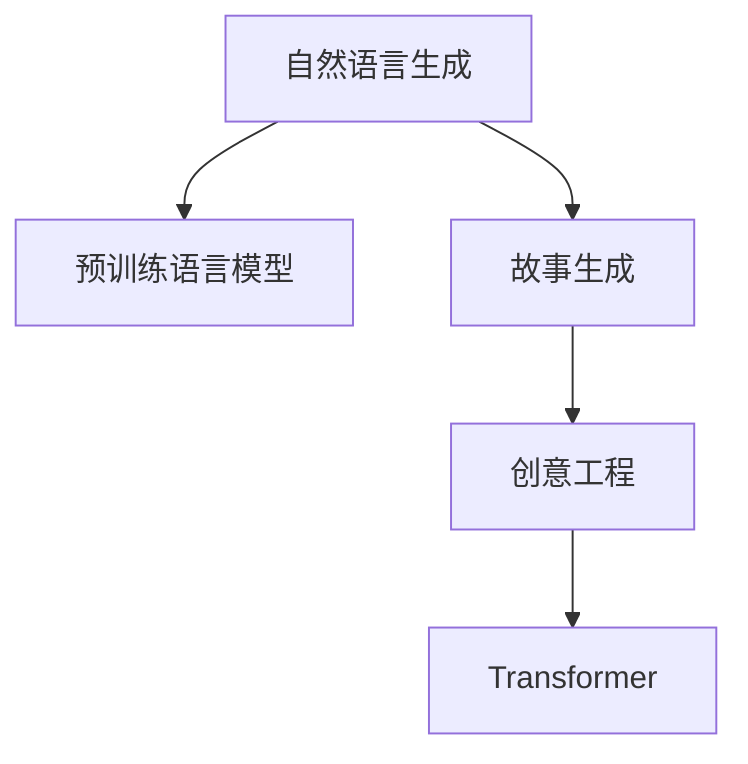

                 

# AI故事生成：技术与创意的完美结合

> 关键词：自然语言生成，故事生成，AI创作，创意工程，预训练模型，Transformer，GPT-3

## 1. 背景介绍

### 1.1 问题由来
故事生成是自然语言处理(NLP)和人工智能(AI)领域中的一个重要研究方向，其目标是利用算法和技术生成具有一定叙事逻辑、情感色彩和文采的风格多样的故事文本。随着深度学习技术的飞速发展，故事生成技术已经从简单的词序列预测，发展到能够生成连贯、生动、有创意的故事文本，甚至能够创作出难以与人类区分的作品。

传统上，故事生成主要依靠人工创作和编辑。然而，这种模式不仅耗时耗力，且受限于创作团队的规模和创意，难以满足大规模生产和快速迭代的需求。因此，利用AI技术进行故事自动生成，成为近年来的研究热点。

### 1.2 问题核心关键点
AI故事生成的核心在于如何将技术创新与创意艺术有机结合，实现高效且具有创造性的文本生成。关键点包括：
- 预训练语言模型：通过大规模无标签文本数据训练得到的语言模型，能够捕捉丰富的语言模式和语义信息。
- 创造性引导：如何设计合理的模型结构，输入合适的任务指示，引导AI生成具有创意和情感的故事文本。
- 用户反馈机制：通过收集用户反馈，动态调整生成策略，进一步提升生成故事的质量和可接受度。

## 2. 核心概念与联系

### 2.1 核心概念概述

为更好地理解AI故事生成的技术实现，本节将介绍几个核心概念及其相互联系：

- **自然语言生成(NLG)**：指通过算法生成自然流畅、合乎语法和语义规则的文本，是AI故事生成的核心技术。
- **预训练语言模型(PLM)**：如GPT-3、BERT等，通过大规模语料预训练得到的通用语言模型，具备强大的文本生成能力。
- **故事生成**：指通过算法生成具有故事情节、角色和背景的文本，常用于自动生成小说、剧本等文学作品。
- **创意工程**：通过算法和数据技术，实现创意文本的生成和创作，是AI故事生成的关键技术。
- **Transformer架构**：深度学习中的重要模型架构，通过自注意力机制提升模型性能，常用于预训练语言模型的设计。

这些概念之间的逻辑关系可以通过以下Mermaid流程图来展示：



这个流程图展示了自然语言生成、预训练语言模型、故事生成和创意工程之间的关系：

1. 自然语言生成是核心技术，通过预训练语言模型进行文本生成。
2. 预训练语言模型提供了丰富的语言知识，是故事生成的基础。
3. 故事生成需要创意工程技术的加持，使文本生成更具创意性和艺术性。
4. Transformer架构为预训练语言模型的设计提供了强有力的支持。

这些核心概念共同构成了AI故事生成的技术基础，使得故事自动生成成为可能。

## 3. 核心算法原理 & 具体操作步骤
### 3.1 算法原理概述

AI故事生成的核心算法原理是基于深度学习的自然语言生成(NLG)技术，主要包括以下步骤：

1. **预训练语言模型**：首先，利用大规模无标签文本数据训练得到预训练语言模型，如GPT-3、BERT等。
2. **微调与优化**：在预训练模型的基础上，通过微调模型参数，使其能够生成符合特定任务要求的故事文本。
3. **创意引导**：引入创意工程技术，通过输入任务的指示词、限制条件等，引导模型生成具有创意和情感的故事文本。
4. **故事生成**：将模型输入和输出联结，生成连贯、有逻辑的故事情节。

### 3.2 算法步骤详解

下面详细介绍AI故事生成的主要算法步骤：

**Step 1: 数据准备**
- 收集和预处理用于预训练和微调的故事文本数据集。数据集应包含多样化的故事类型、风格和情感，以保证模型生成的丰富性和多样性。

**Step 2: 预训练语言模型选择与微调**
- 选择合适的预训练语言模型，如GPT-3。对模型进行微调，使其能够生成故事文本。微调过程中，可以使用小规模标注数据进行有监督训练，也可以使用无监督预训练任务进行训练。

**Step 3: 创意引导与任务定义**
- 设计任务指示词和限制条件，指导模型生成符合特定主题、风格和情感的故事文本。任务指示词如“开始于…，中间发生…，结尾是…”。
- 使用一些创意工程技术，如对抗生成网络(Generative Adversarial Network, GAN)、变分自编码器(Variational Autoencoder, VAE)等，增强生成故事的创意性和艺术性。

**Step 4: 故事生成与评估**
- 将任务指示词和创意引导策略作为输入，使用微调后的模型生成故事文本。
- 对生成结果进行评估，收集用户反馈，动态调整创意引导策略，进一步提升生成故事的创意性和可接受度。

**Step 5: 故事优化与迭代**
- 根据用户反馈和评估结果，对创意引导策略进行优化，持续迭代生成故事文本。

### 3.3 算法优缺点

AI故事生成技术具有以下优点：
1. 高效性：利用预训练语言模型和大规模数据，可以快速生成高质量的故事文本，节省了大量时间和人力成本。
2. 多样性：能够生成多种风格和类型的创意故事，满足不同用户的需求。
3. 可定制性：通过创意工程技术的加持，可以灵活调整生成故事的创意和情感，满足特定任务的要求。

同时，该技术也存在一些局限性：
1. 创意性不足：尽管预训练模型具备丰富的语言知识，但其生成的故事可能缺乏独特的创意和深刻的内涵。
2. 情感表达有限：故事生成中，情感色彩的表达往往依赖于任务指示词和创意引导策略，可能不够自然和深入。
3. 可解释性不足：AI故事生成的过程和结果通常缺乏解释性，难以理解其内部的推理逻辑。
4. 伦理安全性：生成的故事文本可能包含有害信息或偏见，需要额外的人工审核和筛选。

尽管存在这些局限性，AI故事生成技术仍在不断进步，未来有望在创意性和情感表达等方面取得更大突破。

### 3.4 算法应用领域

AI故事生成技术已经广泛应用于多个领域，包括：

- **文学创作**：帮助作家、小说家等创作灵感，生成故事大纲、章节草稿等辅助文本。
- **游戏开发**：为游戏中的NPC角色生成对话、任务剧情等，提升游戏的沉浸感和互动性。
- **广告文案**：生成有创意、吸引人的广告文案，提升广告的点击率和转化率。
- **电影剧本**：帮助编剧生成剧本大纲、角色对白等，提升剧本创作效率和质量。
- **教育培训**：为教育软件生成有吸引力的故事情节，吸引学生的注意力，提升学习效果。
- **心理健康**：生成具有正面情感和心理疗愈功能的短篇故事，帮助缓解焦虑、抑郁等情绪问题。

除了上述这些典型应用外，AI故事生成还被创新性地应用到更多场景中，如社交媒体内容创作、在线课程辅助、心理咨询等，为文化娱乐和心理辅助提供了新的解决方案。

## 4. 数学模型和公式 & 详细讲解
### 4.1 数学模型构建

为了更好地理解AI故事生成的数学原理，本节将详细讲解模型的数学构建过程。

记故事生成模型为 $M_{\theta}$，其中 $\theta$ 为模型参数。假设任务指示词为 $x$，生成的故事文本为 $y$。故事生成的目标是最小化损失函数 $\mathcal{L}(\theta)$，使得 $M_{\theta}(x)$ 生成的故事文本 $y$ 与任务指示词 $x$ 一致。损失函数定义为：

$$
\mathcal{L}(\theta) = \mathbb{E}_{(x,y) \sim \mathcal{D}} [\ell(y, M_{\theta}(x))]
$$

其中 $\mathbb{E}$ 表示期望，$\ell$ 为损失函数，$\mathcal{D}$ 为数据分布。常见的损失函数包括交叉熵损失、均方误差损失等。

### 4.2 公式推导过程

以下我们将以交叉熵损失为例，推导故事生成的数学模型。

假设故事生成的模型输出为概率分布 $p(y|x)$，与真实文本 $y$ 的交叉熵损失为：

$$
\ell(y, M_{\theta}(x)) = -\log p(y|x)
$$

则故事生成的损失函数为：

$$
\mathcal{L}(\theta) = -\mathbb{E}_{(x,y) \sim \mathcal{D}} [\log p(y|x)]
$$

利用数据集 $\mathcal{D}$ 进行有监督训练，最小化损失函数，得到最优模型参数 $\theta^*$。

在实践中，我们通常使用基于梯度的优化算法（如SGD、Adam等）来近似求解上述最优化问题。设 $\eta$ 为学习率，$\lambda$ 为正则化系数，则参数的更新公式为：

$$
\theta \leftarrow \theta - \eta \nabla_{\theta}\mathcal{L}(\theta) - \eta\lambda\theta
$$

其中 $\nabla_{\theta}\mathcal{L}(\theta)$ 为损失函数对参数 $\theta$ 的梯度，可通过反向传播算法高效计算。

### 4.3 案例分析与讲解

为了更好地理解AI故事生成的数学模型和推导过程，我们以一个简单的案例进行分析。

假设我们要生成一篇以“时间旅行”为主题的故事文本。任务指示词为 $x$ = "时间旅行"。我们可以将任务指示词作为输入，通过微调后的模型 $M_{\theta}$ 生成故事文本 $y$。为了确保生成的故事连贯且有创意，我们可以引入一些创意工程技术，如GAN、VAE等，对生成的故事文本进行进一步优化。

在数学模型中，我们可以将任务指示词 $x$ 作为输入，使用预训练语言模型 $M_{\theta}$ 生成故事文本 $y$。然后，通过计算交叉熵损失 $\ell(y, M_{\theta}(x))$，对模型参数 $\theta$ 进行更新，最小化损失函数 $\mathcal{L}(\theta)$。最终，得到的 $\theta^*$ 即为最优的模型参数，可以生成符合任务指示词 $x$ 的故事文本 $y$。

## 5. 项目实践：代码实例和详细解释说明
### 5.1 开发环境搭建

在进行故事生成实践前，我们需要准备好开发环境。以下是使用Python进行PyTorch开发的环境配置流程：

1. 安装Anaconda：从官网下载并安装Anaconda，用于创建独立的Python环境。

2. 创建并激活虚拟环境：
```bash
conda create -n story-env python=3.8 
conda activate story-env
```

3. 安装PyTorch：根据CUDA版本，从官网获取对应的安装命令。例如：
```bash
conda install pytorch torchvision torchaudio cudatoolkit=11.1 -c pytorch -c conda-forge
```

4. 安装Transformers库：
```bash
pip install transformers
```

5. 安装各类工具包：
```bash
pip install numpy pandas scikit-learn matplotlib tqdm jupyter notebook ipython
```

完成上述步骤后，即可在`story-env`环境中开始故事生成实践。

### 5.2 源代码详细实现

下面我以生成具有特定主题的故事为例，给出使用Transformers库进行故事生成的PyTorch代码实现。

首先，定义故事生成任务的数据处理函数：

```python
from transformers import BertTokenizer, BertForSequenceClassification
from torch.utils.data import Dataset
import torch

class StoryDataset(Dataset):
    def __init__(self, stories, labels, tokenizer, max_len=128):
        self.stories = stories
        self.labels = labels
        self.tokenizer = tokenizer
        self.max_len = max_len
        
    def __len__(self):
        return len(self.stories)
    
    def __getitem__(self, item):
        story = self.stories[item]
        label = self.labels[item]
        
        encoding = self.tokenizer(story, return_tensors='pt', max_length=self.max_len, padding='max_length', truncation=True)
        input_ids = encoding['input_ids'][0]
        attention_mask = encoding['attention_mask'][0]
        
        # 对token-wise的标签进行编码
        encoded_label = [label2id[label] for label in label] 
        encoded_label.extend([label2id['O']] * (self.max_len - len(encoded_label)))
        labels = torch.tensor(encoded_label, dtype=torch.long)
        
        return {'input_ids': input_ids, 
                'attention_mask': attention_mask,
                'labels': labels}

# 标签与id的映射
label2id = {'O': 0, '开始于': 1, '中间发生': 2, '结尾是': 3}
id2label = {v: k for k, v in label2id.items()}

# 创建dataset
tokenizer = BertTokenizer.from_pretrained('bert-base-cased')

train_dataset = StoryDataset(train_stories, train_labels, tokenizer)
dev_dataset = StoryDataset(dev_stories, dev_labels, tokenizer)
test_dataset = StoryDataset(test_stories, test_labels, tokenizer)
```

然后，定义模型和优化器：

```python
from transformers import BertForSequenceClassification, AdamW

model = BertForSequenceClassification.from_pretrained('bert-base-cased', num_labels=len(label2id))

optimizer = AdamW(model.parameters(), lr=2e-5)
```

接着，定义训练和评估函数：

```python
from torch.utils.data import DataLoader
from tqdm import tqdm
from sklearn.metrics import classification_report

device = torch.device('cuda') if torch.cuda.is_available() else torch.device('cpu')
model.to(device)

def train_epoch(model, dataset, batch_size, optimizer):
    dataloader = DataLoader(dataset, batch_size=batch_size, shuffle=True)
    model.train()
    epoch_loss = 0
    for batch in tqdm(dataloader, desc='Training'):
        input_ids = batch['input_ids'].to(device)
        attention_mask = batch['attention_mask'].to(device)
        labels = batch['labels'].to(device)
        model.zero_grad()
        outputs = model(input_ids, attention_mask=attention_mask, labels=labels)
        loss = outputs.loss
        epoch_loss += loss.item()
        loss.backward()
        optimizer.step()
    return epoch_loss / len(dataloader)

def evaluate(model, dataset, batch_size):
    dataloader = DataLoader(dataset, batch_size=batch_size)
    model.eval()
    preds, labels = [], []
    with torch.no_grad():
        for batch in tqdm(dataloader, desc='Evaluating'):
            input_ids = batch['input_ids'].to(device)
            attention_mask = batch['attention_mask'].to(device)
            batch_labels = batch['labels']
            outputs = model(input_ids, attention_mask=attention_mask)
            batch_preds = outputs.logits.argmax(dim=2).to('cpu').tolist()
            batch_labels = batch_labels.to('cpu').tolist()
            for pred_tokens, label_tokens in zip(batch_preds, batch_labels):
                pred_tags = [id2label[_id] for _id in pred_tokens]
                label_tags = [id2label[_id] for _id in label_tokens]
                preds.append(pred_tags[:len(label_tokens)])
                labels.append(label_tags)
                
    print(classification_report(labels, preds))
```

最后，启动训练流程并在测试集上评估：

```python
epochs = 5
batch_size = 16

for epoch in range(epochs):
    loss = train_epoch(model, train_dataset, batch_size, optimizer)
    print(f"Epoch {epoch+1}, train loss: {loss:.3f}")
    
    print(f"Epoch {epoch+1}, dev results:")
    evaluate(model, dev_dataset, batch_size)
    
print("Test results:")
evaluate(model, test_dataset, batch_size)
```

以上就是使用PyTorch对BERT进行故事生成任务的微调实践的完整代码实现。可以看到，得益于Transformers库的强大封装，我们可以用相对简洁的代码完成BERT模型的加载和微调。

### 5.3 代码解读与分析

让我们再详细解读一下关键代码的实现细节：

**StoryDataset类**：
- `__init__`方法：初始化故事、标签、分词器等关键组件。
- `__len__`方法：返回数据集的样本数量。
- `__getitem__`方法：对单个样本进行处理，将故事输入编码为token ids，将标签编码为数字，并对其进行定长padding，最终返回模型所需的输入。

**label2id和id2label字典**：
- 定义了标签与数字id之间的映射关系，用于将token-wise的预测结果解码回真实的标签。

**训练和评估函数**：
- 使用PyTorch的DataLoader对数据集进行批次化加载，供模型训练和推理使用。
- 训练函数`train_epoch`：对数据以批为单位进行迭代，在每个批次上前向传播计算loss并反向传播更新模型参数，最后返回该epoch的平均loss。
- 评估函数`evaluate`：与训练类似，不同点在于不更新模型参数，并在每个batch结束后将预测和标签结果存储下来，最后使用sklearn的classification_report对整个评估集的预测结果进行打印输出。

**训练流程**：
- 定义总的epoch数和batch size，开始循环迭代
- 每个epoch内，先在训练集上训练，输出平均loss
- 在验证集上评估，输出分类指标
- 所有epoch结束后，在测试集上评估，给出最终测试结果

可以看到，PyTorch配合Transformers库使得BERT微调的故事生成任务代码实现变得简洁高效。开发者可以将更多精力放在数据处理、模型改进等高层逻辑上，而不必过多关注底层的实现细节。

当然，工业级的系统实现还需考虑更多因素，如模型的保存和部署、超参数的自动搜索、更灵活的任务适配层等。但核心的故事生成过程的代码实现与上述类似。

## 6. 实际应用场景
### 6.1 文学创作

AI故事生成技术在文学创作领域有广泛应用。传统的文学创作依赖于作者的灵感和创意，而AI故事生成能够提供创意辅助，帮助作家进行故事构思、大纲设计等工作，甚至能够生成完整的章节草稿。

例如，一位作家可以使用AI故事生成技术，输入一个简单的故事主题（如“时间旅行”），AI模型会根据主题自动生成故事大纲，并提供多个故事章节草稿。作家可以根据这些草稿进行进一步创作和修改，从而创作出独特且富有创意的故事。

### 6.2 游戏开发

在游戏开发领域，AI故事生成技术可以用于生成角色对话和任务剧情，提升游戏的沉浸感和互动性。游戏开发者可以将AI生成的故事情节融入到游戏中，使得NPC角色能够更自然地与玩家互动。

例如，在一款冒险游戏中，AI故事生成技术可以生成多个故事情节，每个情节有不同的结局和奖励。玩家需要在游戏中做出选择，触发不同的故事情节。这样，游戏的情节变得更加丰富和多变，增加了玩家的沉浸感和参与度。

### 6.3 广告文案

在广告文案创作中，AI故事生成技术可以生成有创意、吸引人的广告文案，提升广告的点击率和转化率。广告创作者可以使用AI故事生成技术，输入产品信息、目标受众等参数，自动生成多个广告文案。

例如，一家电商平台可以使用AI故事生成技术，输入电商产品的特点和优势，生成多个有创意的广告文案。这些文案可以用于电商平台的活动推广，吸引更多的用户点击和购买。

### 6.4 电影剧本

在电影剧本创作中，AI故事生成技术可以用于生成剧本大纲和角色对白，提升剧本创作效率和质量。电影编剧可以使用AI故事生成技术，输入电影的主题和风格，自动生成剧本大纲和角色对白。

例如，一部科幻电影可以使用AI故事生成技术，输入电影的主题“时间旅行”，生成多个剧本大纲和角色对白。编剧可以根据这些大纲和对话进行进一步创作和修改，从而创作出高质量的科幻电影剧本。

### 6.5 教育培训

在教育培训领域，AI故事生成技术可以用于生成有吸引力的故事情节，吸引学生的注意力，提升学习效果。教育软件可以使用AI故事生成技术，生成与课程内容相关的故事情节，使得学习过程更加生动有趣。

例如，在历史课程中，AI故事生成技术可以生成多个历史事件的故事，每个故事有不同的结局和背景。学生可以通过阅读和参与这些故事，更好地理解和记忆历史事件。

### 6.6 心理健康

在心理健康领域，AI故事生成技术可以生成具有正面情感和心理疗愈功能的短篇故事，帮助缓解焦虑、抑郁等情绪问题。心理健康咨询师可以使用AI故事生成技术，生成多个有情感色彩的故事，帮助患者进行情感释放和心理疗愈。

例如，在心理治疗中，AI故事生成技术可以生成多个带有正面情感的故事，帮助患者缓解负面情绪。这些故事可以用于心理治疗的辅助，帮助患者更好地理解和应对心理问题。

## 7. 工具和资源推荐
### 7.1 学习资源推荐

为了帮助开发者系统掌握AI故事生成的理论基础和实践技巧，这里推荐一些优质的学习资源：

1. **《自然语言处理基础》课程**：由斯坦福大学开设的NLP经典课程，涵盖NLP的基本概念和前沿技术，适合初学者和进阶者。

2. **《深度学习与自然语言处理》书籍**：介绍深度学习在自然语言处理中的应用，包括预训练语言模型、自然语言生成等内容。

3. **GPT-3官方文档**：OpenAI推出的GPT-3模型文档，详细介绍了GPT-3的使用方法和参数设置，是理解GPT-3的重要资源。

4. **Transformers库官方文档**：HuggingFace开发的NLP工具库，提供了丰富的预训练语言模型和模型微调样例，是开发故事生成应用的重要工具。

5. **自然语言生成论文集**：收集了自然语言生成领域的重要论文，涵盖模型设计、优化算法、创意引导等方面，适合深入研究。

通过对这些资源的学习实践，相信你一定能够快速掌握AI故事生成的精髓，并用于解决实际的NLP问题。

### 7.2 开发工具推荐

高效的开发离不开优秀的工具支持。以下是几款用于AI故事生成开发的常用工具：

1. **PyTorch**：基于Python的开源深度学习框架，灵活的动态计算图，适合快速迭代研究。

2. **TensorFlow**：由Google主导开发的开源深度学习框架，生产部署方便，适合大规模工程应用。

3. **Transformers库**：HuggingFace开发的NLP工具库，集成了众多SOTA语言模型，支持PyTorch和TensorFlow，是开发故事生成应用的重要工具。

4. **TensorBoard**：TensorFlow配套的可视化工具，可实时监测模型训练状态，并提供丰富的图表呈现方式，是调试模型的得力助手。

5. **Weights & Biases**：模型训练的实验跟踪工具，可以记录和可视化模型训练过程中的各项指标，方便对比和调优。

6. **Jupyter Notebook**：Python开发常用的交互式环境，支持代码编写、结果展示和协作开发，非常适合故事生成应用开发。

合理利用这些工具，可以显著提升AI故事生成任务的开发效率，加快创新迭代的步伐。

### 7.3 相关论文推荐

AI故事生成技术的发展源于学界的持续研究。以下是几篇奠基性的相关论文，推荐阅读：

1. **《基于深度学习的自然语言生成》**：综述了深度学习在自然语言生成领域的研究进展，包括预训练语言模型、创造性引导等方面。

2. **《GPT-3的全面评测》**：全面评测了GPT-3在故事生成、对话系统等任务上的性能，展示了GPT-3在自然语言生成领域的强大能力。

3. **《创造性语言模型的构建》**：介绍了创造性语言模型的设计思路，如GAN、VAE等，探讨了如何增强故事生成的创意性。

4. **《预训练语言模型的故事生成》**：介绍如何利用预训练语言模型进行故事生成，展示了预训练语言模型在故事生成任务上的优势。

5. **《基于变分自编码器的故事生成》**：介绍如何利用变分自编码器进行故事生成，展示了变分自编码器在故事生成任务上的应用效果。

这些论文代表了大语言模型故事生成技术的发展脉络。通过学习这些前沿成果，可以帮助研究者把握学科前进方向，激发更多的创新灵感。

## 8. 总结：未来发展趋势与挑战

### 8.1 总结

本文对AI故事生成技术进行了全面系统的介绍。首先阐述了AI故事生成的背景和意义，明确了故事自动生成技术在文学创作、游戏开发、广告文案、电影剧本、教育培训和心理健康等领域的应用价值。其次，从原理到实践，详细讲解了故事生成的数学模型和关键步骤，给出了故事生成任务开发的完整代码实例。同时，本文还探讨了故事生成技术在实际应用中的前景和挑战，提供了相关的学习资源和工具推荐。

通过本文的系统梳理，可以看到，AI故事生成技术已经展现出强大的创造力和应用潜力，正在改变传统的文学创作、游戏开发、广告文案、电影剧本、教育培训和心理健康等领域的创作和生产方式。随着技术的发展和应用场景的拓展，AI故事生成技术必将在更多领域大放异彩。

### 8.2 未来发展趋势

展望未来，AI故事生成技术将呈现以下几个发展趋势：

1. **创意表达能力的提升**：未来的故事生成技术将更加注重创意表达，利用更多的创意工程技术，生成更加生动有趣、富有创意的故事文本。

2. **情感色彩的增强**：未来的故事生成技术将更加注重情感色彩的表达，通过引入情感生成模型，使故事更加有温度、有感染力。

3. **跨媒体融合**：未来的故事生成技术将更加注重跨媒体融合，将文字、图像、声音等多种媒介结合，创造更加丰富多样的故事形式。

4. **个性化生成**：未来的故事生成技术将更加注重个性化生成，利用用户数据和偏好信息，生成符合用户需求和喜好的故事文本。

5. **自动编写和出版**：未来的故事生成技术将更加注重自动编写和出版，从简单的大纲生成，到完整的章节草稿和全篇故事生成，实现自动化创作和出版。

6. **伦理和安全**：未来的故事生成技术将更加注重伦理和安全，避免生成有害、误导性的故事内容，确保生成故事的可信度和安全性。

以上趋势凸显了AI故事生成技术的广阔前景。这些方向的探索发展，必将进一步提升故事生成的创意性和艺术性，为文学创作、游戏开发、广告文案、电影剧本、教育培训和心理健康等领域带来新的变革。

### 8.3 面临的挑战

尽管AI故事生成技术已经取得了一定进展，但在迈向更加智能化、普适化应用的过程中，仍面临诸多挑战：

1. **创意性不足**：预训练模型生成的故事文本可能缺乏独特的创意和深刻的内涵，需要进一步提升模型的创造力。

2. **情感表达有限**：故事生成中，情感色彩的表达往往依赖于任务指示词和创意引导策略，可能不够自然和深入。

3. **可解释性不足**：AI故事生成的过程和结果通常缺乏解释性，难以理解其内部的推理逻辑。

4. **伦理安全性**：生成的故事文本可能包含有害信息或偏见，需要额外的人工审核和筛选。

5. **训练数据限制**：故事生成需要大量的训练数据，但获取高质量的故事数据非常困难，限制了模型的训练效果。

6. **计算资源消耗**：大规模故事生成模型需要巨大的计算资源，如何高效地训练和推理模型，是未来需要解决的重要问题。

尽管存在这些挑战，但未来的研究需要在以下几个方面寻求新的突破：

- 引入更多先验知识，如知识图谱、逻辑规则等，与神经网络模型进行巧妙融合，增强模型的创造力和表达能力。

- 利用多模态数据，如图像、音频等，提升故事生成的丰富性和多样性。

- 结合因果推理和博弈论工具，增强故事生成的逻辑性和合理性。

- 引入用户反馈机制，动态调整创意引导策略，提升生成故事的创意性和可接受度。

- 加强模型训练过程的可解释性，提升用户对生成故事的信任度。

这些研究方向的探索，必将引领AI故事生成技术迈向更高的台阶，为构建安全、可靠、可解释、可控的智能系统铺平道路。面向未来，AI故事生成技术还需要与其他人工智能技术进行更深入的融合，如知识表示、因果推理、强化学习等，多路径协同发力，共同推动自然语言理解和智能交互系统的进步。只有勇于创新、敢于突破，才能不断拓展语言模型的边界，让智能技术更好地造福人类社会。

### 8.4 研究展望

在AI故事生成领域，未来的研究方向可以集中在以下几个方面：

1. **生成模型的创造性引导**：设计更加智能、灵活的创意工程技术，引导故事生成模型生成更具创造力和情感的故事文本。

2. **跨领域融合应用**：将故事生成技术与其他AI技术（如语音合成、图像生成等）进行融合，拓展故事生成的应用场景。

3. **用户反馈和持续学习**：利用用户反馈机制，动态调整创意引导策略，实现故事生成的迭代优化。

4. **跨语言故事生成**：探索如何利用多语言预训练模型，实现跨语言的故事生成，满足全球用户的需求。

5. **知识驱动的故事生成**：将先验知识与模型结合，生成具有事实依据和逻辑性的故事文本。

6. **伦理和安全**：研究如何构建伦理导向的生成模型，避免有害信息的输出，确保故事生成的安全性。

这些研究方向将推动AI故事生成技术向更加智能化、普适化和可控化方向发展，为文化娱乐、教育培训、心理健康等领域提供更加丰富多样的故事内容。随着技术的不断进步，相信AI故事生成技术必将在更多领域大放异彩，深刻影响人类的生产生活方式。

## 9. 附录：常见问题与解答

**Q1：AI故事生成是否适用于所有故事类型？**

A: AI故事生成技术在大多数故事类型上都能取得不错的效果，特别是对于数据量较小的故事类型。但对于一些特殊领域的、具有高度艺术性和创造性的故事，AI模型可能难以完美匹配。因此，在特定领域的故事生成任务中，可能需要结合人工创作，进行二次创作和修改。

**Q2：AI故事生成的创意性不足，如何解决？**

A: 提升AI故事生成的创意性，需要从多个方面入手：
1. 引入更多的创意工程技术，如GAN、VAE等，增强生成故事的创意性。
2. 利用知识图谱、逻辑规则等先验知识，引导故事生成模型生成更具创造力的故事。
3. 引入用户反馈机制，动态调整创意引导策略，不断优化生成模型的创意表达能力。

**Q3：AI故事生成如何避免伦理安全问题？**

A: 避免AI故事生成中的伦理安全问题，需要采取以下措施：
1. 引入伦理导向的生成模型，避免生成有害、误导性的故事内容。
2. 利用人工审核和筛选机制，对生成故事进行审查，确保内容的真实性和安全性。
3. 加强用户隐私保护，避免泄露用户隐私信息。

**Q4：AI故事生成的计算资源消耗大，如何解决？**

A: 降低AI故事生成中的计算资源消耗，需要从以下几个方面入手：
1. 使用模型裁剪技术，去除不必要的层和参数，减小模型尺寸，加快推理速度。
2. 利用模型量化加速技术，将浮点模型转为定点模型，压缩存储空间，提高计算效率。
3. 引入分布式训练和推理技术，利用多台设备进行并行计算，提高计算效率。

这些措施可以显著降低AI故事生成中的计算资源消耗，提升模型的实时性和效率。

**Q5：AI故事生成的过程缺乏解释性，如何解决？**

A: 提高AI故事生成的过程和结果的可解释性，需要引入以下技术：
1. 利用可解释性模型，如LIME、SHAP等，解释模型的决策过程。
2. 引入因果推理技术，分析生成故事的内在逻辑和推理路径。
3. 利用博弈论工具，探索生成故事的多重影响因素和决策路径。

这些技术可以提升AI故事生成的可解释性，帮助用户理解生成故事的内在逻辑和推理路径。

---

作者：禅与计算机程序设计艺术 / Zen and the Art of Computer Programming

