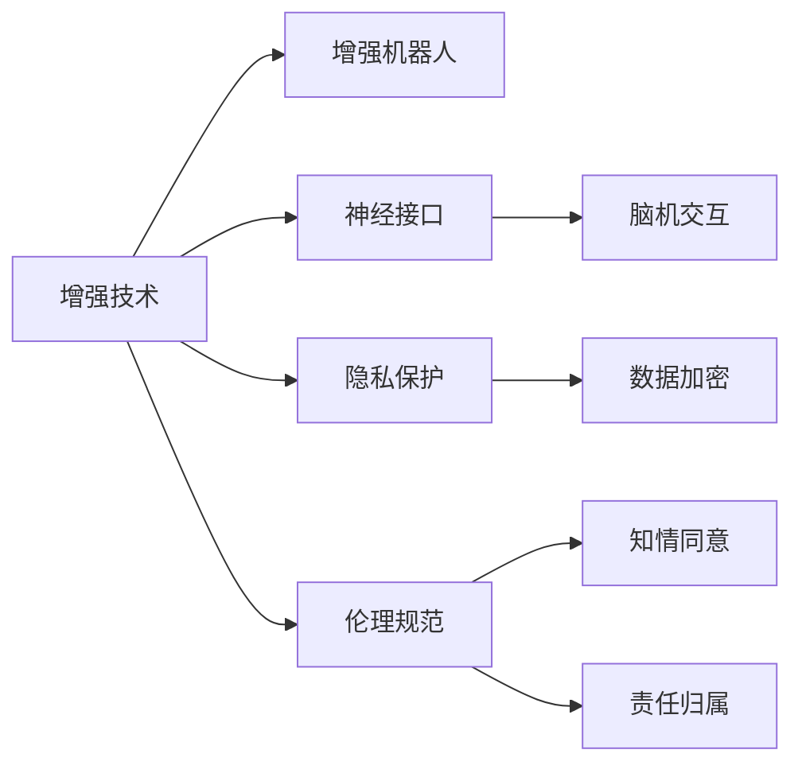

                 

# AI时代的人类增强：身体增强与道德、隐私和安全

在人工智能(AI)迅猛发展的今天，各种基于AI的增强技术正在逐步渗透到我们生活的各个方面，包括医疗健康、运动训练、心理支持等。这些技术正在重塑人类的身体能力，带来前所未有的便利与机遇，同时也引发了关于道德、隐私和安全的一系列伦理问题。本文将从身体增强技术的原理、实践以及伦理挑战三个维度，深入探讨AI时代人类增强技术的现状与未来。

## 1. 背景介绍

### 1.1 问题由来

随着科技的进步，AI技术正逐步渗透到我们的日常生活中。从智能家居、自动驾驶，到医疗诊断、个性化教育，AI无所不在。而身体增强技术，则是AI时代最具潜力的应用领域之一。这种技术通过AI驱动的设备和系统，对人类身体进行智能化的升级，极大地提升了人类的生产力和生活质量。

### 1.2 问题核心关键点

1. **技术的进步**：诸如机器人辅助手术、智能假肢、神经刺激等AI身体增强技术，正逐渐从科幻走向现实，成为可能。
2. **伦理问题**：这些技术的广泛应用可能引发一系列伦理问题，如隐私保护、知情同意、责任归属等。
3. **安全性**：身体增强技术的安全性也至关重要，任何技术失误或黑客攻击都可能对使用者造成严重伤害。
4. **社会接受度**：身体增强技术的普及度受制于公众的接受程度，如何提高社会认知度是推广的关键。

## 2. 核心概念与联系

### 2.1 核心概念概述

为了更好地理解身体增强技术及其应用，我们首先需要了解以下几个核心概念：

- **增强技术**：通过AI技术提升人类身体功能的技术，如增强假肢、智能穿戴设备等。
- **增强机器人**：集成了AI技术的机器人，能够辅助人体进行各种活动，如手术、康复训练等。
- **神经接口**：通过植入电极等手段，将AI系统与大脑或神经信号连接，实现脑机交互。
- **隐私保护**：在增强技术中，用户的健康数据、生理信息等隐私需要得到有效保护。
- **伦理规范**：涉及技术应用中伦理道德的规范，如知情同意、责任归属等。

### 2.2 核心概念原理和架构的 Mermaid 流程图



### 2.3 核心概念联系

以上各概念相互交织，共同构成身体增强技术的复杂体系。增强技术通过增强机器人等载体，实现脑机交互，并在这一过程中注重隐私保护和伦理规范的落实。这一体系可以概括为：

- **技术实现**：增强技术依赖于先进的AI算法和硬件设备，通过增强机器人将AI系统与人体连接。
- **数据安全**：在数据传输和处理过程中，必须采取严格的加密措施，保护用户隐私。
- **伦理原则**：技术应用需遵循知情同意、责任归属等伦理原则，确保用户权益。

## 3. 核心算法原理 & 具体操作步骤

### 3.1 算法原理概述

身体增强技术的应用，通常涉及AI算法与生物信号的交互。其主要算法原理包括：

- **数据采集**：通过传感器或植入设备，实时采集用户的生理数据（如心率、肌肉电信号等）。
- **数据预处理**：对采集到的生理信号进行降噪、滤波等预处理，确保数据质量。
- **特征提取**：使用机器学习算法，从预处理后的数据中提取有用特征，供后续分析使用。
- **模型训练**：利用深度学习等算法，训练模型以识别特定动作或状态，实现精准控制。
- **控制反馈**：通过增强机器人或植入设备，实现对用户身体功能的增强，并提供反馈机制以优化模型。

### 3.2 算法步骤详解

以增强假肢为例，其核心步骤包括：

1. **数据采集**：使用传感器采集用户的肌肉电信号。
2. **信号预处理**：对采集到的电信号进行滤波和降噪，确保信号质量。
3. **特征提取**：使用卷积神经网络（CNN）等算法，从预处理后的信号中提取特征。
4. **模型训练**：利用大量标注数据，训练一个能够识别用户意图的模型。
5. **控制反馈**：通过增强假肢的动作，采集用户反馈，不断优化模型。

### 3.3 算法优缺点

增强技术的算法具有以下优点：

- **精度高**：深度学习等算法能够处理复杂的数据，实现高精度的动作控制。
- **实时性强**：通过实时采集和处理数据，能够即时响应用户需求。
- **可扩展性**：算法可以根据不同需求进行调整和优化，具有较强的可扩展性。

然而，算法也存在一些缺点：

- **数据依赖**：算法效果依赖于高质量的训练数据，数据获取成本较高。
- **模型复杂**：深度学习模型复杂度高，需要较强的计算资源和数据处理能力。
- **安全性问题**：数据传输和处理过程中，可能面临黑客攻击和数据泄露的风险。

### 3.4 算法应用领域

增强技术的应用领域非常广泛，包括：

- **医疗健康**：增强机器人辅助手术、智能假肢等，提升了医疗设备的精度和效率。
- **运动训练**：智能穿戴设备实时监控运动数据，帮助运动员科学训练。
- **生活辅助**：家用机器人、智能穿戴设备等，提高了生活质量。

## 4. 数学模型和公式 & 详细讲解 & 举例说明

### 4.1 数学模型构建

以增强假肢为例，其数学模型可以构建为：

$$
y = f(x; \theta)
$$

其中 $x$ 为输入的肌肉电信号，$y$ 为输出动作，$\theta$ 为模型参数。通过大量训练数据，优化参数 $\theta$，使得模型能够准确预测用户的动作意图。

### 4.2 公式推导过程

在训练过程中，使用交叉熵损失函数：

$$
L(y, \hat{y}) = -\frac{1}{N} \sum_{i=1}^{N} y_i \log \hat{y}_i + (1-y_i) \log (1-\hat{y}_i)
$$

其中 $y_i$ 为真实标签，$\hat{y}_i$ 为模型预测值。通过反向传播算法，计算梯度并更新参数：

$$
\theta \leftarrow \theta - \eta \nabla_{\theta} L(y, \hat{y})
$$

其中 $\eta$ 为学习率，$\nabla_{\theta} L(y, \hat{y})$ 为损失函数对参数 $\theta$ 的梯度。

### 4.3 案例分析与讲解

以一个简单的肌肉电信号分类为例，数据集包含 1000 个样本，每个样本包含 100 个特征。使用一个简单的多层感知器（MLP）模型进行训练：

```python
import torch
import torch.nn as nn
import torch.optim as optim

class MLP(nn.Module):
    def __init__(self):
        super(MLP, self).__init__()
        self.fc1 = nn.Linear(100, 128)
        self.fc2 = nn.Linear(128, 64)
        self.fc3 = nn.Linear(64, 2)
        self.softmax = nn.Softmax(dim=1)
        
    def forward(self, x):
        x = torch.relu(self.fc1(x))
        x = torch.relu(self.fc2(x))
        x = self.fc3(x)
        x = self.softmax(x)
        return x

model = MLP()
criterion = nn.CrossEntropyLoss()
optimizer = optim.Adam(model.parameters(), lr=0.001)

# 训练过程省略
```

通过这样的模型，可以有效分类肌肉电信号，实现精确控制。

## 5. 项目实践：代码实例和详细解释说明

### 5.1 开发环境搭建

身体增强技术涉及复杂的数据采集和处理，因此开发环境需要具备较高的计算能力和稳定的网络连接。以下是典型的开发环境搭建步骤：

1. **安装 Python 和相关库**：
```bash
sudo apt-get install python3-pip
sudo pip3 install torch torchvision numpy scipy scikit-learn
```

2. **配置 CUDA 环境**：
```bash
conda install pytorch torchvision torchaudio cudatoolkit=10.1 -c pytorch
```

3. **配置数据采集设备**：根据具体需求，配置相应的传感器和采集设备。

### 5.2 源代码详细实现

以下是一个简单的增强假肢控制代码示例：

```python
import torch
import torch.nn as nn
import torch.optim as optim
import numpy as np

class MLP(nn.Module):
    def __init__(self):
        super(MLP, self).__init__()
        self.fc1 = nn.Linear(100, 128)
        self.fc2 = nn.Linear(128, 64)
        self.fc3 = nn.Linear(64, 2)
        self.softmax = nn.Softmax(dim=1)
        
    def forward(self, x):
        x = torch.relu(self.fc1(x))
        x = torch.relu(self.fc2(x))
        x = self.fc3(x)
        x = self.softmax(x)
        return x

model = MLP()
criterion = nn.CrossEntropyLoss()
optimizer = optim.Adam(model.parameters(), lr=0.001)

# 数据加载和预处理
def load_data():
    # 加载训练数据
    X_train, y_train = load_dataset('train')
    # 加载测试数据
    X_test, y_test = load_dataset('test')
    # 数据预处理
    X_train = preprocess(X_train)
    X_test = preprocess(X_test)
    return X_train, y_train, X_test, y_test

# 模型训练和评估
def train(model, criterion, optimizer, X_train, y_train, X_test, y_test, epochs=10):
    for epoch in range(epochs):
        # 训练过程
        loss_train = train_epoch(model, criterion, optimizer, X_train, y_train)
        # 评估过程
        loss_test = evaluate(model, criterion, X_test, y_test)
        print(f'Epoch {epoch+1}, train loss: {loss_train:.4f}, test loss: {loss_test:.4f}')
    return loss_train, loss_test

# 训练和评估过程
X_train, y_train, X_test, y_test = load_data()
loss_train, loss_test = train(model, criterion, optimizer, X_train, y_train, X_test, y_test)
```

### 5.3 代码解读与分析

在上述代码中，我们首先定义了一个简单的多层感知器（MLP）模型，用于处理肌肉电信号数据。然后，通过定义损失函数和优化器，对模型进行训练和评估。训练过程包括数据加载、预处理、模型训练和评估等多个环节，代码实现较为简洁高效。

## 6. 实际应用场景

### 6.1 增强机器人手术

增强机器人手术通过结合AI技术，可以实现高精度的微创手术。手术过程中，增强机器人通过实时采集医生的动作数据和生理信号，实现自动跟随和辅助操作。这种技术不仅提高了手术的精度和效率，还能显著减少患者的恢复时间和并发症。

### 6.2 智能假肢

智能假肢利用AI技术，可以实现更加自然、灵活的肢体重建。例如，通过增强假肢，患者可以实现更加自然的步态，提升生活质量。智能假肢还可以根据患者的生理数据，进行自适应调整，提供个性化的使用体验。

### 6.3 运动训练

智能穿戴设备通过实时监控运动数据，帮助运动员进行科学训练。例如，跑步机上的智能设备可以实时分析跑步姿势和步频，提供针对性的训练建议。这种技术不仅提高了训练效果，还能有效预防运动损伤。

### 6.4 未来应用展望

未来，身体增强技术将更加智能化和个性化。通过结合脑机接口技术，可以实现更加自然的人机交互。此外，随着数据采集技术的进步，身体增强技术的应用场景将更加丰富，涵盖医疗、运动、娱乐等多个领域。

## 7. 工具和资源推荐

### 7.1 学习资源推荐

为了深入了解身体增强技术，以下是一些推荐的学习资源：

1. **《人工智能：一种现代方法》**：该书系统介绍了AI技术的原理和应用，适合初学者和研究人员。
2. **《深度学习》**：由Goodfellow等人合著的经典教材，详细介绍了深度学习的基本概念和算法。
3. **Coursera 的 AI 课程**：包括斯坦福大学、MIT 等名校开设的课程，涵盖 AI 的多个领域。

### 7.2 开发工具推荐

以下是一些常用的身体增强技术开发工具：

1. **PyTorch**：适用于深度学习和强化学习任务，支持高效的计算图和自动微分。
2. **TensorFlow**：由 Google 主导的开源框架，支持分布式计算和 GPU 加速。
3. **Robot Operating System (ROS)**：专注于机器人开发的操作系统，支持多机器人的协调和控制。

### 7.3 相关论文推荐

以下是几篇关于身体增强技术的经典论文：

1. **"Towards Human-Machine Symbiosis"**：提出了一种基于深度学习的智能假肢系统，通过脑机接口实现肢体重建。
2. **"Enhancing Brain-Computer Interface (BCI) Systems with Deep Learning"**：探讨了深度学习在 BCI 系统中的应用，提升 BCI 的准确性和稳定性。
3. **"Advances in Robotic Surgery"**：总结了机器人手术领域的最新进展，讨论了增强机器人手术的优势和挑战。

## 8. 总结：未来发展趋势与挑战

### 8.1 研究成果总结

通过上述分析，我们可以看到身体增强技术已经取得了显著的进展，在多个领域展现出强大的应用潜力。然而，技术的快速发展也带来了诸多挑战，包括伦理、隐私和安全问题。

### 8.2 未来发展趋势

未来，身体增强技术的发展将呈现以下几个趋势：

1. **更加智能和个性化**：通过脑机接口和深度学习等技术，身体增强设备将实现更加智能和个性化的功能。
2. **跨领域融合**：身体增强技术将与其他技术（如虚拟现实、增强现实）进行深度融合，提供更加丰富的应用场景。
3. **广泛应用**：随着技术的普及，身体增强技术将渗透到医疗、运动、娱乐等多个领域，成为人们日常生活中的重要工具。

### 8.3 面临的挑战

尽管身体增强技术具有广阔的应用前景，但也面临着一些挑战：

1. **伦理和隐私问题**：增强技术涉及大量的生理数据，如何在数据使用和共享中保护用户隐私，是亟待解决的问题。
2. **安全性问题**：增强设备的安全性至关重要，任何技术失误或黑客攻击都可能对使用者造成严重伤害。
3. **社会接受度**：增强技术的普及度受制于公众的接受程度，如何提高社会认知度是推广的关键。

### 8.4 研究展望

未来，研究者需要在以下几个方面进行深入探索：

1. **伦理和隐私保护**：制定相应的伦理规范，确保数据安全和用户隐私。
2. **安全性提升**：加强设备的安全防护，确保用户的安全。
3. **社会接受度提高**：通过教育和宣传，提高公众对增强技术的认知度和接受度。

## 9. 附录：常见问题与解答

**Q1：身体增强技术的应用前景如何？**

A: 身体增强技术的应用前景非常广阔，涵盖医疗、运动、娱乐等多个领域。通过结合AI技术，身体增强设备将能够实现更加智能和个性化的功能，提升人们的生活质量和生产效率。

**Q2：增强技术是否存在安全风险？**

A: 增强技术存在一定的安全风险，包括数据泄露、设备故障等。因此，在设计和实现增强技术时，必须考虑安全性问题，采取有效的防护措施。

**Q3：增强技术如何平衡伦理和隐私？**

A: 增强技术的应用需要遵循伦理规范，确保用户知情同意和数据隐私。通过建立透明的数据使用政策，保护用户的隐私权益。

**Q4：增强技术在实际应用中需要注意哪些问题？**

A: 增强技术在实际应用中需要注意以下问题：
- 设备的便携性和舒适度。
- 系统的稳定性和可靠性。
- 数据的实时性和准确性。

**Q5：未来身体增强技术的发展方向是什么？**

A: 未来身体增强技术的发展方向包括：
- 结合脑机接口技术，实现更加智能和个性化的功能。
- 与其他技术（如虚拟现实、增强现实）深度融合，提供更加丰富的应用场景。
- 广泛渗透到医疗、运动、娱乐等多个领域，成为人们日常生活中的重要工具。

作者：禅与计算机程序设计艺术 / Zen and the Art of Computer Programming

