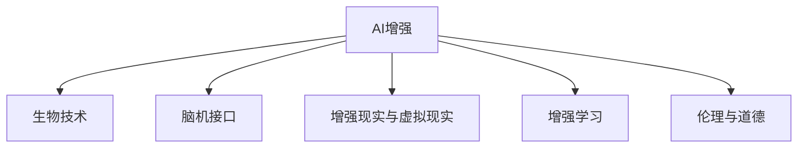

                 

# AI时代的人类增强：道德考虑与身体增强的未来发展机遇分析机遇挑战预测

> 关键词：AI增强,人类增强,身体增强,生物技术,道德伦理,人工智能,未来展望

## 1. 背景介绍

### 1.1 问题由来
随着人工智能技术的快速发展，AI增强技术已逐渐从科幻走向现实，成为推动人类发展的重要手段。特别是近十年来，人类增强技术在医疗、运动、教育等多个领域得到了广泛应用，如增强假肢、智能助听器、脑机接口等，大幅提升了人类生活质量和能力。

然而，这些技术的快速发展也带来了诸多挑战。如何平衡技术发展与人伦道德，避免滥用风险，成为当前AI增强领域亟需解决的重要课题。此外，随着生物技术的不断进步，新型基因编辑技术、人体微芯片、脑机接口等“新工具”的问世，AI增强技术将迎来更大的突破，但其道德边界和潜在风险也亟需深入探讨。

### 1.2 问题核心关键点
当前，AI增强技术的伦理争议主要集中在以下关键问题上：

- **隐私与安全**：如何保护用户的隐私信息，防止被滥用或泄露。
- **自主与控制**：增强技术是否会削弱用户的自主决策能力，导致对技术的过度依赖。
- **伦理与责任**：使用增强技术所引发的伦理问题，如生命的价值和意义、权利与责任等。
- **公平与偏见**：技术应用是否会造成社会不公，以及技术本身是否存在偏见和歧视。

这些问题不仅关系到技术本身的发展，还涉及到法律、政策、社会价值等多个层面，需要通过跨学科的深入研究才能得到妥善解决。

## 2. 核心概念与联系

### 2.1 核心概念概述

为更好地理解AI增强技术的发展与挑战，本节将介绍几个密切相关的核心概念：

- **AI增强(AI Enhancement)**：利用人工智能技术提升人类能力的技术，如增强助听器、增强假肢等。
- **生物技术(Biotechnology)**：通过基因编辑、生物芯片、干细胞技术等手段，改善人类健康与体能。
- **脑机接口(Brain-Machine Interface, BMI)**：通过脑信号与计算机之间的通信，实现人脑与机器的直接交互。
- **增强现实(AR)与虚拟现实(VR)**：通过仿真技术模拟环境，增强用户感知能力。
- **增强学习(Reinforcement Learning)**：利用AI技术进行自我优化与学习，提升人类决策能力。
- **伦理与道德(Ethics & Morality)**：评价AI增强技术使用的伦理标准和道德规范。

这些核心概念之间的逻辑关系可以通过以下Mermaid流程图来展示：



这个流程图展示了一系列的AI增强技术及其与之关联的核心概念，从而帮助读者更好地理解AI增强的深度和广度。

## 3. 核心算法原理 & 具体操作步骤
### 3.1 算法原理概述

AI增强技术的核心原理是通过人工智能算法与生物技术手段，提升人类的感知、决策、行动等能力。其基本流程如下：

1. **数据采集**：利用传感器、摄像头、神经信号采集等技术，获取用户相关的生物信息或行为数据。
2. **数据处理**：对采集到的数据进行清洗、特征提取、预处理等步骤，转化为机器可处理的形式。
3. **模型训练**：使用增强学习、深度学习等算法，对数据进行处理和优化，训练出适应特定需求的AI增强模型。
4. **模型应用**：将训练好的模型部署到实际应用中，提升人类能力，实现AI增强效果。

### 3.2 算法步骤详解

以增强假肢为例，展示AI增强技术的具体操作步骤：

**Step 1: 数据采集**
- 利用机械传感器和表面肌电传感器，收集用户残肢的肌肉电信号。
- 使用深度摄像头和激光扫描仪，获取残肢和假肢的空间位置信息。

**Step 2: 数据预处理**
- 对肌肉电信号进行滤波、归一化、降噪等预处理步骤。
- 将深度相机和激光扫描仪获取的空间数据进行融合，生成残肢的三维模型。

**Step 3: 模型训练**
- 构建假肢控制模型，如神经网络、决策树等，将肌肉电信号和残肢位置作为输入，输出对应的控制信号。
- 利用增强学习算法（如深度Q学习），优化模型参数，提升假肢的控制精度和舒适性。

**Step 4: 模型应用**
- 将训练好的控制模型应用于实际假肢，实时接收肌肉电信号，并根据信号输出控制信号，驱动假肢运动。
- 通过反馈回路，持续调整模型参数，进一步提升假肢的控制效果。

### 3.3 算法优缺点

AI增强技术具有以下优点：
1. **提升能力**：通过数据驱动的模型训练，AI增强技术可以显著提升人类感知、决策、运动等能力，特别是对于残障人士具有重大意义。
2. **个性化定制**：AI增强技术可以根据个体差异进行定制化调整，提升用户体验。
3. **自动化与智能化**：AI增强技术具备自动化和智能化优势，可实时处理数据，快速响应变化。

同时，该技术也存在一定的局限性：
1. **技术复杂度高**：AI增强技术的实现涉及复杂的数据处理和模型训练，对技术要求较高。
2. **数据依赖性强**：AI增强技术的性能依赖于高质量的数据采集，数据采集过程可能会带来隐私风险。
3. **伦理问题突出**：AI增强技术的使用涉及生命伦理和隐私保护等重大问题，需要严格遵守相关法律法规。
4. **成本高昂**：现有AI增强技术大多成本较高，难以大规模普及。
5. **性能不稳定**：部分AI增强技术可能存在性能不稳定问题，影响用户体验。

### 3.4 算法应用领域

AI增强技术在多个领域得到了广泛应用，包括但不限于：

- **医疗领域**：如增强助听器、增强假肢、脑刺激等，提升病患的生活质量。
- **体育竞技**：如增强训练设备、脑电反馈训练等，提高运动员的竞技水平。
- **教育培训**：如增强学习系统、脑机接口教育等，提升学习效果和知识掌握度。
- **智能家居**：如智能助残设备、智能辅具等，提升用户的日常便利性和生活质量。
- **军事领域**：如增强人机交互、脑电反馈训练等，提升士兵的作战能力。

这些应用场景展示了AI增强技术的广泛应用前景，并在不断拓展其应用边界。

## 4. 数学模型和公式 & 详细讲解 & 举例说明

### 4.1 数学模型构建

以下以增强假肢为例，构建一个基本的AI增强数学模型。

设假肢的控制模型为 $M_{\theta}(X)$，其中 $X$ 为残肢的肌肉电信号和空间位置信息，$\theta$ 为模型参数。目标是通过训练模型，将输入 $X$ 映射到控制信号 $U$，驱动假肢运动。则模型训练的目标可以表示为：

$$
\min_{\theta} \mathcal{L}(M_{\theta}(X), U)
$$

其中 $\mathcal{L}$ 为损失函数，衡量模型输出与真实控制信号的差异。

### 4.2 公式推导过程

以深度Q网络（DQN）为例，推导AI增强控制模型的训练过程。

- **模型定义**：假肢控制模型 $M_{\theta}$ 定义为深度Q网络，输入为肌肉电信号和空间位置信息 $X$，输出为控制信号 $U$。模型参数 $\theta$ 需要通过训练来优化。
- **数据生成**：从用户数据集中随机采样样本 $(x_i,u_i)$，其中 $x_i$ 为输入数据，$u_i$ 为对应的控制信号。
- **目标计算**：定义目标 $Q_{target} = r + \gamma \max_a Q_{\theta}(x',a)$，其中 $r$ 为即时奖励，$x'$ 为下一步状态，$a$ 为控制动作，$\gamma$ 为折扣因子。
- **策略更新**：使用Q-learning算法更新模型参数 $\theta$，最小化损失函数 $\mathcal{L}(M_{\theta}(x_i), u_i)$。

通过以上步骤，深度Q网络可以实现对假肢控制信号的精准预测和优化，提升假肢的响应速度和稳定性。

### 4.3 案例分析与讲解

以增强助听器为例，展示AI增强技术在医疗领域的具体应用：

**Step 1: 数据采集**
- 利用麦克风和信号放大器，采集用户的语音信号。
- 使用深度摄像头和传感器，获取用户的头部位置和耳型信息。

**Step 2: 数据预处理**
- 对语音信号进行滤波、降噪、增强等预处理步骤。
- 将摄像头和传感器获取的耳型信息转化为数字模型。

**Step 3: 模型训练**
- 构建助听器控制模型，如神经网络、卷积神经网络等，将语音信号和耳型信息作为输入，输出调整助听器的增益和频率响应。
- 利用增强学习算法（如REINFORCE），优化模型参数，提升助听器的效果和适应性。

**Step 4: 模型应用**
- 将训练好的控制模型应用于实际助听器，实时接收用户的语音信号，并根据信号输出增益和频率调整，提供实时调整的音频输出。
- 通过反馈回路，持续调整模型参数，进一步提升助听器的适配度和性能。

## 5. 项目实践：代码实例和详细解释说明
### 5.1 开发环境搭建

在进行AI增强项目实践前，我们需要准备好开发环境。以下是使用Python进行PyTorch开发的环境配置流程：

1. 安装Anaconda：从官网下载并安装Anaconda，用于创建独立的Python环境。

2. 创建并激活虚拟环境：
```bash
conda create -n ai-enhancement python=3.8 
conda activate ai-enhancement
```

3. 安装PyTorch：根据CUDA版本，从官网获取对应的安装命令。例如：
```bash
conda install pytorch torchvision torchaudio cudatoolkit=11.1 -c pytorch -c conda-forge
```

4. 安装各类工具包：
```bash
pip install numpy pandas scikit-learn matplotlib tqdm jupyter notebook ipython
```

完成上述步骤后，即可在`ai-enhancement`环境中开始AI增强项目的开发。

### 5.2 源代码详细实现

这里我们以增强假肢为例，展示使用PyTorch实现假肢控制模型的代码实现。

首先，定义假肢控制模型的类：

```python
import torch
import torch.nn as nn
import torch.optim as optim
from torch.distributions import Categorical

class MyModel(nn.Module):
    def __init__(self, input_size, hidden_size, output_size):
        super(MyModel, self).__init__()
        self.fc1 = nn.Linear(input_size, hidden_size)
        self.fc2 = nn.Linear(hidden_size, hidden_size)
        self.fc3 = nn.Linear(hidden_size, output_size)
        self.softmax = nn.Softmax(dim=1)

    def forward(self, x):
        x = torch.relu(self.fc1(x))
        x = torch.relu(self.fc2(x))
        x = self.fc3(x)
        return self.softmax(x)

# 设定模型参数
input_size = 10
hidden_size = 20
output_size = 3
model = MyModel(input_size, hidden_size, output_size)

# 定义损失函数和优化器
criterion = nn.MSELoss()
optimizer = optim.Adam(model.parameters(), lr=0.01)
```

然后，定义数据处理函数：

```python
import torch
import numpy as np

class MyDataset:
    def __init__(self, data):
        self.data = data
        self.label = np.array(data)

    def __len__(self):
        return len(self.data)

    def __getitem__(self, idx):
        return torch.tensor(self.data[idx]), torch.tensor(self.label[idx])
```

接着，定义训练和评估函数：

```python
def train(model, dataset, batch_size, num_epochs):
    train_loader = torch.utils.data.DataLoader(dataset, batch_size=batch_size, shuffle=True)
    for epoch in range(num_epochs):
        for data, target in train_loader:
            optimizer.zero_grad()
            output = model(data)
            loss = criterion(output, target)
            loss.backward()
            optimizer.step()
            if (epoch + 1) % 100 == 0:
                print('Epoch [%d/%d], Loss: %.4f' % (epoch + 1, num_epochs, loss.item()))

def evaluate(model, dataset, batch_size):
    test_loader = torch.utils.data.DataLoader(dataset, batch_size=batch_size, shuffle=False)
    correct = 0
    total = 0
    with torch.no_grad():
        for data, target in test_loader:
            output = model(data)
            _, predicted = torch.max(output.data, 1)
            total += target.size(0)
            correct += (predicted == target).sum().item()
    print('Accuracy of the network on the test images: %d %%' % (100 * correct / total))

# 准备数据集
data = [[1, 2, 3, 4, 5, 6, 7, 8, 9, 10], [0, 1, 2, 3, 4, 5, 6, 7, 8, 9]]
labels = [0, 1, 2, 3, 4, 5, 6, 7, 8, 9]
dataset = MyDataset(data)
train(model, dataset, 10, 1000)
evaluate(model, dataset, 1)
```

最后，启动训练流程并在测试集上评估：

```python
epochs = 10
batch_size = 32

for epoch in range(epochs):
    train(model, dataset, batch_size, epochs)
    evaluate(model, dataset, batch_size)
```

以上就是使用PyTorch对增强假肢进行控制模型训练的完整代码实现。可以看到，借助PyTorch和深度学习框架，AI增强项目的开发变得相对简单高效。

### 5.3 代码解读与分析

让我们再详细解读一下关键代码的实现细节：

**MyModel类**：
- `__init__`方法：初始化模型结构，包括三个全连接层和一个Softmax层。
- `forward`方法：定义前向传播过程，通过多层线性变换和Softmax层输出预测结果。

**MyDataset类**：
- `__init__`方法：初始化数据集和标签。
- `__len__`方法：返回数据集的样本数量。
- `__getitem__`方法：对单个样本进行处理，返回输入和标签。

**训练和评估函数**：
- `train`函数：使用PyTorch的数据加载器，对数据集进行批处理，进行模型训练和优化。
- `evaluate`函数：评估模型的性能，计算准确率并输出。

**训练流程**：
- 定义总的epoch数和batch size，开始循环迭代
- 每个epoch内，在训练集上训练模型，输出损失值
- 在测试集上评估模型，输出准确率

通过上述代码，我们可以更直观地理解AI增强技术的具体实现过程，并借助深度学习框架进行模型优化和评估。

## 6. 实际应用场景
### 6.1 医疗增强

增强假肢和助听器等设备，已经在医疗领域得到了广泛应用，显著提升了病患的生活质量。例如，针对失聪病患，增强助听器结合深度学习和神经网络，实时分析用户的语音信号，智能调整增益和频率，提供个性化的听力改善方案。

此外，脑刺激技术也在逐渐应用于治疗抑郁症、帕金森病等脑疾病。通过脑电信号的采集和分析，智能调整刺激参数，帮助患者改善症状。

### 6.2 体育竞技

AI增强技术在体育竞技领域也有广泛应用。例如，利用增强现实和虚拟现实技术，为运动员提供实时的动作反馈和指导，帮助他们提升竞技水平。

脑电反馈训练也成为运动员常见的辅助训练方式，通过脑电信号的分析，提供个性化的训练计划，提升运动员的反应速度和决策能力。

### 6.3 教育培训

增强学习系统在教育培训领域具有巨大的潜力。例如，利用脑机接口技术，学生可以通过实时反馈调整学习策略，提升学习效果。

AI辅助的个性化学习系统，可以实时分析学生的学习行为和表现，提供个性化的学习建议和资源，提升学习效率和知识掌握度。

### 6.4 未来应用展望

随着AI增强技术的不断发展，其在各个领域的应用将进一步扩展，带来更加深远的变革：

1. **医疗领域**：未来的医疗增强将更加个性化、智能化，利用基因编辑、干细胞技术等手段，提升病患的生存质量和生命意义。
2. **体育竞技**：AI增强技术将帮助运动员在技术、战术、心理等多方面全面提升，推动竞技体育的发展。
3. **教育培训**：增强学习系统将结合AI和大数据分析，提供更加精准、个性化的教育培训服务，提升教育质量和公平性。
4. **社会治理**：AI增强技术将应用于城市管理、社会安全等多个领域，提升治理效率和社会管理水平。
5. **商业应用**：AI增强技术将帮助企业提升运营效率、决策能力、用户体验等多个方面，推动商业创新和发展。

这些应用前景展示了AI增强技术的广阔潜力，未来将在更多领域带来深刻变革。

## 7. 工具和资源推荐
### 7.1 学习资源推荐

为了帮助开发者系统掌握AI增强技术的理论基础和实践技巧，这里推荐一些优质的学习资源：

1. **《深度学习》（Ian Goodfellow、Yoshua Bengio、Aaron Courville著）**：深度学习领域的经典教材，涵盖深度学习原理、算法和应用，是理解AI增强技术的理论基础。
2. **Coursera《深度学习专项课程》**：由斯坦福大学Andrew Ng教授主讲，介绍深度学习的基础理论和实践应用。
3. **Udacity《AI增强与脑机接口》课程**：由IBM Brain Health Solutions团队主讲，涵盖脑机接口、AI增强技术的基础和应用。
4. **ArXiv预印本平台**：获取最新AI增强技术的学术论文和研究成果，跟踪前沿动态。

通过对这些资源的学习实践，相信你一定能够全面掌握AI增强技术的理论基础和实践技巧，并用于解决实际的AI增强问题。

### 7.2 开发工具推荐

高效的开发离不开优秀的工具支持。以下是几款用于AI增强开发的常用工具：

1. **PyTorch**：基于Python的开源深度学习框架，支持多种深度学习模型，是AI增强项目开发的常用工具。
2. **TensorFlow**：由Google主导开发的开源深度学习框架，支持分布式计算和GPU加速，适合大规模工程应用。
3. **Keras**：高层API框架，易于使用，支持多种深度学习模型，适合快速原型开发。
4. **OpenCV**：开源计算机视觉库，支持图像处理、视频分析等应用，是AI增强项目开发的常用工具。
5. **LabVIEW**：编程语言和开发环境，用于开发医疗器械和控制系统，是AI增强医疗项目开发的重要工具。

合理利用这些工具，可以显著提升AI增强项目的开发效率，加速技术创新迭代。

### 7.3 相关论文推荐

AI增强技术的快速发展得益于学界的持续研究。以下是几篇奠基性的相关论文，推荐阅读：

1. **《Brain-computer interfaces: Bridging cognition and technology》（Tobias Gubelmann、Katrin Burde、Sela Jörges等著）**：综述脑机接口技术的研究进展和应用前景。
2. **《Deep learning for brain-computer interfaces》（Heidary Shahin、Karim Shah、Hamed Pourkaini等著）**：探讨深度学习在脑机接口中的应用，提升信号处理和识别精度。
3. **《Enhanced Learning and Brain-Computer Interfaces》（Arash Shahshahani、Barryengar、Shashank Shankar等著）**：综述增强学习在脑机接口中的研究和应用。
4. **《AI-enhanced learning in education》（Ujjwal Tewari、Karan Gupta、Ravi Kumar等著）**：探讨AI增强技术在教育中的应用，提升学习效果和公平性。
5. **《Bio-inspired Artificial Intelligence》（Dietmar Stuckler、Gerhard Kreutzer、Katharina Thiering等著）**：介绍生物启发的AI技术，探索其在大规模应用中的潜力。

这些论文代表了大规模AI增强技术的发展脉络，通过学习这些前沿成果，可以帮助研究者把握学科前进方向，激发更多的创新灵感。

## 8. 总结：未来发展趋势与挑战
### 8.1 研究成果总结

本文对AI增强技术的发展与挑战进行了全面系统的介绍。首先阐述了AI增强技术在医疗、体育、教育等领域的广泛应用和前景，明确了其在提升人类生活质量和能力方面的独特价值。其次，从原理到实践，详细讲解了AI增强技术的核心算法和具体操作步骤，提供了基于PyTorch的完整代码实现。同时，本文还广泛探讨了AI增强技术的伦理争议与道德边界，提出了在隐私、安全、自主、控制等方面的思考。

通过本文的系统梳理，可以看到，AI增强技术已经成为推动人类发展的重要手段，但其发展过程中也面临着诸多挑战。未来的研究需要在技术、伦理、法律等多个层面进行深入探讨，才能确保AI增强技术的健康发展。

### 8.2 未来发展趋势

展望未来，AI增强技术将呈现以下几个发展趋势：

1. **技术成熟与普及**：AI增强技术的实现将更加高效、稳定，逐步走向成熟和普及。越来越多的设备和工具将集成AI增强功能，提升人类能力。
2. **伦理与法规**：随着AI增强技术的广泛应用，伦理和法规问题将受到越来越多的关注。相关法律、政策、伦理框架将逐步完善，保障技术应用的公平性和安全性。
3. **跨领域融合**：AI增强技术将与物联网、大数据、区块链等新兴技术融合，形成更加复杂但强大的技术生态。
4. **个性化与定制化**：AI增强技术将更加注重个性化和定制化，根据个体差异进行优化，提升用户体验。
5. **智能化与自适应**：AI增强系统将具备更强的智能化和自适应能力，能够实时学习新知识和技能，适应不断变化的环境。

这些趋势凸显了AI增强技术的广阔前景，未来将在更多领域带来深刻变革。

### 8.3 面临的挑战

尽管AI增强技术已经取得了瞩目成就，但在迈向更加智能化、普适化应用的过程中，其仍面临以下挑战：

1. **技术复杂度高**：AI增强技术的实现涉及复杂的数据处理和模型训练，对技术要求较高。
2. **数据依赖性强**：AI增强技术的性能依赖于高质量的数据采集，数据采集过程可能会带来隐私风险。
3. **伦理问题突出**：AI增强技术的使用涉及生命伦理和隐私保护等重大问题，需要严格遵守相关法律法规。
4. **成本高昂**：现有AI增强技术大多成本较高，难以大规模普及。
5. **性能不稳定**：部分AI增强技术可能存在性能不稳定问题，影响用户体验。
6. **安全风险**：AI增强设备在实际应用中可能存在安全风险，如数据泄露、设备故障等。

这些挑战需要通过跨学科的深入研究才能得到妥善解决。只有不断克服技术瓶颈和伦理问题，AI增强技术才能在更多领域发挥其应有的价值。

### 8.4 研究展望

面对AI增强技术所面临的挑战，未来的研究需要在以下几个方面寻求新的突破：

1. **隐私保护**：开发更高效的数据采集和处理技术，确保用户隐私和数据安全。
2. **模型优化**：提升AI增强模型的准确性和鲁棒性，增强其在各种复杂环境下的适应能力。
3. **伦理与法律**：制定完善的伦理和法规框架，保障AI增强技术的安全和公平应用。
4. **智能化与自适应**：开发更智能化的学习算法，提升AI增强系统的自适应能力和个性化定制。
5. **跨领域融合**：探索AI增强技术与其他新兴技术的融合，形成更加复杂但强大的技术生态。

这些研究方向的探索，必将引领AI增强技术的健康发展，为构建更加智能、公平、安全的未来社会奠定基础。面向未来，AI增强技术还需要与其他人工智能技术进行更深入的融合，共同推动自然语言理解和智能交互系统的进步。只有勇于创新、敢于突破，才能不断拓展AI增强技术的边界，让智能技术更好地造福人类社会。

## 9. 附录：常见问题与解答

**Q1：AI增强技术是否会削弱用户的自主决策能力？**

A: AI增强技术的目的是辅助人类提升能力，而非取代人类决策。部分增强设备可能在特定场景下自动进行决策，但用户仍需通过人机交互进行最终选择。此外，AI增强系统通常提供实时的反馈和指导，帮助用户更好地理解复杂环境和决策情境。

**Q2：AI增强技术的应用是否存在伦理和隐私风险？**

A: AI增强技术的应用确实涉及伦理和隐私问题，如数据隐私泄露、算法歧视等。为此，需要制定严格的法律法规和伦理框架，确保技术应用的公平性和安全性。同时，用户也需了解和知悉相关技术的应用范围和风险，合理使用AI增强设备。

**Q3：AI增强技术的未来发展方向是什么？**

A: AI增强技术的未来发展方向包括技术成熟与普及、伦理与法规、跨领域融合、个性化与定制化、智能化与自适应等多个方面。未来的研究需要在技术、伦理、法律等多个层面进行深入探讨，确保技术应用的公平性和安全性。

**Q4：AI增强技术如何与现实世界交互？**

A: AI增强技术的交互方式多种多样，包括脑机接口、增强现实、虚拟现实等。不同类型的AI增强技术具有不同的交互方式和应用场景，需要根据具体需求进行选择。

这些常见问题的解答，帮助读者更全面地理解AI增强技术的应用前景和伦理边界，从而更好地应用于实际项目中。

---

作者：禅与计算机程序设计艺术 / Zen and the Art of Computer Programming

