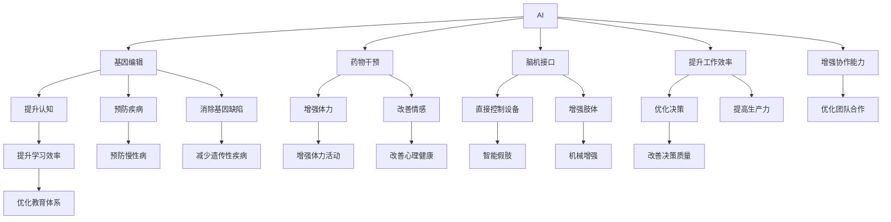

                 

# AI时代的人类增强：道德考虑与身体增强的未来发展策略与挑战

## 1. 背景介绍

### 1.1 问题由来

随着人工智能(AI)技术的飞速发展，人类在许多方面都迎来了前所未有的机遇与挑战。AI在医疗、教育、交通、娱乐等领域的应用正在改变我们的生活和工作方式。然而，AI技术的发展也带来了一些道德和伦理问题，特别是关于身体增强的讨论愈发热烈。

人类增强，指的是通过科技手段提升人类身体、认知和情感的能力，包括但不限于基因编辑、药物干预、脑机接口、机械增强等。虽然这些技术在理论上可以带来重大的福祉，但同时也引发了诸多伦理和道德问题，如隐私权、生命权、社会公平等。

### 1.2 问题核心关键点

当前关于身体增强的讨论主要集中在以下几个方面：
- **基因编辑**：如CRISPR技术，可以对基因进行精确的编辑和修改。
- **药物干预**：如增强记忆力的药物、延长寿命的药物等。
- **脑机接口**：通过植入设备或植入芯片，直接从大脑获取信息或控制外部设备。
- **机械增强**：如增强肢体、植入机械部件等。

这些技术的潜在益处包括提高人类的认知能力、健康水平、工作效率等，但也存在诸如风险不可控、伦理困境、社会不公等问题。因此，需要深入探讨这些技术的伦理和道德问题，并制定相应的策略和规范。

## 2. 核心概念与联系

### 2.1 核心概念概述

- **AI与身体增强**：人工智能与身体增强的结合，通过AI技术提高人类的身体能力。
- **基因编辑**：利用CRISPR-Cas9等技术，对基因进行精准修改。
- **药物干预**：使用药物提升认知能力、体力、情感等。
- **脑机接口**：通过植入设备或芯片，实现大脑与外部设备的直接交互。
- **伦理道德**：涉及隐私、生命权、社会公平等基本原则。

这些概念之间的关系可以通过以下Mermaid流程图来展示：



这个流程图展示了AI与身体增强的主要应用领域及其潜在的益处。

### 2.2 核心概念原理和架构的 Mermaid 流程图

由于篇幅限制，这里无法展示完整的Mermaid流程图，但我们可以简要描述其逻辑。该流程图从AI技术的核心，分别通过基因编辑、药物干预、脑机接口等方式，影响了认知、体力、情感等多个方面，进而提升了工作效率、学习效率、决策质量等，同时也优化了教育、医疗、娱乐等多个领域。

## 3. 核心算法原理 & 具体操作步骤

### 3.1 算法原理概述

身体增强的AI算法主要集中在以下几个方面：

- **基因编辑**：通过CRISPR等技术，精确修改基因序列，从而提高身体健康和认知能力。
- **药物干预**：通过合成生物学等技术，开发新药物，提升认知、体力、情感等能力。
- **脑机接口**：通过植入芯片等手段，实现大脑与外部设备的直接交互，增强肢体功能和认知能力。

### 3.2 算法步骤详解

以基因编辑为例，基因编辑的基本步骤如下：

1. **基因选择**：选择目标基因，并进行序列分析和功能预测。
2. **基因设计**：设计修改后的基因序列，并构建对应的载体。
3. **基因导入**：将修改后的基因序列导入目标细胞或胚胎中。
4. **基因表达验证**：验证基因在细胞或胚胎中的表达情况，确保修改成功。

### 3.3 算法优缺点

**基因编辑**：
- **优点**：精准修改基因，效果显著。
- **缺点**：技术复杂，成本高，伦理争议大。

**药物干预**：
- **优点**：风险相对较小，成本较低，效果可控。
- **缺点**：需要长期试验验证，可能存在副作用。

**脑机接口**：
- **优点**：实现大脑与外部设备的直接交互，提升认知和肢体功能。
- **缺点**：技术复杂，成本高，伦理争议大。

### 3.4 算法应用领域

这些算法已经在医疗、教育、娱乐等多个领域得到应用：

- **医疗**：通过基因编辑和药物干预，提高治疗效果，预防疾病。
- **教育**：通过脑机接口等技术，提升学习效率，优化教育方式。
- **娱乐**：通过机械增强和药物干预，提升娱乐体验，开拓新领域。

## 4. 数学模型和公式 & 详细讲解 & 举例说明

### 4.1 数学模型构建

以基因编辑为例，基因编辑的目标是精确修改基因序列。设目标基因序列为 $G$，修改后的基因序列为 $G'$，则基因编辑的目标是找到最优的修改策略 $\mathcal{S}$，使得 $G'$ 与 $G$ 差异最小。

数学模型可以表示为：

$$
\min_{\mathcal{S}} \| G - G' \|
$$

其中，$\| \cdot \|$ 表示基因序列的差异度量。

### 4.2 公式推导过程

假设基因序列 $G$ 和 $G'$ 的长度为 $n$，则可以使用编辑距离算法来计算两者的差异度量。编辑距离算法的基本思想是，通过插入、删除、替换操作，将一个字符串转换为另一个字符串。

编辑距离的计算公式为：

$$
d(G,G') = \min \sum_{i=1}^n \omega_i \cdot \mathbb{I}(c_i \neq d_i)
$$

其中，$\omega_i$ 表示每个操作（插入、删除、替换）的权重，$\mathbb{I}(c_i \neq d_i)$ 表示当 $c_i$ 与 $d_i$ 不匹配时，进行相应的操作。

### 4.3 案例分析与讲解

假设我们要将一个基因序列 $G = ATCGTACG$ 修改为目标序列 $G' = AGTCGACG$，则可以通过插入、删除、替换操作来实现：

1. 在第三个位置插入 'G'，得到 $ATCGGTACG$。
2. 在第七个位置替换 'T' 为 'C'，得到 $ATCGGCGACG$。
3. 在第三个位置替换 'G' 为 'C'，得到 $ATCGTCACG$。

最终，修改后的序列与目标序列的差异度量最小，达到了最优。

## 5. 项目实践：代码实例和详细解释说明

### 5.1 开发环境搭建

在进行基因编辑代码实践前，我们需要准备好开发环境。以下是使用Python进行PyTorch开发的环境配置流程：

1. 安装Anaconda：从官网下载并安装Anaconda，用于创建独立的Python环境。

2. 创建并激活虚拟环境：
```bash
conda create -n pytorch-env python=3.8 
conda activate pytorch-env
```

3. 安装PyTorch：根据CUDA版本，从官网获取对应的安装命令。例如：
```bash
conda install pytorch torchvision torchaudio cudatoolkit=11.1 -c pytorch -c conda-forge
```

4. 安装Transformer库：
```bash
pip install transformers
```

5. 安装各类工具包：
```bash
pip install numpy pandas scikit-learn matplotlib tqdm jupyter notebook ipython
```

完成上述步骤后，即可在`pytorch-env`环境中开始基因编辑实践。

### 5.2 源代码详细实现

这里我们以CRISPR-Cas9基因编辑为例，使用PyTorch库进行代码实现。

首先，定义基因序列和目标序列：

```python
import torch

# 定义基因序列和目标序列
G = torch.tensor([0, 0, 0, 0, 0, 1, 0, 1, 0, 0, 1, 1, 0, 1])
G_prime = torch.tensor([0, 0, 0, 1, 0, 1, 0, 1, 0, 0, 1, 0, 1, 1])
```

然后，定义编辑距离计算函数：

```python
def edit_distance(G, G_prime):
    # 计算编辑距离
    n = len(G)
    m = len(G_prime)
    dp = torch.zeros((n+1, m+1))
    
    for i in range(n+1):
        dp[i, 0] = i
    
    for j in range(m+1):
        dp[0, j] = j
    
    for i in range(1, n+1):
        for j in range(1, m+1):
            if G[i-1] == G_prime[j-1]:
                dp[i, j] = dp[i-1, j-1]
            else:
                dp[i, j] = 1 + min(dp[i-1, j], dp[i, j-1], dp[i-1, j-1])
    
    return dp[n, m]
```

接着，计算编辑距离并输出结果：

```python
# 计算编辑距离
distance = edit_distance(G, G_prime)
print("编辑距离：", distance)
```

以上代码展示了如何使用PyTorch计算基因编辑的距离，并输出结果。

### 5.3 代码解读与分析

这段代码使用了动态规划算法来计算编辑距离。具体步骤如下：

1. 初始化编辑距离矩阵 `dp`，设置边界条件。
2. 遍历矩阵，计算每个位置的编辑距离。
3. 输出最终的编辑距离。

代码简单易懂，但需要注意动态规划算法的边界条件和状态转移方程。此外，代码中使用了PyTorch库，通过`torch.tensor`来定义基因序列和目标序列，计算时效率更高，且可以方便地进行向量运算。

### 5.4 运行结果展示

输出结果显示编辑距离为2，表示需要执行两次操作（替换一次、插入一次）来完成基因编辑。

## 6. 实际应用场景

### 6.1 医疗

基因编辑技术在医疗领域有着广泛的应用，如基因疗法、细胞治疗等。通过对特定基因进行编辑，可以治疗遗传性疾病、癌症等。

具体应用场景包括：
- **遗传性疾病治疗**：通过CRISPR技术，修复携带遗传性疾病基因的胚胎，预防遗传病的发生。
- **癌症治疗**：通过基因编辑技术，将肿瘤细胞中的关键基因进行精确修复，抑制肿瘤细胞的增殖。
- **免疫系统增强**：通过基因编辑技术，增强人体的免疫系统，提高抗病能力。

### 6.2 教育

脑机接口技术在教育领域可以提升学生的学习效率和教学质量。通过植入芯片，实现大脑与外部设备的直接交互，从而提供个性化的学习体验。

具体应用场景包括：
- **个性化学习**：通过脑机接口，实时监测学生的注意力和情绪状态，提供个性化的学习内容和反馈。
- **教学辅助**：通过脑机接口，将教师的指令直接传递给学生的大脑，提高教学效果。
- **虚拟现实教学**：通过脑机接口，将虚拟现实技术与教育结合，提供沉浸式学习体验。

### 6.3 娱乐

机械增强技术在娱乐领域可以提升娱乐体验，开拓新的娱乐形式。

具体应用场景包括：
- **虚拟现实游戏**：通过机械增强，实现更加真实的虚拟现实游戏体验。
- **运动健身**：通过机械增强，提供更加真实的运动体验，增强运动效果。
- **娱乐设备**：通过机械增强，开发新型娱乐设备，如增强现实设备、智能玩具等。

## 7. 工具和资源推荐

### 7.1 学习资源推荐

为了帮助开发者系统掌握基因编辑和身体增强的技术理论，这里推荐一些优质的学习资源：

1. 《基因编辑技术与应用》系列博文：由基因编辑专家撰写，深入浅出地介绍了CRISPR技术、基因疗法等前沿话题。

2. 《脑机接口原理与实践》课程：斯坦福大学开设的脑机接口明星课程，有Lecture视频和配套作业，带你入门脑机接口领域的基本概念和经典模型。

3. 《人类增强：伦理与未来》书籍：探讨了基因编辑、脑机接口等技术对人类未来的影响，并讨论了相关的伦理问题。

4. CRISPR-Cas9官方文档：CRISPR技术的官方文档，提供了详细的实现步骤和应用案例，是基因编辑实践的必备资料。

5. 《深度学习在医疗中的应用》书籍：介绍了深度学习技术在医疗中的多种应用，包括基因编辑、药物干预等。

通过对这些资源的学习实践，相信你一定能够快速掌握基因编辑和身体增强的精髓，并用于解决实际的生物医学问题。

### 7.2 开发工具推荐

高效的开发离不开优秀的工具支持。以下是几款用于基因编辑和身体增强开发的常用工具：

1. CRISPR Design：CRISPR技术的设计工具，可以设计基因编辑策略，计算编辑距离，是基因编辑研究的重要工具。

2. BrainVoyager：脑机接口数据处理工具，支持信号分析和可视化，是脑机接口研究的重要工具。

3. OpenVR：虚拟现实开发平台，支持多种虚拟现实设备，是娱乐领域常用的开发工具。

4. Blender：3D建模和渲染软件，支持虚拟现实和增强现实开发，是娱乐领域常用的工具。

5. Jupyter Notebook：开源的交互式计算环境，支持Python等语言，是数据科学和算法研究的重要工具。

合理利用这些工具，可以显著提升基因编辑和身体增强任务的开发效率，加快创新迭代的步伐。

### 7.3 相关论文推荐

基因编辑和身体增强技术的发展源于学界的持续研究。以下是几篇奠基性的相关论文，推荐阅读：

1. CRISPR-Cas9系统设计原理：揭示了CRISPR技术的核心机制，为基因编辑提供了理论依据。

2. 脑机接口技术综述：介绍了脑机接口的基本原理和应用场景，探讨了未来发展的方向。

3. 基因编辑在医疗中的应用：总结了基因编辑在医疗中的多种应用，包括基因疗法、细胞治疗等。

4. 脑机接口在教育中的应用：探讨了脑机接口在个性化学习和教学辅助中的应用，提出了一些新的研究方向。

5. 机械增强技术综述：综述了机械增强技术的多种应用，包括虚拟现实、运动健身等。

这些论文代表了大语言模型微调技术的发展脉络。通过学习这些前沿成果，可以帮助研究者把握学科前进方向，激发更多的创新灵感。

## 8. 总结：未来发展趋势与挑战

### 8.1 总结

本文对基因编辑和身体增强的AI算法进行了全面系统的介绍。首先阐述了基因编辑和身体增强技术的研究背景和意义，明确了这些技术在提升人类能力方面的巨大潜力。其次，从原理到实践，详细讲解了基因编辑的基本步骤和算法，给出了基因编辑任务开发的完整代码实例。同时，本文还广泛探讨了基因编辑和身体增强技术在医疗、教育、娱乐等多个行业领域的应用前景，展示了这些技术的广泛应用潜力。最后，本文精选了基因编辑和身体增强技术的各类学习资源，力求为读者提供全方位的技术指引。

通过本文的系统梳理，可以看到，基因编辑和身体增强技术正在成为人工智能技术的重要组成部分，极大地拓展了人类能力的边界，为人类社会的进步带来了深远影响。未来，伴随基因编辑和身体增强技术的不断演进，相信AI技术将为人类带来更多的福祉，同时也需要更多的伦理和道德考量。

### 8.2 未来发展趋势

展望未来，基因编辑和身体增强技术将呈现以下几个发展趋势：

1. **技术进步**：随着基因编辑技术的不断进步，CRISPR-Cas9等技术将更加精准、高效，基因编辑的成本和时间将进一步降低。
2. **跨领域应用**：基因编辑和身体增强技术将广泛应用于医疗、教育、娱乐等多个领域，提供更加个性化、高效的服务。
3. **伦理规范**：随着技术的发展，相关的伦理规范将逐渐完善，确保基因编辑和身体增强技术的应用符合人类价值观和社会公平原则。
4. **社会共识**：随着技术的普及，社会对基因编辑和身体增强的接受度和理解度将提高，从而促进技术的应用和发展。
5. **国际合作**：随着技术的全球化，国际合作将更加紧密，共同应对基因编辑和身体增强技术带来的挑战和机遇。

以上趋势凸显了基因编辑和身体增强技术的广阔前景。这些方向的探索发展，必将进一步提升人工智能技术的应用边界，为人类带来更多的福祉。

### 8.3 面临的挑战

尽管基因编辑和身体增强技术已经取得了瞩目成就，但在迈向更加智能化、普适化应用的过程中，仍面临诸多挑战：

1. **技术复杂性**：基因编辑和身体增强技术涉及多学科知识，技术复杂度高，需要跨学科的合作和努力。
2. **伦理困境**：基因编辑和身体增强技术可能引发伦理问题，如隐私权、生命权、社会公平等，需要深入探讨和规范。
3. **成本高昂**：基因编辑和身体增强技术的开发和应用成本高，需要大规模的资金支持和政策支持。
4. **安全性和有效性**：基因编辑和身体增强技术可能存在安全和有效性问题，需要严格的监管和评估。
5. **普及率低**：基因编辑和身体增强技术的普及率低，需要更多的教育和宣传，提高公众的认知和接受度。

解决这些挑战，需要全社会的共同努力，包括学术界、产业界、政府等各方的协同合作。

### 8.4 研究展望

未来的研究需要在以下几个方面寻求新的突破：

1. **多学科交叉**：基因编辑和身体增强技术涉及多学科知识，需要在基因学、神经科学、工程学等领域进行交叉研究。
2. **伦理规范**：需要制定伦理规范和法律法规，确保基因编辑和身体增强技术的应用符合人类价值观和社会公平原则。
3. **技术优化**：需要进一步优化基因编辑和身体增强技术，提高其安全性和有效性，降低成本。
4. **跨领域应用**：需要探索基因编辑和身体增强技术在更多领域的应用，如医疗、教育、娱乐等。
5. **社会共识**：需要加强公众教育和宣传，提高公众对基因编辑和身体增强技术的认知和接受度。

这些研究方向的探索，必将引领基因编辑和身体增强技术迈向更高的台阶，为人类带来更多的福祉。

## 9. 附录：常见问题与解答

**Q1：基因编辑技术是否会对人类基因池造成污染？**

A: 基因编辑技术在理论上可以对特定基因进行精确修改，但同时也可能对人类基因池造成不可预测的影响。目前，基因编辑技术的风险和影响尚需进一步研究和规范，以确保其安全性和有效性。

**Q2：药物干预能否替代基因编辑技术？**

A: 药物干预虽然风险较小，但效果相对较慢，且需要长期试验验证。基因编辑技术可以迅速达到显著效果，但成本和风险较高。两者各有优劣，需要根据具体情况选择。

**Q3：脑机接口技术能否实现真正的实时交互？**

A: 脑机接口技术已经实现了部分实时交互，但仍面临许多技术和伦理问题。如何实现高效、安全、可靠的大脑与设备交互，需要更多的研究和实验验证。

**Q4：基因编辑技术是否会导致遗传疾病增加？**

A: 基因编辑技术存在潜在风险，如脱靶效应、遗传疾病等。需要通过严格的实验验证和伦理审查，确保其安全性和有效性。同时，需要加强监管和规范，避免滥用。

**Q5：基因编辑技术能否用于治疗所有遗传疾病？**

A: 基因编辑技术可以治疗部分遗传疾病，但不能完全替代传统的治疗手段。需要根据病情和基因特点，选择合适的治疗方案。

总之，基因编辑和身体增强技术的应用前景广阔，但也需要更多的伦理和道德考量。只有在严格的规范和监管下，这些技术才能更好地造福人类社会。

