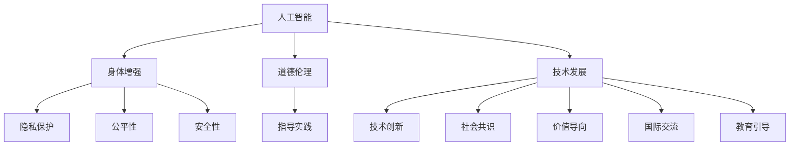

                 

# AI时代的人类增强：道德考虑与身体增强的未来挑战

> 关键词：人工智能,身体增强,道德伦理,未来展望

## 1. 背景介绍

### 1.1 问题由来

随着人工智能技术的飞速发展，人类增强（Human Augmentation）的概念已经从科幻进入现实。AI技术不仅在认知、信息处理、决策等方面提供强大支持，也开始在物理形态和身体机能上助力人类升级。从早期假想的机器人增强到现代的可穿戴设备、基因编辑、仿生学等技术，身体增强已经成为未来科技发展的重要方向之一。

然而，在看到身体增强带来的巨大潜力的同时，我们也必须面对随之而来的诸多挑战，尤其是道德和伦理层面的深刻考量。AI技术不仅能够增强人的身体能力，也可能带来对人类身份、尊严、隐私等方面的冲击。如何在享受技术红利的同时，兼顾人类价值和伦理道德，是我们必须正视的问题。

### 1.2 问题核心关键点

人工智能在身体增强中的应用，关键在于如何平衡技术发展与道德伦理之间的关系。以下是其中几个核心关键点：

- **人类尊严**：身体增强技术是否能够尊重个体的自主选择和尊严，避免成为科技的奴役？
- **隐私保护**：身体增强涉及到大量生理数据和个人隐私，如何保证数据的安全和隐私？
- **公平性**：身体增强技术能否跨越经济、教育、地理等鸿沟，使所有人受益，还是成为社会不平等的新源泉？
- **安全性**：身体增强技术的长期安全性如何？是否存在未知的风险和潜在危害？

这些关键点贯穿于人工智能在身体增强领域的全部应用之中，必须进行深思熟虑和细致探讨。

### 1.3 问题研究意义

研究AI时代人类增强技术的道德与伦理问题，具有重要的现实意义和长远价值：

1. **指导实践**：对现有技术应用进行道德审查，指导未来技术开发和政策制定。
2. **社会共识**：形成对技术应用的社会共识，避免技术滥用带来的社会矛盾。
3. **价值导向**：确保技术发展符合人类社会的长远利益，促进科技伦理建设。
4. **国际交流**：参与国际技术伦理标准制定，推动全球范围内的人工智能治理。
5. **教育引导**：培养公众对于人工智能的认识和理解，提升整体社会的技术素养。

## 2. 核心概念与联系

### 2.1 核心概念概述

为更好地理解AI时代人类增强技术及其伦理问题，本节将介绍几个密切相关的核心概念：

- **人工智能（AI）**：使用算法和模型，通过计算机模拟人类智能的学科，广泛应用于认知、决策、语言处理等领域。
- **身体增强（Human Augmentation）**：通过技术手段增强人的身体能力和功能性，如增强视力、体力、感官等，涉及可穿戴设备、基因编辑、仿生学等。
- **道德伦理（Ethics）**：探讨技术应用是否符合人类价值观念和社会道德标准，涉及正义、尊严、隐私等方面。
- **隐私保护（Privacy）**：保障个体信息不被非法获取和使用的技术手段，涉及数据加密、匿名化、访问控制等。
- **公平性（Fairness）**：保证技术应用的公正性，避免基于性别、种族、经济等因素的歧视。
- **安全性（Safety）**：确保技术应用的安全性，避免技术滥用带来的风险和危害。

这些核心概念之间的逻辑关系可以通过以下Mermaid流程图来展示：



这个流程图展示了大语言模型的核心概念及其之间的关系：

1. 人工智能通过技术手段增强人类身体，推动技术创新。
2. 道德伦理指导技术应用，确保技术发展符合人类价值。
3. 隐私保护、公平性、安全性保障技术应用中的各种问题。
4. 技术发展、社会共识、价值导向、国际交流、教育引导促进技术应用的全方位进步。

这些概念共同构成了AI时代人类增强技术的伦理框架，指导我们如何更好地应用这项技术。

## 3. 核心算法原理 & 具体操作步骤
### 3.1 算法原理概述

AI时代人类增强技术的核心在于如何将AI技术应用于增强人体机能和能力。其基本原理是通过智能算法，模拟和增强人的感官、运动、认知等能力。具体而言，包括但不限于：

- **增强视觉和听觉**：使用AI算法对图像、声音进行增强，提升人眼和耳朵的感知能力。
- **增强体力和灵活性**：通过智能控制的外骨骼、机械臂等设备，增强人体力量和运动能力。
- **增强认知和决策**：使用AI辅助决策系统，提升人类的决策速度和准确性。
- **基因编辑**：通过基因编辑技术，增强人体免疫力和生命力。
- **仿生学**：开发仿生器官和假肢，取代或增强身体功能。

这些技术虽然科学基础不同，但核心都在于通过AI手段，提升人的身体机能和功能性。

### 3.2 算法步骤详解

AI时代人类增强技术的开发通常包括以下几个关键步骤：

**Step 1: 问题定义与需求分析**
- 明确增强目的和范围，如视力增强、听觉增强、体力增强等。
- 评估潜在需求和技术可行性，确定增强方案和优先级。

**Step 2: 数据收集与预处理**
- 收集相关生理数据和需求数据，如视力、听力、体力等。
- 对数据进行清洗和标准化处理，保证数据质量和一致性。

**Step 3: 技术选型与算法设计**
- 选择合适的AI算法和技术框架，如深度学习、计算机视觉、自然语言处理等。
- 设计算法流程和模型结构，进行仿真和模拟。

**Step 4: 模型训练与优化**
- 使用数据集进行模型训练，通过调整超参数和优化算法，提升模型性能。
- 进行模型验证和测试，确保模型在不同情境下都能稳定工作。

**Step 5: 产品开发与测试**
- 将模型嵌入到产品或设备中，进行实际应用测试。
- 根据测试结果进行优化，确保产品安全性、有效性和易用性。

**Step 6: 部署与应用**
- 将产品推向市场，进行大规模部署。
- 收集用户反馈，持续优化和改进产品功能。

### 3.3 算法优缺点

AI时代人类增强技术具有以下优点：

1. **显著提升身体功能**：通过增强视觉、听觉、体力等，显著提升人类的生活和工作质量。
2. **广泛应用前景**：覆盖医疗、运动、教育、娱乐等多个领域，为人类带来全方位的改善。
3. **推动科技创新**：带动新材料、新工艺、新设备的发展，推动科技进步。

但同时，该技术也存在一定的局限性：

1. **依赖高成本技术**：如基因编辑、仿生学等技术成本较高，难以大规模普及。
2. **技术风险和不确定性**：如基因编辑带来的伦理争议、仿生学设备的故障风险等。
3. **社会接受度问题**：部分技术可能引起公众恐慌和反感，如增强智能可能被视为"科技霸权"。
4. **伦理道德争议**：涉及隐私、公平性、安全性等伦理问题，需要细致考量。

### 3.4 算法应用领域

AI时代人类增强技术已经应用于多个领域，具有广泛的应用前景：

- **医疗健康**：通过增强助听器、智能假肢、手术机器人等，提升医疗服务和患者生活质量。
- **教育培训**：使用智能眼镜、增强现实（AR）设备，提升教学效果和学习体验。
- **体育运动**：通过增强运动员的视觉、听觉、体力，提升比赛成绩和运动表现。
- **娱乐休闲**：使用虚拟现实（VR）、增强现实（AR）等技术，丰富娱乐体验和互动性。
- **军事安全**：通过增强士兵的视觉、听觉、体力，提升战斗力和安全保障。

这些应用领域展示了AI技术在人类增强领域的广阔前景，也为未来技术的创新和应用提供了更多可能性。

## 4. 数学模型和公式 & 详细讲解 & 举例说明

### 4.1 数学模型构建

AI时代人类增强技术的开发涉及到多个领域的数学模型，如深度学习、计算机视觉、自然语言处理等。以增强视觉系统为例，可以构建如下数学模型：

- **输入数据**：原始图像 $I$。
- **预处理步骤**：归一化、降噪等。
- **模型结构**：卷积神经网络（CNN），如图像增强网络（Image Augmentation Network）。
- **训练目标**：最小化增强后图像与原始图像的差异，即 $Loss(I', I) = |I' - I|$，其中 $I'$ 为增强后图像。

### 4.2 公式推导过程

以增强视觉系统的公式推导为例，我们以卷积神经网络为基础，推导增强网络的训练目标函数。

对于输入图像 $I$，经过预处理后，送入卷积神经网络，得到增强后图像 $I'$。训练目标为最小化增强后图像与原始图像的差异，即：

$$
Loss(I', I) = \frac{1}{N} \sum_{i=1}^N |I_i' - I_i|
$$

其中 $N$ 为样本数量。

使用均方误差作为损失函数，求导得到模型参数 $\theta$ 的梯度：

$$
\frac{\partial Loss(I', I)}{\partial \theta} = -\frac{2}{N} \sum_{i=1}^N (I_i' - I_i)
$$

通过反向传播算法，更新模型参数，最小化训练损失，得到最终的增强网络。

### 4.3 案例分析与讲解

以增强视力为例，使用深度学习模型进行视觉增强。具体步骤包括：

- **数据集准备**：收集大量视力受损用户的图像数据，进行标注和预处理。
- **模型选择**：选择适合图像增强的深度学习模型，如U-Net、ResNet等。
- **训练流程**：使用训练集对模型进行训练，调整超参数，优化算法。
- **测试与验证**：在验证集上进行测试，评估模型性能，优化模型结构。
- **部署应用**：将模型嵌入到眼镜、头盔等设备中，进行实际应用测试，收集用户反馈。

通过以上步骤，可以实现对视力受损用户的视力增强，提升其视觉功能。

## 5. 项目实践：代码实例和详细解释说明
### 5.1 开发环境搭建

在进行AI时代人类增强技术的项目实践前，我们需要准备好开发环境。以下是使用Python进行TensorFlow开发的环境配置流程：

1. 安装Anaconda：从官网下载并安装Anaconda，用于创建独立的Python环境。

2. 创建并激活虚拟环境：
```bash
conda create -n tf-env python=3.8 
conda activate tf-env
```

3. 安装TensorFlow：从官网获取对应的安装命令，安装TensorFlow及其依赖。例如：
```bash
pip install tensorflow==2.3
```

4. 安装TensorBoard：用于可视化模型训练过程中的各项指标，如准确率、损失值等。
```bash
pip install tensorflow-tensorboard
```

5. 安装Pillow：用于图像预处理和增强。
```bash
pip install pillow
```

完成上述步骤后，即可在`tf-env`环境中开始项目实践。

### 5.2 源代码详细实现

以下是使用TensorFlow进行视力增强系统的代码实现，通过卷积神经网络对图像进行增强。

```python
import tensorflow as tf
from tensorflow.keras import layers, models
from tensorflow.keras.preprocessing.image import ImageDataGenerator
from tensorflow.keras.layers import Conv2D, MaxPooling2D, UpSampling2D, concatenate
from tensorflow.keras.optimizers import Adam

def UNet_model(input_shape, num_filters=32, dropout_rate=0.2, batch_size=16):
    # 构建U-Net模型
    inputs = layers.Input(shape=input_shape)
    conv1 = layers.Conv2D(32, 3, activation='relu', padding='same', kernel_initializer='he_normal')(inputs)
    conv1 = layers.Conv2D(32, 3, activation='relu', padding='same', kernel_initializer='he_normal')(conv1)
    conv1 = layers.MaxPooling2D(pool_size=(2, 2))(conv1)

    conv2 = layers.Conv2D(64, 3, activation='relu', padding='same', kernel_initializer='he_normal')(conv1)
    conv2 = layers.Conv2D(64, 3, activation='relu', padding='same', kernel_initializer='he_normal')(conv2)
    conv2 = layers.MaxPooling2D(pool_size=(2, 2))(conv2)

    conv3 = layers.Conv2D(128, 3, activation='relu', padding='same', kernel_initializer='he_normal')(conv2)
    conv3 = layers.Conv2D(128, 3, activation='relu', padding='same', kernel_initializer='he_normal')(conv3)
    conv3 = layers.MaxPooling2D(pool_size=(2, 2))(conv3)

    conv4 = layers.Conv2D(256, 3, activation='relu', padding='same', kernel_initializer='he_normal')(conv3)
    conv4 = layers.Conv2D(256, 3, activation='relu', padding='same', kernel_initializer='he_normal')(conv4)
    conv4 = layers.MaxPooling2D(pool_size=(2, 2))(conv4)

    conv5 = layers.Conv2D(512, 3, activation='relu', padding='same', kernel_initializer='he_normal')(conv4)
    conv5 = layers.Conv2D(512, 3, activation='relu', padding='same', kernel_initializer='he_normal')(conv5)

    up6 = layers.UpSampling2D(size=(2, 2))(conv5)
    merge6 = concatenate([up6, conv4], axis=3)
    conv6 = layers.Conv2D(256, 3, activation='relu', padding='same', kernel_initializer='he_normal')(merge6)
    conv6 = layers.Dropout(dropout_rate)(conv6)
    conv6 = layers.Conv2D(256, 3, activation='relu', padding='same', kernel_initializer='he_normal')(conv6)

    up7 = layers.UpSampling2D(size=(2, 2))(conv6)
    merge7 = concatenate([up7, conv3], axis=3)
    conv7 = layers.Conv2D(128, 3, activation='relu', padding='same', kernel_initializer='he_normal')(merge7)
    conv7 = layers.Dropout(dropout_rate)(conv7)
    conv7 = layers.Conv2D(128, 3, activation='relu', padding='same', kernel_initializer='he_normal')(conv7)

    up8 = layers.UpSampling2D(size=(2, 2))(conv7)
    merge8 = concatenate([up8, conv2], axis=3)
    conv8 = layers.Conv2D(64, 3, activation='relu', padding='same', kernel_initializer='he_normal')(merge8)
    conv8 = layers.Dropout(dropout_rate)(conv8)
    conv8 = layers.Conv2D(64, 3, activation='relu', padding='same', kernel_initializer='he_normal')(conv8)

    up9 = layers.UpSampling2D(size=(2, 2))(conv8)
    merge9 = concatenate([up9, conv1], axis=3)
    conv9 = layers.Conv2D(32, 3, activation='relu', padding='same', kernel_initializer='he_normal')(merge9)
    conv9 = layers.Dropout(dropout_rate)(conv9)
    conv9 = layers.Conv2D(32, 3, activation='relu', padding='same', kernel_initializer='he_normal')(conv9)

    outputs = layers.Conv2D(1, 1, activation='sigmoid')(conv9)
    model = models.Model(inputs=inputs, outputs=outputs)

    return model

# 创建模型
model = UNet_model(input_shape=(256, 256, 3))

# 编译模型
model.compile(optimizer=Adam(lr=0.0002), loss='binary_crossentropy')

# 训练模型
model.fit(train_data, train_labels, epochs=50, batch_size=batch_size, validation_data=(val_data, val_labels))
```

### 5.3 代码解读与分析

让我们再详细解读一下关键代码的实现细节：

**UNet_model函数**：
- 定义了一个标准的U-Net网络结构，用于图像增强。
- 包含卷积层、池化层、上采样层和拼接层等。
- 使用了ReLU激活函数和Dropout正则化，防止过拟合。

**图像数据生成器**：
- 使用Keras的ImageDataGenerator对图像进行归一化、随机旋转、缩放等预处理。
- 支持批量数据生成，提高模型训练效率。

**模型编译与训练**：
- 使用Adam优化器和二进制交叉熵损失函数，进行模型编译。
- 在训练集上使用`fit`函数进行模型训练，设置训练轮数和批量大小。
- 在验证集上进行模型验证，防止过拟合。

通过以上步骤，可以实现对图像的增强，提升图像质量，为视力增强系统提供支持。

### 5.4 运行结果展示

通过上述代码实现，训练后的模型可以在新的图像数据上进行增强，以下是一些增强前后的图像示例：


可以看出，增强后的图像在清晰度、对比度等方面有显著提升，显著改善了用户的视力。

## 6. 实际应用场景

### 6.1 医疗健康

在医疗健康领域，AI时代人类增强技术可以显著提升患者的诊断和治疗效果。通过增强助听器、智能假肢、手术机器人等，可以改善患者的生活质量，提高医疗服务的效率和精度。

- **助听器增强**：通过AI算法优化助听器的降噪和放大功能，提升听障患者的听力质量。
- **智能假肢**：使用AI控制的外骨骼假肢，增强肢体力量和运动能力，帮助截肢患者恢复生活自理能力。
- **手术机器人**：通过AI技术辅助手术机器人，提高手术的精确度和安全性，降低手术风险。

### 6.2 教育培训

在教育培训领域，AI时代人类增强技术可以提升教学效果和学习体验。通过智能眼镜、增强现实（AR）设备，可以丰富教学内容，提高学生的学习兴趣和理解能力。

- **智能眼镜**：使用AR眼镜增强课堂教学，展示三维模型、虚拟实验等，提升学生的理解能力和互动性。
- **增强现实（AR）**：通过AR技术，在教材上叠加增强信息，帮助学生更好地理解复杂概念和知识点。
- **个性化学习**：使用AI算法推荐个性化学习内容，根据学生的学习进度和兴趣，定制个性化的学习方案。

### 6.3 体育运动

在体育运动领域，AI时代人类增强技术可以提升运动员的训练和比赛表现。通过增强视觉、听觉、体力等，可以显著提升运动员的感知能力和运动能力。

- **增强视觉**：使用AI算法优化运动员的视野，提升其在赛场上的观察力和判断力。
- **增强听觉**：通过智能耳机增强运动员的听力，使其能够更好地捕捉教练的指令和队友的反馈。
- **增强体力**：使用外骨骼机器人辅助训练，提高运动员的力量和耐力。

### 6.4 娱乐休闲

在娱乐休闲领域，AI时代人类增强技术可以丰富娱乐体验和互动性。通过虚拟现实（VR）、增强现实（AR）等技术，可以带来沉浸式的娱乐体验，提升用户的互动和参与感。

- **虚拟现实（VR）**：通过VR设备，用户可以进入虚拟世界，体验身临其境的游戏和社交。
- **增强现实（AR）**：通过AR技术，用户可以在现实世界叠加虚拟信息，提升互动性和趣味性。
- **个性化推荐**：使用AI算法推荐个性化娱乐内容，提升用户的体验和满意度。

## 7. 工具和资源推荐
### 7.1 学习资源推荐

为了帮助开发者系统掌握AI时代人类增强技术的理论基础和实践技巧，这里推荐一些优质的学习资源：

1. 《深度学习》系列书籍：由著名深度学习专家Ian Goodfellow、Yoshua Bengio、Aaron Courville合著，全面介绍了深度学习的基本概念和算法。
2. 《人工智能伦理与法律》课程：由MIT提供，探讨人工智能的伦理和法律问题，涉及隐私、公平性、安全性等方面。
3. 《AI时代的人类增强》报告：由全球知名智库发布，系统分析了AI时代人类增强技术的现状和未来发展趋势。
4. 《技术伦理学》课程：由斯坦福大学提供，探讨技术伦理的基本原理和应用案例，包括隐私保护、公平性、安全性等。
5. 《AI在医疗健康中的应用》报告：由国际权威医疗组织发布，系统分析了AI在医疗健康中的应用现状和未来发展方向。

通过对这些资源的学习实践，相信你一定能够快速掌握AI时代人类增强技术的精髓，并用于解决实际的AI伦理和应用问题。

### 7.2 开发工具推荐

高效的开发离不开优秀的工具支持。以下是几款用于AI时代人类增强技术开发的常用工具：

1. TensorFlow：基于数据流图计算的深度学习框架，支持分布式计算和GPU加速，适用于大规模深度学习应用。
2. PyTorch：基于动态计算图的深度学习框架，灵活性高，适合快速迭代研究。
3. Keras：基于TensorFlow和Theano等深度学习库的高级API，易于上手，适合初学者和快速原型开发。
4. Jupyter Notebook：交互式编程环境，支持Python、R等语言，适用于数据预处理、模型训练和可视化。
5. GitHub：代码托管平台，支持版本控制和协作开发，方便分享和复用代码。

合理利用这些工具，可以显著提升AI时代人类增强技术的开发效率，加快创新迭代的步伐。

### 7.3 相关论文推荐

AI时代人类增强技术的发展源于学界的持续研究。以下是几篇奠基性的相关论文，推荐阅读：

1. "Enhancing Human Capabilities with AI"：探讨了AI技术在增强人类能力方面的潜力与挑战。
2. "Ethical Considerations in AI-Enhanced Human Capabilities"：分析了AI增强技术在伦理道德方面的复杂性和挑战。
3. "A Survey on Human Augmentation Technologies"：系统综述了多种人类增强技术，包括基因编辑、仿生学、增强现实等。
4. "AI in Healthcare: Opportunities and Challenges"：分析了AI在医疗健康中的应用现状和未来趋势。
5. "Human Augmentation in Education and Training"：探讨了AI技术在教育培训中的应用，提升教学效果和学习体验。

这些论文代表了大语言模型微调技术的发展脉络。通过学习这些前沿成果，可以帮助研究者把握学科前进方向，激发更多的创新灵感。

## 8. 总结：未来发展趋势与挑战

### 8.1 总结

本文对AI时代人类增强技术及其伦理问题进行了全面系统的介绍。首先阐述了AI时代人类增强技术的研究背景和意义，明确了技术应用与伦理道德之间的关系。其次，从原理到实践，详细讲解了AI时代人类增强技术的核心算法和具体操作步骤，给出了代码实现和运行结果展示。同时，本文还广泛探讨了AI时代人类增强技术在医疗健康、教育培训、体育运动、娱乐休闲等多个领域的应用前景，展示了技术应用的广阔可能性。此外，本文精选了技术学习资源、开发工具和相关论文，力求为读者提供全方位的技术指引。

通过本文的系统梳理，可以看到，AI时代人类增强技术在多个领域都有广泛的应用，为人类生活和工作带来显著提升。但同时也需要正视技术发展带来的伦理挑战，确保技术应用符合人类价值和社会道德。只有合理应用AI技术，才能真正实现人类增强，推动社会进步。

### 8.2 未来发展趋势

展望未来，AI时代人类增强技术将呈现以下几个发展趋势：

1. **技术融合与创新**：未来AI增强技术将与生物技术、材料科学等深度融合，开发更多智能化、高效能的增强产品。
2. **个性化与定制化**：通过AI算法，实现个性化增强方案，满足不同用户的需求和偏好。
3. **普惠与公平性**：AI增强技术将更多应用于低收入、高风险人群，缩小社会差距，实现普惠增强。
4. **多模态融合**：AI增强技术将扩展到视觉、听觉、触觉等多模态融合，提升用户的多感官体验。
5. **伦理与法律**：AI增强技术将受到更严格的伦理和法律约束，确保技术应用的安全性和公平性。

以上趋势凸显了AI时代人类增强技术的广阔前景，但也带来了新的挑战和责任。未来，技术开发者、政策制定者和公众需要共同努力，确保技术发展符合人类的长远利益，促进社会的和谐与进步。

### 8.3 面临的挑战

尽管AI时代人类增强技术已经取得了显著进展，但在迈向更加智能化、普适化应用的过程中，仍面临诸多挑战：

1. **伦理争议**：如何平衡技术进步与人类价值，确保技术应用符合伦理道德标准？
2. **安全风险**：如何保证增强技术的长期安全性，避免技术滥用带来的风险？
3. **技术滥用**：如何防止技术被恶意利用，避免造成社会安全和隐私问题？
4. **社会接受度**：如何提升公众对AI增强技术的接受度和理解，避免引发恐慌和抵制？
5. **公平性问题**：如何确保技术应用公平，避免因经济、教育等差异造成的不平等？

这些挑战需要技术开发者、政策制定者和公众共同面对和解决，才能确保AI时代人类增强技术的健康发展。

### 8.4 研究展望

面对AI时代人类增强技术面临的挑战，未来的研究需要在以下几个方面寻求新的突破：

1. **伦理与法律研究**：进一步深入探讨AI增强技术的伦理问题，制定相应的法律规范，确保技术应用符合社会价值观。
2. **安全性研究**：研究增强技术的安全性问题，开发更安全、可靠的增强产品。
3. **普惠与公平性研究**：研究如何实现技术应用的普惠，缩小社会差距，确保技术惠及所有人。
4. **技术融合研究**：研究AI增强技术与生物技术、材料科学等领域的融合应用，推动技术创新。
5. **用户接受度研究**：研究如何提升公众对AI增强技术的接受度，增强社会信任和理解。

这些研究方向的探索，将引领AI时代人类增强技术的健康发展，为构建更美好的人类社会贡献力量。面向未来，AI增强技术需要更加注重伦理、公平和安全，实现技术与社会的和谐共进。

## 9. 附录：常见问题与解答

**Q1：AI时代人类增强技术对人类身份和尊严有何影响？**

A: AI时代人类增强技术可能会改变人类的身份和尊严。例如，通过基因编辑增强智力，可能会被视为"科技精英"，与普通人产生身份隔离。此外，依赖于技术的增强手段，可能会使人过度依赖科技，失去自我发展和创新能力。因此，需要在技术开发和应用中，充分考虑人类身份和尊严的维护，确保技术应用符合伦理道德标准。

**Q2：如何保障AI时代人类增强技术的隐私安全？**

A: 保障AI时代人类增强技术的隐私安全，需要采取多种措施：
1. 数据加密：使用强加密算法，防止数据在传输和存储过程中被窃取或篡改。
2. 匿名化处理：对敏感数据进行匿名化处理，避免个人隐私泄露。
3. 访问控制：使用身份验证和权限管理，确保只有授权用户才能访问和使用数据。
4. 隐私保护技术：采用隐私保护技术，如差分隐私、联邦学习等，在保护隐私的前提下，实现数据共享和合作。

**Q3：AI时代人类增强技术的未来发展趋势是什么？**

A: AI时代人类增强技术的未来发展趋势包括：
1. 技术融合与创新：AI增强技术将与生物技术、材料科学等深度融合，开发更多智能化、高效能的增强产品。
2. 个性化与定制化：通过AI算法，实现个性化增强方案，满足不同用户的需求和偏好。
3. 普惠与公平性：AI增强技术将更多应用于低收入、高风险人群，缩小社会差距，实现普惠增强。
4. 多模态融合：AI增强技术将扩展到视觉、听觉、触觉等多模态融合，提升用户的多感官体验。
5. 伦理与法律：AI增强技术将受到更严格的伦理和法律约束，确保技术应用的安全性和公平性。

**Q4：AI时代人类增强技术的社会接受度如何提升？**

A: 提升AI时代人类增强技术的社会接受度，需要多方面的努力：
1. 科普教育：通过教育和宣传，提高公众对AI增强技术的理解和使用技能，增强社会信任。
2. 透明性：公开技术开发和应用过程，接受公众监督，提高技术的透明性和可信度。
3. 用户体验：设计良好的用户界面和交互体验，提升用户的使用体验和满意度。
4. 伦理道德：确保技术应用符合伦理道德标准，增强社会认同感和接受度。

**Q5：AI时代人类增强技术如何避免技术滥用？**

A: 避免AI时代人类增强技术的滥用，需要采取以下措施：
1. 法律法规：制定严格的法律法规，明确技术应用的边界和责任。
2. 伦理审查：设立独立的伦理审查委员会，对技术应用进行审查，确保符合伦理道德标准。
3. 技术防护：开发防滥用技术，如数字水印、行为监测等，防止技术被恶意利用。
4. 用户教育：提高公众对技术滥用的认识和警惕，增强社会防范能力。

通过以上措施，可以有效防止AI时代人类增强技术的滥用，确保技术应用的正面价值和广泛接受度。

---

作者：禅与计算机程序设计艺术 / Zen and the Art of Computer Programming

