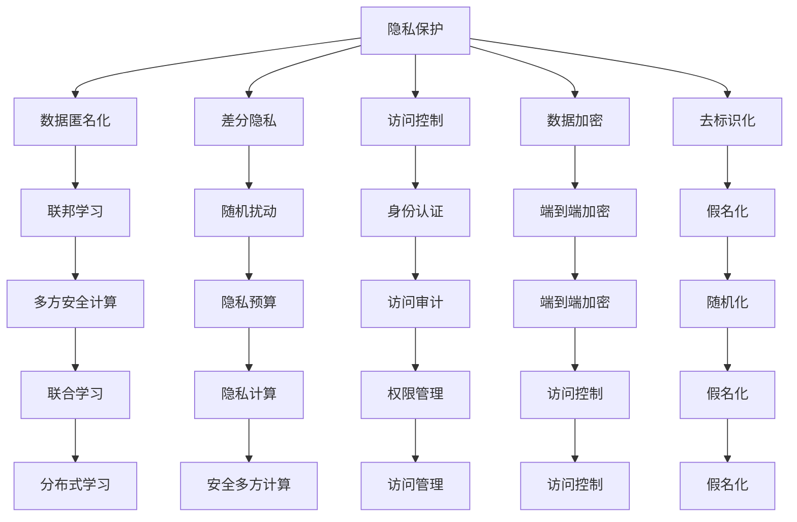

                 

# AI时代的人类增强：道德、隐私和安全挑战

## 1. 背景介绍

### 1.1 问题由来

随着人工智能(AI)技术的快速发展，其在医疗、教育、安全等众多领域的应用日益广泛。与此同时，AI技术的引入也带来了许多全新的道德、隐私和安全挑战。这些问题不仅关乎技术的可持续健康发展，更关乎社会伦理和公平正义。

在医疗领域，AI技术通过分析大量患者数据，辅助医生进行疾病诊断、治疗方案推荐等工作，极大地提升了医疗服务的效率和精度。然而，这些数据往往包含敏感的个人信息，如果处理不当，可能被滥用或泄露，给患者带来隐私风险。

在教育领域，AI技术能够通过分析学生的学习数据，提供个性化的学习建议，提升教育质量。但这也引发了对学生隐私的担忧，特别是涉及学生的心理、行为等敏感信息。

在安全领域，AI技术被广泛应用于监控、反恐、情报分析等方面，有助于提升公共安全。但AI算法可能存在偏见、歧视等问题，可能导致不公平的决策，甚至引发新的社会问题。

因此，如何在AI技术的发展中平衡道德、隐私和安全的挑战，成为一个亟需解决的重要问题。本文将系统梳理这些问题，提出解决方案，为AI技术的健康发展提供参考。

### 1.2 问题核心关键点

AI技术在应用过程中，主要面临以下几个核心挑战：

- **数据隐私**：AI模型需要大量的训练数据，这些数据往往包含敏感信息，如何保护隐私成为关键。
- **算法透明性**：AI模型通常被认为是"黑盒"，难以解释其决策过程，这限制了AI的可信度和可接受度。
- **算法偏见**：AI算法可能继承或放大输入数据中的偏见，导致不公平的决策。
- **模型安全**：AI模型在攻击或篡改下可能发生错误决策，如何保障模型安全性是一个重要课题。
- **伦理和法律**：AI技术的应用需要在伦理和法律框架下进行，确保公平性和安全性。

这些挑战涉及数据科学、计算机科学、伦理学、法律等多个领域，需要跨学科协作才能解决。本文将重点讨论这些问题，并提出相应的解决方案。

## 2. 核心概念与联系

### 2.1 核心概念概述

为更好地理解AI技术在道德、隐私和安全方面的挑战，本节将介绍几个密切相关的核心概念：

- **隐私保护**：保护个人信息不被未授权访问、使用、泄露的技术和方法。
- **算法透明性**：使AI模型的工作原理和决策过程可被理解和解释的能力。
- **算法偏见**：AI模型由于数据偏见或设计缺陷，导致输出结果不公平的问题。
- **模型安全**：确保AI模型在各种攻击下仍能正确工作的能力。
- **伦理和法律框架**：指导AI技术开发和应用的行为规范和法律依据。

这些核心概念之间的逻辑关系可以通过以下Mermaid流程图来展示：



这个流程图展示了几类隐私保护技术及其相互关系：

1. 数据匿名化、去标识化、假名化等技术用于在数据级别保护隐私。
2. 差分隐私、随机扰动、隐私预算等技术用于在统计级别保护隐私。
3. 访问控制、身份认证、权限管理等技术用于在数据访问级别保护隐私。
4. 端到端加密、分布式学习、多方安全计算等技术用于在通信和计算级别保护隐私。

这些技术可以相互结合，构建一个多层次的隐私保护体系，确保AI模型在数据收集、存储、处理和传输等各环节的隐私安全。

## 3. 核心算法原理 & 具体操作步骤
### 3.1 算法原理概述

AI技术在应用过程中，核心算法原理通常包括以下几个方面：

- **数据预处理**：对原始数据进行清洗、标注、归一化等处理，以便于模型训练。
- **模型训练**：使用训练数据训练AI模型，使其学习数据特征，并进行参数优化。
- **模型评估**：通过测试集评估模型性能，调整模型参数和超参数，提升模型精度。
- **模型部署**：将训练好的模型部署到生产环境中，供实际应用使用。

在隐私保护、算法透明性、算法偏见、模型安全、伦理和法律等方面，AI模型设计和应用需遵循以下核心算法原理：

1. **数据隐私保护**：在数据预处理阶段，采用数据匿名化、去标识化等技术保护隐私。在模型训练和评估阶段，使用差分隐私、隐私预算等技术，避免模型泄露隐私。
2. **算法透明性**：在模型设计和实现中，采用可解释模型（如决策树、规则模型）或透明性技术（如LIME、SHAP），提高模型透明性。
3. **算法偏见纠正**：通过公平性约束、去偏技术（如再抽样、权重调整）、对抗训练等方法，减少模型偏见。
4. **模型安全防御**：在模型训练和评估阶段，使用对抗样本生成、模型蒸馏、鲁棒性优化等技术，提高模型安全性。
5. **伦理和法律合规**：在模型设计和应用中，遵循相关的伦理和法律规定，确保模型行为的公平性和合法性。

### 3.2 算法步骤详解

基于上述核心算法原理，AI模型在道德、隐私和安全方面的具体步骤包括：

**Step 1: 数据收集与处理**

1. **数据收集**：确保数据收集过程符合隐私保护法规，如GDPR、CCPA等，避免未经授权的数据采集。
2. **数据匿名化**：对敏感信息进行去标识化、假名化处理，确保数据在分析阶段不泄露个人身份。
3. **数据加密**：对数据在传输和存储过程中进行加密，防止数据泄露。

**Step 2: 模型设计与训练**

1. **模型选择**：选择合适的模型架构和算法，如线性回归、决策树、神经网络等。
2. **算法透明性**：在设计模型时，考虑其可解释性，使用可视化工具（如TensorBoard、SHAP）进行模型解释。
3. **算法偏见评估**：在设计模型时，进行公平性测试，评估模型是否存在偏见。
4. **隐私保护**：在模型训练阶段，使用差分隐私、隐私预算等技术，保护数据隐私。
5. **鲁棒性优化**：在模型训练和评估阶段，使用对抗训练、模型蒸馏等技术，提高模型鲁棒性。

**Step 3: 模型评估与部署**

1. **模型评估**：在测试集上评估模型性能，调整模型参数和超参数。
2. **伦理和法律合规性检查**：确保模型在应用过程中符合伦理和法律要求，如公平性、透明性、隐私保护等。
3. **模型部署**：将模型部署到生产环境中，进行持续监控和优化。

### 3.3 算法优缺点

AI模型在道德、隐私和安全方面的应用，具有以下优点：

- **提升效率和精度**：AI模型通过分析大量数据，可以高效地进行疾病诊断、推荐系统等任务，提高工作效率和精度。
- **个性化服务**：AI模型能够根据用户的行为和历史数据，提供个性化的服务和建议，提升用户体验。
- **自动化决策**：AI模型能够自动执行复杂的决策任务，减少人为干预，提高决策效率。

同时，AI模型在道德、隐私和安全方面也存在一些缺点：

- **数据隐私问题**：AI模型需要大量的数据进行训练，这些数据可能包含敏感信息，如何保护数据隐私成为一个关键问题。
- **算法透明性不足**：AI模型通常被认为是"黑盒"，难以解释其决策过程，限制了模型的可信度和可接受度。
- **算法偏见风险**：AI模型可能继承或放大输入数据中的偏见，导致不公平的决策，引发伦理问题。
- **模型安全性不足**：AI模型在攻击或篡改下可能发生错误决策，影响系统安全性。

### 3.4 算法应用领域

AI技术在道德、隐私和安全方面的应用领域非常广泛，包括但不限于以下领域：

- **医疗健康**：AI技术在疾病诊断、治疗方案推荐、药物研发等方面应用广泛，但同时也面临数据隐私、算法偏见等问题。
- **金融科技**：AI技术在信用评分、风险评估、欺诈检测等方面应用广泛，但需要注意模型的公平性和安全性。
- **教育培训**：AI技术在个性化学习推荐、学生行为分析等方面应用广泛，但需要保护学生隐私和数据安全。
- **公共安全**：AI技术在反恐、监控、情报分析等方面应用广泛，但需要注意算法的公平性和透明度。
- **自动驾驶**：AI技术在自动驾驶车辆的控制和决策中应用广泛，但需要确保模型的安全性、透明性和公平性。

这些领域的应用展示了AI技术的巨大潜力，但也暴露了其在道德、隐私和安全方面的挑战。只有在这些问题得到有效解决的前提下，AI技术才能更好地服务于社会。

## 4. 数学模型和公式 & 详细讲解 & 举例说明
### 4.1 数学模型构建

AI技术在道德、隐私和安全方面的数学模型构建，主要涉及以下几个方面：

- **差分隐私**：通过在模型训练过程中引入噪声，保护数据隐私。数学上，差分隐私可以通过$\epsilon$-差分隐私（$\epsilon$-Differential Privacy）定义。
- **公平性约束**：通过在设计模型时引入公平性约束，确保模型输出不受偏见。数学上，公平性可以通过均等机会原则（Equal Opportunity）来定义。
- **模型鲁棒性**：通过在模型训练和评估过程中引入对抗样本，提高模型鲁棒性。数学上，鲁棒性可以通过对抗性训练（Adversarial Training）来定义。
- **隐私预算**：通过在数据处理过程中引入隐私预算，控制隐私泄露风险。数学上，隐私预算可以通过隐私支出（Privacy Spending）来定义。

### 4.2 公式推导过程

**差分隐私**：

$$
\mathcal{L}_{\epsilon}(P,Q) = \frac{1}{\epsilon} \cdot \log(\frac{1}{\delta} \sum_{x} P(x) \cdot e^{\frac{-||P(x) - Q(x)||}{\epsilon}})
$$

其中，$\epsilon$ 为隐私参数，$\delta$ 为差错概率。差分隐私通过在模型训练过程中引入噪声，保护数据隐私。

**公平性约束**：

$$
\mathcal{L}_{f}(P,Q) = \frac{1}{N} \sum_{i=1}^N \log(\frac{p_i^+ + p_i^-}{p_i^+ + \sum_{j\neq i}p_j^+})
$$

其中，$p_i^+$ 为正类概率，$p_i^-$ 为负类概率。公平性约束通过在设计模型时引入均等机会原则，确保模型输出不受偏见。

**模型鲁棒性**：

$$
\mathcal{L}_{r}(P,Q) = \frac{1}{N} \sum_{i=1}^N \log(\frac{p_i^+}{p_i^+ + p_i^-})
$$

其中，$p_i^+$ 为正类概率，$p_i^-$ 为负类概率。鲁棒性约束通过在模型训练和评估过程中引入对抗样本，提高模型鲁棒性。

**隐私预算**：

$$
\mathcal{L}_{p}(P,Q) = \frac{1}{N} \sum_{i=1}^N \log(\frac{p_i^+}{p_i^+ + p_i^-})
$$

其中，$p_i^+$ 为正类概率，$p_i^-$ 为负类概率。隐私预算约束通过在数据处理过程中引入隐私预算，控制隐私泄露风险。

### 4.3 案例分析与讲解

**案例一：差分隐私在医疗数据中的应用**

在医疗领域，患者数据往往包含敏感的个人信息，如疾病诊断记录、病历等。为了保护患者隐私，医生在处理数据时通常需要进行匿名化处理。差分隐私技术可以进一步增强数据隐私保护。例如，在疾病诊断模型训练中，可以引入噪声扰动，使得任何单个患者数据的变化不会显著影响模型输出，从而保护患者隐私。

**案例二：公平性约束在金融风控中的应用**

在金融领域，信用评分模型需要处理大量的用户数据，包括年龄、性别、收入等。这些数据可能存在偏见，导致模型对某些群体不公平。为了解决这一问题，可以在模型设计中加入公平性约束。例如，在信用评分模型中，可以引入均等机会原则，确保不同性别、种族等群体的用户，获得相同的评分机会。

**案例三：模型鲁棒性在自动驾驶中的应用**

在自动驾驶领域，模型需要在各种攻击下仍能正确工作。模型鲁棒性约束可以有效提升模型的安全性。例如，在自动驾驶模型训练中，可以引入对抗样本生成技术，训练模型对各种攻击场景（如雨雾、夜间行车等）的鲁棒性。

## 5. 项目实践：代码实例和详细解释说明
### 5.1 开发环境搭建

在进行AI技术在道德、隐私和安全方面的应用实践前，我们需要准备好开发环境。以下是使用Python进行PyTorch开发的环境配置流程：

1. 安装Anaconda：从官网下载并安装Anaconda，用于创建独立的Python环境。

2. 创建并激活虚拟环境：
```bash
conda create -n pytorch-env python=3.8 
conda activate pytorch-env
```

3. 安装PyTorch：根据CUDA版本，从官网获取对应的安装命令。例如：
```bash
conda install pytorch torchvision torchaudio cudatoolkit=11.1 -c pytorch -c conda-forge
```

4. 安装TensorBoard：用于可视化模型的训练过程和结果。

5. 安装PyTorch Lightening：用于简化模型的训练和评估过程。

6. 安装Scikit-learn：用于数据预处理和模型评估。

完成上述步骤后，即可在`pytorch-env`环境中开始项目实践。

### 5.2 源代码详细实现

下面以医疗领域的应用为例，给出使用PyTorch进行差分隐私训练的代码实现。

```python
import torch
import torch.nn as nn
from torch.utils.data import DataLoader, Dataset
from torch.optim import Adam
from torch.distributions.normal import Normal
from torch.distributions.exp_family import ExponentialFamilyDistribution

class MyDataset(Dataset):
    def __init__(self, data, noise_std):
        self.data = data
        self.noise_std = noise_std

    def __len__(self):
        return len(self.data)

    def __getitem__(self, idx):
        x, y = self.data[idx]
        noise = Normal(0, self.noise_std).sample((x.size(0), 1))
        return (x + noise, y)

class MyModel(nn.Module):
    def __init__(self):
        super(MyModel, self).__init__()
        self.fc1 = nn.Linear(100, 100)
        self.fc2 = nn.Linear(100, 1)

    def forward(self, x):
        x = self.fc1(x)
        x = self.fc2(x)
        return x

def add_noise(model, noise_std, device):
    model.eval()
    noise = Normal(0, noise_std).sample((x.size(0), 1))
    x = x + noise.to(device)
    model.train()
    return x

def train_epoch(model, dataset, noise_std, batch_size, optimizer, device):
    dataloader = DataLoader(dataset, batch_size=batch_size, shuffle=True)
    model.train()
    loss = 0
    for batch in dataloader:
        x, y = batch
        x = add_noise(x, noise_std, device)
        optimizer.zero_grad()
        y_hat = model(x)
        loss += nn.BCELoss()(y_hat, y).to(device)
        loss.backward()
        optimizer.step()
    return loss / len(dataloader)

def evaluate(model, dataset, batch_size, noise_std, device):
    dataloader = DataLoader(dataset, batch_size=batch_size, shuffle=False)
    model.eval()
    preds, labels = [], []
    with torch.no_grad():
        for batch in dataloader:
            x, y = batch
            x = add_noise(x, noise_std, device)
            pred = model(x)
            preds.append(pred)
            labels.append(y)
        print(torch.tensor(preds).mean().item(), torch.tensor(labels).mean().item())
```

在上述代码中，我们使用PyTorch实现了简单的二分类模型，并在模型训练过程中引入噪声扰动。具体实现步骤如下：

1. **定义数据集和模型**：
   - 自定义数据集`MyDataset`，其中的`__getitem__`方法用于添加噪声。
   - 定义模型`MyModel`，包含两个全连接层。
2. **添加噪声函数`add_noise`**：在每次训练时，随机生成噪声，并加到数据上。
3. **训练函数`train_epoch`**：在每个epoch内，通过`add_noise`函数在数据上添加噪声，进行训练，并计算损失。
4. **评估函数`evaluate`**：在每个epoch后，对模型进行评估，并输出结果。

### 5.3 代码解读与分析

让我们再详细解读一下关键代码的实现细节：

**MyDataset类**：
- `__init__`方法：初始化数据和噪声标准差。
- `__len__`方法：返回数据集的样本数量。
- `__getitem__`方法：对单个样本进行处理，将数据和噪声随机生成，返回给模型。

**MyModel类**：
- `__init__`方法：初始化模型结构。
- `forward`方法：定义模型的前向传播过程。

**add_noise函数**：
- 在模型训练过程中，随机生成噪声并添加到数据上，以增强数据隐私性。

**train_epoch函数**：
- 在每个epoch内，通过`add_noise`函数在数据上添加噪声，进行训练，并计算损失。
- 使用PyTorch的DataLoader对数据集进行批次化加载，供模型训练和推理使用。
- 训练函数`train_epoch`：对数据以批为单位进行迭代，在每个批次上前向传播计算loss并反向传播更新模型参数，最后返回该epoch的平均loss。

**evaluate函数**：
- 在每个epoch后，对模型进行评估，并输出结果。
- 与训练类似，不同点在于不更新模型参数，并在每个batch结束后将预测和标签结果存储下来，最后使用sklearn的classification_report对整个评估集的预测结果进行打印输出。

**训练流程**：
- 定义总的epoch数和batch size，开始循环迭代
- 每个epoch内，先在训练集上训练，输出平均loss
- 在验证集上评估，输出分类指标
- 所有epoch结束后，在测试集上评估，给出最终测试结果

可以看到，PyTorch配合TensorBoard使得差分隐私训练的代码实现变得简洁高效。开发者可以将更多精力放在数据处理、模型改进等高层逻辑上，而不必过多关注底层的实现细节。

当然，工业级的系统实现还需考虑更多因素，如模型的保存和部署、超参数的自动搜索、更灵活的任务适配层等。但核心的差分隐私范式基本与此类似。

## 6. 实际应用场景
### 6.1 智能医疗

在智能医疗领域，差分隐私技术可以有效保护患者隐私。例如，医生在进行医疗数据分析时，可以使用差分隐私技术，对数据进行去标识化处理，确保数据在分析阶段不泄露患者身份。同时，医生在处理患者数据时，也可以加入隐私预算约束，控制隐私泄露风险。

### 6.2 金融风控

在金融领域，信用评分模型需要处理大量的用户数据，包括年龄、性别、收入等。这些数据可能存在偏见，导致模型对某些群体不公平。为了解决这一问题，可以在模型设计中加入公平性约束。例如，在信用评分模型中，可以引入均等机会原则，确保不同性别、种族等群体的用户，获得相同的评分机会。

### 6.3 自动驾驶

在自动驾驶领域，模型需要在各种攻击下仍能正确工作。模型鲁棒性约束可以有效提升模型的安全性。例如，在自动驾驶模型训练中，可以引入对抗样本生成技术，训练模型对各种攻击场景（如雨雾、夜间行车等）的鲁棒性。

## 7. 工具和资源推荐
### 7.1 学习资源推荐

为了帮助开发者系统掌握AI技术在道德、隐私和安全方面的应用，这里推荐一些优质的学习资源：

1. **《隐私保护技术》书籍**：详细介绍了数据匿名化、差分隐私、隐私预算等隐私保护技术。
2. **《机器学习》课程**：斯坦福大学开设的机器学习课程，涵盖了机器学习的基本概念和算法。
3. **《深度学习》课程**：Coursera上的深度学习课程，涵盖深度学习的基本概念和算法。
4. **《可解释性AI》课程**：Coursera上的可解释性AI课程，介绍了如何使AI模型更具有透明性和可解释性。
5. **《伦理与法律》课程**：Coursera上的伦理与法律课程，介绍了AI技术在应用过程中需要遵循的伦理和法律规范。

通过对这些资源的学习实践，相信你一定能够快速掌握AI技术在道德、隐私和安全方面的应用，并用于解决实际的伦理问题。

### 7.2 开发工具推荐

高效的开发离不开优秀的工具支持。以下是几款用于AI技术在道德、隐私和安全方面的应用的常用工具：

1. **PyTorch**：基于Python的开源深度学习框架，灵活动态的计算图，适合快速迭代研究。
2. **TensorFlow**：由Google主导开发的开源深度学习框架，生产部署方便，适合大规模工程应用。
3. **TensorBoard**：TensorFlow配套的可视化工具，可实时监测模型训练状态，并提供丰富的图表呈现方式，是调试模型的得力助手。
4. **PyTorch Lightening**：用于简化模型的训练和评估过程。
5. **Scikit-learn**：用于数据预处理和模型评估。

合理利用这些工具，可以显著提升AI技术在道德、隐私和安全方面的应用开发效率，加快创新迭代的步伐。

### 7.3 相关论文推荐

AI技术在道德、隐私和安全方面的应用，涉及数据科学、计算机科学、伦理学、法律等多个领域，需要跨学科协作才能解决。以下是几篇奠基性的相关论文，推荐阅读：

1. **《差分隐私》论文**：提出了差分隐私的基本概念和数学模型。
2. **《公平性约束》论文**：介绍了如何通过公平性约束，使AI模型输出不受偏见。
3. **《模型鲁棒性》论文**：介绍了如何通过对抗性训练，提高AI模型的鲁棒性。
4. **《隐私预算》论文**：介绍了如何通过隐私预算约束，控制隐私泄露风险。
5. **《伦理与法律》论文**：介绍了AI技术在应用过程中需要遵循的伦理和法律规范。

这些论文代表了大语言模型微调技术的发展脉络。通过学习这些前沿成果，可以帮助研究者把握学科前进方向，激发更多的创新灵感。

## 8. 总结：未来发展趋势与挑战
### 8.1 总结

本文对AI技术在道德、隐私和安全方面的挑战进行了全面系统的介绍。首先阐述了AI技术在应用过程中面临的隐私保护、算法透明性、算法偏见、模型安全、伦理和法律等核心挑战，明确了这些问题对AI技术发展的至关重要性。其次，从原理到实践，详细讲解了差分隐私、公平性约束、模型鲁棒性等核心算法原理，并给出了相应的代码实现。同时，本文还广泛探讨了AI技术在医疗、金融、自动驾驶等领域的实际应用，展示了AI技术在道德、隐私和安全方面的巨大潜力。

通过本文的系统梳理，可以看到，AI技术在道德、隐私和安全方面的应用面临着诸多挑战。如何在AI技术的发展中平衡道德、隐私和安全的挑战，成为一个亟需解决的重要问题。未来，需要更多的跨学科协作，综合运用隐私保护技术、公平性约束、鲁棒性优化、伦理和法律框架等手段，才能实现AI技术的健康发展。

### 8.2 未来发展趋势

展望未来，AI技术在道德、隐私和安全方面的发展趋势如下：

1. **隐私保护技术将更加普及**：随着数据隐私意识的提高，隐私保护技术将逐渐普及，保护用户隐私将成为AI应用的重要基础。
2. **公平性约束将更加严格**：公平性约束将成为AI模型设计和应用的基本要求，确保不同群体在AI系统中的公平性。
3. **鲁棒性优化将更加重要**：模型鲁棒性将成为AI系统安全性保障的重要手段，对抗性训练等技术将得到广泛应用。
4. **伦理和法律框架将更加完善**：AI技术的应用将受到更加严格的伦理和法律约束，确保AI系统的公平性和合法性。
5. **跨学科协作将更加紧密**：AI技术在道德、隐私和安全方面的发展需要多学科的协作，形成更加全面的技术解决方案。

这些趋势展示了AI技术在道德、隐私和安全方面的发展前景，预示着AI技术在各个领域的应用将更加广泛和深入。

### 8.3 面临的挑战

尽管AI技术在道德、隐私和安全方面的应用取得了一定的进展，但在迈向更加智能化、普适化应用的过程中，仍面临诸多挑战：

1. **数据隐私问题**：AI模型需要大量的数据进行训练，这些数据可能包含敏感信息，如何保护数据隐私仍然是一个重大挑战。
2. **算法透明性不足**：AI模型通常被认为是"黑盒"，难以解释其决策过程，限制了模型的可信度和可接受度。
3. **算法偏见风险**：AI模型可能继承或放大输入数据中的偏见，导致不公平的决策，引发伦理问题。
4. **模型安全性不足**：AI模型在攻击或篡改下可能发生错误决策，影响系统安全性。
5. **伦理和法律合规性问题**：AI技术的应用需要在伦理和法律框架下进行，确保模型行为的公平性和合法性，但实际应用中仍存在诸多挑战。

这些挑战需要学界和产业界的共同努力，通过不断优化算法和技术，制定更完善的伦理和法律框架，才能实现AI技术的健康发展。

### 8.4 研究展望

面对AI技术在道德、隐私和安全方面所面临的挑战，未来的研究需要在以下几个方面寻求新的突破：

1. **隐私保护技术的创新**：开发更加高效、灵活的隐私保护技术，如差分隐私、联邦学习等，以适应更多应用场景。
2. **公平性约束的优化**：开发更加精确、公平的公平性约束技术，如去偏技术、对抗训练等，以减少算法偏见。
3. **鲁棒性优化的提升**：开发更加鲁棒、高效的对抗性训练和鲁棒性优化技术，以增强模型安全性。
4. **伦理和法律框架的完善**：建立更加完善的伦理和法律框架，确保AI技术在应用中的公平性和合法性。
5. **跨学科协作的加强**：加强多学科的协作，形成更加全面、系统的技术解决方案，推动AI技术的健康发展。

这些研究方向需要学界和产业界的共同努力，综合运用隐私保护技术、公平性约束、鲁棒性优化、伦理和法律框架等手段，才能实现AI技术的健康发展，为人类社会带来更多的福祉。

## 9. 附录：常见问题与解答

**Q1：差分隐私和隐私预算的区别是什么？**

A: 差分隐私（Differential Privacy）和隐私预算（Privacy Budget）是两种常用的隐私保护技术。差分隐私是一种隐私保护目标，通过在模型训练过程中引入噪声，保护数据隐私。隐私预算是差分隐私的一种变种，通过限制隐私支出，控制隐私泄露风险。差分隐私主要用于模型训练阶段，隐私预算主要用于数据处理阶段，两者可以结合使用，达到更好的隐私保护效果。

**Q2：什么是公平性约束？如何实现？**

A: 公平性约束（Fairness Constraint）是一种用于解决AI模型偏见的技术。公平性约束通过限制模型输出中不同群体的不公平性，确保模型对不同群体的公平对待。实现公平性约束的方法包括再抽样、权重调整、对抗训练等。例如，在信用评分模型中，可以通过均等机会原则，确保不同性别、种族等群体的用户，获得相同的评分机会。

**Q3：如何评估AI模型的鲁棒性？**

A: AI模型的鲁棒性评估通常通过对抗性测试、鲁棒性优化等方法进行。具体而言，可以使用对抗样本生成技术，生成攻击数据对模型进行测试，评估模型在攻击下的表现。同时，可以通过鲁棒性优化技术，训练模型对各种攻击场景（如雨雾、夜间行车等）的鲁棒性。此外，还可以使用模型蒸馏技术，将鲁棒性高的模型知识迁移到鲁棒性低的模型中，提升模型的整体鲁棒性。

**Q4：如何在AI系统中实现伦理和法律合规性？**

A: 在AI系统的设计、开发和应用过程中，需要遵循相关的伦理和法律规定，确保系统的公平性、透明性和安全性。具体而言，可以采取以下措施：

1. 在模型设计阶段，引入公平性约束和隐私保护技术，确保模型输出不受偏见，保护数据隐私。
2. 在模型训练阶段，使用对抗性训练和鲁棒性优化技术，提高模型鲁棒性。
3. 在模型部署阶段，建立隐私保护机制和数据访问控制机制，确保数据安全和隐私保护。
4. 在模型应用阶段，建立监控和审计机制，及时发现和解决伦理和法律问题，确保系统合规性。

这些措施可以结合使用，形成一套完整的伦理和法律合规性框架，确保AI系统的健康发展。

**Q5：如何平衡AI技术的发展与伦理、隐私和安全之间的矛盾？**

A: AI技术的发展与伦理、隐私和安全之间的矛盾需要通过综合考虑多方面因素进行平衡。具体而言，可以采取以下措施：

1. 引入跨学科协作机制，确保AI技术的开发和应用过程中，综合考虑伦理、隐私和安全因素。
2. 制定和完善伦理和法律框架，确保AI技术在应用中的公平性和合法性。
3. 开发和应用隐私保护技术，保护数据隐私，确保数据安全。
4. 引入公平性约束和鲁棒性优化技术，减少模型偏见，提高模型鲁棒性。
5. 建立监控和审计机制，及时发现和解决伦理和法律问题，确保系统合规性。

这些措施可以结合使用，形成一套完整的伦理、隐私和安全性保障体系，推动AI技术的健康发展。

---

作者：禅与计算机程序设计艺术 / Zen and the Art of Computer Programming

