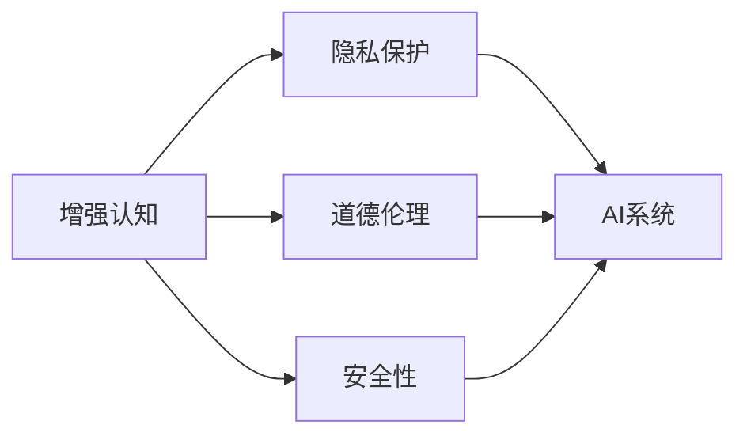

                 

# AI时代的人类增强：道德、隐私和安全的未来

> 关键词：人工智能,增强认知,隐私保护,道德伦理,安全性

## 1. 背景介绍

随着人工智能(AI)技术的飞速发展，人们已经开始憧憬AI时代如何彻底改变我们的工作和生活。从医疗、教育到商业、娱乐，AI将全方位渗透到人类社会的各个角落，提升生产力，改善生活品质，甚至赋予人类前所未有的能力增强。然而，正如任何技术革命都会带来深刻的社会变革，AI时代也将伴随着新的挑战和问题，尤其是道德、隐私和安全的维度。本文将探讨AI时代中人类增强的潜力与风险，以及我们如何在享受科技红利的同时，兼顾伦理、隐私和安全的考虑。

## 2. 核心概念与联系

### 2.1 核心概念概述

- **人工智能(AI)**：指通过计算机算法和数据处理技术，使机器具备类似人类的智能能力，包括感知、学习、推理和决策等。
- **增强认知(Enhanced Cognition)**：指通过AI技术增强人类的认知功能，如记忆、逻辑推理、创造力等，以提高学习和工作效率。
- **隐私保护(Privacy Protection)**：指保护个人数据不被未授权访问和使用，确保用户数据的安全性和私密性。
- **道德伦理(Ethics)**：指在AI应用中遵循的正确行为准则，确保技术应用不会对社会造成负面影响。
- **安全性(Security)**：指保护AI系统免受攻击和恶意利用，确保系统的稳定性和可靠性。

这些核心概念共同构成了AI时代人类增强的生态系统，旨在通过技术手段提升人类能力，同时确保技术应用的安全、隐私和道德。

### 2.2 核心概念原理和架构的 Mermaid 流程图



这个流程图展示了增强认知、隐私保护、道德伦理和安全性的相互关系及其与AI系统的联系。AI系统是实现增强认知功能的主要技术手段，而隐私保护、道德伦理和安全性是确保AI系统健康发展的关键保障。

## 3. 核心算法原理 & 具体操作步骤

### 3.1 算法原理概述

增强认知的核心在于如何利用AI技术提升人类的认知能力。常见的技术手段包括：

- **认知增强算法**：如神经网络、强化学习等，通过训练模型模拟人类大脑的认知过程。
- **数据增强**：通过数据处理技术，扩充训练数据集，提升模型的泛化能力。
- **交互式学习**：通过与用户互动，利用用户的反馈调整模型参数，提高模型的适应性。

这些技术手段通常以模型为基础，通过大量的训练数据和用户交互，不断优化模型参数，最终实现对人类认知能力的增强。

### 3.2 算法步骤详解

增强认知的具体操作步骤通常包括以下几个步骤：

1. **数据收集与处理**：收集并清洗相关数据，包括文本、图像、音频等，准备用于训练和测试。
2. **模型选择与训练**：选择合适的认知增强模型，如深度神经网络、深度强化学习等，进行训练。
3. **评估与优化**：在训练过程中不断评估模型性能，根据评估结果调整模型参数和训练策略。
4. **部署与应用**：将训练好的模型部署到实际应用中，进行认知增强功能的测试与优化。
5. **反馈与迭代**：根据用户反馈，不断迭代优化模型，提升其性能和适应性。

### 3.3 算法优缺点

增强认知算法的优点包括：

- **提升认知能力**：通过AI技术，可以显著提升人类的认知功能，如记忆、推理、创造力等。
- **提高工作效率**：认知增强能够大幅提高学习和工作效率，缩短任务完成时间。
- **创新潜力**：AI技术在未知领域具有探索性，可能带来新的认知和创造性突破。

然而，增强认知算法也存在一些缺点：

- **技术依赖**：过度依赖AI技术，可能导致人类自身认知能力退化。
- **伦理争议**：AI技术可能带来新的伦理问题，如隐私泄露、道德冲突等。
- **安全性风险**：AI系统可能被恶意利用，对人类安全构成威胁。

### 3.4 算法应用领域

增强认知技术在多个领域具有广泛的应用前景：

- **教育培训**：通过AI技术，实现个性化学习，提升学生的学习效率和效果。
- **医疗健康**：AI技术帮助医生进行诊断和治疗，提升医疗服务质量。
- **科学研究**：AI技术加速科研数据处理和分析，提高科研效率。
- **商业智能**：AI技术提升商业决策的科学性和准确性，支持企业创新和发展。

## 4. 数学模型和公式 & 详细讲解 & 举例说明

### 4.1 数学模型构建

以深度神经网络为例，构建增强认知的数学模型：

$$
\hat{y} = f(x; \theta)
$$

其中 $x$ 为输入数据，$\theta$ 为模型参数，$f(x; \theta)$ 为模型输出的预测结果。深度神经网络通过多层非线性变换，将输入数据映射为输出，实现对复杂模式的学习和识别。

### 4.2 公式推导过程

以深度神经网络的前向传播过程为例：

$$
h_1 = \sigma(W_1x + b_1)
$$
$$
h_2 = \sigma(W_2h_1 + b_2)
$$
$$
\hat{y} = W_3h_2 + b_3
$$

其中 $W_i$ 为权重矩阵，$b_i$ 为偏置项，$\sigma$ 为激活函数。通过不断堆叠多个隐藏层，神经网络可以处理更复杂的模式，提高预测准确性。

### 4.3 案例分析与讲解

以自然语言处理(NLP)中的机器翻译任务为例，通过深度神经网络进行增强认知：

1. **数据预处理**：将源语言和目标语言文本进行分词、向量化等处理。
2. **模型训练**：使用大规模的双语对齐语料库训练神经机器翻译模型。
3. **评估与优化**：在测试集上评估模型性能，调整模型参数和训练策略。
4. **部署与应用**：将训练好的模型部署到实际翻译系统中，进行实时翻译。

## 5. 项目实践：代码实例和详细解释说明

### 5.1 开发环境搭建

开发环境搭建包括：

- **安装Python**：确保Python环境稳定，建议使用虚拟环境（如Anaconda）。
- **安装深度学习框架**：如TensorFlow、PyTorch等，安装过程中注意GPU/CPU兼容性。
- **安装相关库**：如NumPy、Pandas、Scikit-learn等数据处理和机器学习库。

### 5.2 源代码详细实现

以PyTorch为例，实现一个简单的深度神经网络模型进行认知增强：

```python
import torch
import torch.nn as nn
import torch.optim as optim

class NeuralNetwork(nn.Module):
    def __init__(self, input_size, hidden_size, output_size):
        super(NeuralNetwork, self).__init__()
        self.hidden = nn.Linear(input_size, hidden_size)
        self.relu = nn.ReLU()
        self.output = nn.Linear(hidden_size, output_size)
    
    def forward(self, x):
        x = self.hidden(x)
        x = self.relu(x)
        x = self.output(x)
        return x

# 数据准备
input_data = torch.randn(100, 10)  # 100个样本，每个样本10维
target_data = torch.randn(100, 5)  # 100个样本，每个样本5维

# 模型构建
model = NeuralNetwork(10, 20, 5)
criterion = nn.MSELoss()
optimizer = optim.SGD(model.parameters(), lr=0.01)

# 训练过程
for epoch in range(100):
    optimizer.zero_grad()
    outputs = model(input_data)
    loss = criterion(outputs, target_data)
    loss.backward()
    optimizer.step()

# 测试过程
test_data = torch.randn(10, 10)
test_outputs = model(test_data)
print(test_outputs)
```

### 5.3 代码解读与分析

上述代码实现了基本的神经网络模型，通过前向传播计算输出结果，通过反向传播更新模型参数。其中，NeuralNetwork类定义了模型结构，forward方法实现前向传播过程；MSELoss定义了损失函数，SGD优化器用于参数更新。

### 5.4 运行结果展示

通过训练后，神经网络可以较好地学习输入与输出之间的关系，进行简单的认知增强任务。例如，可以将输入文本转换为数字序列，进行情感分析、文本分类等任务。

## 6. 实际应用场景

### 6.1 增强认知在教育中的应用

AI技术可以显著提升教育培训的效果，实现个性化学习、自动化批改、智能推荐等功能。例如，使用AI系统进行作业批改，可以大幅减少教师工作量，提高批改准确性；使用AI系统进行学习路径推荐，可以针对学生的学习情况进行个性化推荐，提高学习效率。

### 6.2 增强认知在医疗中的应用

AI技术可以辅助医生进行诊断和治疗，提高医疗服务质量。例如，使用AI系统进行病理学图像识别，可以大幅提高病理诊断的准确性和效率；使用AI系统进行基因组分析，可以辅助医生进行个性化治疗方案的制定。

### 6.3 增强认知在科学研究中的应用

AI技术可以加速科研数据处理和分析，提高科研效率。例如，使用AI系统进行文本挖掘和分析，可以快速获取大量文献信息；使用AI系统进行图像识别和分析，可以辅助进行生物医学研究。

### 6.4 未来应用展望

未来，增强认知技术将进一步普及和深化，带来更广泛的应用场景：

- **智能助理**：通过AI技术，实现智能聊天机器人、智能语音助手等，提升人机交互体验。
- **虚拟现实**：通过AI技术，实现虚拟现实环境中的认知增强，提供沉浸式学习体验。
- **智能制造**：通过AI技术，实现智能制造系统中的认知增强，提升生产效率和质量。
- **智慧城市**：通过AI技术，实现智慧城市中的认知增强，提供智能交通、智能安防等功能。

## 7. 工具和资源推荐

### 7.1 学习资源推荐

- **《深度学习》课程**：斯坦福大学李飞飞教授的深度学习课程，系统介绍了深度学习的基本概念和核心技术。
- **《人工智能：一种现代方法》**：经典教材，全面介绍了人工智能的理论和应用。
- **Kaggle**：数据科学竞赛平台，提供大量数据集和机器学习竞赛，有助于实践和应用。
- **TensorFlow官方文档**：提供了详尽的API文档和示例代码，适合深入学习和开发。

### 7.2 开发工具推荐

- **TensorFlow**：谷歌开源的深度学习框架，提供了丰富的API和工具支持。
- **PyTorch**：Facebook开源的深度学习框架，提供了动态计算图和灵活的模型构建能力。
- **Jupyter Notebook**：交互式编程环境，适合快速迭代和原型开发。
- **GitHub**：代码托管平台，支持团队协作和代码版本管理。

### 7.3 相关论文推荐

- **深度学习中的认知增强**：探讨深度神经网络在认知增强中的应用，如自然语言处理、计算机视觉等领域。
- **隐私保护在AI中的应用**：研究如何保护数据隐私，确保AI系统的安全性和可靠性。
- **道德伦理在AI中的应用**：探讨AI系统中的伦理问题，如偏见、歧视等，提出解决方案。

## 8. 总结：未来发展趋势与挑战

### 8.1 研究成果总结

AI时代的人类增强技术取得了显著进展，从教育、医疗到科学研究，各个领域都受益于AI技术的深度应用。然而，AI技术在带来便利的同时，也带来了新的挑战，如隐私保护、道德伦理和安全性问题。如何在享受科技红利的同时，兼顾伦理、隐私和安全的考虑，是我们亟需解决的问题。

### 8.2 未来发展趋势

未来，增强认知技术将不断进步，带来更多创新应用：

- **多模态增强**：结合语音、视觉、文本等多种模态，提升AI系统的智能水平。
- **联邦学习**：分布式训练技术，保护数据隐私的同时，提高模型的泛化能力。
- **因果推理**：研究AI系统中的因果关系，增强其推理和决策能力。
- **边缘计算**：将AI系统部署到边缘设备，提高系统的实时性和效率。

### 8.3 面临的挑战

尽管AI技术在多个领域取得了显著进展，但仍面临诸多挑战：

- **数据隐私**：如何在保证隐私的前提下，进行数据共享和模型训练。
- **伦理道德**：如何在AI应用中遵循正确的行为准则，避免偏见和歧视。
- **安全性**：如何保护AI系统免受攻击和恶意利用，确保系统的安全性和可靠性。
- **计算资源**：如何优化AI系统的计算资源消耗，提高其部署效率。

### 8.4 研究展望

未来，需要在多个维度上不断探索和突破：

- **隐私保护技术**：研究数据隐私保护和匿名化技术，确保数据安全。
- **伦理道德框架**：构建AI伦理框架，确保技术应用的公正性和透明性。
- **安全性研究**：研究AI系统的安全防护措施，避免被恶意利用。
- **计算资源优化**：研究高效的计算资源利用技术，提升AI系统的部署效率。

只有不断优化和完善这些技术手段，才能确保AI技术在增强认知的同时，兼顾伦理、隐私和安全的考虑，为人类社会带来更多福祉。

## 9. 附录：常见问题与解答

**Q1：认知增强技术对人类有什么影响？**

A: 认知增强技术可以显著提升人类的认知能力，如记忆、推理、创造力等，从而提高学习和工作效率，促进科技和社会的发展。但同时，过度依赖AI技术也可能导致人类自身认知能力退化，需要适度平衡。

**Q2：如何保护数据隐私？**

A: 数据隐私保护可以通过以下措施实现：数据匿名化、差分隐私、联邦学习等。例如，使用差分隐私技术，在保护隐私的前提下，进行数据分析和模型训练。

**Q3：如何避免AI系统的伦理问题？**

A: AI系统的伦理问题可以通过以下措施避免：算法透明性、数据多样性、公平性评估等。例如，使用公平性评估工具，定期检查AI系统的决策结果，确保其公正性和透明性。

**Q4：AI系统的安全性如何保障？**

A: AI系统的安全性可以通过以下措施保障：模型加密、异常检测、访问控制等。例如，使用模型加密技术，防止模型参数被未授权访问和修改。

**Q5：AI系统如何兼顾隐私和性能？**

A: AI系统可以通过联邦学习等分布式训练技术，保护数据隐私的同时，提高模型的泛化能力。例如，使用联邦学习技术，在分布式环境下进行模型训练，保护数据隐私。

---

作者：禅与计算机程序设计艺术 / Zen and the Art of Computer Programming

