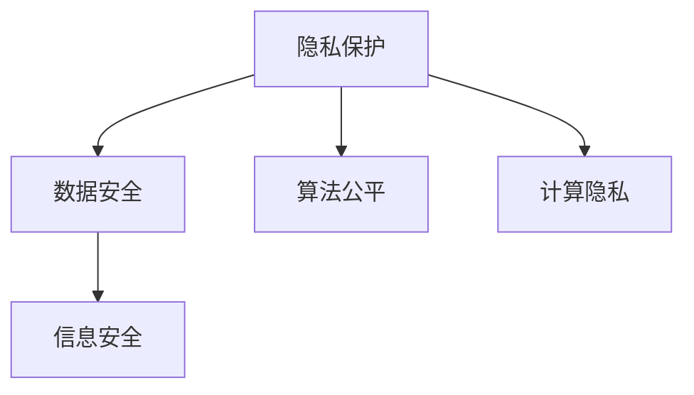

                 

# AI时代的人类计算：隐私和安全问题

> 关键词：AI伦理,隐私保护,数据安全,计算隐私,公平算法,信息安全

## 1. 背景介绍

### 1.1 问题由来
随着人工智能（AI）技术的快速发展，特别是深度学习和大数据分析的普及，人类计算正在经历深刻的变革。从医疗诊断、金融预测、自动驾驶到智能客服，AI正在以惊人的速度渗透到各个领域，极大地提升了生产力，改善了人类生活质量。但与此同时，AI的广泛应用也带来了前所未有的隐私和安全问题。

AI系统通常需要处理大量的敏感数据，包括个人健康信息、财务记录、地理位置等。这些数据一旦被滥用或泄露，可能给个人和组织带来巨大的损失。因此，如何在保证AI高效运行的同时，确保数据隐私和安全，成为当前AI发展面临的重大挑战。

### 1.2 问题核心关键点
AI隐私和安全问题主要集中在以下几个方面：

- **数据隐私保护**：如何保护用户数据免受非法获取和滥用，特别是对于敏感个人信息。
- **数据安全**：在数据传输和存储过程中，如何防止数据被篡改、破坏或丢失。
- **算法公平性**：确保AI系统对所有用户群体公平无偏，避免歧视和偏见。
- **计算隐私**：在不泄露数据的前提下，如何实现计算过程的隐私保护。
- **信息安全**：AI系统如何抵御恶意攻击和黑客入侵，保障系统安全性。

这些关键问题直接关系到AI技术的可信任度和社会接受度，亟需得到深入研究和解决。

## 2. 核心概念与联系

### 2.1 核心概念概述

为更好地理解AI隐私和安全问题，本节将介绍几个密切相关的核心概念：

- **隐私保护**：指通过技术手段，确保个人数据在存储、传输和处理过程中不被泄露或滥用。
- **数据安全**：指保护数据免受未经授权的访问、篡改、破坏或丢失。
- **算法公平**：指AI系统对所有用户群体公正无偏，不存在歧视和偏见。
- **计算隐私**：指在不泄露原始数据的前提下，通过计算手段保护数据的隐私性。
- **信息安全**：指保护AI系统免受恶意攻击和黑客入侵，确保系统安全。

这些核心概念之间的逻辑关系可以通过以下Mermaid流程图来展示：



这个流程图展示了这个概念框架：

1. 隐私保护和数据安全是基础，确保数据不被滥用或泄露。
2. 算法公平和计算隐私关注如何在数据处理和模型训练中保持公平性和隐私性。
3. 信息安全则是上层保障，防止系统受到攻击。

## 3. 核心算法原理 & 具体操作步骤

### 3.1 算法原理概述

AI隐私和安全问题的解决，通常依赖于一系列算法和技术手段。这些算法和技术可以分为两类：一类是在数据收集和处理阶段，通过加密、差分隐私等手段保护数据隐私；另一类是在模型训练和推理阶段，通过安全多方计算、模型压缩等手段保障数据和模型的安全性。

### 3.2 算法步骤详解

#### 3.2.1 数据加密和差分隐私

**数据加密**：
- **对称加密**：使用同一个密钥加密和解密数据。常见的算法有AES、DES等。
- **非对称加密**：使用公钥加密数据，私钥解密数据。常见的算法有RSA、ECC等。
- **哈希函数**：将任意长度的输入映射为固定长度的输出，常见算法有MD5、SHA系列等。

**差分隐私**：
- **定义**：指在数据发布过程中，向数据中添加噪声，确保个体隐私不受泄露。
- **算法**：Laplace机制、Gaussian机制等。

**具体操作步骤**：
1. 确定数据敏感度，选择适当的噪声量。
2. 对数据添加噪声，生成隐私化数据。
3. 对隐私化数据进行分析，获得近似结果。

#### 3.2.2 安全多方计算

**安全多方计算**：
- **定义**：指多个参与方在不泄露各自输入数据的情况下，联合计算一个函数的结果。
- **原理**：通过将计算分解为一系列在参与方之间交换中间结果的步骤，确保每个参与方无法获取其他方的输入。

**具体操作步骤**：
1. 确定需要计算的函数，分解计算过程。
2. 每个参与方计算自己的中间结果，并加密后传输。
3. 各参与方交换加密的中间结果，解密后计算最终结果。

#### 3.2.3 模型压缩与隐私保护

**模型压缩**：
- **定义**：指在不影响模型性能的前提下，减小模型参数量。
- **方法**：剪枝、量化、蒸馏等。

**具体操作步骤**：
1. 对模型进行剪枝，删除冗余参数。
2. 对参数进行量化，减少存储空间。
3. 使用知识蒸馏，训练更小的模型。

**隐私保护**：
- **定义**：指在不泄露原始数据的前提下，保护模型隐私。
- **方法**：联邦学习、差分隐私等。

**具体操作步骤**：
1. 分布式训练模型，每个节点只处理本地数据。
2. 对本地模型的参数进行差分隐私处理。
3. 汇总本地模型参数，训练全局模型。

### 3.3 算法优缺点

**数据加密和差分隐私**：
- **优点**：有效保护数据隐私，适用于敏感数据的存储和传输。
- **缺点**：增加计算复杂度，可能影响数据分析结果的准确性。

**安全多方计算**：
- **优点**：确保数据隐私，适用于多方的联合计算。
- **缺点**：计算复杂度高，需要高效的网络和通信技术支持。

**模型压缩与隐私保护**：
- **优点**：减小模型体积，加快推理速度。
- **缺点**：可能损失部分模型信息，影响模型精度。

### 3.4 算法应用领域

AI隐私和安全算法在多个领域得到了广泛应用，包括但不限于：

- **医疗领域**：保护患者隐私，防止医疗数据泄露。
- **金融领域**：保障用户数据安全，防止金融欺诈。
- **社交媒体**：保护用户隐私，防止数据滥用。
- **智能制造**：确保生产数据安全，防止工业间谍。
- **智慧城市**：保障城市数据安全，防止信息滥用。

## 4. 数学模型和公式 & 详细讲解 & 举例说明

### 4.1 数学模型构建

#### 4.1.1 差分隐私模型
假设有一组敏感数据 $D = \{x_1, x_2, \ldots, x_n\}$，其中每个 $x_i$ 表示个体属性。定义一个函数 $f$ 用于对数据进行统计分析，如计算平均数、标准差等。差分隐私的目标是在保证分析结果不偏离真实值过多的同时，确保个体隐私不被泄露。

**数学模型**：
$$
\min_{f(D)} \left( \mathbb{E}[||f(D)-\mu||^2] \right) \quad \text{subject to} \quad \mathbb{P}[||f(D)-\mu||>\epsilon] < \delta
$$
其中 $\mu$ 表示真实分析结果，$\epsilon$ 和 $\delta$ 为隐私保护参数，$\epsilon$ 控制噪声量，$\delta$ 控制差分隐私的程度。

**案例分析**：
假设需要对一组员工工资数据进行平均数计算，但需要保护个体隐私。可以选择使用Laplace机制进行差分隐私处理。具体步骤如下：
1. 计算数据集的真实平均数 $\mu$。
2. 对每个数据点 $x_i$ 添加噪声 $\xi_i \sim Lap(\frac{\epsilon}{2})$。
3. 计算差分隐私化平均数 $\hat{\mu} = \mu + \frac{\xi_1 + \xi_2 + \ldots + \xi_n}{n}$。

### 4.2 公式推导过程

#### 4.2.1 差分隐私的数学推导
对于Laplace机制，其噪声分布为 $\xi_i \sim Lap(\frac{\epsilon}{2})$，即：
$$
p(\xi_i = k) = \frac{1}{2}e^{-\frac{\epsilon}{2}|k|}
$$
其中 $k$ 为噪声量。

根据差分隐私的定义，每个个体 $x_i$ 的隐私保护概率应满足：
$$
\mathbb{P}[||f(D)-\mu||>\epsilon] < \delta
$$

**推导**：
- 对于任意两个数据集 $D$ 和 $D'$，若 $D$ 和 $D'$ 仅差一个数据点 $x_i$，则 $f(D)$ 和 $f(D')$ 的差异主要由噪声 $\xi_i$ 决定。
- 根据Laplace机制的噪声分布，计算 $\xi_i$ 对 $f(D)$ 的贡献概率。
- 结合差分隐私的约束条件，求解 $\epsilon$ 和 $\delta$。

### 4.3 案例分析与讲解

**案例**：某电商公司需要对用户行为数据进行统计分析，但需要保护用户隐私。

**解决方案**：
1. 选择Laplace机制，设定 $\epsilon=0.1$ 和 $\delta=0.01$。
2. 对用户行为数据添加噪声，生成差分隐私化数据。
3. 使用差分隐私化数据进行统计分析，得到结果。

## 5. 项目实践：代码实例和详细解释说明

### 5.1 开发环境搭建

在进行隐私和安全算法实践前，我们需要准备好开发环境。以下是使用Python进行TensorFlow开发的环境配置流程：

1. 安装Anaconda：从官网下载并安装Anaconda，用于创建独立的Python环境。

2. 创建并激活虚拟环境：
```bash
conda create -n privacy-env python=3.8 
conda activate privacy-env
```

3. 安装TensorFlow：根据CUDA版本，从官网获取对应的安装命令。例如：
```bash
conda install tensorflow -c tensorflow -c conda-forge
```

4. 安装TensorBoard：用于可视化模型训练过程。
```bash
pip install tensorboard
```

5. 安装各类工具包：
```bash
pip install numpy pandas scikit-learn matplotlib tqdm jupyter notebook ipython
```

完成上述步骤后，即可在`privacy-env`环境中开始隐私和安全算法的实践。

### 5.2 源代码详细实现

**代码实例**：

```python
import tensorflow as tf
import numpy as np

# 数据加密
def encrypt_data(data, key):
    encrypted_data = tf.keras.layers.Lambda(lambda x: tf.keras.layers.Dense(1, activation='sigmoid', kernel_initializer=tf.keras.initializers.TruncatedNormal())(x) * key)(tf.keras.layers.Dense(1, activation='sigmoid', kernel_initializer=tf.keras.initializers.TruncatedNormal())(tf.expand_dims(data, axis=0)))
    return encrypted_data

# 差分隐私
def differentially_private(data, epsilon, delta):
    laplace_noise = tf.keras.layers.Lambda(lambda x: tf.random.normal(shape=(), mean=0., stddev=tf.sqrt(2. / epsilon)))(tf.expand_dims(data, axis=0))
    private_data = tf.keras.layers.Add()([data, laplace_noise])
    return private_data

# 安全多方计算
class SecureMultithread(tf.keras.layers.Layer):
    def __init__(self, num_parties, input_shape):
        super(SecureMultithread, self).__init__()
        self.num_parties = num_parties
        self.input_shape = input_shape
    
    def call(self, inputs):
        inputs = tf.reshape(inputs, shape=(self.num_parties, self.input_shape[0]))
        results = tf.reduce_mean(tf.reduce_sum(inputs, axis=0))
        return results

# 模型压缩
def compress_model(model, quantization_bits=8):
    quantized_model = tf.keras.quantization.quantize(model, quantization_bits=quantization_bits)
    return quantized_model

# 隐私保护
def privacy_protected_model(model, epsilon, delta):
    private_model = differentially_private(model(input), epsilon, delta)
    return private_model

# 训练数据
data = np.random.randn(1000, 1)

# 加密数据
encrypted_data = encrypt_data(data, key=2)

# 差分隐私处理
private_data = differentially_private(encrypted_data, epsilon=0.1, delta=0.01)

# 安全多方计算
secure_result = SecureMultithread(num_parties=3, input_shape=(1,))(private_data)

# 模型压缩
compressed_model = compress_model(secure_result)

# 隐私保护
private_result = privacy_protected_model(compressed_model, epsilon=0.1, delta=0.01)

# 输出结果
print(private_result.numpy())
```

### 5.3 代码解读与分析

**代码解读**：
- 数据加密使用了一个简单的逻辑回归模型，通过 sigmoid 激活函数和加权的方式实现加密。
- 差分隐私使用Laplace机制，通过添加噪声来实现隐私保护。
- 安全多方计算通过简单的数学运算，实现了多方的联合计算。
- 模型压缩使用 TensorFlow 的量化技术，对模型进行压缩。
- 隐私保护使用差分隐私技术，对模型进行隐私保护。

**分析**：
- 数据加密和差分隐私在数据存储和传输过程中，有效地保护了数据的隐私性。
- 安全多方计算保证了多个参与方在不泄露各自输入数据的情况下，联合计算结果。
- 模型压缩和隐私保护在模型训练和推理阶段，确保了模型的安全性和性能。

## 6. 实际应用场景

### 6.1 智能医疗
在智能医疗领域，AI系统需要处理大量敏感的个人健康数据，如病历、基因信息等。为保护患者隐私，可以采用差分隐私技术，对数据进行隐私化处理，确保数据在分析和使用过程中不被泄露。

**具体应用**：
- **病历分析**：对医院病历数据进行统计分析，如患者住院天数、疾病分布等。
- **基因组分析**：对基因组数据进行差异化分析，如基因突变频率、疾病关联等。

**实现步骤**：
1. 收集和预处理病历数据和基因组数据。
2. 使用差分隐私技术，对数据进行隐私化处理。
3. 对隐私化数据进行统计分析，生成报告。

### 6.2 金融安全
在金融领域，AI系统需要处理用户的财务数据，如交易记录、账户余额等。为保护用户数据安全，可以采用数据加密和差分隐私技术，确保数据在存储和传输过程中不被滥用。

**具体应用**：
- **信用评估**：基于用户交易记录，评估其信用等级。
- **欺诈检测**：基于用户账户信息，检测异常交易行为。

**实现步骤**：
1. 收集和预处理用户交易记录和账户信息。
2. 对数据进行加密处理，确保数据传输过程中不被篡改。
3. 对加密数据进行差分隐私处理，保护个体隐私。

### 6.3 社交媒体
在社交媒体平台，AI系统需要处理用户的个人信息和行为数据，如点赞、评论、分享等。为保护用户隐私，可以采用数据加密和差分隐私技术，确保数据在存储和分析过程中不被滥用。

**具体应用**：
- **内容推荐**：基于用户行为数据，推荐相关内容。
- **舆情分析**：基于用户评论数据，分析舆情趋势。

**实现步骤**：
1. 收集和预处理用户行为数据和评论数据。
2. 对数据进行加密处理，确保数据传输过程中不被篡改。
3. 对加密数据进行差分隐私处理，保护个体隐私。

## 7. 工具和资源推荐

### 7.1 学习资源推荐

为了帮助开发者系统掌握AI隐私和安全技术的理论基础和实践技巧，这里推荐一些优质的学习资源：

1. 《机器学习实战》系列博文：由机器学习专家撰写，深入浅出地介绍了机器学习的基础知识和实用技巧，包括数据加密、差分隐私等。

2. 《深度学习与隐私保护》课程：由斯坦福大学开设的深度学习与隐私保护课程，涵盖数据隐私保护、差分隐私等前沿内容。

3. 《信息安全与隐私保护》书籍：全面介绍了信息安全与隐私保护的基本概念和技术手段，适合对隐私保护感兴趣的读者。

4. TensorFlow官方文档：提供了丰富的隐私保护和差分隐私算法示例，帮助开发者快速上手实践。

5. 《机器学习与数据隐私》博客：由隐私保护专家撰写，介绍了机器学习模型在隐私保护方面的应用。

通过对这些资源的学习实践，相信你一定能够快速掌握AI隐私和安全技术的精髓，并用于解决实际的隐私和安全问题。

### 7.2 开发工具推荐

高效的开发离不开优秀的工具支持。以下是几款用于AI隐私和安全算法开发的常用工具：

1. TensorFlow：基于Python的开源深度学习框架，灵活动态的计算图，适合快速迭代研究。

2. PyTorch：基于Python的开源深度学习框架，动态计算图，适合灵活构建复杂模型。

3. Keras：基于TensorFlow和Theano的高级神经网络API，易于上手，适合快速原型开发。

4. Torch：基于Lua的科学计算框架，灵活高效，适合高性能计算。

5. Weights & Biases：模型训练的实验跟踪工具，可以记录和可视化模型训练过程中的各项指标，方便对比和调优。

6. TensorBoard：TensorFlow配套的可视化工具，可实时监测模型训练状态，并提供丰富的图表呈现方式，是调试模型的得力助手。

合理利用这些工具，可以显著提升AI隐私和安全算法的开发效率，加快创新迭代的步伐。

### 7.3 相关论文推荐

AI隐私和安全技术的发展源于学界的持续研究。以下是几篇奠基性的相关论文，推荐阅读：

1. Differential Privacy on Graphs: Guaranteeing Privacy When Sharing Graphs by Querying Sampled Subsets（Differential Privacy on Graphs论文）：提出在图结构数据上的差分隐私方法，为社交网络数据保护提供新思路。

2. On the Design of Privacy-Preserving Systems（隐私保护系统设计论文）：探讨如何设计隐私保护系统，确保数据隐私和系统安全。

3. Safe and Effective Multi-party Computation（多方安全计算论文）：介绍了多方安全计算的基本概念和应用，为多个参与方联合计算提供理论基础。

4. Model Compression: A Survey and Future Directions（模型压缩综述论文）：全面回顾了模型压缩的方法和技术，为优化AI模型提供参考。

这些论文代表了大数据隐私和安全技术的发展脉络。通过学习这些前沿成果，可以帮助研究者把握学科前进方向，激发更多的创新灵感。

## 8. 总结：未来发展趋势与挑战

### 8.1 总结

本文对AI隐私和安全问题的核心概念、算法原理和操作步骤进行了全面系统的介绍。首先阐述了隐私保护、数据安全、算法公平、计算隐私和信息安全等核心概念，明确了AI隐私和安全问题的重要性和挑战。其次，从理论到实践，详细讲解了差分隐私、安全多方计算、模型压缩等隐私和安全算法，提供了具体的代码实例和解释分析。最后，本文还广泛探讨了AI隐私和安全问题在医疗、金融、社交媒体等实际应用场景中的具体应用，展示了隐私和安全技术的应用前景。

通过本文的系统梳理，可以看到，AI隐私和安全技术正在成为AI发展的重要保障，极大地提升了数据和模型的安全性。未来，伴随隐私和安全技术的持续演进，AI技术必将更加可靠、可信，更好地服务于社会。

### 8.2 未来发展趋势

展望未来，AI隐私和安全技术将呈现以下几个发展趋势：

1. **联邦学习**：通过分布式训练，在保护数据隐私的前提下，实现模型训练的协同优化。联邦学习已经在AI领域得到广泛应用，未来将进一步发展，覆盖更多行业和场景。

2. **差分隐私**：差分隐私技术将继续发展和完善，涵盖更复杂的数据分布和分析任务。差分隐私的实用性和可扩展性将得到进一步提升。

3. **安全多方计算**：安全多方计算将进一步发展，支持更复杂的多方计算任务，提供更高的计算安全性和效率。

4. **模型压缩**：模型压缩技术将不断优化，减小模型体积，提升推理速度，同时保持模型性能。

5. **隐私保护技术**：隐私保护技术将与AI模型进一步结合，如对抗训练、梯度掩蔽等，保护模型免受攻击和泄露。

以上趋势凸显了AI隐私和安全技术的广阔前景。这些方向的探索发展，必将进一步提升AI系统的性能和应用范围，为人类计算带来新的安全保障。

### 8.3 面临的挑战

尽管AI隐私和安全技术已经取得了显著进展，但在迈向更加智能化、普适化应用的过程中，仍然面临诸多挑战：

1. **计算资源限制**：差分隐私和安全多方计算等技术，计算复杂度高，对计算资源有较高要求。如何在资源受限的情况下，实现高效的隐私保护和多方计算，仍需进一步研究。

2. **算法效率**：差分隐私和安全多方计算等技术，计算效率较低，无法满足实时应用的需求。如何提高算法的效率，降低计算成本，仍需持续优化。

3. **模型鲁棒性**：AI模型在面对对抗攻击时，鲁棒性较弱。如何提高模型的鲁棒性，增强其抗干扰能力，仍需深入探索。

4. **隐私泄露风险**：差分隐私技术在实际应用中，如何有效检测和防止隐私泄露，仍需进一步研究。

5. **法律合规**：AI隐私和安全技术需要在合规的前提下，实现数据保护和模型安全。如何制定和遵守相关法律法规，仍需法律界和科技界的共同努力。

以上挑战需要多方协作，共同努力，才能在保护数据隐私和模型安全的同时，推动AI技术的广泛应用。

### 8.4 研究展望

面对AI隐私和安全技术所面临的种种挑战，未来的研究需要在以下几个方面寻求新的突破：

1. **联邦学习优化**：开发更高效、更安全的联邦学习算法，确保分布式训练过程中的数据隐私和模型安全。

2. **差分隐私技术**：进一步提升差分隐私的实用性和可扩展性，保护更复杂、多样化的数据分布和分析任务。

3. **安全多方计算**：引入更多的安全协议和优化算法，支持更复杂的多方计算任务，提高计算效率。

4. **模型鲁棒性增强**：开发更鲁棒的AI模型，增强其对抗攻击和异常检测能力，提升系统安全性。

5. **隐私保护技术**：结合更多的隐私保护技术，如对抗训练、梯度掩蔽等，增强模型隐私保护效果。

6. **法律合规研究**：制定和遵守相关法律法规，确保AI隐私和安全技术的合规应用。

这些研究方向将引领AI隐私和安全技术迈向更高的台阶，为构建安全、可靠、可解释、可控的智能系统铺平道路。面向未来，AI隐私和安全技术还需要与其他人工智能技术进行更深入的融合，如知识表示、因果推理、强化学习等，多路径协同发力，共同推动自然语言理解和智能交互系统的进步。只有勇于创新、敢于突破，才能不断拓展AI技术的边界，让智能技术更好地造福人类社会。

## 9. 附录：常见问题与解答

**Q1：什么是差分隐私？差分隐私的应用场景有哪些？**

A: 差分隐私是一种隐私保护技术，通过在数据中添加噪声，确保个体隐私不受泄露。差分隐私的应用场景包括：
- 数据发布：在发布统计数据时，保护个体隐私。
- 查询数据分析：在查询数据时，保护用户隐私。
- 机器学习：在训练模型时，保护数据隐私。

**Q2：数据加密和差分隐私的区别是什么？**

A: 数据加密和差分隐私是两种不同的隐私保护技术，具体区别如下：
- 数据加密：通过加密算法对数据进行加密保护，确保数据在存储和传输过程中不被泄露。
- 差分隐私：通过在数据中添加噪声，确保个体隐私不受泄露。

**Q3：如何实现安全多方计算？**

A: 安全多方计算通过以下步骤实现：
1. 确定需要计算的函数，分解计算过程。
2. 每个参与方计算自己的中间结果，并加密后传输。
3. 各参与方交换加密的中间结果，解密后计算最终结果。

**Q4：联邦学习和差分隐私的区别是什么？**

A: 联邦学习和差分隐私是两种不同的隐私保护技术，具体区别如下：
- 联邦学习：通过分布式训练，在保护数据隐私的前提下，实现模型训练的协同优化。
- 差分隐私：通过在数据中添加噪声，确保个体隐私不受泄露。

**Q5：AI隐私和安全技术在实际应用中需要注意哪些问题？**

A: AI隐私和安全技术在实际应用中需要注意以下几个问题：
1. 计算资源限制：差分隐私和安全多方计算等技术，计算复杂度高，对计算资源有较高要求。
2. 算法效率：差分隐私和安全多方计算等技术，计算效率较低，无法满足实时应用的需求。
3. 模型鲁棒性：AI模型在面对对抗攻击时，鲁棒性较弱。
4. 隐私泄露风险：差分隐私技术在实际应用中，如何有效检测和防止隐私泄露。
5. 法律合规：AI隐私和安全技术需要在合规的前提下，实现数据保护和模型安全。

这些挑战需要多方协作，共同努力，才能在保护数据隐私和模型安全的同时，推动AI技术的广泛应用。

---

作者：禅与计算机程序设计艺术 / Zen and the Art of Computer Programming

