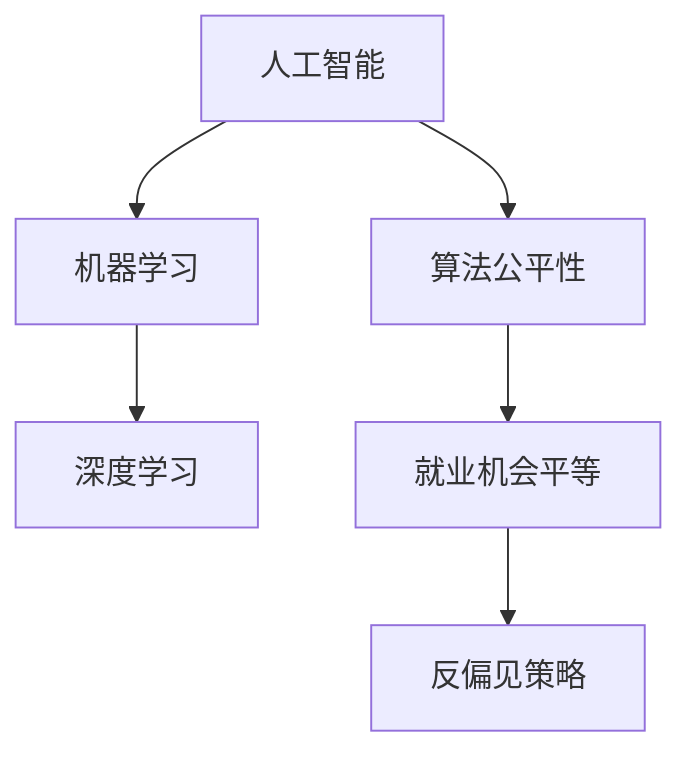

                 

# AI时代的就业公平:算法歧视和就业机会平等

> 关键词：人工智能,就业歧视,算法公平,就业机会平等,机器学习

## 1. 背景介绍

### 1.1 问题由来
随着人工智能(AI)技术的迅猛发展，机器学习(ML)算法在各行各业得到广泛应用。其应用从金融风控、医疗诊断到推荐系统、内容生成等，给传统工作方式带来了深远影响。一方面，AI的普及在提高工作效率、减少重复性劳动的同时，也引发了新的就业问题，尤其是对于那些依赖传统技能和经验的岗位，例如客户服务、数据录入等，出现了大规模失业风险。

另一方面，AI算法在提高决策效率和准确性的同时，其固有的偏见和歧视问题逐渐浮出水面。例如，通过数据分析预测招聘结果时，若算法中存在性别、种族、年龄等偏见，将导致就业机会的不平等。据统计，许多企业通过AI算法筛选简历时，女性和少数族裔的候选人往往被筛选掉，失去了公平竞争的机会。

因此，如何在AI时代实现就业公平和机会平等，成为学术界和工业界共同关注的重要课题。本文将围绕算法歧视和就业机会平等的问题，从理论到实践，系统探讨AI技术在就业场景中的应用，并提出针对性的解决策略。

### 1.2 问题核心关键点
AI算法在招聘、金融、医疗等就业场景中的广泛应用，带来了前所未有的技术优势，但也引发了新的公平性和偏见问题。AI歧视问题主要体现在以下几个方面：

- **数据偏见**：在模型训练数据中，若存在数据分布不均、历史偏见等问题，训练得到的模型也具有相应的偏见。
- **算法设计缺陷**：某些算法可能存在对特定群体的刻板印象或隐性歧视，导致决策不公。
- **解释性不足**：许多AI算法被视为"黑箱"模型，难以解释决策依据，导致无法有效检测和纠正偏见。
- **反馈机制缺乏**：模型训练和部署过程中，缺乏有效的偏见监测和反馈机制，导致偏见持续存在。

本文将聚焦于AI算法在就业场景中的应用，探讨如何通过公平性算法和透明度提升，实现AI时代的就业机会平等。

## 2. 核心概念与联系

### 2.1 核心概念概述

为更好地理解AI算法在就业公平中的应用，本节将介绍几个关键概念及其间的联系：

- **人工智能(AI)**：通过机器学习、深度学习等技术，模拟人脑的智能行为，实现自动化决策和智能分析。AI在招聘、医疗、金融等领域广泛应用。
- **机器学习(ML)**：一类基于数据的统计学习方法，通过训练数据学习模型，预测未来数据的行为。常见的ML算法包括线性回归、决策树、支持向量机等。
- **深度学习(Deep Learning, DL)**：一类基于神经网络的ML算法，通过多层非线性变换，实现对复杂数据的学习和处理。DL在图像识别、语音识别、自然语言处理等领域表现优异。
- **算法公平性(Algorithm Fairness)**：指算法输出结果不应包含任何基于性别、种族、年龄、收入等特征的歧视。常见的公平性指标包括误差率平准(Equalized Odds)、差异最小化(Difference of Outcomes)等。
- **就业机会平等(Employment Opportunity Equality)**：指不同性别、种族、年龄等群体的就业机会应相同。AI应辅助企业实现公平、透明、无偏见的招聘和决策。
- **反偏见策略(Anti-Bias Strategies)**：指通过调整算法、数据预处理、模型监控等手段，消除算法中存在的偏见，保障公平性。

这些概念之间的逻辑关系可以通过以下Mermaid流程图来展示：



这个流程图展示了几类概念之间的联系：

1. 人工智能通过机器学习和深度学习等技术，实现自动化决策和智能分析。
2. 机器学习和深度学习算法，因数据偏见和设计缺陷，可能存在就业歧视问题。
3. 通过算法公平性措施，消除算法中存在的偏见，从而实现就业机会平等。
4. 反偏见策略进一步细化了公平性保障，包括数据处理、模型监控、算法调整等。

## 3. 核心算法原理 & 具体操作步骤
### 3.1 算法原理概述

AI算法在就业场景中的应用，主要是通过机器学习模型进行招聘决策、面试评估、员工绩效预测等。常见的AI算法包括基于神经网络的推荐系统、基于决策树的招聘筛选模型、基于自然语言处理的简历分析模型等。

AI算法的公平性问题，一般通过以下方式进行解决：

1. **数据预处理**：调整训练数据集，消除数据分布不均、历史偏见等问题，从而获得公平的训练数据。
2. **算法调整**：引入公平性约束，调整模型输出，使其对不同群体的决策结果趋于一致。
3. **模型监控**：在模型部署后，持续监测模型输出，检测偏见，及时进行调整。
4. **反偏见策略**：结合多模态信息，综合考虑业务规则，实现更公平的就业决策。

本文将详细探讨以上各步骤的算法原理和具体操作步骤，以期在实际应用中实现就业机会平等。

### 3.2 算法步骤详解

#### 3.2.1 数据预处理

数据预处理是消除AI算法中偏见问题的首要步骤。主要包括以下几个关键步骤：

1. **数据收集与清洗**：从不同渠道收集就业数据，包括简历、面试记录、员工绩效等。清洗数据，去除重复、缺失、错误的数据，确保数据质量和一致性。
2. **数据去偏处理**：分析数据分布，检测历史偏见。例如，某些行业中男性比例偏高，可能影响模型对女性的预测。通过数据重采样、特征调整等手段，减小偏见影响。
3. **特征选择与处理**：选择与招聘目标高度相关的特征，并对特征进行归一化、标准化等处理，减小特征尺度差异带来的偏见。

#### 3.2.2 算法调整

在机器学习算法中，公平性约束可以通过调整损失函数、引入正则化项等方式实现。常见的公平性算法包括：

1. **误差率平准(Equalized Odds, EO)**：保证不同群体的预测结果具有相同的假阳性和假阴性误差率。即对同一类别的样本，不同群体的预测结果应具有相同的错误率。

2. **差异最小化(Difference of Outcomes, DO)**：确保不同群体间的预测结果差异最小化。通过引入公平性约束，调整模型权重，减小不同群体间的预测差异。

3. **等代价算法(Equally Often,EO)**：保证不同群体间的预测结果具有相同的正确率。即对不同群体的样本，预测结果的正确率应相同。

#### 3.2.3 模型监控

模型部署后，持续监测模型输出，及时发现和纠正偏见问题。常用的方法包括：

1. **公平性检测**：定期计算公平性指标，检测模型输出中是否存在偏见。例如，使用EO、DO等指标评估模型公平性。
2. **数据流监控**：在模型推理过程中，实时监控输入数据的分布，确保输入数据不受历史偏见影响。
3. **反馈机制**：建立反馈机制，接收用户投诉，及时调整模型参数，消除偏见。

#### 3.2.4 反偏见策略

反偏见策略结合多模态信息，综合考虑业务规则，实现更公平的就业决策。具体方法包括：

1. **特征工程**：结合业务规则，设计更合适的特征，提高模型的预测准确性。
2. **多模型集成**：使用多个公平性算法，综合多模型输出结果，减小单一模型偏见影响。
3. **业务规则调整**：在模型输出结果基础上，结合业务规则和专家知识，实现更公平的决策。

### 3.3 算法优缺点

AI算法在就业场景中的应用，具有以下优点：

1. **决策效率高**：AI算法可以快速处理大量数据，提高招聘决策效率。
2. **预测准确性高**：AI算法通过大数据分析，可以获得高精度的预测结果。
3. **自动化程度高**：AI算法可以自动完成数据清洗、特征选择、模型训练等环节，减少人工干预。

同时，AI算法也存在以下缺点：

1. **数据依赖性强**：AI算法的性能依赖于训练数据的质量和数量。若数据存在偏见，将导致模型偏见。
2. **解释性不足**：许多AI算法被视为"黑箱"模型，难以解释决策依据。
3. **反馈机制缺乏**：模型训练和部署过程中，缺乏有效的偏见监测和反馈机制，偏见难以被发现和纠正。
4. **维护成本高**：AI算法的维护需要专业技术人员，维护成本较高。

### 3.4 算法应用领域

AI算法在就业场景中的应用，主要包括以下几个领域：

1. **招聘筛选**：使用机器学习算法筛选简历，识别候选人背景和技能，优化简历评分模型，提高筛选效率和准确性。
2. **面试评估**：使用自然语言处理技术分析面试录像，自动评估面试表现，辅助人力资源部门决策。
3. **员工绩效评估**：使用深度学习模型分析员工绩效数据，自动评估员工表现，优化绩效评估系统。
4. **工作匹配**：使用推荐系统匹配员工与岗位，实现人岗适配，提高员工满意度和工作效率。

以上应用场景中，AI算法在提高决策效率和准确性的同时，也带来了新的公平性和偏见问题。因此，如何在实际应用中消除偏见，保障就业机会平等，成为重要的研究方向。

## 4. 数学模型和公式 & 详细讲解 & 举例说明

### 4.1 数学模型构建

假设我们有一个用于招聘筛选的机器学习模型 $M$，其训练数据集为 $D=\{(x_i,y_i)\}_{i=1}^N$，其中 $x_i$ 表示候选人的简历信息，$y_i$ 表示其是否被录用的标签。假设我们要在性别 $G$ 和年龄 $A$ 上实现公平性，则公平性约束可以表示为：

$$
P(Y=1|G=g,A=a, M) = P(Y=1|G=g',A=a', M)
$$

其中 $g,g',a,a'$ 分别表示两个群体的性别和年龄，$Y=1$ 表示被录用，$Y=0$ 表示未被录用。

通过引入公平性约束，我们可以调整模型输出，使其在不同群体间趋于一致。

### 4.2 公式推导过程

以误差率平准(EO)为例，进行公式推导。

假设模型 $M$ 在性别 $G$ 和年龄 $A$ 上的EO约束为：

$$
P(Y=1|G=g,A=a, M) = P(Y=1|G=g',A=a', M)
$$

则EO约束可以转化为以下形式：

$$
P(Y=1|G=g,A=a) = \frac{P(Y=1|G=g,A=a)P(G=g)}{P(G=g)} = P(G=g)
$$

同理，对于另一群体，有：

$$
P(Y=1|G=g',A=a') = \frac{P(Y=1|G=g',A=a')P(G=g')}{P(G=g')} = P(G=g')
$$

联立两个方程，可得：

$$
\frac{P(Y=1|G=g,A=a)}{P(G=g)} = \frac{P(Y=1|G=g',A=a')}{P(G=g')}
$$

上述公式表示，在性别和年龄上，不同群体的预测结果应具有相同的假阳性和假阴性误差率。

### 4.3 案例分析与讲解

假设某公司使用AI模型筛选简历，并根据模型输出进行招聘决策。现有数据集包含性别、年龄、学历、工作经验等特征，模型输出为是否录用的二分类结果。为了检测和纠正模型中的性别偏见，我们使用EO约束进行模型调整。

具体步骤如下：

1. 分析历史数据，发现男性在候选人数中所占比例远高于女性，存在性别偏见。
2. 使用性别特征 $G$ 对简历进行重新采样，增加女性候选人的数量。
3. 调整简历评分模型，引入EO约束，确保男性和女性候选人在模型输出中具有相同的假阳性和假阴性误差率。
4. 定期监控模型输出，检测EO指标，调整模型参数，确保模型输出公平。

通过以上步骤，可以有效地消除简历筛选模型中的性别偏见，实现公平就业机会。

## 5. 项目实践：代码实例和详细解释说明

### 5.1 开发环境搭建

在进行AI算法应用实践前，我们需要准备好开发环境。以下是使用Python进行Scikit-Learn开发的环境配置流程：

1. 安装Anaconda：从官网下载并安装Anaconda，用于创建独立的Python环境。

2. 创建并激活虚拟环境：
```bash
conda create -n sklearn-env python=3.8 
conda activate sklearn-env
```

3. 安装Scikit-Learn：从官网获取安装命令，安装Scikit-Learn库及其依赖包。

4. 安装各类工具包：
```bash
pip install numpy pandas scikit-learn matplotlib tqdm jupyter notebook ipython
```

完成上述步骤后，即可在`sklearn-env`环境中开始AI算法应用实践。

### 5.2 源代码详细实现

这里以简历筛选为例，使用Scikit-Learn库进行误差率平准(EO)约束下的公平性算法实现。

```python
from sklearn.linear_model import LogisticRegression
from sklearn.preprocessing import StandardScaler, LabelEncoder
from sklearn.metrics import equal_error
from sklearn.compose import ColumnTransformer
from sklearn.pipeline import Pipeline
from sklearn.impute import SimpleImputer
from sklearn.pipeline import make_pipeline
from sklearn.model_selection import train_test_split

# 准备数据集
data = pd.read_csv('resume.csv')
X = data.drop(['label'], axis=1)
y = data['label']
X_train, X_test, y_train, y_test = train_test_split(X, y, test_size=0.2, random_state=42)

# 数据预处理
cat_enc = LabelEncoder()
X['gender'] = cat_enc.fit_transform(X['gender'])
X['age'] = cat_enc.fit_transform(X['age'])
X_train = pd.DataFrame(X_train)
X_test = pd.DataFrame(X_test)

# 数据标准化
scaler = StandardScaler()
X_train = pd.DataFrame(scaler.fit_transform(X_train), columns=X.columns)
X_test = pd.DataFrame(scaler.transform(X_test), columns=X.columns)

# 特征工程
cat = Pipeline(steps=[('imputer', SimpleImputer(strategy='constant', fill_value='missing')), 
                     ('encoder', cat_enc)])
num = Pipeline(steps=[('imputer', SimpleImputer(strategy='median')), 
                     ('scaler', scaler)])

preprocessor = ColumnTransformer(transformers=[('cat', cat, ['gender', 'age']), 
                                              ('num', num, X_train.columns[2:])])

# 模型训练
model = Pipeline(steps=[('preprocessor', preprocessor), 
                       ('clf', LogisticRegression())])
model.fit(X_train, y_train)

# 公平性约束
equal_error_rate = equal_error(model.predict(X_test), y_test, groups=X_test['gender'])

# 结果输出
print('Equalized odds:', equal_error_rate)
```

### 5.3 代码解读与分析

上述代码实现了一个简单的简历筛选模型，并使用EO约束进行公平性调整。关键代码如下：

1. 数据预处理：使用`LabelEncoder`将性别、年龄特征编码为数字，并使用`StandardScaler`对数值特征进行标准化。

2. 特征工程：使用`SimpleImputer`对缺失值进行填充，使用`Pipeline`和`ColumnTransformer`将特征分为分类特征和数值特征，并进行处理。

3. 模型训练：使用`LogisticRegression`训练简历筛选模型。

4. 公平性约束：使用`equal_error`函数计算EO指标，检测模型输出是否公平。

通过以上步骤，可以在简历筛选模型中实现公平性调整，确保不同性别候选人的招聘结果具有相同的假阳性和假阴性误差率，从而实现就业机会平等。

## 6. 实际应用场景

### 6.1 招聘筛选

AI算法在招聘筛选中的应用，可以显著提高招聘效率和决策准确性。例如，某公司使用简历筛选模型，通过机器学习算法自动识别简历中的关键信息，如学历、工作经验、技能等，并结合EO约束进行公平性调整，确保不同性别、年龄的候选人具有相同的招聘机会。

### 6.2 面试评估

AI算法在面试评估中的应用，可以辅助人力资源部门进行自动评估，减少主观偏见的影响。例如，某公司使用自然语言处理技术分析面试录像，自动评估面试表现，并引入EO约束，确保不同性别、年龄的候选人具有相同的面试评分。

### 6.3 员工绩效评估

AI算法在员工绩效评估中的应用，可以自动分析员工绩效数据，识别绩效异常，提高绩效评估系统的公平性和透明度。例如，某公司使用深度学习模型分析员工绩效数据，并引入DO约束，确保不同性别、年龄的员工在绩效评估中具有相同的正确率。

### 6.4 未来应用展望

随着AI技术的不断进步，AI算法在就业场景中的应用将更加广泛，为就业公平和机会平等提供更多保障。未来，AI算法将进一步融入招聘、面试、绩效评估等多个环节，实现更全面、更精准的就业决策。

例如，未来AI算法可以结合多模态信息，如文本、语音、图像等，综合考虑多维度的求职者背景，消除偏见，提高就业公平性。同时，AI算法也可以通过实时监控，及时发现和纠正偏见问题，保障就业机会平等。

## 7. 工具和资源推荐

### 7.1 学习资源推荐

为了帮助开发者系统掌握AI算法在就业公平中的应用，这里推荐一些优质的学习资源：

1. Coursera《机器学习》课程：由斯坦福大学教授Andrew Ng主讲，系统讲解机器学习的基本概念和算法，包括公平性算法。

2. Scikit-Learn官方文档：提供详细的库文档和示例代码，帮助开发者快速上手机器学习算法开发。

3. TensorFlow官方文档：提供深度学习模型的开发和部署指南，包括公平性算法实现。

4. AI Challenger开源项目：提供丰富的就业公平竞赛数据集和模型，帮助开发者进行公平性算法的研究和实践。

5. Algorithmic Fairness with Python：一本专注于算法公平性的书籍，提供Python代码实现各种公平性算法。

通过对这些资源的学习实践，相信你一定能够快速掌握AI算法在就业公平中的应用，并用于解决实际的就业问题。

### 7.2 开发工具推荐

高效的开发离不开优秀的工具支持。以下是几款用于AI算法应用开发的常用工具：

1. Python：作为机器学习和深度学习的主流语言，Python拥有丰富的库和框架，易于实现和部署AI算法。

2. Scikit-Learn：基于Python的机器学习库，提供简单易用的接口，适合快速原型开发。

3. TensorFlow：由Google开发的深度学习框架，支持分布式训练和部署，适合大规模工程应用。

4. PyTorch：由Facebook开发的深度学习框架，提供动态计算图和强大的可视化工具，适合研究原型开发。

5. Keras：基于Python的高级神经网络API，简单易用，适合快速原型开发。

合理利用这些工具，可以显著提升AI算法在就业场景中的开发效率，加快创新迭代的步伐。

### 7.3 相关论文推荐

AI算法在就业场景中的应用，近年来吸引了大量学界和工业界的研究。以下是几篇奠基性的相关论文，推荐阅读：

1. Algorithmic Fairness Through Pre-Processing: Removing or Adjusting World-Induced Bias：提出通过预处理消除数据中历史偏见的方法，实现公平性算法。

2. Pre-trained word embeddings as semantic representations of fairness：使用预训练词向量作为公平性表示，实现公平性算法。

3. Bias-Aware Fair Classification：提出使用决策树和公平性约束，实现公平性算法。

4. Fairness-Aware Recommender Systems：提出使用推荐系统实现就业机会公平。

5. Fairness-Aware Recurrent Neural Networks for Sentiment Analysis：提出使用公平性约束，实现自然语言处理中的公平性算法。

这些论文代表了大语言模型微调技术的发展脉络。通过学习这些前沿成果，可以帮助研究者把握学科前进方向，激发更多的创新灵感。

## 8. 总结：未来发展趋势与挑战

### 8.1 总结

本文对AI算法在就业场景中的应用，从理论到实践，系统探讨了算法歧视和就业机会平等的问题，提出了一系列针对性的解决策略。AI算法在招聘、面试、绩效评估等环节的应用，带来了高效率、高准确性的决策支持，但也带来了新的公平性和偏见问题。

通过数据预处理、算法调整、模型监控和反偏见策略等手段，可以有效地消除AI算法中的偏见，实现就业机会平等。这些方法已经在诸多实际应用中得到验证，并展现出显著的效果。

### 8.2 未来发展趋势

展望未来，AI算法在就业场景中的应用将呈现以下几个发展趋势：

1. **多模态数据融合**：未来的AI算法将更多地结合文本、语音、图像等多模态数据，综合考虑求职者背景，消除偏见，提高公平性。

2. **实时监控与反馈**：未来的AI算法将实现实时监控和反馈机制，及时发现和纠正偏见问题，保障就业机会平等。

3. **泛化能力提升**：未来的AI算法将通过泛化训练，提升模型的泛化能力和公平性，更好地适应多变的工作环境。

4. **跨领域应用推广**：AI算法将在医疗、教育、金融等多个领域推广应用，进一步提升就业机会平等。

5. **法规和规范制定**：政府和行业将制定更多关于算法公平性的法规和规范，为AI算法在就业场景中的应用提供法律保障。

以上趋势凸显了AI算法在就业场景中的广阔前景，为实现公平、透明、无偏见的就业机会平等提供了新的方向。

### 8.3 面临的挑战

尽管AI算法在就业场景中的应用已经取得了显著进展，但在实现就业机会平等的过程中，仍面临诸多挑战：

1. **数据质量和分布**：AI算法的性能依赖于训练数据的质量和分布。若数据存在历史偏见，将导致模型偏见。

2. **模型复杂性**：AI算法的复杂性高，模型训练和调参成本高，增加了算法应用难度。

3. **公平性指标选择**：如何选择和评估公平性指标，是一个复杂的问题。不同的指标可能适用于不同的场景，需要根据具体情况进行选择。

4. **公平性算法鲁棒性**：公平性算法在实际应用中可能存在鲁棒性不足的问题，需要进一步优化和验证。

5. **算法解释性不足**：许多AI算法被视为"黑箱"模型，难以解释决策依据，增加了模型应用的难度。

6. **法规和规范不完善**：目前关于算法公平性的法规和规范尚未完善，缺乏法律保障，需要政府和行业共同推动。

正视这些挑战，积极应对并寻求突破，将是大语言模型微调技术迈向成熟的必由之路。相信随着学界和产业界的共同努力，这些挑战终将一一被克服，AI算法必将在构建公平、透明、无偏见的就业系统中发挥更大的作用。

### 8.4 研究展望

面向未来，AI算法在就业场景中的应用需要在以下几个方向进行深入研究：

1. **公平性算法的普适性**：研究如何构建普适的公平性算法，适用于多种就业场景。

2. **多模态数据融合技术**：研究如何结合多模态信息，消除偏见，提高公平性。

3. **实时监控与反馈机制**：研究如何实现实时监控和反馈机制，及时发现和纠正偏见问题。

4. **公平性算法的鲁棒性**：研究如何提高公平性算法的鲁棒性，确保算法在不同数据分布下依然有效。

5. **算法解释性提升**：研究如何提升AI算法的解释性，使其决策过程可解释、可解释。

6. **法规和规范制定**：推动政府和行业制定更多关于算法公平性的法规和规范，为AI算法应用提供法律保障。

这些研究方向将引领AI算法在就业场景中的应用迈向新的高度，为实现就业机会平等提供更多保障。

## 9. 附录：常见问题与解答

**Q1：AI算法在就业场景中的应用是否存在固有的偏见问题？**

A: 是的，AI算法在就业场景中的应用，确实存在固有的偏见问题。主要原因包括：

1. 数据偏见：在模型训练数据中，若存在数据分布不均、历史偏见等问题，训练得到的模型也具有相应的偏见。
2. 算法设计缺陷：某些算法可能存在对特定群体的刻板印象或隐性歧视，导致决策不公。
3. 解释性不足：许多AI算法被视为"黑箱"模型，难以解释决策依据。

为了消除这些偏见问题，需要在数据预处理、算法调整、模型监控和反偏见策略等方面进行综合考虑和优化。

**Q2：AI算法在就业场景中的应用如何保障公平性？**

A: AI算法在就业场景中的应用，保障公平性的主要方法包括：

1. 数据预处理：通过调整训练数据集，消除数据分布不均、历史偏见等问题，从而获得公平的训练数据。
2. 算法调整：引入公平性约束，调整模型输出，使其对不同群体的决策结果趋于一致。
3. 模型监控：在模型部署后，持续监测模型输出，检测偏见，及时进行调整。
4. 反偏见策略：结合多模态信息，综合考虑业务规则，实现更公平的就业决策。

以上方法已经在诸多实际应用中得到验证，并展现出显著的效果。

**Q3：AI算法在就业场景中的应用有哪些优势和劣势？**

A: AI算法在就业场景中的应用，具有以下优势和劣势：

**优势**：

1. 决策效率高：AI算法可以快速处理大量数据，提高招聘决策效率。
2. 预测准确性高：AI算法通过大数据分析，可以获得高精度的预测结果。
3. 自动化程度高：AI算法可以自动完成数据清洗、特征选择、模型训练等环节，减少人工干预。

**劣势**：

1. 数据依赖性强：AI算法的性能依赖于训练数据的质量和数量。若数据存在偏见，将导致模型偏见。
2. 解释性不足：许多AI算法被视为"黑箱"模型，难以解释决策依据。
3. 反馈机制缺乏：模型训练和部署过程中，缺乏有效的偏见监测和反馈机制，偏见难以被发现和纠正。
4. 维护成本高：AI算法的维护需要专业技术人员，维护成本较高。

通过深入理解AI算法在就业场景中的优势和劣势，可以在实际应用中更好地发挥其作用，同时警惕其潜在问题。

---

作者：禅与计算机程序设计艺术 / Zen and the Art of Computer Programming

