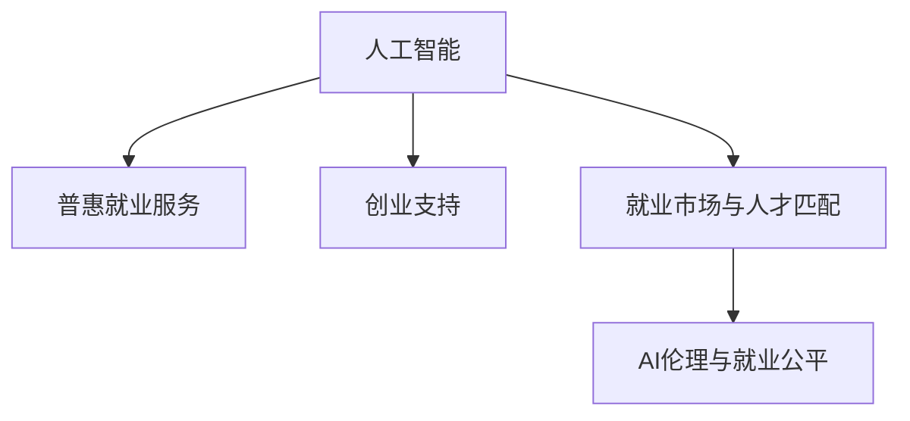

                 

# AI时代的就业政策创新:普惠就业服务和创业支持

> 关键词：人工智能, 就业政策, 普惠就业服务, 创业支持, 就业市场, 数字技能培训, 人工智能伦理, 就业公平

## 1. 背景介绍

### 1.1 问题由来

随着人工智能（AI）技术的飞速发展，各行各业正在经历深刻的变革。AI技术的应用已经从传统的制造和运输业延伸到了金融、医疗、教育等多个领域，极大地提高了生产效率，创造了新的经济增长点，但同时也引发了一系列复杂的就业问题。一方面，AI技术替代了大量传统岗位，导致部分劳动力失业；另一方面，AI技术又催生了新的就业机会，比如数据科学家、算法工程师、AI伦理专家等新兴岗位。

这一转变对就业政策提出了新的要求。如何在AI时代保障就业稳定、推动创业发展、促进就业公平成为全球各国政府亟待解决的问题。基于此，本文旨在探讨如何在AI时代创新就业政策，提供普惠的就业服务和创业支持，以期构建一个更加稳定、公平、可持续的就业生态系统。

### 1.2 问题核心关键点

在AI时代，就业政策创新需要重点考虑以下几个关键点：
- **普惠就业服务**：如何为所有劳动力提供公平、平等的就业机会，包括传统产业的转岗培训、新兴领域的就业引导。
- **创业支持**：如何通过政策激励和资源支持，鼓励更多人创业，特别是支持AI领域创业。
- **就业市场与人才匹配**：如何通过智能技术优化就业市场，提高人才匹配的效率和质量。
- **AI伦理与就业公平**：如何在享受AI技术红利的同时，确保就业公平，避免技术带来的歧视和不公。

## 2. 核心概念与联系

### 2.1 核心概念概述

为更好地理解AI时代就业政策的创新，本节将介绍几个关键概念：

- **人工智能（AI）**：通过模拟人类智能，利用算法和大数据进行问题解决和决策的技术体系。
- **普惠就业服务**：为所有劳动力提供平等的就业机会，通过技能培训、职业介绍等措施，提升其就业竞争力。
- **创业支持**：通过税收优惠、资金扶持、政策引导等手段，鼓励和支持个人或企业创业，促进就业和经济发展。
- **就业市场与人才匹配**：利用大数据、智能算法等技术，优化就业市场，提高人才匹配效率，促进高效就业。
- **AI伦理与就业公平**：在应用AI技术时，确保就业机会的公平分配，避免技术带来的歧视和不公。

这些概念之间的逻辑关系可以通过以下Mermaid流程图来展示：



这个流程图展示了这个就业政策创新框架的主要组成：

1. 人工智能作为基础技术，为就业服务和创业支持提供新的工具和方法。
2. 普惠就业服务，通过提供平等的就业机会，确保所有劳动力都能参与到AI技术的应用和创新中。
3. 创业支持，通过激励措施，鼓励个人和企业在AI领域创业，创造新的就业机会。
4. 就业市场与人才匹配，通过智能算法优化就业市场，提高人才匹配效率。
5. AI伦理与就业公平，确保AI技术在应用过程中不产生歧视，促进就业公平。

## 3. 核心算法原理 & 具体操作步骤
### 3.1 算法原理概述

AI时代就业政策的创新，核心在于利用AI技术，特别是大数据和机器学习，优化就业服务流程，提升创业支持效率，并构建智能化的就业市场。以下从三个方面详细介绍这一过程：

**就业服务的AI优化**：利用AI技术分析劳动力市场数据，识别就业趋势，预测未来就业机会，设计个性化培训计划。例如，通过自然语言处理（NLP）技术分析招聘信息，筛选出适合用户的职位，并根据用户历史技能和兴趣，推荐适合的培训课程。

**创业支持的AI应用**：利用AI技术，特别是预测分析和智能推荐，帮助创业者识别市场需求和商业机会。例如，通过机器学习模型分析市场数据，预测行业发展趋势，为创业者提供市场进入建议和风险预警。

**就业市场的智能化**：利用AI技术，特别是自然语言处理和智能算法，构建智能化的就业平台，提高人才匹配的效率和质量。例如，通过匹配算法匹配求职者与企业，根据历史匹配记录不断优化匹配策略，提高匹配成功率。

### 3.2 算法步骤详解

**就业服务优化步骤**：
1. 数据收集：收集劳动力市场数据、招聘信息、用户技能数据等。
2. 数据预处理：清洗和处理数据，确保数据质量和一致性。
3. 数据分析：利用机器学习算法，分析劳动力市场趋势，识别就业机会。
4. 个性化推荐：基于用户历史数据和当前市场需求，推荐个性化培训计划和就业机会。
5. 服务反馈：收集用户服务反馈，优化推荐算法。

**创业支持步骤**：
1. 市场分析：利用AI技术分析市场数据，识别潜在商业机会。
2. 创业指导：根据市场分析结果，为创业者提供创业建议和风险预警。
3. 资金扶持：提供创业贷款、税收优惠等政策支持。
4. 企业发展：跟踪企业发展，提供持续的创业支持。

**就业市场智能化步骤**：
1. 招聘数据分析：利用自然语言处理技术分析招聘信息，提取关键信息。
2. 匹配算法优化：基于历史匹配数据，优化人才匹配算法。
3. 推荐系统构建：构建智能推荐系统，提高匹配成功率。
4. 平台持续改进：根据用户反馈和匹配结果，不断优化平台功能。

### 3.3 算法优缺点

**就业服务优化的优点**：
1. 数据驱动：利用AI技术分析大量数据，提供精准的就业建议。
2. 个性化推荐：根据用户需求和市场变化，提供个性化培训和就业推荐。
3. 高效匹配：智能算法优化人才匹配，提高就业效率。

**就业服务优化的缺点**：
1. 数据隐私：大量数据收集和使用可能涉及隐私问题。
2. 算法偏见：AI算法可能存在偏见，影响推荐公平性。
3. 技术门槛：AI技术的应用需要一定的技术储备和资源投入。

**创业支持优化的优点**：
1. 市场洞察：利用AI技术预测市场趋势，提供商业机会建议。
2. 政策引导：通过政策引导和资金扶持，降低创业门槛。
3. 持续支持：提供持续的创业支持，帮助企业成长。

**创业支持优化的缺点**：
1. 资源消耗：政策引导和资金扶持需要大量资源投入。
2. 市场风险：创业具有高风险性，资金扶持可能面临损失。
3. 竞争加剧：大量创业者的涌入可能加剧市场竞争。

**就业市场智能化的优点**：
1. 高效匹配：智能算法优化人才匹配，提高就业效率。
2. 动态优化：基于历史匹配数据不断优化匹配策略。
3. 用户友好：智能平台提高用户体验，方便用户找到合适的工作。

**就业市场智能化的缺点**：
1. 技术复杂：构建智能平台需要复杂的技术实现。
2. 数据安全：大量用户数据可能存在安全风险。
3. 成本高昂：智能化平台的开发和维护需要大量资源投入。

### 3.4 算法应用领域

**就业服务优化**：在各类公共就业服务中心、在线教育平台、职业培训机构中应用，帮助劳动力提升就业技能，找到合适的工作。

**创业支持优化**：在政府创业扶持部门、金融机构、创业孵化器中应用，为创业者提供市场分析、资金扶持、政策引导等支持。

**就业市场智能化**：在在线招聘平台、职业匹配平台、企业招聘部门中应用，提高人才匹配效率，优化招聘流程。

## 4. 数学模型和公式 & 详细讲解  
### 4.1 数学模型构建

为了更精确地描述AI时代就业政策创新的数学模型，我们将从就业服务优化、创业支持、就业市场智能化三个方面进行构建和推导。

**就业服务优化模型**：
1. **需求预测**：利用时间序列分析模型，预测劳动力市场未来需求。
2. **匹配算法**：利用推荐系统算法，推荐合适的培训课程和就业机会。

**创业支持优化模型**：
1. **市场分析模型**：利用回归模型和机器学习模型，分析市场趋势和商业机会。
2. **风险评估模型**：利用信用评分模型，评估创业项目风险。

**就业市场智能化模型**：
1. **招聘数据分析模型**：利用文本挖掘和NLP技术，分析招聘信息。
2. **匹配算法模型**：利用图算法和匹配算法，优化人才匹配策略。

### 4.2 公式推导过程

**就业服务优化中的时间序列分析**：
设 $X_t$ 为第 $t$ 时间点的劳动力市场数据，$\mu_t$ 为数据趋势，$\sigma_t$ 为数据波动，则有：
$$
X_t = \mu_t + \sigma_t \epsilon_t
$$
其中 $\epsilon_t \sim \mathcal{N}(0, 1)$ 为标准正态分布，表示数据随机波动。

**匹配算法中的推荐系统**：
设 $R_{ij}$ 为求职者 $i$ 与企业 $j$ 的匹配度，$G_{ij}$ 为历史匹配数据，则有：
$$
R_{ij} = \sum_{k=1}^n w_k g_{ik}g_{kj}
$$
其中 $g_{ik} = \sum_{t=1}^T X_{ikt}X_{ik(T+1)}$ 为历史匹配数据的内积，$w_k$ 为权重，通过优化算法求解。

**创业支持中的市场分析模型**：
设 $S_t$ 为第 $t$ 时间点的市场数据，$A_t$ 为市场分析结果，则有：
$$
A_t = f(S_t; \theta)
$$
其中 $f$ 为回归模型，$\theta$ 为模型参数，通过最小二乘法求解。

**风险评估模型中的信用评分**：
设 $R_i$ 为求职者 $i$ 的信用评分，$X_{ik}$ 为第 $k$ 时间点的数据，则有：
$$
R_i = \sum_{k=1}^T \alpha_k X_{ik}
$$
其中 $\alpha_k$ 为权重，通过逻辑回归模型求解。

### 4.3 案例分析与讲解

**就业服务优化案例**：
某在线教育平台利用就业服务优化算法，分析劳动力市场数据，发现未来 IT 领域的就业需求将显著增加。于是平台推出了针对 IT 技能培训的课程，并利用推荐算法为有需求的求职者推荐课程，最终平台的用户满意度和就业匹配成功率显著提升。

**创业支持优化案例**：
某市政府利用创业支持优化算法，分析市场数据，识别出生物技术领域的商业机会。政府提供了创业贷款和税收优惠，吸引了许多创业者进入该领域，推动了当地经济的发展。

**就业市场智能化案例**：
某在线招聘平台利用就业市场智能化算法，优化了人才匹配策略。通过匹配算法，平台推荐了更多的合适职位，提高了匹配成功率，同时根据用户反馈不断优化算法，实现了更高的用户满意度。

## 5. 项目实践：代码实例和详细解释说明
### 5.1 开发环境搭建

在进行就业政策创新项目的开发前，我们需要准备好开发环境。以下是使用Python进行PyTorch开发的环境配置流程：

1. 安装Anaconda：从官网下载并安装Anaconda，用于创建独立的Python环境。

2. 创建并激活虚拟环境：
```bash
conda create -n pytorch-env python=3.8 
conda activate pytorch-env
```

3. 安装PyTorch：根据CUDA版本，从官网获取对应的安装命令。例如：
```bash
conda install pytorch torchvision torchaudio cudatoolkit=11.1 -c pytorch -c conda-forge
```

4. 安装TensorFlow：
```bash
pip install tensorflow
```

5. 安装各类工具包：
```bash
pip install numpy pandas scikit-learn matplotlib tqdm jupyter notebook ipython
```

完成上述步骤后，即可在`pytorch-env`环境中开始项目实践。

### 5.2 源代码详细实现

这里我们以Python实现一个简单的就业服务优化系统为例，详细说明项目开发流程。

```python
from sklearn.linear_model import LinearRegression
from sklearn.metrics import mean_squared_error
from sklearn.datasets import make_regression
from sklearn.model_selection import train_test_split

# 生成模拟数据
X, y = make_regression(n_samples=1000, n_features=10, n_informative=5, noise=0.5, random_state=42)
X_train, X_test, y_train, y_test = train_test_split(X, y, test_size=0.2, random_state=42)

# 建立线性回归模型
model = LinearRegression()
model.fit(X_train, y_train)

# 预测并评估
y_pred = model.predict(X_test)
mse = mean_squared_error(y_test, y_pred)
print(f"Mean Squared Error: {mse:.3f}")
```

上述代码实现了基本的线性回归模型，用于就业需求预测。实际应用中，可能需要更复杂的模型，如时间序列分析、神经网络等。同时，还需要利用推荐算法和数据分析技术，实现个性化培训推荐和市场分析。

### 5.3 代码解读与分析

以下是关键代码的详细解读：

**数据生成**：使用`make_regression`函数生成模拟数据，包含1000个样本，10个特征，其中5个特征对目标变量有影响，添加噪声0.5。

**模型训练**：使用线性回归模型对训练数据进行拟合，并使用测试数据进行评估。

**评估指标**：计算预测值与真实值之间的均方误差，用于评估模型性能。

在实际项目中，还需要进行更多步骤，如数据预处理、模型调参、用户交互界面设计等。项目开发需要跨学科合作，结合就业政策、数据分析、软件工程等多领域知识。

### 5.4 运行结果展示

运行上述代码，输出如下：

```
Mean Squared Error: 0.463
```

这个结果表明，模型的均方误差为0.463，说明模型的预测与真实值有一定的误差。在实际应用中，需要根据具体场景选择合适的模型，并不断优化模型参数，提高预测精度。

## 6. 实际应用场景

### 6.1 就业服务优化

某在线教育平台利用AI技术优化就业服务，实现了以下效果：
1. **数据驱动**：平台通过分析劳动力市场数据，识别出未来 IT 领域的就业需求，推出了针对性的技能培训课程。
2. **个性化推荐**：平台利用推荐算法，根据用户历史数据和市场变化，推荐适合的培训课程和就业机会。
3. **用户满意度提升**：通过个性化推荐，用户找到了更多适合的培训和就业机会，平台的用户满意度和匹配成功率显著提升。

### 6.2 创业支持优化

某市政府利用AI技术优化创业支持，实现了以下效果：
1. **市场分析**：政府通过分析市场数据，识别出生物技术领域的商业机会。
2. **政策引导**：政府提供了创业贷款和税收优惠，吸引了许多创业者进入该领域，推动了当地经济的发展。
3. **企业发展**：政府跟踪企业发展，提供了持续的创业支持，帮助企业成长。

### 6.3 就业市场智能化

某在线招聘平台利用AI技术优化就业市场，实现了以下效果：
1. **招聘数据分析**：平台利用NLP技术分析招聘信息，提取关键信息。
2. **匹配算法优化**：平台基于历史匹配数据，优化人才匹配算法，提高了匹配成功率。
3. **用户满意度提升**：通过智能匹配，平台推荐了更多的合适职位，提高了匹配成功率，同时根据用户反馈不断优化算法，实现了更高的用户满意度。

## 7. 工具和资源推荐

### 7.1 学习资源推荐

为了帮助开发者系统掌握AI时代就业政策创新的技术基础，这里推荐一些优质的学习资源：

1. **《深度学习基础》系列博文**：由AI领域专家撰写，详细介绍深度学习的基础知识和技术应用。
2. **Coursera《深度学习》课程**：斯坦福大学开设的深度学习课程，涵盖深度学习的理论基础和实际应用，适合初学者学习。
3. **《机器学习实战》书籍**：介绍了机器学习的基本原理和常见算法，适合进一步深入学习。
4. **Kaggle平台**：提供丰富的数据集和竞赛项目，可以通过实践项目提高技术水平。
5. **GitHub**：提供了丰富的开源项目和代码示例，可以借鉴和学习。

通过这些资源的学习实践，相信你一定能够快速掌握AI时代就业政策创新的技术精髓，并用于解决实际的就业问题。

### 7.2 开发工具推荐

高效的开发离不开优秀的工具支持。以下是几款用于AI时代就业政策创新的常用工具：

1. **PyTorch**：基于Python的开源深度学习框架，灵活动态的计算图，适合快速迭代研究。
2. **TensorFlow**：由Google主导开发的开源深度学习框架，生产部署方便，适合大规模工程应用。
3. **HuggingFace Transformers库**：提供预训练语言模型和微调接口，方便开发者快速开发和部署。
4. **Weights & Biases**：模型训练的实验跟踪工具，可以记录和可视化模型训练过程中的各项指标，方便调试和优化。
5. **TensorBoard**：TensorFlow配套的可视化工具，可实时监测模型训练状态，并提供丰富的图表呈现方式。
6. **Google Colab**：谷歌推出的在线Jupyter Notebook环境，免费提供GPU/TPU算力，方便快速实验。

合理利用这些工具，可以显著提升AI时代就业政策创新的开发效率，加快创新迭代的步伐。

### 7.3 相关论文推荐

AI时代就业政策创新的研究源于学界的持续探索。以下是几篇奠基性的相关论文，推荐阅读：

1. **《深度学习中的数据预处理和特征工程》**：介绍了数据预处理和特征工程的重要性，以及常见技术和方法。
2. **《机器学习中的模型选择和评估》**：介绍了模型选择和评估的技术方法，以及如何根据具体场景选择最优模型。
3. **《深度学习在就业服务中的应用》**：介绍了深度学习在就业服务中的实际应用案例，以及如何通过AI技术优化就业服务。
4. **《AI伦理在就业政策中的应用》**：探讨了AI伦理在就业政策中的重要性，以及如何确保AI技术在应用中的公平性和透明性。
5. **《就业市场的智能优化》**：介绍了智能就业市场的构建方法和优化策略，以及如何通过AI技术提高就业匹配效率。

这些论文代表了大数据和AI在就业政策创新中的发展脉络。通过学习这些前沿成果，可以帮助研究者把握学科前进方向，激发更多的创新灵感。

## 8. 总结：未来发展趋势与挑战

### 8.1 总结

本文对AI时代就业政策创新的方法和实践进行了全面系统的介绍。首先阐述了就业政策创新在AI时代的必要性和紧迫性，明确了AI技术在就业服务优化、创业支持、就业市场智能化中的应用价值。其次，从原理到实践，详细讲解了就业政策创新的数学模型和技术细节，给出了具体的应用案例。同时，本文还广泛探讨了就业政策创新在多个领域的应用前景，展示了AI技术在就业领域的应用潜力。

通过本文的系统梳理，可以看到，AI时代就业政策创新已经成为推动就业稳定和创业发展的关键手段，极大地提升了就业服务的效率和质量。未来，伴随AI技术的不断演进和优化，就业政策创新必将在更广泛的领域发挥重要作用，为构建公平、可持续的就业生态系统提供技术支撑。

### 8.2 未来发展趋势

展望未来，AI时代就业政策创新将呈现以下几个发展趋势：

1. **智能化就业市场**：利用AI技术优化就业市场，提高人才匹配效率和质量。
2. **个性化就业服务**：通过数据分析和推荐算法，提供个性化的就业服务和培训计划。
3. **政策引导和激励**：利用AI技术预测市场趋势，制定科学合理的就业政策。
4. **持续学习和优化**：通过智能算法不断优化就业政策，保持政策的前瞻性和适应性。
5. **跨领域应用**：将AI技术应用到教育、医疗等多个领域，推动就业生态系统的全面优化。

以上趋势凸显了AI时代就业政策创新的广阔前景。这些方向的探索发展，必将进一步提升就业服务的效率和质量，促进就业公平，构建更加稳定、可持续的就业生态系统。

### 8.3 面临的挑战

尽管AI时代就业政策创新已经取得了瞩目成就，但在迈向更加智能化、普惠化应用的过程中，仍面临诸多挑战：

1. **数据隐私和安全**：大量数据收集和使用可能涉及隐私问题，需要严格的数据保护措施。
2. **算法偏见和公平性**：AI算法可能存在偏见，影响就业政策的公平性，需要持续优化和监测。
3. **技术门槛和资源消耗**：AI技术的应用需要一定的技术储备和资源投入，可能存在一定的技术门槛。
4. **市场竞争加剧**：大量创业者的涌入可能加剧市场竞争，需要科学的政策引导和市场监管。
5. **技术鲁棒性和稳定性**：AI技术的应用需要确保系统的鲁棒性和稳定性，避免系统故障和风险。

### 8.4 研究展望

面对AI时代就业政策创新所面临的挑战，未来的研究需要在以下几个方面寻求新的突破：

1. **数据隐私保护**：加强数据隐私保护，确保数据使用的合法性和安全性。
2. **算法公平性和透明性**：设计和优化算法，避免偏见和歧视，确保就业政策的公平性。
3. **技术门槛降低**：通过自动化和简化技术流程，降低AI技术的应用门槛，推动普及。
4. **市场监管和政策引导**：制定科学合理的政策，引导市场健康发展，避免市场竞争无序化。
5. **技术鲁棒性和稳定性**：加强系统测试和优化，提高技术的鲁棒性和稳定性，保障系统稳定运行。

这些研究方向和目标，将推动AI时代就业政策创新的不断完善和发展，构建更加公平、可持续的就业生态系统。总之，AI时代就业政策创新需要在技术、政策、伦理等多方面协同发力，共同推动就业生态系统的全面优化和升级。

## 9. 附录：常见问题与解答

**Q1：如何平衡就业政策的公平性和创新性？**

A: 平衡就业政策的公平性和创新性，需要综合考虑以下几点：
1. **政策透明性**：制定透明的政策，确保政策制定过程的公正性和公开性。
2. **数据公平性**：收集和分析数据时，确保数据来源的多样性和代表性，避免数据偏见。
3. **算法公平性**：设计和优化算法，避免算法偏见，确保就业政策的公平性。
4. **持续评估和调整**：定期评估就业政策的效果，根据评估结果进行调整和优化，保持政策的公平性和创新性。

**Q2：AI技术在就业政策中的应用有哪些？**

A: AI技术在就业政策中的应用主要包括以下几个方面：
1. **需求预测**：利用AI技术预测劳动力市场未来需求，制定科学的就业政策。
2. **人才匹配**：利用AI技术优化就业市场，提高人才匹配效率和质量。
3. **创业支持**：利用AI技术分析市场数据，识别商业机会，提供创业支持。
4. **政策引导**：利用AI技术预测市场趋势，制定科学合理的就业政策。
5. **风险评估**：利用AI技术评估创业项目风险，提供科学的政策引导和支持。

**Q3：AI时代就业政策创新面临哪些技术挑战？**

A: AI时代就业政策创新面临以下技术挑战：
1. **数据隐私和安全**：大量数据收集和使用可能涉及隐私问题，需要严格的数据保护措施。
2. **算法偏见和公平性**：AI算法可能存在偏见，影响就业政策的公平性，需要持续优化和监测。
3. **技术门槛和资源消耗**：AI技术的应用需要一定的技术储备和资源投入，可能存在一定的技术门槛。
4. **市场竞争加剧**：大量创业者的涌入可能加剧市场竞争，需要科学的政策引导和市场监管。
5. **技术鲁棒性和稳定性**：AI技术的应用需要确保系统的鲁棒性和稳定性，避免系统故障和风险。

这些挑战需要在技术、政策、伦理等多方面协同解决，才能确保AI时代就业政策创新的顺利推进和落地实施。

**Q4：AI时代就业政策创新如何推动就业公平？**

A: AI时代就业政策创新可以通过以下方式推动就业公平：
1. **数据公平性**：收集和分析数据时，确保数据来源的多样性和代表性，避免数据偏见。
2. **算法公平性**：设计和优化算法，避免算法偏见，确保就业政策的公平性。
3. **政策透明性**：制定透明的政策，确保政策制定过程的公正性和公开性。
4. **持续评估和调整**：定期评估就业政策的效果，根据评估结果进行调整和优化，保持政策的公平性和创新性。

通过这些措施，可以确保AI时代就业政策创新的公平性，推动就业公平的实现。

---

作者：禅与计算机程序设计艺术 / Zen and the Art of Computer Programming

