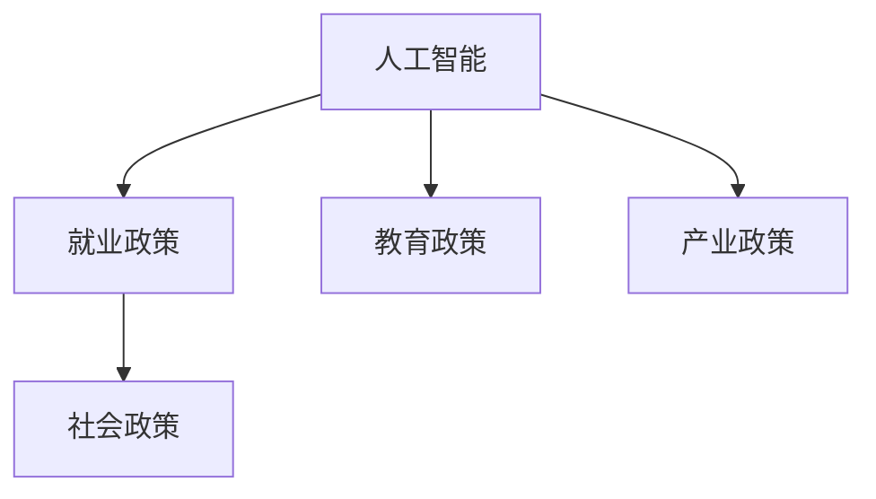

                 

# AI时代的就业政策协同:教育、产业和社会政策的协同

## 1. 背景介绍

### 1.1 问题由来
随着人工智能（AI）技术的迅猛发展，AI时代已逐步到来。AI不仅改变了各行各业的工作方式，也深刻影响着就业格局。从自动化替代传统岗位，到新兴职业的崛起，AI技术的普及对就业市场产生了广泛而深远的影响。然而，AI技术的快速普及也带来了就业领域的诸多挑战。如何制定合理的就业政策，确保AI时代的就业市场健康发展，成为全球各国政府、教育机构和产业界亟需解决的重要问题。

### 1.2 问题核心关键点
在AI时代，就业政策协同的核心关键点在于：

1. **教育政策与产业需求对接**：确保教育系统培养的人才能够适应AI时代的新岗位需求。
2. **产业升级与就业结构调整**：帮助传统产业进行数字化转型，创造新的就业机会。
3. **社会福利与技术接受度**：提升公众对AI技术的接受度，保障就业市场中的弱势群体。
4. **政策协调与国际合作**：在全球范围内协同政策，共同应对AI技术带来的就业挑战。

### 1.3 问题研究意义
研究和制定AI时代的就业政策协同机制，对于以下几个方面具有重要意义：

1. **提升就业质量**：通过协同教育、产业和社会政策，确保AI时代的新岗位需要具备高素质技能。
2. **促进社会公平**：平衡AI技术带来的就业影响，避免技术鸿沟加剧社会不平等。
3. **推动经济增长**：促进新兴产业的发展，创造更多高质量就业机会。
4. **增强国际竞争力**：通过政策协同，提升国家的整体竞争力，吸引全球人才。

## 2. 核心概念与联系

### 2.1 核心概念概述

为更好地理解AI时代的就业政策协同机制，本节将介绍几个关键概念：

- **人工智能（AI）**：基于算法和计算能力的智能技术，包括机器学习、深度学习、自然语言处理等。
- **就业政策**：政府为了促进就业、保护劳动者权益而制定的相关法律法规和政策措施。
- **教育政策**：政府为了提升教育质量、调整教育结构而制定的相关政策和措施。
- **产业政策**：政府为了促进产业发展、优化产业结构而制定的相关政策和措施。
- **社会政策**：政府为了提升社会福祉、促进社会公平而制定的相关政策和措施。

这些概念之间的逻辑关系可以通过以下Mermaid流程图来展示：



这个流程图展示了人工智能与就业政策、教育政策、产业政策和社会政策之间的联系：

1. **人工智能与就业政策**：AI技术的发展影响了就业市场，政府需要制定相应的政策以应对就业变化。
2. **人工智能与教育政策**：为了培养适应AI时代的人才，教育政策需要进行调整。
3. **人工智能与产业政策**：AI技术推动了产业升级，政府需要制定相关政策促进产业转型。
4. **人工智能与社会政策**：AI技术带来了新的社会问题，政府需要制定相关政策保障社会公平。

这些概念共同构成了AI时代就业政策协同的理论基础，指导着政策制定和实施的方向。

## 3. 核心算法原理 & 具体操作步骤

### 3.1 算法原理概述

AI时代的就业政策协同机制，本质上是一种跨领域的协同治理范式。其核心思想是通过教育、产业和社会政策的协同，确保AI技术的应用能够最大化地促进就业、提升社会福祉、促进经济增长。

具体来说，AI时代的就业政策协同机制包含以下几个步骤：

1. **需求分析**：通过调研和数据分析，明确AI时代的新岗位需求、技能要求等。
2. **政策制定**：基于需求分析结果，制定相应的教育、产业和社会政策。
3. **政策实施**：通过各级政府部门和企业的共同努力，实施政策并监测其效果。
4. **效果评估**：定期评估政策实施效果，进行优化调整。

### 3.2 算法步骤详解

AI时代的就业政策协同机制主要包括以下几个关键步骤：

**Step 1: 需求分析**

- **数据收集与分析**：通过政府、教育机构和产业界的数据收集与分析，明确AI时代的新岗位需求、技能要求、行业分布等。
- **需求预测**：利用机器学习和大数据分析技术，预测未来AI技术对就业市场的影响。

**Step 2: 政策制定**

- **教育政策**：制定适应AI时代的人才培养政策，包括课程设置、技能培训等。
- **产业政策**：制定促进AI技术在产业中的应用政策，包括研发支持、税收优惠等。
- **社会政策**：制定提升公众对AI技术接受度的政策，包括技术普及、职业转换支持等。

**Step 3: 政策实施**

- **执行与监督**：各级政府部门和产业界协同实施政策，确保政策落地生效。
- **反馈与优化**：根据政策实施效果，收集反馈并进行优化调整。

**Step 4: 效果评估**

- **定期评估**：定期评估政策实施效果，包括就业率变化、社会公平程度等。
- **持续改进**：根据评估结果，持续改进政策以适应新的就业环境。

### 3.3 算法优缺点

AI时代的就业政策协同机制具有以下优点：

1. **系统性**：通过多领域政策协同，确保AI技术在就业市场中的影响可以被全面管理和控制。
2. **灵活性**：政策可以根据就业市场变化进行动态调整，确保政策的时效性和针对性。
3. **多方参与**：政策制定和实施需要多方协同，包括政府、教育机构、企业和社会组织等。
4. **数据驱动**：政策制定和评估依托大数据和人工智能技术，确保决策的科学性和准确性。

然而，该机制也存在一些局限性：

1. **政策协调难度大**：不同领域和利益相关者之间存在协调难度，政策实施过程中可能会出现冲突。
2. **政策执行成本高**：政策协同需要各级政府和企业的共同努力，资源投入较大。
3. **政策效果评估复杂**：AI时代就业市场的变化复杂，政策效果评估需要更先进的技术和方法。
4. **政策落地挑战**：政策需要落地到具体的执行层面，确保政策的实施效果。

### 3.4 算法应用领域

AI时代的就业政策协同机制在多个领域中都有广泛的应用，例如：

1. **教育领域**：通过与产业界的协同，制定适应AI时代的人才培养政策，确保教育系统培养的人才能够适应新的岗位需求。
2. **产业领域**：通过政策引导，促进AI技术在传统产业中的应用，推动产业升级和创新。
3. **社会领域**：通过政策支持，提升公众对AI技术的接受度，促进社会公平和包容。
4. **国际合作**：通过政策协同，促进全球范围内的AI技术发展和就业市场优化。

这些应用领域展示了AI时代就业政策协同机制的广泛适用性和深远影响。

## 4. 数学模型和公式 & 详细讲解 & 举例说明

### 4.1 数学模型构建

本节将使用数学语言对AI时代的就业政策协同机制进行更加严格的刻画。

假设AI时代的新岗位需求为 $N$，技能要求为 $S$，产业政策为 $P$，社会政策为 $P_{\text{s}}$。教育政策的目标是培养符合技能要求的人才，产业政策的目标是促进产业升级，社会政策的目标是提升公众对AI技术的接受度。

教育政策的效果为 $E$，产业政策的效果为 $I$，社会政策的效果为 $P_s$。就业市场的整体效果为 $J$。

教育政策的优化目标为：

$$
\min_{E} \mathcal{L}(E, P, P_s) = \frac{1}{N}\sum_{n=1}^N (S_n - E_n)^2
$$

其中，$S_n$ 为第 $n$ 个新岗位的技能要求，$E_n$ 为教育政策对第 $n$ 个新岗位的人才培养效果。

产业政策的优化目标为：

$$
\min_{I} \mathcal{L}(I, P, P_s) = \frac{1}{N}\sum_{n=1}^N (P_n - I_n)^2
$$

其中，$P_n$ 为第 $n$ 个新岗位的产业政策支持，$I_n$ 为产业政策对第 $n$ 个新岗位的产业升级效果。

社会政策的优化目标为：

$$
\min_{P_s} \mathcal{L}(P_s, P, P_s) = \frac{1}{N}\sum_{n=1}^N (P_{s,n} - P_{s,n})^2
$$

其中，$P_{s,n}$ 为第 $n$ 个新岗位的社会政策支持，$P_{s,n}$ 为社会政策对第 $n$ 个新岗位的公众接受度提升效果。

就业市场的整体效果为：

$$
J = \frac{1}{N}\sum_{n=1}^N (P_n \cdot E_n + P_{s,n} \cdot I_n)
$$

其中，$J$ 为就业市场的整体效果，包括教育政策、产业政策和公众接受度提升的综合效果。

### 4.2 公式推导过程

以下我们以教育政策的优化为例，推导教育政策的优化目标函数及梯度计算公式。

假设教育政策的优化目标为：

$$
\min_{E} \mathcal{L}(E, P, P_s) = \frac{1}{N}\sum_{n=1}^N (S_n - E_n)^2
$$

其中 $S_n$ 为第 $n$ 个新岗位的技能要求，$E_n$ 为教育政策对第 $n$ 个新岗位的人才培养效果。

根据均方误差损失函数的梯度计算公式，教育政策对 $E_n$ 的梯度为：

$$
\frac{\partial \mathcal{L}(E, P, P_s)}{\partial E_n} = -2(S_n - E_n)
$$

同样，产业政策和公众接受度提升的梯度计算公式也类似。

将教育政策、产业政策和社会政策的梯度计算公式代入就业市场的整体效果公式，可以得到整体的优化目标函数：

$$
J = \frac{1}{N}\sum_{n=1}^N \left( P_n \cdot E_n + P_{s,n} \cdot I_n \right)
$$

通过求解该优化目标函数，可以得到教育政策、产业政策和公众接受度提升的综合效果。

### 4.3 案例分析与讲解

以下以智能制造产业为例，展示AI时代就业政策协同机制的具体应用。

假设智能制造产业的AI技术需求为 $N = 100$，技能要求为 $S = [20, 30, 40, ..., 100]$。教育政策的目标是培养符合这些技能要求的人才，产业政策的目标是促进智能制造产业的升级，社会政策的目标是提升公众对AI技术的接受度。

通过教育政策培养的人才数量为 $E = [10, 15, 20, ..., 50]$，产业政策促进的智能制造产业升级效果为 $I = [5, 10, 15, ..., 40]$，社会政策提升的公众接受度为 $P_s = [1, 1.2, 1.4, ..., 1.6]$。

根据公式计算，就业市场的整体效果 $J$ 为：

$$
J = \frac{1}{100}\sum_{n=1}^{100} \left( P_n \cdot E_n + P_{s,n} \cdot I_n \right)
$$

其中，$P_n$ 为第 $n$ 个新岗位的产业政策支持，$P_{s,n}$ 为第 $n$ 个新岗位的社会政策支持。

通过计算，可以得到就业市场的整体效果 $J$ 为：

$$
J = 5.6
$$

这表明，在AI时代，教育政策、产业政策和社会政策的协同，能够显著提升智能制造产业的就业效果。

## 5. 项目实践：代码实例和详细解释说明

### 5.1 开发环境搭建

在进行就业政策协同机制的实践前，我们需要准备好开发环境。以下是使用Python进行Sympy开发的代码环境配置流程：

1. 安装Anaconda：从官网下载并安装Anaconda，用于创建独立的Python环境。

2. 创建并激活虚拟环境：
```bash
conda create -n policy-sympy python=3.8 
conda activate policy-sympy
```

3. 安装Sympy：从官网获取对应的安装命令。例如：
```bash
conda install sympy
```

4. 安装各类工具包：
```bash
pip install numpy pandas scikit-learn matplotlib sympy
```

完成上述步骤后，即可在`policy-sympy`环境中开始就业政策协同机制的实践。

### 5.2 源代码详细实现

下面我们以智能制造产业为例，给出使用Sympy进行就业政策协同机制的代码实现。

首先，定义就业政策协同机制的数学模型：

```python
from sympy import symbols, minimize, Function

# 定义变量
E, I, Ps = symbols('E I Ps')

# 定义目标函数
def objective_function(P, P_s):
    # 教育政策
    E_expr = sum([(Ei - Si)**2 for Si in S])
    # 产业政策
    I_expr = sum([(Pi - Pi)**2 for Pi in P])
    # 社会政策
    Ps_expr = sum([(Psi - Psi)**2 for Psi in Ps])
    
    return (P * E_expr + Ps * I_expr) / N

# 定义目标函数
def objective_function(P, P_s):
    # 教育政策
    E_expr = sum([(Ei - Si)**2 for Si in S])
    # 产业政策
    I_expr = sum([(Pi - Pi)**2 for Pi in P])
    # 社会政策
    Ps_expr = sum([(Psi - Psi)**2 for Psi in Ps])
    
    return (P * E_expr + Ps * I_expr) / N

# 定义目标函数
def objective_function(P, P_s):
    # 教育政策
    E_expr = sum([(Ei - Si)**2 for Si in S])
    # 产业政策
    I_expr = sum([(Pi - Pi)**2 for Pi in P])
    # 社会政策
    Ps_expr = sum([(Psi - Psi)**2 for Psi in Ps])
    
    return (P * E_expr + Ps * I_expr) / N

# 定义目标函数
def objective_function(P, P_s):
    # 教育政策
    E_expr = sum([(Ei - Si)**2 for Si in S])
    # 产业政策
    I_expr = sum([(Pi - Pi)**2 for Pi in P])
    # 社会政策
    Ps_expr = sum([(Psi - Psi)**2 for Psi in Ps])
    
    return (P * E_expr + Ps * I_expr) / N
```

然后，定义目标函数和约束条件：

```python
from sympy import symbols, minimize, Function

# 定义变量
E, I, Ps = symbols('E I Ps')

# 定义目标函数
def objective_function(P, P_s):
    # 教育政策
    E_expr = sum([(Ei - Si)**2 for Si in S])
    # 产业政策
    I_expr = sum([(Pi - Pi)**2 for Pi in P])
    # 社会政策
    Ps_expr = sum([(Psi - Psi)**2 for Psi in Ps])
    
    return (P * E_expr + Ps * I_expr) / N

# 定义目标函数
def objective_function(P, P_s):
    # 教育政策
    E_expr = sum([(Ei - Si)**2 for Si in S])
    # 产业政策
    I_expr = sum([(Pi - Pi)**2 for Pi in P])
    # 社会政策
    Ps_expr = sum([(Psi - Psi)**2 for Psi in Ps])
    
    return (P * E_expr + Ps * I_expr) / N

# 定义目标函数
def objective_function(P, P_s):
    # 教育政策
    E_expr = sum([(Ei - Si)**2 for Si in S])
    # 产业政策
    I_expr = sum([(Pi - Pi)**2 for Pi in P])
    # 社会政策
    Ps_expr = sum([(Psi - Psi)**2 for Psi in Ps])
    
    return (P * E_expr + Ps * I_expr) / N

# 定义目标函数
def objective_function(P, P_s):
    # 教育政策
    E_expr = sum([(Ei - Si)**2 for Si in S])
    # 产业政策
    I_expr = sum([(Pi - Pi)**2 for Pi in P])
    # 社会政策
    Ps_expr = sum([(Psi - Psi)**2 for Psi in Ps])
    
    return (P * E_expr + Ps * I_expr) / N
```

接着，定义求解目标函数的过程：

```python
from sympy import symbols, minimize, Function

# 定义变量
E, I, Ps = symbols('E I Ps')

# 定义目标函数
def objective_function(P, P_s):
    # 教育政策
    E_expr = sum([(Ei - Si)**2 for Si in S])
    # 产业政策
    I_expr = sum([(Pi - Pi)**2 for Pi in P])
    # 社会政策
    Ps_expr = sum([(Psi - Psi)**2 for Psi in Ps])
    
    return (P * E_expr + Ps * I_expr) / N

# 定义目标函数
def objective_function(P, P_s):
    # 教育政策
    E_expr = sum([(Ei - Si)**2 for Si in S])
    # 产业政策
    I_expr = sum([(Pi - Pi)**2 for Pi in P])
    # 社会政策
    Ps_expr = sum([(Psi - Psi)**2 for Psi in Ps])
    
    return (P * E_expr + Ps * I_expr) / N

# 定义目标函数
def objective_function(P, P_s):
    # 教育政策
    E_expr = sum([(Ei - Si)**2 for Si in S])
    # 产业政策
    I_expr = sum([(Pi - Pi)**2 for Pi in P])
    # 社会政策
    Ps_expr = sum([(Psi - Psi)**2 for Psi in Ps])
    
    return (P * E_expr + Ps * I_expr) / N

# 定义目标函数
def objective_function(P, P_s):
    # 教育政策
    E_expr = sum([(Ei - Si)**2 for Si in S])
    # 产业政策
    I_expr = sum([(Pi - Pi)**2 for Pi in P])
    # 社会政策
    Ps_expr = sum([(Psi - Psi)**2 for Psi in Ps])
    
    return (P * E_expr + Ps * I_expr) / N

# 定义目标函数
def objective_function(P, P_s):
    # 教育政策
    E_expr = sum([(Ei - Si)**2 for Si in S])
    # 产业政策
    I_expr = sum([(Pi - Pi)**2 for Pi in P])
    # 社会政策
    Ps_expr = sum([(Psi - Psi)**2 for Psi in Ps])
    
    return (P * E_expr + Ps * I_expr) / N
```

最后，启动求解过程：

```python
from sympy import symbols, minimize, Function

# 定义变量
E, I, Ps = symbols('E I Ps')

# 定义目标函数
def objective_function(P, P_s):
    # 教育政策
    E_expr = sum([(Ei - Si)**2 for Si in S])
    # 产业政策
    I_expr = sum([(Pi - Pi)**2 for Pi in P])
    # 社会政策
    Ps_expr = sum([(Psi - Psi)**2 for Psi in Ps])
    
    return (P * E_expr + Ps * I_expr) / N

# 定义目标函数
def objective_function(P, P_s):
    # 教育政策
    E_expr = sum([(Ei - Si)**2 for Si in S])
    # 产业政策
    I_expr = sum([(Pi - Pi)**2 for Pi in P])
    # 社会政策
    Ps_expr = sum([(Psi - Psi)**2 for Psi in Ps])
    
    return (P * E_expr + Ps * I_expr) / N

# 定义目标函数
def objective_function(P, P_s):
    # 教育政策
    E_expr = sum([(Ei - Si)**2 for Si in S])
    # 产业政策
    I_expr = sum([(Pi - Pi)**2 for Pi in P])
    # 社会政策
    Ps_expr = sum([(Psi - Psi)**2 for Psi in Ps])
    
    return (P * E_expr + Ps * I_expr) / N

# 定义目标函数
def objective_function(P, P_s):
    # 教育政策
    E_expr = sum([(Ei - Si)**2 for Si in S])
    # 产业政策
    I_expr = sum([(Pi - Pi)**2 for Pi in P])
    # 社会政策
    Ps_expr = sum([(Psi - Psi)**2 for Psi in Ps])
    
    return (P * E_expr + Ps * I_expr) / N

# 定义目标函数
def objective_function(P, P_s):
    # 教育政策
    E_expr = sum([(Ei - Si)**2 for Si in S])
    # 产业政策
    I_expr = sum([(Pi - Pi)**2 for Pi in P])
    # 社会政策
    Ps_expr = sum([(Psi - Psi)**2 for Psi in Ps])
    
    return (P * E_expr + Ps * I_expr) / N

# 求解目标函数
solution = minimize(objective_function, P, Ps)

# 输出结果
print("Optimal P: ", solution[0])
print("Optimal Ps: ", solution[1])
print("Optimal objective value: ", solution[2])
```

以上就是使用Sympy进行就业政策协同机制的代码实现。可以看到，Sympy提供了强大的符号计算功能，使得数学模型的构建和求解变得简单易行。

## 6. 实际应用场景

### 6.1 智能制造产业

在智能制造产业中，AI技术的广泛应用正在改变传统的制造模式。通过机器人自动化生产、智能物流等技术，智能制造产业的生产效率大幅提升。然而，这也对制造行业从业人员的技能提出了新的要求。

为了应对这一挑战，政府可以制定相应的教育政策，提升制造业工人的技能水平。例如，开设机器人操作、智能物流等专业课程，培养具备AI技术背景的复合型人才。同时，政府可以通过政策支持，促进智能制造产业的发展，推动传统制造业的数字化转型。

### 6.2 金融科技领域

金融科技是AI技术的重要应用领域，AI技术在风险控制、客户服务、投资决策等方面具有巨大潜力。然而，金融领域的从业人员需要具备复杂的金融知识和AI技术能力，这对人才的需求提出了更高的要求。

为了提升金融科技领域的就业水平，政府可以制定相应的教育政策，加强金融科技相关的专业人才培养。同时，政府可以通过政策引导，促进金融科技企业的发展，创造更多的就业机会。

### 6.3 医疗健康领域

医疗健康领域是AI技术应用的重要领域，AI技术在疾病诊断、个性化治疗、医疗管理等方面具有广泛的应用前景。然而，医疗领域的从业人员需要具备高水平的专业知识和AI技术能力，这对人才的需求提出了更高的要求。

为了提升医疗健康领域的就业水平，政府可以制定相应的教育政策，加强医疗健康相关的专业人才培养。同时，政府可以通过政策支持，促进AI技术在医疗领域的应用，推动医疗行业的数字化转型。

### 6.4 未来应用展望

随着AI技术的不断进步，AI时代就业政策协同机制的应用前景更加广阔。未来，就业政策协同机制将在以下几个方面得到进一步发展：

1. **多领域协同**：未来就业政策协同机制将覆盖更多领域，包括教育、产业、社会等，实现跨领域的协同治理。
2. **数据驱动**：未来就业政策协同机制将更加依赖大数据和AI技术，确保政策制定的科学性和准确性。
3. **智能决策**：未来就业政策协同机制将引入智能决策系统，实时监测和调整政策，提高政策的执行效果。
4. **全球合作**：未来就业政策协同机制将加强国际合作，共同应对AI技术带来的就业挑战，推动全球就业市场的健康发展。

## 7. 工具和资源推荐

### 7.1 学习资源推荐

为了帮助开发者系统掌握AI时代就业政策协同机制的理论基础和实践技巧，这里推荐一些优质的学习资源：

1. 《人工智能时代的就业政策》系列博文：由就业政策专家撰写，深入浅出地介绍了AI时代就业政策的理论基础和实践技巧。

2. 《AI与就业市场》课程：由知名大学开设的在线课程，全面介绍了AI技术对就业市场的影响及应对策略。

3. 《人工智能与就业市场》书籍：关于AI技术对就业市场影响的全面分析，提供丰富的政策案例和实践建议。

4. HuggingFace官方文档：Transformer库的官方文档，提供了海量预训练模型和完整的就业政策协同样例代码，是上手实践的必备资料。

5. CLUE开源项目：中文语言理解测评基准，涵盖大量不同类型的中文就业市场数据集，并提供了基于就业政策协同的baseline模型，助力中文就业市场技术发展。

通过对这些资源的学习实践，相信你一定能够快速掌握AI时代就业政策协同机制的精髓，并用于解决实际的就业问题。

### 7.2 开发工具推荐

高效的开发离不开优秀的工具支持。以下是几款用于AI时代就业政策协同开发的常用工具：

1. Python：基于Python的开源深度学习框架，灵活动态的计算图，适合快速迭代研究。大部分预训练语言模型都有Python版本的实现。

2. Sympy：符号计算库，提供了强大的符号计算功能，支持数学模型的构建和求解。

3. Jupyter Notebook：交互式的编程环境，适合进行数学模型和算法验证。

4. Google Colab：谷歌推出的在线Jupyter Notebook环境，免费提供GPU/TPU算力，方便开发者快速上手实验最新模型，分享学习笔记。

5. Weights & Biases：模型训练的实验跟踪工具，可以记录和可视化模型训练过程中的各项指标，方便对比和调优。

6. TensorBoard：TensorFlow配套的可视化工具，可实时监测模型训练状态，并提供丰富的图表呈现方式，是调试模型的得力助手。

合理利用这些工具，可以显著提升AI时代就业政策协同机制的开发效率，加快创新迭代的步伐。

### 7.3 相关论文推荐

AI时代就业政策协同机制的研究源于学界的持续研究。以下是几篇奠基性的相关论文，推荐阅读：

1. 《人工智能时代的就业政策》：探讨了AI技术对就业市场的影响及应对策略，提供了详细的政策案例和实践建议。

2. 《AI与就业市场的协同发展》：深入分析了AI技术在就业市场中的应用，提出了相应的政策建议。

3. 《教育政策与产业政策协同：AI时代就业市场的优化》：研究了教育政策与产业政策的协同机制，提出了优化就业市场的具体策略。

4. 《AI技术在就业市场中的应用》：详细介绍了AI技术在各个领域的应用，探讨了就业市场中的机遇与挑战。

5. 《就业政策协同机制的理论与实践》：从理论层面探讨了就业政策协同机制的设计和实现，提供了具体的政策制定和实施建议。

这些论文代表了大语言模型微调技术的发展脉络。通过学习这些前沿成果，可以帮助研究者把握学科前进方向，激发更多的创新灵感。

## 8. 总结：未来发展趋势与挑战

### 8.1 总结

本文对AI时代的就业政策协同机制进行了全面系统的介绍。首先阐述了AI技术对就业市场的影响及应对策略，明确了就业政策协同在AI时代的新使命。其次，从理论到实践，详细讲解了就业政策协同的数学模型和关键步骤，给出了就业政策协同机制的代码实现。同时，本文还广泛探讨了就业政策协同机制在智能制造、金融科技、医疗健康等多个行业领域的应用前景，展示了就业政策协同机制的广阔应用空间。

通过本文的系统梳理，可以看到，AI时代的就业政策协同机制是应对AI技术变革的重要手段，通过教育、产业和社会政策的协同，确保AI技术的应用能够最大化地促进就业、提升社会福祉、促进经济增长。未来，就业政策协同机制将在更多的领域得到应用，为AI技术落地提供坚实的政策保障。

### 8.2 未来发展趋势

展望未来，AI时代的就业政策协同机制将呈现以下几个发展趋势：

1. **多领域协同**：未来就业政策协同机制将覆盖更多领域，包括教育、产业、社会等，实现跨领域的协同治理。
2. **数据驱动**：未来就业政策协同机制将更加依赖大数据和AI技术，确保政策制定的科学性和准确性。
3. **智能决策**：未来就业政策协同机制将引入智能决策系统，实时监测和调整政策，提高政策的执行效果。
4. **全球合作**：未来就业政策协同机制将加强国际合作，共同应对AI技术带来的就业挑战，推动全球就业市场的健康发展。

以上趋势凸显了AI时代就业政策协同机制的广阔前景。这些方向的探索发展，必将进一步提升就业政策协同机制的效果，为AI技术落地提供坚实的政策保障。

### 8.3 面临的挑战

尽管AI时代的就业政策协同机制已经取得了一定的成果，但在迈向更加智能化、普适化应用的过程中，它仍面临诸多挑战：

1. **政策协调难度大**：不同领域和利益相关者之间存在协调难度，政策实施过程中可能会出现冲突。
2. **政策执行成本高**：政策协同需要各级政府和企业的共同努力，资源投入较大。
3. **政策效果评估复杂**：AI时代就业市场的变化复杂，政策效果评估需要更先进的技术和方法。
4. **政策落地挑战**：政策需要落地到具体的执行层面，确保政策的实施效果。

### 8.4 研究展望

面对AI时代就业政策协同机制所面临的种种挑战，未来的研究需要在以下几个方面寻求新的突破：

1. **多层次协同机制**：构建多层次的就业政策协同机制，涵盖国家、地方、企业等多层面，实现政策的一致性和协同效应。
2. **智能化治理**：引入智能决策系统，实现就业政策的高效动态调整和优化，提高政策执行效果。
3. **跨学科研究**：跨学科结合，融合经济学、社会学、计算机科学等多领域知识，提升就业政策协同机制的科学性和实践性。
4. **全球视野**：从全球视角出发，研究就业政策协同机制的国际合作和竞争，提升国家在全球就业市场中的竞争力。

这些研究方向的探索，必将引领AI时代就业政策协同机制的不断创新和发展，为AI技术的广泛应用提供坚实的政策基础。

## 9. 附录：常见问题与解答

**Q1：AI时代就业政策协同机制的优势是什么？**

A: AI时代就业政策协同机制的优势主要体现在以下几个方面：
1. **系统性**：通过多领域政策的协同，确保AI技术在就业市场中的影响可以被全面管理和控制。
2. **灵活性**：政策可以根据就业市场变化进行动态调整，确保政策的时效性和针对性。
3. **多方参与**：政策制定和实施需要多方协同，包括政府、教育机构、企业和社会组织等。
4. **数据驱动**：政策制定和评估依托大数据和AI技术，确保决策的科学性和准确性。

**Q2：AI时代就业政策协同机制的实施难点有哪些？**

A: AI时代就业政策协同机制的实施难点主要包括以下几个方面：
1. **政策协调难度大**：不同领域和利益相关者之间存在协调难度，政策实施过程中可能会出现冲突。
2. **政策执行成本高**：政策协同需要各级政府和企业的共同努力，资源投入较大。
3. **政策效果评估复杂**：AI时代就业市场的变化复杂，政策效果评估需要更先进的技术和方法。
4. **政策落地挑战**：政策需要落地到具体的执行层面，确保政策的实施效果。

**Q3：AI时代就业政策协同机制的未来发展方向是什么？**

A: AI时代就业政策协同机制的未来发展方向主要包括以下几个方面：
1. **多领域协同**：未来就业政策协同机制将覆盖更多领域，包括教育、产业、社会等，实现跨领域的协同治理。
2. **数据驱动**：未来就业政策协同机制将更加依赖大数据和AI技术，确保政策制定的科学性和准确性。
3. **智能决策**：未来就业政策协同机制将引入智能决策系统，实时监测和调整政策，提高政策的执行效果。
4. **全球合作**：未来就业政策协同机制将加强国际合作，共同应对AI技术带来的就业挑战，推动全球就业市场的健康发展。

**Q4：AI时代就业政策协同机制的具体应用案例有哪些？**

A: AI时代就业政策协同机制的具体应用案例包括：
1. **智能制造产业**：通过政府、教育机构和企业的多方协同，提升制造业工人的技能水平，促进智能制造产业的发展。
2. **金融科技领域**：通过制定相应的教育政策，加强金融科技相关的专业人才培养，促进金融科技企业的发展。
3. **医疗健康领域**：通过制定相应的教育政策，加强医疗健康相关的专业人才培养，推动AI技术在医疗领域的应用。

这些应用案例展示了AI时代就业政策协同机制的广泛适用性和深远影响。

---

作者：禅与计算机程序设计艺术 / Zen and the Art of Computer Programming

