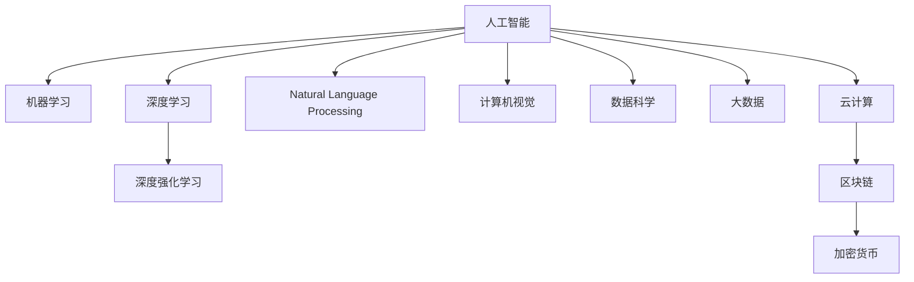

                 

# AI时代的程序员技能投资指南

> 关键词：人工智能,机器学习,深度学习,深度强化学习,自然语言处理,计算机视觉,数据科学,大数据,云计算,区块链,加密货币

## 1. 背景介绍

### 1.1 问题由来

在当今飞速发展的AI时代，技术创新日新月异，职业要求也快速变化。程序员作为软件和系统开发的关键群体，面临着前所未有的技能挑战。为了在激烈的竞争中保持优势，保持对新技术的敏感度和掌握，程序员必须持续投资学习和发展自己的技能。

### 1.2 问题核心关键点

本文旨在为程序员提供一份全面的技能投资指南，涵盖AI时代最前沿的技能领域，包括但不限于人工智能、机器学习、深度学习、深度强化学习、自然语言处理、计算机视觉、数据科学、大数据、云计算、区块链和加密货币等。

## 2. 核心概念与联系

### 2.1 核心概念概述

为帮助程序员更好地理解这些前沿技能，本节将介绍几个关键概念：

- **人工智能(AI)**：使用计算机系统和机器来模拟人类智能，涵盖感知、学习、推理、规划、自然语言理解、视觉识别等。
- **机器学习(ML)**：使机器从数据中学习并改进性能，主要包括监督学习、无监督学习和强化学习。
- **深度学习(Deep Learning)**：一种基于神经网络的技术，特别适用于处理非线性数据和大规模数据集。
- **深度强化学习(RL)**：通过与环境的交互，使智能体在特定任务中学习最优策略。
- **自然语言处理(NLP)**：使计算机能够理解和处理人类语言。
- **计算机视觉(CV)**：使计算机能够理解和解释视觉信息，如图像识别和视频分析。
- **数据科学(DS)**：应用统计学、数据挖掘和数据分析来提取数据中的知识和信息。
- **大数据(Big Data)**：处理、分析和利用大量数据的技术和工具。
- **云计算(Cloud Computing)**：通过互联网提供可扩展的计算资源。
- **区块链(Blockchain)**：一种去中心化的分布式账本技术，用于安全地存储和传输数据。
- **加密货币(CryptoCurrency)**：使用加密技术保护交易和控制货币供给的电子货币。

这些概念之间的逻辑关系可以通过以下Mermaid流程图来展示：



这个流程图展示了人工智能领域的核心概念及其之间的关系：

1. 人工智能通过机器学习、深度学习等子领域的技术手段，提升对数据和环境的理解能力。
2. 自然语言处理和计算机视觉是人工智能的重要组成部分，分别处理文本和视觉信息。
3. 数据科学、大数据和云计算为人工智能提供了数据和计算基础设施。
4. 区块链和加密货币为人工智能带来了新的应用方向和数据存储方式。

## 3. 核心算法原理 & 具体操作步骤
### 3.1 算法原理概述

AI时代程序员的技能投资主要集中在算法和技术领域，涉及数据预处理、模型训练、模型调优、模型应用等多个环节。以下是一些关键算法的原理概述：

- **监督学习**：通过给定输入和输出数据，训练模型从数据中学习映射关系，以预测新数据的输出。
- **无监督学习**：不依赖标注数据，通过数据自发出现的模式，学习数据的内在结构和特征。
- **强化学习**：通过与环境交互，让智能体在特定任务中学习最优策略，以最大化长期奖励。
- **卷积神经网络(CNN)**：一种专门处理网格状数据的神经网络，广泛应用于图像识别和计算机视觉。
- **循环神经网络(RNN)**：用于处理序列数据，如时间序列和自然语言。
- **长短期记忆网络(LSTM)**：一种特殊类型的RNN，能够处理长期依赖关系。
- **生成对抗网络(GAN)**：由生成器和判别器组成的网络，用于生成逼真且具有多样性的数据。

### 3.2 算法步骤详解

基于核心算法的理解和掌握，程序员可以通过以下步骤来进行技能投资：

**Step 1: 基础知识巩固**

1. 学习数学基础，包括线性代数、概率论和统计学。
2. 掌握编程语言，如Python、Java、C++等，并熟悉数据处理和机器学习库，如NumPy、Pandas、Scikit-learn、TensorFlow等。
3. 深入学习算法原理，了解监督学习、无监督学习、强化学习、CNN、RNN、LSTM、GAN等关键算法的实现机制。

**Step 2: 实践应用掌握**

1. 参与开源项目，实践常用算法的应用，如图像分类、文本生成、自然语言理解等。
2. 进行实验设计，实现自定义算法，解决实际问题。
3. 参加在线竞赛，如Kaggle、DrivenData等，提升算法应用能力。

**Step 3: 前沿技术跟踪**

1. 阅读相关论文和博客，了解最新的研究进展和技术动态。
2. 参加行业会议，如NeurIPS、ICML、CVPR等，拓展视野。
3. 加入专业社群，如GitHub、Stack Overflow、Reddit等，与其他专业人士交流。

**Step 4: 技能整合应用**

1. 应用所学知识，设计、开发和优化AI系统，提升业务效率和用户体验。
2. 探索新技术在特定领域的应用，如医疗、金融、教育等。
3. 持续迭代和优化，提升AI系统的稳定性和性能。

### 3.3 算法优缺点

基于核心算法的技能投资，程序员可以具备以下优点：

- **竞争力提升**：掌握前沿技术，能够在竞争中脱颖而出。
- **应用范围广**：能够灵活应用于各种AI和NLP应用，提升系统开发能力。
- **创新能力增强**：深入理解算法原理，能够提出创新的解决方案。

同时，也存在一些局限性：

- **学习难度大**：这些技能涉及大量数学和编程知识，需要较长时间学习和积累。
- **成本高**：可能需要投入大量时间、精力和资源进行学习和实验。
- **应用复杂性高**：实际应用中的问题复杂多样，需要灵活应对。

### 3.4 算法应用领域

这些技能在多个领域都有广泛应用，例如：

- **医疗健康**：使用AI进行疾病诊断、个性化治疗等。
- **金融服务**：使用机器学习进行风险评估、欺诈检测等。
- **智能制造**：使用计算机视觉进行质量检测、设备维护等。
- **电子商务**：使用推荐系统进行商品推荐、客户细分等。
- **自动驾驶**：使用深度学习进行图像识别、决策优化等。
- **智能家居**：使用自然语言处理进行语音交互、环境感知等。

## 4. 数学模型和公式 & 详细讲解 & 举例说明

### 4.1 数学模型构建

为了更好地理解AI时代程序员的技能投资，本节将介绍几个常用的数学模型：

- **线性回归模型**：用于预测连续变量，形式为$y = w_0 + w_1x_1 + w_2x_2 + ... + w_nx_n$。
- **逻辑回归模型**：用于二分类问题，形式为$\ln\frac{p(y=1)}{1-p(y=1)} = w_0 + w_1x_1 + w_2x_2 + ... + w_nx_n$。
- **卷积神经网络(CNN)**：用于图像识别，包含卷积层、池化层和全连接层。
- **循环神经网络(RNN)**：用于序列数据，如时间序列和自然语言。
- **长短期记忆网络(LSTM)**：一种特殊类型的RNN，包含输入门、遗忘门和输出门。

### 4.2 公式推导过程

以逻辑回归模型为例，我们推导其损失函数和梯度公式：

假设模型预测值为$\hat{y} = w_0 + w_1x_1 + w_2x_2 + ... + w_nx_n$，真实标签为$y \in \{0, 1\}$，则二分类交叉熵损失函数为：

$$
\mathcal{L}(w) = -\frac{1}{N}\sum_{i=1}^N [y_i\log \hat{y_i} + (1-y_i)\log(1-\hat{y_i})]
$$

根据梯度下降算法，更新参数$w_k$的公式为：

$$
w_k \leftarrow w_k - \eta \frac{\partial \mathcal{L}(w)}{\partial w_k}
$$

其中$\eta$为学习率，$\frac{\partial \mathcal{L}(w)}{\partial w_k}$为损失函数对$w_k$的梯度，可通过反向传播算法高效计算。

### 4.3 案例分析与讲解

以下给出逻辑回归模型在二分类问题中的案例分析：

**案例**：根据邮件内容预测是否为垃圾邮件。

- **数据集准备**：收集邮件数据集，标注是否为垃圾邮件。
- **模型构建**：使用逻辑回归模型，输入特征为邮件文本经过TF-IDF等技术提取的向量，输出为邮件是否为垃圾邮件的概率。
- **模型训练**：使用邮件数据集训练逻辑回归模型，最小化交叉熵损失。
- **模型评估**：使用测试集评估模型性能，计算准确率、召回率、F1值等指标。

## 5. 项目实践：代码实例和详细解释说明

### 5.1 开发环境搭建

在进行技能投资和项目实践前，我们需要准备好开发环境。以下是使用Python进行PyTorch开发的指南：

1. 安装Anaconda：从官网下载并安装Anaconda，用于创建独立的Python环境。
2. 创建并激活虚拟环境：
```bash
conda create -n pytorch-env python=3.8 
conda activate pytorch-env
```

3. 安装PyTorch：根据CUDA版本，从官网获取对应的安装命令。例如：
```bash
conda install pytorch torchvision torchaudio cudatoolkit=11.1 -c pytorch -c conda-forge
```

4. 安装Transformers库：
```bash
pip install transformers
```

5. 安装各类工具包：
```bash
pip install numpy pandas scikit-learn matplotlib tqdm jupyter notebook ipython
```

完成上述步骤后，即可在`pytorch-env`环境中进行技能投资和项目实践。

### 5.2 源代码详细实现

以下以图像分类任务为例，给出使用PyTorch实现卷积神经网络(CNN)的代码实现：

```python
import torch
import torch.nn as nn
import torch.optim as optim
import torchvision.transforms as transforms
from torchvision import datasets

# 数据集加载
transform = transforms.Compose([
    transforms.ToTensor(),
    transforms.Normalize((0.5, 0.5, 0.5), (0.5, 0.5, 0.5))
])

trainset = datasets.CIFAR10(root='./data', train=True, download=True, transform=transform)
trainloader = torch.utils.data.DataLoader(trainset, batch_size=4, shuffle=True, num_workers=2)

testset = datasets.CIFAR10(root='./data', train=False, download=True, transform=transform)
testloader = torch.utils.data.DataLoader(testset, batch_size=4, shuffle=False, num_workers=2)

# 定义模型
class Net(nn.Module):
    def __init__(self):
        super(Net, self).__init__()
        self.conv1 = nn.Conv2d(3, 6, 5)
        self.pool = nn.MaxPool2d(2, 2)
        self.conv2 = nn.Conv2d(6, 16, 5)
        self.fc1 = nn.Linear(16 * 5 * 5, 120)
        self.fc2 = nn.Linear(120, 84)
        self.fc3 = nn.Linear(84, 10)

    def forward(self, x):
        x = self.pool(F.relu(self.conv1(x)))
        x = self.pool(F.relu(self.conv2(x)))
        x = x.view(-1, 16 * 5 * 5)
        x = F.relu(self.fc1(x))
        x = F.relu(self.fc2(x))
        x = self.fc3(x)
        return x

# 定义优化器和损失函数
net = Net()
criterion = nn.CrossEntropyLoss()
optimizer = optim.SGD(net.parameters(), lr=0.001, momentum=0.9)

# 训练模型
for epoch in range(2):  # 多次遍历训练集
    running_loss = 0.0
    for i, data in enumerate(trainloader, 0):
        inputs, labels = data
        optimizer.zero_grad()
        outputs = net(inputs)
        loss = criterion(outputs, labels)
        loss.backward()
        optimizer.step()
        running_loss += loss.item()
        if i % 2000 == 1999:
            print('[%d, %5d] loss: %.3f' %
                  (epoch + 1, i + 1, running_loss / 2000))
            running_loss = 0.0

print('Finished Training')
```

### 5.3 代码解读与分析

让我们再详细解读一下关键代码的实现细节：

**CNN模型**：
- `Net`类定义了卷积神经网络的结构，包括卷积层、池化层和全连接层。
- `forward`方法实现了模型的前向传播过程。

**数据集加载**：
- `transform`定义了数据的预处理步骤，包括转换为Tensor和归一化。
- `CIFAR10`类用于加载CIFAR-10数据集，并进行批处理和随机打乱。

**训练过程**：
- `for`循环遍历训练集，每次迭代在`trainloader`上取数据。
- `optimizer.zero_grad()`清除了前一梯度的影响。
- `outputs = net(inputs)`计算模型输出。
- `loss = criterion(outputs, labels)`计算损失。
- `loss.backward()`计算梯度。
- `optimizer.step()`更新模型参数。
- `running_loss += loss.item()`计算损失总和。

## 6. 实际应用场景

### 6.1 智能客服系统

基于CNN和RNN等技能的智能客服系统，可以广泛应用于客户服务。传统客服往往需要配备大量人力，高峰期响应缓慢，且一致性和专业性难以保证。使用微调后的模型，可以24小时不间断服务，快速响应客户咨询，用自然流畅的语言解答各类常见问题。

### 6.2 金融舆情监测

金融机构需要实时监测市场舆论动向，以便及时应对负面信息传播，规避金融风险。传统的人工监测方式成本高、效率低，难以应对网络时代海量信息爆发的挑战。使用基于CNN和RNN等技能的文本分类和情感分析技术，可以为金融舆情监测提供新的解决方案。

### 6.3 个性化推荐系统

当前的推荐系统往往只依赖用户的历史行为数据进行物品推荐，无法深入理解用户的真实兴趣偏好。使用基于CNN和LSTM等技能的个性化推荐系统，可以更好地挖掘用户行为背后的语义信息，从而提供更精准、多样的推荐内容。

### 6.4 未来应用展望

随着技能投资的不断深入，基于AI时代程序员的技能在更多领域得到应用，为传统行业带来变革性影响。

- **智慧医疗**：使用AI进行疾病诊断、个性化治疗等。
- **智能制造**：使用计算机视觉进行质量检测、设备维护等。
- **自动驾驶**：使用深度学习进行图像识别、决策优化等。
- **智能家居**：使用自然语言处理进行语音交互、环境感知等。

## 7. 工具和资源推荐

### 7.1 学习资源推荐

为了帮助程序员系统掌握AI时代的前沿技能，这里推荐一些优质的学习资源：

1. **《深度学习》课程**：斯坦福大学开设的深度学习课程，涵盖深度学习的理论和实践，适合入门和进阶学习。
2. **Kaggle竞赛**：通过参与Kaggle竞赛，提升算法应用能力和数据处理技能。
3. **GitHub**：查找开源项目和代码，学习其他程序员的实践经验。
4. **Coursera**：提供AI、机器学习和深度学习领域的在线课程，涵盖基础知识和高级内容。
5. **ArXiv**：阅读最新论文和技术报告，了解研究进展。

### 7.2 开发工具推荐

高效的开发离不开优秀的工具支持。以下是几款用于技能投资和项目开发的常用工具：

1. **PyTorch**：基于Python的开源深度学习框架，灵活动态的计算图，适合快速迭代研究。
2. **TensorFlow**：由Google主导开发的开源深度学习框架，生产部署方便，适合大规模工程应用。
3. **Jupyter Notebook**：交互式编程环境，适合数据分析和实验记录。
4. **Git**：版本控制工具，用于协作开发和代码版本管理。
5. **Docker**：容器化平台，方便部署和迁移应用。

### 7.3 相关论文推荐

AI时代程序员的技能投资源于学界的持续研究。以下是几篇奠基性的相关论文，推荐阅读：

1. **《ImageNet Classification with Deep Convolutional Neural Networks》**：提出卷积神经网络在图像分类中的应用，奠定了计算机视觉的基础。
2. **《Natural Language Processing (almost) for Free: Unsupervised Pre-training and Transfer Learning》**：展示无监督预训练在自然语言处理中的巨大潜力。
3. **《Playing Atari with Deep Reinforcement Learning》**：展示深度强化学习在智能游戏中的应用，引发了对于AI游戏的热议。
4. **《Large-Scale Deep Learning with GPUs》**：讨论GPU加速深度学习模型的训练和推理，为大规模AI应用提供了技术支持。

## 8. 总结：未来发展趋势与挑战

### 8.1 总结

本文对AI时代程序员的技能投资进行了全面系统的介绍。首先阐述了技能投资的重要性，明确了技能投资的方向和内容。其次，从原理到实践，详细讲解了AI和NLP等前沿技能的数学模型和实现方法，给出了代码实例和详细解释。同时，本文还广泛探讨了这些技能在金融、医疗、制造等多个行业领域的应用前景，展示了技能投资的巨大潜力。最后，本文精选了技能投资的各类学习资源，力求为程序员提供全方位的技术指引。

通过本文的系统梳理，可以看到，AI时代程序员的技能投资是一项复杂而全面的任务，需要掌握从数学基础到技术实现的各个环节。掌握这些技能，程序员可以在不断变化的技术环境中保持竞争力，引领AI技术的发展。

### 8.2 未来发展趋势

展望未来，AI时代程序员的技能投资将呈现以下几个发展趋势：

1. **多领域融合**：技能投资将不再是单一领域的深入，而是多领域的跨学科融合，如AI与区块链、加密货币的结合。
2. **跨学科学习**：未来程序员将需要更多跨学科的学习，如AI与心理学、生物学等领域的交叉，提升系统的智能化和人性化。
3. **伦理和安全**：技能投资将更加关注伦理和安全问题，如AI系统的偏见、隐私保护等。
4. **自动化和智能化**：技能投资将更多地利用自动化工具和智能化技术，提升开发效率和系统性能。
5. **数据和算法透明**：技能投资将更加重视数据和算法的透明性，提升系统的可解释性和可审计性。

### 8.3 面临的挑战

尽管AI时代程序员的技能投资前景广阔，但在迈向更加智能化、普适化应用的过程中，仍面临诸多挑战：

1. **技术快速变化**：新技术不断涌现，要求程序员持续学习，保持对前沿技术的敏感性。
2. **资源限制**：技能投资需要大量时间、精力和资源，对个人和组织都是不小的负担。
3. **应用复杂性**：AI系统的开发和应用往往涉及多个领域，需要跨学科的知识和技能。
4. **伦理和安全问题**：AI系统可能会带来伦理和法律上的挑战，如偏见、隐私等。

### 8.4 研究展望

面对AI时代程序员技能投资的挑战，未来的研究需要在以下几个方面寻求新的突破：

1. **自动学习和迁移学习**：研究如何让模型自动学习和迁移，减少对大量标注数据的依赖。
2. **模型压缩和优化**：研究如何优化模型结构和参数，提升推理速度和资源利用率。
3. **模型解释和可解释性**：研究如何让AI系统具有更好的可解释性，提升系统的透明性和可信度。
4. **跨领域协同**：研究如何实现跨学科的协同创新，提升系统的智能化和人性化。

这些研究方向的探索，必将引领AI时代程序员的技能投资走向新的高度，为构建智能人机交互系统提供新的思路和方法。

## 9. 附录：常见问题与解答

**Q1：如何选择适合自己的学习资源？**

A: 选择适合自己的学习资源，需要考虑以下几个方面：
1. **内容深度**：选择深度适中的资源，避免过于基础或过于复杂。
2. **应用场景**：选择与应用场景相关的资源，如医疗AI、金融AI等。
3. **学习风格**：选择适合自己的学习方式，如视频课程、在线书籍等。

**Q2：如何平衡学习与工作？**

A: 平衡学习与工作，需要合理规划时间和精力。可以采取以下策略：
1. **分阶段学习**：将学习任务分解为多个阶段，逐步完成。
2. **利用碎片时间**：在工作间隙利用碎片时间进行学习，如通勤、午休等。
3. **设置学习目标**：设定明确的学习目标，逐步实现。
4. **寻求学习伙伴**：与其他学习者互相激励，共同进步。

**Q3：如何选择适合的技能投资方向？**

A: 选择适合的技能投资方向，需要考虑以下几个方面：
1. **兴趣和优势**：选择自己感兴趣和有优势的技能，提升学习动力和效果。
2. **市场需求**：选择市场需求大的技能，确保投资有回报。
3. **技术趋势**：选择具有良好发展前景的技术，如AI、机器学习等。

**Q4：如何应对技能投资的挑战？**

A: 应对技能投资的挑战，需要采取以下策略：
1. **持续学习**：保持持续学习和更新，跟上技术发展。
2. **资源整合**：合理整合资源，如时间、资金、人力等，提升投资效率。
3. **跨学科合作**：与其他学科的专业人士合作，提升系统综合能力。
4. **伦理和安全**：在技能投资中注重伦理和安全问题，确保系统的可信度和透明性。

---

作者：禅与计算机程序设计艺术 / Zen and the Art of Computer Programming

