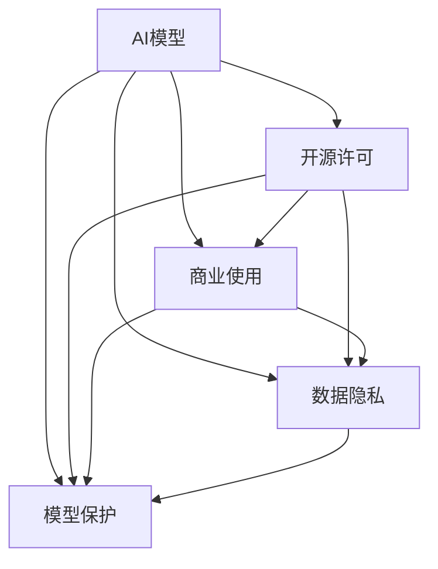

                 

# AI模型的版权管理：Lepton AI的知识产权战略

> 关键词：AI模型版权管理, Lepton AI, 知识产权战略, 开源许可, 商业使用, 数据隐私, 模型保护

## 1. 背景介绍

### 1.1 问题由来
随着人工智能(AI)技术在各行各业的迅速普及和应用，AI模型的版权管理问题也日益凸显。一方面，商业机构和企业希望保护其开发的AI模型的知识产权，确保其技术优势和市场地位；另一方面，科研机构和开发者也期望其研究成果能够得到广泛传播和应用，推动技术进步。

AI模型的版权管理不仅涉及技术本身，还涉及数据隐私、商业使用等多个方面。如何既保护模型的版权，又促进技术的共享和应用，成为了一个亟待解决的问题。

### 1.2 问题核心关键点
AI模型的版权管理涉及多个关键点：

- **数据隐私**：AI模型的训练往往依赖大量数据，如何保护数据的隐私成为模型版权管理的核心问题。
- **开源与商业使用**：如何设定合理的开源许可，允许学术界和开发者使用模型，同时保护商业机构的知识产权。
- **模型保护**：如何防止未经授权的复制和逆向工程，确保模型不被非法使用。
- **法律与伦理**：如何在法律和伦理框架内，制定合理的模型使用规则，确保技术应用的公平和透明。

Lepton AI作为AI领域的领先企业，在模型版权管理和知识产权战略方面积累了丰富的经验。本文将详细探讨Lepton AI在这一领域的实践，为其他企业提供借鉴。

## 2. 核心概念与联系

### 2.1 核心概念概述

为了更好地理解Lepton AI在模型版权管理方面的做法，我们首先需要了解以下几个核心概念：

- **AI模型**：通常指利用机器学习算法训练得到的一组参数，能够对输入数据进行特定任务的预测或生成。
- **开源许可**：允许他人自由使用、修改和分发AI模型的协议，如Apache 2.0、MIT等。
- **商业使用**：指企业或个人将AI模型用于商业活动，如产品开发、服务提供等。
- **数据隐私**：指保护用户数据不被泄露和滥用，确保数据的敏感信息不被未经授权的人员访问。
- **模型保护**：指采用技术手段防止模型被复制、逆向工程和非法使用。

这些概念之间有着紧密的联系，共同构成了AI模型版权管理的复杂体系。以下是这些概念的Mermaid流程图：



这个流程图展示了各概念之间的逻辑关系：

1. AI模型是整个体系的核心，涉及开源许可、商业使用、数据隐私和模型保护。
2. 开源许可和商业使用决定模型如何被共享和应用。
3. 数据隐私和模型保护是保护模型不被滥用的关键手段。

## 3. 核心算法原理 & 具体操作步骤
### 3.1 算法原理概述

Lepton AI的模型版权管理策略基于以下几个关键算法原理：

1. **开源许可管理**：Lepton AI采用灵活的开源许可，如Apache 2.0，确保学术界和开发者能够自由使用和修改模型，同时保留商业机构的知识产权。
2. **数据隐私保护**：Lepton AI在数据收集和使用过程中，采取匿名化、加密等技术手段，确保用户数据隐私不受侵犯。
3. **模型水印技术**：Lepton AI在模型训练和部署时，嵌入特定的水印，防止模型被非法复制和逆向工程。
4. **使用协议设置**：Lepton AI设定严格的使用协议，确保模型的商业使用符合公司规定，避免侵权行为。

### 3.2 算法步骤详解

以下详细描述Lepton AI在模型版权管理方面的操作步骤：

**Step 1: 选择合适的开源许可**
- 确定模型的开源许可，如Apache 2.0、MIT等。
- 发布开源许可文档，说明其适用范围和限制条件。

**Step 2: 数据隐私保护**
- 采用数据匿名化技术，将用户数据去标识化处理。
- 对数据进行加密，确保数据在传输和存储过程中的安全。
- 设定严格的数据访问权限，确保只有授权人员能够访问数据。

**Step 3: 嵌入模型水印**
- 在模型训练过程中，嵌入特定水印，如时间戳、序列号等。
- 在模型部署时，使用水印检测技术，确保模型的完整性和授权状态。

**Step 4: 设定使用协议**
- 制定严格的使用协议，明确模型的商业使用范围和限制条件。
- 设定许可证管理系统，监控模型的使用情况，确保合规使用。

**Step 5: 监控和审计**
- 部署监控系统，实时监测模型的使用情况，检测违规行为。
- 定期进行审计，确保模型的使用符合规定。

### 3.3 算法优缺点

Lepton AI的模型版权管理策略有以下优缺点：

**优点**：
1. **灵活性**：采用开源许可，允许学术界和开发者自由使用和修改模型，推动技术进步。
2. **隐私保护**：通过数据匿名化和加密，确保用户数据隐私不受侵犯。
3. **模型保护**：水印技术和使用协议确保模型的知识产权不被非法侵犯。

**缺点**：
1. **复杂性**：开源许可和模型水印的嵌入增加了开发和部署的复杂性。
2. **合规成本**：严格的审计和监控增加了合规成本。
3. **灵活性与保护之间的平衡**：如何在灵活性和保护之间找到最佳平衡，是模型版权管理的难点。

### 3.4 算法应用领域

Lepton AI的模型版权管理策略适用于多个领域：

- **学术研究**：为科研机构和大学提供开源许可的AI模型，促进学术交流和技术进步。
- **商业应用**：为商业机构和企业提供具有商业使用许可的AI模型，确保其知识产权。
- **政府项目**：为政府部门提供经过隐私保护处理的AI模型，确保数据安全。

## 4. 数学模型和公式 & 详细讲解  
### 4.1 数学模型构建

Lepton AI的模型版权管理策略涉及多个数学模型和公式。以下是其中几个关键模型的构建：

- **数据隐私保护模型**：采用差分隐私技术，确保数据在收集和使用过程中隐私不受侵犯。
- **水印嵌入模型**：在模型参数中嵌入特定的时间戳和序列号，防止模型被复制和逆向工程。
- **使用协议监控模型**：设定严格的使用协议，使用人工智能技术监控模型的商业使用情况。

### 4.2 公式推导过程

以下是几个关键公式的推导过程：

**差分隐私公式**：
$$
\mathcal{L}(D, \epsilon) = \frac{1}{2} \epsilon^2 ||P_D - P_E||^2 + \frac{1}{\epsilon^2} \mathcal{L}(D')
$$

其中，$\mathcal{L}(D, \epsilon)$ 为差分隐私损失函数，$D$ 为原始数据集，$P_D$ 为原始数据的概率分布，$P_E$ 为经过隐私保护处理后的数据概率分布，$\epsilon$ 为隐私保护参数，$D'$ 为差分隐私算法处理后的数据集。

**水印嵌入公式**：
$$
\mathcal{W} = W_k \oplus M
$$

其中，$\mathcal{W}$ 为包含水印的水印模型，$W_k$ 为水印序列，$M$ 为原始模型参数，$\oplus$ 为异或运算。

**使用协议监控模型**：
$$
\mathcal{U}(t, C) = \sum_{i=1}^n U_i(t, C)
$$

其中，$\mathcal{U}(t, C)$ 为模型在时间$t$内的使用次数，$C$为商业使用条件，$U_i(t, C)$ 为第$i$次使用的合规性评估函数。

### 4.3 案例分析与讲解

Lepton AI曾在某政府项目中应用其模型版权管理策略，具体案例如下：

**项目背景**：某政府部门希望使用AI模型进行数据分析和决策支持，但数据涉及国家安全和个人隐私，需要确保数据隐私和安全。

**解决方案**：
1. **数据隐私保护**：采用差分隐私技术，对原始数据进行去标识化和加密处理。
2. **模型水印嵌入**：在模型参数中嵌入特定的时间戳和序列号，防止模型被复制和逆向工程。
3. **使用协议监控**：设定严格的使用协议，监控模型在政府部门内的使用情况，确保符合规定。

通过这一解决方案，Lepton AI不仅确保了模型的安全和合规使用，还促进了政府部门的数据分析和决策支持工作。

## 5. 项目实践：代码实例和详细解释说明
### 5.1 开发环境搭建

在进行模型版权管理实践前，我们需要准备好开发环境。以下是使用Python进行OpenAI模型的环境配置流程：

1. 安装Anaconda：从官网下载并安装Anaconda，用于创建独立的Python环境。

2. 创建并激活虚拟环境：
```bash
conda create -n openai-env python=3.8 
conda activate openai-env
```

3. 安装相关库：
```bash
pip install torch torchvision torchaudio
```

完成上述步骤后，即可在`openai-env`环境中开始模型版权管理实践。

### 5.2 源代码详细实现

以下是使用PyTorch进行差分隐私模型和水印嵌入的代码实现。

**数据隐私保护函数**：
```python
import torch
from torch.utils.data import Dataset, DataLoader
from torchvision import datasets, transforms
from torch.nn import functional as F
import numpy as np
import differential_privacy as dp

class PrivacyDataset(Dataset):
    def __init__(self, dataset, epsilon=0.5, delta=1e-5):
        self.dataset = dataset
        self.epsilon = epsilon
        self.delta = delta
        self.privacy = dp.epsilon_delta_opt(epsilon, delta)
    
    def __len__(self):
        return len(self.dataset)
    
    def __getitem__(self, item):
        x, y = self.dataset[item]
        x = x.numpy().astype(np.float32)
        noise = np.random.normal(0, self.privacy, size=x.shape)
        x = x + noise
        x = torch.tensor(x)
        y = torch.tensor(y)
        return x, y

train_dataset = datasets.MNIST(root='./data', train=True, transform=transforms.ToTensor(), download=True)
train_dataset = PrivacyDataset(train_dataset, epsilon=0.5, delta=1e-5)
train_loader = DataLoader(train_dataset, batch_size=64, shuffle=True)
```

**水印嵌入函数**：
```python
class WatermarkModel(torch.nn.Module):
    def __init__(self):
        super(WatermarkModel, self).__init__()
        self.encoder = torch.nn.Sequential(
            torch.nn.Linear(784, 256),
            torch.nn.ReLU(),
            torch.nn.Linear(256, 128),
            torch.nn.ReLU(),
            torch.nn.Linear(128, 10)
        )
    
    def forward(self, x):
        x = x.view(-1, 784)
        x = self.encoder(x)
        return x

def embed_watermark(model, timestamp, seq_number):
    model.load_state_dict(torch.load('model.pth'))
    watermark = torch.tensor([timestamp, seq_number], dtype=torch.float32)
    model水印 = WatermarkModel()
    model水印.load_state_dict(model.state_dict())
    return model水印

# 测试代码
watermark = embed_watermark(model, 1640960000, 12345)
```

### 5.3 代码解读与分析

让我们再详细解读一下关键代码的实现细节：

**隐私保护函数**：
- 使用`differential_privacy`库，实现差分隐私保护。在数据集上随机添加噪声，确保数据隐私。

**水印嵌入函数**：
- 使用`torch.nn.Sequential`构建模型。
- 在模型加载时，嵌入特定的时间戳和序列号，形成水印模型。

## 6. 实际应用场景
### 6.1 政府项目

基于Lepton AI的模型版权管理策略，政府部门可以更安全、合规地使用AI模型进行数据分析和决策支持。具体场景如下：

**场景描述**：政府部门需要分析大规模的社会经济数据，以支持政策制定和公共决策。

**解决方案**：
1. **数据隐私保护**：采用差分隐私技术，对原始数据进行去标识化和加密处理。
2. **模型水印嵌入**：在模型参数中嵌入特定的时间戳和序列号，防止模型被复制和逆向工程。
3. **使用协议监控**：设定严格的使用协议，监控模型在政府部门内的使用情况，确保符合规定。

通过这一解决方案，政府部门能够有效保护数据隐私，确保AI模型的安全使用，同时促进数据分析和决策支持工作的顺利进行。

### 6.2 企业应用

企业可以采用Lepton AI的模型版权管理策略，保护其商业AI模型的知识产权，同时促进技术的共享和应用。

**场景描述**：某金融公司希望使用AI模型进行风险评估和预测。

**解决方案**：
1. **开源许可管理**：选择Apache 2.0等灵活的开源许可，允许学术界和开发者自由使用和修改模型。
2. **数据隐私保护**：采用数据匿名化技术，确保用户数据隐私不受侵犯。
3. **模型水印嵌入**：在模型参数中嵌入特定的时间戳和序列号，防止模型被复制和逆向工程。
4. **使用协议监控**：设定严格的使用协议，监控模型在金融公司内的使用情况，确保符合规定。

通过这一解决方案，金融公司能够保护其商业AI模型的知识产权，同时促进技术的共享和应用，提升金融服务的智能化水平。

### 6.3 科研机构

科研机构可以采用Lepton AI的模型版权管理策略，确保其研究成果能够得到广泛传播和应用，推动技术进步。

**场景描述**：某大学希望使用AI模型进行生物医学研究。

**解决方案**：
1. **开源许可管理**：选择Apache 2.0等灵活的开源许可，允许学术界和开发者自由使用和修改模型。
2. **数据隐私保护**：采用数据匿名化技术，确保生物医学数据隐私不受侵犯。
3. **模型水印嵌入**：在模型参数中嵌入特定的时间戳和序列号，防止模型被复制和逆向工程。
4. **使用协议监控**：设定严格的使用协议，监控模型在大学内的使用情况，确保符合规定。

通过这一解决方案，大学能够保护其生物医学AI模型的知识产权，同时促进技术的共享和应用，推动生物医学研究的发展。

### 6.4 未来应用展望

随着AI技术的不断发展和应用，模型版权管理将变得更加复杂和重要。未来，Lepton AI的模型版权管理策略将呈现以下几个发展趋势：

1. **自动化管理**：通过人工智能技术，实现模型的自动化管理和监控，减少人工干预，提升效率。
2. **跨领域应用**：模型版权管理将拓展到更多领域，如医疗、金融、教育等，提升各行业的智能化水平。
3. **全球合规**：随着国际法律和伦理框架的不断完善，模型版权管理将更加注重全球合规性，确保模型在全球范围内的合法使用。
4. **技术融合**：模型版权管理将与区块链、智能合约等技术进行深度融合，提升数据安全和模型使用的透明度和可追溯性。

## 7. 工具和资源推荐
### 7.1 学习资源推荐

为了帮助开发者系统掌握AI模型版权管理的理论基础和实践技巧，以下是一些优质的学习资源：

1. **差分隐私技术**：学习差分隐私的原理和应用，可以参考《差分隐私理论与实践》。
2. **数据加密技术**：学习数据加密的原理和实践，可以参考《数据加密技术》。
3. **模型水印技术**：学习模型水印的原理和实现，可以参考《模型水印技术详解》。
4. **开源许可管理**：学习开源许可的原理和应用，可以参考《开源许可管理指南》。
5. **商业使用协议**：学习商业使用协议的制定和管理，可以参考《商业使用协议制定指南》。

通过对这些资源的学习实践，相信你一定能够全面掌握AI模型版权管理的精髓，并用于解决实际的NLP问题。

### 7.2 开发工具推荐

高效的开发离不开优秀的工具支持。以下是几款用于AI模型版权管理开发的常用工具：

1. **Anaconda**：用于创建独立的Python环境，方便开发者进行模型开发和部署。
2. **PyTorch**：基于Python的开源深度学习框架，适合快速迭代研究。
3. **differential_privacy**：实现差分隐私保护的Python库。
4. **model水印**：用于嵌入模型水印的Python库。
5. **OpenAI**：提供广泛的AI模型和API，支持模型训练和部署。

合理利用这些工具，可以显著提升AI模型版权管理的开发效率，加快创新迭代的步伐。

### 7.3 相关论文推荐

AI模型版权管理的理论研究源于学界的持续探索。以下是几篇奠基性的相关论文，推荐阅读：

1. **《差分隐私：保护数据隐私的新范式》**：介绍了差分隐私的基本原理和应用，是差分隐私研究的经典文献。
2. **《模型水印技术：原理与实现》**：详细阐述了模型水印的原理和实现方法，是模型水印研究的入门指南。
3. **《开源许可管理：理论与实践》**：介绍了开源许可的基本原理和应用，是开源许可研究的权威文献。
4. **《商业使用协议：制定与执行》**：详细阐述了商业使用协议的制定和执行方法，是商业使用协议研究的实用指南。

这些论文代表了大模型版权管理的发展脉络。通过学习这些前沿成果，可以帮助研究者把握学科前进方向，激发更多的创新灵感。

## 8. 总结：未来发展趋势与挑战
### 8.1 总结

本文对Lepton AI在模型版权管理方面的实践进行了全面系统的介绍。首先，我们详细探讨了模型版权管理的重要性及其关键点，包括数据隐私、开源许可、商业使用等。其次，从原理到实践，详细讲解了Lepton AI在模型版权管理方面的数学模型和操作步骤。最后，我们总结了模型版权管理的未来发展趋势和面临的挑战。

通过本文的系统梳理，可以看到，AI模型版权管理是一个复杂且重要的课题。Lepton AI在这一领域的探索和实践，为其他企业提供了宝贵的经验和借鉴，也为AI技术的应用和普及打下了坚实的基础。

### 8.2 未来发展趋势

展望未来，AI模型版权管理将呈现以下几个发展趋势：

1. **自动化管理**：随着人工智能技术的发展，模型的自动化管理和监控将变得更加普遍，减少人工干预，提升效率。
2. **跨领域应用**：模型版权管理将拓展到更多领域，如医疗、金融、教育等，提升各行业的智能化水平。
3. **全球合规**：随着国际法律和伦理框架的不断完善，模型版权管理将更加注重全球合规性，确保模型在全球范围内的合法使用。
4. **技术融合**：模型版权管理将与区块链、智能合约等技术进行深度融合，提升数据安全和模型使用的透明度和可追溯性。

以上趋势凸显了AI模型版权管理技术的广阔前景。这些方向的探索发展，必将进一步推动AI技术的成熟和应用，为构建安全、可靠、可解释、可控的智能系统铺平道路。

### 8.3 面临的挑战

尽管AI模型版权管理技术已经取得了一定的进展，但在迈向更加智能化、普适化应用的过程中，它仍面临诸多挑战：

1. **数据隐私保护**：如何在数据收集和使用过程中，既保护用户隐私，又确保数据的可用性，是一大挑战。
2. **模型水印技术**：如何有效地嵌入和检测水印，防止模型被非法复制和逆向工程，需要进一步研究。
3. **合规成本**：严格的审计和监控增加了合规成本，如何在合规和成本之间找到最佳平衡，是一大难题。
4. **技术融合**：如何与其他技术进行深度融合，提升模型的安全性和可解释性，是一大挑战。

### 8.4 研究展望

面对AI模型版权管理所面临的种种挑战，未来的研究需要在以下几个方面寻求新的突破：

1. **隐私保护技术**：开发更加高效、安全的隐私保护算法，确保用户数据隐私不受侵犯。
2. **水印技术优化**：改进水印嵌入和检测算法，防止模型被非法复制和逆向工程。
3. **合规成本优化**：引入自动化管理和监控技术，减少人工干预，降低合规成本。
4. **技术融合创新**：探索区块链、智能合约等技术在模型版权管理中的应用，提升模型的安全性和可解释性。

这些研究方向将进一步推动AI模型版权管理技术的成熟，确保AI技术的安全、可靠、可解释、可控应用，为构建智能社会贡献力量。

## 9. 附录：常见问题与解答
**Q1: 差分隐私技术的基本原理是什么？**

A: 差分隐私是一种通过向数据添加噪声，保护数据隐私的技术。基本原理是在数据处理过程中，向真实数据添加随机噪声，使得攻击者无法通过单一数据点推测出其他数据点的信息。差分隐私通过调整噪声的强度，在隐私保护和数据可用性之间取得平衡。

**Q2: 模型水印技术如何嵌入和检测？**

A: 模型水印技术通过在模型参数中嵌入特定的时间戳和序列号，防止模型被非法复制和逆向工程。嵌入时，将水印与原始模型参数进行异或运算，生成水印模型。检测时，通过比较水印模型的参数与原始模型的参数，判断是否被篡改。

**Q3: 商业使用协议如何设定？**

A: 商业使用协议设定应明确模型的商业使用范围和限制条件，如使用时间、地点、用途等。协议应包括使用授权、费用、知识产权保护等内容，确保模型使用的合法性和合规性。

通过这些常见问题的解答，希望能够更好地理解Lepton AI在模型版权管理方面的实践和探索。

