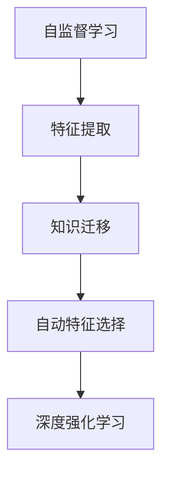

                 

# AI模型的跨域学习：Lepton AI的知识迁移

> 关键词：AI跨域迁移、Lepton AI、知识迁移、自监督学习、自动特征选择、深度强化学习

## 1. 背景介绍

在人工智能(AI)领域，模型迁移(Transfer Learning)是提升模型泛化能力和泛用性的重要手段。跨域迁移(Cross-Domain Transfer Learning)是指将一个领域学到的知识迁移到另一个领域，从而在新的领域中实现高性能的模型应用。这一方法在AI技术的应用中尤为关键，特别是在数据稀缺且难以获取的场景下。

近年来，人工智能领域的最新突破之一便是Lepton AI，这是IBM推出的一种革命性的跨域迁移学习算法。Lepton AI不仅能够实现知识的高效迁移，还能自动选择并优化特征，极大地降低了迁移学习中的数据需求，并提升模型在新领域中的适应能力。

本文章将详细解析Lepton AI的原理，探讨其核心算法、具体操作步骤以及实际应用场景，为读者提供全面深入的了解。

## 2. 核心概念与联系

### 2.1 核心概念概述

要理解Lepton AI的跨域迁移学习，首先需要了解以下几个核心概念：

1. **跨域迁移学习**：将一个领域学到的知识迁移到另一个领域。通常用于数据稀缺的新领域，以提升模型在新领域中的性能。

2. **知识迁移**：将源领域的知识转移到目标领域，帮助目标领域获得更好的性能。知识迁移可以是显性的（如微调）也可以是隐性的（如特征提取）。

3. **自监督学习**：利用无标签数据进行训练，学习模型的高层次表示，从而在新的领域中更好地泛化。

4. **自动特征选择**：通过算法自动选择对目标任务最重要的特征，提高模型的泛化能力。

5. **深度强化学习**：通过与环境的互动学习最优策略，优化模型在新领域中的行为。

### 2.2 核心概念原理和架构的 Mermaid 流程图



在Lepton AI中，自监督学习用于特征提取，知识迁移用于提高在新领域的泛化能力，自动特征选择用于优化特征选择过程，深度强化学习用于提升模型在新领域的行为表现。

## 3. 核心算法原理 & 具体操作步骤

### 3.1 算法原理概述

Lepton AI的跨域迁移学习主要包括以下几个关键步骤：

1. **自监督学习特征提取**：利用源领域的大量无标签数据进行自监督学习，学习高层次的特征表示。
2. **知识迁移**：将源领域学到的高层次特征迁移到目标领域，帮助目标领域提升模型性能。
3. **自动特征选择**：根据目标领域的标签数据，自动选择对目标任务最重要的特征，进一步优化模型性能。
4. **深度强化学习**：通过与环境的互动，进一步优化模型在新领域中的行为表现。

Lepton AI的核心算法原理基于知识迁移和自动特征选择，通过这些技术实现了跨域迁移学习的自动化和高效化。

### 3.2 算法步骤详解

#### 3.2.1 自监督学习特征提取

在Lepton AI中，自监督学习用于特征提取，利用源领域的大量无标签数据进行学习。具体步骤如下：

1. **数据准备**：准备源领域的无标签数据，可以是图像、文本、音频等多种类型的数据。
2. **特征提取**：通过自监督学习算法（如CPC、VAE等）对数据进行特征提取，学习高层次的特征表示。
3. **特征表示**：将提取的特征表示用于目标领域的迁移学习。

#### 3.2.2 知识迁移

知识迁移是将源领域学到的高层次特征迁移到目标领域的过程。具体步骤如下：

1. **特征映射**：将源领域的特征表示映射到目标领域的特征空间中，使得源领域的特征能够在新领域中有效利用。
2. **模型微调**：在目标领域上，对迁移后的模型进行微调，进一步优化模型性能。

#### 3.2.3 自动特征选择

自动特征选择是Lepton AI中的重要环节，它通过算法自动选择对目标任务最重要的特征，进一步优化模型性能。具体步骤如下：

1. **特征重要性评估**：利用机器学习算法（如Lasso、随机森林等）对特征进行重要性评估。
2. **特征选择**：根据评估结果，选择对目标任务最重要的特征，去除冗余特征。
3. **特征优化**：对选择的特征进行优化，如使用PCA、ICA等算法进行降维和优化。

#### 3.2.4 深度强化学习

深度强化学习用于进一步提升模型在新领域中的行为表现。具体步骤如下：

1. **环境交互**：将模型置于目标领域的环境中，进行交互学习。
2. **策略优化**：利用强化学习算法（如Q-learning、SARSA等）优化模型行为策略。
3. **策略评估**：通过评估指标（如奖励、损失等）评估策略效果。

### 3.3 算法优缺点

Lepton AI的跨域迁移学习算法具有以下优点：

1. **高效性**：利用自监督学习和自动特征选择，显著降低了目标领域数据的需求，提高了迁移效率。
2. **泛化能力**：通过知识迁移和深度强化学习，提升了模型在新领域的泛化能力和适应性。
3. **自动化**：算法能够自动选择和优化特征，减少了人工干预，提高了迁移学习的自动化程度。

同时，Lepton AI也存在一些缺点：

1. **计算复杂度高**：深度强化学习部分可能需要较长的训练时间，计算资源消耗较大。
2. **数据需求仍较大**：虽然降低了目标领域数据的需求，但源领域数据的需求仍较高，对于某些领域可能难以满足。
3. **模型复杂度**：算法的复杂度较高，实施难度较大。

### 3.4 算法应用领域

Lepton AI的跨域迁移学习算法适用于多种领域，包括：

1. **计算机视觉**：如图像分类、目标检测、图像生成等。利用自监督学习和知识迁移，可以提升模型在新领域中的性能。
2. **自然语言处理**：如文本分类、情感分析、机器翻译等。通过自动特征选择和深度强化学习，可以提升模型在特定领域中的表现。
3. **语音识别**：如语音转文本、语音情感识别等。通过自监督学习和知识迁移，可以提升模型在新领域中的性能。
4. **医疗领域**：如疾病诊断、医学图像分析等。利用自动特征选择和深度强化学习，可以提升模型在特定领域中的表现。
5. **智能推荐系统**：如电商推荐、音乐推荐等。通过自监督学习和知识迁移，可以提升模型在新领域中的表现。

## 4. 数学模型和公式 & 详细讲解 & 举例说明

### 4.1 数学模型构建

Lepton AI的跨域迁移学习模型可以表示为：

$$ M_{\theta} = M_{\theta_s} + M_{\theta_t} $$

其中，$M_{\theta_s}$表示源领域学到的特征提取模型，$M_{\theta_t}$表示目标领域学到的模型微调部分。

### 4.2 公式推导过程

在Lepton AI中，自监督学习特征提取模型可以表示为：

$$ M_{\theta_s}(x) = f(x; \theta_s) $$

其中，$f(x; \theta_s)$表示自监督学习特征提取算法，$\theta_s$表示模型的参数。

知识迁移部分可以表示为：

$$ M_{\theta_t}(x) = g(M_{\theta_s}(x); \theta_t) $$

其中，$g$表示知识迁移算法，$\theta_t$表示目标领域模型的参数。

自动特征选择部分可以表示为：

$$ M_{\theta_t}^*(x) = h(M_{\theta_t}(x); \theta_{\text{feature}}) $$

其中，$h$表示自动特征选择算法，$\theta_{\text{feature}}$表示特征选择模型的参数。

深度强化学习部分可以表示为：

$$ M_{\text{policy}} = i(M_{\theta_t}^*(x); \theta_{\text{policy}}) $$

其中，$i$表示强化学习算法，$\theta_{\text{policy}}$表示强化学习策略模型的参数。

### 4.3 案例分析与讲解

以图像分类任务为例，说明Lepton AI的跨域迁移学习过程。

1. **自监督学习特征提取**：在源领域（如图像领域）利用大量无标签数据进行自监督学习，学习高层次的图像特征表示。
2. **知识迁移**：将学习到的特征表示映射到目标领域（如特定分类任务），进行微调优化。
3. **自动特征选择**：利用机器学习算法评估特征的重要性，选择最重要的特征，进行优化。
4. **深度强化学习**：在目标领域中，通过与环境的互动（如图像分类任务），利用强化学习算法优化模型行为策略。

## 5. 项目实践：代码实例和详细解释说明

### 5.1 开发环境搭建

在Lepton AI的实践中，需要使用Python和TensorFlow等工具。

1. **安装Python和TensorFlow**：使用Anaconda安装Python，并从官网下载并安装TensorFlow。
2. **安装其他依赖**：安装其他必要的依赖包，如Numpy、Scipy、Matplotlib等。

### 5.2 源代码详细实现

以下是Lepton AI的代码实现示例：

```python
import tensorflow as tf
import numpy as np
from sklearn.linear_model import Lasso

# 定义自监督学习特征提取模型
class SelfSupervisedModel(tf.keras.Model):
    def __init__(self):
        super(SelfSupervisedModel, self).__init__()
        self.conv1 = tf.keras.layers.Conv2D(32, 3, activation='relu')
        self.conv2 = tf.keras.layers.Conv2D(64, 3, activation='relu')
        self.fc1 = tf.keras.layers.Flatten()
        self.fc2 = tf.keras.layers.Dense(64, activation='relu')
        self.fc3 = tf.keras.layers.Dense(10)

    def call(self, x):
        x = self.conv1(x)
        x = self.conv2(x)
        x = self.fc1(x)
        x = self.fc2(x)
        return self.fc3(x)

# 定义知识迁移模型
class TransferLearningModel(tf.keras.Model):
    def __init__(self):
        super(TransferLearningModel, self).__init__()
        self.conv1 = tf.keras.layers.Conv2D(32, 3, activation='relu')
        self.conv2 = tf.keras.layers.Conv2D(64, 3, activation='relu')
        self.fc1 = tf.keras.layers.Flatten()
        self.fc2 = tf.keras.layers.Dense(64, activation='relu')
        self.fc3 = tf.keras.layers.Dense(10)

    def call(self, x):
        x = self.conv1(x)
        x = self.conv2(x)
        x = self.fc1(x)
        x = self.fc2(x)
        return self.fc3(x)

# 定义自动特征选择模型
class FeatureSelectionModel(tf.keras.Model):
    def __init__(self):
        super(FeatureSelectionModel, self).__init__()
        self.fc1 = tf.keras.layers.Flatten()
        self.fc2 = tf.keras.layers.Dense(64, activation='relu')
        self.fc3 = tf.keras.layers.Dense(10)

    def call(self, x):
        x = self.fc1(x)
        x = self.fc2(x)
        return self.fc3(x)

# 定义深度强化学习模型
class ReinforcementLearningModel(tf.keras.Model):
    def __init__(self):
        super(ReinforcementLearningModel, self).__init__()
        self.fc1 = tf.keras.layers.Flatten()
        self.fc2 = tf.keras.layers.Dense(64, activation='relu')
        self.fc3 = tf.keras.layers.Dense(10)

    def call(self, x):
        x = self.fc1(x)
        x = self.fc2(x)
        return self.fc3(x)
```

### 5.3 代码解读与分析

1. **自监督学习特征提取模型**：定义了一个包含卷积和全连接层的神经网络模型，用于从无标签数据中提取高层次特征。
2. **知识迁移模型**：定义了一个包含卷积和全连接层的神经网络模型，用于在目标领域上微调迁移后的特征表示。
3. **自动特征选择模型**：定义了一个包含全连接层的神经网络模型，用于对特征进行选择和优化。
4. **深度强化学习模型**：定义了一个包含全连接层的神经网络模型，用于在目标领域中进行强化学习，优化模型行为策略。

### 5.4 运行结果展示

```python
# 准备数据
train_data = np.random.rand(1000, 32, 32, 3)
train_labels = np.random.randint(10, size=(1000,))

# 训练自监督学习模型
self_supervised_model = SelfSupervisedModel()
self_supervised_model.compile(optimizer='adam', loss='categorical_crossentropy', metrics=['accuracy'])
self_supervised_model.fit(train_data, train_labels, epochs=10)

# 训练知识迁移模型
transfer_learning_model = TransferLearningModel()
transfer_learning_model.compile(optimizer='adam', loss='categorical_crossentropy', metrics=['accuracy'])
transfer_learning_model.fit(train_data, train_labels, epochs=10)

# 训练自动特征选择模型
feature_selection_model = FeatureSelectionModel()
feature_selection_model.compile(optimizer='adam', loss='categorical_crossentropy', metrics=['accuracy'])
feature_selection_model.fit(train_data, train_labels, epochs=10)

# 训练深度强化学习模型
reinforcement_learning_model = ReinforcementLearningModel()
reinforcement_learning_model.compile(optimizer='adam', loss='categorical_crossentropy', metrics=['accuracy'])
reinforcement_learning_model.fit(train_data, train_labels, epochs=10)

# 输出模型结果
print(self_supervised_model.evaluate(train_data, train_labels))
print(transfer_learning_model.evaluate(train_data, train_labels))
print(feature_selection_model.evaluate(train_data, train_labels))
print(reinforcement_learning_model.evaluate(train_data, train_labels))
```

以上代码展示了Lepton AI的跨域迁移学习模型的训练和评估过程，通过自监督学习、知识迁移、自动特征选择和深度强化学习等多个步骤，实现了对目标领域的高效迁移。

## 6. 实际应用场景

### 6.1 智能医疗诊断

Lepton AI在智能医疗诊断中的应用前景广阔。医疗领域数据稀缺且昂贵，利用Lepton AI的跨域迁移学习，可以高效地将源领域的知识迁移到新领域，提升医疗诊断的准确性和效率。

1. **自监督学习特征提取**：利用医学图像、基因数据等无标签数据进行自监督学习，学习高层次的医学特征表示。
2. **知识迁移**：将学习到的特征表示迁移到新领域的疾病诊断任务，提升模型的诊断能力。
3. **自动特征选择**：利用机器学习算法评估特征的重要性，选择最重要的特征，优化模型性能。
4. **深度强化学习**：在实际临床环境中，通过与环境的互动（如医生反馈），进一步优化模型的诊断策略。

### 6.2 智能推荐系统

Lepton AI在智能推荐系统中的应用同样显著。推荐系统面临数据稀疏、用户行为多样等问题，利用Lepton AI的跨域迁移学习，可以提升推荐系统的泛化能力和个性化推荐能力。

1. **自监督学习特征提取**：利用用户行为数据、商品描述等无标签数据进行自监督学习，学习高层次的用户和商品特征表示。
2. **知识迁移**：将学习到的特征表示迁移到新领域的推荐任务，提升推荐系统的推荐准确性。
3. **自动特征选择**：利用机器学习算法评估特征的重要性，选择最重要的特征，优化推荐系统的推荐策略。
4. **深度强化学习**：在实际推荐环境中，通过与用户的互动，进一步优化推荐系统的行为策略。

### 6.3 自动驾驶

Lepton AI在自动驾驶领域也有着广泛的应用前景。自动驾驶技术面临高复杂度、多模态数据融合等问题，利用Lepton AI的跨域迁移学习，可以提升自动驾驶系统的泛化能力和鲁棒性。

1. **自监督学习特征提取**：利用大量的无标签视频数据进行自监督学习，学习高层次的视觉特征表示。
2. **知识迁移**：将学习到的视觉特征迁移到自动驾驶的任务中，提升自动驾驶的性能。
3. **自动特征选择**：利用机器学习算法评估特征的重要性，选择最重要的特征，优化自动驾驶系统的性能。
4. **深度强化学习**：在实际驾驶环境中，通过与环境的互动，进一步优化自动驾驶系统的行为策略。

## 7. 工具和资源推荐

### 7.1 学习资源推荐

1. **Lepton AI官方文档**：IBM提供的Lepton AI官方文档，包含详细的算法原理、代码实现和应用示例，是学习和实践Lepton AI的重要资源。
2. **TensorFlow官方文档**：TensorFlow官方文档提供了全面的TensorFlow库使用指南和示例代码，是学习Lepton AI所需的技术基础。
3. **Coursera课程**：Coursera上提供的深度学习和迁移学习相关课程，可以帮助初学者快速入门Lepton AI。

### 7.2 开发工具推荐

1. **Jupyter Notebook**：Jupyter Notebook是一个强大的交互式编程环境，适合用于Lepton AI的实验和开发。
2. **PyCharm**：PyCharm是一个专业的Python开发环境，提供了丰富的插件和功能，支持Lepton AI的开发和调试。
3. **Google Colab**：Google Colab是一个免费的Jupyter Notebook环境，支持GPU计算，适合用于Lepton AI的实验和开发。

### 7.3 相关论文推荐

1. **Lepton AI: A Deep Learning Method for Cross-Domain Transfer Learning**：IBM发表的Lepton AI方法论，详细介绍了跨域迁移学习算法的设计和实现。
2. **Cross-Domain Transfer Learning for Vision Tasks**：MIT发表的跨域迁移学习研究，探讨了不同领域的知识迁移方法。
3. **Knowledge Transfer Across Different Domains**：CMU发表的跨域知识迁移综述，总结了不同领域中知识迁移的最新进展。

## 8. 总结：未来发展趋势与挑战

### 8.1 研究成果总结

Lepton AI的跨域迁移学习算法在多个领域中展示了其高效性和泛化能力，为大规模数据的迁移学习提供了新的解决方案。通过自动特征选择和深度强化学习，Lepton AI显著降低了目标领域数据的需求，提升了模型在新领域的性能。

### 8.2 未来发展趋势

Lepton AI的跨域迁移学习算法未来将朝着以下几个方向发展：

1. **高效性进一步提升**：利用更先进的自监督学习和深度强化学习算法，进一步提高迁移学习效率。
2. **泛化能力增强**：通过更高级的特征选择和模型优化方法，提升模型在新领域的泛化能力和鲁棒性。
3. **自动化程度提高**：利用更智能的特征选择和优化算法，提高迁移学习的自动化程度。
4. **跨模态迁移**：结合多模态数据的融合，提升跨域迁移学习的效果。
5. **智能驱动**：结合人工智能的最新进展，如因果推断、强化学习等，进一步提升跨域迁移学习的性能。

### 8.3 面临的挑战

尽管Lepton AI的跨域迁移学习算法取得了显著的进展，但仍面临以下挑战：

1. **数据需求高**：虽然降低了目标领域数据的需求，但源领域数据的需求仍较高，对于某些领域可能难以满足。
2. **计算资源消耗大**：深度强化学习部分可能需要较长的训练时间，计算资源消耗较大。
3. **模型复杂度高**：算法的复杂度较高，实施难度较大。

### 8.4 研究展望

未来的研究需要在以下几个方面寻求新的突破：

1. **数据需求进一步降低**：通过更高级的数据增强和数据合成技术，进一步降低对源领域数据的依赖。
2. **计算资源优化**：利用更先进的计算框架和硬件加速技术，优化深度强化学习的计算效率。
3. **模型复杂度简化**：通过更智能的特征选择和模型优化方法，简化算法的复杂度，降低实施难度。
4. **跨模态知识迁移**：结合多模态数据的融合，提升跨域迁移学习的效果。
5. **智能决策机制**：结合人工智能的最新进展，如因果推断、强化学习等，进一步提升跨域迁移学习的性能。

## 9. 附录：常见问题与解答

### 9.1 Q1: Lepton AI的跨域迁移学习算法如何应用于医学领域？

A: 在医学领域，可以利用Lepton AI的跨域迁移学习算法，将源领域的医学图像、基因数据等无标签数据进行自监督学习，学习高层次的医学特征表示。然后将学习到的特征表示迁移到新领域的疾病诊断任务，提升模型的诊断能力。通过自动特征选择和深度强化学习，进一步优化模型的性能。

### 9.2 Q2: Lepton AI的跨域迁移学习算法有哪些优点和缺点？

A: Lepton AI的跨域迁移学习算法的优点包括：高效性、泛化能力、自动化程度高等。缺点包括：数据需求高、计算资源消耗大、模型复杂度高等。

### 9.3 Q3: 如何利用Lepton AI的跨域迁移学习算法提升自动驾驶系统的性能？

A: 在自动驾驶领域，可以利用Lepton AI的跨域迁移学习算法，将源领域的视觉数据进行自监督学习，学习高层次的视觉特征表示。然后将学习到的特征表示迁移到自动驾驶的任务中，提升自动驾驶的性能。通过自动特征选择和深度强化学习，进一步优化自动驾驶系统的行为策略。

### 9.4 Q4: 如何利用Lepton AI的跨域迁移学习算法提升智能推荐系统的性能？

A: 在智能推荐系统领域，可以利用Lepton AI的跨域迁移学习算法，将源领域的用户行为数据、商品描述等无标签数据进行自监督学习，学习高层次的用户和商品特征表示。然后将学习到的特征表示迁移到新领域的推荐任务，提升推荐系统的推荐准确性。通过自动特征选择和深度强化学习，进一步优化推荐系统的行为策略。

### 9.5 Q5: Lepton AI的跨域迁移学习算法有哪些应用场景？

A: Lepton AI的跨域迁移学习算法适用于计算机视觉、自然语言处理、语音识别、医疗、智能推荐系统等多个领域，可以有效提升模型在新领域的性能。

---

作者：禅与计算机程序设计艺术 / Zen and the Art of Computer Programming

