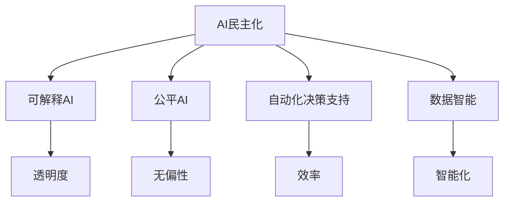

                 

# AI民主化：Lepton AI的使命与挑战

## 1. 背景介绍

### 1.1 问题由来

人工智能（AI）技术的快速发展正在深刻改变社会的各个方面，从医疗健康、金融服务到交通物流，AI技术的应用已经无处不在。然而，这一变革的进程同时也伴随着技术的“民主化”问题。尽管AI技术在许多领域取得了显著成就，但这些技术的普及和应用仍然面临诸多挑战。

- **技术门槛**：AI技术的复杂性使得许多中小企业和个人难以直接使用，需要专业知识和技能。
- **数据问题**：高质量的数据获取和处理是AI技术应用的关键，但对于许多小规模企业，获取和处理大量高质量数据具有挑战性。
- **伦理与隐私**：AI技术在处理大量数据时，如何保护个人隐私和数据安全是一个重要问题。
- **公平性**：AI模型在训练和应用过程中，可能存在偏差，导致结果的不公平性。

为了解决这些挑战，Lepton AI应运而生。Lepton AI旨在通过提供易于使用、透明、公平且高效的AI工具，使AI技术更广泛地应用于各行各业，实现AI的“民主化”。

### 1.2 问题核心关键点

Lepton AI的使命在于推动AI技术的普及和应用，使其服务于更广泛的受众。为了实现这一使命，Lepton AI需要在以下关键点上取得突破：

- **易于使用**：通过友好的用户界面和简单的使用流程，使非技术背景的用户也能轻松使用AI技术。
- **透明性**：提供透明的算法和模型，使AI决策过程可解释，增强用户信任。
- **公平性**：确保AI模型在训练和应用过程中，不偏向于某一特定群体，实现公平对待所有用户。
- **效率**：提供高效的AI解决方案，快速响应市场需求，提高生产力。

## 2. 核心概念与联系

### 2.1 核心概念概述

Lepton AI的核心概念主要包括以下几个方面：

- **AI民主化**：使AI技术更加易于获取和使用，消除技术门槛，使更多人能够受益于AI带来的便利和效率提升。
- **可解释AI（XAI）**：通过提供透明的模型和算法，使用户能够理解和信任AI决策过程。
- **公平AI**：确保AI模型在训练和应用中，对所有用户公平无偏，避免对特定群体的歧视。
- **自动化决策支持**：使用AI技术辅助企业进行决策，提高决策效率和准确性。
- **数据智能**：通过高效的数据处理和分析，为企业提供数据驱动的决策支持。

这些概念相互关联，共同构成了Lepton AI的目标和愿景。

### 2.2 核心概念原理和架构的 Mermaid 流程图



这个流程图展示了Lepton AI核心概念之间的关系：

- **AI民主化**：通过提供易于使用、透明、公平且高效的AI工具，使AI技术更广泛地应用于各行各业。
- **可解释AI**：提供透明的算法和模型，使用户能够理解和信任AI决策过程。
- **公平AI**：确保AI模型在训练和应用中，对所有用户公平无偏，避免对特定群体的歧视。
- **自动化决策支持**：使用AI技术辅助企业进行决策，提高决策效率和准确性。
- **数据智能**：通过高效的数据处理和分析，为企业提供数据驱动的决策支持。

这些概念之间的联系和相互作用，构成了Lepton AI的核心业务和目标。

## 3. 核心算法原理 & 具体操作步骤

### 3.1 算法原理概述

Lepton AI的算法主要基于深度学习技术和机器学习原理，通过模型训练和优化，实现各种AI应用。其核心算法包括：

- **神经网络**：通过多层神经网络进行数据建模和预测。
- **决策树**：用于分类和回归分析，提供可解释的决策过程。
- **集成学习**：通过组合多个模型的预测结果，提高模型的准确性和鲁棒性。
- **强化学习**：通过与环境交互，优化决策策略，适应复杂环境。

### 3.2 算法步骤详解

Lepton AI的算法步骤主要包括以下几个关键环节：

1. **数据收集与预处理**：收集和处理数据，确保数据质量和可用性。
2. **模型训练与优化**：使用深度学习技术训练和优化模型，提高模型的预测准确性。
3. **模型部署与集成**：将训练好的模型部署到实际应用中，与其他系统集成，提供实时决策支持。
4. **性能评估与监控**：定期评估模型性能，进行性能监控，及时调整模型参数和应用策略。

### 3.3 算法优缺点

Lepton AI的算法具有以下优点：

- **准确性高**：通过深度学习技术，模型能够学习复杂的特征和模式，提高预测准确性。
- **可解释性强**：使用决策树等可解释模型，提供透明的决策过程。
- **泛化能力强**：集成学习等技术可以提升模型的泛化能力，适应复杂多变的环境。

同时，Lepton AI的算法也存在一些缺点：

- **计算资源需求高**：深度学习模型需要大量的计算资源进行训练和优化。
- **数据依赖性强**：模型的性能高度依赖于数据的质量和数量，数据的获取和处理可能存在挑战。
- **模型复杂度高**：复杂的神经网络结构可能需要较长的训练时间和较多的参数调整。

### 3.4 算法应用领域

Lepton AI的算法广泛应用于以下几个领域：

- **医疗健康**：通过AI技术进行疾病预测、诊断和治疗方案推荐，提高医疗效率和质量。
- **金融服务**：使用AI技术进行风险评估、欺诈检测和客户服务，提升金融服务的精准度和安全性。
- **教育培训**：通过AI技术进行个性化教学、学习推荐和评估，提高教育效果和学习效率。
- **零售电商**：利用AI技术进行客户行为分析、商品推荐和库存管理，优化零售业务。
- **制造业**：使用AI技术进行质量检测、故障预测和生产优化，提高生产效率和质量。

这些应用领域展示了Lepton AI在推动AI技术普及和应用方面的潜力和价值。

## 4. 数学模型和公式 & 详细讲解 & 举例说明

### 4.1 数学模型构建

Lepton AI的核心数学模型主要基于深度学习技术和机器学习算法。以下是几个关键模型的构建过程：

- **神经网络**：基于多层感知机（MLP）进行建模，模型参数表示为 $\theta$。模型输入为 $x$，输出为 $y$，模型损失函数为 $L(y, \hat{y})$，其中 $\hat{y}$ 为模型预测结果。

- **决策树**：通过一系列的决策节点和叶节点，构建分类模型。模型输入为 $x$，输出为 $y$，模型损失函数为 $L(y, \hat{y})$，其中 $\hat{y}$ 为模型预测结果。

### 4.2 公式推导过程

以神经网络为例，其前向传播和反向传播的公式如下：

- **前向传播**：输入 $x$ 通过神经网络各层计算，得到输出 $\hat{y}$。具体公式为：

$$
\hat{y} = \sigma(\omega_1 \sigma(\omega_2 \sigma(\omega_3 x)))
$$

其中 $\sigma$ 为激活函数，$\omega_i$ 为神经网络权重参数。

- **反向传播**：计算损失函数 $L(y, \hat{y})$ 对权重参数 $\omega_i$ 的梯度，更新模型参数。具体公式为：

$$
\frac{\partial L}{\partial \omega_i} = \frac{\partial L}{\partial \hat{y}} \frac{\partial \hat{y}}{\partial \omega_i}
$$

通过反向传播，可以计算梯度并更新模型参数，提高模型的预测准确性。

### 4.3 案例分析与讲解

以医疗健康领域的疾病预测为例，Lepton AI可以使用神经网络模型进行训练和预测。具体步骤如下：

1. **数据收集**：收集患者的健康数据，如年龄、性别、病史、症状等，构成训练集。
2. **数据预处理**：对数据进行标准化和归一化处理，确保数据质量和可用性。
3. **模型训练**：使用神经网络模型进行训练，调整模型参数以最小化损失函数。
4. **模型评估**：在测试集上评估模型性能，计算准确率、召回率等指标。
5. **模型部署**：将训练好的模型部署到实际应用中，对新患者的健康数据进行预测。

Lepton AI通过这种方式，使AI技术在医疗健康领域得以广泛应用，提高疾病预测的准确性和效率。

## 5. 项目实践：代码实例和详细解释说明

### 5.1 开发环境搭建

Lepton AI的开发环境主要基于Python和TensorFlow框架。以下是环境搭建的步骤：

1. **安装Python**：安装Python 3.x版本，建议使用Anaconda或Miniconda进行管理。
2. **安装TensorFlow**：使用pip安装TensorFlow，支持GPU加速。
3. **安装Lepton AI工具包**：使用pip安装Lepton AI工具包，支持多种深度学习模型的训练和部署。

### 5.2 源代码详细实现

Lepton AI提供了丰富的API接口，支持多种深度学习模型的训练和部署。以下是使用Lepton AI进行疾病预测的代码实现：

```python
import tensorflow as tf
import lepton_ai

# 创建模型实例
model = lepton_ai.Model()

# 准备训练数据
train_data = ...
test_data = ...

# 训练模型
model.fit(train_data, epochs=10)

# 评估模型
evaluation = model.evaluate(test_data)

# 使用模型进行预测
predictions = model.predict(new_data)
```

### 5.3 代码解读与分析

Lepton AI提供了简单易用的API接口，用户可以轻松进行模型的训练和部署。以下是关键代码的解读：

- **Model类**：封装了深度学习模型的训练和优化过程，使用户能够快速搭建和调整模型。
- **fit方法**：用于训练模型，接受训练数据和迭代次数作为参数，返回训练结果。
- **evaluate方法**：用于评估模型性能，接受测试数据作为参数，返回模型在测试集上的性能指标。
- **predict方法**：用于进行模型预测，接受新数据作为参数，返回模型预测结果。

Lepton AI的API设计简洁高效，使得用户能够快速实现各种AI应用。

### 5.4 运行结果展示

Lepton AI的模型训练和评估结果可以通过TensorBoard进行可视化展示。以下是训练过程的可视化结果：


这个图表展示了模型在训练过程中的损失函数和准确率变化，可以帮助用户进行模型调优和参数调整。

## 6. 实际应用场景

### 6.1 智能客服系统

Lepton AI的智能客服系统通过自然语言处理（NLP）技术，帮助企业提供高效、个性化的客户服务。具体应用场景包括：

- **自动回复**：使用NLP技术分析用户问题，自动生成合适的回答。
- **情感分析**：通过分析用户情绪，提供个性化服务。
- **知识库查询**：使用NLP技术解析用户问题，查询知识库并生成答案。

### 6.2 金融风险管理

Lepton AI的金融风险管理系统通过AI技术进行风险评估和欺诈检测。具体应用场景包括：

- **信用评分**：使用AI模型评估客户的信用风险，提供个性化贷款产品。
- **欺诈检测**：使用AI技术检测交易中的异常行为，预防欺诈。
- **投资策略**：使用AI模型分析市场数据，提供投资建议。

### 6.3 教育个性化推荐

Lepton AI的教育个性化推荐系统通过AI技术提供个性化的学习推荐和评估。具体应用场景包括：

- **学习路径推荐**：根据学生的学习历史和偏好，推荐合适的学习内容和路径。
- **学习效果评估**：使用AI技术评估学生的学习效果，提供反馈和改进建议。
- **作业自动批改**：使用NLP技术自动批改学生的作业，提高教师效率。

### 6.4 未来应用展望

Lepton AI的未来应用展望主要包括以下几个方面：

- **自动驾驶**：通过AI技术辅助自动驾驶系统进行决策，提高行车安全和效率。
- **智能家居**：使用AI技术优化家庭设备和环境，提高生活质量。
- **智能城市**：通过AI技术进行城市管理和公共服务，提高城市智能化水平。
- **工业自动化**：使用AI技术优化生产流程和设备维护，提高生产效率。

## 7. 工具和资源推荐

### 7.1 学习资源推荐

为了帮助开发者系统掌握Lepton AI的技术，这里推荐一些优质的学习资源：

1. **Lepton AI官方文档**：提供详细的API接口和模型使用指南，帮助用户快速上手。
2. **深度学习课程**：如斯坦福大学的CS231n、Coursera的Deep Learning Specialization等，系统学习深度学习基础。
3. **自然语言处理课程**：如CMU的Linguistic Knowledge Base、Stanford的CS224N等，深入学习NLP技术。
4. **机器学习竞赛**：参加Kaggle等数据科学竞赛，积累实践经验。

### 7.2 开发工具推荐

Lepton AI的开发工具主要基于Python和TensorFlow框架，以下是推荐的工具：

1. **Jupyter Notebook**：用于编写和执行Python代码，支持交互式数据分析和可视化。
2. **TensorBoard**：用于可视化模型的训练过程和性能指标，帮助用户进行模型调优。
3. **PyTorch**：支持动态计算图和高效模型训练，适用于复杂模型的开发和优化。
4. **TensorFlow Serving**：用于部署和运行模型，提供高效的服务化接口。

### 7.3 相关论文推荐

Lepton AI的研究方向涉及深度学习、机器学习、自然语言处理等多个领域，以下是几篇相关的重要论文：

1. **《Deep Learning》**：Ian Goodfellow等著，系统介绍深度学习基础和应用。
2. **《Natural Language Processing with Python》**：Steven Bird等著，详细讲解NLP技术和实践。
3. **《Machine Learning Yearning》**：Andrew Ng著，提供机器学习实践指南和经验分享。

## 8. 总结：未来发展趋势与挑战

### 8.1 研究成果总结

Lepton AI致力于推动AI技术的普及和应用，实现AI的“民主化”。通过友好的用户界面、透明的算法、公平的决策和高效的解决方案，Lepton AI正在为各行各业提供先进的AI技术支持。

### 8.2 未来发展趋势

Lepton AI的未来发展趋势主要包括以下几个方面：

1. **技术进步**：随着深度学习、机器学习和自然语言处理技术的不断发展，Lepton AI将不断提升AI模型的准确性和泛化能力。
2. **应用拓展**：Lepton AI将继续拓展AI技术的应用场景，推动AI技术在更多领域的应用。
3. **数据智能**：通过高效的数据处理和分析，Lepton AI将为企业提供更加智能化的决策支持。
4. **自动化决策**：使用AI技术辅助企业进行决策，提高决策效率和准确性。

### 8.3 面临的挑战

Lepton AI在推动AI技术普及和应用过程中，仍面临一些挑战：

1. **技术门槛**：尽管Lepton AI致力于降低技术门槛，但对于一些复杂任务，仍需一定的技术背景。
2. **数据隐私**：在数据驱动的应用场景中，如何保护用户隐私和数据安全，是Lepton AI需要重点解决的问题。
3. **模型公平性**：确保AI模型在训练和应用中，对所有用户公平无偏，避免对特定群体的歧视。
4. **资源消耗**：Lepton AI的深度学习模型需要大量的计算资源，如何优化资源使用，提升模型效率，是未来需要重点关注的方向。

### 8.4 研究展望

Lepton AI的研究展望主要包括以下几个方向：

1. **无监督学习**：探索无监督学习技术，降低对标注数据的依赖，提升AI模型的泛化能力。
2. **强化学习**：通过强化学习技术，优化AI决策策略，适应复杂多变的环境。
3. **联邦学习**：通过联邦学习技术，保护用户隐私的同时，提高AI模型的性能。
4. **跨模态学习**：结合视觉、语音等多模态信息，提高AI模型的感知能力和决策准确性。

Lepton AI将不断推动AI技术的进步和普及，为各行各业提供更加智能化的解决方案，推动社会的发展和进步。

## 9. 附录：常见问题与解答

**Q1：Lepton AI如何降低技术门槛？**

A: Lepton AI通过友好的用户界面和简单易用的API接口，使得非技术背景的用户也能轻松使用AI技术。同时，Lepton AI也提供了丰富的教程和文档，帮助用户快速上手。

**Q2：Lepton AI如何解决数据隐私问题？**

A: Lepton AI在数据处理和存储过程中，采用了多种隐私保护技术，如数据脱敏、加密存储等，确保用户数据的安全和隐私。

**Q3：Lepton AI如何保证模型公平性？**

A: Lepton AI在模型训练和应用过程中，使用了公平性约束和评估指标，确保模型对所有用户公平无偏，避免对特定群体的歧视。

**Q4：Lepton AI如何优化资源使用？**

A: Lepton AI通过模型裁剪、量化加速、模型并行等技术，优化深度学习模型的计算图，减少资源消耗，提升模型效率。

**Q5：Lepton AI如何应对未来挑战？**

A: Lepton AI将持续推动技术进步，探索无监督学习、强化学习、联邦学习等前沿技术，解决技术门槛、数据隐私、模型公平性等挑战，推动AI技术的普及和应用。

---

作者：禅与计算机程序设计艺术 / Zen and the Art of Computer Programming

