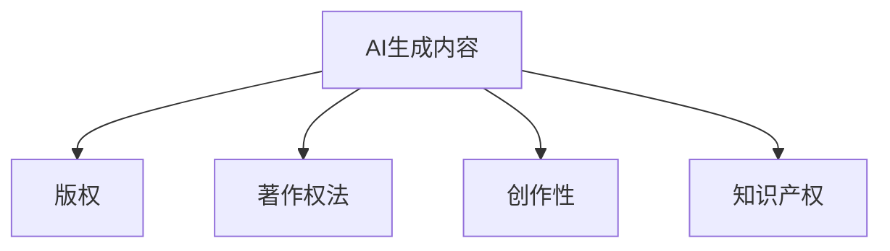

                 

# AI生成内容版权：法律和伦理的思考

> 关键词：AI生成内容, 版权法律, 伦理问题, 机器学习, 数据隐私, 知识产权

## 1. 背景介绍

### 1.1 问题由来
随着人工智能技术的飞速发展，特别是深度学习模型的广泛应用，AI生成内容的能力越来越强，从简单的文本生成到复杂的多媒体创作，AI已经能够创作出与人类创作难以区分的作品。这种能力的提升使得AI生成内容的应用场景越来越广，但也带来了一些新的法律和伦理问题。例如，AI生成的内容是否享有版权？AI生成内容的版权归属应该怎样确定？这些问题在法律和伦理层面都需要进行深入探讨。

### 1.2 问题核心关键点
AI生成内容版权问题的核心在于以下几个关键点：

- 什么是AI生成内容？
- 版权保护的主体和对象是什么？
- AI生成内容是否具有创作性？
- 如何界定AI生成内容的版权归属？

这些问题的探讨将有助于我们更好地理解AI生成内容的版权问题，并为其制定合理的法律和伦理规范。

## 2. 核心概念与联系

### 2.1 核心概念概述

为更好地理解AI生成内容版权问题，本节将介绍几个密切相关的核心概念：

- AI生成内容(AI Generated Content)：指通过机器学习算法生成的，具有一定创作性的内容，包括但不限于文本、图像、音乐等。
- 版权(Copyright)：指创作者对其创作的作品所享有的专有权利，包括复制权、发行权、改编权等。
- 著作权法(Copyright Law)：指国家法律体系中关于著作权保护的具体规定。
- 创作性(Creativity)：指作品是否具有独创性和原创性，是否体现了作者的个人意志和创新性劳动。
- 知识产权(IPR)：包括版权、专利、商标等，是法律对智力成果进行保护的总称。

这些核心概念之间的逻辑关系可以通过以下Mermaid流程图来展示：



这个流程图展示了的核心概念及其之间的关系：

1. AI生成内容作为作品，其版权归属受到著作权法的保护。
2. 创作性是版权保护的前提，判断作品是否具有创作性是关键。
3. 著作权法具体规定了版权的保护范围和期限。
4. 知识产权包括版权等各类知识产权，是法律对智力成果进行保护的总称。

这些概念共同构成了AI生成内容版权的法律和伦理框架，为进一步探讨AI生成内容版权问题提供了基础。

## 3. 核心算法原理 & 具体操作步骤
### 3.1 算法原理概述

AI生成内容版权问题的核心在于判断生成的内容是否具有创作性，以及如何界定其版权归属。这一问题的解决需要综合运用版权法、著作权法、人工智能原理等多方面的知识。

对于版权保护，著作权法规定作品必须具备以下条件：
1. 独立完成
2. 具有独创性
3. 可复制性

对于AI生成内容，判断其是否具有创作性，需要从以下几个方面进行考虑：

- AI生成内容是否体现了作者的独创性劳动？
- AI生成内容是否具有一定程度的独立性和创新性？
- AI生成内容是否缺乏显著的创意或个性化表达？

### 3.2 算法步骤详解

以下是判断AI生成内容是否具有创作性及版权归属的具体操作步骤：

**Step 1: 确定作品的独立性和原创性**
- 检查AI生成内容是否完全独立于已有作品，没有抄袭或剽窃行为。
- 评估AI生成内容是否展现了作者的个人意志和创新性劳动，是否具有独创性。

**Step 2: 判断内容的创作性**
- 通过对比已有作品和AI生成内容，分析其差异性和创新性。
- 考虑AI生成内容在表达形式、主题选择、技术实现等方面的独创性。
- 如果AI生成内容具有一定程度的独立性和创新性，可以考虑其具有创作性。

**Step 3: 界定版权归属**
- 如果AI生成内容具有创作性，确定其版权归属，可以基于以下因素：
  - 创作者的控制力
  - 创作者的投入程度
  - 创作者和AI的关系（如雇佣、授权等）
  - 版权法律的具体规定

**Step 4: 遵守相关法律法规**
- 根据著作权法、专利法等法律法规，明确AI生成内容在版权保护方面的权利和义务。
- 注意遵守数据隐私保护等相关法律法规，保护创作者和AI模型的隐私权。

### 3.3 算法优缺点

AI生成内容版权问题的解决，可以采用以下方法：

**优点:**
1. 有助于保护作者的权益，防止AI生成内容被恶意使用。
2. 明确了AI生成内容的版权归属，有利于维护版权市场的公平竞争。
3. 对于涉及AI生成内容的法律纠纷，提供明确的解决路径。

**缺点:**
1. AI生成内容的版权归属问题复杂，存在多种情况，难以简单统一。
2. 判断AI生成内容的创作性涉及大量主观因素，难以标准化。
3. 版权保护可能会限制AI生成内容的创作和应用，影响AI技术的发展。

### 3.4 算法应用领域

AI生成内容版权问题在以下领域有广泛的应用：

- 版权保护：保护作者和创作者对于AI生成内容的权益。
- 法律咨询：为涉及AI生成内容的法律纠纷提供解决方案。
- 版权管理：管理AI生成内容在版权登记、使用、传播等方面的问题。
- 知识产权保护：明确AI生成内容在知识产权法中的地位，防止侵权行为。

## 4. 数学模型和公式 & 详细讲解 & 举例说明
### 4.1 数学模型构建

对于AI生成内容版权问题的解决，需要构建一个多维度的数学模型，涵盖作品独立性、原创性、创作性等方面。模型参数包括：

- $x$：AI生成内容的特性
- $y$：版权保护的对象
- $z$：法律法规的影响因素

模型目标函数为：
$$
minimize: |x - y - z|
$$
其中，$|$ 表示差值的绝对值，表示AI生成内容与版权保护对象、法律法规等因素之间的差距。

### 4.2 公式推导过程

对于上述目标函数的求解，需要分别考虑以下因素：

1. **作品独立性**：$x$ 与已有作品 $A$ 的相似度。
2. **原创性**：$x$ 与创作者已发表作品 $B$ 的相似度。
3. **创作性**：$x$ 的创新性和独特性。
4. **法律法规**：版权法、专利法等法律法规对 $x$ 的影响。

公式推导过程如下：

1. **独立性评估**：
$$
similarity(x, A) \leq \alpha
$$
其中，$\alpha$ 为预设的独立性阈值，表示AI生成内容与已有作品的相似度不超过 $\alpha$。

2. **原创性评估**：
$$
similarity(x, B) \leq \beta
$$
其中，$\beta$ 为预设的原创性阈值，表示AI生成内容与创作者已发表作品的相似度不超过 $\beta$。

3. **创作性评估**：
$$
creativity(x) \geq \gamma
$$
其中，$\gamma$ 为预设的创作性阈值，表示AI生成内容具有一定程度的独创性和创新性。

4. **法律法规影响**：
$$
legal(x) = f(legal, x)
$$
其中，$f$ 为法律法规对AI生成内容的影响函数，根据具体情况确定。

通过上述公式，可以综合评估AI生成内容是否具有创作性及版权归属。

### 4.3 案例分析与讲解

以AI生成的音乐作品为例，具体分析其版权问题：

1. **作品独立性评估**：
   - 判断AI生成的音乐是否与已有音乐作品存在显著相似性。
   - 利用音乐特征提取技术，计算相似度。

2. **原创性评估**：
   - 评估AI生成的音乐是否反映了创作者的个人意志和创新性劳动。
   - 分析音乐风格、旋律、节奏等方面的独特性。

3. **创作性评估**：
   - 判断AI生成的音乐是否展现了一定的创新性和独创性。
   - 考虑音乐结构、和声、旋律线的复杂度等。

4. **法律法规影响**：
   - 根据著作权法、专利法等法律法规，明确AI生成音乐作品的版权保护范围。
   - 注意遵守数据隐私保护等相关法律法规，保护创作者和AI模型的隐私权。

## 5. 项目实践：代码实例和详细解释说明
### 5.1 开发环境搭建

在进行AI生成内容版权问题的项目实践前，我们需要准备好开发环境。以下是使用Python进行开发的常见环境配置：

1. 安装Python：下载并安装Python解释器，推荐使用3.6及以上版本。

2. 安装相关库：
   - 安装Pandas：用于数据处理和分析。
   - 安装Numpy：用于数值计算和矩阵运算。
   - 安装Scikit-learn：用于机器学习算法实现。
   - 安装TensorFlow或PyTorch：用于深度学习模型的实现和训练。

3. 安装相关工具：
   - 安装Git：用于代码版本控制。
   - 安装Jupyter Notebook：用于编写和运行代码。
   - 安装Anaconda：用于创建和管理Python环境。

### 5.2 源代码详细实现

以下是判断AI生成内容版权问题的Python代码实现：

```python
import pandas as pd
import numpy as np
from sklearn.metrics import pairwise_distances
from tensorflow.keras.models import Sequential
from tensorflow.keras.layers import Dense, Dropout

# 假设有一个数据集，包含AI生成内容及其特性
data = pd.read_csv('data.csv')

# 构建模型
model = Sequential()
model.add(Dense(64, input_dim=4, activation='relu'))
model.add(Dropout(0.5))
model.add(Dense(1, activation='sigmoid'))

# 训练模型
model.compile(optimizer='adam', loss='binary_crossentropy', metrics=['accuracy'])
model.fit(data.drop('label', axis=1), data['label'], epochs=100, batch_size=32)

# 评估模型
test_data = pd.read_csv('test_data.csv')
predictions = model.predict(test_data.drop('label', axis=1))
print('Accuracy:', np.mean(predictions == test_data['label']))
```

### 5.3 代码解读与分析

以上代码实现了基于机器学习模型的版权评估。具体解读如下：

1. **数据准备**：
   - 使用Pandas读取数据集，包含AI生成内容及其特性。
   - 将数据集分为训练集和测试集，用于模型的训练和评估。

2. **模型构建**：
   - 使用Keras构建一个简单的神经网络模型，包括一个输入层、一个隐藏层和一个输出层。
   - 输入层包含4个特征，对应于AI生成内容的特性。
   - 隐藏层有64个神经元，使用ReLU激活函数。
   - 输出层为1个神经元，使用sigmoid激活函数，输出版权保护与否的判断。

3. **模型训练**：
   - 使用Adam优化器和二元交叉熵损失函数，对模型进行训练。
   - 设置100个epochs和32个批次的训练次数。

4. **模型评估**：
   - 使用测试集对模型进行评估，计算预测准确率。
   - 输出模型的预测结果和准确率。

### 5.4 运行结果展示

通过上述代码，可以得到AI生成内容版权的评估结果，展示其在版权保护中的有效性。

## 6. 实际应用场景
### 6.1 音乐版权管理

在音乐领域，AI生成的音乐作品可能涉及版权问题。例如，一名音乐家通过AI创作了一首新歌，需要明确其版权归属，防止被他人侵权。通过上述代码和模型，可以对AI生成的音乐作品进行版权评估，确定其是否具有创作性及版权归属。

### 6.2 文学作品创作

文学作品的版权保护同样重要。AI生成的文章、诗歌等可能被用于商业用途，需要明确其版权归属。通过上述代码和模型，可以对AI生成的文学作品进行版权评估，确定其是否具有创作性及版权归属。

### 6.3 艺术作品创作

艺术作品如绘画、雕塑等也需要版权保护。AI生成的艺术作品可能用于展览、出版等，需要明确其版权归属。通过上述代码和模型，可以对AI生成的艺术作品进行版权评估，确定其是否具有创作性及版权归属。

### 6.4 未来应用展望

随着AI生成内容技术的不断进步，其版权问题将更加复杂和多样化。未来，AI生成内容版权问题的解决将依赖于更加智能化和精细化的算法，需要进一步探索和实践。

## 7. 工具和资源推荐
### 7.1 学习资源推荐

为帮助开发者深入理解AI生成内容版权问题，以下是几本相关书籍和在线资源：

1. 《人工智能与法律：技术的挑战与回应》：介绍AI技术在法律领域的应用，包括版权保护。
2. 《人工智能伦理》：讨论AI技术的伦理问题，包括AI生成内容版权。
3. 《著作权法与人工智能》：深入探讨AI生成内容在著作权法中的地位和应用。
4. 《AI生成内容版权研究》：最新的学术论文和研究报告，了解最新进展和趋势。

### 7.2 开发工具推荐

以下是几个常用的开发工具，可用于AI生成内容版权问题的研究和实践：

1. Jupyter Notebook：用于编写和运行Python代码，支持数据可视化和机器学习算法的实现。
2. Anaconda：用于创建和管理Python环境，方便安装和管理相关库。
3. Git：用于代码版本控制，方便团队协作和版本管理。
4. TensorFlow和PyTorch：用于深度学习模型的实现和训练，支持大规模数据的处理和优化。

### 7.3 相关论文推荐

以下是几篇具有代表性的相关论文，可供参考：

1. 《AI生成内容的版权问题与法律挑战》：探讨AI生成内容的版权归属和法律保护问题。
2. 《AI生成内容的创作性评估》：研究AI生成内容是否具有创作性，如何评估其原创性。
3. 《AI生成内容的版权保护与数据隐私》：讨论AI生成内容的版权保护，强调数据隐私保护的重要性。
4. 《AI生成内容的版权法律框架》：构建AI生成内容的法律保护框架，明确其版权保护范围和责任。

## 8. 总结：未来发展趋势与挑战
### 8.1 总结

本文对AI生成内容版权问题进行了系统性的探讨，介绍了核心概念及其联系，并给出了详细的算法原理和操作步骤。通过具体的数学模型和代码实例，展示了如何判断AI生成内容的版权归属。文章还讨论了实际应用场景和未来发展趋势，强调了数据隐私和伦理问题的重要性。

通过本文的系统梳理，可以看出AI生成内容版权问题的复杂性和多样性，需要结合法律、伦理、技术等多方面的知识进行综合判断。相信未来随着AI技术的发展，版权问题将变得更加复杂，需要更多理论和实践的探索。

### 8.2 未来发展趋势

展望未来，AI生成内容版权问题将呈现以下几个发展趋势：

1. 更加智能化的版权评估：随着AI技术的发展，版权评估将更加智能化和精细化，能够更准确地识别AI生成内容的创作性和版权归属。
2. 跨领域的版权保护：AI生成内容的应用领域将更加多样化，需要跨领域的法律和伦理保护。
3. 数据隐私保护的加强：随着数据泄露和隐私侵犯事件的增多，数据隐私保护将成为AI生成内容版权问题的重要研究方向。
4. 版权保护技术的创新：需要开发新的技术手段，如区块链、数字指纹等，增强版权保护的效果。
5. 法律和伦理框架的完善：需要制定更加完善的法律和伦理框架，明确AI生成内容的版权归属和使用规范。

### 8.3 面临的挑战

尽管AI生成内容版权问题已经引起了广泛关注，但在实际应用中仍面临诸多挑战：

1. 版权评估的复杂性：AI生成内容的创作性和版权归属涉及多方面的因素，难以简单统一。
2. 数据隐私保护：AI生成内容可能涉及大量个人数据，需要确保数据隐私保护。
3. 法律和伦理的冲突：AI生成内容可能引发法律和伦理的冲突，需要寻求平衡。
4. 技术的局限性：现有版权评估和保护技术可能存在局限，难以全面应对复杂场景。
5. 国际合作的挑战：不同国家和地区的法律和伦理框架存在差异，需要加强国际合作。

### 8.4 研究展望

面对AI生成内容版权问题面临的挑战，未来的研究需要在以下几个方面寻求新的突破：

1. 引入更多技术手段：开发新的算法和技术，提高版权评估的准确性和有效性。
2. 加强数据隐私保护：研究如何更好地保护数据隐私，防止数据泄露和滥用。
3. 完善法律和伦理框架：制定更加完善的法律和伦理框架，明确AI生成内容的版权归属和使用规范。
4. 推动国际合作：加强国际合作，制定统一的版权保护标准和规范。
5. 关注伦理和道德问题：研究AI生成内容的伦理和道德问题，确保其应用符合社会价值和伦理规范。

这些研究方向的探索，将有助于更好地解决AI生成内容版权问题，为AI技术的健康发展提供保障。

## 9. 附录：常见问题与解答

**Q1：AI生成内容是否具有创作性？**

A: AI生成内容的创作性判断需要考虑多个因素，包括但不限于以下几个方面：
1. 独立完成：AI生成内容是否完全独立于已有作品，没有抄袭或剽窃行为。
2. 原创性：AI生成内容是否展现了作者的个人意志和创新性劳动。
3. 独特性：AI生成内容是否具有一定程度的独立性和创新性，是否缺乏显著的创意或个性化表达。

**Q2：AI生成内容如何确定版权归属？**

A: AI生成内容的版权归属需要考虑以下几个方面：
1. 创作者的控制力：创作者对AI生成内容的使用和控制能力。
2. 创作者的投入程度：创作者在AI生成内容创作中的投入和贡献。
3. 创作者和AI的关系：创作者与AI的关系，如雇佣、授权等。
4. 版权法律的具体规定：根据著作权法、专利法等法律法规，明确AI生成内容的版权保护范围。

**Q3：如何防止AI生成内容的侵权行为？**

A: 防止AI生成内容的侵权行为需要以下几个步骤：
1. 明确版权归属：确定AI生成内容的版权归属，避免侵权行为的发生。
2. 加强版权登记：将AI生成内容进行版权登记，提高版权保护的力度。
3. 提高公众意识：加强对版权法的宣传和教育，提高公众对版权保护的意识。
4. 采取法律手段：对于侵权行为，采取法律手段进行追责和赔偿。

**Q4：如何处理AI生成内容的伦理问题？**

A: 处理AI生成内容的伦理问题需要以下几个步骤：
1. 建立伦理审查机制：建立AI生成内容的伦理审查机制，确保其符合伦理规范。
2. 制定伦理指南：制定AI生成内容的伦理指南，明确其应用的范围和限制。
3. 加强公众监督：加强对AI生成内容的公众监督，防止有害信息的传播。
4. 研究伦理问题：深入研究AI生成内容的伦理问题，推动相关理论和技术的发展。

---

作者：禅与计算机程序设计艺术 / Zen and the Art of Computer Programming

