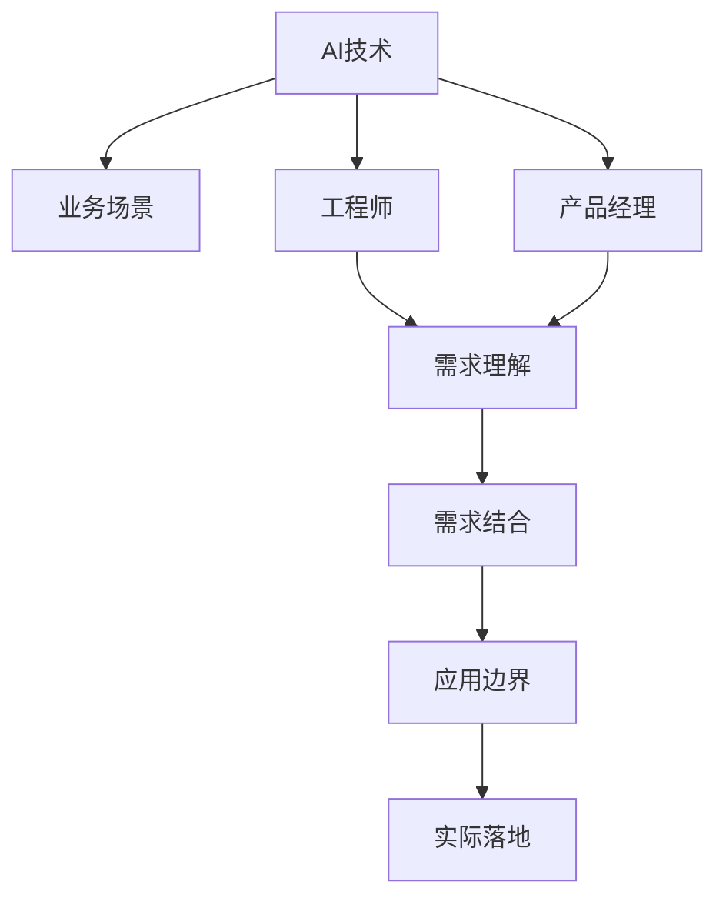

                 

# AI的业务场景：工程师与产品经理的对话，找到AI的应用边界与需求结合

> 关键词：AI应用、业务场景、工程师与产品经理、需求结合、技术边界

## 1. 背景介绍

随着人工智能(AI)技术的迅猛发展，AI已逐步渗透到各行各业，成为数字化转型和创新发展的重要推动力。然而，AI的落地应用并非一帆风顺，涉及到技术、业务、组织等多方面的因素。如何在实际业务场景中有效结合AI技术，找到AI的应用边界，是当下企业面临的重大挑战。

### 1.1 问题由来
AI技术的快速发展，使得其在各种场景中展现了强大的潜力。无论是金融风控、医疗诊断、智能客服，还是自动驾驶、智慧制造、推荐系统，AI均展现了显著的竞争优势。然而，AI技术的落地应用，尤其是AI在实际业务场景中的应用，面临诸多问题。例如：

1. **需求理解不足**：企业高层对AI技术缺乏深入理解，认为AI无所不能，忽视了AI应用的实际限制。
2. **数据质量问题**：AI技术依赖大量高质量数据进行训练和优化，然而企业的数据往往存在数据质量参差不齐、数据孤岛等问题。
3. **技术可行性问题**：AI技术并非万能钥匙，需要根据具体业务场景进行定制化开发，然而企业的技术积累和人才储备有限。
4. **成本压力**：AI技术的研发和部署需要大量资金投入，企业面临较大的经济压力。

这些问题的存在，导致企业难以将AI技术有效落地应用，进而影响了AI技术的广泛推广和普及。

### 1.2 问题核心关键点
本文旨在通过工程师与产品经理的对话，深入探讨AI在实际业务场景中的应用边界，找到AI技术在业务需求中的结合点，为企业的AI落地应用提供切实可行的解决方案。

## 2. 核心概念与联系

### 2.1 核心概念概述

为了更好地理解AI在业务场景中的应用，需要深入了解以下核心概念：

- **AI技术**：包括机器学习、深度学习、自然语言处理、计算机视觉、强化学习等技术。
- **业务场景**：指企业实际的业务流程、运营模式、客户需求等。
- **工程师与产品经理**：两者需紧密协作，确保AI技术能够有效服务于实际业务需求。
- **需求结合**：指将AI技术与业务需求有效结合，提升业务效率、降低运营成本、优化客户体验。
- **应用边界**：指AI技术在特定业务场景中的适用范围，避免盲目投入，提高AI应用的经济效益。

这些核心概念之间的逻辑关系可以通过以下Mermaid流程图来展示：



这个流程图展示了AI技术在业务场景中的应用流程：

1. AI技术首先与业务场景进行初步对接，形成初步需求。
2. 工程师和产品经理共同参与需求分析，形成详细的技术需求和业务需求。
3. 结合技术需求和业务需求，找到AI技术与业务场景的结合点。
4. 明确AI技术在实际业务场景中的应用边界，进行针对性开发和部署。
5. 最终在实际业务中实现AI技术的落地应用。

## 3. 核心算法原理 & 具体操作步骤

### 3.1 算法原理概述

基于AI技术的实际应用，本文将详细阐述其核心算法原理和具体操作步骤：

- **机器学习**：通过训练算法模型，从历史数据中学习规律，用于分类、回归、聚类等任务。
- **深度学习**：通过构建深度神经网络，学习数据之间的非线性关系，用于图像识别、语音识别、自然语言处理等任务。
- **自然语言处理(NLP)**：通过文本处理技术，实现语言理解和生成，用于聊天机器人、文本摘要、机器翻译等任务。
- **计算机视觉(CV)**：通过图像处理技术，实现视觉信息的获取、理解与处理，用于自动驾驶、人脸识别、图像搜索等任务。
- **强化学习**：通过智能体与环境交互，学习最优策略，用于游戏AI、机器人控制、推荐系统等任务。

这些核心算法原理通常包含以下步骤：

1. **数据准备**：收集、清洗、标注数据集，用于模型训练和评估。
2. **模型选择**：根据任务需求选择合适的算法模型，并进行预训练和调参。
3. **模型训练**：使用训练数据集训练模型，调整模型参数，提高模型精度。
4. **模型评估**：使用测试数据集评估模型效果，进行超参数调整和模型优化。
5. **模型部署**：将训练好的模型部署到实际业务系统中，进行持续监控和优化。

### 3.2 算法步骤详解

以深度学习模型为例，详细阐述AI在业务场景中的操作步骤：

**Step 1: 数据准备**
- **数据收集**：收集业务场景相关的历史数据，如交易记录、客户反馈、产品使用数据等。
- **数据清洗**：去除重复、噪声数据，进行缺失值填充和异常值处理。
- **数据标注**：对数据进行标注，如分类标签、文本情感、用户行为等。

**Step 2: 模型选择**
- **算法选择**：根据任务需求选择合适的深度学习模型，如卷积神经网络(CNN)、循环神经网络(RNN)、长短时记忆网络(LSTM)、Transformer等。
- **预训练模型**：选择合适的预训练模型作为初始化参数，如BERT、GPT等。
- **模型超参数**：设置模型的超参数，如学习率、批大小、迭代次数等。

**Step 3: 模型训练**
- **训练流程**：使用训练数据集进行模型训练，前向传播计算损失函数，反向传播计算梯度。
- **损失函数**：选择合适的损失函数，如交叉熵损失、均方误差损失等。
- **优化器**：选择合适的优化器，如Adam、SGD等，进行模型参数更新。

**Step 4: 模型评估**
- **评估指标**：选择合适的评估指标，如准确率、召回率、F1值等。
- **测试数据集**：使用测试数据集对模型进行评估，分析模型效果。
- **模型优化**：根据评估结果，进行模型优化，如调整超参数、改变模型结构等。

**Step 5: 模型部署**
- **模型导出**：将训练好的模型导出为可部署的格式，如TensorFlow SavedModel、PyTorch模型文件等。
- **模型部署**：将模型部署到实际业务系统中，进行实时推理。
- **持续监控**：对模型进行持续监控，收集业务反馈，进行模型优化。

### 3.3 算法优缺点

AI技术在实际业务场景中的应用，具有以下优缺点：

**优点**
1. **高效自动化**：AI技术能够自动处理大量重复性、规则化的任务，提高工作效率。
2. **数据驱动决策**：AI技术能够从历史数据中提取规律，提供科学的数据驱动决策依据。
3. **业务创新**：AI技术能够拓展业务模式，发现新的业务机会和创新点。

**缺点**
1. **数据依赖性强**：AI技术依赖大量高质量数据进行训练和优化，数据质量差可能影响模型效果。
2. **技术门槛高**：AI技术需要专业技术人员进行模型开发和调优，技术门槛较高。
3. **决策透明性低**：AI技术输出的结果通常缺乏解释性，决策过程难以理解和解释。
4. **模型泛化能力差**：AI模型容易受到数据分布变化的影响，泛化能力有限。

### 3.4 算法应用领域

AI技术在实际业务场景中，广泛应用于以下领域：

1. **金融风控**：利用AI技术进行信用评估、欺诈检测、风险预警等，提高金融业务的精准性和安全性。
2. **医疗健康**：通过AI技术进行疾病预测、影像分析、智能诊断等，提升医疗服务的效率和准确性。
3. **智能客服**：利用AI技术构建智能客服系统，实现自然语言处理和情感识别，提升客户服务体验。
4. **自动驾驶**：利用AI技术进行环境感知、路径规划、行为决策等，推动自动驾驶技术的成熟应用。
5. **推荐系统**：通过AI技术构建推荐系统，实现个性化推荐，提升用户体验和业务转化率。

## 4. 数学模型和公式 & 详细讲解  
### 4.1 数学模型构建

本节将使用数学语言对AI在业务场景中的应用模型进行更加严格的刻画。

以深度学习模型为例，其数学模型可表示为：

$$ y=f(x;\theta) $$

其中 $y$ 为模型输出，$x$ 为输入数据，$\theta$ 为模型参数，$f(x;\theta)$ 为模型函数。常见的深度学习模型如卷积神经网络(CNN)、循环神经网络(RNN)、长短时记忆网络(LSTM)、Transformer等，均可通过上述模型框架进行建模。

### 4.2 公式推导过程

以卷积神经网络(CNN)为例，其数学模型推导如下：

**输入层**
- **输入数据**：$x=(x_1,x_2,\cdots,x_n)$
- **输入特征**：$x_i \in \mathbb{R}^{d}$，$d$ 为输入特征维度。

**卷积层**
- **卷积核**：$\omega_k=(\omega_{k1},\omega_{k2},\cdots,\omega_{kd})$，$k$ 为卷积核个数。
- **卷积操作**：$\sigma_k=f(\omega_k \ast x_i)$，其中 $\ast$ 为卷积运算符。

**池化层**
- **池化函数**：$\sigma_k'=max(\sigma_k)$

**全连接层**
- **权重矩阵**：$W=(W_{11},W_{12},\cdots,W_{1d_1},W_{21},W_{22},\cdots,W_{2d_1},\cdots,W_{D_1,1},W_{D_1,2},\cdots,W_{D_1,d_1})$
- **偏置向量**：$b=(b_1,b_2,\cdots,b_{D_1})$
- **全连接操作**：$\sigma=W\sigma_k'+b$

**输出层**
- **激活函数**：$\sigma_1=f(\sigma)$
- **输出结果**：$y=\sigma_1$

在模型训练过程中，通过前向传播计算预测结果，反向传播计算损失函数，利用优化算法更新模型参数，最终达到最小化损失函数的目的。

### 4.3 案例分析与讲解

以医疗影像分析为例，详细阐述AI在业务场景中的应用：

**输入层**
- **输入数据**：$x$ 为医疗影像数据。
- **输入特征**：$x_i \in \mathbb{R}^{d}$，$d$ 为像素维度。

**卷积层**
- **卷积核**：$\omega_k=(\omega_{k1},\omega_{k2},\cdots,\omega_{kd})$，$k$ 为卷积核个数。
- **卷积操作**：$\sigma_k=f(\omega_k \ast x_i)$，其中 $\ast$ 为卷积运算符。

**池化层**
- **池化函数**：$\sigma_k'=max(\sigma_k)$

**全连接层**
- **权重矩阵**：$W=(W_{11},W_{12},\cdots,W_{1d_1},W_{21},W_{22},\cdots,W_{2d_1},\cdots,W_{D_1,1},W_{D_1,2},\cdots,W_{D_1,d_1})$
- **偏置向量**：$b=(b_1,b_2,\cdots,b_{D_1})$
- **全连接操作**：$\sigma=W\sigma_k'+b$

**输出层**
- **激活函数**：$\sigma_1=f(\sigma)$
- **输出结果**：$y=\sigma_1$

在医疗影像分析中，AI模型通过卷积层和池化层提取影像特征，通过全连接层进行特征融合和分类，最终输出疾病诊断结果。模型训练过程中，通过医疗影像和标注数据进行监督学习，优化模型参数，提高诊断准确率。

## 5. 项目实践：代码实例和详细解释说明
### 5.1 开发环境搭建

在进行AI技术应用开发前，需要准备好开发环境。以下是使用Python进行TensorFlow开发的环境配置流程：

1. 安装Anaconda：从官网下载并安装Anaconda，用于创建独立的Python环境。

2. 创建并激活虚拟环境：
```bash
conda create -n tf-env python=3.8 
conda activate tf-env
```

3. 安装TensorFlow：根据CUDA版本，从官网获取对应的安装命令。例如：
```bash
pip install tensorflow
```

4. 安装各类工具包：
```bash
pip install numpy pandas scikit-learn matplotlib tqdm jupyter notebook ipython
```

完成上述步骤后，即可在`tf-env`环境中开始AI技术应用开发。

### 5.2 源代码详细实现

下面我们以医疗影像分类为例，给出使用TensorFlow对深度学习模型进行微调的PyTorch代码实现。

首先，定义医疗影像分类任务的数据处理函数：

```python
import tensorflow as tf
import numpy as np
from tensorflow.keras.preprocessing.image import ImageDataGenerator

class ImageDataGeneratorWrapper(ImageDataGenerator):
    def __init__(self, *args, **kwargs):
        super().__init__(*args, **kwargs)

    def __call__(self, x):
        x = ImageDataGenerator.random_rotation(x, 45)
        x = ImageDataGenerator.random_shift(x, width_factor=0.2, height_factor=0.2)
        x = ImageDataGenerator.random_mirror(x)
        return x

# 数据处理函数
def load_data():
    train_data_dir = '/path/to/train/data'
    val_data_dir = '/path/to/val/data'
    batch_size = 32

    train_datagen = ImageDataGeneratorWrapper(rescale=1./255, shear_range=0.2, zoom_range=0.2, horizontal_flip=True)
    val_datagen = ImageDataGeneratorWrapper(rescale=1./255)

    train_generator = train_datagen.flow_from_directory(train_data_dir, target_size=(256, 256), batch_size=batch_size, class_mode='categorical')
    val_generator = val_datagen.flow_from_directory(val_data_dir, target_size=(256, 256), batch_size=batch_size, class_mode='categorical')

    return train_generator, val_generator
```

然后，定义深度学习模型：

```python
from tensorflow.keras.applications.resnet50 import ResNet50
from tensorflow.keras.layers import Dense, Flatten

# 加载预训练的ResNet50模型
model = ResNet50(include_top=False, weights='imagenet')

# 在模型顶部添加全连接层
x = model.output
x = Flatten()(x)
x = Dense(256, activation='relu')(x)
predictions = Dense(10, activation='softmax')(x)

model = tf.keras.Model(inputs=model.input, outputs=predictions)
```

接着，定义训练和评估函数：

```python
from tensorflow.keras.optimizers import Adam

# 定义损失函数和优化器
loss = tf.keras.losses.CategoricalCrossentropy()
optimizer = Adam(lr=0.001)

# 定义训练和评估函数
def train(model, train_generator, val_generator, epochs):
    model.compile(optimizer=optimizer, loss=loss, metrics=['accuracy'])
    history = model.fit(train_generator, epochs=epochs, validation_data=val_generator)
    return history

def evaluate(model, val_generator):
    loss, accuracy = model.evaluate(val_generator)
    return loss, accuracy
```

最后，启动训练流程并在验证集上评估：

```python
train_generator, val_generator = load_data()

history = train(model, train_generator, val_generator, epochs=10)
print('Training finished.')

loss, accuracy = evaluate(model, val_generator)
print(f'Validation loss: {loss:.4f}')
print(f'Validation accuracy: {accuracy:.4f}')
```

以上就是使用TensorFlow对医疗影像分类任务进行深度学习模型微调的完整代码实现。可以看到，得益于TensorFlow的强大封装，我们可以用相对简洁的代码完成模型的加载、微调和评估。

### 5.3 代码解读与分析

让我们再详细解读一下关键代码的实现细节：

**ImageDataGeneratorWrapper类**：
- 继承自ImageDataGenerator，增加随机旋转、随机平移、随机镜像等数据增强操作。

**load_data函数**：
- 加载训练和验证数据集，并进行数据增强和标准化处理。

**模型定义**：
- 使用预训练的ResNet50模型作为特征提取器，在顶部添加全连接层进行分类。

**train和evaluate函数**：
- 定义训练和评估函数，使用Adam优化器进行模型训练，并在验证集上进行性能评估。

**训练流程**：
- 加载数据集，启动训练，记录训练过程中的指标，并在验证集上评估模型性能。

可以看到，TensorFlow框架大大简化了模型的加载、微调和评估过程，使得AI技术的落地应用变得简单高效。开发者可以将更多精力放在模型设计和业务适配上，而不必过多关注底层的实现细节。

当然，工业级的系统实现还需考虑更多因素，如模型的保存和部署、超参数的自动搜索、更灵活的任务适配层等。但核心的微调范式基本与此类似。

## 6. 实际应用场景
### 6.1 智能客服系统

AI技术在智能客服系统中发挥了重要作用。传统客服往往需要配备大量人力，高峰期响应缓慢，且一致性和专业性难以保证。而使用AI技术构建的智能客服系统，可以7x24小时不间断服务，快速响应客户咨询，用自然流畅的语言解答各类常见问题。

在技术实现上，可以收集企业内部的历史客服对话记录，将问题和最佳答复构建成监督数据，在此基础上对深度学习模型进行微调。微调后的智能客服系统能够自动理解用户意图，匹配最合适的答案模板进行回复。对于客户提出的新问题，还可以接入检索系统实时搜索相关内容，动态组织生成回答。如此构建的智能客服系统，能大幅提升客户咨询体验和问题解决效率。

### 6.2 金融舆情监测

金融机构需要实时监测市场舆论动向，以便及时应对负面信息传播，规避金融风险。传统的人工监测方式成本高、效率低，难以应对网络时代海量信息爆发的挑战。基于AI技术的文本分类和情感分析技术，为金融舆情监测提供了新的解决方案。

具体而言，可以收集金融领域相关的新闻、报道、评论等文本数据，并对其进行主题标注和情感标注。在此基础上对深度学习模型进行微调，使其能够自动判断文本属于何种主题，情感倾向是正面、中性还是负面。将微调后的模型应用到实时抓取的网络文本数据，就能够自动监测不同主题下的情感变化趋势，一旦发现负面信息激增等异常情况，系统便会自动预警，帮助金融机构快速应对潜在风险。

### 6.3 个性化推荐系统

当前的推荐系统往往只依赖用户的历史行为数据进行物品推荐，无法深入理解用户的真实兴趣偏好。基于AI技术的个性化推荐系统，可以更好地挖掘用户行为背后的语义信息，从而提供更精准、多样的推荐内容。

在实践中，可以收集用户浏览、点击、评论、分享等行为数据，提取和用户交互的物品标题、描述、标签等文本内容。将文本内容作为模型输入，用户的后续行为（如是否点击、购买等）作为监督信号，在此基础上微调深度学习模型。微调后的模型能够从文本内容中准确把握用户的兴趣点。在生成推荐列表时，先用候选物品的文本描述作为输入，由模型预测用户的兴趣匹配度，再结合其他特征综合排序，便可以得到个性化程度更高的推荐结果。

### 6.4 未来应用展望

随着AI技术的不断发展，基于AI技术的实际应用场景将越来越广泛，未来AI技术在各个领域的应用前景将更加广阔。

在智慧医疗领域，基于AI技术的医疗问答、病历分析、智能诊断等应用将提升医疗服务的智能化水平，辅助医生诊疗，加速新药开发进程。

在智能教育领域，基于AI技术的作业批改、学情分析、知识推荐等应用将促进教育公平，提高教学质量。

在智慧城市治理中，基于AI技术的智能监测、应急指挥等应用将提高城市管理的自动化和智能化水平，构建更安全、高效的未来城市。

此外，在企业生产、社会治理、文娱传媒等众多领域，基于AI技术的智能应用也将不断涌现，为经济社会发展注入新的动力。相信随着技术的日益成熟，AI技术必将在更广阔的应用领域大放异彩，深刻影响人类的生产生活方式。

## 7. 工具和资源推荐
### 7.1 学习资源推荐

为了帮助开发者系统掌握AI技术在实际业务场景中的应用，这里推荐一些优质的学习资源：

1. **TensorFlow官方文档**：提供详尽的TensorFlow框架使用指南和API文档，涵盖模型构建、数据处理、模型训练、模型评估等多个方面。

2. **PyTorch官方文档**：提供详细的PyTorch框架使用指南和API文档，涵盖模型构建、数据处理、模型训练、模型评估等多个方面。

3. **深度学习入门教程**：由深度学习专家编写，系统介绍深度学习的基本概念和经典算法，适合初学者入门。

4. **TensorFlow实战指南**：详细讲解TensorFlow框架在实际项目中的应用，涵盖数据处理、模型训练、模型评估、模型部署等多个方面。

5. **深度学习框架对比**：对比TensorFlow、PyTorch、Keras等主流深度学习框架的优缺点和适用场景，帮助选择合适的框架。

通过对这些资源的学习实践，相信你一定能够快速掌握AI技术在实际业务场景中的应用方法，并用于解决实际的AI应用问题。

### 7.2 开发工具推荐

高效的开发离不开优秀的工具支持。以下是几款用于AI技术开发和应用的工具：

1. **Jupyter Notebook**：免费开源的交互式编程环境，支持Python、R等语言，方便进行代码编写和数据可视化。

2. **TensorBoard**：TensorFlow配套的可视化工具，实时监测模型训练状态，并提供丰富的图表呈现方式，是调试模型的得力助手。

3. **Weights & Biases**：模型训练的实验跟踪工具，可以记录和可视化模型训练过程中的各项指标，方便对比和调优。

4. **NVIDIA Turi Create**：提供图形化界面和代码示例，方便快速构建深度学习模型，并进行训练和评估。

5. **AWS SageMaker**：亚马逊提供的深度学习服务，提供模型训练、部署、监控等一站式解决方案，适合大规模工程应用。

合理利用这些工具，可以显著提升AI技术的开发效率，加快创新迭代的步伐。

### 7.3 相关论文推荐

AI技术的不断发展，离不开学界和产业界的持续研究。以下是几篇奠基性的相关论文，推荐阅读：

1. **AlexNet**：深度学习领域里程碑，提出卷积神经网络，为图像识别奠定基础。

2. **VGGNet**：进一步优化卷积神经网络结构，提升图像识别精度。

3. **ResNet**：提出残差网络结构，解决深度神经网络中的梯度消失问题。

4. **GoogleNet**：提出Inception网络结构，提升模型精度和计算效率。

5. **Transformer**：提出Transformer模型，推动自然语言处理领域的发展。

这些论文代表了大规模深度学习模型的发展脉络。通过学习这些前沿成果，可以帮助研究者把握学科前进方向，激发更多的创新灵感。

## 8. 总结：未来发展趋势与挑战

### 8.1 总结

本文对AI技术在实际业务场景中的应用进行了全面系统的介绍。首先阐述了AI技术在实际业务场景中的重要性，明确了AI技术在落地应用中面临的需求理解不足、数据质量问题、技术可行性问题、成本压力等挑战。其次，详细讲解了AI技术的核心算法原理和具体操作步骤，并给出了深度学习模型在医疗影像分类任务中的代码实现。同时，本文还广泛探讨了AI技术在智能客服、金融舆情监测、个性化推荐等多个行业领域的应用前景，展示了AI技术的广泛应用价值。最后，本文精选了AI技术的各类学习资源，力求为读者提供全方位的技术指引。

通过本文的系统梳理，可以看到，AI技术在实际业务场景中的应用前景广阔，但如何将AI技术有效落地应用，还需要在技术、业务、组织等多个层面进行全面优化。唯有通过工程师与产品经理的紧密协作，找到AI技术在业务需求中的结合点，才能真正实现AI技术的价值。

### 8.2 未来发展趋势

展望未来，AI技术在实际业务场景中的应用将呈现以下几个发展趋势：

1. **技术融合**：AI技术与大数据、云计算、区块链等技术的深度融合，推动AI技术的全面普及和落地应用。

2. **跨领域应用**：AI技术在更多垂直行业的应用将不断拓展，如智慧农业、智能制造、智能物流等领域。

3. **数据驱动决策**：AI技术将更广泛地应用于决策支持、风险评估、市场预测等场景，提升决策的科学性和准确性。

4. **边缘计算**：AI技术在边缘计算平台的应用将进一步提升模型的实时性和稳定性，推动物联网等场景的发展。

5. **模型解释性**：AI模型输出的解释性将得到重视，提升模型的可解释性和可信度，增强用户对AI技术的信任。

6. **多模态融合**：AI技术在视觉、语音、文本等多模态数据融合应用中，将取得显著成效。

以上趋势凸显了AI技术在实际业务场景中的广泛应用前景。这些方向的探索发展，必将进一步提升AI技术的实际应用效果，推动各行各业的数字化转型。

### 8.3 面临的挑战

尽管AI技术在实际业务场景中展现了强大的潜力，但在落地应用过程中，仍面临诸多挑战：

1. **数据孤岛问题**：各企业之间数据孤岛现象严重，缺乏统一的数据标准和共享机制，导致数据质量差、数据鸿沟问题。

2. **技术壁垒高**：AI技术的落地应用需要专业技术人员进行模型开发和调优，技术门槛较高，需要大量专业人才。

3. **成本投入高**：AI技术的研发和部署需要大量资金投入，企业面临较大的经济压力。

4. **数据隐私问题**：AI技术在应用过程中，涉及大量用户数据，如何保护用户隐私和数据安全，是亟待解决的问题。

5. **算法偏见**：AI模型容易受到数据偏见的影响，可能输出有偏见、有害的结果，带来道德和法律风险。

6. **模型泛化能力差**：AI模型容易受到数据分布变化的影响，泛化能力有限，模型输出的稳定性难以保障。

这些挑战凸显了AI技术在实际业务场景中的复杂性和难度。唯有在技术、业务、伦理等多个层面进行全面优化，才能真正实现AI技术的落地应用。

### 8.4 研究展望

面对AI技术在实际业务场景中面临的诸多挑战，未来的研究需要在以下几个方面寻求新的突破：

1. **多模态数据融合**：将视觉、语音、文本等多模态数据进行融合应用，提升AI模型对现实世界的理解和建模能力。

2. **跨领域迁移学习**：通过跨领域迁移学习，提高AI模型在多个垂直行业中的泛化能力，促进AI技术的全面普及。

3. **数据共享机制**：建立统一的数据共享机制，促进数据在企业之间的共享和利用，解决数据孤岛问题。

4. **模型解释性**：通过模型解释性技术，增强AI模型输出的可解释性和可信度，提升用户对AI技术的信任。

5. **隐私保护技术**：采用隐私保护技术，保护用户数据隐私，同时满足合规性要求。

6. **算法公平性**：开发公平性算法，避免AI模型输出有偏见、有害的结果，提升模型的公平性和道德性。

这些研究方向的探索，必将引领AI技术在实际业务场景中的深入应用，为各行各业的数字化转型注入新的动力。总之，AI技术在实际业务场景中的应用前景广阔，但需在技术、业务、伦理等多个层面进行全面优化，才能真正实现AI技术的落地应用。

## 9. 附录：常见问题与解答

**Q1：AI技术在实际业务场景中如何选择合适的应用范式？**

A: 在实际业务场景中，应根据业务需求和数据特点选择合适的AI应用范式，常见的应用范式包括监督学习、无监督学习、半监督学习、强化学习等。

1. **监督学习**：适用于有大量标注数据的场景，如医疗影像分类、金融风控等。
2. **无监督学习**：适用于无标注数据的场景，如文本聚类、异常检测等。
3. **半监督学习**：适用于少量标注数据和大量未标注数据的场景，如语音识别、文本生成等。
4. **强化学习**：适用于需要通过与环境交互进行学习的场景，如自动驾驶、游戏AI等。

选择合适的应用范式，可以有效提升AI技术在实际业务场景中的应用效果。

**Q2：AI技术在实际业务场景中如何优化模型性能？**

A: 在实际业务场景中，优化模型性能通常需要以下几个步骤：

1. **数据预处理**：对数据进行清洗、标准化、归一化等处理，提升数据质量。
2. **模型选择**：根据业务需求选择合适的模型结构，如卷积神经网络、循环神经网络、Transformer等。
3. **超参数调优**：通过交叉验证等方法，找到最优的超参数组合，如学习率、批大小、迭代次数等。
4. **模型训练**：使用训练数据集进行模型训练，通过优化算法更新模型参数。
5. **模型评估**：使用验证数据集评估模型性能，根据评估结果进行模型优化。
6. **模型部署**：将训练好的模型部署到实际业务系统中，进行实时推理。

通过这些步骤，可以有效提升AI模型在实际业务场景中的性能表现。

**Q3：AI技术在实际业务场景中如何进行模型解释性分析？**

A: 在实际业务场景中，模型解释性分析通常需要以下几个步骤：

1. **特征重要性分析**：通过LIME、SHAP等方法，分析模型预测结果中各个特征的重要性，理解模型预测逻辑。
2. **模型可视化**：通过可视化工具，展示模型内部的神经网络结构、激活函数、梯度变化等，理解模型工作机制。
3. **可解释模型开发**：采用可解释模型，如决策树、线性回归等，提升模型的可解释性和可信度。

通过这些方法，可以有效提升AI模型在实际业务场景中的解释性，增强用户对AI技术的信任。

**Q4：AI技术在实际业务场景中如何进行数据隐私保护？**

A: 在实际业务场景中，数据隐私保护通常需要以下几个步骤：

1. **数据脱敏**：对敏感数据进行脱敏处理，如去标识化、匿名化等，保护用户隐私。
2. **加密存储**：采用加密技术，对数据进行加密存储，防止数据泄露。
3. **访问控制**：设置严格的访问控制机制，限制对敏感数据的访问权限，防止数据滥用。
4. **合规性检查**：确保数据处理过程符合相关法律法规和标准，如GDPR、CCPA等。

通过这些步骤，可以有效保护AI技术在实际业务场景中的数据隐私，提升用户对AI技术的信任。

**Q5：AI技术在实际业务场景中如何进行模型优化？**

A: 在实际业务场景中，模型优化通常需要以下几个步骤：

1. **模型压缩**：采用模型压缩技术，如剪枝、量化、蒸馏等，减小模型大小，提高推理速度。
2. **模型微调**：根据实际业务需求，对预训练模型进行微调，提高模型精度和泛化能力。
3. **模型融合**：将多个模型进行融合，提升模型鲁棒性和泛化能力。
4. **模型集成**：采用模型集成方法，如Bagging、Boosting等，提升模型预测准确性。

通过这些方法，可以有效提升AI模型在实际业务场景中的性能和应用效果。

总之，AI技术在实际业务场景中的应用前景广阔，但需在技术、业务、伦理等多个层面进行全面优化，才能真正实现AI技术的落地应用。本文通过工程师与产品经理的对话，深入探讨了AI技术在实际业务场景中的应用边界和需求结合，希望能为企业的AI落地应用提供切实可行的解决方案。

作者：禅与计算机程序设计艺术 / Zen and the Art of Computer Programming

