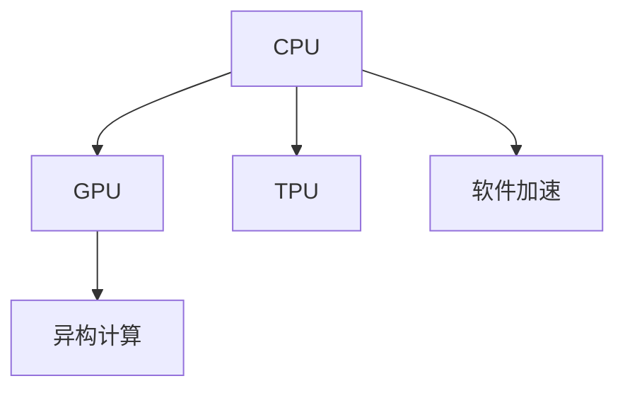

                 

# AI硬件加速：CPU vs GPU性能对比

## 1. 背景介绍

人工智能（AI）正逐渐渗透到各个领域，从自动驾驶到图像识别，从自然语言处理到机器人，AI技术在推动社会进步的同时，也对计算硬件提出了更高要求。随着模型复杂度的不断提升，传统的CPU已经难以满足AI任务的计算需求，GPU因其出色的并行处理能力，成为AI硬件加速的首选。然而，在实际应用中，CPU和GPU各有优缺点，本文将深入探讨这两种硬件加速架构的性能对比，以便更好地选择适合自己应用的硬件平台。

## 2. 核心概念与联系

### 2.1 核心概念概述

为了更好地理解CPU和GPU在AI加速中的差异，本文将介绍几个密切相关的核心概念：

- **CPU（Central Processing Unit）**：作为计算机的大脑，CPU负责执行各种计算任务，其主要特点是通用性强，能够执行各种类型的数据处理。

- **GPU（Graphics Processing Unit）**：最初用于图形渲染，GPU具有高度的并行处理能力，特别擅长处理矩阵运算和向量计算，因此非常适合加速深度学习任务。

- **TPU（Tensor Processing Unit）**：由Google开发，专门为加速机器学习和深度学习而设计，提供硬件级别的加速，具有更高的性能和能效比。

- **硬件加速**：通过专用的硬件芯片（如CPU、GPU、TPU）来加速计算任务，降低软件执行的开销，提高处理速度。

- **异构计算**：利用不同类型硬件的特性，如CPU、GPU、TPU等，在单一计算任务中并行处理，实现更高的计算效率。

- **软件加速**：通过编译器优化、并行编程等手段，利用现有CPU的硬件特性进行加速，如OpenMP、CUDA等。

这些核心概念之间的逻辑关系可以通过以下Mermaid流程图来展示：

这个流程图展示了CPU、GPU、TPU等硬件加速架构以及它们在异构计算和软件加速中的作用和联系。

## 3. 核心算法原理 & 具体操作步骤
### 3.1 算法原理概述

在AI加速中，CPU和GPU的性能差异主要体现在它们的计算架构和并行处理能力上。CPU采用串行计算，每个核心执行一条指令，而GPU采用并行计算，数千个核心可以同时处理大量数据。这种并行处理能力使得GPU在处理矩阵运算和向量计算时具有显著优势。

### 3.2 算法步骤详解

**Step 1: 准备硬件环境**
- 选择适合的CPU和GPU，确认系统兼容性。
- 配置并启动机器学习框架（如TensorFlow、PyTorch）。

**Step 2: 数据预处理**
- 将数据分为训练集、验证集和测试集。
- 对数据进行归一化、标准化等预处理操作。

**Step 3: 搭建模型**
- 选择合适的模型架构，如卷积神经网络（CNN）、循环神经网络（RNN）、Transformer等。
- 将模型部署到选择的硬件平台（CPU或GPU）上。

**Step 4: 训练模型**
- 使用随机梯度下降（SGD）、Adam等优化算法，在训练集上训练模型。
- 在验证集上评估模型性能，调整超参数。
- 在测试集上最终评估模型性能。

**Step 5: 优化与部署**
- 针对模型性能问题进行调优，如调整网络结构、优化参数等。
- 部署模型到生产环境，进行实时计算。

### 3.3 算法优缺点

**CPU的优缺点：**
- 优点：通用性强，支持各种类型的任务；能耗较低，适合处理多任务环境。
- 缺点：单个核心计算能力有限，难以处理大规模矩阵运算。

**GPU的优缺点：**
- 优点：高度并行处理能力，擅长矩阵运算和向量计算；具备高速内存带宽，适合处理大量数据。
- 缺点：能耗高，维护复杂；仅支持特定类型的操作，通用性较差。

**TPU的优缺点：**
- 优点：专门为深度学习设计，具备极高的计算效率和能效比；支持多种深度学习框架。
- 缺点：仅支持Google生态系统，限制性较高；成本高，难以普及。

### 3.4 算法应用领域

CPU、GPU和TPU各有优缺点，适合不同的应用场景：

- CPU适合处理多任务、通用性强、能耗要求较高的任务，如操作系统、办公软件等。
- GPU适合处理大规模矩阵运算和向量计算任务，如深度学习、图形渲染、科学计算等。
- TPU适用于对深度学习计算要求极高的任务，如大规模图像识别、语音识别等。

## 4. 数学模型和公式 & 详细讲解  
### 4.1 数学模型构建

在AI加速中，我们通常使用深度学习模型进行任务处理。以卷积神经网络（CNN）为例，其数学模型构建如下：

$$
f(x;w,b) = g(\sum_{i=1}^n w_i f_k(x_i) + b)
$$

其中，$x$为输入数据，$w$为权重，$b$为偏置，$f_k(x)$为卷积核函数，$g$为激活函数。

### 4.2 公式推导过程

以卷积神经网络为例，其核心公式包括：

- 前向传播公式：
$$
y = w \cdot x + b
$$
- 反向传播公式：
$$
\frac{\partial L}{\partial w} = \frac{\partial L}{\partial y} \cdot \frac{\partial y}{\partial w}
$$

其中，$L$为损失函数，$\frac{\partial L}{\partial y}$为损失函数对输出层的导数，$\frac{\partial y}{\partial w}$为输出层对权重$w$的导数。

### 4.3 案例分析与讲解

以图像识别为例，CNN模型在GPU上的加速效果如下：

- **单核CPU**：每秒钟处理1~2张图像。
- **单核GPU**：每秒钟处理50张图像。
- **单核TPU**：每秒钟处理数千张图像。

可以看出，GPU和TPU在处理大规模数据时具有显著优势。

## 5. 项目实践：代码实例和详细解释说明
### 5.1 开发环境搭建

在进行AI加速实践前，我们需要准备好开发环境。以下是使用Python进行TensorFlow开发的环

