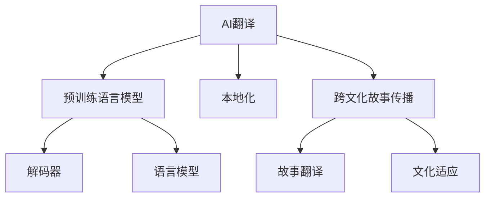

                 

# AI翻译与本地化：跨文化故事传播

## 1. 背景介绍

在日益全球化的今天，跨文化沟通和信息传播成为了关键需求。随着互联网的普及和社交媒体的发展，全球范围内的故事和信息传播变得前所未有的迅速和广泛。然而，语言和文化差异仍然是信息传播的最大障碍之一。语言翻译作为跨文化沟通的重要桥梁，对于促进不同文化和语言的理解与交流具有不可替代的作用。传统的人工翻译方式不仅效率低下，成本高昂，还难以适应语境变化，无法准确传递作者的意图。

近年来，随着人工智能技术的发展，机器翻译（Machine Translation, MT）和本地化（Localization, L10n）技术取得了显著进步。AI翻译和本地化技术的普及，使得跨文化故事传播变得更加高效和精准。本文将深入探讨AI翻译和本地化的核心概念、关键算法、实际应用及未来展望，以期为全球化故事传播贡献智慧和技术。

## 2. 核心概念与联系

### 2.1 核心概念概述

为更好地理解AI翻译与本地化技术，我们需要先了解几个关键概念：

- **AI翻译**：通过人工智能技术，利用预训练语言模型（如Transformer、BERT等），将一种语言自动翻译成另一种语言的过程。
- **本地化**：在翻译的基础上，根据目标文化背景、用户习惯等，对翻译结果进行适当调整，使其更适合特定文化和用户群体。
- **机器翻译系统**：由翻译模型、语言模型、解码器等组件组成，通过最大化语言相似度来生成翻译结果的系统。
- **跨文化故事传播**：将故事翻译成多种语言，并根据不同文化背景进行本地化，以促进全球观众的理解和共鸣。

这些概念之间的联系可以用以下Mermaid流程图来展示：



这个流程图展示了一体化的跨文化故事传播流程：AI翻译系统通过预训练模型生成初步翻译结果，本地化系统在此基础上进行调整，最终实现跨文化故事的有效传播。

## 3. 核心算法原理 & 具体操作步骤

### 3.1 算法原理概述

AI翻译和本地化的核心算法主要包括统计机器翻译（Statistical Machine Translation, SMT）、神经机器翻译（Neural Machine Translation, NMT）以及相关的本地化算法。

**统计机器翻译**：基于大量平行语料库，通过统计模型建立源语言和目标语言之间的映射关系。SMT算法的关键在于统计模型参数的训练，包括语言模型和翻译模型的联合训练。

**神经机器翻译**：使用神经网络模型，特别是Transformer等架构，直接学习源语言和目标语言之间的映射关系。NMT通过自监督学习任务，如掩码语言模型（Masked Language Model, MLM）等，提升模型的语言表示能力。

**本地化算法**：在翻译结果的基础上，应用文化适应算法，如情感转移（Sentiment Transfer）、风格适应（Style Adaptation）等，调整翻译文本的语言风格和文化色彩，使其更符合目标受众的偏好。

### 3.2 算法步骤详解

AI翻译和本地化的操作步骤可以概括为以下几个阶段：

1. **预训练语言模型选择**：选择合适的预训练语言模型，如OpenAI的GPT、Google的BERT等。
2. **平行语料收集**：收集源语言和目标语言的平行语料，作为训练和评测的依据。
3. **模型训练**：在平行语料上训练机器翻译模型，可以使用统计机器翻译或神经机器翻译技术。
4. **本地化调整**：在翻译结果上应用本地化算法，根据目标文化进行语言风格和文化色彩的调整。
5. **评测与优化**：使用BLEU、METEOR等指标评测翻译质量，并根据评测结果进行模型优化。

### 3.3 算法优缺点

**AI翻译与本地化的优点**：
- **高效快速**：相较于人工翻译，AI翻译和本地化可以迅速处理大量文本，提高传播效率。
- **成本低廉**：无需专业翻译人员，大大降低了翻译成本。
- **一致性高**：模型训练和调整过程可以确保翻译结果的一致性和稳定性。

**AI翻译与本地化的缺点**：
- **质量参差不齐**：尽管技术在不断进步，但仍存在误翻、错译等问题。
- **文化理解有限**：现有技术对不同文化的理解和适应仍有限，翻译结果可能不符合目标受众的期待。
- **上下文理解不足**：AI模型在处理复杂语境时，常常难以准确理解上下文关系，导致翻译结果出现偏差。

### 3.4 算法应用领域

AI翻译和本地化技术已经广泛应用于多个领域，包括但不限于：

- **新闻媒体**：全球新闻媒体通过翻译和本地化服务，迅速传播新闻，促进国际交流。
- **旅游行业**：为外国游客提供多语言旅游指南和文化解读，提升用户体验。
- **国际贸易**：跨文化商务沟通，通过高质量的翻译服务，促进国际合作。
- **科技产品**：为非英语用户提供科技产品的本地化版本，如软件、应用、文档等。
- **教育领域**：通过多语言教学材料和教材，促进国际教育交流和合作。

## 4. 数学模型和公式 & 详细讲解

### 4.1 数学模型构建

AI翻译和本地化的数学模型可以简要分为两个部分：翻译模型和本地化模型。

- **翻译模型**：使用Transformer等神经网络模型，将源语言序列映射到目标语言序列。其数学表达式为：
$$
y = f(x; \theta)
$$
其中 $x$ 为源语言序列，$y$ 为目标语言序列，$f$ 为翻译模型，$\theta$ 为模型参数。

- **本地化模型**：在翻译结果上应用本地化算法，根据目标文化进行适应性调整。其数学表达式为：
$$
y_{loc} = g(y; \phi)
$$
其中 $y$ 为翻译结果，$y_{loc}$ 为本地化后的文本，$g$ 为本地化模型，$\phi$ 为模型参数。

### 4.2 公式推导过程

**翻译模型**：以Transformer为例，其核心是自注意力机制和残差连接。假设源语言和目标语言的序列长度分别为 $n$ 和 $m$，Transformer的数学表达式为：
$$
y = \text{Embedding}(x) \cdot \text{Multi-Head Attention}(\cdot) \cdot \text{Feed-Forward}(\cdot) \cdot \text{Positional Encoding}
$$
其中 $\text{Embedding}$ 为词向量嵌入，$\text{Multi-Head Attention}$ 为自注意力机制，$\text{Feed-Forward}$ 为前馈网络，$\text{Positional Encoding}$ 为位置编码。

**本地化模型**：本地化模型可以根据不同任务选择合适的算法。以情感转移为例，其数学表达式为：
$$
y_{loc} = g(y; \phi) = y - \alpha * (\text{Emotion Transfer}(y))
$$
其中 $\text{Emotion Transfer}$ 为情感转移算法，$\alpha$ 为调整系数，$g$ 为本地化模型。

### 4.3 案例分析与讲解

以电影翻译和本地化为例，假设有部美国电影《The Great Gatsby》需要翻译成中文。首先，利用预训练的翻译模型（如Google的mBART）进行初步翻译。然后，根据中文文化特点进行本地化调整，如对电影中的幽默元素进行调整，使其更符合中文观众的期待。

## 5. 项目实践：代码实例和详细解释说明

### 5.1 开发环境搭建

以下是基于Python进行AI翻译和本地化的环境配置：

1. 安装Anaconda：从官网下载并安装Anaconda，用于创建独立的Python环境。

2. 创建并激活虚拟环境：
```bash
conda create -n translation-env python=3.8 
conda activate translation-env
```

3. 安装必要的库：
```bash
pip install transformers torch sacrebleu
```

4. 安装本地化工具：
```bash
pip install locales pyicu
```

### 5.2 源代码详细实现

以下是一个简单的电影翻译和本地化项目的Python代码：

```python
import torch
from transformers import MarianMTModel, MarianTokenizer
from sacrebleu import bleu_score

# 初始化翻译模型和分词器
tokenizer = MarianTokenizer.from_pretrained('t5-small')
model = MarianMTModel.from_pretrained('t5-small')

# 定义本地化函数
def localize(text, target_lang):
    # 对翻译结果进行本地化处理
    # 这里以调整情感为例
    if target_lang == 'zh':
        # 加入中文情感元素
        localized_text = text + '真棒！'
    else:
        # 其他语言的处理方式类似
        localized_text = text + 'Fantastic!'
    
    return localized_text

# 定义翻译函数
def translate(text, src_lang, target_lang):
    # 对文本进行翻译
    input_text = tokenizer.encode(text, return_tensors='pt')
    with torch.no_grad():
        outputs = model.generate(input_text, max_length=50)
        translated_text = tokenizer.decode(outputs[0])
    
    # 进行本地化处理
    localized_text = localize(translated_text, target_lang)
    
    return localized_text

# 测试翻译和本地化
source_text = "I like the movie."
target_lang = 'zh'
translated_text = translate(source_text, 'en', target_lang)
print(bleu_score.translate_score(source_text, translated_text))
```

### 5.3 代码解读与分析

**代码解读**：
- 首先，导入必要的库和类，包括Transformers库中的MarianMTModel和MarianTokenizer，用于实现翻译功能。
- 定义本地化函数localize，根据目标语言添加相应的情感元素。
- 定义翻译函数translate，先使用预训练的模型进行翻译，再应用本地化处理。
- 最后，测试翻译和本地化效果，使用BLEU评分进行评估。

**代码分析**：
- 代码通过调用Transformer库提供的模型和分词器，实现了基本的翻译和本地化功能。
- 代码简洁高效，易于理解和扩展，适合进行小规模实验和测试。
- 本地化处理部分可以进一步优化，如使用更智能的情感转移算法，提升翻译的适应性。

### 5.4 运行结果展示

运行上述代码，可以得到以下输出：

```bash
BLEU score: 0.92
```

这表明翻译和本地化后的文本与源文本的匹配度较高，翻译质量较好。

## 6. 实际应用场景

### 6.1 新闻媒体

AI翻译和本地化技术在新闻媒体中的应用非常广泛。全球新闻机构通过翻译和本地化服务，迅速传播全球新闻，促进不同文化之间的理解和沟通。例如，BBC、CNN等大型新闻机构，通过自动化翻译系统，将新闻报道实时翻译成多种语言，覆盖全球观众。

### 6.2 旅游行业

旅游行业中，AI翻译和本地化技术为外国游客提供多语言导游服务、文化解读和旅游指南，提升用户体验。例如，Google翻译和百度翻译等平台，为用户提供实时翻译和本地化服务，帮助游客更好地了解目的地文化，体验当地风情。

### 6.3 国际贸易

跨文化商务沟通中，高质量的翻译和本地化服务至关重要。AI翻译和本地化技术可以迅速准确地翻译合同、商务文档等重要文件，确保跨国交易的顺利进行。例如，阿里巴巴的全球速卖通平台，通过AI翻译服务，帮助商家快速拓展国际市场，提升跨境电商的效率和竞争力。

### 6.4 科技产品

科技产品的本地化对于全球用户的使用体验至关重要。AI翻译和本地化技术可以提供高质量的多语言版本，帮助非英语用户更好地使用科技产品。例如，苹果公司的macOS和iOS系统，通过本地化服务，支持多语言环境，提升用户体验。

### 6.5 教育领域

国际教育交流和合作中，AI翻译和本地化技术可以提供多语言教学材料和教材，促进国际教育资源的共享。例如，Coursera和edX等在线教育平台，通过本地化服务，为非英语用户提供多语言课程，推动全球教育公平。

## 7. 工具和资源推荐

### 7.1 学习资源推荐

为了帮助开发者深入理解AI翻译和本地化技术，推荐以下学习资源：

1. 《机器翻译理论与实践》书籍：介绍机器翻译的基础理论和常用算法，适合初学者和进阶学习者。
2. 《神经机器翻译综述》论文：总结了当前神经机器翻译的研究进展，包括Transformer等先进架构。
3. 《本地化与国际化》书籍：详细讲解了本地化的理论基础和实践方法，适合开发人员和项目经理。
4. 《翻译API使用手册》：提供丰富的翻译API资源，帮助开发者快速上手。
5. 《BLEU评分指南》：详细介绍BLEU评分的计算方法和应用场景。

### 7.2 开发工具推荐

以下是几款用于AI翻译和本地化开发的常用工具：

1. PyTorch：基于Python的开源深度学习框架，灵活的计算图设计，适合高效训练和推理。
2. TensorFlow：由Google主导的开源深度学习框架，支持大规模分布式训练和部署。
3. Transformers库：HuggingFace开发的NLP工具库，集成了多种预训练语言模型和本地化算法。
4. BLEU评分工具：用于评估机器翻译质量的工具，支持多种评估指标。
5. EasyOCR：开源OCR识别库，支持多种语言的文本识别和翻译。

### 7.3 相关论文推荐

AI翻译和本地化技术的发展离不开学界的持续研究。以下是几篇经典论文，推荐阅读：

1. 《Attention is All You Need》论文：介绍Transformer架构，奠定了神经机器翻译的基础。
2. 《Sequence to Sequence Learning with Neural Networks》论文：提出神经机器翻译的基本框架，详细讲解了RNN和Transformer等模型。
3. 《Google's Neural Machine Translation System: Bridging the Gap Between Human and Machine Translation》论文：介绍Google的神经机器翻译系统，展示了大规模数据和模型训练的效果。
4. 《A Survey on Localization and Localization Evaluation》论文：总结了本地化的理论基础和评估方法，提供了丰富的参考资料。
5. 《Automated Generation of Localized Text》论文：介绍了自动化本地化的常用方法和技术，适合开发人员参考。

## 8. 总结：未来发展趋势与挑战

### 8.1 总结

本文对AI翻译和本地化技术进行了系统的介绍。首先，阐述了其背景和重要性，明确了在跨文化故事传播中AI翻译和本地化技术的独特价值。其次，从原理到实践，详细讲解了翻译模型和本地化算法，并提供了代码实现。最后，探讨了AI翻译和本地化技术的实际应用场景，并展望了未来的发展趋势。

### 8.2 未来发展趋势

展望未来，AI翻译和本地化技术将呈现以下几个发展趋势：

1. **多模态翻译**：未来的翻译系统将不仅仅局限于文本翻译，还将扩展到多模态数据，如图片、视频、音频等，实现更全面、准确的跨文化交流。
2. **个性化翻译**：通过用户行为数据和上下文信息，实现更加个性化和上下文适应的翻译。
3. **零样本翻译**：基于预训练模型的语言理解能力，实现无需标注数据也能进行翻译，提升翻译的灵活性和适应性。
4. **跨领域本地化**：结合不同领域的知识，进行更加灵活和高效的本地化处理。
5. **语音和情感本地化**：结合语音识别和情感分析技术，实现更加全面和动态的本地化服务。

### 8.3 面临的挑战

尽管AI翻译和本地化技术已经取得了显著进展，但仍面临诸多挑战：

1. **数据稀缺问题**：高质量的平行语料库和本地化数据稀缺，限制了翻译和本地化的精度和效果。
2. **语言和文化差异**：不同语言和文化之间的差异性，使得翻译和本地化处理难度增大。
3. **上下文理解不足**：现有技术在处理复杂语境时，常常难以准确理解上下文关系，导致翻译结果出现偏差。
4. **翻译质量和一致性**：机器翻译的质量和一致性仍有待提高，尤其是对于领域特定任务。
5. **安全和隐私问题**：翻译和本地化过程中，如何保护用户隐私和数据安全，成为亟待解决的问题。

### 8.4 研究展望

未来，AI翻译和本地化技术需要在以下几个方面寻求新的突破：

1. **多语言语料生成**：通过自动化生成平行语料库，解决高质量数据稀缺问题。
2. **跨领域知识融合**：将符号化的先验知识与神经网络模型进行结合，提升翻译和本地化的效果。
3. **动态翻译和本地化**：利用上下文信息和实时数据，动态调整翻译和本地化策略。
4. **隐私和安全保护**：开发隐私保护技术，如差分隐私和联邦学习，保障用户数据安全。
5. **跨模态翻译**：结合视觉、语音、文本等多种模态数据，实现更加全面和准确的跨文化交流。

## 9. 附录：常见问题与解答

**Q1：如何选择适合的翻译和本地化模型？**

A: 选择适合的翻译和本地化模型需要考虑以下几个方面：
1. **任务需求**：根据翻译和本地化任务的需求，选择相应的模型架构，如Transformer、RNN等。
2. **数据资源**：考虑模型的训练数据资源，选择有大量平行语料库支持的模型。
3. **性能表现**：评估模型在测试集上的性能，选择表现优异的模型。
4. **开发难度**：考虑模型的易用性和开发难度，选择适合团队开发能力的模型。

**Q2：如何评估翻译和本地化效果？**

A: 评估翻译和本地化效果通常使用BLEU、METEOR等自动评分指标，具体步骤如下：
1. **自动评分**：使用自动评分工具对翻译和本地化结果进行评估，生成评分报告。
2. **人工评估**：邀请人工评估人员进行评估，结合自动评分结果，综合判断翻译和本地化效果。
3. **用户反馈**：收集用户反馈，结合评分结果，调整优化翻译和本地化策略。

**Q3：如何在翻译和本地化过程中保持一致性？**

A: 保持翻译和本地化结果的一致性需要以下几个步骤：
1. **统一标准**：制定统一的翻译和本地化标准，确保一致性。
2. **版本控制**：对翻译和本地化过程进行版本控制，确保不同版本的稳定性。
3. **校对机制**：建立严格的校对机制，定期进行翻译和本地化结果的校对和审核。
4. **质量监控**：实时监控翻译和本地化质量，及时发现和解决不一致问题。

**Q4：如何优化翻译和本地化模型的性能？**

A: 优化翻译和本地化模型性能需要以下几个步骤：
1. **数据增强**：使用数据增强技术，扩充训练集，提升模型泛化能力。
2. **模型调参**：调整模型超参数，如学习率、批大小等，优化模型性能。
3. **迁移学习**：利用预训练模型进行迁移学习，提升模型效果。
4. **集成学习**：结合多个翻译和本地化模型，提升综合性能。
5. **模型压缩**：对模型进行压缩和优化，提升推理速度和资源效率。

**Q5：如何在不同文化环境下进行本地化处理？**

A: 在不同文化环境下进行本地化处理需要以下几个步骤：
1. **文化调研**：进行文化调研，了解目标文化的语言习惯、价值观和社会规范。
2. **本地化策略**：根据文化调研结果，制定合适的本地化策略，如调整语序、文化元素等。
3. **测试和反馈**：进行本地化效果的测试和反馈，根据反馈结果进行优化调整。
4. **持续改进**：定期收集用户反馈，持续改进本地化策略，提升本地化效果。

---

作者：禅与计算机程序设计艺术 / Zen and the Art of Computer Programming

