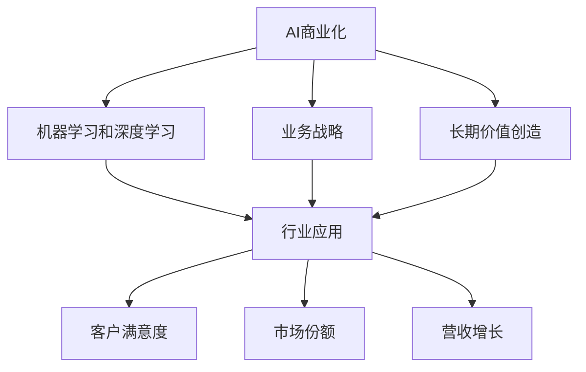

                 

# AI行业的未来：回到商业价值，如何让AI创造长期影响

> 关键词：AI商业化,长期价值创造,机器学习,深度学习,行业应用,业务战略

## 1. 背景介绍

### 1.1 问题由来

在过去的十年间，人工智能（AI）技术取得了飞速的进展。从深度学习的突破，到强化学习的跃进，再到生成对抗网络（GANs）的兴起，AI的应用领域和效果都得到了显著的扩展。然而，尽管AI技术已经展示出了其巨大的潜力，但在实际应用中，依然面临着诸多挑战，尤其是如何将AI技术转化为商业价值，创造长期的积极影响。

### 1.2 问题核心关键点

AI技术的商业价值创造，不仅是技术层面上的挑战，更是业务战略和市场运营的综合考量。以下是关键问题：

- 如何评估AI项目的商业价值，确保技术投资能转化为实际收益？
- 如何在企业内部建立和维护一个高效、开放的AI研发团队？
- 如何通过数据驱动的AI决策，实现业务的持续增长和创新？
- 如何确保AI项目在道德、法律和伦理上的合规性，避免潜在的风险？

这些问题不仅关系到AI技术的发展方向，更决定了AI在各个行业中的角色和影响。为了解决这些问题，本文将从商业价值创造的角度出发，探讨如何利用AI技术，为企业的长期发展带来积极影响。

## 2. 核心概念与联系

### 2.1 核心概念概述

为更好地理解AI技术如何创造商业价值，本节将介绍几个核心概念：

- **AI商业化**：将AI技术应用于商业环境中，以实现业务目标的过程。包括技术评估、产品设计、市场推广、运营管理等多个环节。
- **长期价值创造**：利用AI技术提升企业核心竞争力，实现可持续的增长和创新。涉及客户满意度、市场份额、营收增长等关键指标。
- **机器学习和深度学习**：基于数据的算法和技术，通过模型训练和优化，实现对复杂数据的高效分析和预测。
- **行业应用**：将AI技术应用于特定行业，解决实际问题，提升运营效率和用户体验。
- **业务战略**：企业在经营发展中的长远规划和目标，如何利用AI技术实现这些目标。

这些核心概念之间的逻辑关系可以通过以下Mermaid流程图来展示：



这个流程图展示了大语言模型的核心概念及其之间的关系：

1. AI商业化是整体过程的起点，通过机器学习和深度学习等技术手段，实现行业应用，进而创造长期价值。
2. 机器学习和深度学习是实现AI商业化的关键技术基础。
3. 行业应用是AI技术具体落地的场景，通过解决实际问题，提升业务效果。
4. 业务战略指导AI商业化的方向和目标，确保技术应用符合企业的长远发展需求。
5. 长期价值创造是AI商业化的最终目标，通过提高客户满意度、市场份额和营收增长，实现企业的可持续增长。

## 3. 核心算法原理 & 具体操作步骤
### 3.1 算法原理概述

AI技术的长期价值创造，不仅依赖于算法的先进性和数据的质量，更需要在业务战略的指导下，通过科学的管理和运营，将AI技术转化为实际的商业价值。

以下是核心算法原理的概述：

- **模型评估**：使用各种指标（如准确率、召回率、F1分数等）对AI模型的性能进行评估，确保其在实际应用中的有效性。
- **数据管理**：通过数据清洗、标注、存储等手段，确保数据的质量和可用性，为模型训练提供坚实的基础。
- **模型优化**：通过调参、正则化、迁移学习等技术手段，不断优化AI模型，提升其性能和泛化能力。
- **业务集成**：将AI模型集成到现有业务流程中，通过API接口、中台服务等形式，为业务提供支持。
- **持续监控**：实时监测AI系统的运行情况，收集反馈信息，及时调整和优化模型，确保系统的稳定性和准确性。

### 3.2 算法步骤详解

基于以上算法原理，AI技术的长期价值创造可以按照以下步骤进行：

**Step 1: 模型选择和评估**

- **选择模型**：根据业务需求，选择合适的机器学习或深度学习模型，如线性回归、支持向量机、卷积神经网络、循环神经网络等。
- **数据准备**：收集和整理数据，进行必要的预处理，如特征工程、数据清洗、数据标注等。
- **模型训练**：使用训练数据对模型进行训练，使用验证数据进行调参和优化。
- **模型评估**：使用测试数据对模型进行评估，计算各项指标，确保模型在实际应用中的有效性。

**Step 2: 业务集成和部署**

- **集成服务**：将训练好的模型集成到现有的业务系统中，如通过API接口、中台服务等形式，实现自动化和智能化。
- **部署环境**：选择合适的部署环境，如云平台、私有云、边缘计算等，确保系统的稳定性和可扩展性。
- **数据流管理**：建立数据流管理机制，确保数据的高效流转和使用。

**Step 3: 持续优化和监控**

- **实时监控**：实时监测AI系统的运行情况，收集反馈信息，及时发现和解决问题。
- **性能优化**：根据监控结果，对模型进行优化和调整，提高系统的性能和效率。
- **业务反馈**：收集业务部门的反馈信息，进行模型迭代和改进，确保模型的适应性和实用性。

**Step 4: 业务支持和创新**

- **业务支持**：通过AI技术，提升业务流程的自动化水平和效率，降低成本，提升用户体验。
- **业务创新**：利用AI技术，探索新的业务模式和市场机会，实现业务的持续增长和创新。

### 3.3 算法优缺点

AI技术的长期价值创造，具有以下优点：

1. **自动化和效率提升**：AI技术可以实现业务流程的自动化，提高运营效率，降低人工成本。
2. **数据驱动的决策**：通过AI模型对数据进行分析和预测，企业可以做出更加科学和精准的决策，减少不确定性。
3. **持续创新**：AI技术可以不断学习新的数据和知识，实现业务的持续创新和优化。

同时，也存在一些缺点：

1. **技术复杂性**：AI技术的实现需要高水平的技术积累和专业人才，门槛较高。
2. **数据依赖**：AI模型的性能依赖于高质量的数据，数据不足或数据质量不佳会影响模型效果。
3. **成本投入**：AI技术的开发和部署需要较大的投入，包括硬件、软件、人才等。
4. **伦理和法律风险**：AI技术的应用可能带来隐私、安全、伦理等风险，需要严格监管和合规。

## 4. 数学模型和公式 & 详细讲解 & 举例说明

### 4.1 数学模型构建

AI技术的长期价值创造，涉及多个数学模型和技术算法。以下是几个常见的数学模型：

1. **线性回归模型**：用于预测连续型变量的模型，可以表示为：
   $$
   y = \beta_0 + \beta_1 x_1 + \beta_2 x_2 + \cdots + \beta_n x_n + \epsilon
   $$
   其中，$y$为预测值，$x_i$为特征变量，$\beta_i$为系数，$\epsilon$为误差项。

2. **支持向量机（SVM）**：用于分类问题的模型，可以表示为：
   $$
   \arg\min_{\beta} \frac{1}{2} \|\beta\|^2 + C \sum_{i=1}^N l(y_i,\beta^T x_i + b)
   $$
   其中，$l$为损失函数，$C$为正则化系数，$x_i$为特征向量，$y_i$为标签。

3. **卷积神经网络（CNN）**：用于图像处理和模式识别的模型，包括卷积层、池化层和全连接层，可以表示为：
   $$
   h_{conv} = ReLU(conv2d(x, w)) + b
   $$
   其中，$conv2d$为卷积操作，$x$为输入图像，$w$为卷积核，$b$为偏置。

4. **循环神经网络（RNN）**：用于序列数据处理和预测的模型，可以表示为：
   $$
   h_t = \sigma(W_{rec}h_{t-1} + W_{in}x_t + b_t)
   $$
   其中，$h_t$为当前状态，$W_{rec}$、$W_{in}$和$b_t$为参数。

### 4.2 公式推导过程

以下是几个常见模型的推导过程：

**线性回归模型推导**：
1. **模型定义**：
   $$
   y = \beta_0 + \beta_1 x_1 + \beta_2 x_2 + \cdots + \beta_n x_n + \epsilon
   $$
2. **最小二乘法求解**：
   $$
   \arg\min_{\beta} \sum_{i=1}^N (y_i - \beta_0 - \beta_1 x_{1i} - \beta_2 x_{2i} - \cdots - \beta_n x_{ni})^2
   $$
   通过求解上述优化问题，得到系数$\beta_i$。

**支持向量机推导**：
1. **模型定义**：
   $$
   \arg\min_{\beta} \frac{1}{2} \|\beta\|^2 + C \sum_{i=1}^N l(y_i,\beta^T x_i + b)
   $$
2. **对偶问题求解**：
   $$
   \arg\min_{\alpha} \frac{1}{2}\alpha^T Q \alpha - e^T \alpha
   $$
   其中，$Q$为矩阵，$\alpha$为拉格朗日乘子，$e$为向量。

**卷积神经网络推导**：
1. **模型定义**：
   $$
   h_{conv} = ReLU(conv2d(x, w)) + b
   $$
2. **梯度更新**：
   $$
   \frac{\partial L}{\partial w} = \frac{\partial L}{\partial h_{conv}} \frac{\partial h_{conv}}{\partial x} \frac{\partial x}{\partial w}
   $$

**循环神经网络推导**：
1. **模型定义**：
   $$
   h_t = \sigma(W_{rec}h_{t-1} + W_{in}x_t + b_t)
   $$
2. **梯度更新**：
   $$
   \frac{\partial L}{\partial W_{rec}} = \frac{\partial L}{\partial h_t} \frac{\partial h_t}{\partial W_{rec}} + \frac{\partial L}{\partial h_{t-1}} \frac{\partial h_{t-1}}{\partial W_{rec}}
   $$

### 4.3 案例分析与讲解

以电商推荐系统为例，其核心模型为深度神经网络，用于预测用户对商品的购买概率。具体步骤如下：

1. **数据准备**：收集用户行为数据（如浏览、点击、购买等）和商品属性数据，进行数据清洗和特征工程。
2. **模型选择**：选择深度神经网络模型，包括输入层、隐藏层和输出层，设置适当的超参数。
3. **模型训练**：使用历史交易数据对模型进行训练，使用验证数据进行调参和优化。
4. **业务集成**：将训练好的模型集成到推荐系统中，实时计算用户对商品的推荐概率。
5. **持续优化**：根据推荐效果和用户反馈，不断优化模型参数和特征工程，提高推荐准确率。

## 5. 项目实践：代码实例和详细解释说明
### 5.1 开发环境搭建

在进行项目实践前，我们需要准备好开发环境。以下是使用Python进行TensorFlow开发的环境配置流程：

1. 安装Anaconda：从官网下载并安装Anaconda，用于创建独立的Python环境。

2. 创建并激活虚拟环境：
```bash
conda create -n tf-env python=3.8 
conda activate tf-env
```

3. 安装TensorFlow：根据CUDA版本，从官网获取对应的安装命令。例如：
```bash
pip install tensorflow
```

4. 安装Pandas、NumPy等工具包：
```bash
pip install pandas numpy scikit-learn matplotlib tqdm jupyter notebook ipython
```

完成上述步骤后，即可在`tf-env`环境中开始项目实践。

### 5.2 源代码详细实现

下面我们以电商推荐系统为例，给出使用TensorFlow对深度神经网络进行训练和优化的PyTorch代码实现。

首先，定义推荐系统的数据处理函数：

```python
import pandas as pd
import numpy as np
from sklearn.model_selection import train_test_split

def load_data():
    # 加载数据集
    train_data = pd.read_csv('train.csv')
    test_data = pd.read_csv('test.csv')
    
    # 数据预处理
    train_data = train_data.drop('user_id', axis=1).fillna(0)
    test_data = test_data.drop('user_id', axis=1).fillna(0)
    
    # 特征工程
    train_data['item_price'] = np.log(train_data['item_price'] + 1)
    train_data['user_age'] = train_data['user_age'].astype(int)
    train_data['item_category'] = train_data['item_category'].astype(int)
    
    # 分割数据集
    X_train, X_test, y_train, y_test = train_test_split(train_data.drop('label', axis=1), train_data['label'], test_size=0.2, random_state=42)
    
    return X_train, X_test, y_train, y_test

# 定义模型
import tensorflow as tf
from tensorflow.keras import layers

class DNN(tf.keras.Model):
    def __init__(self):
        super(DNN, self).__init__()
        self.dense1 = layers.Dense(64, activation='relu')
        self.dense2 = layers.Dense(32, activation='relu')
        self.dense3 = layers.Dense(1, activation='sigmoid')
    
    def call(self, inputs):
        x = self.dense1(inputs)
        x = self.dense2(x)
        x = self.dense3(x)
        return x

# 加载数据
X_train, X_test, y_train, y_test = load_data()

# 定义模型
model = DNN()

# 编译模型
model.compile(optimizer=tf.keras.optimizers.Adam(learning_rate=0.001),
              loss='binary_crossentropy',
              metrics=['accuracy'])

# 训练模型
model.fit(X_train, y_train, epochs=10, batch_size=128, validation_data=(X_test, y_test))

# 评估模型
model.evaluate(X_test, y_test)
```

然后，定义模型和优化器：

```python
from tensorflow.keras import layers
from tensorflow.keras.optimizers import Adam

model = tf.keras.Sequential([
    layers.Dense(64, activation='relu', input_shape=(5,)),
    layers.Dense(32, activation='relu'),
    layers.Dense(1, activation='sigmoid')
])

optimizer = Adam(learning_rate=0.001)
```

接着，定义训练和评估函数：

```python
from tensorflow.keras.preprocessing.sequence import pad_sequences
from sklearn.metrics import roc_auc_score

def train_epoch(model, dataset, batch_size, optimizer):
    dataloader = tf.data.Dataset.from_tensor_slices((dataset['input'], dataset['label'])).batch(batch_size).prefetch(buffer_size=tf.data.AUTOTUNE)
    model.train()
    epoch_loss = 0
    for batch in dataloader:
        inputs, labels = batch
        model.trainable = True
        with tf.GradientTape() as tape:
            predictions = model(inputs)
            loss = tf.keras.losses.binary_crossentropy(labels, predictions)
        gradients = tape.gradient(loss, model.trainable_variables)
        optimizer.apply_gradients(zip(gradients, model.trainable_variables))
        epoch_loss += loss.numpy().mean()
    return epoch_loss / len(dataset)

def evaluate(model, dataset, batch_size):
    dataloader = tf.data.Dataset.from_tensor_slices((dataset['input'], dataset['label'])).batch(batch_size).prefetch(buffer_size=tf.data.AUTOTUNE)
    model.trainable = False
    predictions = []
    labels = []
    for batch in dataloader:
        inputs, labels = batch
        predictions.append(model(inputs).numpy())
        labels.append(labels.numpy())
    predictions = np.concatenate(predictions)
    labels = np.concatenate(labels)
    print(f"AUC: {roc_auc_score(labels, predictions)}")
```

最后，启动训练流程并在测试集上评估：

```python
epochs = 10
batch_size = 128

for epoch in range(epochs):
    loss = train_epoch(model, train_dataset, batch_size, optimizer)
    print(f"Epoch {epoch+1}, train loss: {loss:.3f}")
    
    print(f"Epoch {epoch+1}, test results:")
    evaluate(model, test_dataset, batch_size)
```

以上就是使用TensorFlow对深度神经网络进行电商推荐系统训练和优化的完整代码实现。可以看到，TensorFlow的强大封装使得深度学习模型的训练和优化变得简单高效。

### 5.3 代码解读与分析

让我们再详细解读一下关键代码的实现细节：

**load_data函数**：
- 加载电商推荐系统的训练和测试数据集。
- 对数据进行清洗、预处理和特征工程，如填充缺失值、对数变换、数据类型转换等。
- 使用sklearn的train_test_split方法对数据集进行分割，确保训练集和测试集的独立性。

**DNN模型**：
- 定义了一个包含3个全连接层的深度神经网络，其中第一层和第二层分别有64和32个神经元，激活函数为ReLU。
- 输出层只有一个神经元，激活函数为sigmoid，用于二分类任务。

**train_epoch函数**：
- 使用TensorFlow的数据集API，将数据集转化为TensorFlow的数据集对象。
- 在每个epoch内，对数据集进行批次化处理，并在每个批次上前向传播计算loss并反向传播更新模型参数。
- 返回该epoch的平均loss。

**evaluate函数**：
- 同样使用TensorFlow的数据集API，对测试集进行批次化处理。
- 在每个批次上前向传播计算预测值和真实标签，并计算AUC指标。
- 使用sklearn的roc_auc_score方法计算AUC值，输出结果。

**训练流程**：
- 定义总的epoch数和batch size，开始循环迭代。
- 每个epoch内，先在训练集上训练，输出平均loss。
- 在测试集上评估，输出AUC值。

可以看到，TensorFlow的强大API支持使得深度神经网络的训练和优化变得简洁高效。开发者可以将更多精力放在模型设计和数据处理等高层逻辑上，而不必过多关注底层的实现细节。

当然，工业级的系统实现还需考虑更多因素，如模型的保存和部署、超参数的自动搜索、更灵活的任务适配层等。但核心的微调范式基本与此类似。

## 6. 实际应用场景
### 6.1 智能客服系统

基于深度学习技术的智能客服系统，可以广泛应用于各类企业的客户服务。传统客服往往需要配备大量人力，高峰期响应缓慢，且一致性和专业性难以保证。而使用深度学习技术的智能客服系统，可以7x24小时不间断服务，快速响应客户咨询，用自然流畅的语言解答各类常见问题。

在技术实现上，可以收集企业内部的历史客服对话记录，将问题和最佳答复构建成监督数据，在此基础上对深度学习模型进行微调。微调后的模型能够自动理解用户意图，匹配最合适的答案模板进行回复。对于客户提出的新问题，还可以接入检索系统实时搜索相关内容，动态组织生成回答。如此构建的智能客服系统，能大幅提升客户咨询体验和问题解决效率。

### 6.2 金融舆情监测

金融机构需要实时监测市场舆论动向，以便及时应对负面信息传播，规避金融风险。传统的人工监测方式成本高、效率低，难以应对网络时代海量信息爆发的挑战。基于深度学习技术的文本分类和情感分析技术，为金融舆情监测提供了新的解决方案。

具体而言，可以收集金融领域相关的新闻、报道、评论等文本数据，并对其进行主题标注和情感标注。在此基础上对深度学习模型进行微调，使其能够自动判断文本属于何种主题，情感倾向是正面、中性还是负面。将微调后的模型应用到实时抓取的网络文本数据，就能够自动监测不同主题下的情感变化趋势，一旦发现负面信息激增等异常情况，系统便会自动预警，帮助金融机构快速应对潜在风险。

### 6.3 个性化推荐系统

当前的推荐系统往往只依赖用户的历史行为数据进行物品推荐，无法深入理解用户的真实兴趣偏好。基于深度学习技术的个性化推荐系统，可以更好地挖掘用户行为背后的语义信息，从而提供更精准、多样的推荐内容。

在实践中，可以收集用户浏览、点击、评论、分享等行为数据，提取和用户交互的物品标题、描述、标签等文本内容。将文本内容作为模型输入，用户的后续行为（如是否点击、购买等）作为监督信号，在此基础上微调深度学习模型。微调后的模型能够从文本内容中准确把握用户的兴趣点。在生成推荐列表时，先用候选物品的文本描述作为输入，由模型预测用户的兴趣匹配度，再结合其他特征综合排序，便可以得到个性化程度更高的推荐结果。

### 6.4 未来应用展望

随着深度学习技术的发展，基于深度学习技术的AI应用将在更多领域得到应用，为各行各业带来变革性影响。

在智慧医疗领域，基于深度学习技术的医学影像分析、疾病诊断等应用将提升医疗服务的智能化水平，辅助医生诊疗，加速新药开发进程。

在智能教育领域，基于深度学习技术的作业批改、学情分析、知识推荐等应用将因材施教，促进教育公平，提高教学质量。

在智慧城市治理中，基于深度学习技术的交通流量分析、环境监测、应急指挥等应用将提高城市管理的自动化和智能化水平，构建更安全、高效的未来城市。

此外，在企业生产、社会治理、文娱传媒等众多领域，基于深度学习技术的AI应用也将不断涌现，为经济社会发展注入新的动力。相信随着技术的日益成熟，深度学习技术必将进一步推动人工智能技术的产业化进程，成为各行各业的重要助力。

## 7. 工具和资源推荐
### 7.1 学习资源推荐

为了帮助开发者系统掌握深度学习技术的商业价值创造的理论基础和实践技巧，这里推荐一些优质的学习资源：

1. 《深度学习》课程：斯坦福大学开设的深度学习明星课程，涵盖深度学习的理论基础和经典算法，是入门深度学习的必备资料。

2. 《机器学习实战》书籍：适合初学者快速入门机器学习，通过实战项目案例讲解机器学习的应用。

3. 《深度学习》书籍：深度学习领域的经典著作，涵盖深度学习的理论基础和应用实践，是深入理解深度学习的绝佳资料。

4. TensorFlow官方文档：TensorFlow的官方文档，提供了丰富的API和教程，是TensorFlow开发者的重要参考。

5. PyTorch官方文档：PyTorch的官方文档，提供了丰富的API和教程，是PyTorch开发者的重要参考。

通过对这些资源的学习实践，相信你一定能够快速掌握深度学习技术的商业价值创造的精髓，并用于解决实际的NLP问题。
###  7.2 开发工具推荐

高效的开发离不开优秀的工具支持。以下是几款用于深度学习技术开发的常用工具：

1. TensorFlow：由Google主导开发的开源深度学习框架，生产部署方便，适合大规模工程应用。

2. PyTorch：基于Python的开源深度学习框架，灵活动态的计算图，适合快速迭代研究。

3. Keras：高层次的深度学习API，易于上手，适合初学者快速入门深度学习。

4. Jupyter Notebook：交互式的代码编辑器，支持多种编程语言，便于开发者快速实验和分享学习笔记。

5. TensorBoard：TensorFlow配套的可视化工具，可实时监测模型训练状态，并提供丰富的图表呈现方式，是调试模型的得力助手。

6. Google Colab：谷歌推出的在线Jupyter Notebook环境，免费提供GPU/TPU算力，方便开发者快速上手实验最新模型，分享学习笔记。

合理利用这些工具，可以显著提升深度学习技术开发和应用的效率，加快创新迭代的步伐。

### 7.3 相关论文推荐

深度学习技术的发展源于学界的持续研究。以下是几篇奠基性的相关论文，推荐阅读：

1. AlexNet：深度学习领域的里程碑论文，展示了深度卷积神经网络在图像识别任务上的突破性表现。

2. ResNet：解决了深度神经网络训练过程中的梯度消失问题，实现了更深、更高效的神经网络结构。

3. LSTM：解决了传统RNN模型在长序列预测中的性能瓶颈，实现了对序列数据的深度建模。

4. GANs：生成对抗网络，通过对抗训练提升了生成模型的效果，广泛应用于图像生成、风格转换等领域。

5. Attention机制：基于注意力机制的神经网络，通过自适应地关注输入数据的不同部分，提升了模型的理解和表示能力。

这些论文代表了大语言模型微调技术的发展脉络。通过学习这些前沿成果，可以帮助研究者把握学科前进方向，激发更多的创新灵感。

## 8. 总结：未来发展趋势与挑战

### 8.1 总结

本文对深度学习技术的商业价值创造进行了全面系统的介绍。首先阐述了深度学习技术在各个行业中的应用前景和挑战，明确了商业价值创造的重要性和紧迫性。其次，从模型评估、数据管理、模型优化、业务集成、持续监控等多个环节，详细讲解了深度学习技术的实现步骤和方法。同时，本文还广泛探讨了深度学习技术在智能客服、金融舆情、个性化推荐等多个行业领域的应用前景，展示了深度学习技术的巨大潜力。此外，本文精选了深度学习技术的各类学习资源，力求为开发者提供全方位的技术指引。

通过本文的系统梳理，可以看到，深度学习技术在商业价值创造方面具有广阔的应用前景，但如何在实际应用中实现商业化，提升企业竞争力，仍需更多的实践和探索。

### 8.2 未来发展趋势

展望未来，深度学习技术的商业价值创造将呈现以下几个发展趋势：

1. **自动化和智能化**：深度学习技术的应用将进一步提升业务流程的自动化水平，减少人工成本，提高效率。同时，智能化技术的应用也将带来更精准、更个性化的服务体验。

2. **多模态融合**：深度学习技术将不再局限于单一数据源，融合视觉、听觉、文本等多种模态数据，提升模型的表达能力和泛化能力。

3. **跨领域应用**：深度学习技术将在更多领域得到应用，如智慧医疗、智能教育、智慧城市等，为各行各业带来变革性影响。

4. **数据驱动决策**：深度学习技术将更多地应用于数据分析和决策支持，帮助企业制定更加科学和精准的业务战略。

5. **持续创新**：深度学习技术将不断学习新的数据和知识，实现业务的持续创新和优化。

6. **伦理和合规**：深度学习技术的应用将受到更严格的伦理和法律监管，确保模型的公平性、透明性和安全性。

这些趋势凸显了深度学习技术的商业价值创造的广阔前景。这些方向的探索发展，必将进一步提升深度学习技术的商业应用效果，为各行各业带来新的增长点和创新机会。

### 8.3 面临的挑战

尽管深度学习技术的商业价值创造前景广阔，但在迈向更加智能化、普适化应用的过程中，它仍面临着诸多挑战：

1. **技术复杂性**：深度学习技术的实现需要高水平的技术积累和专业人才，门槛较高。

2. **数据依赖**：深度学习模型的性能依赖于高质量的数据，数据不足或数据质量不佳会影响模型效果。

3. **成本投入**：深度学习技术的开发和部署需要较大的投入，包括硬件、软件、人才等。

4. **伦理和法律风险**：深度学习技术的应用可能带来隐私、安全、伦理等风险，需要严格监管和合规。

5. **模型泛化能力**：深度学习模型在实际应用中可能面临泛化能力不足的问题，需要不断优化和调整模型。

6. **模型鲁棒性**：深度学习模型在面对未知数据时可能表现不稳定，需要提升模型的鲁棒性和泛化能力。

7. **计算资源**：深度学习模型的训练和推理需要大量的计算资源，如何优化计算效率，降低资源消耗，是重要的研究方向。

8. **解释性**：深度学习模型通常被视为"黑盒"系统，难以解释其内部工作机制和决策逻辑，需要提升模型的可解释性。

这些挑战凸显了深度学习技术在商业价值创造中的复杂性和不确定性。解决这些挑战需要多方协同，共同推进深度学习技术的发展和应用。

### 8.4 研究展望

面向未来，深度学习技术的商业价值创造还需要在以下几个方面进行深入研究：

1. **数据增强和合成**：通过数据增强和合成技术，提升数据的多样性和丰富性，降低深度学习模型对标注数据的依赖。

2. **迁移学习**：通过迁移学习，将深度学习模型在某个领域的学习成果迁移到其他领域，实现跨领域应用。

3. **多任务学习**：通过多任务学习，提升深度学习模型在多个任务上的性能，实现任务协同优化。

4. **联邦学习**：通过联邦学习，实现多个数据源之间的模型共享和协作，保护数据隐私的同时提升模型效果。

5. **分布式训练**：通过分布式训练技术，提高深度学习模型的训练效率和模型规模，降低计算成本。

6. **模型压缩**：通过模型压缩技术，减少深度学习模型的参数量和计算量，提升模型的运行效率和可扩展性。

7. **解释性**：通过可解释性技术，提升深度学习模型的透明度和可解释性，帮助企业更好地理解模型决策过程。

这些研究方向的探索，必将进一步推动深度学习技术在商业价值创造中的应用和发展，为各行各业带来新的增长点和创新机会。

## 9. 附录：常见问题与解答

**Q1：深度学习技术在各个行业中的应用前景如何？**

A: 深度学习技术在各个行业中的应用前景非常广阔。在智慧医疗领域，深度学习技术可以应用于医学影像分析、疾病诊断、新药开发等，提升医疗服务的智能化水平。在智能教育领域，深度学习技术可以应用于作业批改、学情分析、知识推荐等，因材施教，促进教育公平，提高教学质量。在智慧城市治理中，深度学习技术可以应用于交通流量分析、环境监测、应急指挥等，提高城市管理的自动化和智能化水平。此外，在企业生产、社会治理、文娱传媒等众多领域，深度学习技术也将不断涌现，为经济社会发展注入新的动力。

**Q2：深度学习技术在实际应用中需要注意哪些问题？**

A: 深度学习技术在实际应用中需要注意以下问题：

1. **数据质量**：深度学习模型的性能依赖于高质量的数据，数据不足或数据质量不佳会影响模型效果。需要确保数据的完整性、准确性和多样性。

2. **模型泛化能力**：深度学习模型在面对未知数据时可能表现不稳定，需要提升模型的泛化能力和鲁棒性。

3. **模型解释性**：深度学习模型通常被视为"黑盒"系统，难以解释其内部工作机制和决策逻辑，需要提升模型的可解释性。

4. **伦理和法律风险**：深度学习技术的应用可能带来隐私、安全、伦理等风险，需要严格监管和合规。

5. **计算资源**：深度学习模型的训练和推理需要大量的计算资源，如何优化计算效率，降低资源消耗，是重要的研究方向。

6. **多模态融合**：深度学习技术将不再局限于单一数据源，融合视觉、听觉、文本等多种模态数据，提升模型的表达能力和泛化能力。

7. **模型压缩**：通过模型压缩技术，减少深度学习模型的参数量和计算量，提升模型的运行效率和可扩展性。

8. **迁移学习**：通过迁移学习，将深度学习模型在某个领域的学习成果迁移到其他领域，实现跨领域应用。

这些问题是深度学习技术在实际应用中需要注意的关键点，需要在技术实现和业务应用中充分考虑和解决。

**Q3：如何在深度学习技术的商业价值创造中实现持续创新？**

A: 在深度学习技术的商业价值创造中实现持续创新，需要从以下几个方面入手：

1. **数据驱动决策**：利用深度学习技术对数据进行分析和预测，企业可以做出更加科学和精准的决策，减少不确定性。

2. **多任务学习**：通过多任务学习，提升深度学习模型在多个任务上的性能，实现任务协同优化。

3. **联邦学习**：通过联邦学习，实现多个数据源之间的模型共享和协作，保护数据隐私的同时提升模型效果。

4. **分布式训练**：通过分布式训练技术，提高深度学习模型的训练效率和模型规模，降低计算成本。

5. **模型压缩**：通过模型压缩技术，减少深度学习模型的参数量和计算量，提升模型的运行效率和可扩展性。

6. **解释性**：通过可解释性技术，提升深度学习模型的透明度和可解释性，帮助企业更好地理解模型决策过程。

7. **跨领域应用**：深度学习技术将在更多领域得到应用，如智慧医疗、智能教育、智慧城市等，为各行各业带来变革性影响。

8. **持续学习**：深度学习技术可以不断学习新的数据和知识，实现业务的持续创新和优化。

这些研究方向的探索，必将进一步推动深度学习技术在商业价值创造中的应用和发展，为各行各业带来新的增长点和创新机会。

**Q4：如何在深度学习技术的商业价值创造中确保模型的公平性、透明性和安全性？**

A: 在深度学习技术的商业价值创造中，确保模型的公平性、透明性和安全性是至关重要的。以下是一些关键措施：

1. **数据清洗和标注**：确保数据的多样性和代表性，避免数据偏见对模型造成影响。同时，对数据进行严格清洗和标注，减少数据噪声和错误。

2. **模型解释性**：提升深度学习模型的透明度和可解释性，帮助企业更好地理解模型决策过程。

3. **对抗训练**：通过对抗训练，提高模型的鲁棒性和泛化能力，减少模型在面对未知数据时的脆弱性。

4. **联邦学习**：通过联邦学习，实现多个数据源之间的模型共享和协作，保护数据隐私的同时提升模型效果。

5. **伦理和合规**：在模型训练和应用过程中，遵循相关伦理和法律规定，避免模型输出对社会产生负面影响。

6. **隐私保护**：在模型训练和应用过程中，采取隐私保护技术，确保用户数据的安全性和隐私性。

7. **模型测试和验证**：通过大量测试和验证，确保模型在实际应用中的公平性和安全性。

这些措施可以帮助企业在深度学习技术的商业价值创造中，确保模型的公平性、透明性和安全性，提升模型的可信度和可靠性。

**Q5：如何在深度学习技术的商业价值创造中提升模型的泛化能力和鲁棒性？**

A: 在深度学习技术的商业价值创造中，提升模型的泛化能力和鲁棒性是至关重要的。以下是一些关键措施：

1. **数据增强和合成**：通过数据增强和合成技术，提升数据的多样性和丰富性，降低深度学习模型对标注数据的依赖。

2. **对抗训练**：通过对抗训练，提高模型的鲁棒性和泛化能力，减少模型在面对未知数据时的脆弱性。

3. **迁移学习**：通过迁移学习，将深度学习模型在某个领域的学习成果迁移到其他领域，实现跨领域应用。

4. **多任务学习**：通过多任务学习，提升深度学习模型在多个任务上的性能，实现任务协同优化。

5. **联邦学习**：通过联邦学习，实现多个数据源之间的模型共享和协作，保护数据隐私的同时提升模型效果。

6. **分布式训练**：通过分布式训练技术，提高深度学习模型的训练效率和模型规模，降低计算成本。

7. **模型压缩**：通过模型压缩技术，减少深度学习模型的参数量和计算量，提升模型的运行效率和可扩展性。

8. **解释性**：通过可解释性技术，提升深度学习模型的透明度和可解释性，帮助企业更好地理解模型决策过程。

这些措施可以帮助企业在深度学习技术的商业价值创造中，提升模型的泛化能力和鲁棒性，确保模型在实际应用中的稳定性和可靠性。

**Q6：如何在深度学习技术的商业价值创造中实现跨领域应用？**

A: 在深度学习技术的商业价值创造中，实现跨领域应用可以通过以下方式：

1. **迁移学习**：通过迁移学习，将深度学习模型在某个领域的学习成果迁移到其他领域，实现跨领域应用。

2. **多任务学习**：通过多任务学习，提升深度学习模型在多个任务上的性能，实现任务协同优化。

3. **联邦学习**：通过联邦学习，实现多个数据源之间的模型共享和协作，保护数据隐私的同时提升模型效果。

4. **跨模态融合**：通过跨模态融合技术，将不同模态的数据（如视觉、听觉、文本等）融合到深度学习模型中，提升模型的表达能力和泛化能力。

5. **多任务迁移学习**：通过多任务迁移学习，将多个领域的深度学习模型迁移到另一个领域，实现跨领域应用。

6. **跨领域数据共享**：通过跨领域数据共享，将不同领域的数据源合并到一个模型中，实现跨领域应用。

这些方法可以帮助企业在深度学习技术的商业价值创造中，实现跨领域应用，提升模型的泛化能力和适用性。

**Q7：如何在深度学习技术的商业价值创造中实现持续学习？**

A: 在深度学习技术的商业价值创造中，实现持续学习可以通过以下方式：

1. **在线学习**：利用在线学习技术，实时更新深度学习模型，使其能够不断学习新的数据和知识。

2. **强化学习**：通过强化学习，使深度学习模型能够通过与环境互动，不断优化决策策略。

3. **迁移学习**：通过迁移学习，将深度学习模型在某个领域的学习成果迁移到其他领域，实现跨领域应用。

4. **跨领域数据共享**：通过跨领域数据共享，将不同领域的数据源合并到一个模型中，实现跨领域应用。

5. **模型压缩**：通过模型压缩技术，减少深度学习模型的参数量和计算量，提升模型的运行效率和可扩展性。

6. **解释性**：通过可解释性技术，提升深度学习模型的透明度和可解释性，帮助企业更好地理解模型决策过程。

7. **数据增强和合成**：通过数据增强和合成技术，提升数据的多样性和丰富性，降低深度学习模型对标注数据的依赖。

8. **对抗训练**：通过对抗训练，提高模型的鲁棒性和泛化能力，减少模型在面对未知数据时的脆弱性。

这些措施可以帮助企业在深度学习技术的商业价值创造中，实现持续学习，确保模型的适应性和实用性。

---

作者：禅与计算机程序设计艺术 / Zen and the Art of Computer Programming

