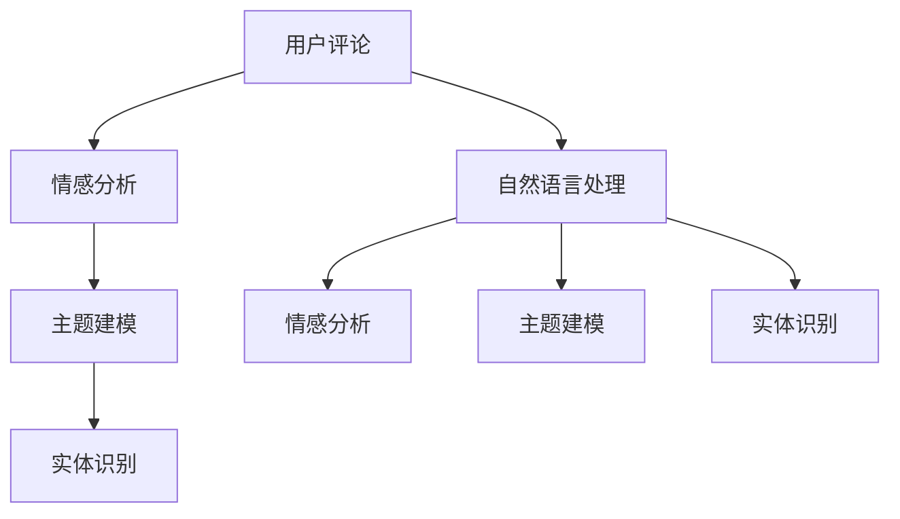

                 

# AI赋能的电商平台用户评论分析

## 1. 背景介绍

在当今数字化时代，电商平台已成为消费者获取产品信息、购买商品的重要渠道。用户评论是电商平台的重要组成部分，其内容真实反映产品特性、用户体验、品牌声誉等多方面信息，对电商平台的运营和发展有着深远的影响。通过对用户评论的全面分析，电商平台可以更好地理解用户需求，优化商品描述，改进服务质量，从而提升用户满意度和购买转化率。本文将详细介绍基于AI技术的用户评论分析方法，从背景介绍、核心概念、算法原理、具体操作步骤、应用实例等多个方面进行系统阐述，旨在为电商平台的用户评论分析提供有价值的参考。

## 2. 核心概念与联系

### 2.1 核心概念概述

为了更好地理解用户评论分析的过程，本节将介绍几个关键概念及其相互关系：

- **用户评论分析**：指通过对电商平台用户评论文本的收集和分析，提取有价值的信息，如产品评价、用户需求、市场趋势等，从而为电商平台的运营决策提供数据支持。

- **自然语言处理(NLP)**：涉及语音、文本、图像等自然信息形式的处理和生成，用户评论分析是NLP在电商平台应用的重要领域。

- **情感分析(Sentiment Analysis)**：旨在识别用户评论中的情感倾向，判断其对产品或服务的正面、负面或中性评价，情感分析是用户评论分析的重要子任务。

- **主题建模(Thematic Modeling)**：通过统计分析方法，识别用户评论中的主题和关键词，主题建模有助于理解用户评论的核心内容。

- **实体识别(Entity Recognition)**：识别评论文本中的具体实体，如产品名称、品牌、价格等，实体识别对理解评论的具体情境非常重要。

这些核心概念之间的关系可以用以下Mermaid流程图来展示：



通过这个流程图，我们可以看到用户评论首先经过情感分析、主题建模和实体识别等NLP技术的处理，得到分析结果后，可以应用于电商平台的运营决策中。

## 3. 核心算法原理 & 具体操作步骤

### 3.1 算法原理概述

基于AI的用户评论分析主要包含两个步骤：首先是预处理和特征提取，然后是模型训练和分析。

**预处理**：包括文本清洗、分词、停用词过滤、词干提取等步骤，旨在提取出有用的特征信息，去除噪音。

**特征提取**：利用TF-IDF、word2vec、BERT等技术，将文本转化为模型可处理的数值特征向量，常用的特征包括词频、词性、情感极性等。

**模型训练**：选择合适的模型如情感分类器、主题分类器等，对特征向量进行训练，生成预测模型。常用的模型包括逻辑回归、支持向量机、深度学习模型等。

**分析与应用**：使用训练好的模型对新的评论文本进行预测，提取情感倾向、主题分布、实体信息等，应用于产品改进、市场营销、用户画像构建等多个领域。

### 3.2 算法步骤详解

#### 3.2.1 数据收集与预处理

用户评论的数据收集和预处理是用户评论分析的第一步。

**数据收集**：可以从电商平台的评论模块、社交媒体、用户反馈系统等多个渠道收集用户评论数据。

**数据清洗**：去除无效评论、敏感信息、异常值等，对评论文本进行分词和清洗，去除停用词，降低噪声影响。

#### 3.2.2 特征提取

在预处理的基础上，需要从评论文本中提取出有用的特征信息，常见的特征包括词频、情感极性、主题分布等。

**词频统计**：统计每个单词在评论文本中出现的次数，反映其在评论中的重要性。

**情感极性**：利用情感分析技术，判断评论的情感倾向，通常分为正面、负面和中性。

**主题分布**：通过主题建模技术，识别评论中的主题和关键词，了解用户关注的主要话题。

#### 3.2.3 模型训练

选择合适的模型，如逻辑回归、支持向量机、深度学习模型等，对特征向量进行训练。深度学习模型如LSTM、GRU、BERT等在情感分析和主题建模中表现优异。

**训练集划分**：将数据集划分为训练集、验证集和测试集，通常采用70%训练集、15%验证集、15%测试集的比例。

**模型选择与训练**：选择适合的模型进行训练，使用交叉验证技术调整模型参数，确保模型性能稳定。

#### 3.2.4 分析与应用

使用训练好的模型对新的评论文本进行预测，提取情感倾向、主题分布、实体信息等，应用于电商平台的运营决策中。

**情感分析**：判断评论的情感倾向，了解用户对产品的满意度和需求。

**主题建模**：识别评论中的主题和关键词，了解用户关注的主要话题，指导产品改进和市场营销。

**实体识别**：识别评论文本中的具体实体，如产品名称、品牌、价格等，了解用户对产品的具体关注点。

### 3.3 算法优缺点

**优点**：

1. **自动化处理**：AI算法可以自动处理大量用户评论数据，提取有价值的信息，提高分析效率。

2. **多维度分析**：AI算法可以同时进行情感分析、主题建模、实体识别等多维度分析，提供更全面的信息支持。

3. **实时分析**：AI算法可以在新评论到来时，实时进行预测分析，迅速响应市场需求变化。

**缺点**：

1. **数据质量依赖**：AI算法的效果高度依赖于数据质量，低质量、噪音多的数据会影响分析结果。

2. **模型复杂度**：深度学习模型需要大量的计算资源和训练时间，模型复杂度较高。

3. **上下文理解不足**：AI算法目前还难以完全理解上下文信息，对于复杂情境的评论，分析结果可能不够准确。

### 3.4 算法应用领域

基于AI的用户评论分析在电商领域有广泛的应用场景，例如：

- **产品评价分析**：对用户评论进行情感分析和主题建模，了解用户对产品的满意度、改进建议等。
- **用户需求识别**：通过实体识别技术，提取评论中的关键词和实体，了解用户的具体需求和关注点。
- **市场趋势分析**：对大量评论数据进行主题建模，识别市场中的热点话题和趋势。
- **营销策略优化**：分析用户评论中的情感倾向和主题分布，指导电商平台的营销策略。
- **用户画像构建**：利用用户评论的多维度信息，构建详细的用户画像，为个性化营销提供支持。

## 4. 数学模型和公式 & 详细讲解 & 举例说明

### 4.1 数学模型构建

用户评论分析的数学模型主要包括以下几个部分：

**情感分类模型**：情感分类器通常采用逻辑回归、支持向量机、深度学习模型等，常用的特征包括词频、情感极性等。情感分类器的目标是最小化损失函数，常用的损失函数包括交叉熵损失、对数损失等。

**主题建模模型**：主题建模模型通常采用LDA（Latent Dirichlet Allocation）等算法，通过统计分析用户评论中的单词分布，识别出隐含的主题和关键词。

**实体识别模型**：实体识别模型通常采用CRF（Conditional Random Field）等算法，通过标记算法，识别评论中的具体实体，如产品名称、品牌、价格等。

### 4.2 公式推导过程

以情感分类为例，假设评论文本为 $x$，情感标签为 $y$，情感分类器 $h(x)$ 的输出为预测结果，目标是最大化训练集上的对数似然函数：

$$
\max_{h} \log p(y|x) = \max_{h} y \log h(x) + (1-y) \log(1-h(x))
$$

其中 $p(y|x)$ 表示给定评论文本 $x$ 下，情感标签 $y$ 的概率。通过优化上述目标函数，可以得到情感分类器的最优参数。

### 4.3 案例分析与讲解

假设有一篇用户评论：“这款手机运行流畅，但电池续航时间较短，性价比一般”。

**情感分析**：通过情感分析模型，可以判断该评论的情感倾向为中性，既不是完全正面，也不是完全负面。

**主题建模**：通过主题建模模型，可以识别出该评论的主题可能包括“性能”、“续航”、“性价比”等，了解用户关注的重点话题。

**实体识别**：通过实体识别模型，可以识别出该评论中的实体包括“手机”、“电池续航时间”等，了解用户对产品的具体关注点。

## 5. 项目实践：代码实例和详细解释说明

### 5.1 开发环境搭建

在进行用户评论分析的代码实现前，需要准备好开发环境。以下是使用Python进行TensorFlow开发的环境配置流程：

1. 安装Anaconda：从官网下载并安装Anaconda，用于创建独立的Python环境。

2. 创建并激活虚拟环境：
```bash
conda create -n tensorflow-env python=3.8 
conda activate tensorflow-env
```

3. 安装TensorFlow：根据CUDA版本，从官网获取对应的安装命令。例如：
```bash
conda install tensorflow
```

4. 安装Pandas、NumPy等库：
```bash
pip install pandas numpy scikit-learn nltk
```

5. 安装TensorBoard：用于可视化训练过程中的指标变化，TensorFlow的可视化工具。
```bash
pip install tensorboard
```

完成上述步骤后，即可在`tensorflow-env`环境中开始代码实现。

### 5.2 源代码详细实现

我们以情感分析为例，给出使用TensorFlow进行用户评论情感分类的代码实现。

```python
import tensorflow as tf
from tensorflow.keras.preprocessing.text import Tokenizer
from tensorflow.keras.preprocessing.sequence import pad_sequences
from sklearn.model_selection import train_test_split
from tensorflow.keras.layers import Embedding, LSTM, Dense, Dropout
from tensorflow.keras.models import Sequential

# 准备数据
texts = []
labels = []
with open('comments.txt', 'r') as f:
    for line in f:
        text, label = line.strip().split(',')
        texts.append(text)
        labels.append(label)

# 分词和预处理
tokenizer = Tokenizer()
tokenizer.fit_on_texts(texts)
sequences = tokenizer.texts_to_sequences(texts)
word_index = tokenizer.word_index

# 填充序列
max_len = max([len(seq) for seq in sequences])
padded_sequences = pad_sequences(sequences, maxlen=max_len, padding='post')

# 划分数据集
train_texts, test_texts, train_labels, test_labels = train_test_split(padded_sequences, labels, test_size=0.2)

# 构建模型
model = Sequential()
model.add(Embedding(len(word_index) + 1, 128, input_length=max_len))
model.add(LSTM(64, dropout=0.2, recurrent_dropout=0.2))
model.add(Dense(1, activation='sigmoid'))
model.compile(loss='binary_crossentropy', optimizer='adam', metrics=['accuracy'])

# 训练模型
model.fit(train_texts, train_labels, validation_data=(test_texts, test_labels), epochs=10, batch_size=32)

# 评估模型
loss, accuracy = model.evaluate(test_texts, test_labels)
print(f'Test accuracy: {accuracy:.4f}')
```

这段代码实现了一个简单的LSTM模型，用于进行用户评论的情感分类。模型输入是经过分词和填充后的文本序列，输出是一个0-1的情感概率，表示评论的情感倾向。

### 5.3 代码解读与分析

**分词和预处理**：
- `Tokenizer`：用于将文本序列转化为数字序列。
- `fit_on_texts`：将文本序列转化为模型可以处理的格式。
- `texts_to_sequences`：将文本序列转化为数字序列。

**填充序列**：
- `pad_sequences`：将不同长度的序列填充到相同长度，便于模型训练。

**模型构建**：
- `Embedding`：将文本序列转化为嵌入向量，每个单词被映射到一个高维向量空间。
- `LSTM`：采用长短期记忆网络，能够捕捉序列中的时间依赖关系。
- `Dense`：全连接层，用于输出情感分类结果。
- `compile`：编译模型，设置损失函数、优化器和评估指标。

**训练和评估**：
- `fit`：训练模型，使用验证集进行监控。
- `evaluate`：评估模型，输出测试集上的损失和准确率。

这段代码实现了基本的情感分类功能，但需要根据具体任务进行优化和改进。

## 6. 实际应用场景

### 6.1 智能客服系统

基于AI的用户评论分析可以广泛应用于智能客服系统的构建。智能客服系统可以根据用户评论中的情感倾向和实体信息，快速识别用户需求，提供针对性的回答，提升客服效率和用户体验。

### 6.2 市场营销分析

通过分析用户评论中的主题和情感倾向，电商平台可以了解用户对不同产品的需求和评价，指导市场营销策略的调整，优化产品定位和营销活动。

### 6.3 用户画像构建

用户评论中的情感倾向、主题分布和实体信息等，可以用于构建详细的用户画像，帮助电商平台更好地理解用户需求，提供个性化的推荐和服务。

### 6.4 未来应用展望

未来，基于AI的用户评论分析技术将在更多领域得到应用，例如：

- **实时反馈系统**：结合电商平台的用户评论和评分数据，构建实时反馈系统，及时调整产品和服务质量。
- **竞争对手分析**：通过分析竞争对手的用户评论，了解其在市场上的表现和用户满意度，指导自身的市场策略。
- **新商品推荐**：结合用户评论中的实体信息，推荐与用户兴趣相关的新商品，提升购买转化率。

## 7. 工具和资源推荐

### 7.1 学习资源推荐

为了帮助开发者系统掌握基于AI的用户评论分析的理论基础和实践技巧，这里推荐一些优质的学习资源：

1. **自然语言处理入门教程**：介绍NLP的基础知识和常见技术，如分词、情感分析、主题建模等。

2. **TensorFlow官方文档**：提供详细的TensorFlow API文档和示例代码，适合深入学习。

3. **Keras官方文档**：提供Keras API的文档和教程，适合快速上手深度学习模型的构建。

4. **深度学习框架比较**：比较PyTorch、TensorFlow、Keras等主流深度学习框架的特点和适用场景。

5. **NLP论文解读**：精选多篇NLP领域的经典论文，通过详细解读其算法原理和实现方法，提升理解和实践能力。

通过这些学习资源，相信你一定能够快速掌握基于AI的用户评论分析的精髓，并用于解决实际的NLP问题。

### 7.2 开发工具推荐

高效的开发离不开优秀的工具支持。以下是几款用于用户评论分析开发的常用工具：

1. **Jupyter Notebook**：免费的交互式开发环境，支持Python和多种科学计算库，适合快速原型开发和实验。

2. **PyCharm**：专业的Python IDE，支持代码自动补全、代码调试、代码重构等功能，适合大规模项目开发。

3. **Scikit-learn**：简单易用的机器学习库，提供多种常用的模型和算法，适合数据处理和模型构建。

4. **NLTK**：自然语言处理库，提供丰富的NLP工具和数据集，适合语言处理任务的开发。

5. **Gensim**：自然语言处理库，提供主题建模、文本相似度计算等功能，适合处理大规模文本数据。

6. **TensorBoard**：可视化工具，支持绘制训练过程中的损失曲线、准确率等指标，适合模型调试和优化。

合理利用这些工具，可以显著提升用户评论分析的开发效率，加快创新迭代的步伐。

### 7.3 相关论文推荐

基于AI的用户评论分析技术的研究源于学界的持续研究。以下是几篇奠基性的相关论文，推荐阅读：

1. **深度学习在情感分析中的应用**：介绍深度学习模型在情感分析任务中的应用，如卷积神经网络、循环神经网络等。

2. **主题模型在文本分析中的应用**：介绍LDA等主题模型在文本分类、情感分析等任务中的应用，通过统计分析挖掘文本中的主题信息。

3. **基于实体识别的用户评论分析**：介绍实体识别技术在用户评论分析中的应用，识别评论中的具体实体，提升分析结果的准确性。

4. **深度学习在用户画像构建中的应用**：介绍深度学习模型在用户画像构建中的应用，通过多维度的用户数据，构建详细且准确的用户画像。

5. **情感分析的新方法**：介绍最新情感分析方法，如BERT、GPT等深度学习模型在情感分析任务中的应用，提升情感分析的准确性和泛化能力。

这些论文代表了大语言模型微调技术的发展脉络。通过学习这些前沿成果，可以帮助研究者把握学科前进方向，激发更多的创新灵感。

## 8. 总结：未来发展趋势与挑战

### 8.1 总结

本文对基于AI的用户评论分析方法进行了全面系统的介绍。首先阐述了用户评论分析的背景和意义，明确了AI技术在用户评论分析中的重要地位。其次，从原理到实践，详细讲解了情感分析、主题建模、实体识别等核心技术，提供了完整的代码实现和应用实例。同时，本文还探讨了用户评论分析在智能客服、市场营销、用户画像构建等多个领域的实际应用，展示了AI技术在电商平台应用的广阔前景。

通过本文的系统梳理，可以看到，基于AI的用户评论分析技术已经成为电商平台运营决策中的重要工具，其应用范围和效果逐渐显现。未来，随着AI技术的发展和应用场景的扩展，用户评论分析必将在更多领域得到应用，为电商平台的运营和发展提供更强大的技术支持。

### 8.2 未来发展趋势

展望未来，基于AI的用户评论分析技术将呈现以下几个发展趋势：

1. **自动化程度提升**：AI算法能够自动处理大量用户评论数据，提取有价值的信息，提高分析效率。

2. **多模态融合**：结合文本、图像、语音等多模态数据，提升用户评论分析的准确性和全面性。

3. **实时分析能力增强**：AI算法可以在新评论到来时，实时进行预测分析，迅速响应市场需求变化。

4. **上下文理解能力提升**：AI算法逐步增强上下文理解能力，能够更好地理解评论中的隐含信息和情感倾向。

5. **多任务联合分析**：将情感分析、主题建模、实体识别等多个任务进行联合分析，提供更全面的用户评论信息。

以上趋势凸显了AI技术在用户评论分析中的潜力和前景，AI技术在实际应用中的推广和应用将进一步推动电商平台的发展和创新。

### 8.3 面临的挑战

尽管基于AI的用户评论分析技术已经取得了瞩目成就，但在迈向更加智能化、普适化应用的过程中，它仍面临诸多挑战：

1. **数据质量和多样性**：用户评论数据的质量和多样性直接影响分析结果的准确性。低质量、噪音多的数据会影响分析结果，多样化的评论内容增加了分析难度。

2. **模型复杂度和计算资源**：深度学习模型需要大量的计算资源和训练时间，模型复杂度较高，资源消耗较大。

3. **上下文理解和鲁棒性**：AI算法目前还难以完全理解上下文信息，对于复杂情境的评论，分析结果可能不够准确。同时，模型对噪声和异常值的鲁棒性有待提高。

4. **数据隐私和安全**：用户评论数据包含大量隐私信息，如何在保障数据隐私和安全的前提下进行数据分析，是一个重要挑战。

5. **用户信任和接受度**：用户对AI算法的信任和接受度直接影响其应用效果。如何在保证算法准确性的同时，增强用户信任和接受度，是一个需要解决的问题。

6. **跨领域迁移能力**：不同领域的数据和任务差异较大，AI算法需要具备较强的跨领域迁移能力，才能在多个领域中取得良好效果。

正视这些挑战，积极应对并寻求突破，将是大语言模型微调走向成熟的必由之路。相信随着学界和产业界的共同努力，这些挑战终将一一被克服，用户评论分析必将在构建人机协同的智能时代中扮演越来越重要的角色。

### 8.4 研究展望

未来，在用户评论分析领域，以下几个研究方向值得关注：

1. **多任务联合分析**：将情感分析、主题建模、实体识别等多个任务进行联合分析，提供更全面的用户评论信息。

2. **深度学习模型的优化**：探索更高效的深度学习模型和训练方法，提高模型的计算效率和准确性。

3. **跨领域迁移学习**：开发能够跨领域迁移的AI算法，提高模型的通用性和适应性。

4. **上下文理解技术**：研究上下文理解技术，增强AI算法对复杂情境的推理能力。

5. **数据隐私和安全技术**：研究数据隐私和安全技术，保护用户评论数据的安全和隐私。

6. **用户信任和接受度**：研究如何增强用户对AI算法的信任和接受度，提升AI技术的应用效果。

这些研究方向将进一步推动AI技术在用户评论分析中的应用，为电商平台的运营和发展提供更强大的技术支持。总之，用户评论分析技术需要在数据、算法、工程、业务等多个维度协同发力，才能真正实现其应用价值。

## 9. 附录：常见问题与解答

**Q1：用户评论分析需要多少标注数据？**

A: 用户评论分析所需标注数据量与具体任务和模型复杂度有关。一般来说，标注数据量越大，模型的准确性越高。对于情感分类、主题建模等任务，几百到上千条标注数据即可；对于实体识别等任务，需要几千到几万条标注数据。

**Q2：如何选择合适的人工智能模型？**

A: 选择合适的AI模型需要考虑任务类型、数据规模、计算资源等因素。对于文本分类、情感分析等任务，常用的模型包括逻辑回归、支持向量机、深度学习模型等。对于实体识别等任务，常用的模型包括CRF、BiLSTM等。同时，不同模型的计算资源需求和训练时间也不同，需要根据具体情况进行选择。

**Q3：用户评论分析需要哪些特征？**

A: 用户评论分析的特征主要包括词频、情感极性、主题分布、实体信息等。这些特征可以帮助模型更好地理解评论内容，提取有价值的信息。同时，特征的维度和处理方法也需要根据具体任务进行优化。

**Q4：如何评估用户评论分析模型的效果？**

A: 评估用户评论分析模型的效果通常使用准确率、召回率、F1值等指标。对于情感分类任务，可以使用混淆矩阵、ROC曲线等方法进行评估。对于实体识别任务，可以使用精确率、召回率、F1值等指标进行评估。同时，需要结合实际业务需求进行综合评估。

**Q5：用户评论分析中的常见问题有哪些？**

A: 用户评论分析中的常见问题包括数据质量差、数据量不足、模型过拟合等。这些问题需要通过数据清洗、数据增强、正则化等方法进行解决。同时，需要不断优化模型和特征提取方法，提高模型的泛化能力和准确性。

通过这些常见问题的解答，相信你能够更好地理解和应用基于AI的用户评论分析技术，提升电商平台的运营决策水平。

