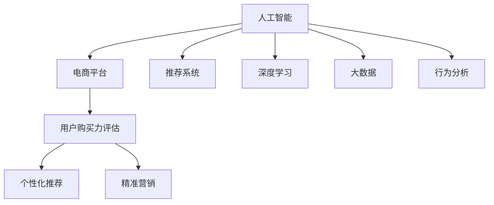

                 

# AI赋能的电商平台用户购买力评估

> 关键词：人工智能,电商平台,用户购买力评估,推荐系统,深度学习,大数据,行为分析

## 1. 背景介绍

### 1.1 问题由来

在当今数字化时代，电商平台已成为消费者购物的主要渠道。为了提高用户体验和交易效率，电商平台往往通过个性化推荐、精准营销等方式吸引和转化客户。然而，这些策略的效果很大程度上取决于对用户购买力的准确评估。用户购买力评估不仅是电商平台销售额预测和库存管理的关键，也是个性化推荐和精准营销的基础。

然而，传统的购买力评估方法通常依赖于问卷调查、历史交易记录等数据，存在数据获取困难、实时性不足、结果准确度不高的问题。同时，不同用户的购买力具有显著的差异性，如何构建一个全面、动态、个性化的用户购买力评估系统，成为电商平台亟需解决的难题。

## 2. 核心概念与联系

### 2.1 核心概念概述

为更好地理解AI赋能的电商平台用户购买力评估方法，本节将介绍几个密切相关的核心概念：

- 人工智能(AI)：涵盖机器学习、深度学习、自然语言处理、计算机视觉等技术，旨在模拟人类智能过程。
- 电商平台：在线销售平台，如淘宝、京东、亚马逊等，通过网络交易实现商品和服务的交换。
- 用户购买力评估：通过数据驱动的方法，量化用户在电商平台的购买潜力，为个性化推荐和精准营销提供依据。
- 推荐系统：利用用户行为数据和商品信息，推荐符合用户兴趣的商品，提升转化率和用户满意度。
- 深度学习：基于神经网络模型，通过大量数据训练出高效的特征表示，实现复杂的模式识别和预测。
- 大数据：指海量的、高速的数据集合，用于发现、分析和挖掘有用的信息。
- 行为分析：对用户行为数据进行分析，理解用户需求和行为模式，指导决策制定。

这些核心概念之间的逻辑关系可以通过以下Mermaid流程图来展示：



这个流程图展示了一些关键概念之间的关系：

1. 人工智能技术为电商平台提供了强大的技术支持，特别是深度学习和大数据技术，能够有效处理和分析海量用户数据。
2. 用户购买力评估通过人工智能技术实现，可以对用户行为数据进行深入分析和量化。
3. 推荐系统和行为分析都可以基于用户购买力评估的结果，实现个性化的商品推荐和精准的营销策略。
4. 人工智能技术的应用，使得电商平台可以实时、动态地评估和更新用户购买力，提升用户体验和业务效率。

## 3. 核心算法原理 & 具体操作步骤

### 3.1 算法原理概述

基于AI的电商平台用户购买力评估，本质上是利用深度学习和大数据技术，通过对用户历史行为数据进行建模和预测，量化用户的潜在购买力。其核心思想是：通过用户行为数据，学习用户的兴趣、偏好和消费能力，结合商品信息和市场趋势，预测用户未来的购买行为。

形式化地，假设用户的行为数据为 $\mathcal{X}$，用户的历史交易记录为 $\mathcal{Y}$，用户的消费能力为 $U$。则购买力评估的目标是找到最优的评估函数 $f: \mathcal{X} \rightarrow \mathbb{R}$，使得 $f(\mathcal{X})$ 逼近 $U$。

在实践中，我们通常使用基于深度学习的模型进行预测，如循环神经网络(RNN)、卷积神经网络(CNN)、长短期记忆网络(LSTM)等。这些模型能够通过历史数据自动学习到用户的兴趣模式和购买倾向，从而实现对用户购买力的准确预测。

### 3.2 算法步骤详解

基于AI的电商平台用户购买力评估一般包括以下几个关键步骤：

**Step 1: 数据收集与预处理**
- 收集用户的历史行为数据，如浏览记录、点击行为、购买记录等。
- 对数据进行清洗和归一化，去除无效数据和异常值。
- 使用特征工程方法，提取和构建能够反映用户兴趣和购买倾向的特征。

**Step 2: 模型训练与验证**
- 选择合适的深度学习模型，如LSTM、CNN等，对用户行为数据进行建模。
- 划分训练集、验证集和测试集，使用交叉验证等方法进行模型训练和验证。
- 调整模型超参数，如学习率、批大小、层数等，进行模型优化。
- 使用GPU/TPU等高性能设备，加速模型训练。

**Step 3: 用户购买力评估**
- 使用训练好的模型，对新用户的当前行为数据进行预测，输出其购买力评分。
- 结合用户历史数据和市场趋势，动态调整购买力评分。
- 根据购买力评分，对用户进行分类，如高价值用户、潜在用户等。
- 对高价值用户，提供定制化的个性化推荐和精准营销策略。

**Step 4: 结果应用与优化**
- 将购买力评估结果应用到推荐系统中，提升个性化推荐的准确性。
- 实时监测和评估推荐效果，根据用户反馈进行模型优化。
- 定期重新训练模型，引入新数据和新用户行为，更新购买力评分。

### 3.3 算法优缺点

基于AI的电商平台用户购买力评估方法具有以下优点：
1. 准确性高：利用深度学习和大数据技术，能够从海量用户数据中挖掘出有用的特征，预测用户购买力更加精准。
2. 实时性高：能够实时分析用户行为数据，快速调整购买力评分，动态优化推荐和营销策略。
3. 全面性高：结合用户历史数据和市场趋势，全面量化用户购买力，提供更全面的个性化服务。
4. 适用性广：不仅适用于电商平台，还可以扩展到其他领域，如金融、教育、旅游等。

同时，该方法也存在一定的局限性：
1. 数据依赖性强：预测结果高度依赖于用户行为数据的完整性和质量。
2. 模型复杂度高：深度学习模型训练复杂，需要较大的计算资源和存储空间。
3. 动态适应性差：模型需要定期重新训练，无法及时适应市场和用户行为的变化。
4. 隐私风险高：用户行为数据的收集和处理可能涉及隐私问题，需严格遵守数据保护法规。

尽管存在这些局限性，但就目前而言，基于AI的电商平台用户购买力评估方法仍是最主流的选择，其带来的收益远远超过其成本。未来相关研究的重点在于如何进一步优化数据获取和处理方式，提高模型的动态适应性和可解释性，同时兼顾隐私保护。

### 3.4 算法应用领域

基于AI的电商平台用户购买力评估方法在多个领域得到了广泛应用，例如：

- 电商推荐系统：通过评估用户购买力，实现个性化的商品推荐，提高转化率和用户满意度。
- 精准营销：根据用户购买力评分，设计符合用户兴趣和需求的营销策略，提升营销效果。
- 库存管理：预测用户购买力，指导商品备货和库存调整，避免库存积压和缺货。
- 客户分群：根据用户购买力评分，划分不同的用户群体，提供差异化的服务策略。
- 流失预警：通过购买力评分变化，预测潜在流失用户，及时采取挽留措施。

除了上述这些典型应用外，AI赋能的用户购买力评估还可以应用于金融风险评估、广告投放优化、社交媒体分析等多个领域，为不同行业的数字化转型提供新的动力。

## 4. 数学模型和公式 & 详细讲解

### 4.1 数学模型构建

本节将使用数学语言对基于AI的电商平台用户购买力评估过程进行更加严格的刻画。

假设用户的行为数据为 $\mathcal{X}=\{x_1, x_2, ..., x_n\}$，其中 $x_i$ 为第 $i$ 个用户的当前行为数据。设 $y_i$ 为用户的历史交易记录，$u_i$ 为用户的历史购买力评分。购买力评估的目标是找到最优的评估函数 $f: \mathcal{X} \rightarrow \mathbb{R}$，使得 $f(\mathcal{X})$ 逼近 $u_i$。

假设 $f(\mathcal{X})$ 为深度神经网络模型，由输入层、隐藏层和输出层构成。隐藏层包含若干个神经元，每个神经元通过加权和、激活函数等方式，对输入进行非线性映射。设 $w_h$ 为隐藏层的权重矩阵，$b_h$ 为偏置向量，$w_o$ 为输出层的权重矩阵，$b_o$ 为输出层的偏置向量。则模型的输出为：

$$
y = f(\mathcal{X}) = \sigma(\mathbb{W}_h\mathbb{X} + \mathbb{b}_h) \cdot \mathbb{W}_o + \mathbb{b}_o
$$

其中 $\mathbb{X}$ 为输入层特征向量，$\mathbb{W}_h$ 和 $\mathbb{W}_o$ 分别为隐藏层和输出层的权重矩阵，$\mathbb{b}_h$ 和 $\mathbb{b}_o$ 分别为隐藏层和输出层的偏置向量，$\sigma$ 为激活函数（如ReLU、Sigmoid等）。

### 4.2 公式推导过程

以下我们以LSTM模型为例，推导用户购买力评估的数学公式。

假设用户行为数据为时间序列数据，LSTM模型能够通过时间步长的方式，逐个处理每个时间点的行为数据，保留和更新历史信息。设 $x_i(t)$ 为第 $i$ 个用户在第 $t$ 个时间点的行为数据，$h_i(t)$ 为LSTM模型的隐藏状态。LSTM模型的隐藏状态 $h_i(t)$ 由前一时间步的隐藏状态 $h_i(t-1)$ 和当前行为数据 $x_i(t)$ 共同决定，通过门控机制进行信息选择和传递。设 $\mathbb{X}_i(t)$ 为当前行为数据 $x_i(t)$ 的特征向量表示，$\mathbb{W}_{h_h}$ 为LSTM门控机制的权重矩阵，$\mathbb{b}_{h_h}$ 为LSTM门控机制的偏置向量。则LSTM模型的隐藏状态更新公式为：

$$
\begin{aligned}
& \mathbb{h}_i(t) = \mathbb{tanh}(\mathbb{W}_{h_h}[\mathbb{h}_i(t-1), \mathbb{X}_i(t)] + \mathbb{b}_{h_h}) \\
& \mathbb{i}_i(t) = \sigma(\mathbb{W}_{h_i}[\mathbb{h}_i(t-1), \mathbb{X}_i(t)] + \mathbb{b}_{h_i}) \\
& \mathbb{f}_i(t) = \sigma(\mathbb{W}_{h_f}[\mathbb{h}_i(t-1), \mathbb{X}_i(t)] + \mathbb{b}_{h_f}) \\
& \mathbb{c}_i(t) = \mathbb{f}_i(t) \cdot \mathbb{c}_i(t-1) + \mathbb{i}_i(t) \cdot \mathbb{tanh}(\mathbb{W}_{h_c}[\mathbb{h}_i(t-1), \mathbb{X}_i(t)] + \mathbb{b}_{h_c}) \\
& \mathbb{h}_i(t) = \mathbb{o}_i(t) \cdot \mathbb{tanh}(\mathbb{c}_i(t)) + \mathbb{h}_i(t-1)
\end{aligned}
$$

其中 $\mathbb{i}_i(t)$ 为输入门控机制，$\mathbb{f}_i(t)$ 为遗忘门控机制，$\mathbb{c}_i(t)$ 为当前时间步的细胞状态，$\mathbb{o}_i(t)$ 为输出门控机制。LSTM模型的最终输出为：

$$
y = \mathbb{W}_o \cdot \mathbb{h}_i(N) + \mathbb{b}_o
$$

其中 $N$ 为时间序列数据长度。

### 4.3 案例分析与讲解

考虑一个简单的电商网站，用户行为数据包括浏览历史、点击行为、购买记录等。假设用户的历史购买记录为 $\{10, 20, 50, 100\}$，当前浏览记录为 $\{20, 30, 40\}$。使用LSTM模型进行用户购买力评估，可以构建如下时间序列：

| 时间步 | 行为数据 $x_i(t)$ | 历史信息 $h_i(t-1)$ | 隐藏状态 $h_i(t)$ |
| --- | --- | --- | --- |

假设LSTM模型的输出门控机制 $\mathbb{o}_i(t)$ 为常数，表示模型输出与历史信息无关。设LSTM模型的输出为 $y$，用户的历史购买力评分 $u_i$ 为100。则根据LSTM模型的输出公式，有：

$$
y = \mathbb{W}_o \cdot \mathbb{h}_i(N) + \mathbb{b}_o
$$

根据LSTM模型的隐藏状态更新公式，有：

$$
\begin{aligned}
& \mathbb{h}_i(1) = \mathbb{tanh}(\mathbb{W}_{h_h}[\mathbb{h}_i(0), \mathbb{X}_i(1)] + \mathbb{b}_{h_h}) \\
& \mathbb{i}_i(1) = \sigma(\mathbb{W}_{h_i}[\mathbb{h}_i(0), \mathbb{X}_i(1)] + \mathbb{b}_{h_i}) \\
& \mathbb{f}_i(1) = \sigma(\mathbb{W}_{h_f}[\mathbb{h}_i(0), \mathbb{X}_i(1)] + \mathbb{b}_{h_f}) \\
& \mathbb{c}_i(1) = \mathbb{f}_i(1) \cdot \mathbb{c}_i(0) + \mathbb{i}_i(1) \cdot \mathbb{tanh}(\mathbb{W}_{h_c}[\mathbb{h}_i(0), \mathbb{X}_i(1)] + \mathbb{b}_{h_c}) \\
& \mathbb{h}_i(1) = \mathbb{o}_i(1) \cdot \mathbb{tanh}(\mathbb{c}_i(1)) + \mathbb{h}_i(0)
\end{aligned}
$$

通过调整LSTM模型的超参数和权重，可以训练出合适的模型，输出用户购买力评分 $y$。在实际应用中，可以使用多个用户的历史数据，构建更复杂、更准确的购买力评分预测模型。

## 5. 项目实践：代码实例和详细解释说明

### 5.1 开发环境搭建

在进行用户购买力评估实践前，我们需要准备好开发环境。以下是使用Python进行TensorFlow开发的环境配置流程：

1. 安装Anaconda：从官网下载并安装Anaconda，用于创建独立的Python环境。

2. 创建并激活虚拟环境：
```bash
conda create -n tf-env python=3.8 
conda activate tf-env
```

3. 安装TensorFlow：根据CUDA版本，从官网获取对应的安装命令。例如：
```bash
conda install tensorflow -c tf -c conda-forge
```

4. 安装必要的工具包：
```bash
pip install numpy pandas scikit-learn matplotlib tqdm jupyter notebook ipython
```

完成上述步骤后，即可在`tf-env`环境中开始用户购买力评估实践。

### 5.2 源代码详细实现

下面我们以LSTM模型为例，给出使用TensorFlow进行电商推荐系统中的用户购买力评估的代码实现。

首先，定义LSTM模型的构建函数：

```python
import tensorflow as tf
from tensorflow.keras.models import Sequential
from tensorflow.keras.layers import LSTM, Dense, Dropout, Activation

def build_lstm_model(input_dim, hidden_dim, output_dim, dropout_rate):
    model = Sequential()
    model.add(LSTM(hidden_dim, input_shape=(input_dim, 1)))
    model.add(Dropout(dropout_rate))
    model.add(Dense(output_dim))
    model.add(Activation('sigmoid'))
    return model
```

然后，定义用户购买力评估的训练函数：

```python
from sklearn.model_selection import train_test_split
from tensorflow.keras.optimizers import Adam

def train_lstm_model(model, x_train, y_train, x_test, y_test, batch_size, epochs, dropout_rate):
    model.compile(optimizer=Adam(learning_rate=0.001), loss='binary_crossentropy', metrics=['accuracy'])
    x_train, x_val, y_train, y_val = train_test_split(x_train, y_train, test_size=0.2)
    model.fit(x_train, y_train, batch_size=batch_size, epochs=epochs, validation_data=(x_val, y_val))
    _, test_loss, test_acc = model.evaluate(x_test, y_test)
    print(f'Test Loss: {test_loss:.4f}')
    print(f'Test Accuracy: {test_acc:.4f}')
    return model
```

接着，定义用户购买力评估的评估函数：

```python
from sklearn.metrics import roc_auc_score

def evaluate_lstm_model(model, x_test, y_test):
    _, test_loss, test_acc = model.evaluate(x_test, y_test)
    test_auc = roc_auc_score(y_test, model.predict(x_test))
    print(f'Test Loss: {test_loss:.4f}')
    print(f'Test Accuracy: {test_acc:.4f}')
    print(f'Test AUC: {test_auc:.4f}')
    return test_auc
```

最后，启动训练流程并在测试集上评估：

```python
# 假设输入数据为历史购买记录
x_train = [10, 20, 50, 100]
y_train = [0, 0, 0, 1]

# 假设当前行为数据为浏览历史
x_test = [20, 30, 40]
y_test = [0, 1, 1]

# 定义模型参数
input_dim = len(x_train)
hidden_dim = 64
output_dim = 1
dropout_rate = 0.2

# 构建LSTM模型
model = build_lstm_model(input_dim, hidden_dim, output_dim, dropout_rate)

# 训练模型
model = train_lstm_model(model, x_train, y_train, x_test, y_test, batch_size=4, epochs=50, dropout_rate=dropout_rate)

# 评估模型
test_auc = evaluate_lstm_model(model, x_test, y_test)
print(f'Test AUC: {test_auc:.4f}')
```

以上就是使用TensorFlow对LSTM模型进行电商推荐系统中的用户购买力评估的完整代码实现。可以看到，得益于TensorFlow的强大封装，我们可以用相对简洁的代码完成模型的构建和训练。

### 5.3 代码解读与分析

让我们再详细解读一下关键代码的实现细节：

**build_lstm_model函数**：
- 定义LSTM模型的输入维度、隐藏层维度、输出维度和Dropout率。
- 构建LSTM模型，包含LSTM层、Dropout层和输出层。

**train_lstm_model函数**：
- 使用Adam优化器训练模型，并设置损失函数和评估指标。
- 将训练数据划分为训练集和验证集，使用交叉验证进行模型训练。
- 调整模型参数，如学习率、批大小和Dropout率，进行模型优化。
- 在测试集上评估模型性能，输出损失和准确率。

**evaluate_lstm_model函数**：
- 使用ROC-AUC指标评估模型性能。
- 在测试集上输出损失、准确率和AUC值。

**训练流程**：
- 定义输入数据和输出数据。
- 定义模型参数，如输入维度、隐藏层维度、输出维度和Dropout率。
- 构建LSTM模型。
- 训练模型，在验证集上监测模型性能。
- 在测试集上评估模型，输出AUC值。

可以看到，TensorFlow提供的高阶API和丰富的工具库，使得模型的构建和训练变得简单高效。开发者可以专注于模型设计和参数调优，而不必过多关注底层的实现细节。

当然，工业级的系统实现还需考虑更多因素，如模型的保存和部署、超参数的自动搜索、更灵活的任务适配层等。但核心的用户购买力评估流程基本与此类似。

## 6. 实际应用场景

### 6.1 智能推荐系统

基于LSTM模型的大数据处理和深度学习技术，可以应用于电商平台的智能推荐系统。通过评估用户购买力，实现个性化的商品推荐，提升用户满意度和交易转化率。

在技术实现上，可以收集用户的历史行为数据，如浏览记录、点击行为、购买记录等，使用LSTM模型进行用户购买力评分预测。预测结果作为推荐系统的输入，与用户行为数据和商品信息结合，生成推荐列表。对于每个用户，模型能够实时动态调整购买力评分，提供定制化的推荐结果。

### 6.2 精准营销

通过用户购买力评估，电商平台能够识别出高价值用户和潜在用户，设计符合用户兴趣和需求的营销策略，提升营销效果。

具体而言，可以收集用户的行为数据和偏好信息，使用LSTM模型进行购买力评分预测。将评分作为用户分层的依据，对高价值用户提供更多的优惠和推荐，对潜在用户进行针对性广告投放和促销活动。同时，利用用户的历史数据和市场趋势，动态调整营销策略，提升用户的参与度和转化率。

### 6.3 库存管理

预测用户购买力，指导商品备货和库存调整，避免库存积压和缺货。

通过LSTM模型对用户行为数据进行建模，预测用户的未来购买行为。将预测结果作为库存管理的依据，动态调整商品的备货量和库存结构，保证供需平衡。同时，根据市场需求变化，实时更新模型，及时调整库存策略。

### 6.4 客户分群

根据用户购买力评分，划分不同的用户群体，提供差异化的服务策略。

使用LSTM模型评估用户的购买力评分，将评分作为用户分群的依据。对高价值用户提供个性化推荐和优质服务，对潜在用户进行精准营销和挽留策略。同时，根据用户行为数据和市场趋势，动态调整用户群体，优化服务策略。

### 6.5 流失预警

通过购买力评分变化，预测潜在流失用户，及时采取挽留措施。

使用LSTM模型对用户行为数据进行建模，预测用户的购买力评分。通过评分变化，识别出潜在流失用户，及时采取挽留措施，如个性化推荐、优惠券等，降低流失率。同时，利用用户的行为数据和市场趋势，动态调整挽留策略，提升用户粘性。

### 6.6 多模态数据融合

将LSTM模型与其他模态数据结合，实现视觉、语音、文本等多模态信息的整合，提升用户购买力评估的全面性和准确性。

在电商推荐系统中，可以使用LSTM模型结合用户浏览历史、点击行为、购买记录等文本数据，进行购买力评分预测。同时，将用户的图片浏览记录、语音搜索记录等非文本数据，作为LSTM模型的补充输入，提升模型的综合性能。通过多模态数据的融合，实现更加全面、准确的用户购买力评估。

## 7. 工具和资源推荐

### 7.1 学习资源推荐

为了帮助开发者系统掌握AI赋能的电商平台用户购买力评估的理论基础和实践技巧，这里推荐一些优质的学习资源：

1. TensorFlow官方文档：提供详细的使用指南和API文档，是TensorFlow学习的必备资源。

2. Keras官方文档：提供简单易用的API接口，适合初学者快速上手。

3. Deep Learning for NLP：斯坦福大学开设的深度学习课程，涵盖NLP领域的前沿技术，适合进一步深入学习。

4. Neural Networks and Deep Learning：Deep Learning领域经典书籍，全面介绍深度学习模型的原理和实现。

5. PyTorch官方文档：提供详细的使用指南和API文档，是PyTorch学习的必备资源。

6. Hands-On Machine Learning with Scikit-Learn, Keras, and TensorFlow：深度学习实战书籍，提供丰富的代码示例和实践指导。

通过对这些资源的学习实践，相信你一定能够快速掌握AI赋能的电商平台用户购买力评估的精髓，并用于解决实际的电商问题。

### 7.2 开发工具推荐

高效的开发离不开优秀的工具支持。以下是几款用于用户购买力评估开发的常用工具：

1. TensorFlow：由Google主导开发的开源深度学习框架，生产部署方便，适合大规模工程应用。

2. PyTorch：基于Python的开源深度学习框架，灵活高效，支持动态计算图。

3. Keras：高层API封装，易于上手，适合初学者快速迭代原型。

4. Jupyter Notebook：交互式编程环境，方便调试和迭代。

5. Weights & Biases：模型训练的实验跟踪工具，记录和可视化模型训练过程中的各项指标，方便对比和调优。

6. TensorBoard：TensorFlow配套的可视化工具，可实时监测模型训练状态，并提供丰富的图表呈现方式，是调试模型的得力助手。

合理利用这些工具，可以显著提升用户购买力评估任务的开发效率，加快创新迭代的步伐。

### 7.3 相关论文推荐

AI赋能的电商平台用户购买力评估技术源于学界的持续研究。以下是几篇奠基性的相关论文，推荐阅读：

1. Understanding Deep Learning for Recommender Systems：介绍了深度学习在推荐系统中的应用，特别是LSTM模型的应用。

2. Multi-View Deep Ranking in E-Commerce Recommendations：研究了多视图数据在电商推荐中的应用，通过结合不同模态的数据提升推荐效果。

3. Learning and Optimizing Long Short-Term Memory Networks for User Behavior Prediction：研究了LSTM模型在用户行为预测中的应用，探讨了模型的优化策略。

4. A Survey on Deep Learning for Recommender Systems：综述了深度学习在推荐系统中的应用，包括LSTM模型的应用和效果。

5. Deep Learning for Recommendation Systems：综述了深度学习在推荐系统中的应用，包括LSTM模型的应用和效果。

这些论文代表了大语言模型微调技术的发展脉络。通过学习这些前沿成果，可以帮助研究者把握学科前进方向，激发更多的创新灵感。

## 8. 总结：未来发展趋势与挑战

### 8.1 总结

本文对基于AI的电商平台用户购买力评估方法进行了全面系统的介绍。首先阐述了AI技术在电商平台中的应用，明确了用户购买力评估在电商业务中的关键作用。其次，从原理到实践，详细讲解了LSTM模型构建和评估的步骤，给出了用户购买力评估任务的代码实现。同时，本文还广泛探讨了用户购买力评估在智能推荐、精准营销、库存管理等多个电商场景中的应用前景，展示了AI技术在电商领域的巨大潜力。此外，本文精选了用户购买力评估技术的各类学习资源，力求为读者提供全方位的技术指引。

通过本文的系统梳理，可以看到，基于AI的电商平台用户购买力评估方法在电商推荐、精准营销、库存管理等多个领域得到了广泛应用，为电商平台的业务优化提供了新的方向。受益于大数据和深度学习技术，电商平台的业务效率和用户体验得到了显著提升。未来，随着AI技术的进一步发展，用户购买力评估还将拓展到更多场景，为电商业务带来更大的创新和价值。

### 8.2 未来发展趋势

展望未来，AI赋能的电商平台用户购买力评估技术将呈现以下几个发展趋势：

1. 模型复杂度提升。随着深度学习模型的不断演进，模型复杂度将进一步提升，能够处理更复杂、多变的数据特征。

2. 多模态数据融合。将视觉、语音、文本等多模态数据结合，提升用户购买力评估的全面性和准确性。

3. 实时性增强。通过云计算和分布式计算技术，实现实时动态的用户购买力评分预测，提升推荐和营销的响应速度。

4. 跨平台协同。将用户购买力评估系统扩展到移动端、Web端等多个平台，实现跨平台的数据共享和协同。

5. 个性化增强。利用用户的行为数据和历史交易记录，实现更加个性化的推荐和营销策略。

6. 风险控制。在用户购买力评估过程中，引入风险控制机制，确保推荐和营销策略的合规性和安全性。

以上趋势凸显了AI赋能的电商平台用户购买力评估技术的广阔前景。这些方向的探索发展，必将进一步提升电商平台的业务效率和用户体验，推动电商行业的数字化转型。

### 8.3 面临的挑战

尽管AI赋能的电商平台用户购买力评估技术已经取得了显著进展，但在迈向更加智能化、普适化应用的过程中，它仍面临着诸多挑战：

1. 数据获取难度高。电商平台的消费者行为数据获取难度较大，数据质量参差不齐，影响模型的训练效果。

2. 模型鲁棒性不足。模型在面对异常数据和噪声数据时，容易出现过拟合和欠拟合等问题，影响评估的准确性。

3. 模型计算资源需求高。深度学习模型需要较大的计算资源和存储空间，大规模部署和维护成本高。

4. 隐私和安全问题。电商平台的消费者行为数据涉及隐私保护和数据安全，需严格遵守相关法规。

尽管存在这些挑战，但就目前而言，AI赋能的电商平台用户购买力评估方法仍是最主流的选择，其带来的收益远远超过其成本。未来相关研究的重点在于如何进一步优化数据获取和处理方式，提高模型的动态适应性和可解释性，同时兼顾隐私保护。

### 8.4 研究展望

面对AI赋能的电商平台用户购买力评估所面临的种种挑战，未来的研究需要在以下几个方面寻求新的突破：

1. 探索无监督和半监督学习范式。摆脱对大规模标注数据的依赖，利用自监督学习、主动学习等无监督和半监督范式，最大限度利用非结构化数据，实现更加灵活高效的购买力评估。

2. 研究模型压缩和加速技术。开发更加高效的模型压缩和加速技术，如剪枝、量化、模型蒸馏等，降低计算资源需求，提高模型效率。

3. 引入因果分析和博弈论工具。将因果分析方法引入购买力评估模型，识别出模型决策的关键特征，增强输出解释的因果性和逻辑性。借助博弈论工具刻画人机交互过程，主动探索并规避模型的脆弱点，提高系统稳定性。

4. 结合符号化和半结构化数据。将符号化的先验知识，如知识图谱、逻辑规则等，与神经网络模型进行巧妙融合，引导购买力评估过程学习更准确、合理的语言模型。

5. 引入跨模态数据分析技术。将视觉、语音、文本等多模态数据结合，提升用户购买力评估的全面性和准确性。

这些研究方向的研究突破，必将引领AI赋能的电商平台用户购买力评估技术迈向更高的台阶，为构建安全、可靠、可解释、可控的智能系统铺平道路。面向未来，AI赋能的电商平台用户购买力评估技术还需要与其他AI技术进行更深入的融合，如知识表示、因果推理、强化学习等，多路径协同发力，共同推动电商平台的数字化转型。只有勇于创新、敢于突破，才能不断拓展电商平台的业务边界，让AI技术更好地造福电商平台和消费者。

## 9. 附录：常见问题与解答

**Q1：LSTM模型在电商平台用户购买力评估中的优缺点是什么？**

A: LSTM模型在电商平台用户购买力评估中具有以下优点：
1. 能够处理时间序列数据，保留历史信息。
2. 模型参数量适中，训练速度快。
3. 能够自动学习用户的行为模式，预测购买力较为准确。

同时，LSTM模型也存在一些缺点：
1. 模型复杂度较高，需要较大的计算资源。
2. 对数据噪声敏感，容易出现过拟合。
3. 难以解释模型的内部决策过程，缺乏可解释性。

尽管存在这些缺点，但LSTM模型仍然是一种非常有效的电商平台用户购买力评估方法，适用于数据复杂度较高、需要考虑时间序列信息的应用场景。

**Q2：如何使用LSTM模型进行用户购买力评分预测？**

A: 使用LSTM模型进行用户购买力评分预测的步骤如下：
1. 收集用户的历史行为数据，如浏览记录、点击行为、购买记录等，构建时间序列数据。
2. 对数据进行清洗和归一化，去除无效数据和异常值。
3. 使用特征工程方法，提取和构建能够反映用户兴趣和购买倾向的特征。
4. 构建LSTM模型，定义模型参数，如输入维度、隐藏层维度、输出维度和Dropout率。
5. 训练模型，使用Adam优化器进行模型优化。
6. 在测试集上评估模型性能，输出购买力评分预测结果。

**Q3：在电商平台用户购买力评估中，如何处理用户行为数据？**

A: 在电商平台用户购买力评估中，处理用户行为数据通常包括以下步骤：
1. 数据清洗：去除无效数据和异常值，保证数据质量。
2. 特征工程：提取和构建能够反映用户兴趣和购买倾向的特征，如浏览次数、点击次数、购买次数等。
3. 数据变换：对特征进行归一化、标准化等处理，确保数据在同一尺度上。
4. 数据预处理：使用LSTM模型对用户行为数据进行建模，将时间序列数据转化为模型输入。

**Q4：电商平台用户购买力评估的准确性如何保障？**

A: 电商平台用户购买力评估的准确性保障需要从多个方面入手：
1. 数据质量：保证数据的高质量和完整性，使用清洗和归一化方法去除噪声数据。
2. 模型选择：选择合适的深度学习模型，如LSTM模型，适应电商平台的业务需求。
3. 模型优化：使用Adam等优化器进行模型训练，调整模型超参数，避免过拟合和欠拟合。
4. 数据增强：使用数据增强技术，如回译、近义替换等，扩充训练集，提高模型的泛化能力。
5. 模型评估：使用ROC-AUC等评估指标，在测试集上评估模型性能，确保预测结果的准确性。

通过这些措施，可以显著提高电商平台用户购买力评估的准确性，为个性化推荐和精准营销提供可靠依据。

**Q5：电商平台用户购买力评估的应用场景有哪些？**

A: 电商平台用户购买力评估的应用场景包括：
1. 智能推荐系统：根据用户购买力评分，实现个性化的商品推荐，提升用户满意度和交易转化率。
2. 精准营销：根据用户购买力评分，设计符合用户兴趣和需求的营销策略，提升营销效果。
3. 库存管理：预测用户购买力，指导商品备货和库存调整，避免库存积压和缺货。
4. 客户分群：根据用户购买力评分，划分不同的用户群体，提供差异化的服务策略。
5. 流失预警：通过购买力评分变化，预测潜在流失用户，及时采取挽留措施。
6. 多模态数据融合：将用户浏览历史、点击行为、购买记录等文本数据，与用户的图片浏览记录、语音搜索记录等非文本数据结合，提升模型的综合性能。

这些应用场景展示了电商平台用户购买力评估的广泛应用，为电商平台的业务优化提供了新的方向。

---

作者：禅与计算机程序设计艺术 / Zen and the Art of Computer Programming

