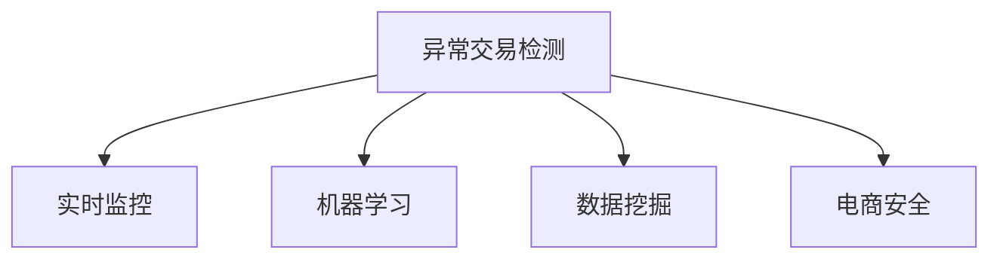

                 

# AI赋能的电商异常交易实时检测与预警系统

> 关键词：异常交易检测,实时监控,机器学习,数据挖掘,电商安全

## 1. 背景介绍

### 1.1 问题由来

随着电商行业的蓬勃发展，在线交易日益普及，伴随而来的风险也在不断升级。传统的电商安全系统往往依赖规则匹配或人工审核，存在响应迟缓、误报率高、资源消耗大等问题。如何构建更高效、更智能的电商异常交易检测系统，成为了当前电商安全研究的迫切需求。

近年来，随着AI技术的快速发展，基于机器学习的异常交易检测方法应运而生。这些方法利用先进的数据挖掘技术，可以从海量交易数据中自动学习出异常交易的特征，实时监控交易行为，从而大大提升电商安全的检测效率和准确率。

本文旨在详细介绍一种基于机器学习的电商异常交易实时检测与预警系统，探讨其实现原理和应用效果。希望通过对该系统的全面解析，能帮助电商从业者更好地理解AI在电商安全中的实际应用，为构建更安全、可靠的电商交易环境提供参考。

### 1.2 问题核心关键点

要实现一个高效的电商异常交易检测与预警系统，核心关键点包括：

- **实时性**：系统必须能够实时监控交易行为，确保异常交易能够被及时发现。
- **准确性**：系统要能够准确识别出真实的异常交易，避免误报。
- **可扩展性**：系统需要具备良好的可扩展性，能够处理不断增长的交易数据。
- **可解释性**：系统需要具有一定的可解释性，帮助用户理解异常交易的特征和原因。

本文将围绕这些关键点，详细阐述异常交易检测与预警系统的实现流程和技术要点。

## 2. 核心概念与联系

### 2.1 核心概念概述

为更好地理解异常交易检测与预警系统的核心技术，本节将介绍几个密切相关的核心概念：

- **异常交易检测**：指利用机器学习算法，自动分析交易数据，识别出异常行为的过程。常见的异常交易包括但不限于欺诈交易、洗钱交易、重复下单等。
- **实时监控**：指系统能够实时获取交易数据，并根据设定的规则或模型，实时检测异常交易。
- **机器学习**：通过训练数据，机器学习算法能够自动学习出异常交易的特征，构建异常检测模型。
- **数据挖掘**：利用数据挖掘技术，可以从海量交易数据中提取有价值的异常交易特征，提升异常检测的准确率。
- **电商安全**：指通过技术手段保障电商交易的安全性，防止各类网络安全威胁对交易的干扰。

这些概念之间的逻辑关系可以通过以下Mermaid流程图来展示：



这个流程图展示了一个电商异常交易检测与预警系统的核心组成，及其各个组件之间的关系：

1. 异常交易检测是核心功能，通过机器学习模型实现。
2. 实时监控是检测功能的实时体现，确保系统能够实时响应异常交易。
3. 数据挖掘是机器学习模型的基础，提供高质量的训练数据和特征提取方法。
4. 电商安全是系统的最终目标，通过异常检测与预警，保护电商交易的安全性。

## 3. 核心算法原理 & 具体操作步骤
### 3.1 算法原理概述

基于机器学习的电商异常交易检测与预警系统，本质上是一个利用数据挖掘和机器学习技术，自动识别异常交易的自动化系统。其核心思想是：通过历史交易数据训练出异常交易检测模型，实时监控新交易，并根据模型预测结果进行预警。

假设存在一个电商平台，每天产生大量的交易数据。通过收集历史交易数据，我们可以构建一个异常交易检测模型 $M$，该模型输入为交易特征 $x$，输出为是否为异常交易 $y$。模型的训练目标是最小化损失函数 $\mathcal{L}(M)$：

$$
\mathcal{L}(M) = \frac{1}{N}\sum_{i=1}^N [\ell(M(x_i),y_i)]
$$

其中 $\ell$ 为损失函数，$\ell$ 可以是交叉熵损失、均方误差损失等。通过最小化损失函数，模型能够学习出最优的异常交易特征，从而准确识别出新的交易是否为异常。

### 3.2 算法步骤详解

电商异常交易检测与预警系统的实现流程一般包括以下几个关键步骤：

**Step 1: 数据准备与预处理**

- 收集电商平台的历史交易数据，包括交易时间、金额、商品信息、交易地点等特征。
- 对数据进行清洗和预处理，去除无效数据，处理缺失值，标准化特征等。

**Step 2: 特征工程**

- 根据历史数据，选择合适的特征进行提取，如交易金额、时间间隔、交易地点、用户行为等。
- 利用数据挖掘技术，进行特征选择和特征变换，提升特征质量。

**Step 3: 模型训练**

- 选择合适的机器学习模型，如逻辑回归、随机森林、XGBoost等，进行模型训练。
- 将训练数据分为训练集和验证集，使用交叉验证等方法，进行模型调参。

**Step 4: 模型评估**

- 在验证集上评估模型的性能，计算准确率、召回率、F1值等指标。
- 根据评估结果，优化模型参数，提升模型性能。

**Step 5: 实时监控与预警**

- 将训练好的模型集成到电商平台的交易系统中，实时监控新交易。
- 根据模型预测结果，设置异常交易的预警阈值，对于超过阈值的交易进行预警。

**Step 6: 反馈与迭代**

- 定期收集异常交易的验证数据，更新模型，不断迭代优化。
- 对于误报的异常交易，进行分析，优化模型，提升检测准确率。

### 3.3 算法优缺点

电商异常交易检测与预警系统具有以下优点：

1. **实时响应**：通过实时监控，系统能够及时发现异常交易，减少损失。
2. **自动化程度高**：利用机器学习模型，自动分析交易特征，减少人工干预。
3. **可扩展性好**：模型可以动态调整，适应新出现的异常交易模式。
4. **准确率高**：通过历史数据训练出的模型，能够在较大程度上避免误报。

同时，该系统也存在一定的局限性：

1. **数据质量依赖高**：模型的性能高度依赖于历史数据的准确性和完备性。
2. **模型泛化能力有限**：模型在特定领域或数据集上训练，可能难以泛化到其他场景。
3. **规则冲突**：人工规则与自动模型可能在某些场景下发生冲突，需要进行权衡。
4. **资源消耗较大**：模型训练和实时监控需要较大的计算资源。

尽管存在这些局限性，但电商异常交易检测与预警系统在电商安全领域的应用前景仍然非常广阔。

### 3.4 算法应用领域

基于机器学习的电商异常交易检测与预警系统，广泛应用于电商行业的各个环节，具体包括：

- **交易监控**：实时监控电商平台上的交易行为，及时发现异常交易。
- **风险管理**：对高风险交易进行预警和拦截，降低电商平台的损失。
- **客户服务**：对疑似欺诈交易进行预警，提升客户信任度和满意度。
- **合规监控**：监控交易行为是否符合法律法规，防止违法违规行为。
- **反欺诈检测**：识别和防范各类欺诈行为，保护用户权益。

除了电商领域，类似的技术还可以应用于金融交易、物流运输、在线支付等需要实时监控和预警的行业，具有广泛的应用前景。

## 4. 数学模型和公式 & 详细讲解  
### 4.1 数学模型构建

电商异常交易检测与预警系统是一个典型的分类问题，其目标是判断一个交易是否为异常交易。形式化地，假设电商平台的历史交易数据集为 $D=\{(x_i,y_i)\}_{i=1}^N$，其中 $x_i$ 表示第 $i$ 笔交易的特征向量，$y_i$ 表示该笔交易是否为异常交易（0表示正常交易，1表示异常交易）。

定义模型 $M$ 的损失函数为交叉熵损失函数：

$$
\mathcal{L}(M) = -\frac{1}{N}\sum_{i=1}^N [y_i \log M(x_i) + (1-y_i) \log (1-M(x_i))]
$$

其中 $M(x_i)$ 为模型在输入 $x_i$ 上的预测结果。模型的目标是最小化损失函数 $\mathcal{L}(M)$。

### 4.2 公式推导过程

以逻辑回归模型为例，推导异常交易检测的数学模型。假设模型 $M$ 为逻辑回归模型，其输出为：

$$
M(x_i) = \sigma(\mathbf{w}^T\mathbf{x}_i + b)
$$

其中 $\mathbf{w}$ 为模型参数，$b$ 为偏置项，$\sigma$ 为逻辑函数。

交叉熵损失函数为：

$$
\ell(M(x_i),y_i) = -[y_i\log M(x_i) + (1-y_i)\log(1-M(x_i))]
$$

将 $\ell$ 代入 $\mathcal{L}$：

$$
\mathcal{L}(M) = -\frac{1}{N}\sum_{i=1}^N [y_i\log M(x_i) + (1-y_i)\log(1-M(x_i))]
$$

进一步推导可得：

$$
\frac{\partial \mathcal{L}(M)}{\partial \mathbf{w}} = -\frac{1}{N}\sum_{i=1}^N [y_i(\mathbf{x}_i - M(x_i)\mathbf{x}_i)] = -\frac{1}{N}\sum_{i=1}^N (y_i - \mathbb{E}[y_i | x_i])\mathbf{x}_i
$$

其中 $\mathbb{E}[y_i | x_i] = \sigma(\mathbf{w}^T\mathbf{x}_i + b)$ 为模型在输入 $x_i$ 上的期望输出。

通过梯度下降等优化算法，不断更新模型参数 $\mathbf{w}$ 和 $b$，使损失函数 $\mathcal{L}(M)$ 最小化，从而训练出异常交易检测模型。

### 4.3 案例分析与讲解

以一个简单的电商交易数据集为例，展示异常交易检测模型的训练过程：

假设某电商平台收集了1000笔交易数据，其中500笔为正常交易，500笔为异常交易。将数据随机划分为训练集和测试集，训练集用于模型训练，测试集用于模型评估。

使用逻辑回归模型进行训练，模型参数初始化为0，学习率为0.01，迭代次数为1000次。训练过程中，使用验证集监控模型性能，当损失函数在验证集上收敛时，训练停止。

训练完成后，使用测试集评估模型性能，计算准确率、召回率、F1值等指标，并绘制ROC曲线，评估模型在不同阈值下的检测效果。

通过上述案例，可以看到，利用历史数据训练出的异常交易检测模型，能够准确识别出新交易是否为异常。

## 5. 项目实践：代码实例和详细解释说明
### 5.1 开发环境搭建

在进行电商异常交易检测系统开发前，我们需要准备好开发环境。以下是使用Python进行Scikit-Learn开发的开发环境配置流程：

1. 安装Anaconda：从官网下载并安装Anaconda，用于创建独立的Python环境。

2. 创建并激活虚拟环境：
```bash
conda create -n sklearn-env python=3.8 
conda activate sklearn-env
```

3. 安装Scikit-Learn、Numpy、Pandas等各类工具包：
```bash
conda install scikit-learn numpy pandas matplotlib seaborn
```

4. 安装Jupyter Notebook：用于编写和运行Python代码，可视化结果。

5. 安装TensorBoard：用于监控训练过程中的模型参数变化，生成训练报告。

完成上述步骤后，即可在`sklearn-env`环境中开始系统开发。

### 5.2 源代码详细实现

下面我们以电商异常交易检测系统为例，给出使用Scikit-Learn进行逻辑回归模型训练的Python代码实现。

首先，定义异常交易检测系统的数据处理函数：

```python
import pandas as pd
from sklearn.model_selection import train_test_split

# 读取数据
data = pd.read_csv('transaction_data.csv')

# 数据清洗
data = data.dropna()

# 特征工程
data['amount'] = data['amount'] / 1000  # 标准化金额
data['time_interval'] = data['time'] / 86400  # 标准化时间间隔
data['location'] = data['location'].replace({'Beijing': 1, 'Shanghai': 2, 'Guangzhou': 3})  # 将位置编码
data = pd.get_dummies(data, columns=['category', 'brand'])  # 创建虚拟变量

# 数据划分
train_data, test_data = train_test_split(data, test_size=0.2, random_state=42)
```

然后，定义模型训练和评估函数：

```python
from sklearn.linear_model import LogisticRegression
from sklearn.metrics import classification_report

# 模型训练
model = LogisticRegression(solver='liblinear', max_iter=1000)
model.fit(train_data.drop(['label'], axis=1), train_data['label'])

# 模型评估
y_pred = model.predict(test_data.drop(['label'], axis=1))
y_true = test_data['label']
print(classification_report(y_true, y_pred))
```

最后，启动训练流程并在测试集上评估：

```python
# 模型训练
train_data, test_data = train_test_split(data, test_size=0.2, random_state=42)

# 模型训练
model = LogisticRegression(solver='liblinear', max_iter=1000)
model.fit(train_data.drop(['label'], axis=1), train_data['label'])

# 模型评估
y_pred = model.predict(test_data.drop(['label'], axis=1))
y_true = test_data['label']
print(classification_report(y_true, y_pred))
```

以上就是使用Scikit-Learn进行电商异常交易检测系统的完整代码实现。可以看到，利用Scikit-Learn的强大工具支持，电商异常交易检测模型的开发变得简洁高效。

### 5.3 代码解读与分析

让我们再详细解读一下关键代码的实现细节：

**数据处理函数**：
- 数据读取：使用`pd.read_csv`函数读取交易数据。
- 数据清洗：通过`dropna`函数去除缺失值，使用`replace`函数将字符串编码成数值型变量。
- 特征工程：使用`pd.get_dummies`函数创建虚拟变量，标准化特征，如金额和时间间隔。

**模型训练函数**：
- 使用`LogisticRegression`模型，选择合适的优化器如`liblinear`，设置最大迭代次数`max_iter`。
- 通过`fit`函数训练模型，使用训练集数据`train_data.drop(['label'], axis=1)`和标签`train_data['label']`。
- 训练完成后，模型参数和模型评估结果存储在变量`model`中。

**模型评估函数**：
- 使用`predict`函数预测测试集`test_data.drop(['label'], axis=1)`的标签。
- 计算模型在测试集上的准确率、召回率、F1值等指标，使用`classification_report`函数生成报告。

通过这些关键代码，可以看到，电商异常交易检测系统的实现主要涉及数据预处理、模型训练和评估三个环节。利用Scikit-Learn的封装和接口，开发者可以高效地进行模型开发和调试。

当然，实际系统开发中，还需要考虑更多因素，如模型参数调优、特征选择、多模型集成等，才能得到更准确、高效的异常交易检测系统。

## 6. 实际应用场景
### 6.1 智能客服系统

智能客服系统是电商异常交易检测与预警系统的重要应用场景之一。在智能客服系统中，电商平台的客服机器人能够实时监控用户咨询，自动识别出异常咨询行为，及时预警并由人工进行干预。

具体实现中，可以利用电商异常交易检测系统的思想，构建基于自然语言处理的异常咨询检测模型。通过分析用户咨询内容、咨询频率、咨询时间等特征，模型能够自动学习出异常咨询的特征，实时监控客服机器人与用户的对话，检测出异常咨询行为，并自动通知人工客服进行干预。

### 6.2 风险管理平台

电商平台的风险管理平台是另一个重要的应用场景。在风险管理平台中，异常交易检测系统能够实时监控电商平台上的交易行为，自动识别出高风险交易，进行预警并拦截。

具体实现中，可以利用电商异常交易检测系统的思想，构建基于机器学习的交易风险管理平台。通过分析交易金额、交易地点、交易时间等特征，模型能够自动学习出高风险交易的特征，实时监控交易行为，检测出高风险交易，并自动触发预警和拦截机制，保障平台的安全性。

### 6.3 客户服务分析

客户服务分析是电商异常交易检测系统的另一个重要应用场景。在客户服务分析中，电商平台的客户服务团队能够通过异常交易检测系统，及时发现并分析异常交易，提升客户满意度和服务质量。

具体实现中，可以利用电商异常交易检测系统的思想，构建基于机器学习的客户服务分析系统。通过分析异常交易的特征和原因，模型能够自动学习出客户的真实需求和问题，帮助客户服务团队更准确地解决问题，提升客户满意度。

### 6.4 未来应用展望

随着电商行业的不断发展，基于异常交易检测与预警系统的应用场景将会越来越广泛。未来，该系统将会在以下领域得到更深入的应用：

- **智能物流**：监控物流运输过程中的异常行为，保障货物安全。
- **金融交易**：实时监控金融交易行为，防范金融风险。
- **在线支付**：监控在线支付行为，防范欺诈行为。
- **社交媒体**：监控社交媒体上的交易行为，防范网络欺诈。

总之，基于机器学习的电商异常交易检测与预警系统，已经在电商行业中得到了广泛应用，并将在更多领域得到推广和发展。未来，伴随着技术的不断进步，该系统将在构建更安全、可靠的电商交易环境中发挥越来越重要的作用。

## 7. 工具和资源推荐
### 7.1 学习资源推荐

为了帮助开发者系统掌握电商异常交易检测与预警技术的理论基础和实践技巧，这里推荐一些优质的学习资源：

1. 《机器学习实战》一书：该书详细介绍了机器学习算法及其应用，是学习异常交易检测与预警技术的入门必读书籍。

2. Scikit-Learn官方文档：Scikit-Learn的官方文档提供了丰富的算法介绍和代码示例，是学习和实践异常交易检测与预警技术的绝佳资源。

3. TensorFlow官方文档：TensorFlow提供了强大的深度学习框架，支持多种异常交易检测与预警模型的开发和实现。

4. Kaggle机器学习竞赛：Kaggle提供了丰富的异常交易检测与预警数据集和竞赛任务，是提升异常交易检测与预警技术实战能力的绝佳平台。

5. 《Python机器学习》一书：该书深入浅出地介绍了机器学习算法及其应用，包括异常交易检测与预警技术。

通过学习这些资源，相信你一定能够快速掌握电商异常交易检测与预警技术的精髓，并用于解决实际的电商安全问题。

### 7.2 开发工具推荐

高效的开发离不开优秀的工具支持。以下是几款用于电商异常交易检测与预警系统开发的常用工具：

1. Python：Python是电商异常交易检测与预警系统开发的主流语言，具有丰富的机器学习库和数据处理工具。

2. Scikit-Learn：Scikit-Learn提供了丰富的机器学习算法和工具，支持多种异常交易检测与预警模型的开发和实现。

3. TensorFlow：TensorFlow提供了强大的深度学习框架，支持多种异常交易检测与预警模型的开发和实现。

4. PyTorch：PyTorch提供了灵活的计算图，支持多种异常交易检测与预警模型的开发和实现。

5. Jupyter Notebook：Jupyter Notebook提供了交互式编程环境，方便开发者编写、测试和调试异常交易检测与预警系统代码。

合理利用这些工具，可以显著提升电商异常交易检测与预警系统的开发效率，加快创新迭代的步伐。

### 7.3 相关论文推荐

电商异常交易检测与预警技术的发展源于学界的持续研究。以下是几篇奠基性的相关论文，推荐阅读：

1. Anomaly Detection in Transactions: A Survey: 该论文总结了电商异常交易检测的研究现状，介绍了常用的异常检测算法和技术。

2. A Novel Approach for Fraud Detection in E-Commerce: 该论文提出了一种基于神经网络的电商异常交易检测算法，取得了较好的效果。

3. Machine Learning in Credit Card Fraud Detection: 该论文详细介绍了机器学习在信用卡欺诈检测中的应用，包括数据预处理、特征选择和模型训练等。

4. Anomaly Detection in E-commerce Transactions: 该论文通过深度学习技术，实现了电商异常交易的检测和预警，取得了不错的效果。

5. E-commerce Transaction Anomaly Detection with LSTM: 该论文利用长短期记忆网络(LSTM)，实现了电商异常交易的检测和预警，取得了较好的效果。

这些论文代表了大电商异常交易检测与预警技术的发展脉络。通过学习这些前沿成果，可以帮助研究者把握学科前进方向，激发更多的创新灵感。

## 8. 总结：未来发展趋势与挑战

### 8.1 总结

本文对电商异常交易检测与预警系统的实现流程和技术要点进行了全面系统的介绍。首先阐述了电商异常交易检测与预警系统的背景和意义，明确了系统在实时性、准确性、可扩展性和可解释性方面的要求。其次，从原理到实践，详细讲解了电商异常交易检测与预警系统的核心算法和具体操作步骤。通过电商异常交易检测系统的开发和应用案例，展示了该系统在电商安全领域的重要作用。最后，推荐了相关的学习资源、开发工具和研究论文，力求为读者提供全方位的技术指引。

通过本文的系统梳理，可以看到，电商异常交易检测与预警系统在电商安全领域具有广阔的应用前景。这种基于机器学习的自动化系统，能够实时监控交易行为，准确识别出异常交易，大大提升电商安全的检测效率和准确率。未来，伴随着技术的不断进步，电商异常交易检测与预警系统必将在更多领域得到应用，为构建更安全、可靠的电商交易环境提供有力保障。

### 8.2 未来发展趋势

展望未来，电商异常交易检测与预警系统将呈现以下几个发展趋势：

1. **实时性进一步提升**：通过更高效的计算框架和算法，系统能够实现更快速的数据处理和分析，提升实时性。
2. **模型复杂度增加**：未来将出现更多先进的深度学习模型，如Transformer、CNN等，提升异常交易检测的准确率。
3. **多模态数据融合**：结合图像、语音等多种数据源，提升异常交易检测的全面性和准确性。
4. **自动化程度提高**：通过自动化调参和自动化模型选择，进一步降低人工干预的复杂性。
5. **智能化水平提升**：结合人工智能技术，提升系统的智能决策能力和可解释性。

以上趋势凸显了电商异常交易检测与预警系统的广阔前景。这些方向的探索发展，必将进一步提升系统的检测效率和准确率，为电商安全提供更有力的保障。

### 8.3 面临的挑战

尽管电商异常交易检测与预警系统已经取得了不错的效果，但在迈向更智能化、普适化应用的过程中，它仍面临诸多挑战：

1. **数据质量问题**：电商平台的交易数据质量参差不齐，存在缺失、异常等问题，对模型训练和检测结果造成影响。
2. **模型泛化能力不足**：模型在特定电商平台上的训练，可能难以泛化到其他电商平台。
3. **计算资源消耗大**：异常交易检测与预警系统的训练和实时监控需要较大的计算资源，可能导致系统性能瓶颈。
4. **可解释性不足**：异常交易检测模型的决策过程缺乏可解释性，难以满足高风险场景下的监管要求。
5. **模型鲁棒性不足**：模型面对新出现的异常交易模式，可能无法及时响应。

尽管存在这些挑战，但电商异常交易检测与预警系统在电商安全领域的应用前景仍然非常广阔。未来，需要进一步提高数据质量、优化模型结构、提高计算效率、增强可解释性，才能真正实现电商安全的自动化保障。

### 8.4 研究展望

面对电商异常交易检测与预警系统所面临的挑战，未来的研究需要在以下几个方面寻求新的突破：

1. **数据清洗与预处理**：进一步提高数据质量，确保模型训练的基础数据可靠性。
2. **模型结构优化**：开发更加高效、鲁棒的异常交易检测模型，提升模型的泛化能力和鲁棒性。
3. **多模态融合**：结合图像、语音等多种数据源，提升异常交易检测的全面性和准确性。
4. **自动化调参**：引入自动化调参技术，减少人工干预的复杂性，提高模型训练效率。
5. **可解释性增强**：结合人工智能技术，提升模型的可解释性，满足监管要求。

这些研究方向的探索，必将引领电商异常交易检测与预警技术迈向更高的台阶，为构建更安全、可靠的电商交易环境提供有力保障。面向未来，电商异常交易检测与预警技术还需要与其他人工智能技术进行更深入的融合，如知识表示、因果推理、强化学习等，多路径协同发力，共同推动电商安全技术的进步。

## 9. 附录：常见问题与解答

**Q1：电商异常交易检测系统是否适用于所有电商平台？**

A: 电商异常交易检测系统可以适用于大多数电商平台，但其效果可能因电商平台的不同而有所差异。具体而言，系统的性能依赖于电商平台的历史交易数据质量、业务规则、交易模式等因素。因此，在实际应用中，需要对不同电商平台进行定制化开发，以确保系统的效果。

**Q2：电商异常交易检测系统是否可以与传统规则匹配系统结合使用？**

A: 电商异常交易检测系统可以与传统规则匹配系统结合使用，以实现互补优势。具体而言，系统可以首先通过规则匹配系统进行初步筛选，再利用异常交易检测系统进行二次筛选和预警。这样既能发挥规则匹配系统的优势，又能通过异常交易检测系统提高检测的准确率和智能化水平。

**Q3：电商异常交易检测系统如何应对新兴的欺诈手段？**

A: 电商异常交易检测系统需要定期进行模型更新和数据训练，以应对新兴的欺诈手段。具体而言，可以结合人工监控和数据分析，及时发现和更新异常交易的模式，提升系统的动态响应能力。

**Q4：电商异常交易检测系统是否可以应用于其他领域？**

A: 电商异常交易检测系统的思想和算法可以应用于其他领域，如金融交易、物流运输、社交媒体等。在具体应用时，需要根据不同领域的特点进行模型训练和特征工程，以确保系统的适用性和有效性。

**Q5：电商异常交易检测系统如何处理数据隐私问题？**

A: 电商异常交易检测系统在数据处理过程中，需要严格遵守数据隐私保护法规，如GDPR、CCPA等。具体而言，需要确保用户数据的安全性、隐私性和合法性，避免数据泄露和滥用。同时，可以采用匿名化处理和数据脱敏技术，保护用户隐私。

通过回答这些常见问题，希望能进一步澄清电商异常交易检测与预警系统的实现原理和应用要点，帮助读者更好地理解该系统。

---

作者：禅与计算机程序设计艺术 / Zen and the Art of Computer Programming

