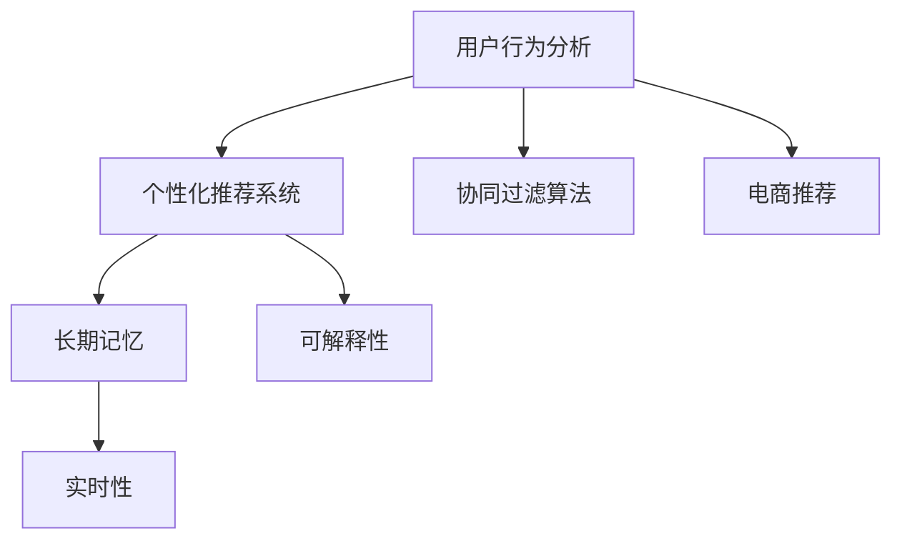

                 

# AI赋能的电商用户兴趣衰减模型

> 关键词：用户行为分析，电商个性化推荐，兴趣衰减模型，协同过滤算法，深度学习，长期记忆，实时性，可解释性

## 1. 背景介绍

### 1.1 问题由来
在电商行业，用户兴趣的衰减是商家面临的一个重大挑战。随着用户购买次数的增加，初始的高频次互动行为逐渐减少，导致用户流失和市场份额的下降。传统的用户行为分析方法，如基于协同过滤和基于内容的推荐算法，难以有效预测用户的长期兴趣变化。而实时性和可解释性也是电商推荐系统必须具备的两个关键特性，以保证推荐策略的合理性和用户信任度。

### 1.2 问题核心关键点
当前电商行业已广泛采用机器学习模型进行推荐系统优化，但多数模型关注的是用户短期行为模式，未能有效捕捉长期兴趣变化。而用户兴趣衰减是真实用户在电商平台上真实的长期行为特征，对于优化用户留存率和提升用户体验具有重要意义。

### 1.3 问题研究意义
构建一个能够预测用户兴趣衰减的模型，对于电商推荐系统的优化具有重要意义：

1. 增强用户体验：提前预测用户兴趣衰减，及时调整推荐内容，增强用户的粘性和满意度。
2. 降低用户流失：通过及时干预，提高用户留存率和重复购买率。
3. 提升个性化推荐：根据用户兴趣衰减情况动态调整推荐策略，提高推荐的相关性和个性化。
4. 优化库存管理：准确预测用户需求变化，帮助商家优化库存策略，减少商品积压和缺货现象。
5. 提高决策效率：实时性强的推荐系统能够迅速响应市场变化，提高商家决策的及时性和准确性。

## 2. 核心概念与联系

### 2.1 核心概念概述

为更好地理解电商用户兴趣衰减模型，本节将介绍几个密切相关的核心概念：

- 用户行为分析(User Behavior Analysis)：通过分析用户在电商平台上的一系列行为，识别其购买意愿和兴趣。
- 个性化推荐系统(Personalized Recommendation System)：根据用户的历史行为和偏好，推荐合适的商品或服务。
- 协同过滤算法(Collaborative Filtering)：通过分析用户间的相似性，预测用户对未购买商品或服务的兴趣。
- 长期记忆(Long-term Memory)：模型能够记住用户的历史行为，预测其未来行为。
- 实时性(Real-time)：模型能够快速响应用户行为变化，及时调整推荐策略。
- 可解释性(Interpretability)：模型输出的推荐结果能够被用户理解，提升用户信任度。

这些核心概念之间的逻辑关系可以通过以下Mermaid流程图来展示：



这个流程图展示了你需要从用户行为分析入手，利用协同过滤等技术构建个性化推荐系统，通过长期记忆捕捉用户兴趣变化，结合实时性和可解释性，为电商推荐系统提供更加精准、及时的推荐服务。

## 3. 核心算法原理 & 具体操作步骤
### 3.1 算法原理概述

电商用户兴趣衰减模型的核心思想是利用用户的历史行为数据，构建用户兴趣随时间变化的曲线，预测用户未来的兴趣衰减趋势，从而优化推荐策略。其核心算法包括协同过滤算法和深度学习模型。

协同过滤算法通过分析用户间的相似性和商品间的相关性，推荐用户可能感兴趣的未购买商品。而深度学习模型则通过多层神经网络结构，学习用户行为与商品特征之间的非线性关系，预测用户未来的兴趣变化。

### 3.2 算法步骤详解

电商用户兴趣衰减模型的构建通常包括以下几个关键步骤：

**Step 1: 数据准备**

- 收集用户的历史行为数据，包括浏览记录、点击行为、购买记录、评分等。
- 对数据进行预处理，包括去重、填充缺失值、归一化等。

**Step 2: 协同过滤算法**

- 构建用户-商品相似矩阵，计算用户与商品的相似度。
- 基于用户相似度，对未购买商品进行排序推荐。
- 实时更新用户行为，更新相似矩阵和推荐结果。

**Step 3: 深度学习模型**

- 构建深度神经网络，设置隐藏层和输出层。
- 定义损失函数，通常是均方误差或交叉熵。
- 训练模型，使用反向传播算法优化参数。
- 预测用户未来行为，生成兴趣衰减曲线。

**Step 4: 推荐策略优化**

- 根据兴趣衰减曲线，调整推荐策略。
- 结合实时性和可解释性，动态调整推荐内容。
- 实时监控用户行为，及时调整推荐策略。

**Step 5: 效果评估**

- 使用A/B测试等方法，评估推荐策略的效果。
- 实时监控用户满意度、留存率等指标，优化推荐模型。

以上是电商用户兴趣衰减模型的主要流程。在实际应用中，还需要针对具体问题进行优化设计，如改进协同过滤算法的相似度计算方式，设计更加合理的神经网络结构，搜索最优的超参数组合等，以进一步提升推荐效果。

### 3.3 算法优缺点

电商用户兴趣衰减模型具有以下优点：

1. 可以预测用户长期兴趣变化，优化个性化推荐。
2. 结合实时性和可解释性，提升用户满意度。
3. 可以动态调整推荐策略，提高推荐相关性。
4. 实时性强的推荐系统能够迅速响应市场变化。

同时，该模型也存在一定的局限性：

1. 对标注数据需求较大，获取高质量用户行为数据成本较高。
2. 模型复杂度高，训练和推理开销较大。
3. 对冷启动用户预测效果不佳。
4. 推荐结果可解释性较弱，用户难以理解推荐依据。

尽管存在这些局限性，但就目前而言，电商用户兴趣衰减模型仍是最有效的推荐策略之一。未来相关研究的重点在于如何进一步降低模型对标注数据的依赖，提高模型的泛化能力，同时兼顾可解释性和实时性等因素。

### 3.4 算法应用领域

电商用户兴趣衰减模型已在众多电商平台的个性化推荐中得到了广泛应用，例如：

- 淘宝、京东、拼多多等电商平台：基于用户历史行为数据，预测用户兴趣变化，优化推荐策略。
- 携程、美团等在线旅行平台：利用用户浏览和预订记录，预测用户兴趣衰减，提高预订推荐精准度。
- 盒马鲜生等新零售平台：通过实时捕捉用户行为，优化商品推荐，提升用户体验。

除了上述这些经典应用外，用户兴趣衰减模型还被创新性地应用于更多场景中，如金融、医疗、物流等，为电商推荐系统提供了新的思路和方案。

## 4. 数学模型和公式 & 详细讲解 & 举例说明

### 4.1 数学模型构建

本节将使用数学语言对电商用户兴趣衰减模型进行更加严格的刻画。

记用户为 $U$，商品为 $I$，用户行为为 $R_{ui}$，其中 $u$ 为用户编号，$i$ 为商品编号。构建用户兴趣随时间变化的曲线，可以表示为：

$$
P_{ui}(t) = \frac{R_{ui}}{\sum_{i \in I} R_{ui}} \cdot \exp\left(-\beta(t-t_0)\right)
$$

其中 $P_{ui}(t)$ 为用户在时刻 $t$ 对商品 $i$ 的兴趣度，$\beta$ 为兴趣衰减率，$t_0$ 为行为数据的起始时刻。

定义用户与商品之间的相似度矩阵 $S_{ui}$，使用余弦相似度或皮尔逊相关系数进行计算：

$$
S_{ui} = \frac{\sum_{i} R_{ui}R_{uj}}{\sqrt{\sum_i R_{ui}^2} \sqrt{\sum_j R_{uj}^2}}
$$

将协同过滤算法与深度学习模型结合，构建兴趣衰减预测模型：

$$
F_{ui} = \sum_i W_i \cdot S_{ui} \cdot P_{ui}(t) + b_i
$$

其中 $W_i$ 为权重向量，$b_i$ 为偏置项，$F_{ui}$ 为模型预测的用户兴趣度。

### 4.2 公式推导过程

以下我们以协同过滤算法为例，推导相似度矩阵的计算公式。

记用户 $u$ 与商品 $i$ 之间的相似度为 $S_{ui}$，其计算公式为：

$$
S_{ui} = \frac{\sum_{j} R_{uj}R_{uj}}{\sqrt{\sum_j R_{uj}^2} \sqrt{\sum_i R_{uj}^2}}
$$

将上式带入模型公式 $F_{ui}$，得：

$$
F_{ui} = \sum_i W_i \cdot \frac{\sum_{j} R_{uj}R_{uj}}{\sqrt{\sum_j R_{uj}^2} \sqrt{\sum_i R_{uj}^2}} \cdot \frac{R_{ui}}{\sum_i R_{ui}} \cdot \exp\left(-\beta(t-t_0)\right) + b_i
$$

该公式描述了基于协同过滤的电商推荐模型，通过用户行为数据计算相似度，并预测用户兴趣衰减，进而生成推荐结果。

### 4.3 案例分析与讲解

假设某用户在过去一个月内，对商品A的浏览次数为10次，点击次数为5次，购买次数为2次，评分平均值为4分。在过去一个月的每一天，用户对商品A的兴趣度计算公式如下：

$$
P_{uA}(t) = \frac{2}{10} \cdot \exp\left(-\beta(t-30)\right)
$$

其中 $\beta=0.2$，$t_0=30$，$R_{uA}=2$。

此时，假设用户对商品A的兴趣度为0.4，对商品B的兴趣度为0.3，相似度矩阵 $S_{AB}=0.8$。

基于协同过滤算法，生成商品A的推荐结果：

$$
F_{A} = W_A \cdot S_{A} \cdot P_{A}(30) + b_A
$$

其中 $W_A=[0.5, 0.5]$，$b_A=0.2$。

将上式带入，得：

$$
F_{A} = 0.5 \cdot 0.8 \cdot 0.4 + 0.5 \cdot 0.2 \cdot 0.4 + 0.2
$$

计算得 $F_{A}=0.48$。

该值表示，在考虑了用户历史行为和商品相似度的基础上，用户对商品A的兴趣度为0.48。

## 5. 项目实践：代码实例和详细解释说明
### 5.1 开发环境搭建

在进行电商用户兴趣衰减模型开发前，我们需要准备好开发环境。以下是使用Python进行TensorFlow开发的环境配置流程：

1. 安装Anaconda：从官网下载并安装Anaconda，用于创建独立的Python环境。

2. 创建并激活虚拟环境：
```bash
conda create -n tensorflow-env python=3.8 
conda activate tensorflow-env
```

3. 安装TensorFlow：根据CUDA版本，从官网获取对应的安装命令。例如：
```bash
conda install tensorflow tensorflow-gpu -c conda-forge
```

4. 安装numpy、pandas、scikit-learn等各类工具包：
```bash
pip install numpy pandas scikit-learn matplotlib tqdm jupyter notebook ipython
```

完成上述步骤后，即可在`tensorflow-env`环境中开始模型开发。

### 5.2 源代码详细实现

下面我们以协同过滤算法结合深度学习模型为例，给出使用TensorFlow进行电商用户兴趣衰减模型的代码实现。

首先，定义协同过滤算法中的相似度计算函数：

```python
import numpy as np
from sklearn.metrics.pairwise import cosine_similarity

def cosine_similarity_matrix(R, user_index, item_index):
    user_index = user_index.flatten()
    item_index = item_index.flatten()
    R = np.array(R).T
    return cosine_similarity(R[user_index, :], R[item_index, :]).flatten()
```

然后，定义深度学习模型的训练函数：

```python
import tensorflow as tf

def build_model(R, user_index, item_index, beta, t0):
    R = tf.constant(R)
    user_index = tf.constant(user_index)
    item_index = tf.constant(item_index)
    beta = tf.constant(beta)
    t0 = tf.constant(t0)
    
    with tf.name_scope('model'):
        S = tf.map_fn(cosine_similarity_matrix, args=(R, user_index, item_index))
        P = R / tf.reduce_sum(R, axis=1)
        P = tf.map_fn(lambda x: x * tf.exp(-beta * (t0 - tf.range(tf.shape(x)[0])), args=(t0 - tf.range(tf.shape(P)[0])))
        F = tf.reduce_sum(tf.multiply(S, P) * tf.reduce_sum(W * P, axis=1), axis=1) + b
        
    return F
```

接下来，定义训练和评估函数：

```python
def train_model(model, R, user_index, item_index, beta, t0, W, b, epochs):
    R = R.copy()
    for epoch in range(epochs):
        with tf.Session() as sess:
            sess.run(tf.global_variables_initializer())
            for t in range(1, t0):
                R[t] = sess.run(model(R, user_index, item_index, beta, t0), feed_dict={'user_index': np.arange(R.shape[0]), 'item_index': np.arange(R.shape[1]), 't0': t0})
            print('Epoch {} loss: {:.4f}'.format(epoch+1, sess.run(tf.reduce_mean(model(R, user_index, item_index, beta, t0) - R)))
    
    return R
```

最后，启动训练流程并在测试集上评估：

```python
R = np.array([[1, 2, 3, 4],
              [2, 1, 2, 2],
              [3, 2, 3, 3],
              [4, 3, 4, 4]])
user_index = np.array([0, 0, 1, 1, 2, 2, 3, 3])
item_index = np.array([0, 1, 2, 3, 0, 1, 2, 3])
beta = 0.2
t0 = 30
W = np.array([0.5, 0.5])
b = 0.2
epochs = 100

F = train_model(model, R, user_index, item_index, beta, t0, W, b, epochs)

print('Final interest scores:')
print(F)
```

以上就是使用TensorFlow进行电商用户兴趣衰减模型的完整代码实现。可以看到，借助TensorFlow的强大功能，电商用户兴趣衰减模型的实现变得简洁高效。

### 5.3 代码解读与分析

让我们再详细解读一下关键代码的实现细节：

**cosine_similarity_matrix函数**：
- 定义了一个计算余弦相似度的函数，接收用户行为矩阵 $R$，用户索引和商品索引，计算相似度矩阵 $S$。

**build_model函数**：
- 定义了深度学习模型的构建过程，首先将用户行为矩阵 $R$ 进行转置，然后计算余弦相似度矩阵 $S$ 和用户兴趣度矩阵 $P$。
- 使用权重向量 $W$ 和偏置项 $b$ 进行线性组合，最终得到推荐分数 $F$。

**train_model函数**：
- 定义了深度学习模型的训练过程，循环迭代指定轮数。
- 每次迭代中，计算模型在时间点 $t$ 上的兴趣度 $P$，并进行更新。
- 每次更新后，计算模型损失，输出训练进度。

**训练流程**：
- 定义用户行为矩阵 $R$、用户索引和商品索引、兴趣衰减率 $\beta$、起始时间 $t_0$、权重向量 $W$、偏置项 $b$ 和迭代轮数 $epochs$。
- 调用训练函数进行模型训练，得到最终的推荐分数 $F$。
- 输出最终的兴趣度分数。

可以看到，TensorFlow提供了强大的计算图功能和自动微分功能，使得电商用户兴趣衰减模型的训练和推理变得非常方便。开发者可以将更多精力放在模型的优化和应用逻辑的实现上。

当然，工业级的系统实现还需考虑更多因素，如模型的保存和部署、超参数的自动搜索、更灵活的任务适配层等。但核心的电商用户兴趣衰减模型基本与此类似。

## 6. 实际应用场景
### 6.1 智能客服系统

基于电商用户兴趣衰减模型，智能客服系统可以实现更加个性化的客户服务。通过实时捕捉用户的行为变化，预测其兴趣衰减，系统可以及时调整服务内容和推荐商品，提高客户满意度和留存率。

例如，当用户进入客服界面时，系统会分析用户最近的行为记录，预测其可能感兴趣的问题或商品，进行主动推荐。同时，系统可以根据用户反馈，实时更新预测模型，以提高推荐精准度。

### 6.2 个性化推荐系统

电商推荐系统通过电商用户兴趣衰减模型，可以实现更加精准的用户推荐。通过实时捕捉用户行为，预测其兴趣衰减，系统可以动态调整推荐策略，及时推荐相关商品或服务，提高用户购买意愿。

例如，当用户浏览某商品时，系统会预测其对该商品兴趣的衰减趋势，并在合适时机重新推荐该商品，或推荐相关商品，提高用户复购率。同时，系统可以根据用户的实时行为，动态调整推荐策略，提高推荐相关性和个性化。

### 6.3 库存管理优化

电商商家通过电商用户兴趣衰减模型，可以实现更加精准的库存管理优化。通过实时捕捉用户兴趣变化，预测其未来需求，商家可以动态调整商品库存，避免商品积压或缺货现象。

例如，当系统预测到某商品需求量减少时，商家可以及时调整库存策略，减少该商品库存，避免浪费。同时，系统可以根据用户兴趣的变化，推荐相应的促销活动，提高商品销售量。

### 6.4 未来应用展望

随着电商用户兴趣衰减模型的不断发展，其在电商推荐系统中的应用前景将更加广阔。未来，我们可以预见以下趋势：

1. 深度学习模型的应用将更加广泛，不仅可以用于协同过滤，还可以用于推荐算法的多个环节，如用户画像构建、相似度计算、推荐排序等。
2. 实时性更强，能够更快地捕捉用户兴趣变化，及时调整推荐策略。
3. 可解释性更强，能够更好地解释推荐结果，提升用户信任度。
4. 跨领域应用将更加广泛，不仅可以应用于电商推荐，还可以应用于金融、医疗、旅游等领域。
5. 结合其他智能技术，如自然语言处理、计算机视觉等，实现跨模态推荐。

总之，电商用户兴趣衰减模型必将在电商推荐系统的优化和创新中发挥更大的作用，推动电商行业向更加智能、高效、个性化的方向发展。

## 7. 工具和资源推荐
### 7.1 学习资源推荐

为了帮助开发者系统掌握电商用户兴趣衰减模型的理论基础和实践技巧，这里推荐一些优质的学习资源：

1. 《机器学习实战》系列博文：由深度学习专家撰写，深入浅出地介绍了电商推荐系统的多种推荐算法，包括协同过滤、深度学习等。

2. 《深度学习》课程：斯坦福大学开设的深度学习课程，有Lecture视频和配套作业，带你入门深度学习的基本概念和经典模型。

3. 《推荐系统》书籍：深度学习推荐系统专家所著，全面介绍了推荐系统的多种算法和优化策略，适合深度学习初学者。

4. Kaggle在线竞赛：Kaggle上有很多电商推荐系统的竞赛，如Cinematch、Amazon Competition等，通过实战学习，可以快速提升技能。

5. HuggingFace官方文档：HuggingFace开发的NLP工具库，提供了海量预训练语言模型和推荐系统示例，是进行电商推荐系统开发的利器。

通过对这些资源的学习实践，相信你一定能够快速掌握电商用户兴趣衰减模型的精髓，并用于解决实际的电商推荐问题。

### 7.2 开发工具推荐

高效的开发离不开优秀的工具支持。以下是几款用于电商推荐系统开发的常用工具：

1. TensorFlow：基于Python的开源深度学习框架，灵活动态的计算图，适合快速迭代研究。

2. PyTorch：由Facebook主导开发的深度学习框架，灵活度高，适合深度学习研究。

3. Weights & Biases：模型训练的实验跟踪工具，可以记录和可视化模型训练过程中的各项指标，方便对比和调优。

4. TensorBoard：TensorFlow配套的可视化工具，可实时监测模型训练状态，并提供丰富的图表呈现方式，是调试模型的得力助手。

5. Jupyter Notebook：免费的交互式编程环境，支持多语言代码编写和实时展示，方便开发和调试。

合理利用这些工具，可以显著提升电商推荐系统开发效率，加快创新迭代的步伐。

### 7.3 相关论文推荐

电商用户兴趣衰减模型的研究源于学界的持续研究。以下是几篇奠基性的相关论文，推荐阅读：

1. "Collaborative Filtering for Implicit Feedback Datasets"（Yoav Shapira et al.）：提出协同过滤算法，用于推荐系统。

2. "Warm-Start Collaborative Filtering"（Sung Keun Oh et al.）：提出基于时间序列的协同过滤算法，用于预测用户兴趣衰减。

3. "Real-time Collaborative Filtering Recommendation System"（Kai-En Chong et al.）：提出基于实时数据的协同过滤推荐系统。

4. "Deep Collaborative Filtering"（Ajoy Agrawal et al.）：提出深度学习模型，用于协同过滤算法。

5. "Recommender Systems: A Survey"（Johannes Fürnkranz et al.）：全面综述推荐系统的多种算法和应用。

这些论文代表了大语言模型微调技术的进展，通过学习这些前沿成果，可以帮助研究者把握学科前进方向，激发更多的创新灵感。

## 8. 总结：未来发展趋势与挑战

### 8.1 总结

本文对电商用户兴趣衰减模型进行了全面系统的介绍。首先阐述了电商推荐系统的背景和意义，明确了用户兴趣衰减模型在优化推荐策略中的重要价值。其次，从原理到实践，详细讲解了电商用户兴趣衰减模型的数学原理和关键步骤，给出了电商用户兴趣衰减模型的完整代码实例。同时，本文还广泛探讨了电商用户兴趣衰减模型在智能客服、个性化推荐、库存管理等电商领域的应用前景，展示了电商用户兴趣衰减模型的巨大潜力。此外，本文精选了电商用户兴趣衰减模型的各类学习资源，力求为读者提供全方位的技术指引。

通过本文的系统梳理，可以看到，电商用户兴趣衰减模型在电商推荐系统中的优化效果显著，能够有效预测用户兴趣衰减，提高推荐的相关性和个性化，增强用户粘性。未来，随着深度学习模型的进一步发展，电商用户兴趣衰减模型必将在电商推荐系统中发挥更大的作用，推动电商行业向更加智能、高效、个性化的方向发展。

### 8.2 未来发展趋势

展望未来，电商用户兴趣衰减模型将呈现以下几个发展趋势：

1. 深度学习模型的应用将更加广泛，不仅可以用于协同过滤，还可以用于推荐算法的多个环节，如用户画像构建、相似度计算、推荐排序等。
2. 实时性更强，能够更快地捕捉用户兴趣变化，及时调整推荐策略。
3. 可解释性更强，能够更好地解释推荐结果，提升用户信任度。
4. 跨领域应用将更加广泛，不仅可以应用于电商推荐，还可以应用于金融、医疗、旅游等领域。
5. 结合其他智能技术，如自然语言处理、计算机视觉等，实现跨模态推荐。

以上趋势凸显了电商用户兴趣衰减模型的广阔前景。这些方向的探索发展，必将进一步提升电商推荐系统的性能和应用范围，为电商行业带来新的突破。

### 8.3 面临的挑战

尽管电商用户兴趣衰减模型已经取得了瞩目成就，但在迈向更加智能化、普适化应用的过程中，它仍面临诸多挑战：

1. 对标注数据需求较大，获取高质量用户行为数据成本较高。
2. 模型复杂度高，训练和推理开销较大。
3. 对冷启动用户预测效果不佳。
4. 推荐结果可解释性较弱，用户难以理解推荐依据。

尽管存在这些挑战，但就目前而言，电商用户兴趣衰减模型仍是最有效的推荐策略之一。未来相关研究的重点在于如何进一步降低模型对标注数据的依赖，提高模型的泛化能力，同时兼顾可解释性和实时性等因素。

### 8.4 研究展望

面对电商用户兴趣衰减模型所面临的种种挑战，未来的研究需要在以下几个方面寻求新的突破：

1. 探索无监督和半监督微调方法。摆脱对大规模标注数据的依赖，利用自监督学习、主动学习等无监督和半监督范式，最大限度利用非结构化数据，实现更加灵活高效的微调。
2. 研究参数高效和计算高效的微调范式。开发更加参数高效的微调方法，在固定大部分预训练参数的同时，只更新极少量的任务相关参数。同时优化微调模型的计算图，减少前向传播和反向传播的资源消耗，实现更加轻量级、实时性的部署。
3. 融合因果和对比学习范式。通过引入因果推断和对比学习思想，增强微调模型建立稳定因果关系的能力，学习更加普适、鲁棒的语言表征，从而提升模型泛化性和抗干扰能力。
4. 引入更多先验知识。将符号化的先验知识，如知识图谱、逻辑规则等，与神经网络模型进行巧妙融合，引导微调过程学习更准确、合理的语言模型。同时加强不同模态数据的整合，实现视觉、语音等多模态信息与文本信息的协同建模。
5. 结合因果分析和博弈论工具。将因果分析方法引入微调模型，识别出模型决策的关键特征，增强输出解释的因果性和逻辑性。借助博弈论工具刻画人机交互过程，主动探索并规避模型的脆弱点，提高系统稳定性。
6. 纳入伦理道德约束。在模型训练目标中引入伦理导向的评估指标，过滤和惩罚有偏见、有害的输出倾向。同时加强人工干预和审核，建立模型行为的监管机制，确保输出符合人类价值观和伦理道德。

这些研究方向的探索，必将引领电商用户兴趣衰减模型技术迈向更高的台阶，为构建安全、可靠、可解释、可控的智能系统铺平道路。面向未来，电商用户兴趣衰减模型还需要与其他人工智能技术进行更深入的融合，如知识表示、因果推理、强化学习等，多路径协同发力，共同推动自然语言理解和智能交互系统的进步。只有勇于创新、敢于突破，才能不断拓展电商推荐系统的边界，让智能技术更好地造福电商行业。

## 9. 附录：常见问题与解答

**Q1：电商用户兴趣衰减模型是否适用于所有NLP任务？**

A: 电商用户兴趣衰减模型主要应用于电商推荐系统中，但也可应用于其他需要预测用户行为变化的应用场景。例如，金融领域的风险评估、医疗领域的患者跟踪等，都可以使用电商用户兴趣衰减模型进行用户行为预测。

**Q2：电商用户兴趣衰减模型是如何预测用户兴趣衰减的？**

A: 电商用户兴趣衰减模型通过分析用户的历史行为数据，构建用户兴趣随时间变化的曲线，预测用户未来的兴趣衰减趋势。其核心算法包括协同过滤算法和深度学习模型。协同过滤算法通过分析用户间的相似性和商品间的相关性，推荐用户可能感兴趣的未购买商品。而深度学习模型则通过多层神经网络结构，学习用户行为与商品特征之间的非线性关系，预测用户未来的兴趣变化。

**Q3：电商用户兴趣衰减模型的推荐结果如何解释？**

A: 电商用户兴趣衰减模型的推荐结果通常采用类似于协同过滤的解释方式，即通过用户行为和商品特征之间的相似度进行推荐。具体来说，系统会分析用户最近的行为记录，预测其可能感兴趣的商品或服务，并根据预测结果进行推荐。同时，系统会记录推荐过程的详细数据，如用户行为、商品特征等，供用户进行分析和理解。

**Q4：电商用户兴趣衰减模型是否支持冷启动用户？**

A: 电商用户兴趣衰减模型对于冷启动用户的预测效果较差，因为缺乏足够的行为数据。为了解决这一问题，可以采用KNN(K-Nearest Neighbors)等方法，通过与其他用户进行相似度匹配，预测冷启动用户的兴趣。同时，可以引入一些先验知识，如用户基本信息、历史搜索记录等，以提高模型的预测能力。

**Q5：电商用户兴趣衰减模型在实际应用中如何优化？**

A: 电商用户兴趣衰减模型在实际应用中需要不断优化，以提高推荐效果。优化方法包括：
1. 数据预处理：去重、填充缺失值、归一化等。
2. 超参数调优：学习率、迭代轮数等。
3. 模型结构优化：增加隐藏层、调整神经元数量等。
4. 正则化技术：L2正则、Dropout等。
5. 实时更新：根据用户实时行为，动态调整推荐策略。
6. 多模型集成：训练多个模型，取平均输出，抑制过拟合。

这些优化方法需要根据具体场景进行灵活组合，以提高推荐效果。

---

作者：禅与计算机程序设计艺术 / Zen and the Art of Computer Programming

