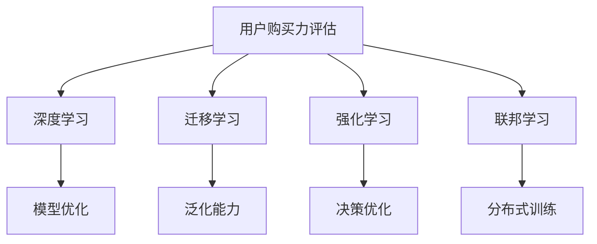

                 

# AI赋能的电商用户购买力评估与信用模型

## 1. 背景介绍

### 1.1 问题由来

随着电子商务的迅猛发展，线上交易成为越来越多消费者首选的购物方式。然而，电商平台在追求用户增长和交易量提升的同时，也面临着诸多挑战，如用户流失率、订单退货率、欺诈风险等。针对这些问题，如何精准识别高价值用户、有效防范信用风险，成为电商企业亟需解决的关键问题。

在电商领域，用户购买力和信用评估至关重要。用户购买力评估能够帮助电商平台识别具有较高消费潜力的用户，从而进行精准营销和个性化推荐。信用评估则能够评估用户的历史行为和信用风险，防范欺诈和恶意行为，保障交易安全。

然而，传统的用户购买力和信用评估方法往往依赖于简单的统计指标和规则模型，无法全面反映用户复杂的行为特征和动态变化，导致评估结果存在较大偏差。随着人工智能技术的进步，基于机器学习和深度学习的评估方法逐渐崭露头角，有效提升了评估的准确性和可靠性。

### 1.2 问题核心关键点

本节将重点介绍用户购买力和信用评估的两个核心问题，并阐明AI技术如何赋能解决这些问题。

1. **用户购买力评估**：通过AI技术，可以对用户的消费行为进行深入分析，挖掘出用户的购买能力和消费偏好，从而预测其未来的购买意愿和潜力。

2. **用户信用评估**：利用AI技术，可以对用户的交易行为和信用记录进行全面监控和分析，评估其信用风险，从而制定针对性的管理措施，防范欺诈和恶意行为。

## 2. 核心概念与联系

### 2.1 核心概念概述

为更好地理解AI赋能的用户购买力和信用评估，本节将介绍几个密切相关的核心概念：

1. **用户购买力评估**：通过分析用户的消费行为、浏览历史、购买记录等数据，评估其未来的购买意愿和潜力。

2. **用户信用评估**：基于用户的历史交易行为和信用记录，评估其信用风险，预测其可能发生的欺诈行为。

3. **深度学习**：通过多层神经网络对数据进行学习和建模，提取复杂非线性关系，提升评估的准确性和可靠性。

4. **迁移学习**：将已在新领域应用成功的模型，迁移到目标任务上，从而提高评估模型的泛化能力。

5. **强化学习**：通过奖励机制训练模型，优化其决策策略，提升信用风险管理的效果。

6. **联邦学习**：在数据分布不均匀的情况下，通过分布式训练方式，保持模型隐私和安全，增强评估模型的公平性和可靠性。

这些核心概念之间的逻辑关系可以通过以下Mermaid流程图来展示：



这个流程图展示了大语言模型的核心概念及其之间的关系：

1. 用户购买力评估通过深度学习模型进行数据分析。
2. 迁移学习增强模型的泛化能力，适用于多领域任务。
3. 强化学习优化决策策略，提升信用风险管理效果。
4. 联邦学习保护用户隐私，保持模型公平性。
5. 模型优化基于深度学习和强化学习结果，进一步提升评估效果。

## 3. 核心算法原理 & 具体操作步骤
### 3.1 算法原理概述

AI赋能的用户购买力和信用评估，主要基于深度学习模型，通过大规模数据训练得到。其核心思想是：

1. **用户购买力评估**：通过分析用户的消费行为、浏览历史、购买记录等数据，构建用户购买力的预测模型。

2. **用户信用评估**：基于用户的历史交易行为和信用记录，构建用户信用风险的评估模型。

3. **模型训练**：在大量标注数据上训练模型，使其能够学习用户行为特征和信用风险分布规律。

4. **模型部署**：将训练好的模型部署到电商平台的决策系统中，实时评估用户购买力和信用风险。

### 3.2 算法步骤详解

以下是AI赋能的用户购买力和信用评估的详细步骤：

**Step 1: 数据收集与预处理**

- 收集用户的历史消费数据、浏览历史、购买记录、交易行为、信用记录等。
- 对数据进行清洗和归一化处理，去除噪声和异常值。

**Step 2: 特征工程**

- 设计多维度的用户特征，包括但不限于用户画像、历史行为、信用评分等。
- 利用特征选择和降维技术，选取最具有代表性的特征。

**Step 3: 模型构建与训练**

- 根据用户购买力和信用评估的业务需求，选择合适的深度学习模型，如RNN、CNN、LSTM等。
- 使用标注数据训练模型，通过交叉验证等技术，调整模型超参数，选择最优模型。

**Step 4: 模型评估与调优**

- 在测试集上评估模型的准确性、召回率、F1-score等指标。
- 根据评估结果，调整模型结构和超参数，进一步优化模型性能。

**Step 5: 模型部署与应用**

- 将训练好的模型部署到电商平台的决策系统中，实时计算用户购买力和信用评估结果。
- 结合其他业务规则，进行决策支持和风险管理。

### 3.3 算法优缺点

AI赋能的用户购买力和信用评估具有以下优点：

1. **高精度与可靠性**：深度学习模型能够自动学习数据中的复杂关系，提升评估的准确性和可靠性。
2. **泛化能力强**：迁移学习、联邦学习等技术，使模型能够适用于不同场景和数据分布。
3. **实时计算**：模型部署后，能够实时评估用户行为，提升决策效率。
4. **用户隐私保护**：联邦学习等技术，保护用户隐私数据，增强用户信任。

同时，该方法也存在一定的局限性：

1. **数据依赖性**：模型的性能高度依赖于数据的完备性和质量，数据不充分或质量低将影响评估结果。
2. **计算资源需求高**：深度学习模型通常需要较大的计算资源，增加了硬件成本。
3. **模型解释性差**：黑盒模型难以解释其内部决策逻辑，可能导致信任度不足。
4. **数据偏见**：模型可能继承数据中的偏见，导致评估结果存在歧视性。

尽管存在这些局限性，但AI技术在大数据和复杂环境下的优势，使其在电商用户购买力和信用评估领域具有重要应用价值。

### 3.4 算法应用领域

AI赋能的用户购买力和信用评估，广泛应用于以下领域：

1. **电商推荐系统**：通过预测用户购买力和评估用户信用，进行个性化推荐和信用管理，提升用户体验和平台交易量。

2. **风险管理**：对用户进行信用风险评估，防范欺诈和恶意行为，保障平台交易安全。

3. **精准营销**：识别高价值用户，进行定向营销和个性化推广，提升用户转化率和复购率。

4. **客户服务**：通过预测用户需求和行为，优化客户服务流程，提升客户满意度和忠诚度。

## 4. 数学模型和公式 & 详细讲解 & 举例说明
### 4.1 数学模型构建

我们以用户购买力评估为例，介绍其数学模型构建。

假设用户 $i$ 的消费特征向量为 $\mathbf{x}_i$，用户购买力的预测目标为 $y_i$。我们构建一个神经网络模型 $f(\mathbf{x}_i; \theta)$，其中 $\theta$ 为模型参数。模型的目标是最小化预测误差，即：

$$
\min_{\theta} \sum_{i=1}^N \ell(y_i, f(\mathbf{x}_i; \theta))
$$

其中 $\ell$ 为损失函数，常用的有均方误差、交叉熵等。

### 4.2 公式推导过程

以下是用户购买力评估的详细数学推导过程：

1. **输入表示**：将用户的消费特征 $\mathbf{x}_i$ 转换为神经网络的输入，通常使用one-hot编码、词嵌入等方法。

2. **模型结构**：构建一个深度神经网络，其中包含多个全连接层、激活函数等。

3. **损失函数**：定义预测误差与真实值的损失函数 $\ell$，如均方误差损失 $MSE$ 或交叉熵损失 $CE$。

4. **梯度下降**：使用梯度下降算法，最小化损失函数，更新模型参数 $\theta$。

5. **预测与评估**：在测试集上计算模型预测结果与真实值之间的误差，评估模型性能。

### 4.3 案例分析与讲解

以下是一个用户购买力评估的实际案例：

假设我们有一组用户的消费数据，包括购买金额、购买频率、购买品类等。我们构建一个多层感知器（MLP）模型，使用均方误差损失函数，训练模型预测用户未来30天的购买金额。

模型结构如下：

- 输入层：用户消费特征，如购买金额、购买频率等。
- 隐藏层：包含多个全连接层，每层包含100个神经元。
- 输出层：单神经元输出，预测未来30天的购买金额。

使用Python的TensorFlow库实现该模型，代码如下：

```python
import tensorflow as tf

# 定义模型结构
model = tf.keras.Sequential([
    tf.keras.layers.Dense(100, activation='relu', input_shape=(n_features,)),
    tf.keras.layers.Dense(100, activation='relu'),
    tf.keras.layers.Dense(1)
])

# 定义损失函数和优化器
loss_fn = tf.keras.losses.MeanSquaredError()
optimizer = tf.keras.optimizers.Adam()

# 训练模型
model.compile(optimizer=optimizer, loss=loss_fn)
model.fit(X_train, y_train, epochs=100, batch_size=32, validation_split=0.2)

# 评估模型
y_pred = model.predict(X_test)
mse = tf.keras.metrics.MeanSquaredError()
mse.update_state(y_test, y_pred)
print('MSE:', mse.result().numpy())
```

通过上述代码，我们可以训练出一个用户购买力预测模型，并评估其预测误差。该模型能够在用户消费数据上进行实时预测，为电商平台的精准营销和个性化推荐提供决策支持。

## 5. 项目实践：代码实例和详细解释说明
### 5.1 开发环境搭建

在进行用户购买力和信用评估的项目实践前，我们需要准备好开发环境。以下是使用Python进行TensorFlow开发的环境配置流程：

1. 安装Anaconda：从官网下载并安装Anaconda，用于创建独立的Python环境。

2. 创建并激活虚拟环境：
```bash
conda create -n tf-env python=3.8 
conda activate tf-env
```

3. 安装TensorFlow：根据CUDA版本，从官网获取对应的安装命令。例如：
```bash
conda install tensorflow -c tf -c conda-forge
```

4. 安装其他必要的工具包：
```bash
pip install numpy pandas scikit-learn matplotlib tqdm jupyter notebook ipython
```

完成上述步骤后，即可在`tf-env`环境中开始项目实践。

### 5.2 源代码详细实现

我们以用户购买力评估为例，给出使用TensorFlow进行模型开发的完整代码实现。

首先，定义数据处理函数：

```python
import numpy as np
import pandas as pd
import tensorflow as tf

def load_data(file_path):
    df = pd.read_csv(file_path)
    X = df.drop(['purchase_amount'], axis=1)
    y = df['purchase_amount']
    return X, y

X_train, X_test, y_train, y_test = load_data('user_data.csv')
```

然后，定义模型并训练：

```python
# 定义模型结构
model = tf.keras.Sequential([
    tf.keras.layers.Dense(100, activation='relu', input_shape=(n_features,)),
    tf.keras.layers.Dense(100, activation='relu'),
    tf.keras.layers.Dense(1)
])

# 定义损失函数和优化器
loss_fn = tf.keras.losses.MeanSquaredError()
optimizer = tf.keras.optimizers.Adam()

# 训练模型
model.compile(optimizer=optimizer, loss=loss_fn)
model.fit(X_train, y_train, epochs=100, batch_size=32, validation_split=0.2)

# 评估模型
y_pred = model.predict(X_test)
mse = tf.keras.metrics.MeanSquaredError()
mse.update_state(y_test, y_pred)
print('MSE:', mse.result().numpy())
```

最后，将训练好的模型部署到实际应用中：

```python
# 保存模型
model.save('user_purchase_model.h5')

# 加载模型进行预测
model = tf.keras.models.load_model('user_purchase_model.h5')
y_pred = model.predict(X_test)
print('Predictions:', y_pred)
```

### 5.3 代码解读与分析

让我们再详细解读一下关键代码的实现细节：

**数据处理函数load_data**：
- 读取用户数据文件，并将其拆分为特征和标签。

**模型结构定义**：
- 使用TensorFlow的Sequential模型，构建一个包含三个全连接层的神经网络。

**训练模型**：
- 定义均方误差损失函数和Adam优化器。
- 编译模型，并进行训练，其中`validation_split`参数表示将部分数据用于验证。

**模型评估**：
- 使用TensorFlow的MSE指标计算模型在测试集上的均方误差，评估模型性能。

通过以上代码，我们可以实现一个简单的用户购买力评估模型。这仅是AI赋能用户购买力和信用评估的一个基础示例，实际应用中还需要更复杂的模型设计和特征工程。

## 6. 实际应用场景
### 6.1 电商推荐系统

AI赋能的用户购买力和信用评估，在电商推荐系统中具有重要应用。通过对用户行为数据的深度分析，能够精准预测用户的购买意愿和潜力，优化推荐算法，提升推荐效果。

在电商推荐系统中，用户购买力和信用评估可以与用户画像、历史行为、商品特征等数据结合，生成个性化的推荐列表。同时，根据用户信用风险评估结果，可以对其推荐内容进行动态调整，避免推荐有害或欺诈商品，保障用户安全。

### 6.2 风险管理

在电商交易过程中，用户信用风险评估至关重要。通过AI技术，能够实时监控用户的交易行为，预测其信用风险，防范欺诈行为。

用户信用评估可以结合用户的交易记录、支付行为、身份信息等数据，使用深度学习模型进行训练和预测。通过评估结果，电商平台可以对高风险用户进行限制或禁止，保障交易安全。

### 6.3 精准营销

精准营销是电商平台的核心策略之一。通过AI技术，能够识别高价值用户，进行定向营销，提升用户转化率和复购率。

用户购买力评估可以与用户画像、消费历史、互动记录等数据结合，生成用户的综合评分，用于精准营销策略的设计和执行。同时，根据用户的信用风险评估结果，可以优化广告投放和促销活动，提升营销效果。

## 7. 工具和资源推荐
### 7.1 学习资源推荐

为了帮助开发者系统掌握AI赋能用户购买力和信用评估的理论基础和实践技巧，这里推荐一些优质的学习资源：

1. 《深度学习》系列博文：由深度学习专家撰写，全面介绍深度学习原理和实践，涵盖神经网络、优化算法、损失函数等核心内容。

2. CS231n《深度学习计算机视觉》课程：斯坦福大学开设的计算机视觉明星课程，涵盖深度学习在视觉领域的应用，包括特征工程、模型训练等。

3. 《TensorFlow实战》书籍：TensorFlow官方推荐读物，详细介绍了TensorFlow的安装、使用、模型构建和优化等。

4. Kaggle官方文档：Kaggle平台提供的深度学习竞赛和资源，包含大量实际案例和数据集，适合实战练习。

5. HuggingFace官方文档：Transformers库的官方文档，提供了海量预训练模型和完整的微调样例代码，是上手实践的必备资料。

通过对这些资源的学习实践，相信你一定能够快速掌握AI赋能用户购买力和信用评估的精髓，并用于解决实际的电商问题。
###  7.2 开发工具推荐

高效的开发离不开优秀的工具支持。以下是几款用于AI赋能用户购买力和信用评估开发的常用工具：

1. TensorFlow：基于Python的开源深度学习框架，灵活动态的计算图，适合快速迭代研究。

2. PyTorch：基于Python的开源深度学习框架，灵活性高，适合复杂的模型设计。

3. Keras：高层次深度学习库，提供了便捷的API和丰富的模型选择，适合快速原型开发。

4. Jupyter Notebook：开源的交互式开发环境，支持Python和TensorFlow等工具，适合实验研究和代码开发。

5. Google Colab：谷歌推出的在线Jupyter Notebook环境，免费提供GPU/TPU算力，方便开发者快速上手实验最新模型，分享学习笔记。

合理利用这些工具，可以显著提升AI赋能用户购买力和信用评估任务的开发效率，加快创新迭代的步伐。

### 7.3 相关论文推荐

AI赋能用户购买力和信用评估的发展源于学界的持续研究。以下是几篇奠基性的相关论文，推荐阅读：

1. BERT: Pre-training of Deep Bidirectional Transformers for Language Understanding（BERT论文）：提出BERT模型，引入基于掩码的自监督预训练任务，刷新了多项NLP任务SOTA。

2. Deep Bidirectional Long Short-Term Memory（LSTM论文）：提出双向LSTM模型，用于时间序列数据的处理和预测，提升模型的记忆能力和泛化能力。

3. Neural Collaborative Filtering（NCF论文）：提出基于深度学习的协同过滤算法，用于推荐系统，显著提升推荐精度和多样性。

4. Towards Explainable Artificial Intelligence：介绍如何通过因果分析、模型可视化等手段，增强深度学习模型的可解释性和公平性。

这些论文代表了大语言模型微调技术的发展脉络。通过学习这些前沿成果，可以帮助研究者把握学科前进方向，激发更多的创新灵感。

## 8. 总结：未来发展趋势与挑战
### 8.1 总结

本文对AI赋能的用户购买力和信用评估进行了全面系统的介绍。首先阐述了AI技术在电商领域的重要应用价值，明确了用户购买力和信用评估对电商业务发展的驱动作用。其次，从原理到实践，详细讲解了AI赋能用户购买力和信用评估的数学模型和算法流程，给出了实际案例的代码实现。同时，本文还广泛探讨了AI赋能在电商推荐系统、风险管理、精准营销等多个领域的应用前景，展示了AI赋能的强大潜力。此外，本文精选了AI赋能的相关学习资源，力求为读者提供全方位的技术指引。

通过本文的系统梳理，可以看到，AI技术在大数据和复杂环境下的优势，使其在电商用户购买力和信用评估领域具有重要应用价值。未来，伴随AI技术的持续进步，电商用户的购买力和信用评估将更加精准和高效，推动电商平台的智能化转型。

### 8.2 未来发展趋势

展望未来，AI赋能用户购买力和信用评估技术将呈现以下几个发展趋势：

1. **模型复杂度提升**：随着深度学习模型的不断发展，模型的复杂度将不断提升，能够处理更加复杂多变的用户行为和交易数据。

2. **实时计算能力增强**：随着计算资源的扩展和算法优化，实时计算能力将显著增强，能够实时评估用户的购买力和信用风险，提供即时的决策支持。

3. **跨模态融合**：深度学习模型将融合多模态数据，如文本、图像、音频等，提升对用户行为的全面理解和预测。

4. **联邦学习应用**：联邦学习技术将广泛应用于用户隐私保护，保障数据安全，提升模型公平性。

5. **因果分析和决策优化**：通过引入因果分析和强化学习，提升模型的决策优化能力和风险管理效果。

6. **AI伦理和社会责任**：随着AI技术的普及应用，用户隐私、公平性、安全性等伦理问题将受到更多关注，AI伦理和社会责任将成为重要的研究课题。

以上趋势凸显了AI赋能用户购买力和信用评估技术的广阔前景。这些方向的探索发展，必将进一步提升电商平台的智能化水平，推动电商业务的创新和升级。

### 8.3 面临的挑战

尽管AI赋能用户购买力和信用评估技术已经取得了显著进展，但在迈向更加智能化、普适化应用的过程中，仍面临诸多挑战：

1. **数据依赖性强**：模型的性能高度依赖于数据的完备性和质量，数据不充分或质量低将影响评估结果。

2. **计算资源需求高**：深度学习模型通常需要较大的计算资源，增加了硬件成本。

3. **模型解释性差**：黑盒模型难以解释其内部决策逻辑，可能导致信任度不足。

4. **数据偏见**：模型可能继承数据中的偏见，导致评估结果存在歧视性。

5. **隐私与安全**：模型训练和部署过程中，用户数据的隐私和安全问题需要得到充分保障。

6. **模型公平性**：模型的评估结果需要考虑不同用户群体的公平性，避免对特定群体造成不公正的影响。

7. **多领域适应性**：模型在不同领域和数据分布上的适应性需要进一步提升，以应对不同电商平台的业务需求。

正视AI赋能面临的这些挑战，积极应对并寻求突破，将是大语言模型微调技术走向成熟的必由之路。相信随着学界和产业界的共同努力，这些挑战终将一一被克服，AI赋能技术必将在构建智能电商平台中发挥越来越重要的作用。

### 8.4 研究展望

面对AI赋能用户购买力和信用评估所面临的挑战，未来的研究需要在以下几个方面寻求新的突破：

1. **数据增强与数据治理**：开发更高效的数据增强方法，提升数据的丰富性和多样性。同时，建立完善的数据治理体系，保障数据的质量和完整性。

2. **联邦学习与模型压缩**：探索联邦学习在保护用户隐私和提升模型公平性方面的潜力。同时，研究模型压缩和稀疏化技术，降低计算资源需求。

3. **多模态融合与跨领域迁移**：融合多模态数据，提升对用户行为的全面理解和预测。同时，开发跨领域迁移学习技术，提升模型的泛化能力。

4. **因果分析与决策优化**：引入因果分析方法，增强模型的决策优化能力。同时，应用强化学习，优化用户行为管理和信用风险防范。

5. **AI伦理与社会责任**：引入AI伦理和社会责任概念，建立透明、公正、可信的AI系统。同时，研究AI技术的社会影响，推动AI技术的健康发展。

这些研究方向的探索，必将引领AI赋能用户购买力和信用评估技术迈向更高的台阶，为电商平台的智能化转型提供坚实的技术支持。面向未来，AI赋能技术需要在数据、算法、工程、业务等多个维度协同发力，才能真正实现其在电商领域的落地应用。总之，AI赋能用户购买力和信用评估技术需要不断创新和优化，才能不断适应电商行业的业务需求，推动电商业务的持续创新和升级。

